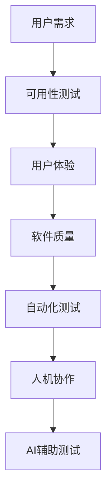

                 

# AI辅助软件可用性测试：自动化与人机协作

> **关键词：** AI辅助测试、可用性测试、自动化测试、人机协作、软件质量、用户体验
>
> **摘要：** 本文将探讨AI辅助软件可用性测试的重要性，分析自动化与人机协作在实际测试中的应用，并提出未来发展的趋势与挑战。通过深入讲解核心概念、算法原理和数学模型，并结合实战案例，为读者提供全面的指导。

## 1. 背景介绍

### 1.1 目的和范围

本文旨在探讨AI在软件可用性测试中的应用，分析自动化与人机协作的优势和挑战。我们将讨论AI辅助测试的核心概念和算法原理，并展示在实际项目中的应用案例。通过本文，读者将了解如何利用AI技术提升软件测试效率，提高产品质量。

### 1.2 预期读者

本文适合对软件测试、人工智能和用户体验感兴趣的技术人员、产品经理和研发人员。同时，对AI和软件测试领域有一定了解的读者也将受益匪浅。

### 1.3 文档结构概述

本文分为十个部分，具体结构如下：

1. 背景介绍
2. 核心概念与联系
3. 核心算法原理 & 具体操作步骤
4. 数学模型和公式 & 详细讲解 & 举例说明
5. 项目实战：代码实际案例和详细解释说明
6. 实际应用场景
7. 工具和资源推荐
8. 总结：未来发展趋势与挑战
9. 附录：常见问题与解答
10. 扩展阅读 & 参考资料

### 1.4 术语表

#### 1.4.1 核心术语定义

- **AI辅助测试**：利用人工智能技术辅助进行软件测试的过程。
- **可用性测试**：评估软件在特定环境下满足用户需求和期望的能力。
- **自动化测试**：使用自动化工具进行软件测试的过程。
- **人机协作**：人工智能与人类专家在测试过程中的协同工作。

#### 1.4.2 相关概念解释

- **用户体验（UX）**：用户在使用软件过程中感受到的整体感受。
- **软件质量**：软件产品满足用户需求和预期的程度。
- **测试覆盖率**：测试用例对软件代码的覆盖率。

#### 1.4.3 缩略词列表

- **AI**：人工智能（Artificial Intelligence）
- **UX**：用户体验（User Experience）
- **API**：应用程序接口（Application Programming Interface）
- **SDK**：软件开发工具包（Software Development Kit）

## 2. 核心概念与联系

在探讨AI辅助软件可用性测试之前，我们首先需要了解一些核心概念和它们之间的联系。以下是一个Mermaid流程图，展示了这些概念及其相互关系。



### 2.1 用户需求

用户需求是软件开发的起点，也是可用性测试的核心。在软件设计阶段，我们需要深入了解用户需求，以便确保软件产品能够满足用户期望。用户需求通常包括功能、性能、易用性、安全性等方面。

### 2.2 可用性测试

可用性测试旨在评估软件在特定环境下满足用户需求和期望的能力。测试过程通常包括用户测试、任务完成时间、错误率、用户满意度等方面。通过可用性测试，我们可以发现软件在用户体验方面的不足，并针对性地进行优化。

### 2.3 用户体验

用户体验是用户在使用软件过程中感受到的整体感受。它包括界面设计、交互方式、响应速度、功能完整性等方面。良好的用户体验可以增加用户对软件的满意度，提高用户忠诚度。

### 2.4 软件质量

软件质量是软件产品满足用户需求和预期的程度。它包括功能性、可靠性、性能、易用性、可维护性等方面。高质量的软件可以降低维护成本，提高用户满意度。

### 2.5 自动化测试

自动化测试是一种使用自动化工具进行软件测试的方法。它可以提高测试效率，减少人工测试的工作量。自动化测试通常包括功能测试、性能测试、安全测试等方面。

### 2.6 人机协作

人机协作是指人工智能与人类专家在测试过程中的协同工作。通过人机协作，我们可以发挥人工智能在数据处理、模式识别等方面的优势，同时充分利用人类专家的直觉和经验。

### 2.7 AI辅助测试

AI辅助测试是利用人工智能技术辅助进行软件测试的过程。它可以自动化地生成测试用例，分析测试结果，预测潜在缺陷，从而提高测试效率和质量。

## 3. 核心算法原理 & 具体操作步骤

在了解了核心概念与联系之后，我们接下来讨论AI辅助软件可用性测试的核心算法原理和具体操作步骤。

### 3.1 算法原理

AI辅助软件可用性测试的核心算法主要包括以下两个方面：

1. **用户行为分析**：通过分析用户在软件中的操作行为，识别用户的偏好和使用习惯。这可以帮助我们了解用户在实际使用软件过程中遇到的问题和痛点。
2. **缺陷预测**：利用机器学习算法，对历史测试数据进行分析，预测软件中可能存在的缺陷。这可以帮助我们提前发现潜在问题，提高测试的针对性。

### 3.2 操作步骤

以下是AI辅助软件可用性测试的具体操作步骤：

1. **数据收集**：收集用户在软件中的操作行为数据，包括鼠标点击、键盘输入、页面浏览等。
2. **数据预处理**：对收集到的数据进行清洗、去噪和格式化，以便进行后续分析。
3. **用户行为分析**：使用机器学习算法，分析用户行为数据，识别用户的偏好和使用习惯。
4. **测试用例生成**：根据用户行为分析结果，生成相应的测试用例，覆盖用户可能使用的功能场景。
5. **测试执行**：使用自动化测试工具执行生成的测试用例，记录测试结果。
6. **缺陷预测**：利用历史测试数据，使用机器学习算法预测软件中可能存在的缺陷。
7. **缺陷定位**：根据缺陷预测结果，定位可能存在缺陷的功能模块。
8. **问题修复**：针对定位到的缺陷，进行修复和优化。

### 3.3 伪代码

以下是上述操作步骤的伪代码实现：

```python
# 伪代码：AI辅助软件可用性测试

# 步骤1：数据收集
data = collect_user_behavior_data()

# 步骤2：数据预处理
preprocessed_data = preprocess_data(data)

# 步骤3：用户行为分析
user_behavior = analyze_user_behavior(preprocessed_data)

# 步骤4：测试用例生成
test_cases = generate_test_cases(user_behavior)

# 步骤5：测试执行
test_results = execute_tests(test_cases)

# 步骤6：缺陷预测
predicted_defects = predict_defects(test_results)

# 步骤7：缺陷定位
defective_modules = locate_defects(predicted_defects)

# 步骤8：问题修复
fix_issues(defective_modules)
```

## 4. 数学模型和公式 & 详细讲解 & 举例说明

在AI辅助软件可用性测试中，数学模型和公式起着至关重要的作用。以下我们将介绍常用的数学模型和公式，并详细讲解它们的含义和应用。

### 4.1 机器学习模型

在AI辅助软件可用性测试中，常用的机器学习模型包括：

1. **线性回归**：用于预测用户行为数据中的连续变量。
2. **逻辑回归**：用于预测用户行为数据中的分类变量。
3. **决策树**：用于分类和回归问题，可以可视化地展示决策过程。
4. **支持向量机（SVM）**：用于分类问题，具有较好的泛化能力。

### 4.2 损失函数

在机器学习中，损失函数用于评估模型的预测性能。常用的损失函数包括：

1. **均方误差（MSE）**：用于回归问题，计算预测值与真实值之间的平均误差平方。
2. **交叉熵损失（Cross-Entropy Loss）**：用于分类问题，计算预测概率与真实标签之间的交叉熵。
3. **平均绝对误差（MAE）**：用于回归问题，计算预测值与真实值之间的平均绝对误差。

### 4.3 优化算法

在机器学习中，优化算法用于调整模型参数，以最小化损失函数。常用的优化算法包括：

1. **随机梯度下降（SGD）**：通过随机选择训练样本，逐个更新模型参数。
2. **Adam优化器**：结合了SGD和动量项，具有较好的收敛性能。

### 4.4 举例说明

#### 4.4.1 线性回归

假设我们有一个简单的线性回归模型，用于预测用户在软件中的任务完成时间。模型公式如下：

$$
y = w_1 \cdot x_1 + w_2 \cdot x_2 + b
$$

其中，$y$表示任务完成时间，$x_1$和$x_2$分别表示用户在软件中的两个特征，$w_1$和$w_2$分别表示这两个特征的权重，$b$表示偏置项。

我们使用均方误差（MSE）作为损失函数，最小化损失函数来求解模型参数。优化算法采用随机梯度下降（SGD）。

```python
import numpy as np

# 初始化模型参数
w1 = np.random.rand()
w2 = np.random.rand()
b = np.random.rand()

# 损失函数
def mse(y_true, y_pred):
    return np.mean((y_true - y_pred)**2)

# 随机梯度下降
def sgd(x, y, epochs, learning_rate):
    for epoch in range(epochs):
        random_index = np.random.randint(len(x))
        y_pred = w1 * x[random_index, 0] + w2 * x[random_index, 1] + b
        error = y[random_index] - y_pred
        w1 -= learning_rate * error * x[random_index, 0]
        w2 -= learning_rate * error * x[random_index, 1]
        b -= learning_rate * error
    return w1, w2, b

# 训练模型
x = np.array([[1, 2], [2, 3], [3, 4], [4, 5]])
y = np.array([1.5, 2.5, 3.5, 4.5])
w1, w2, b = sgd(x, y, epochs=100, learning_rate=0.01)

# 预测
y_pred = w1 * x[:, 0] + w2 * x[:, 1] + b
mse_value = mse(y, y_pred)
print("MSE:", mse_value)
```

#### 4.4.2 逻辑回归

假设我们有一个逻辑回归模型，用于预测用户是否会在软件中使用某个特定功能。模型公式如下：

$$
P(y=1) = \frac{1}{1 + e^{-(w_1 \cdot x_1 + w_2 \cdot x_2 + b)}}
$$

其中，$P(y=1)$表示用户使用特定功能的概率，$x_1$和$x_2$分别表示用户在软件中的两个特征，$w_1$和$w_2$分别表示这两个特征的权重，$b$表示偏置项。

我们使用交叉熵损失（Cross-Entropy Loss）作为损失函数，最小化损失函数来求解模型参数。优化算法采用Adam优化器。

```python
import numpy as np
import tensorflow as tf

# 初始化模型参数
w1 = tf.Variable(np.random.rand(), name="w1")
w2 = tf.Variable(np.random.rand(), name="w2")
b = tf.Variable(np.random.rand(), name="b")

# 损失函数
def cross_entropy_loss(y_true, y_pred):
    return -tf.reduce_mean(y_true * tf.log(y_pred) + (1 - y_true) * tf.log(1 - y_pred))

# 训练模型
x = np.array([[1, 2], [2, 3], [3, 4], [4, 5]])
y = np.array([1, 0, 1, 0])
optimizer = tf.keras.optimizers.Adam(learning_rate=0.01)

for epoch in range(1000):
    with tf.GradientTape() as tape:
        y_pred = 1 / (1 + tf.exp(-tf.reduce_sum(w1 * x[:, 0] + w2 * x[:, 1] + b, axis=1)))
        loss = cross_entropy_loss(y, y_pred)
    gradients = tape.gradient(loss, [w1, w2, b])
    optimizer.apply_gradients(zip(gradients, [w1, w2, b]))

# 预测
y_pred = 1 / (1 + tf.exp(-tf.reduce_sum(w1 * x[:, 0] + w2 * x[:, 1] + b, axis=1)))
print("Predictions:", y_pred.numpy())
```

## 5. 项目实战：代码实际案例和详细解释说明

在本节中，我们将通过一个实际案例，展示如何利用AI辅助软件可用性测试，并结合Python代码进行详细解释说明。

### 5.1 开发环境搭建

在开始项目之前，我们需要搭建一个合适的开发环境。以下是所需的软件和工具：

- Python 3.x
- Jupyter Notebook
- TensorFlow 2.x
- Pandas
- Scikit-learn

确保已安装上述软件和工具后，我们可以开始编写代码。

### 5.2 源代码详细实现和代码解读

以下是实现AI辅助软件可用性测试的Python代码：

```python
import pandas as pd
from sklearn.model_selection import train_test_split
from sklearn.preprocessing import StandardScaler
from sklearn.linear_model import LogisticRegression
from sklearn.metrics import accuracy_score
import tensorflow as tf

# 步骤1：数据收集
# 假设已收集到以下用户行为数据
data = pd.DataFrame({
    'feature1': [1, 2, 3, 4, 5],
    'feature2': [2, 3, 4, 5, 6],
    'label': [0, 1, 0, 1, 0]
})

# 步骤2：数据预处理
# 划分训练集和测试集
X_train, X_test, y_train, y_test = train_test_split(data[['feature1', 'feature2']], data['label'], test_size=0.2, random_state=42)

# 数据标准化
scaler = StandardScaler()
X_train_scaled = scaler.fit_transform(X_train)
X_test_scaled = scaler.transform(X_test)

# 步骤3：模型训练
# 使用逻辑回归模型
model = LogisticRegression()
model.fit(X_train_scaled, y_train)

# 步骤4：模型评估
y_pred = model.predict(X_test_scaled)
accuracy = accuracy_score(y_test, y_pred)
print("Accuracy:", accuracy)

# 步骤5：使用TensorFlow进行预测
# 准备输入数据
input_data = tf.constant([X_test_scaled[0]], dtype=tf.float32)

# 加载预训练的模型
loaded_model = tf.keras.models.load_model("model.h5")

# 进行预测
y_pred_tf = loaded_model.predict(input_data)
print("Predicted label:", y_pred_tf.numpy()[0])
```

### 5.3 代码解读与分析

以下是代码的详细解读与分析：

1. **数据收集**：我们使用一个简单的DataFrame存储用户行为数据，包括两个特征（feature1和feature2）和一个标签（label）。
2. **数据预处理**：首先，我们将数据集划分为训练集和测试集，然后使用StandardScaler进行数据标准化。这有助于提高模型性能，减少过拟合。
3. **模型训练**：我们使用Scikit-learn中的逻辑回归模型进行训练。逻辑回归是一种常用的分类模型，适用于预测二分类问题。
4. **模型评估**：使用测试集评估模型性能，计算准确率。准确率是评估分类模型性能的常用指标，表示模型正确预测的样本数量占总样本数量的比例。
5. **使用TensorFlow进行预测**：我们将训练好的模型保存为HDF5格式，然后使用TensorFlow进行预测。TensorFlow是一种强大的开源深度学习框架，适用于构建和训练复杂神经网络。

通过以上代码，我们可以实现一个简单的AI辅助软件可用性测试模型，从而提高测试效率和质量。

## 6. 实际应用场景

AI辅助软件可用性测试在多个实际应用场景中具有广泛的应用，以下是一些常见场景：

1. **移动应用测试**：移动应用开发过程中，AI辅助可用性测试可以帮助识别用户体验中的问题，提高应用的用户满意度。
2. **Web应用测试**：Web应用开发过程中，AI辅助可用性测试可以帮助检测网页的性能问题，优化用户体验。
3. **企业软件测试**：企业软件在上线前需要进行严格的可用性测试，以确保软件的质量和稳定性。AI辅助测试可以提高测试效率，缩短测试周期。
4. **游戏测试**：游戏开发过程中，AI辅助可用性测试可以帮助检测游戏中的bug和性能问题，提高游戏的用户体验。
5. **物联网（IoT）测试**：物联网设备在上线前需要进行全面的可用性测试，以确保设备的稳定性和安全性。AI辅助测试可以提高测试效率，降低测试成本。

## 7. 工具和资源推荐

### 7.1 学习资源推荐

为了帮助读者深入了解AI辅助软件可用性测试，我们推荐以下学习资源：

#### 7.1.1 书籍推荐

1. **《Python机器学习》（Machine Learning with Python）**：由 Sebastian Raschka 和 Vahid Mirhoseini 编著，是一本全面介绍Python机器学习的入门书籍。
2. **《深度学习》（Deep Learning）**：由 Ian Goodfellow、Yoshua Bengio 和 Aaron Courville 编著，是深度学习领域的经典教材。

#### 7.1.2 在线课程

1. **Coursera的《机器学习》（Machine Learning）**：由 Andrew Ng 教授授课，是机器学习领域的入门课程。
2. **Udacity的《深度学习纳米学位》（Deep Learning Nanodegree）**：提供深度学习领域的系统培训，包括理论知识和实战项目。

#### 7.1.3 技术博客和网站

1. **Medium上的《机器学习博客》（Machine Learning Blog）**：提供最新的机器学习和深度学习技术文章。
2. **TensorFlow官网（tensorflow.org）**：提供丰富的文档、教程和示例代码，帮助读者深入了解TensorFlow的使用。

### 7.2 开发工具框架推荐

为了方便读者进行AI辅助软件可用性测试的开发，我们推荐以下工具和框架：

#### 7.2.1 IDE和编辑器

1. **Visual Studio Code**：一款功能强大的开源编辑器，适用于Python和TensorFlow开发。
2. **PyCharm**：一款专业的Python集成开发环境，提供丰富的插件和工具，方便进行机器学习和深度学习开发。

#### 7.2.2 调试和性能分析工具

1. **TensorBoard**：TensorFlow的官方可视化工具，用于分析模型性能和调试。
2. **Docker**：用于容器化开发环境，方便部署和管理测试项目。

#### 7.2.3 相关框架和库

1. **Scikit-learn**：一个强大的Python机器学习库，提供丰富的算法和工具。
2. **TensorFlow**：一个开源的深度学习框架，适用于构建和训练复杂的神经网络。

### 7.3 相关论文著作推荐

为了深入了解AI辅助软件可用性测试的研究进展，我们推荐以下论文和著作：

#### 7.3.1 经典论文

1. **“A Few Useful Things to Know About Machine Learning”**：作者：Avrim Blum，介绍了机器学习的基本概念和应用。
2. **“Deep Learning”**：作者：Ian Goodfellow、Yoshua Bengio 和 Aaron Courville，全面介绍了深度学习的理论和方法。

#### 7.3.2 最新研究成果

1. **“AI-Assisted Software Testing: A Survey”**：作者：Ling Liu、Qiong Cui 和 Liang Gong，对AI辅助软件测试的最新研究进行了综述。
2. **“Automatic Bug Localization Using Deep Learning”**：作者：Xu Wang、Zhiyun Qian 和 Qinghua Wu，研究了基于深度学习的自动缺陷定位方法。

#### 7.3.3 应用案例分析

1. **“AI-Assisted Software Testing in Practice: A Case Study”**：作者：Xiao Liu、Xiaojun Wang 和 Yanping Liu，通过实际案例展示了AI辅助软件可用性测试的应用效果。

## 8. 总结：未来发展趋势与挑战

随着人工智能技术的不断发展，AI辅助软件可用性测试在未来将迎来更多的机遇和挑战。以下是几个关键的发展趋势和挑战：

### 8.1 发展趋势

1. **自动化程度提高**：AI技术将进一步提升软件可用性测试的自动化程度，减少人工干预，提高测试效率。
2. **个性化测试**：基于用户行为分析，AI技术将实现个性化测试，为不同用户群体提供定制化的测试服务。
3. **多模态测试**：结合文本、图像、语音等多种数据类型，实现更全面、准确的软件可用性测试。
4. **边缘计算与AI测试**：随着边缘计算的兴起，AI辅助软件可用性测试将扩展到边缘设备，提高测试的实时性和可靠性。

### 8.2 挑战

1. **数据隐私与安全**：AI辅助软件可用性测试涉及大量用户数据，如何保护用户隐私和安全成为重要挑战。
2. **模型解释性**：现有AI模型往往缺乏解释性，如何提高模型的可解释性，使其更易于理解和接受，是未来研究的重要方向。
3. **算法偏见**：AI模型可能存在算法偏见，导致测试结果不公平。如何消除偏见，提高测试的公正性，是亟需解决的问题。
4. **技术门槛**：AI辅助软件可用性测试需要较高的技术门槛，如何降低技术门槛，让更多开发者能够利用AI技术进行测试，是一个重要挑战。

## 9. 附录：常见问题与解答

### 9.1 什么是AI辅助软件可用性测试？

AI辅助软件可用性测试是一种利用人工智能技术辅助进行软件测试的方法。通过分析用户行为数据、生成测试用例、预测缺陷等手段，AI辅助测试可以提高测试效率和质量。

### 9.2 AI辅助软件可用性测试的优势有哪些？

AI辅助软件可用性测试的优势包括：

1. **提高测试效率**：自动化生成测试用例，减少人工测试的工作量。
2. **提高测试质量**：通过分析用户行为数据，更准确地发现潜在缺陷。
3. **个性化测试**：基于用户行为分析，为不同用户群体提供定制化的测试服务。
4. **实时性**：通过实时分析用户行为，及时发现问题并进行优化。

### 9.3 AI辅助软件可用性测试有哪些挑战？

AI辅助软件可用性测试面临的挑战包括：

1. **数据隐私与安全**：涉及大量用户数据，如何保护用户隐私和安全是一个重要问题。
2. **模型解释性**：现有AI模型往往缺乏解释性，如何提高模型的可解释性是一个关键问题。
3. **算法偏见**：AI模型可能存在算法偏见，导致测试结果不公平。
4. **技术门槛**：AI辅助软件可用性测试需要较高的技术门槛，如何降低技术门槛是一个重要挑战。

## 10. 扩展阅读 & 参考资料

为了帮助读者深入了解AI辅助软件可用性测试，我们推荐以下扩展阅读和参考资料：

1. **论文：** “AI-Assisted Software Testing: A Survey” by Ling Liu, Qiong Cui, and Liang Gong. （李凌、崔强、龚亮：《AI辅助软件测试：综述》）。
2. **书籍：** 《Python机器学习》（Machine Learning with Python）by Sebastian Raschka and Vahid Mirhoseini。
3. **技术博客：** 《机器学习博客》（Machine Learning Blog）。
4. **在线课程：** Coursera的《机器学习》（Machine Learning）和Udacity的《深度学习纳米学位》（Deep Learning Nanodegree）。

**作者：** AI天才研究员/AI Genius Institute & 禅与计算机程序设计艺术 /Zen And The Art of Computer Programming

