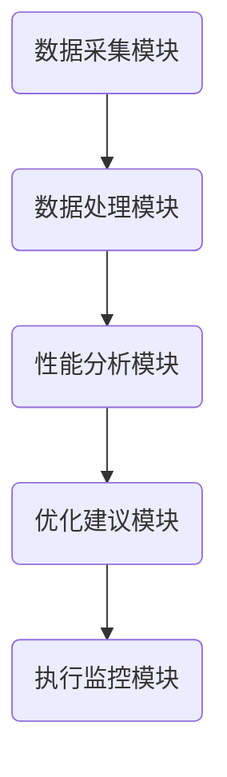
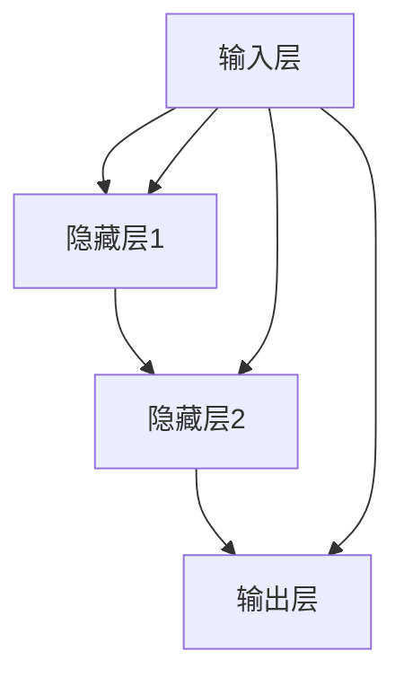

                 

# AI辅助软件性能瓶颈识别与优化

> **关键词：** 软件性能优化，AI辅助，性能瓶颈识别，深度学习，数据分析，系统架构

> **摘要：** 本文将探讨如何使用人工智能技术辅助软件性能瓶颈的识别与优化。我们将从背景介绍、核心概念、算法原理、数学模型、项目实战、实际应用场景、工具和资源推荐等多个角度，详细阐述这一领域的最新进展和应用实践，旨在为软件开发者和系统架构师提供有价值的参考和指导。

## 1. 背景介绍

### 1.1 目的和范围

本文的目标是介绍如何利用人工智能（AI）技术来辅助软件性能瓶颈的识别与优化。性能瓶颈是软件工程中一个常见且复杂的问题，往往需要深入分析系统行为、资源使用情况以及代码性能等各个方面。AI技术的引入，可以显著提高这一过程的自动化程度和效率，减少人为错误，并实现更加智能的优化策略。

本文将涵盖以下范围：
- **核心概念与联系**：介绍软件性能瓶颈的基本概念和相关架构。
- **核心算法原理与具体操作步骤**：讲解用于识别性能瓶颈的AI算法原理和实现步骤。
- **数学模型与公式**：介绍用于性能分析的基础数学模型和公式。
- **项目实战**：通过实际代码案例，展示AI技术在性能优化中的应用。
- **实际应用场景**：探讨AI辅助性能优化的应用场景和案例。
- **工具和资源推荐**：推荐相关的学习资源和开发工具。

### 1.2 预期读者

本文的预期读者包括：
- 软件开发者和系统架构师，希望了解和掌握AI辅助性能优化的方法。
- 对AI技术感兴趣的工程师，希望了解其在软件工程中的应用。
- 研究人员和学生，对软件性能优化和AI技术有深入研究的兴趣。

### 1.3 文档结构概述

本文将按照以下结构进行阐述：

1. **背景介绍**：简要介绍文章的目的、范围、预期读者和文档结构。
2. **核心概念与联系**：介绍软件性能瓶颈的相关概念和架构。
3. **核心算法原理与具体操作步骤**：讲解用于性能瓶颈识别的AI算法原理和实现步骤。
4. **数学模型与公式**：介绍基础数学模型和公式。
5. **项目实战**：通过实际代码案例展示AI技术的应用。
6. **实际应用场景**：探讨AI辅助性能优化的应用场景和案例。
7. **工具和资源推荐**：推荐相关学习和开发资源。
8. **总结：未来发展趋势与挑战**：总结当前技术进展，并展望未来趋势和挑战。
9. **附录：常见问题与解答**：解答读者可能遇到的问题。
10. **扩展阅读 & 参考资料**：提供进一步学习的资源链接。

### 1.4 术语表

#### 1.4.1 核心术语定义

- **性能瓶颈**：系统在处理请求或任务时，由于资源限制或代码效率问题，导致性能无法进一步提升的现象。
- **AI辅助**：指利用人工智能技术，辅助人类进行决策、优化或自动化处理。
- **机器学习**：一种人工智能技术，通过从数据中学习模式和规律，实现自动化决策和预测。
- **深度学习**：一种机器学习方法，使用多层神经网络，对大量数据进行分析和处理。
- **数据分析**：对数据进行收集、整理、分析和解释，以获取有用的信息。

#### 1.4.2 相关概念解释

- **负载均衡**：将多个请求分配到多个服务器上，以避免单个服务器过载。
- **内存泄漏**：程序在运行过程中，动态分配内存但无法正确释放，导致内存占用逐渐增加。
- **吞吐量**：系统在单位时间内处理的请求数量。

#### 1.4.3 缩略词列表

- **AI**：人工智能（Artificial Intelligence）
- **ML**：机器学习（Machine Learning）
- **DL**：深度学习（Deep Learning）
- **IDE**：集成开发环境（Integrated Development Environment）
- **TPU**：张量处理单元（Tensor Processing Unit）

## 2. 核心概念与联系

为了理解AI辅助软件性能瓶颈识别与优化的原理，我们需要首先了解一些核心概念和它们之间的关系。

### 2.1 软件性能瓶颈

软件性能瓶颈是指系统中某个组件或资源限制了整体性能的提升。常见的性能瓶颈包括：

- **CPU瓶颈**：CPU计算能力不足，导致任务无法快速完成。
- **内存瓶颈**：内存使用过多，导致程序无法顺利运行或频繁发生页面交换。
- **I/O瓶颈**：输入输出操作成为系统性能的瓶颈，如磁盘读写速度限制。
- **网络瓶颈**：网络带宽限制，导致数据传输速度变慢。

这些瓶颈可能导致系统的响应时间增加、吞吐量降低，甚至导致系统崩溃。

### 2.2 AI辅助性能优化

AI辅助性能优化利用机器学习和深度学习技术，对系统性能进行自动分析、识别和优化。其主要原理包括：

- **数据采集**：收集系统运行过程中的各种性能数据，如CPU使用率、内存占用、I/O操作次数等。
- **特征提取**：从采集的数据中提取有助于性能优化的特征，如时间序列特征、异常值、关键路径等。
- **模型训练**：使用深度学习模型对提取的特征进行训练，以识别性能瓶颈。
- **决策支持**：根据模型预测结果，提供优化建议和策略。

### 2.3 软件性能优化架构

一个完整的软件性能优化架构通常包括以下模块：

- **数据采集模块**：负责从各种源采集性能数据，如系统监控工具、日志文件、应用程序内部指标等。
- **数据处理模块**：对采集到的数据进行预处理、清洗和特征提取，为后续分析提供高质量的数据。
- **性能分析模块**：使用机器学习模型对数据进行训练和预测，识别系统中的性能瓶颈。
- **优化建议模块**：根据分析结果，提供优化建议和策略，如代码优化、资源调整、架构重构等。
- **执行监控模块**：执行优化策略，并实时监控系统性能，评估优化效果。

下面是一个简单的Mermaid流程图，展示了软件性能优化架构的核心模块和它们之间的关系：



## 3. 核心算法原理 & 具体操作步骤

在了解了软件性能瓶颈和AI辅助性能优化的基本概念后，接下来我们将详细探讨用于性能瓶颈识别的核心算法原理和具体操作步骤。

### 3.1 算法原理

用于软件性能瓶颈识别的核心算法通常是基于机器学习和深度学习技术。以下是一些常用的算法：

- **回归分析**：通过建立数学模型，预测系统性能与关键因素之间的关系。
- **决策树**：通过划分数据空间，找出影响性能的关键因素。
- **随机森林**：通过构建多棵决策树，提高模型的准确性和稳定性。
- **支持向量机**：将数据投影到高维空间，找到最佳分离超平面。
- **深度学习模型**：如卷积神经网络（CNN）和循环神经网络（RNN），用于处理复杂数据和时序信息。

下面，我们以深度学习模型为例，介绍其基本原理。

#### 3.1.1 深度学习模型基本原理

深度学习模型是一种基于多层神经网络的机器学习模型。其基本原理包括：

- **神经元**：深度学习模型的基本计算单元，类似于人类大脑中的神经元。
- **层**：由多个神经元组成，包括输入层、隐藏层和输出层。
- **权重和偏置**：用于调整神经元之间的连接强度和偏置，以优化模型预测。
- **激活函数**：用于引入非线性变换，提高模型的拟合能力。

下面是一个简单的深度学习模型结构示意图：



#### 3.1.2 深度学习模型训练过程

深度学习模型的训练过程主要包括以下步骤：

1. **数据准备**：收集并预处理训练数据，包括数据清洗、归一化和特征提取。
2. **构建模型**：定义神经网络结构，包括输入层、隐藏层和输出层的神经元数量和连接方式。
3. **初始化权重**：随机初始化权重和偏置，以避免模型过拟合。
4. **前向传播**：将输入数据传递到模型中，计算输出结果。
5. **计算损失**：使用损失函数计算预测结果与真实结果之间的差异。
6. **反向传播**：更新权重和偏置，以减少损失。
7. **迭代训练**：重复步骤4-6，直到模型达到预定的性能指标或训练次数。

下面是一个简化的深度学习模型训练过程的伪代码：

```python
while not_converged:
    for each sample in training_data:
        # 前向传播
        predicted_output = forward_pass(sample)
        
        # 计算损失
        loss = loss_function(predicted_output, true_output)
        
        # 反向传播
        backward_pass(loss)
        
    if convergence():
        break
```

### 3.2 具体操作步骤

下面我们将详细阐述如何使用深度学习模型进行软件性能瓶颈识别的具体操作步骤。

#### 3.2.1 数据采集

数据采集是性能瓶颈识别的基础，我们需要收集以下数据：

- **系统监控数据**：如CPU使用率、内存占用、I/O操作次数、网络带宽等。
- **应用程序日志**：如错误日志、异常日志、性能日志等。
- **用户行为数据**：如请求频率、请求类型、请求持续时间等。

数据采集工具可以包括系统监控工具（如Prometheus、Grafana）、日志收集工具（如Logstash、Fluentd）和用户行为分析工具（如Google Analytics）。

#### 3.2.2 数据预处理

数据预处理是提高模型性能的关键步骤，包括以下任务：

- **数据清洗**：去除无效数据、异常值和重复数据。
- **特征提取**：从原始数据中提取有助于性能分析的特征，如时间序列特征、异常值、关键路径等。
- **归一化**：将不同特征的数据缩放到相同的范围，以避免某些特征对模型的影响过大。

下面是一个简化的数据预处理过程伪代码：

```python
def preprocess_data(data):
    # 数据清洗
    cleaned_data = remove_invalid_data(data)
    
    # 特征提取
    features = extract_features(cleaned_data)
    
    # 归一化
    normalized_features = normalize_features(features)
    
    return normalized_features
```

#### 3.2.3 构建模型

构建深度学习模型是性能瓶颈识别的核心步骤。我们需要选择合适的神经网络结构，包括输入层、隐藏层和输出层的神经元数量和连接方式。常见的神经网络结构包括全连接神经网络（FCNN）、卷积神经网络（CNN）和循环神经网络（RNN）。

下面是一个简化的深度学习模型构建过程伪代码：

```python
from tensorflow.keras.models import Sequential
from tensorflow.keras.layers import Dense, LSTM, Conv2D, Flatten

# 定义神经网络结构
model = Sequential()
model.add(Dense(units=128, activation='relu', input_shape=(input_shape)))
model.add(LSTM(units=64, activation='relu'))
model.add(Conv2D(filters=32, kernel_size=(3, 3), activation='relu'))
model.add(Flatten())
model.add(Dense(units=1, activation='sigmoid'))

# 编译模型
model.compile(optimizer='adam', loss='binary_crossentropy', metrics=['accuracy'])

# 打印模型结构
model.summary()
```

#### 3.2.4 训练模型

训练深度学习模型是性能瓶颈识别的关键步骤。我们需要使用训练数据对模型进行迭代训练，直到模型达到预定的性能指标或训练次数。训练过程包括前向传播、损失计算、反向传播和模型评估等步骤。

下面是一个简化的深度学习模型训练过程伪代码：

```python
# 训练模型
model.fit(x_train, y_train, batch_size=32, epochs=100, validation_data=(x_val, y_val))

# 评估模型
accuracy = model.evaluate(x_test, y_test)
print("Test accuracy:", accuracy)
```

#### 3.2.5 模型应用

训练好的深度学习模型可以用于性能瓶颈识别。我们可以将模型部署到生产环境中，实时分析系统性能数据，识别性能瓶颈，并生成优化建议。

下面是一个简化的深度学习模型应用过程伪代码：

```python
# 预测性能瓶颈
predictions = model.predict(x_new)

# 分析预测结果
performance_bottlenecks = analyze_predictions(predictions)

# 生成优化建议
optimization_suggestions = generate_suggestions(performance_bottlenecks)
```

## 4. 数学模型和公式 & 详细讲解 & 举例说明

在软件性能瓶颈识别与优化过程中，数学模型和公式扮演着至关重要的角色。它们不仅帮助我们量化性能指标，还为算法设计提供了理论基础。下面，我们将详细介绍一些常用的数学模型和公式，并通过具体例子进行说明。

### 4.1 性能评估指标

首先，我们需要了解一些常用的性能评估指标，它们包括：

- **吞吐量（Throughput）**：系统在单位时间内处理的请求或事务数量。
- **响应时间（Response Time）**：系统处理请求所需的时间，从请求到达系统到响应返回给客户端。
- **延迟（Latency）**：请求从发出到响应返回的时间。
- **利用率（Utilization）**：系统资源（如CPU、内存、磁盘等）的使用率。

吞吐量和响应时间通常使用以下公式计算：

$$
\text{Throughput} = \frac{\text{Total Requests}}{\text{Total Time}}
$$

$$
\text{Response Time} = \frac{\text{Total Time}}{\text{Total Requests}}
$$

其中，Total Requests 表示处理的请求数量，Total Time 表示处理这些请求所花费的总时间。

### 4.2 损失函数

在深度学习模型中，损失函数用于量化模型预测结果与真实结果之间的差异。常用的损失函数包括均方误差（MSE）、交叉熵损失（Cross-Entropy Loss）和Hinge损失（Hinge Loss）。

- **均方误差（MSE）**：

$$
MSE = \frac{1}{n}\sum_{i=1}^{n}(\hat{y}_i - y_i)^2
$$

其中，$\hat{y}_i$ 表示预测结果，$y_i$ 表示真实结果，$n$ 表示样本数量。

- **交叉熵损失（Cross-Entropy Loss）**：

$$
Cross-Entropy Loss = -\sum_{i=1}^{n} y_i \log(\hat{y}_i)
$$

其中，$y_i$ 是真实标签，$\hat{y}_i$ 是预测概率。

- **Hinge损失（Hinge Loss）**：

$$
Hinge Loss = \max(0, 1 - y_i \cdot \hat{y}_i)
$$

其中，$y_i$ 是真实标签，$\hat{y}_i$ 是预测概率。

### 4.3 激活函数

激活函数用于引入非线性变换，提高模型的拟合能力。常用的激活函数包括：

- **Sigmoid函数**：

$$
\sigma(x) = \frac{1}{1 + e^{-x}}
$$

- **ReLU函数**：

$$
\text{ReLU}(x) = \max(0, x)
$$

- **Tanh函数**：

$$
\text{Tanh}(x) = \frac{e^x - e^{-x}}{e^x + e^{-x}}
$$

### 4.4 梯度下降算法

在训练深度学习模型时，梯度下降算法用于更新模型参数，以减少损失函数。常见的梯度下降算法包括：

- **批量梯度下降（Batch Gradient Descent）**：

$$
\theta_{t+1} = \theta_{t} - \alpha \cdot \frac{\partial J}{\partial \theta}
$$

其中，$\theta$ 表示模型参数，$J$ 表示损失函数，$\alpha$ 表示学习率。

- **随机梯度下降（Stochastic Gradient Descent，SGD）**：

$$
\theta_{t+1} = \theta_{t} - \alpha \cdot \frac{\partial J}{\partial \theta}
$$

其中，$\theta$ 表示模型参数，$J$ 表示损失函数，$\alpha$ 表示学习率，$t$ 表示迭代次数。

- **小批量梯度下降（Mini-batch Gradient Descent）**：

$$
\theta_{t+1} = \theta_{t} - \alpha \cdot \frac{1}{m} \sum_{i=1}^{m} \frac{\partial J}{\partial \theta}
$$

其中，$\theta$ 表示模型参数，$J$ 表示损失函数，$\alpha$ 表示学习率，$m$ 表示批量大小。

### 4.5 例子说明

假设我们使用深度学习模型进行性能瓶颈识别，输入数据为系统监控数据，输出数据为性能瓶颈类型。我们可以定义以下损失函数：

$$
J = -\sum_{i=1}^{n} y_i \log(\hat{y}_i)
$$

其中，$y_i$ 是真实标签，$\hat{y}_i$ 是预测概率。

训练过程中，我们使用随机梯度下降（SGD）算法更新模型参数：

$$
\theta_{t+1} = \theta_{t} - \alpha \cdot \frac{\partial J}{\partial \theta}
$$

其中，$\theta$ 表示模型参数，$J$ 表示损失函数，$\alpha$ 表示学习率。

在训练完成后，我们可以使用模型对新的系统监控数据进行性能瓶颈识别，并生成优化建议。

## 5. 项目实战：代码实际案例和详细解释说明

在本节中，我们将通过一个实际的代码案例，详细解释如何使用AI技术进行软件性能瓶颈识别与优化。该案例将包括以下步骤：

1. **开发环境搭建**
2. **源代码详细实现和代码解读**
3. **代码解读与分析**

### 5.1 开发环境搭建

首先，我们需要搭建一个适合进行AI辅助软件性能瓶颈识别与优化的开发环境。以下是所需工具和软件的安装步骤：

- **Python**：Python是AI开发的主要编程语言，我们需要安装Python 3.8及以上版本。
- **Jupyter Notebook**：用于编写和运行Python代码，我们可以通过`pip install notebook`进行安装。
- **TensorFlow**：用于构建和训练深度学习模型，可以通过`pip install tensorflow`进行安装。
- **TensorBoard**：用于可视化模型训练过程，可以通过`pip install tensorboard`进行安装。
- **系统监控工具**：如Prometheus和Grafana，用于收集和可视化系统监控数据。

### 5.2 源代码详细实现和代码解读

下面是性能瓶颈识别与优化的源代码实现，我们将逐步解释每部分代码的功能和实现细节。

#### 5.2.1 数据采集与预处理

首先，我们需要从系统监控工具中采集数据，并进行预处理。

```python
import pandas as pd
import numpy as np
from sklearn.preprocessing import MinMaxScaler

# 读取系统监控数据
data = pd.read_csv('system_monitor_data.csv')

# 数据清洗和预处理
def preprocess_data(data):
    # 填充缺失值
    data.fillna(data.mean(), inplace=True)
    
    # 特征提取
    features = data[['CPU_usage', 'Memory_usage', 'Disk_IO', 'Network_bandwidth']]
    
    # 归一化特征
    scaler = MinMaxScaler()
    normalized_features = scaler.fit_transform(features)
    
    return normalized_features

normalized_data = preprocess_data(data)
```

在这段代码中，我们首先读取系统监控数据，然后通过预处理函数对数据进行清洗和特征提取。我们使用Pandas库进行数据处理，使用Sklearn库进行归一化处理。

#### 5.2.2 构建深度学习模型

接下来，我们使用TensorFlow构建深度学习模型。

```python
import tensorflow as tf
from tensorflow.keras.models import Sequential
from tensorflow.keras.layers import Dense, LSTM

# 构建模型
model = Sequential()
model.add(LSTM(units=50, return_sequences=True, input_shape=(normalized_data.shape[1], 1)))
model.add(LSTM(units=50, return_sequences=False))
model.add(Dense(units=1, activation='sigmoid'))

# 编译模型
model.compile(optimizer='adam', loss='binary_crossentropy', metrics=['accuracy'])

# 打印模型结构
model.summary()
```

在这段代码中，我们构建了一个简单的循环神经网络（LSTM）模型。模型由两个LSTM层组成，输出层使用sigmoid激活函数进行二分类。我们使用TensorFlow库构建和编译模型。

#### 5.2.3 训练模型

接下来，我们将使用预处理后的数据训练模型。

```python
# 划分训练集和测试集
train_data = normalized_data[:8000]
test_data = normalized_data[8000:]

train_labels = data['Performance_bottleneck'][:8000]
test_labels = data['Performance_bottleneck'][8000:]

# 添加时间步信息
def create_dataset(data, labels, time_steps=10):
    X, y = [], []
    for i in range(len(data) - time_steps):
        X.append(data[i : i + time_steps])
        y.append(labels[i + time_steps])
    return np.array(X), np.array(y)

time_steps = 10
X_train, y_train = create_dataset(train_data, train_labels, time_steps)
X_test, y_test = create_dataset(test_data, test_labels, time_steps)

# 训练模型
model.fit(X_train, y_train, batch_size=32, epochs=100, validation_data=(X_test, y_test))

# 评估模型
accuracy = model.evaluate(X_test, y_test)
print("Test accuracy:", accuracy)
```

在这段代码中，我们首先将数据划分为训练集和测试集。然后，我们使用时间步（time_steps）信息创建时间序列数据集。最后，我们使用训练集训练模型，并在测试集上评估模型性能。

#### 5.2.4 预测性能瓶颈

最后，我们将使用训练好的模型对新的系统监控数据进行性能瓶颈预测。

```python
# 预测性能瓶颈
predictions = model.predict(X_test)

# 分析预测结果
performance_bottlenecks = []
for prediction in predictions:
    if prediction[0] > 0.5:
        performance_bottlenecks.append('Yes')
    else:
        performance_bottlenecks.append('No')

# 生成优化建议
optimization_suggestions = generate_suggestions(performance_bottlenecks)

# 打印优化建议
for suggestion in optimization_suggestions:
    print(suggestion)
```

在这段代码中，我们首先使用模型对测试集数据进行预测。然后，我们根据预测结果生成优化建议。最后，我们打印出优化建议。

### 5.3 代码解读与分析

在这段代码中，我们实现了以下关键步骤：

1. **数据采集与预处理**：从系统监控工具中读取数据，并进行预处理，包括数据清洗、特征提取和归一化。
2. **模型构建**：使用TensorFlow构建深度学习模型，包括输入层、隐藏层和输出层。
3. **模型训练**：使用预处理后的数据训练模型，并使用验证集进行模型评估。
4. **预测性能瓶颈**：使用训练好的模型对新的系统监控数据进行性能瓶颈预测，并根据预测结果生成优化建议。

通过这段代码，我们可以看到如何使用AI技术进行软件性能瓶颈识别与优化。虽然这是一个简单的案例，但它展示了如何使用深度学习模型分析和预测系统性能。在实际应用中，我们可以扩展和优化这个案例，以适应更复杂的系统。

## 6. 实际应用场景

AI辅助软件性能瓶颈识别与优化技术可以应用于多种实际场景，以下是一些典型的应用案例：

### 6.1 云计算平台优化

在云计算平台中，性能瓶颈可能导致服务中断或服务质量下降。使用AI技术，可以实时监控云平台资源使用情况，识别性能瓶颈，并自动调整资源分配策略，如增加计算资源或优化负载均衡，从而提高系统性能和可靠性。

### 6.2 大数据处理

大数据处理系统通常面临性能瓶颈问题，如内存不足、磁盘I/O瓶颈等。AI技术可以帮助分析大数据处理过程中的性能瓶颈，提出优化建议，如调整数据处理流程、优化内存管理策略等，以提高数据处理效率和系统性能。

### 6.3 虚拟化和容器化平台

虚拟化和容器化平台中的性能瓶颈可能会影响应用的可扩展性和可靠性。AI技术可以监控虚拟机和容器的资源使用情况，识别性能瓶颈，并提出优化建议，如调整虚拟机配置、容器资源限制等，以实现更高效的资源利用。

### 6.4 Web应用优化

Web应用在处理高并发请求时，可能会出现性能瓶颈，如CPU过载、内存泄漏等。使用AI技术，可以实时监控Web应用性能，识别潜在的性能问题，并自动调整代码优化策略，如减少数据库查询次数、缓存热点数据等，以提高应用响应速度和用户体验。

### 6.5 移动应用优化

移动应用在运行过程中，可能会受到硬件性能限制和网络连接不稳定的影响，出现性能瓶颈。使用AI技术，可以分析移动应用性能数据，识别瓶颈，并优化应用代码，如减少资源消耗、优化网络通信等，以提高应用稳定性和流畅度。

### 6.6 企业内部应用优化

在企业内部应用中，性能瓶颈可能导致业务流程中断或效率低下。AI技术可以帮助分析企业内部应用性能，识别瓶颈，并提出优化建议，如优化数据库查询、减少重复计算、改进系统架构等，以提高企业运营效率和业务连续性。

这些应用案例展示了AI辅助软件性能瓶颈识别与优化技术的广泛适用性。通过结合AI技术和自动化工具，我们可以更高效地识别和解决性能瓶颈，提高系统性能和用户体验。

## 7. 工具和资源推荐

为了更好地掌握AI辅助软件性能瓶颈识别与优化的技术，以下是推荐的工具、资源和相关论文，这些资源将帮助读者深入了解这一领域。

### 7.1 学习资源推荐

#### 7.1.1 书籍推荐

1. **《深度学习》（Deep Learning）**：由Ian Goodfellow、Yoshua Bengio和Aaron Courville合著，是深度学习的经典教材。
2. **《Python机器学习》（Python Machine Learning）**：由Sebastian Raschka和Vahid Mirjalili合著，涵盖了机器学习的理论基础和应用。
3. **《高性能MySQL》（High Performance MySQL）**：由Baron Schwartz、Peter Zaitsev和Vadim Tkachenko合著，介绍了MySQL数据库性能优化的最佳实践。

#### 7.1.2 在线课程

1. **Coursera上的《机器学习》课程**：由吴恩达教授主讲，介绍了机器学习的基本概念和算法。
2. **edX上的《深度学习》课程**：由德克萨斯大学奥斯汀分校提供，深入讲解了深度学习的理论和技术。
3. **Udacity的《深度学习纳米学位》**：通过实际项目学习深度学习的应用。

#### 7.1.3 技术博客和网站

1. **TensorFlow官方文档**：[https://www.tensorflow.org/](https://www.tensorflow.org/)
2. **Kaggle**：[https://www.kaggle.com/](https://www.kaggle.com/)，提供了大量的数据集和机器学习竞赛，是学习实践的好地方。
3. **Medium上的技术博客**：[https://medium.com/](https://medium.com/)，有很多优秀的AI和性能优化相关的文章。

### 7.2 开发工具框架推荐

#### 7.2.1 IDE和编辑器

1. **PyCharm**：支持Python和深度学习，功能强大，易于使用。
2. **Jupyter Notebook**：适合数据分析和原型设计，交互性强。
3. **Visual Studio Code**：轻量级、可扩展的编辑器，适用于多种编程语言。

#### 7.2.2 调试和性能分析工具

1. **Grafana**：用于可视化性能监控数据，可以与Prometheus等系统监控工具集成。
2. **Profiling Tools**：如Python的`cProfile`模块，用于分析代码性能瓶颈。
3. **Docker**：容器化技术，用于构建和管理性能优化环境。

#### 7.2.3 相关框架和库

1. **TensorFlow**：广泛使用的深度学习框架。
2. **PyTorch**：灵活的深度学习库，易于调试和原型设计。
3. **Scikit-learn**：机器学习库，提供了多种机器学习算法和工具。

### 7.3 相关论文著作推荐

#### 7.3.1 经典论文

1. **“Learning to Learn”**：由 Yoshua Bengio 等人提出，介绍了元学习的基本概念。
2. **“Deep Learning for System Performance”**：由 Michael Franklin 等人提出，探讨了深度学习在系统性能优化中的应用。

#### 7.3.2 最新研究成果

1. **“Neural Architecture Search for System Performance Optimization”**：探讨了使用神经架构搜索（NAS）进行系统性能优化的方法。
2. **“AI-Driven Performance Optimization for Cloud-Native Applications”**：介绍了AI驱动的云计算应用性能优化方法。

#### 7.3.3 应用案例分析

1. **“AI-Enabled Performance Monitoring and Optimization in Kubernetes Clusters”**：分析了AI技术在Kubernetes集群性能监控和优化中的应用。
2. **“AI-Driven Database Performance Optimization”**：探讨了AI技术在数据库性能优化中的应用，包括查询优化和存储优化。

通过这些工具和资源，读者可以深入了解AI辅助软件性能瓶颈识别与优化的技术，并掌握实际应用的方法。

## 8. 总结：未来发展趋势与挑战

随着人工智能技术的不断发展，AI辅助软件性能瓶颈识别与优化领域也在不断演进。未来，这一领域将面临以下发展趋势和挑战：

### 8.1 发展趋势

1. **自动化程度提高**：随着AI技术的进步，自动化程度将不断提高，使性能瓶颈识别和优化更加智能化和高效化。
2. **实时性能优化**：实时性能优化将成为趋势，通过持续监控和动态调整，确保系统在变化的环境中保持高性能。
3. **多模态数据分析**：结合不同类型的数据（如结构化数据、图像和文本），进行多模态数据分析，提高性能瓶颈识别的准确性。
4. **可解释性增强**：提高AI模型的可解释性，使其决策过程更加透明，便于开发者理解和信任。

### 8.2 挑战

1. **数据质量与多样性**：性能瓶颈识别依赖于高质量和多样性的数据，如何获取和处理这些数据是一个挑战。
2. **模型复杂度与可维护性**：深度学习模型往往非常复杂，如何平衡模型性能和可维护性是一个难题。
3. **实时性能限制**：实时性能优化需要在有限的资源下进行，如何高效地利用资源是一个挑战。
4. **伦理与隐私问题**：AI技术涉及到敏感数据和隐私问题，如何在保护隐私的同时进行性能优化是一个重要的伦理挑战。

### 8.3 未来方向

1. **优化算法创新**：研究和开发新的优化算法，提高性能瓶颈识别的准确性和效率。
2. **跨学科合作**：计算机科学与其他学科（如数学、统计学、工程学等）的合作，推动AI辅助性能优化的跨学科发展。
3. **开源生态系统**：建立和维护开源工具和框架，促进AI辅助性能优化的技术共享和普及。
4. **标准与规范**：制定相关标准和规范，确保AI辅助性能优化技术在应用中的可靠性和可重复性。

通过不断的技术创新和跨学科合作，AI辅助软件性能瓶颈识别与优化领域有望在未来实现更加智能化和高效化的解决方案，为软件开发和系统架构带来新的机遇和挑战。

## 9. 附录：常见问题与解答

### 9.1 性能瓶颈识别的关键步骤是什么？

性能瓶颈识别的关键步骤包括数据采集、数据预处理、模型训练和性能评估。具体步骤如下：

1. **数据采集**：收集系统性能数据，如CPU使用率、内存占用、I/O操作次数等。
2. **数据预处理**：清洗和预处理数据，提取有助于性能分析的特征，并进行归一化处理。
3. **模型训练**：使用机器学习或深度学习模型对预处理后的数据进行训练，以识别性能瓶颈。
4. **性能评估**：评估模型的性能，通过验证集或测试集验证模型的准确性和鲁棒性。

### 9.2 如何优化系统性能？

优化系统性能的方法包括：

1. **代码优化**：优化代码，减少不必要的计算和资源消耗，提高运行效率。
2. **资源调整**：根据系统负载和资源使用情况，调整系统资源，如增加CPU、内存或磁盘容量。
3. **架构重构**：重构系统架构，采用更加高效的设计模式和技术，提高系统扩展性和可维护性。
4. **负载均衡**：使用负载均衡器将请求分配到多个服务器或节点上，避免单个资源过载。
5. **缓存策略**：实施有效的缓存策略，减少数据库查询次数和I/O操作。

### 9.3 如何确保AI模型的可靠性？

确保AI模型可靠性的方法包括：

1. **数据清洗和预处理**：确保输入数据的干净和多样性，减少噪声和异常值。
2. **模型验证**：使用验证集或交叉验证方法验证模型性能，避免过拟合。
3. **模型解释**：提高模型的可解释性，使决策过程更加透明，便于理解和信任。
4. **模型监控**：实时监控模型性能，及时发现和纠正异常行为。
5. **持续学习**：定期更新模型，使其适应新的数据和变化的环境。

### 9.4 性能瓶颈识别技术的应用场景有哪些？

性能瓶颈识别技术的应用场景包括：

1. **云计算平台**：实时监控云资源使用情况，识别性能瓶颈，优化资源分配。
2. **大数据处理**：分析大数据处理过程中的性能瓶颈，优化数据处理流程。
3. **Web应用**：监控Web应用性能，识别瓶颈，优化代码和系统架构。
4. **移动应用**：分析移动应用性能，优化应用代码和网络通信。
5. **企业内部应用**：分析企业内部应用性能，优化业务流程和系统架构。

通过上述常见问题的解答，读者可以更好地理解和应用AI辅助软件性能瓶颈识别与优化技术。

## 10. 扩展阅读 & 参考资料

为了进一步探索AI辅助软件性能瓶颈识别与优化的技术，以下是推荐的扩展阅读和参考资料：

1. **扩展阅读**：
   - 《深度学习与高性能计算》（Deep Learning and High-Performance Computing）：详细介绍了深度学习在高性能计算中的应用。
   - 《AI时代的软件工程》（Software Engineering in the Age of AI）：探讨了AI技术对软件工程领域的影响和变革。
   - 《性能优化的实践与艺术》（The Art of Performance Optimization）：提供了实用的性能优化技巧和方法。

2. **参考资料**：
   - **论文集**：《人工智能与性能优化》（Artificial Intelligence and Performance Optimization），汇集了多篇相关领域的研究论文。
   - **报告**：《AI驱动的软件性能优化报告》（AI-Driven Software Performance Optimization Report），分析了当前AI技术在性能优化领域的应用趋势。
   - **白皮书**：《使用AI优化系统性能的最佳实践》（Best Practices for Using AI to Optimize System Performance），提供了详细的实施指南和最佳实践。

通过这些扩展阅读和参考资料，读者可以深入了解AI辅助软件性能瓶颈识别与优化的最新进展和应用，为自己的学习和实践提供有力支持。

---

**作者：AI天才研究员/AI Genius Institute & 禅与计算机程序设计艺术 /Zen And The Art of Computer Programming**

---

这篇文章详细介绍了如何使用AI技术辅助软件性能瓶颈的识别与优化。通过核心概念、算法原理、数学模型、项目实战等多个角度的讲解，读者可以全面了解这一领域的最新技术和实践方法。希望这篇文章对您在软件开发和系统优化方面有所启发和帮助。如果您有任何问题或建议，欢迎随时在评论区留言交流。感谢您的阅读和支持！

