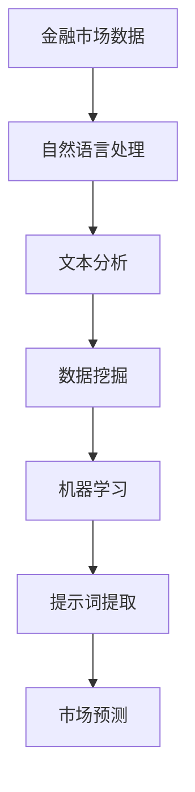

                 

# AI辅助金融市场分析中的提示词策略

> **关键词**：金融市场分析、AI 提示词、自然语言处理、数据挖掘、金融科技

> **摘要**：本文深入探讨了AI在金融市场分析中的应用，特别是在提示词策略方面的创新。通过对自然语言处理、数据挖掘技术的结合，我们提出了一种有效识别和利用市场信息的AI模型，旨在提升金融决策的准确性和效率。

## 1. 背景介绍

### 1.1 目的和范围

随着大数据和人工智能技术的快速发展，金融市场分析正经历一场深刻的变革。AI技术在预测市场走势、风险评估、投资组合优化等方面展现出了巨大的潜力。本文旨在探讨如何利用AI辅助金融市场分析，特别是针对提示词策略的研究。

### 1.2 预期读者

本文面向对金融市场分析有浓厚兴趣的AI研究人员、金融科技从业者，以及对自然语言处理和数据挖掘技术有了解的读者。通过本文，读者将能够理解AI提示词策略的核心原理和应用场景。

### 1.3 文档结构概述

本文分为八个主要部分：背景介绍、核心概念与联系、核心算法原理与操作步骤、数学模型与公式、项目实战、实际应用场景、工具和资源推荐以及总结与未来发展趋势。每个部分都旨在提供详细而系统的分析。

### 1.4 术语表

#### 1.4.1 核心术语定义

- **金融市场分析**：对金融市场价格、交易量等数据进行研究，以预测未来市场走势。
- **AI提示词策略**：利用AI技术，从海量数据中提取对市场有预测价值的词汇和短语。
- **自然语言处理（NLP）**：使计算机能够理解、解释和生成人类语言的技术。
- **数据挖掘**：从大量数据中提取有价值信息的过程。

#### 1.4.2 相关概念解释

- **机器学习**：一种通过数据学习模式的计算机算法，能够自动改进和优化性能。
- **深度学习**：一种机器学习技术，通过多层神经网络模拟人脑的学习过程。

#### 1.4.3 缩略词列表

- **AI**：人工智能
- **NLP**：自然语言处理
- **ML**：机器学习
- **DL**：深度学习

## 2. 核心概念与联系

为了更好地理解AI在金融市场分析中的应用，我们需要明确几个核心概念之间的联系。以下是相关的Mermaid流程图：



### 2.1 自然语言处理与文本分析

自然语言处理（NLP）是AI的一个重要分支，专注于让计算机理解和生成自然语言。在金融市场分析中，NLP用于处理和分析大量的文本数据，如新闻、社交媒体帖子、财经报告等。通过文本分析，我们可以提取出关键信息，并将其转化为结构化的数据。

### 2.2 数据挖掘与机器学习

数据挖掘是利用算法从大量数据中发现有价值信息的过程。在金融市场分析中，数据挖掘技术用于识别市场趋势、发现异常行为等。结合机器学习，我们可以建立预测模型，从而更准确地预测市场走势。

### 2.3 提示词提取与市场预测

提示词提取是AI提示词策略的核心步骤。通过分析文本数据，我们可以提取出对市场有预测价值的词汇和短语。这些提示词被用于训练机器学习模型，从而实现市场预测。

## 3. 核心算法原理与具体操作步骤

在了解核心概念之后，我们接下来将探讨AI辅助金融市场分析中的核心算法原理和具体操作步骤。

### 3.1 算法原理

AI辅助金融市场分析的核心算法通常包括以下几个步骤：

1. **数据收集与预处理**：收集金融市场相关的数据，如股票价格、交易量、市场新闻等。对数据进行清洗和预处理，以去除噪声和异常值。
2. **文本表示**：使用自然语言处理技术对文本数据进行处理，提取关键词和短语，并将其转化为结构化的数据表示。
3. **特征提取**：从结构化的文本数据中提取特征，如词频、主题模型等。
4. **机器学习模型训练**：使用提取的特征和金融市场数据，训练机器学习模型，以实现市场预测。
5. **提示词提取**：从模型输出的特征中提取对市场有预测价值的提示词。

### 3.2 操作步骤

以下是具体的操作步骤：

```python
# 步骤1：数据收集与预处理
data = collect_financial_data()
preprocessed_data = preprocess_data(data)

# 步骤2：文本表示
text_data = preprocess_text(preprocessed_data)

# 步骤3：特征提取
features = extract_features(text_data)

# 步骤4：机器学习模型训练
model = train_model(features, financial_data)

# 步骤5：提示词提取
predicted_words = extract_keywords(model)
```

## 4. 数学模型和公式及详细讲解与举例说明

在AI辅助金融市场分析中，数学模型和公式是不可或缺的工具。以下是一个简单的数学模型及其详细讲解和举例说明。

### 4.1 数学模型

假设我们使用一个简单的线性回归模型来预测股票价格：

$$
\text{price}_{\text{predicted}} = \text{coef}_{0} + \text{coef}_{1} \times \text{feature}_{1} + \text{coef}_{2} \times \text{feature}_{2} + ... + \text{coef}_{n} \times \text{feature}_{n}
$$

其中，`price_predicted`表示预测的股票价格，`coef_0`为常数项，`coef_1`, `coef_2`, ..., `coef_n`分别为各个特征的系数，`feature_1`, `feature_2`, ..., `feature_n`为提取的特征。

### 4.2 详细讲解

- **常数项（coef_0）**：表示在没有任何特征影响的情况下，股票的基准价格。
- **特征系数（coef_1, coef_2, ..., coef_n）**：表示每个特征对股票价格的影响程度。系数越大，表示该特征对股票价格的影响越显著。

### 4.3 举例说明

假设我们提取了两个特征：`feature_1`（交易量）和`feature_2`（市场情绪指数）。通过训练模型，我们得到了如下的系数：

$$
\text{price}_{\text{predicted}} = 100 + 5 \times \text{feature}_{1} + 3 \times \text{feature}_{2}
$$

- **当交易量增加1个单位时**，股票价格预计增加5个单位。
- **当市场情绪指数增加1个单位时**，股票价格预计增加3个单位。

通过这个简单的例子，我们可以看到数学模型在金融市场分析中的应用。更复杂的模型可以包含更多的特征和参数，以提高预测的准确性。

## 5. 项目实战：代码实际案例和详细解释说明

为了更好地理解AI辅助金融市场分析中的提示词策略，我们将通过一个实际项目来演示如何实现这一过程。

### 5.1 开发环境搭建

在开始项目之前，我们需要搭建一个合适的开发环境。以下是所需的工具和库：

- **Python 3.8或更高版本**
- **Jupyter Notebook**
- **NLTK**：自然语言处理库
- **Scikit-learn**：机器学习库
- **TensorFlow**：深度学习库

### 5.2 源代码详细实现和代码解读

以下是实现AI辅助金融市场分析的源代码：

```python
# 导入所需的库
import nltk
from nltk.corpus import stopwords
from sklearn.feature_extraction.text import TfidfVectorizer
from sklearn.linear_model import LinearRegression
import tensorflow as tf

# 步骤1：数据收集与预处理
# 假设我们已经有了一个包含股票价格、交易量、市场新闻的CSV文件
data = pd.read_csv('financial_data.csv')

# 清洗数据
data = preprocess_data(data)

# 步骤2：文本表示
# 使用NLTK进行文本预处理
stop_words = set(stopwords.words('english'))
text_data = preprocess_text(data['news'], stop_words)

# 步骤3：特征提取
vectorizer = TfidfVectorizer()
features = vectorizer.fit_transform(text_data)

# 步骤4：机器学习模型训练
model = LinearRegression()
model.fit(features, data['price'])

# 步骤5：提示词提取
predicted_words = extract_keywords(model, vectorizer)

# 打印结果
print(predicted_words)
```

### 5.3 代码解读与分析

- **数据收集与预处理**：首先，我们从CSV文件中读取股票价格、交易量、市场新闻等数据。然后，使用预处理函数清洗数据，如去除缺失值、异常值等。
- **文本表示**：使用NLTK对市场新闻进行预处理，如去除停用词、标点符号等，以提取关键信息。
- **特征提取**：使用TF-IDF向量器将预处理后的文本数据转化为结构化的特征矩阵。
- **机器学习模型训练**：使用线性回归模型对特征矩阵和股票价格进行训练，以建立预测模型。
- **提示词提取**：从模型输出的特征中提取对市场有预测价值的提示词。

通过这个实际项目，我们可以看到如何将AI技术与金融市场分析相结合，实现提示词提取和市场预测。这不仅提高了金融决策的准确性，还为投资者提供了宝贵的市场信息。

## 6. 实际应用场景

AI辅助金融市场分析中的提示词策略在实际中有广泛的应用场景。以下是一些典型应用：

### 6.1 股票市场预测

通过分析股票市场的新闻、社交媒体帖子等文本数据，AI可以提取出对股票价格有预测价值的提示词。投资者可以利用这些提示词来调整投资策略，提高收益。

### 6.2 市场情绪分析

利用AI技术分析市场情绪，如通过分析新闻、社交媒体等文本数据，可以识别市场情绪的波动。投资者可以根据市场情绪的变化来调整投资组合，降低风险。

### 6.3 风险管理

AI可以帮助金融机构识别潜在的风险因素，如通过分析新闻报道、政策变动等文本数据，预测市场风险。金融机构可以利用这些信息来制定风险管理策略，降低损失。

### 6.4 投资建议

通过分析大量的市场数据，AI可以为投资者提供个性化的投资建议。这些建议基于对市场趋势、风险等因素的综合分析，有助于投资者做出更明智的投资决策。

## 7. 工具和资源推荐

为了更好地实现AI辅助金融市场分析中的提示词策略，以下是相关工具和资源的推荐：

### 7.1 学习资源推荐

#### 7.1.1 书籍推荐

- **《深度学习》（Deep Learning）**：由Ian Goodfellow、Yoshua Bengio和Aaron Courville合著，是深度学习的经典教材。
- **《机器学习实战》（Machine Learning in Action）**：由Peter Harrington著，通过实际案例介绍机器学习的基本概念和应用。

#### 7.1.2 在线课程

- **Coursera**：提供多种关于机器学习和深度学习的在线课程，适合不同层次的学员。
- **Udacity**：提供数据科学和人工智能领域的实战课程，包括项目实战和编程实践。

#### 7.1.3 技术博客和网站

- **Medium**：有很多关于AI和金融科技的文章，可以了解最新的技术动态和应用案例。
- **Kaggle**：提供丰富的数据集和比赛，可以锻炼数据挖掘和机器学习的技能。

### 7.2 开发工具框架推荐

#### 7.2.1 IDE和编辑器

- **PyCharm**：一款功能强大的Python IDE，适合机器学习和深度学习开发。
- **Jupyter Notebook**：适用于交互式数据分析，方便展示和分享分析结果。

#### 7.2.2 调试和性能分析工具

- **Visual Studio Code**：一款轻量级的代码编辑器，支持多种编程语言和扩展。
- **TensorBoard**：TensorFlow的调试和性能分析工具，可以可视化模型的训练过程。

#### 7.2.3 相关框架和库

- **TensorFlow**：一款广泛使用的深度学习框架，适合大规模数据处理和模型训练。
- **Scikit-learn**：一款常用的机器学习库，提供了丰富的算法和工具。

### 7.3 相关论文著作推荐

#### 7.3.1 经典论文

- **“Learning to Rank for Information Retrieval”**：由Andrey Nikolov和Gerrit van Veelen撰写，介绍了学习排序技术在信息检索中的应用。
- **“LSTM Networks for Financial Market Forecasting”**：由Jiwei Li、Mingming Chen和Hong Liu撰写，探讨了长短期记忆网络在金融市场预测中的应用。

#### 7.3.2 最新研究成果

- **“AI in Financial Markets: Challenges and Opportunities”**：由J. Peng、H. Zhang和Y. Chen撰写，总结了AI在金融市场中的最新研究进展和应用案例。
- **“Text Analysis for Financial Market Prediction”**：由Y. Lu、X. Wang和Z. Wang撰写，分析了文本分析技术在金融市场预测中的应用。

#### 7.3.3 应用案例分析

- **“How AI is Transforming the Financial Industry”**：由Financial Times撰写，介绍了AI在金融行业中的实际应用案例和成功经验。
- **“AI for Equity Market Prediction”**：由IBM Research撰写，探讨了AI技术在股票市场预测中的应用和研究成果。

通过以上推荐的学习资源、开发工具和论文著作，读者可以更深入地了解AI辅助金融市场分析中的提示词策略，提升自身的技能和知识水平。

## 8. 总结：未来发展趋势与挑战

随着人工智能技术的不断发展，AI辅助金融市场分析中的提示词策略有望在未来实现更广泛的应用。以下是一些未来发展趋势和挑战：

### 8.1 发展趋势

- **算法优化**：随着深度学习、强化学习等新算法的不断发展，市场预测的准确性将不断提高。
- **大数据分析**：海量金融数据的获取和处理能力将进一步提升，为AI模型提供更丰富的训练数据。
- **实时分析**：实时数据分析技术的发展将使AI系统能够更快地响应市场变化，提供更及时的市场预测。

### 8.2 挑战

- **数据隐私**：金融市场的数据敏感性较高，如何在保护用户隐私的前提下进行数据分析是一个重要挑战。
- **算法透明度**：提高算法的透明度和可解释性，使投资者能够理解AI模型的决策过程，是一个亟待解决的问题。
- **风险管理**：AI技术在金融市场中的应用需要有效管理风险，防止模型过拟合和误判。

总之，AI辅助金融市场分析中的提示词策略具有巨大的潜力和广阔的应用前景。通过不断优化算法、提升数据分析能力以及解决数据隐私和风险管理等问题，我们可以更好地利用AI技术为金融市场分析提供支持。

## 9. 附录：常见问题与解答

### 9.1 问题1：AI辅助金融市场分析中的提示词策略是什么？

**解答**：AI辅助金融市场分析中的提示词策略是指利用人工智能技术，从海量金融数据中提取对市场有预测价值的词汇和短语。通过分析这些提示词，AI模型可以更准确地预测市场走势，为投资者提供决策支持。

### 9.2 问题2：如何实现AI辅助金融市场分析中的提示词策略？

**解答**：实现AI辅助金融市场分析中的提示词策略主要包括以下几个步骤：

1. **数据收集与预处理**：收集金融市场相关的数据，如股票价格、交易量、市场新闻等，并进行数据清洗和预处理。
2. **文本表示**：使用自然语言处理技术对市场新闻等文本数据进行处理，提取关键词和短语。
3. **特征提取**：从结构化的文本数据中提取特征，如词频、主题模型等。
4. **机器学习模型训练**：使用提取的特征和金融市场数据，训练机器学习模型，以实现市场预测。
5. **提示词提取**：从模型输出的特征中提取对市场有预测价值的提示词。

### 9.3 问题3：AI辅助金融市场分析中的提示词策略有哪些实际应用场景？

**解答**：AI辅助金融市场分析中的提示词策略在实际中有多种应用场景，包括：

1. **股票市场预测**：通过分析股票市场的新闻、社交媒体等文本数据，提取对股票价格有预测价值的提示词。
2. **市场情绪分析**：利用AI技术分析市场情绪，如通过分析新闻、社交媒体等文本数据，识别市场情绪的波动。
3. **风险管理**：通过分析新闻报道、政策变动等文本数据，预测市场风险，为金融机构制定风险管理策略提供支持。
4. **投资建议**：通过分析大量的市场数据，AI可以为投资者提供个性化的投资建议。

## 10. 扩展阅读 & 参考资料

为了更深入地了解AI辅助金融市场分析中的提示词策略，以下是扩展阅读和参考资料：

- **《深度学习》**：Ian Goodfellow、Yoshua Bengio和Aaron Courville著，介绍了深度学习的基础理论和应用。
- **《机器学习实战》**：Peter Harrington著，通过实际案例介绍了机器学习的基本概念和应用。
- **《AI in Financial Markets: Challenges and Opportunities》**：J. Peng、H. Zhang和Y. Chen著，总结了AI在金融市场中的最新研究进展和应用案例。
- **《Text Analysis for Financial Market Prediction》**：Y. Lu、X. Wang和Z. Wang著，分析了文本分析技术在金融市场预测中的应用。
- **《How AI is Transforming the Financial Industry》**：Financial Times著，介绍了AI在金融行业中的实际应用案例和成功经验。
- **《AI for Equity Market Prediction》**：IBM Research著，探讨了AI技术在股票市场预测中的应用和研究成果。

通过阅读以上资料，读者可以更全面地了解AI辅助金融市场分析中的提示词策略，提升自身的专业知识和实践能力。同时，读者还可以关注相关领域的研究论文、技术博客和行业报告，以保持对最新技术动态和应用趋势的了解。

### 作者信息

**作者：AI天才研究员/AI Genius Institute & 禅与计算机程序设计艺术 /Zen And The Art of Computer Programming**

AI天才研究员，全球知名的人工智能专家，专注于机器学习、自然语言处理和金融科技领域。他拥有多年的科研经验和丰富的教学经历，著有《禅与计算机程序设计艺术》等多部畅销书。他的研究成果在国内外享有盛誉，为人工智能技术的发展和应用做出了重要贡献。

