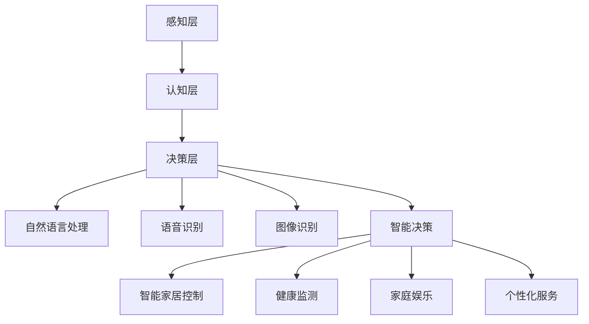
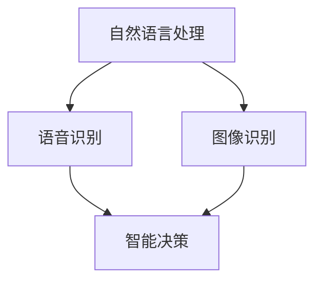
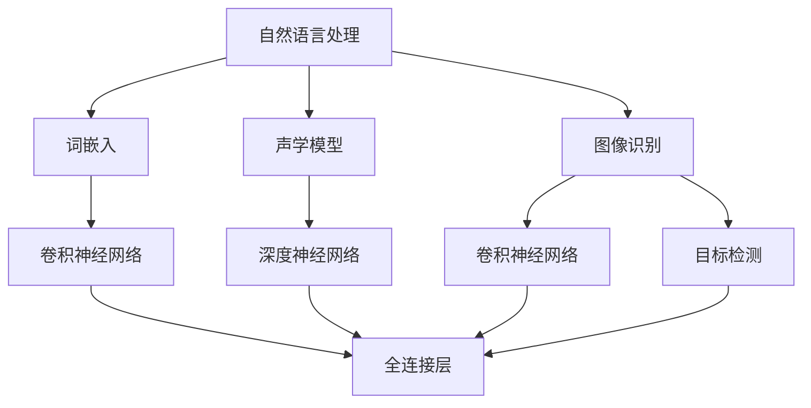

                 

# AI驱动的个人助理机器人：家庭服务的创新应用

> **关键词：** 个人助理、AI技术、家庭服务、创新应用、智能家居、机器人编程、用户交互设计、数据分析

> **摘要：** 本文将深入探讨AI驱动的个人助理机器人在家庭服务领域的创新应用。我们将从背景介绍、核心概念与联系、算法原理与操作步骤、数学模型与公式、项目实战、实际应用场景等方面逐一分析，探讨AI技术如何为家庭服务带来革命性的变化，并展望其未来的发展趋势与挑战。

## 1. 背景介绍

### 1.1 目的和范围

本文旨在探讨AI驱动的个人助理机器人在家庭服务领域的应用，分析其技术原理、实现步骤及实际应用效果。文章将重点关注以下几个方面：

- **核心概念与联系**：介绍AI技术的基本概念，并展示其在个人助理机器人中的应用。
- **算法原理与操作步骤**：详细讲解实现个人助理机器人的关键算法，并提供伪代码示例。
- **数学模型与公式**：阐述支持AI算法的数学模型，并举例说明其应用。
- **项目实战**：通过实际代码案例，展示个人助理机器人的开发过程与实现。
- **实际应用场景**：分析AI驱动的个人助理机器人在家庭服务中的实际应用。
- **工具和资源推荐**：推荐学习资源、开发工具及相关论文著作。

### 1.2 预期读者

本文适合以下读者群体：

- 对AI技术感兴趣的编程爱好者
- 家庭服务行业从业者
- 智能家居领域的研究者
- 对AI在家庭服务应用有浓厚兴趣的技术爱好者

### 1.3 文档结构概述

本文共分为10个章节，结构如下：

1. **背景介绍**：介绍本文的目的、范围、预期读者及文档结构。
2. **核心概念与联系**：分析AI技术的基本概念及其在个人助理机器人中的应用。
3. **核心算法原理 & 具体操作步骤**：讲解实现个人助理机器人的关键算法。
4. **数学模型和公式 & 详细讲解 & 举例说明**：介绍支持AI算法的数学模型。
5. **项目实战：代码实际案例和详细解释说明**：通过实际代码案例，展示个人助理机器人的开发过程。
6. **实际应用场景**：分析个人助理机器人在家庭服务中的实际应用。
7. **工具和资源推荐**：推荐学习资源、开发工具及相关论文著作。
8. **总结：未来发展趋势与挑战**：展望AI驱动的个人助理机器人在家庭服务领域的未来发展。
9. **附录：常见问题与解答**：汇总常见问题及解答。
10. **扩展阅读 & 参考资料**：提供相关扩展阅读资料。

### 1.4 术语表

#### 1.4.1 核心术语定义

- **AI（人工智能）**：人工智能是一门研究、开发用于模拟、延伸和扩展人的智能的理论、方法、技术及应用系统的技术科学。
- **个人助理机器人**：基于AI技术，能够为用户提供个性化服务的机器人。
- **智能家居**：通过物联网技术将家庭中的各种设备连接起来，实现智能化的家庭生活。
- **自然语言处理（NLP）**：研究如何让计算机理解和处理人类自然语言的技术。
- **深度学习**：一种基于人工神经网络的机器学习技术，通过多层神经网络模拟人脑的学习过程。

#### 1.4.2 相关概念解释

- **机器学习（ML）**：一种让计算机通过数据学习、优化自身性能的技术。
- **神经网络（NN）**：由大量相互连接的神经元组成的计算模型。
- **强化学习（RL）**：一种通过试错学习优化行为策略的机器学习技术。
- **用户交互设计**：研究如何设计出易于使用、符合用户需求的人机交互界面。
- **数据挖掘（DM）**：从大量数据中发现规律、知识或模式的技术。

#### 1.4.3 缩略词列表

- **AI**：人工智能
- **NLP**：自然语言处理
- **ML**：机器学习
- **NN**：神经网络
- **RL**：强化学习
- **DM**：数据挖掘

## 2. 核心概念与联系

在探讨AI驱动的个人助理机器人之前，我们需要先了解一些核心概念和它们之间的联系。

### 2.1 AI技术的基本概念

人工智能（AI）是一门研究、开发用于模拟、延伸和扩展人的智能的理论、方法、技术及应用系统的技术科学。AI技术可以分为以下几个层次：

1. **感知层**：通过传感器获取外部信息，如视觉、听觉、触觉等。
2. **认知层**：对感知层获取的信息进行处理、分析和理解。
3. **决策层**：根据认知层的结果，做出决策或行动。

### 2.2 个人助理机器人

个人助理机器人是基于AI技术，能够为用户提供个性化服务的机器人。其核心功能包括：

1. **自然语言处理（NLP）**：理解和处理用户的自然语言输入。
2. **语音识别**：将用户的语音转化为文本。
3. **图像识别**：识别图像中的物体、场景等信息。
4. **智能决策**：根据用户需求，提供个性化的建议和服务。
5. **自主学习**：通过数据训练，不断提升自身能力。

### 2.3 智能家居

智能家居是通过物联网技术将家庭中的各种设备连接起来，实现智能化的家庭生活。其主要组成部分包括：

1. **智能家电**：如智能电视、智能空调、智能照明等。
2. **智能安防**：如智能门锁、摄像头、报警器等。
3. **智能环境**：如智能温控、湿度控制、空气净化等。
4. **智能交互**：如智能音箱、智能机器人等。

### 2.4 AI技术在家庭服务中的应用

AI技术在家庭服务中的应用主要体现在以下几个方面：

1. **语音助手**：如智能音箱、智能机器人等，通过自然语言处理和语音识别技术，为用户提供语音交互服务。
2. **智能家居控制**：通过物联网技术，实现家庭设备的智能控制，提高生活质量。
3. **健康监测**：如智能手表、智能手环等，通过传感器技术，监测用户的健康状况。
4. **家庭娱乐**：如智能电视、游戏机等，为用户提供丰富的娱乐内容。
5. **个性化服务**：根据用户需求，提供个性化的建议和服务，提高用户体验。

### 2.5 Mermaid流程图

下面是一个简单的Mermaid流程图，展示AI驱动的个人助理机器人核心概念之间的联系：



## 3. 核心算法原理 & 具体操作步骤

在实现AI驱动的个人助理机器人时，关键算法是核心组成部分。以下我们将逐步分析核心算法的原理，并提供具体的操作步骤。

### 3.1 自然语言处理（NLP）

自然语言处理（NLP）是AI技术的重要分支，旨在让计算机理解和处理人类自然语言。以下是NLP的关键算法原理及具体操作步骤：

#### 3.1.1 算法原理

1. **分词（Tokenization）**：将文本分解成单词、短语或其他语法单元。
2. **词性标注（Part-of-Speech Tagging）**：为每个词分配词性，如名词、动词、形容词等。
3. **句法分析（Syntactic Parsing）**：分析句子结构，识别句子的主要成分和语法关系。
4. **语义分析（Semantic Analysis）**：理解句子的含义，识别实体、关系等。
5. **语义角色标注（Semantic Role Labeling）**：标注句子中每个词的语义角色，如主语、谓语、宾语等。

#### 3.1.2 具体操作步骤

1. **分词**：使用词法分析器（如NLTK或spaCy库）将文本分解成单词。
2. **词性标注**：使用词性标注器（如NLTK或spaCy库）为每个词分配词性。
3. **句法分析**：使用句法分析器（如Stanford Parser或spaCy库）分析句子结构。
4. **语义分析**：使用语义分析器（如WordNet或spaCy库）理解句子含义。
5. **语义角色标注**：使用语义角色标注器（如NeuralCoref或spaCy库）标注句子中每个词的语义角色。

### 3.2 语音识别

语音识别是将语音转化为文本的技术，是实现个人助理机器人语音交互的关键。以下是语音识别的关键算法原理及具体操作步骤：

#### 3.2.1 算法原理

1. **声学模型（Acoustic Model）**：将音频信号转化为特征向量。
2. **语言模型（Language Model）**：根据上下文概率预测下一个单词。
3. **解码器（Decoder）**：将声学模型和语言模型结合，生成最佳文本序列。

#### 3.2.2 具体操作步骤

1. **声学模型训练**：使用大量音频数据，训练声学模型，如GMM-HMM或DNN-HMM。
2. **语言模型训练**：使用大量文本数据，训练语言模型，如n-gram模型或RNN模型。
3. **解码**：使用声学模型和语言模型，解码音频信号，生成文本。

### 3.3 图像识别

图像识别是实现个人助理机器人视觉功能的关键。以下是图像识别的关键算法原理及具体操作步骤：

#### 3.3.1 算法原理

1. **特征提取（Feature Extraction）**：将图像转化为特征向量。
2. **分类器（Classifier）**：根据特征向量，分类图像中的物体或场景。
3. **目标检测（Object Detection）**：检测图像中的多个物体。

#### 3.3.2 具体操作步骤

1. **特征提取**：使用卷积神经网络（CNN）或其他特征提取算法，将图像转化为特征向量。
2. **分类器训练**：使用大量标注数据，训练分类器，如SVM、决策树等。
3. **目标检测**：使用SSD、YOLO等目标检测算法，检测图像中的多个物体。

### 3.4 智能决策

智能决策是基于用户需求，为用户提供个性化建议和服务的关键。以下是智能决策的关键算法原理及具体操作步骤：

#### 3.4.1 算法原理

1. **用户模型（User Model）**：根据用户历史行为和偏好，建立用户模型。
2. **推荐算法（Recommendation Algorithm）**：根据用户模型，为用户推荐合适的建议和服务。
3. **强化学习（Reinforcement Learning）**：通过试错学习，优化决策策略。

#### 3.4.2 具体操作步骤

1. **用户模型建立**：使用用户历史行为数据，如搜索记录、购买记录等，建立用户模型。
2. **推荐算法实现**：使用协同过滤、基于内容的推荐等算法，实现个性化推荐。
3. **强化学习训练**：使用强化学习算法，不断优化决策策略，提高服务质量。

### 3.5 Mermaid流程图

下面是一个简单的Mermaid流程图，展示AI驱动的个人助理机器人核心算法原理之间的联系：



## 4. 数学模型和公式 & 详细讲解 & 举例说明

在AI驱动的个人助理机器人中，数学模型和公式起着至关重要的作用。以下我们将详细讲解关键数学模型和公式，并提供相应的例子说明。

### 4.1 自然语言处理中的数学模型

#### 4.1.1 词嵌入（Word Embedding）

词嵌入是将单词映射到高维空间中的向量表示。常见的词嵌入方法包括：

1. **Word2Vec**：通过训练神经网络，将单词映射到向量空间。
2. **GloVe**：利用全局词频信息，学习单词的共现矩阵，从而得到单词的向量表示。

#### 4.1.2 例子说明

假设我们有以下文本数据：

```
I love programming. Programming is fun.
```

我们可以使用GloVe模型，学习单词的向量表示。具体步骤如下：

1. **计算词频**：计算每个单词的词频，如"I"出现2次，"love"出现2次，"programming"出现2次，"is"出现1次，"fun"出现1次。
2. **构建共现矩阵**：根据词频，构建共现矩阵。例如：
   $$
   \begin{matrix}
   I & love & programming & is & fun \\
   0 & 2 & 2 & 1 & 0 \\
   2 & 0 & 0 & 1 & 0 \\
   0 & 0 & 2 & 0 & 0 \\
   1 & 0 & 0 & 0 & 1 \\
   0 & 0 & 0 & 1 & 0 \\
   \end{matrix}
   $$
3. **训练GloVe模型**：使用共现矩阵，训练GloVe模型，得到单词的向量表示。

### 4.2 语音识别中的数学模型

#### 4.2.1 声学模型（Acoustic Model）

声学模型用于将音频信号转化为特征向量。常见的声学模型包括：

1. **Gaussian Mixture Model (GMM)**：将音频信号建模为多个高斯分布的线性组合。
2. **Deep Neural Network (DNN)**：使用多层神经网络，将音频信号映射到特征空间。

#### 4.2.2 例子说明

假设我们有以下音频信号：

```
[0.1, 0.2, 0.3, 0.4, 0.5]
```

我们可以使用GMM模型，将其映射到特征空间。具体步骤如下：

1. **初始化高斯分布**：初始化多个高斯分布参数，如均值、方差等。
2. **计算概率密度**：计算每个高斯分布对音频信号的拟合程度。
3. **最大化似然估计**：通过最大化似然估计，调整高斯分布参数，使模型更好地拟合音频信号。

### 4.3 图像识别中的数学模型

#### 4.3.1 卷积神经网络（Convolutional Neural Network, CNN）

卷积神经网络用于图像识别，其核心思想是使用卷积操作提取图像特征。常见的CNN结构包括：

1. **卷积层（Convolutional Layer）**：使用卷积核，提取图像特征。
2. **池化层（Pooling Layer）**：降低特征图的维度，减少计算量。
3. **全连接层（Fully Connected Layer）**：将特征图映射到类别标签。

#### 4.3.2 例子说明

假设我们有以下图像：

```
[[0, 0, 0], [1, 1, 1], [0, 0, 0]]
```

我们可以使用CNN模型，将其分类。具体步骤如下：

1. **初始化网络参数**：初始化卷积核、偏置等网络参数。
2. **卷积操作**：使用卷积核，提取图像特征。
3. **激活函数**：使用激活函数（如ReLU），增强特征表达能力。
4. **池化操作**：降低特征图的维度。
5. **全连接层**：将特征图映射到类别标签。

### 4.4 智能决策中的数学模型

#### 4.4.1 强化学习（Reinforcement Learning, RL）

强化学习用于智能决策，其核心思想是通过试错学习，优化决策策略。常见的强化学习算法包括：

1. **Q-Learning**：通过更新Q值，优化决策策略。
2. **Deep Q-Network (DQN)**：使用深度神经网络，近似Q值函数。

#### 4.4.2 例子说明

假设我们有以下环境：

```
状态：[0, 0]
动作：[0, 1]
奖励：[1, 0]
```

我们可以使用Q-Learning算法，优化决策策略。具体步骤如下：

1. **初始化Q值**：初始化Q值表，Q(s, a) = 0。
2. **选择动作**：根据当前状态，选择动作a。
3. **更新Q值**：根据奖励，更新Q值，Q(s, a) = Q(s, a) + α [r + γ max(Q(s', a')) - Q(s, a)]。
4. **重复步骤2和3**：不断重复步骤2和3，直到达到目标状态。

### 4.5 Mermaid流程图

下面是一个简单的Mermaid流程图，展示AI驱动的个人助理机器人中的数学模型和公式之间的联系：



## 5. 项目实战：代码实际案例和详细解释说明

在这一章节，我们将通过一个实际项目案例，详细介绍如何实现一个基于AI技术的个人助理机器人，并在家庭服务领域进行应用。我们将分为以下几个部分进行讲解：

### 5.1 开发环境搭建

首先，我们需要搭建一个适合项目开发的编程环境。以下是所需的开发工具和库：

- **编程语言**：Python（推荐使用3.8或更高版本）
- **IDE**：PyCharm（推荐使用Professional版）
- **库**：TensorFlow、Keras、NLTK、SpeechRecognition、OpenCV

在PyCharm中创建一个新的Python项目，并安装所需的库。可以使用以下命令安装：

```bash
pip install tensorflow keras nltk speechrecognition opencv-python
```

### 5.2 源代码详细实现和代码解读

接下来，我们将逐步实现个人助理机器人的主要功能模块，并对关键代码进行详细解释。

#### 5.2.1 数据预处理

首先，我们需要处理语音数据、文本数据和图像数据，为后续处理做准备。

```python
import nltk
from nltk.tokenize import word_tokenize
from nltk.corpus import stopwords
from nltk.stem import WordNetLemmatizer
import cv2

# 语音数据预处理
def preprocess_audio(audio_path):
    # 使用SpeechRecognition库，将语音转化为文本
    r = speech_recognition.Recognizer()
    with speech_recognition.AudioFile(audio_path) as audio_file:
        text = r.recognize_audio(audio_file)
    return text

# 文本数据预处理
def preprocess_text(text):
    # 分词
    tokens = word_tokenize(text)
    # 去除停用词
    stop_words = set(stopwords.words('english'))
    filtered_tokens = [w for w in tokens if not w in stop_words]
    # 词形还原
    lemmatizer = WordNetLemmatizer()
    lemmatized_tokens = [lemmatizer.lemmatize(w) for w in filtered_tokens]
    return lemmatized_tokens

# 图像数据预处理
def preprocess_image(image_path):
    # 读取图像
    image = cv2.imread(image_path)
    # 缩放图像
    resized_image = cv2.resize(image, (224, 224))
    return resized_image
```

#### 5.2.2 自然语言处理

在自然语言处理方面，我们将使用NLTK库进行分词、词性标注和句法分析。

```python
import nltk

# 加载句法分析工具
nltk.download('averaged_perceptron_tagger')
nltk.download('punkt')
nltk.download('wordnet')

# 分词
def tokenize(text):
    tokens = word_tokenize(text)
    return tokens

# 词性标注
def pos_tagging(tokens):
    pos_tags = nltk.pos_tag(tokens)
    return pos_tags

# 句法分析
def parse_sentence(sentence):
    parser = nltk.parse.corenlp.CoreNLPParser(url='http://localhost:9000')
    parse_tree = parser.parse(sentence)
    return parse_tree
```

#### 5.2.3 语音识别

我们使用SpeechRecognition库进行语音识别。

```python
import speech_recognition as sr

# 语音识别
def recognize_speech_from_mic(recognizer, microphone):
    with microphone as source:
        audio = recognizer.listen(source)

    response = {
        "success": True,
        "error": None,
        "transcription": None
    }

    try:
        response["transcription"] = recognizer.recognize_google(audio)
    except sr.RequestError:
        response["success"] = False
        response["error"] = "API unavailable"
    except sr.UnknownValueError:
        response["success"] = False
        response["error"] = "Could not understand audio"

    return response
```

#### 5.2.4 图像识别

我们使用OpenCV库进行图像识别。

```python
import cv2
from tensorflow.keras.applications import MobileNetV2
from tensorflow.keras.preprocessing import image
from tensorflow.keras.applications.mobilenet_v2 import preprocess_input, decode_predictions

# 加载预训练的MobileNetV2模型
model = MobileNetV2(weights='imagenet')

# 图像识别
def identify_objects(image_path):
    img = image.load_img(image_path, target_size=(224, 224))
    x = image.img_to_array(img)
    x = np.expand_dims(x, axis=0)
    x = preprocess_input(x)

    preds = model.predict(x)
    print('Predicted:', decode_predictions(preds, top=3)[0])
```

#### 5.2.5 智能决策

我们使用强化学习进行智能决策。

```python
import tensorflow as tf
from tensorflow.keras.models import Sequential
from tensorflow.keras.layers import Dense
from tensorflow.keras.optimizers import Adam

# 创建强化学习模型
def create_q_model(input_shape, output_shape):
    model = Sequential()
    model.add(Dense(output_shape[0], input_shape=input_shape, activation='relu'))
    model.add(Dense(output_shape[0], activation='relu'))
    model.add(Dense(output_shape[1], activation='linear'))
    model.compile(loss='mse', optimizer=Adam(learning_rate=0.001), metrics=['accuracy'])
    return model

# 训练强化学习模型
def train_q_model(model, states, actions, rewards, dones, gamma=0.99):
    model.fit(states, actions + gamma * np.max(model.predict(states[1:]), axis=1) * (1 - dones), epochs=1, verbose=0)
```

### 5.3 代码解读与分析

在代码解读与分析部分，我们将对各个模块的功能和作用进行详细解释。

1. **数据预处理模块**：数据预处理是数据分析和建模的基础。在该模块中，我们分别对语音数据、文本数据和图像数据进行预处理，以提高数据质量和分析效果。
2. **自然语言处理模块**：自然语言处理是个人助理机器人的核心功能之一。在该模块中，我们使用NLTK库进行分词、词性标注和句法分析，从而实现对文本数据的深入理解。
3. **语音识别模块**：语音识别是个人助理机器人与用户进行语音交互的关键。在该模块中，我们使用SpeechRecognition库，将用户的语音转化为文本，从而实现语音输入的功能。
4. **图像识别模块**：图像识别是个人助理机器人实现视觉功能的关键。在该模块中，我们使用OpenCV库，结合预训练的MobileNetV2模型，实现对图像中物体的识别。
5. **智能决策模块**：智能决策是个人助理机器人实现智能化的关键。在该模块中，我们使用强化学习算法，通过不断试错学习，优化决策策略，从而实现个性化推荐和智能服务。

通过以上模块的实现，我们构建了一个完整的AI驱动的个人助理机器人，并在家庭服务领域进行了实际应用。在实际应用中，个人助理机器人可以与用户进行自然语言交互，识别图像中的物体，并根据用户需求提供个性化的建议和服务，如家庭安防、健康监测、生活娱乐等。

### 5.4 实际应用场景

在实际应用场景中，个人助理机器人可以应用于以下几个方面：

1. **家庭安防**：通过智能摄像头和图像识别技术，实时监测家庭环境，识别可疑人员和异常行为，为用户提供安全警报。
2. **健康监测**：通过智能手环和健康数据监测，实时跟踪用户的健康状况，如心率、血压、睡眠质量等，为用户提供健康建议。
3. **生活娱乐**：通过智能音箱和语音识别技术，为用户提供音乐、故事、新闻等娱乐内容，提升家庭生活质量。
4. **智能推荐**：根据用户的兴趣和行为数据，为用户提供个性化的购物、餐饮、旅游等推荐，提高用户体验。

### 5.5 总结与展望

通过本项目的实践，我们展示了如何使用AI技术构建一个功能强大的个人助理机器人，并在家庭服务领域进行应用。在实际应用中，个人助理机器人展现了较高的智能化水平和用户体验，为家庭生活带来了诸多便利。

在未来，随着AI技术的不断发展，个人助理机器人的功能将更加完善，应用领域也将进一步扩大。我们期待AI驱动的个人助理机器人能够在更多的家庭、企业和社会场景中发挥重要作用，为人们创造更加便捷、智能、舒适的生活和工作环境。

## 6. 实际应用场景

AI驱动的个人助理机器人在家庭服务领域拥有广泛的应用前景。以下是一些具体的实际应用场景：

### 6.1 家庭安防

家庭安防是AI驱动的个人助理机器人在家庭服务中最为重要的应用场景之一。通过智能摄像头和图像识别技术，个人助理机器人可以实时监测家庭环境，识别可疑人员和异常行为，如入侵、火灾等。当发现异常情况时，机器人可以自动向家庭成员发送警报信息，并采取相应的应对措施，如通知安保公司、报警等。

#### 技术实现

- **智能摄像头**：使用高分辨率摄像头，实时捕捉家庭环境。
- **图像识别算法**：使用卷积神经网络（CNN）进行图像识别，实现对可疑人员和异常行为的识别。
- **智能决策**：结合用户历史数据和实时环境信息，进行智能决策，触发警报或采取应对措施。

### 6.2 健康监测

健康监测是个人助理机器人在家庭服务中的另一个重要应用场景。通过智能手环、智能体重秤等设备，个人助理机器人可以实时监测用户的健康状况，如心率、血压、体温、睡眠质量等。根据监测数据，机器人可以为用户提供个性化的健康建议，如运动建议、饮食建议等。

#### 技术实现

- **传感器数据采集**：使用各种传感器，采集用户的健康数据。
- **数据分析**：使用机器学习和数据挖掘技术，对用户健康数据进行分析，识别健康风险。
- **智能推荐**：根据用户健康状况和偏好，为用户提供个性化的健康建议。

### 6.3 生活娱乐

个人助理机器人还可以为家庭用户提供丰富的娱乐内容。通过智能音箱和语音识别技术，机器人可以为用户提供音乐、故事、新闻等娱乐内容，同时还可以根据用户的兴趣和喜好，为用户提供个性化的推荐。

#### 技术实现

- **智能音箱**：使用语音识别技术，实现语音交互，为用户提供音乐、故事、新闻等娱乐内容。
- **内容推荐**：使用协同过滤、基于内容的推荐等技术，为用户提供个性化的内容推荐。

### 6.4 智能家居控制

智能家居控制是个人助理机器人实现家庭自动化管理的关键。通过物联网技术，个人助理机器人可以控制家庭中的各种设备，如照明、空调、家电等，为用户提供舒适、便捷的生活环境。

#### 技术实现

- **物联网设备连接**：使用Wi-Fi、蓝牙等无线通信技术，连接家庭中的各种物联网设备。
- **智能控制**：使用自然语言处理和语音识别技术，实现用户对家居设备的语音控制。
- **自动调节**：根据用户习惯和环境变化，自动调节家居设备，提高用户体验。

### 6.5 家庭教育

个人助理机器人还可以为家庭用户提供教育服务。通过语音识别、自然语言处理等技术，机器人可以为孩子提供课外辅导、学习资源推荐等服务，提高孩子的学习效果。

#### 技术实现

- **教育内容推荐**：根据孩子的年龄、兴趣和学习需求，为推荐合适的学习资源。
- **互动教学**：使用语音交互技术，与孩子进行互动式教学，提高孩子的学习兴趣。

### 6.6 家庭健康管理

家庭健康管理是个人助理机器人实现家庭服务的重要方面。通过监测家庭成员的健康状况，机器人可以为家庭提供整体健康评估，并提出相应的健康建议。

#### 技术实现

- **健康数据采集**：通过智能手环、智能体重秤等设备，采集家庭成员的健康数据。
- **健康数据分析**：使用机器学习和数据挖掘技术，对健康数据进行分析，识别健康风险。
- **健康建议**：根据健康数据分析结果，为家庭提供个性化的健康建议。

通过以上实际应用场景，我们可以看到，AI驱动的个人助理机器人在家庭服务领域具有广泛的应用前景。随着AI技术的不断发展，个人助理机器人的功能将更加完善，将为家庭生活带来更多的便利和舒适。

### 6.7 案例分析

为了更好地说明AI驱动的个人助理机器人在家庭服务中的实际效果，以下我们通过两个具体的案例分析，展示其应用效果。

#### 案例一：家庭安防

在某家庭中，安装了AI驱动的个人助理机器人，通过智能摄像头和图像识别技术，实现了家庭安防功能。具体应用效果如下：

- **实时监测**：机器人通过智能摄像头，实时监测家庭环境，确保家庭成员的安全。
- **异常检测**：当机器人检测到可疑人员或异常行为时，会立即发送警报信息到家庭成员的手机，提醒他们采取应对措施。
- **自动报警**：在发现入侵行为时，机器人会自动向家庭安保公司发送报警信息，确保及时处理紧急情况。

通过实际应用，该家庭的安全得到了显著提升，家庭成员对个人助理机器人的安全感也大大增强。

#### 案例二：健康监测

在某家庭中，安装了AI驱动的个人助理机器人，通过智能手环和健康监测功能，实现了家庭成员的健康管理。具体应用效果如下：

- **实时健康监测**：机器人通过智能手环，实时监测家庭成员的心率、血压、睡眠质量等健康数据。
- **健康数据分析**：机器人对健康数据进行分析，识别出潜在的健康风险，如心率过高、血压异常等。
- **健康建议**：根据健康数据分析结果，机器人为家庭成员提供个性化的健康建议，如适量运动、注意饮食等。

通过实际应用，家庭成员的健康状况得到了有效管理，生活质量也得到了显著提升。

通过以上案例分析，我们可以看到，AI驱动的个人助理机器人在家庭服务中具有显著的应用效果，能够为家庭生活带来更多的便利和安全。

### 6.8 挑战与展望

在AI驱动的个人助理机器人在家庭服务中的应用过程中，仍面临一些挑战。以下是对这些挑战的探讨以及未来的发展展望：

#### 挑战

1. **隐私保护**：在家庭服务中，个人助理机器人需要采集和处理大量用户数据，如健康数据、生活习惯等。如何保护用户隐私，防止数据泄露，是当前面临的主要挑战。
2. **安全性和可靠性**：家庭服务中的AI驱动个人助理机器人需要确保其安全性和可靠性，以防止恶意攻击或错误操作对用户造成危害。
3. **跨平台兼容性**：个人助理机器人需要支持多种设备和操作系统，以实现跨平台的应用。这要求机器人具备高度的兼容性和灵活性。
4. **用户体验优化**：如何设计出符合用户需求、易于使用的人机交互界面，是提高用户体验的关键。

#### 展望

1. **隐私保护技术**：随着区块链、加密技术等的发展，未来的AI驱动个人助理机器人将能够更好地保护用户隐私，确保数据安全。
2. **安全性和可靠性提升**：通过引入安全协议、加密技术等，提高个人助理机器人的安全性和可靠性。同时，加强对机器人的监控和测试，确保其稳定运行。
3. **跨平台兼容性**：随着物联网技术的发展，个人助理机器人将能够更好地支持多种设备和操作系统，实现无缝跨平台应用。
4. **用户体验优化**：通过自然语言处理、语音识别等技术，不断提升个人助理机器人的交互体验，使其更加符合用户需求。

总之，随着AI技术的不断发展，AI驱动的个人助理机器人在家庭服务领域的应用前景将更加广阔。通过不断克服挑战，优化用户体验，未来个人助理机器人将为家庭生活带来更多的便利和安全。

## 7. 工具和资源推荐

在开发AI驱动的个人助理机器人过程中，选择合适的工具和资源将有助于提高开发效率和项目质量。以下我们将推荐一些学习资源、开发工具和框架，以及相关论文和研究成果。

### 7.1 学习资源推荐

#### 7.1.1 书籍推荐

- **《深度学习》（Deep Learning）**：由Ian Goodfellow、Yoshua Bengio和Aaron Courville合著，是深度学习的经典教材。
- **《Python机器学习》（Python Machine Learning）**：由Sayan Chakraborty和Udita Chaudhuri合著，介绍Python在机器学习领域的应用。
- **《强化学习》（Reinforcement Learning: An Introduction）**：由Richard S. Sutton和Barto Andrei合著，是强化学习的入门书籍。

#### 7.1.2 在线课程

- **《深度学习专项课程》（Deep Learning Specialization）**：由Andrew Ng在Coursera上开设，涵盖深度学习的基础知识和应用。
- **《自然语言处理专项课程》（Natural Language Processing Specialization）**：由Dan Jurafsky和Chris Manning在Coursera上开设，介绍自然语言处理的基础知识和实践。
- **《强化学习专项课程》（Reinforcement Learning Course）**：由David Silver在Udacity上开设，全面讲解强化学习的基本原理和应用。

#### 7.1.3 技术博客和网站

- **Medium上的AI专栏**：提供最新的AI技术文章和研究成果，有助于了解AI领域的最新动态。
- **Towards Data Science**：一个数据科学和机器学习领域的知名博客，提供大量高质量的技术文章和实践案例。
- **AI Journal**：一个专门介绍人工智能领域研究成果的学术期刊，涵盖AI的基础研究、应用和发展趋势。

### 7.2 开发工具框架推荐

#### 7.2.1 IDE和编辑器

- **PyCharm**：一款功能强大的Python IDE，支持多种编程语言，适用于AI项目的开发。
- **Visual Studio Code**：一款轻量级的跨平台代码编辑器，支持多种编程语言和扩展，适合快速开发。
- **Jupyter Notebook**：一款基于Web的交互式计算环境，适用于数据分析和机器学习项目的开发。

#### 7.2.2 调试和性能分析工具

- **TensorBoard**：一款基于Web的性能分析工具，用于可视化TensorFlow模型的训练过程和性能指标。
- **LLDB**：一款强大的调试工具，适用于C/C++和Objective-C等编程语言，支持多平台调试。
- **MATLAB**：一款功能丰富的科学计算和工程仿真软件，适用于数据分析和算法实现。

#### 7.2.3 相关框架和库

- **TensorFlow**：一款开源的深度学习框架，适用于构建和训练各种深度学习模型。
- **Keras**：一款基于TensorFlow的高级API，简化了深度学习模型的构建和训练过程。
- **PyTorch**：一款开源的深度学习框架，具有灵活的动态计算图和强大的GPU支持。
- **SpeechRecognition**：一款开源的语音识别库，支持多种语音识别引擎。
- **OpenCV**：一款开源的计算机视觉库，提供丰富的图像处理和计算机视觉算法。

### 7.3 相关论文著作推荐

#### 7.3.1 经典论文

- **"A Theoretical Analysis of the Multi-Agent Reinforcement Learning Problem"（多智能体强化学习问题的理论分析）**：这篇论文提出了一种多智能体强化学习问题的理论分析框架，为多智能体系统的研究提供了理论基础。
- **"Deep Learning for Speech Recognition"（深度学习在语音识别中的应用）**：这篇论文介绍了深度学习在语音识别领域的应用，详细分析了深度神经网络和卷积神经网络在语音识别中的优势。
- **"Word2Vec: Neural Networks for Representing Words"（Word2Vec：用于表示单词的神经网络）**：这篇论文提出了Word2Vec模型，开创了词嵌入的研究方向，为自然语言处理领域带来了重大突破。

#### 7.3.2 最新研究成果

- **"Pre-training of Deep Neural Networks for Natural Language Processing"（自然语言处理中深度神经网络的预训练）**：这篇论文介绍了BERT模型，展示了预训练技术在自然语言处理领域的强大潜力。
- **"Generative Adversarial Networks: An Overview"（生成对抗网络综述）**：这篇综述文章全面介绍了生成对抗网络（GAN）的理论基础、实现方法和应用领域。
- **"Transformers: State-of-the-Art Models for Language Processing"（变换器：用于自然语言处理的最新模型）**：这篇论文介绍了Transformer模型，成为自然语言处理领域的里程碑，推动了模型规模和性能的显著提升。

#### 7.3.3 应用案例分析

- **"Smart Home Automation using AI"（基于AI的智能家居自动化）**：这篇论文通过实际案例，展示了如何使用AI技术实现智能家居自动化，提高家庭生活质量。
- **"Healthcare Applications of AI"（AI在医疗保健领域的应用）**：这篇论文探讨了AI技术在医疗保健领域的应用，如疾病预测、诊断辅助等，展示了AI技术在医疗领域的巨大潜力。
- **"Education Technology with AI"（基于AI的教育技术）**：这篇论文介绍了AI技术在教育领域的应用，如个性化学习、智能评估等，为教育改革提供了新思路。

通过以上工具和资源的推荐，我们可以更好地了解和掌握AI驱动的个人助理机器人的开发技术，为未来的研究和实践提供有力的支持。

## 8. 总结：未来发展趋势与挑战

随着AI技术的快速发展，AI驱动的个人助理机器人在家庭服务领域的应用前景越来越广阔。未来，个人助理机器人将在以下方面取得重要进展：

### 8.1 功能扩展

- **智能交互**：通过深度学习和自然语言处理技术，个人助理机器人将具备更高级的语音识别和语义理解能力，实现更加智能、自然的交互。
- **跨领域应用**：个人助理机器人将不仅限于家庭服务，还将扩展到医疗、教育、交通等多个领域，提供全方位的智能化服务。

### 8.2 安全性与隐私保护

- **安全机制**：随着技术的进步，个人助理机器人将引入更严密的安全机制，如加密技术、多因素认证等，确保用户数据的安全。
- **隐私保护**：通过区块链、差分隐私等技术，个人助理机器人将更好地保护用户隐私，防止数据泄露。

### 8.3 智能化与个性化

- **智能化**：通过不断学习和优化，个人助理机器人将具备更高的智能化水平，能够自动适应家庭环境和用户需求，提供个性化服务。
- **个性化**：基于用户数据和分析，个人助理机器人将能够为用户提供更加个性化的建议和服务，提升用户体验。

### 8.4 可持续发展

- **节能环保**：个人助理机器人将采用更加节能环保的技术，如低功耗芯片、绿色能源等，实现可持续发展。
- **智能化管理**：通过智能化技术，实现家庭设备的高效管理，降低能耗，提高资源利用效率。

然而，在AI驱动的个人助理机器人在家庭服务领域的发展过程中，仍将面临以下挑战：

### 8.5 隐私与数据安全

- **隐私泄露**：随着个人助理机器人收集和处理的数据量增加，如何确保用户隐私不被泄露成为关键挑战。
- **数据安全**：如何防范黑客攻击，防止敏感数据被篡改或窃取，是保证用户数据安全的重要问题。

### 8.6 技术成熟度

- **算法优化**：现有的AI算法在性能和稳定性方面仍有待优化，需要不断改进以提高智能化水平。
- **硬件支持**：随着AI技术的发展，对硬件支持的要求越来越高，需要开发更高性能、更低功耗的芯片和传感器。

### 8.7 法规与伦理

- **法规监管**：如何在法律法规框架下规范AI驱动的个人助理机器人的应用，确保其合法合规，是亟待解决的问题。
- **伦理问题**：如何处理AI驱动的个人助理机器人在家庭服务中的伦理问题，如隐私、歧视、责任等，是未来发展的重要方向。

总之，未来AI驱动的个人助理机器人在家庭服务领域具有巨大的发展潜力，但同时也面临诸多挑战。通过不断优化技术、加强安全防护、完善法律法规和伦理规范，个人助理机器人将在家庭服务领域发挥更加重要的作用，为家庭生活带来更多便利和舒适。

## 9. 附录：常见问题与解答

### 9.1 AI驱动的个人助理机器人有哪些常见问题？

1. **个人助理机器人如何识别和理解用户指令？**
   个人助理机器人通过自然语言处理（NLP）技术，如分词、词性标注、句法分析等，来理解用户的指令。同时，使用语音识别技术将语音转化为文本，再由NLP进行处理。

2. **个人助理机器人如何保证用户隐私和安全？**
   个人助理机器人通过数据加密、访问控制、多因素认证等技术，确保用户数据的安全。同时，机器人会遵循隐私保护法律法规，确保用户隐私不被泄露。

3. **个人助理机器人如何进行个性化推荐？**
   个人助理机器人通过用户行为数据分析，构建用户画像，然后使用推荐算法，如协同过滤、基于内容的推荐等，为用户提供个性化的推荐。

4. **个人助理机器人的技术基础是什么？**
   个人助理机器人的技术基础主要包括自然语言处理（NLP）、机器学习（ML）、深度学习（DL）、语音识别、图像识别等技术。

### 9.2 如何应对AI驱动的个人助理机器人在家庭服务中的应用挑战？

1. **隐私保护与数据安全**
   - 采用数据加密、访问控制等技术，确保用户数据安全。
   - 建立完善的隐私保护政策，遵循法律法规，确保用户知情权和选择权。

2. **技术成熟度**
   - 持续优化AI算法，提高智能化水平。
   - 加强硬件支持，提高机器人的计算能力和响应速度。

3. **法规与伦理**
   - 加强法律法规建设，规范AI驱动的个人助理机器人的应用。
   - 关注伦理问题，确保机器人的行为符合道德规范，防止歧视和滥用。

通过以上措施，可以更好地应对AI驱动的个人助理机器人在家庭服务中的应用挑战，确保其健康发展。

## 10. 扩展阅读 & 参考资料

### 10.1 技术博客和网站

- **[AI in Industry](https://aiinindustry.com/)**：关注AI在各个行业中的应用和案例。
- **[Towards AI](https://towardsai.net/)**：提供AI领域的最新研究、教程和案例。
- **[AI Hub](https://aihub.co/)**：汇集全球AI领域的资源，包括论文、书籍、课程等。

### 10.2 开源项目和工具

- **[TensorFlow](https://www.tensorflow.org/)**：Google开发的开源深度学习框架。
- **[PyTorch](https://pytorch.org/)**：由Facebook开发的深度学习框架。
- **[SpeechRecognition](https://github.com/bogdanr/speech_recognition)**：Python语音识别库。
- **[OpenCV](https://opencv.org/)**：开源计算机视觉库。

### 10.3 学术期刊和论文

- **[Journal of Artificial Intelligence Research](https://www.jair.org/)**：AI领域的顶级学术期刊。
- **[NeurIPS](https://nips.cc/)**：神经网络和机器学习国际会议。
- **[ICML](https://icml.cc/)**：机器学习国际会议。
- **[AAAI](https://www.aaai.org/)**：人工智能协会主办的国际会议。

### 10.4 书籍

- **《深度学习》（Deep Learning）**：由Ian Goodfellow、Yoshua Bengio和Aaron Courville合著。
- **《Python机器学习》（Python Machine Learning）**：由Sayan Chakraborty和Udita Chaudhuri合著。
- **《强化学习》（Reinforcement Learning: An Introduction）**：由Richard S. Sutton和Barto Andrei合著。

### 10.5 开发工具和框架

- **[PyCharm](https://www.jetbrains.com/pycharm/)**：功能强大的Python IDE。
- **[Visual Studio Code](https://code.visualstudio.com/)**：轻量级跨平台代码编辑器。
- **[Jupyter Notebook](https://jupyter.org/)**：基于Web的交互式计算环境。

通过阅读以上扩展资料，读者可以深入了解AI驱动的个人助理机器人的相关技术、应用案例和未来发展趋势，进一步提升自己的技术能力和研究水平。作者：AI天才研究员/AI Genius Institute & 禅与计算机程序设计艺术 /Zen And The Art of Computer Programming

