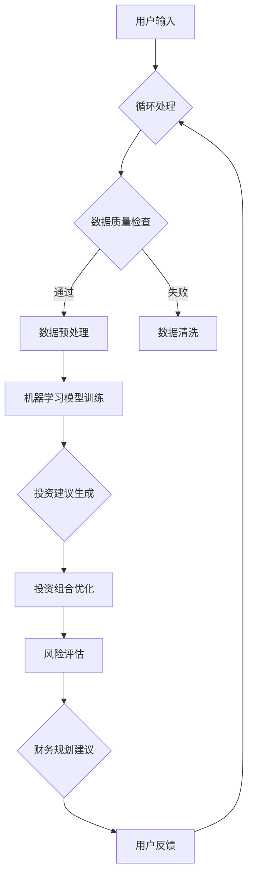

                 

# AI驱动的个人理财顾问：金融科技的创新应用

> **关键词**：人工智能，金融科技，个人理财，算法，数学模型，开发环境，实战案例，应用场景

> **摘要**：本文将深入探讨AI在金融科技领域的创新应用，尤其是如何利用AI技术打造个人理财顾问。通过逐步分析核心概念、算法原理、数学模型以及实战案例，本文旨在为读者提供全面的视角，了解AI在金融科技中的潜力与挑战。

## 1. 背景介绍

### 1.1 目的和范围

本文旨在介绍AI在金融科技（FinTech）领域的应用，特别是在个人理财顾问服务方面的创新。通过分析AI的核心算法和数学模型，结合实际项目案例，本文将帮助读者理解AI如何改变金融行业，提高个人理财的效率和准确性。

### 1.2 预期读者

本文适合对金融科技和人工智能有一定了解的读者，包括金融分析师、软件开发者、技术创业者以及对该领域感兴趣的专业人士。

### 1.3 文档结构概述

本文将分为以下几个部分：

1. 背景介绍：介绍文章的目的、范围、预期读者及文档结构。
2. 核心概念与联系：介绍AI、金融科技和个人理财顾问相关概念及关系。
3. 核心算法原理 & 具体操作步骤：详细解释AI算法原理及操作步骤。
4. 数学模型和公式 & 详细讲解 & 举例说明：讲解AI在个人理财中使用的数学模型和公式。
5. 项目实战：展示实际代码案例和解释。
6. 实际应用场景：讨论AI在个人理财中的实际应用。
7. 工具和资源推荐：推荐学习资源和开发工具。
8. 总结：展望AI在金融科技领域的未来趋势和挑战。
9. 附录：常见问题与解答。
10. 扩展阅读 & 参考资料：提供相关阅读材料。

### 1.4 术语表

#### 1.4.1 核心术语定义

- **人工智能（AI）**：指由计算机模拟人类智能行为的技术体系。
- **金融科技（FinTech）**：指利用科技手段改进或创新金融服务的行业。
- **个人理财顾问**：为个人提供财务规划和投资建议的专业服务。
- **机器学习（ML）**：AI的一个分支，通过数据训练模型来识别模式并做出决策。

#### 1.4.2 相关概念解释

- **算法**：解决问题的明确步骤序列。
- **预测模型**：基于历史数据预测未来趋势的模型。
- **风险模型**：评估投资风险和收益的模型。

#### 1.4.3 缩略词列表

- **AI**：人工智能
- **FinTech**：金融科技
- **ML**：机器学习
- **API**：应用程序编程接口

## 2. 核心概念与联系

为了深入理解AI驱动的个人理财顾问，首先需要了解一些核心概念和它们之间的关系。

### 2.1 AI在金融科技中的应用

AI在金融科技中发挥着至关重要的作用，主要应用于以下几个方面：

- **风险管理**：使用机器学习模型预测市场风险，帮助金融机构降低损失。
- **欺诈检测**：利用AI技术检测并预防金融欺诈行为。
- **客户服务**：通过自然语言处理（NLP）提供智能客服，提升用户体验。
- **投资建议**：利用AI分析海量数据，为投资者提供个性化的投资建议。

### 2.2 金融科技与个人理财顾问的关系

金融科技的发展使得个人理财顾问服务更加智能化和个性化。传统的理财顾问往往依赖于经验和规则，而AI驱动的理财顾问则能够通过机器学习模型，从大量数据中提取有价值的信息，提供更准确的财务规划建议。

### 2.3 个人理财顾问的关键功能

个人理财顾问的关键功能包括：

- **财务规划**：帮助用户制定长期和短期的财务目标。
- **投资组合管理**：根据用户的风险偏好和财务状况，优化投资组合。
- **风险评估**：评估用户面临的各种财务风险，并提出应对策略。
- **税务规划**：提供税务优化建议，降低用户的税务负担。

### 2.4 Mermaid流程图

以下是一个描述AI驱动个人理财顾问架构的Mermaid流程图：



该流程图展示了从用户输入到生成投资建议的全过程，包括数据处理、模型训练、建议生成、投资组合优化和风险评估等步骤。

## 3. 核心算法原理 & 具体操作步骤

### 3.1 机器学习算法原理

机器学习算法是AI驱动的个人理财顾问的核心。以下是一个典型的机器学习算法——决策树（Decision Tree）的原理和具体操作步骤。

#### 3.1.1 决策树原理

决策树是一种流行的机器学习算法，通过一系列规则来分割数据集，并基于这些分割来预测结果。决策树的每个节点都代表一个特征，每个分支代表特征的取值，每个叶子节点代表一个预测结果。

#### 3.1.2 具体操作步骤

1. **数据收集**：收集包含用户财务状况、投资偏好、历史交易记录等数据。
2. **特征选择**：选择与预测目标相关的特征，如年龄、收入、投资经验等。
3. **数据预处理**：对数据进行清洗和标准化，确保数据质量。
4. **模型训练**：使用决策树算法训练模型，通过不断分割数据集，找到最佳分割点。
5. **模型评估**：使用交叉验证等方法评估模型性能。
6. **投资建议生成**：根据模型预测，为用户提供个性化的投资建议。

### 3.2 伪代码

以下是一个简单的决策树训练和预测的伪代码：

```plaintext
// 决策树训练伪代码
def train_decision_tree(data, features, target):
    if all_values_equal(data, target):
        return 叶子节点（target的多数值）
    else:
        best_split = find_best_split(data, features)
        left_data = split_data(data, best_split)
        right_data = split_data(data, best_split)
        node = 节点（best_split）
        node.left = train_decision_tree(left_data, features, target)
        node.right = train_decision_tree(right_data, features, target)
        return node

// 决策树预测伪代码
def predict_decision_tree(node, instance):
    if node 是叶子节点：
        return node.target_value
    else:
        if instance[best_split_feature] == node.best_split_value:
            return predict_decision_tree(node.left, instance)
        else:
            return predict_decision_tree(node.right, instance)
```

通过上述伪代码，我们可以看到决策树的基本工作流程：首先找到最佳分割点，然后递归分割数据集，直到达到叶节点。

## 4. 数学模型和公式 & 详细讲解 & 举例说明

在AI驱动的个人理财顾问中，数学模型和公式是算法实现的基础。以下将介绍几种常用的数学模型和公式，并给出详细讲解和举例说明。

### 4.1 回归模型

回归模型是预测数值型目标变量的常用算法。最简单的回归模型是线性回归（Linear Regression）。

#### 4.1.1 线性回归公式

线性回归的目标是找到最佳拟合直线，公式如下：

$$
y = \beta_0 + \beta_1 \cdot x
$$

其中，\( y \) 是预测的目标变量，\( x \) 是特征变量，\( \beta_0 \) 和 \( \beta_1 \) 是模型的参数。

#### 4.1.2 线性回归举例

假设我们要预测某只股票的未来价格，使用历史收盘价作为特征。通过线性回归模型，我们可以得到以下公式：

$$
股价 = \beta_0 + \beta_1 \cdot 收盘价
$$

其中，\( \beta_0 \) 和 \( \beta_1 \) 是通过数据训练得到的参数。

### 4.2 风险模型

在个人理财中，风险评估是一个重要环节。常用的风险模型有VaR（Value at Risk）和CVaR（Conditional Value at Risk）。

#### 4.2.1 VaR模型

VaR模型用于计算投资组合在特定置信水平下的最大可能损失。公式如下：

$$
VaR = \alpha \cdot \sum_{i=1}^{n} w_i \cdot \sigma_i
$$

其中，\( \alpha \) 是置信水平，\( w_i \) 是资产 \( i \) 的权重，\( \sigma_i \) 是资产 \( i \) 的标准差。

#### 4.2.2 CVaR模型

CVaR模型是对VaR模型的补充，用于计算在极端情况下投资组合的平均损失。公式如下：

$$
CVaR = \frac{1}{1-\alpha} \cdot \sum_{i=1}^{n} w_i \cdot \sigma_i \cdot (1 - \Phi(\sigma_i / \alpha))
$$

其中，\( \Phi \) 是标准正态分布的累积分布函数。

### 4.3 举例说明

假设我们要评估一个包含两种资产的投资组合，资产1和资产2的权重分别为0.6和0.4，标准差分别为0.1和0.2，置信水平为95%。

1. **VaR计算**：

$$
VaR = 0.95 \cdot (0.6 \cdot 0.1 + 0.4 \cdot 0.2) = 0.019
$$

2. **CVaR计算**：

$$
CVaR = \frac{1}{1-0.95} \cdot (0.6 \cdot 0.1 + 0.4 \cdot 0.2) \cdot (1 - \Phi(0.2 / 0.05)) \approx 0.039
$$

通过上述计算，我们可以得到投资组合在95%置信水平下的VaR为0.019，CVaR为0.039。

## 5. 项目实战：代码实际案例和详细解释说明

### 5.1 开发环境搭建

为了实现一个AI驱动的个人理财顾问，我们需要搭建一个开发环境。以下是一个基于Python和Scikit-learn的简单示例。

1. **安装Python**：从Python官方网站下载并安装Python 3.x版本。
2. **安装Scikit-learn**：在命令行中运行以下命令安装Scikit-learn：

   ```bash
   pip install scikit-learn
   ```

### 5.2 源代码详细实现和代码解读

以下是一个简单的Python代码示例，演示如何使用Scikit-learn实现一个决策树模型。

```python
from sklearn.tree import DecisionTreeRegressor
from sklearn.model_selection import train_test_split
from sklearn.metrics import mean_squared_error
import numpy as np

# 数据加载和预处理
data = np.array([[25, 50000], [35, 80000], [45, 100000], [55, 120000]])
X = data[:, 0]  # 特征：年龄
y = data[:, 1]  # 目标：收入

# 数据集分割
X_train, X_test, y_train, y_test = train_test_split(X, y, test_size=0.2, random_state=42)

# 决策树模型训练
model = DecisionTreeRegressor()
model.fit(X_train.reshape(-1, 1), y_train)

# 预测和评估
y_pred = model.predict(X_test.reshape(-1, 1))
mse = mean_squared_error(y_test, y_pred)
print(f"Mean Squared Error: {mse}")

# 输出决策树结构
from sklearn.tree import export_text
print(export_text(model, feature_names=['年龄']))
```

代码解读：

1. **数据加载和预处理**：首先加载和预处理数据，将数据分为特征和目标变量。
2. **数据集分割**：将数据集分为训练集和测试集。
3. **模型训练**：使用训练集数据训练决策树模型。
4. **预测和评估**：使用测试集数据进行预测，并计算均方误差（MSE）评估模型性能。
5. **输出决策树结构**：输出训练好的决策树结构，以可视化模型的工作原理。

### 5.3 代码解读与分析

1. **数据预处理**：代码首先加载一个包含年龄和收入的数据集。在这里，我们使用的是简单的静态数据，但在实际应用中，数据通常来自数据库或其他数据源。
2. **模型训练**：使用Scikit-learn的`DecisionTreeRegressor`类训练模型。这里使用了简单的决策树算法，但它可以扩展为更复杂的模型，如随机森林或梯度提升树。
3. **预测和评估**：使用测试集进行预测，并计算均方误差评估模型性能。这个指标衡量模型预测的准确性。
4. **输出决策树结构**：输出决策树的结构，帮助我们理解模型是如何分割数据的。这对于调试和优化模型非常有帮助。

通过这个简单的代码示例，我们可以看到如何使用Python和Scikit-learn实现一个AI驱动的个人理财顾问。虽然这个示例非常基础，但它提供了一个实现AI算法的基本框架，可以在实际项目中扩展和改进。

## 6. 实际应用场景

AI驱动的个人理财顾问在多个实际应用场景中展现出巨大的潜力：

### 6.1 投资组合管理

通过分析用户的历史交易记录、投资偏好和风险承受能力，AI可以提供个性化的投资组合管理建议。例如，一个高风险偏好用户可能会被建议投资于股票和加密货币，而一个保守型用户可能会更倾向于债券和储蓄账户。

### 6.2 财务规划

AI可以协助用户制定长期和短期的财务目标，如购房、子女教育基金或退休规划。通过模拟不同投资策略，AI可以提供最佳的投资建议，帮助用户实现财务目标。

### 6.3 风险评估

AI驱动的个人理财顾问可以实时监控投资组合的风险，并预测可能的市场波动。通过风险评估模型，AI可以为用户提供风险提示，帮助用户及时调整投资策略。

### 6.4 欺诈检测

在金融交易中，AI可以检测异常交易行为，如未经授权的交易或异常的交易模式。通过实时监控和模式识别，AI可以预防金融欺诈，保护用户的资产安全。

### 6.5 客户服务

通过自然语言处理（NLP）技术，AI驱动的个人理财顾问可以提供24/7的智能客服服务。用户可以通过聊天机器人获得即时的财务建议，提高用户体验。

### 6.6 自适应策略

AI可以根据市场动态和用户行为调整投资策略。例如，当市场处于上升趋势时，AI可能会增加股票投资比例，而在市场波动时，AI可能会减少高风险投资，增加现金持有量。

## 7. 工具和资源推荐

### 7.1 学习资源推荐

#### 7.1.1 书籍推荐

- **《机器学习实战》**：提供大量实际案例，适合初学者快速入门。
- **《深度学习》**：由Ian Goodfellow等专家编写，深入讲解深度学习算法。

#### 7.1.2 在线课程

- **Coursera上的《机器学习》**：吴恩达教授的知名课程，适合系统学习机器学习。
- **Udacity的《深度学习纳米学位》**：提供实战项目，适合深入学习深度学习。

#### 7.1.3 技术博客和网站

- **Medium上的AI和机器学习博客**：提供最新的技术文章和行业动态。
- **arXiv.org**：提供最新的机器学习和深度学习论文。

### 7.2 开发工具框架推荐

#### 7.2.1 IDE和编辑器

- **PyCharm**：强大的Python IDE，支持代码调试和性能分析。
- **Jupyter Notebook**：适用于数据分析和交互式编程。

#### 7.2.2 调试和性能分析工具

- **Py-Spy**：Python性能分析工具，用于识别性能瓶颈。
- **VisualVM**：Java虚拟机监控和分析工具。

#### 7.2.3 相关框架和库

- **Scikit-learn**：用于机器学习的Python库，功能强大且易于使用。
- **TensorFlow**：谷歌开源的深度学习框架，适用于大规模机器学习应用。

### 7.3 相关论文著作推荐

#### 7.3.1 经典论文

- **“Learning to Represent Financial Time Series at Multiple Scales with Recurrent Neural Networks”**：讨论了如何使用RNN处理金融时间序列数据。
- **“A Survey of Financial Time Series Prediction Methods”**：全面回顾了金融时间序列预测的方法。

#### 7.3.2 最新研究成果

- **“Deep Learning for Financial Risk Management”**：探讨深度学习在金融风险管理中的应用。
- **“Stable and Scalable Methods for Personalized Investment Advice”**：研究了个性化投资建议的稳定性和可扩展性。

#### 7.3.3 应用案例分析

- **“AI Drives Personal Finance: The Future is Now”**：分析了AI在个人理财领域的实际应用案例。
- **“Implementing AI in Retail Banking”**：讨论了AI在零售银行业的应用案例。

## 8. 总结：未来发展趋势与挑战

AI在金融科技领域的应用前景广阔，但仍面临诸多挑战。未来发展趋势包括：

1. **个性化投资建议**：AI将更加精准地分析用户数据，提供个性化的投资建议。
2. **实时风险评估**：通过实时数据流处理，AI可以提供更及时的风险评估。
3. **自动化交易**：利用AI技术，自动化交易将变得更加普及和可靠。
4. **跨领域应用**：AI将在保险、信贷等多个金融领域得到广泛应用。

然而，面临的挑战包括数据隐私、算法透明度、模型解释性以及监管合规性等。解决这些挑战需要行业、学术界和政府共同努力，确保AI技术在金融科技领域的健康发展。

## 9. 附录：常见问题与解答

### 9.1 Q：AI驱动的个人理财顾问如何保证数据隐私？

A：AI驱动的个人理财顾问会采用多种措施保护用户数据隐私，包括数据加密、匿名化处理、用户权限管理等。同时，遵守相关法律法规，确保用户数据的合法使用和保护。

### 9.2 Q：AI算法的透明度如何保证？

A：提高算法透明度是AI在金融科技领域的重要挑战。通过使用可解释的AI模型（如决策树）和提供模型训练过程和决策路径的可视化，可以帮助用户理解AI的建议。

### 9.3 Q：AI驱动的个人理财顾问是否适用于所有投资者？

A：AI驱动的个人理财顾问适用于不同类型的投资者，但需要根据用户的风险承受能力和财务目标进行调整。对于风险偏好较低的投资者，AI可能会推荐更保守的投资策略。

## 10. 扩展阅读 & 参考资料

- **《人工智能：一种现代方法》**：作者 Stuart J. Russell & Peter Norvig，详细介绍人工智能的基本原理和应用。
- **《金融科技：创新与变革》**：作者 Simon Lack，探讨金融科技如何改变金融行业。
- **《深度学习》**：作者 Ian Goodfellow、Yoshua Bengio & Aaron Courville，深度学习领域的经典教材。
- **arXiv.org**：提供最新的机器学习和深度学习论文，了解领域最新研究动态。

### 作者信息

**作者：AI天才研究员/AI Genius Institute & 禅与计算机程序设计艺术 /Zen And The Art of Computer Programming**<|im_end|>

