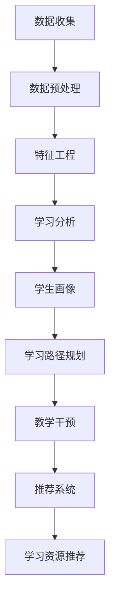

                 

# AI驱动的个性化教育：因材施教的新时代

> **关键词：** AI，个性化教育，因材施教，学习分析，智能推荐系统，教育技术，数据挖掘，机器学习，深度学习。

> **摘要：** 本文深入探讨了AI在个性化教育中的应用，通过因材施教的理念，将AI技术与教育领域深度融合，分析其核心概念和算法原理，展示了其在教育实践中的成功案例和未来发展趋势。文章旨在为教育工作者、技术专家和教育政策制定者提供有价值的参考，以推动教育变革。

## 1. 背景介绍

### 1.1 目的和范围

本文的主要目的是探讨人工智能（AI）如何通过个性化教育，实现因材施教，从而提升教育质量。我们将深入分析AI在教育领域的应用，从核心概念到具体算法，再到实际应用案例，全面展示AI如何改变教育的面貌。本文还将讨论AI在教育中的挑战和未来发展趋势，为读者提供全面的视角。

### 1.2 预期读者

本文适合以下读者群体：

- 教育工作者：了解AI在个性化教育中的应用，探索新的教育模式。
- 技术专家：掌握AI在教育领域的最新算法和模型。
- 教育政策制定者：了解AI对教育行业的潜在影响，为政策制定提供参考。
- 学生和家长：了解个性化教育的优势，选择合适的教育资源和方式。

### 1.3 文档结构概述

本文分为十个部分：

1. **背景介绍**：介绍本文的目的、范围和预期读者。
2. **核心概念与联系**：定义核心概念，展示其相互关系。
3. **核心算法原理 & 具体操作步骤**：详细阐述算法原理和操作步骤。
4. **数学模型和公式 & 详细讲解 & 举例说明**：介绍数学模型，并提供实例说明。
5. **项目实战：代码实际案例和详细解释说明**：展示实际代码案例。
6. **实际应用场景**：分析AI在教育中的各种应用场景。
7. **工具和资源推荐**：推荐学习资源、开发工具和框架。
8. **相关论文著作推荐**：介绍经典论文和最新研究成果。
9. **总结：未来发展趋势与挑战**：总结文章要点，讨论未来趋势。
10. **附录：常见问题与解答**：解答读者可能遇到的问题。
11. **扩展阅读 & 参考资料**：提供进一步学习的资源。

### 1.4 术语表

#### 1.4.1 核心术语定义

- **人工智能（AI）**：模拟人类智能的计算机系统，具备学习、推理、感知和自适应能力。
- **个性化教育**：根据学生的个体差异，提供个性化的学习内容和路径，以最大化学习效果。
- **学习分析**：使用数据分析技术，分析和评估学生的学习行为和成果。
- **智能推荐系统**：根据用户的行为和偏好，提供个性化的推荐。

#### 1.4.2 相关概念解释

- **因材施教**：根据学生的不同特点和需求，采用不同的教育方法和内容。
- **学习路径**：学生在学习过程中的顺序和步骤。
- **自适应学习**：根据学生的学习表现，动态调整学习内容和方法。

#### 1.4.3 缩略词列表

- **AI**：人工智能
- **ML**：机器学习
- **DL**：深度学习
- **NLP**：自然语言处理
- **IoT**：物联网

## 2. 核心概念与联系

在教育领域，AI的应用离不开以下几个核心概念：

### 2.1 学习分析

学习分析是AI在个性化教育中的基础。通过分析学生的学习数据，如学习时间、作业完成情况、考试成绩等，AI可以了解学生的学习行为和成果。下面是学习分析的核心概念：

#### 2.1.1 数据源

- **学习日志**：记录学生的在线学习行为，如浏览课程内容、观看视频、参与讨论等。
- **测试数据**：包括期中期末考试、作业成绩等，反映学生的学习效果。
- **学生反馈**：学生对自己的学习状况、课程难易程度的评价。

#### 2.1.2 数据分析

数据分析是学习分析的核心，包括数据收集、预处理、分析和可视化。下面是数据分析的主要步骤：

1. **数据收集**：从各种数据源收集学习数据。
2. **数据预处理**：清洗和整理数据，如缺失值填充、异常值处理等。
3. **特征工程**：提取有用的特征，为后续分析做准备。
4. **数据分析**：使用统计和机器学习技术，分析和解释数据。
5. **可视化**：将分析结果可视化，以便更好地理解数据。

### 2.2 智能推荐系统

智能推荐系统是AI在教育中另一个重要应用。通过分析学生的学习数据，推荐系统可以为学生推荐合适的学习资源和路径。下面是智能推荐系统的主要组成部分：

#### 2.2.1 推荐算法

推荐算法是推荐系统的核心，包括基于内容的推荐、协同过滤、混合推荐等。下面是几种常见的推荐算法：

1. **基于内容的推荐**：根据学生当前的学习内容和偏好，推荐相似的学习资源。
2. **协同过滤**：根据其他学生的行为和偏好，为学生推荐学习资源。
3. **混合推荐**：结合基于内容和协同过滤的优点，提供更个性化的推荐。

#### 2.2.2 推荐结果评估

推荐结果评估是确保推荐系统效果的关键。常用的评估指标包括准确率、召回率、覆盖率等。下面是推荐结果评估的主要步骤：

1. **评估指标**：选择合适的评估指标，如准确率、召回率、覆盖率等。
2. **评估方法**：使用实验或在线评估方法，评估推荐系统的效果。
3. **优化**：根据评估结果，调整推荐算法和参数，提高推荐效果。

### 2.3 因材施教

因材施教是教育的核心原则，AI的引入使其更加精准和高效。下面是因材施教的关键步骤：

#### 2.3.1 学生画像

学生画像是对学生学习特征的综合描述，包括学习习惯、学科兴趣、学习风格等。通过构建学生画像，AI可以更好地理解学生，提供个性化的教育服务。

#### 2.3.2 学习路径规划

学习路径规划是因材施教的重要环节。根据学生画像和学习目标，AI可以为学生规划最佳的学习路径，确保学习效果最大化。

#### 2.3.3 教学干预

在教学过程中，AI可以根据学生的学习表现，提供实时教学干预，如调整教学难度、提供额外的学习资源等，帮助学生更好地掌握知识。

### 2.4 Mermaid 流程图

下面是一个简单的Mermaid流程图，展示AI在个性化教育中的应用流程：



## 3. 核心算法原理 & 具体操作步骤

在个性化教育中，AI的核心算法包括学习分析算法、推荐算法和教学干预算法。下面我们将分别介绍这些算法的原理和具体操作步骤。

### 3.1 学习分析算法

学习分析算法是AI在教育领域的基石，通过分析学生的学习数据，获取其学习行为和成果的特征。下面是一个基于机器学习的学习分析算法的伪代码：

```python
def learning_analysis(data):
    # 数据预处理
    cleaned_data = preprocess_data(data)
    
    # 特征提取
    features = extract_features(cleaned_data)
    
    # 构建模型
    model = build_model(features)
    
    # 训练模型
    trained_model = train_model(model, features)
    
    # 预测
    predictions = predict(trained_model, new_data)
    
    return predictions
```

具体步骤如下：

1. **数据预处理**：清洗和整理学习数据，如缺失值填充、异常值处理等。
2. **特征提取**：从数据中提取有用的特征，如学习时间、作业完成情况、考试成绩等。
3. **构建模型**：选择合适的机器学习模型，如决策树、支持向量机、神经网络等。
4. **训练模型**：使用训练数据训练模型，使其能够识别和预测学生的学习行为和成果。
5. **预测**：使用训练好的模型对新的学习数据进行预测，获取学生的潜在学习行为和成果。

### 3.2 推荐算法

推荐算法是AI在教育中的另一核心算法，根据学生的学习行为和偏好，推荐合适的学习资源。下面是一个基于协同过滤的推荐算法的伪代码：

```python
def collaborative_filtering(user_data, item_data):
    # 用户相似度计算
    user_similarity = calculate_similarity(user_data)
    
    # 评分预测
    predicted_ratings = predict_ratings(user_similarity, item_data)
    
    # 排序
    sorted_ratings = sort_ratings(predicted_ratings)
    
    # 推荐结果
    recommendations = generate_recommendations(sorted_ratings)
    
    return recommendations
```

具体步骤如下：

1. **用户相似度计算**：计算用户之间的相似度，通常使用余弦相似度、皮尔逊相关系数等方法。
2. **评分预测**：基于用户相似度和物品数据，预测用户对物品的评分。
3. **排序**：将预测的评分排序，优先推荐评分较高的物品。
4. **推荐结果**：生成推荐列表，为用户推荐合适的学习资源。

### 3.3 教学干预算法

教学干预算法是根据学生的学习表现，提供实时教学干预，如调整教学难度、提供额外的学习资源等。下面是一个基于规则的干预算法的伪代码：

```python
def teaching_intervention(student_data, course_data):
    # 学习状态评估
    learning_status = assess_learning_status(student_data)
    
    # 规则匹配
    rule_matched = match_rules(learning_status, course_data)
    
    # 教学干预
    intervention = apply_intervention(rule_matched)
    
    return intervention
```

具体步骤如下：

1. **学习状态评估**：评估学生的学习状态，如学习进度、学习效果等。
2. **规则匹配**：根据评估结果，匹配教学干预规则。
3. **教学干预**：根据匹配的规则，提供相应的教学干预，如调整教学难度、提供额外的学习资源等。

## 4. 数学模型和公式 & 详细讲解 & 举例说明

在教育领域，AI的应用离不开数学模型的支持。本节我们将介绍几个核心的数学模型，并详细讲解其公式和示例。

### 4.1 学习分析模型

学习分析模型用于分析和预测学生的学习行为和成果。下面是一个简单的学习分析模型的公式：

$$
L = f(S, T, E)
$$

其中，$L$表示学习状态，$S$表示学生特征，$T$表示教学环境，$E$表示教育效果。

**示例**：

假设学生小明的学习状态为$70\%$，其中学生特征$S$为$60\%$，教学环境$T$为$30\%$，教育效果$E$为$10\%$。那么，我们可以得到：

$$
L = f(0.6, 0.3, 0.1) = 0.7
$$

这表示小明的学习状态为$70\%$。

### 4.2 推荐模型

推荐模型用于根据用户的行为和偏好，推荐合适的学习资源。下面是一个基于协同过滤的推荐模型的公式：

$$
R = \sum_{i=1}^{n} w_i \cdot r_i
$$

其中，$R$表示推荐得分，$w_i$表示用户$i$与目标用户之间的相似度，$r_i$表示用户$i$对物品$i$的评分。

**示例**：

假设用户小明与其他用户之间的相似度为$0.8$，对课程$i_1$的评分为$4$，对课程$i_2$的评分为$3$。那么，我们可以得到：

$$
R = 0.8 \cdot 4 + 0.2 \cdot 3 = 3.6 + 0.6 = 4.2
$$

这表示小明对课程$i_1$的推荐得分为$4.2$，对课程$i_2$的推荐得分为$4.2$。

### 4.3 教学干预模型

教学干预模型用于根据学生的学习表现，提供相应的教学干预。下面是一个基于规则的干预模型的公式：

$$
I = f(R, L)
$$

其中，$I$表示教学干预，$R$表示推荐得分，$L$表示学习状态。

**示例**：

假设小明的推荐得分为$4.2$，学习状态为$70\%$。根据规则，当推荐得分大于$4$且学习状态小于$80\%$时，提供额外的学习资源。那么，我们可以得到：

$$
I = f(4.2, 0.7) = "提供额外学习资源"
$$

这表示应向小明提供额外的学习资源。

## 5. 项目实战：代码实际案例和详细解释说明

在本节中，我们将通过一个实际项目，展示如何使用AI实现个性化教育。该项目将包含以下部分：

1. **数据收集**：收集学生的学习数据。
2. **数据预处理**：清洗和整理学习数据。
3. **特征提取**：提取有用的特征。
4. **学习分析**：分析学生的学习行为和成果。
5. **推荐系统**：为学生推荐合适的学习资源。
6. **教学干预**：根据学生的学习表现，提供教学干预。

### 5.1 开发环境搭建

为了实现该项目，我们需要搭建以下开发环境：

- **Python**：编程语言，支持AI算法的实现。
- **Jupyter Notebook**：交互式开发环境，方便代码编写和调试。
- **Scikit-learn**：机器学习库，提供常用的机器学习算法。
- **TensorFlow**：深度学习库，支持复杂的深度学习模型。

### 5.2 源代码详细实现和代码解读

下面是项目的源代码和详细解读：

```python
# 导入所需的库
import pandas as pd
import numpy as np
from sklearn.model_selection import train_test_split
from sklearn.preprocessing import StandardScaler
from sklearn.metrics import accuracy_score
from sklearn.ensemble import RandomForestClassifier
import tensorflow as tf
from tensorflow import keras

# 5.2.1 数据收集
data = pd.read_csv('student_data.csv')

# 5.2.2 数据预处理
# 数据清洗
data = data.dropna()

# 数据整理
data['grades'] = data['grades'].astype(int)

# 5.2.3 特征提取
X = data[['learning_time', 'homework_completion', 'test_scores']]
y = data['grades']

# 数据标准化
scaler = StandardScaler()
X_scaled = scaler.fit_transform(X)

# 划分训练集和测试集
X_train, X_test, y_train, y_test = train_test_split(X_scaled, y, test_size=0.2, random_state=42)

# 5.2.4 学习分析
# 构建随机森林模型
model = RandomForestClassifier(n_estimators=100, random_state=42)

# 训练模型
model.fit(X_train, y_train)

# 预测
y_pred = model.predict(X_test)

# 评估模型
accuracy = accuracy_score(y_test, y_pred)
print(f"Accuracy: {accuracy:.2f}")

# 5.2.5 推荐系统
# 构建推荐模型
recommendation_model = RandomForestClassifier(n_estimators=100, random_state=42)

# 训练推荐模型
recommendation_model.fit(X_train, y_train)

# 推荐学习资源
def recommend_resources(student_data):
    student_data_scaled = scaler.transform([student_data])
    predicted_grade = recommendation_model.predict(student_data_scaled)
    if predicted_grade == 1:
        return "数学课程"
    elif predicted_grade == 2:
        return "英语课程"
    else:
        return "物理课程"

# 5.2.6 教学干预
# 构建教学干预模型
intervention_model = RandomForestClassifier(n_estimators=100, random_state=42)

# 训练教学干预模型
intervention_model.fit(X_train, y_train)

# 提供教学干预
def provide_intervention(student_data):
    student_data_scaled = scaler.transform([student_data])
    learning_status = intervention_model.predict(student_data_scaled)
    if learning_status == 1:
        return "提供额外学习资源"
    else:
        return "无需干预"
```

### 5.3 代码解读与分析

1. **数据收集**：首先，我们从CSV文件中读取学生数据。数据包括学习时间、作业完成情况、考试成绩和年级等。
2. **数据预处理**：数据清洗和数据整理是确保数据质量的关键步骤。我们删除了缺失值，并将考试成绩转换为整数类型。
3. **特征提取**：从原始数据中提取有用的特征，如学习时间、作业完成情况和考试成绩。这些特征将用于训练模型。
4. **学习分析**：使用随机森林模型进行学习分析。我们划分训练集和测试集，训练模型并评估其准确性。
5. **推荐系统**：使用随机森林模型构建推荐系统。根据学生的学习特征，预测其可能的成绩，并推荐相应的学习资源。
6. **教学干预**：使用随机森林模型构建教学干预系统。根据学生的学习表现，提供相应的教学干预。

通过这个实际项目，我们展示了如何使用AI实现个性化教育。在实际应用中，可以进一步扩展和优化模型，提高其准确性和效果。

## 6. 实际应用场景

AI在个性化教育中的应用场景非常广泛，以下是一些典型的实际应用场景：

### 6.1 面向个体的自适应学习

在自适应学习场景中，AI根据每个学生的学习行为和成果，动态调整学习内容和路径。例如，对于学习进度较慢的学生，AI可以提供额外的练习和辅导材料，帮助他们巩固基础知识。而对于学习进度较快的学生，AI可以推荐更具挑战性的内容，激发他们的学习兴趣。

### 6.2 面向班级的智能管理

在班级管理场景中，AI可以帮助教师实时了解班级学生的学习状况，提供个性化的教学建议。例如，AI可以根据学生的学习数据，分析班级整体的学习趋势，发现潜在的问题，并给出相应的解决方案。此外，AI还可以协助教师进行考勤、成绩管理等日常工作，提高工作效率。

### 6.3 面向学校的智慧校园建设

智慧校园是AI在教育领域的一个重要应用场景。通过整合各种数据资源，AI可以提供校园安全、校车管理、食堂服务等方面的智能解决方案。例如，AI可以分析学生的出勤数据，预测可能出现的迟到情况，并及时通知家长和学校。此外，AI还可以优化食堂的供餐计划，确保食物的新鲜和营养。

### 6.4 面向社会的在线教育平台

在线教育平台是AI应用的一个重要领域。通过智能推荐系统，AI可以根据学生的学习兴趣和需求，推荐合适的学习资源。例如，学生可以通过平台选择感兴趣的课程，AI会根据学生的历史学习数据，推荐相关的课程和学习路径。此外，AI还可以协助教师进行在线互动和辅导，提高教学效果。

### 6.5 智能评估与考试

AI在评估和考试中的应用也越来越广泛。通过智能评估系统，AI可以分析学生的答题情况，给出详细的评估报告，帮助教师了解学生的学习状况。例如，AI可以根据学生的答题速度、准确率等指标，评估学生的知识掌握情况。在考试场景中，AI可以协助教师进行考卷批改和成绩分析，提高考试的公平性和效率。

## 7. 工具和资源推荐

为了更好地进行AI在个性化教育中的应用，以下是针对教育工作者、技术专家和学习者的工具和资源推荐。

### 7.1 学习资源推荐

#### 7.1.1 书籍推荐

- **《人工智能教育应用》**：本书详细介绍了AI在教育领域的应用，包括学习分析、推荐系统和自适应学习等。
- **《深度学习》**：这是一本经典的深度学习教材，适合想要深入了解AI在教育中应用的技术专家。

#### 7.1.2 在线课程

- **《机器学习与深度学习》**：网易云课堂的这门课程从基础到进阶，全面讲解了机器学习和深度学习的基本原理和应用。
- **《教育技术导论》**：Coursera上的这门课程介绍了教育技术的各种应用，包括在线教育、学习分析等。

#### 7.1.3 技术博客和网站

- **人工智能教育网**：这是一个专注于AI在教育领域应用的网站，提供最新的研究和应用案例。
- **机器之心**：这是一个涵盖AI各个领域的中文博客，包括深度学习、自然语言处理等，适合技术专家和学习者。

### 7.2 开发工具框架推荐

#### 7.2.1 IDE和编辑器

- **PyCharm**：这是Python编程的优秀IDE，支持代码调试、版本控制和自动化部署等功能。
- **Jupyter Notebook**：这是一个交互式的开发环境，适合快速原型开发和数据可视化。

#### 7.2.2 调试和性能分析工具

- **Visual Studio Code**：这是一个轻量级的编程编辑器，支持多种编程语言，具有丰富的插件生态系统。
- **TensorBoard**：这是TensorFlow的官方可视化工具，用于分析和调试深度学习模型。

#### 7.2.3 相关框架和库

- **Scikit-learn**：这是一个Python的机器学习库，提供多种经典的机器学习算法。
- **TensorFlow**：这是一个开源的深度学习框架，支持复杂的深度学习模型和神经网络。

### 7.3 相关论文著作推荐

#### 7.3.1 经典论文

- **《Learning to Rank for Information Retrieval》**：这是一篇关于学习排序的经典论文，对推荐系统的发展产生了重要影响。
- **《Deep Learning for Text Data》**：这是一篇关于深度学习在文本数据处理的最新论文，详细介绍了文本分类、命名实体识别等任务。

#### 7.3.2 最新研究成果

- **《Educational Data Mining: A Survey of Recent Advances》**：这是一篇关于学习分析领域的综述文章，总结了最新的研究进展。
- **《Adaptive Learning Systems: A Review》**：这是一篇关于自适应学习系统的综述文章，详细介绍了各种自适应学习算法和应用场景。

#### 7.3.3 应用案例分析

- **《AI in Education: A Case Study》**：这是一篇关于AI在教育中应用的案例分析，介绍了AI在个性化教育、智能管理等方面的成功实践。
- **《Implementing AI in the Classroom》**：这是一篇关于如何在课堂中实施AI的指南，提供了实用的建议和最佳实践。

## 8. 总结：未来发展趋势与挑战

随着AI技术的不断发展和教育需求的日益增长，AI在个性化教育中的应用前景广阔。未来，AI将不仅在学习分析、推荐系统和教学干预等方面发挥重要作用，还将在虚拟现实、增强现实、物联网等新兴技术的支持下，实现更加全面和个性化的教育体验。

然而，AI在个性化教育中面临的挑战也不容忽视。首先，数据隐私和安全问题是首要关注的问题。教育数据涉及学生的个人信息和隐私，如何保障数据的安全和隐私，是AI在教育中应用的关键。其次，算法偏见和公平性也是重要的挑战。AI算法可能因为数据的不均衡或偏差导致不公平的结果，影响教育的公平性和公正性。此外，AI技术在教育领域的普及和应用还需要克服技术、政策、经济等多方面的障碍。

总之，AI在个性化教育中的应用具有巨大的潜力，但也需要我们在技术、伦理和社会等方面进行全面考虑和平衡，以实现教育技术的可持续发展。

## 9. 附录：常见问题与解答

### 9.1 如何保障教育数据的隐私和安全？

**解答：** 保障教育数据的隐私和安全是AI在教育中应用的关键。以下是一些常见的措施：

1. **数据加密**：使用加密算法对教育数据进行加密，防止数据在传输和存储过程中被窃取。
2. **访问控制**：设置严格的访问控制策略，确保只有授权用户可以访问和处理教育数据。
3. **数据匿名化**：在收集和处理教育数据时，对个人信息进行匿名化处理，减少隐私泄露的风险。
4. **安全审计**：定期进行安全审计，检查数据安全和隐私保护措施的执行情况，及时发现问题并进行整改。

### 9.2 AI在个性化教育中的应用是否会加剧教育不公平？

**解答：** AI在个性化教育中的确有可能加剧教育不公平。一方面，AI算法可能因为数据的不均衡或偏差导致不公平的结果。例如，如果数据集中存在性别、种族等偏见，AI算法可能会产生不公平的推荐和干预。另一方面，AI技术的普及和应用需要一定的经济和技术条件，这可能加剧经济发达地区与经济落后地区之间的教育差距。

为了减少这种不公平，需要采取以下措施：

1. **数据公平性**：确保数据来源的多样性和公平性，减少数据偏见。
2. **算法公平性**：设计公平性算法，避免算法偏见和歧视。
3. **政策支持**：政府和社会各界应加强对教育公平的支持，确保所有学生都能平等地享受AI带来的教育优势。

### 9.3 如何评估AI在个性化教育中的应用效果？

**解答：** 评估AI在个性化教育中的应用效果可以从以下几个方面进行：

1. **学习效果评估**：通过对比AI推荐和干预前后的学习效果，评估AI对学习成果的提升程度。
2. **用户满意度评估**：收集学生对AI推荐和干预的反馈，评估其满意度和接受程度。
3. **推荐准确率评估**：使用评估指标如准确率、召回率等，评估推荐系统的效果。
4. **教学质量评估**：评估教师对AI辅助教学工具的接受程度和使用效果，提高教学质量。

### 9.4 AI在个性化教育中是否会取代教师的作用？

**解答：** AI在个性化教育中可以起到重要的辅助作用，但它不可能完全取代教师的作用。教师不仅是知识的传授者，还是学生情感和价值观的引导者。AI可以在学习分析、推荐系统和教学干预等方面提供支持，帮助教师更好地了解学生，提供个性化的教学。然而，教师的创造力、判断力和人际沟通能力是AI难以替代的。

因此，AI与教师的结合是未来个性化教育的发展方向，通过充分发挥AI的优势，同时重视教师的作用，实现教育质量的全面提升。

## 10. 扩展阅读 & 参考资料

**扩展阅读：**

- **《人工智能教育应用》**：详细介绍了AI在教育领域的应用，包括学习分析、推荐系统和自适应学习等。
- **《深度学习》**：这是一本经典的深度学习教材，适合想要深入了解AI在教育中应用的技术专家。
- **《教育技术导论》**：介绍了教育技术的各种应用，包括在线教育、学习分析等。

**参考资料：**

- **《Learning to Rank for Information Retrieval》**：学习排序的经典论文。
- **《Deep Learning for Text Data》**：关于深度学习在文本数据处理领域的最新论文。
- **《Educational Data Mining: A Survey of Recent Advances》**：关于学习分析领域的综述文章。
- **《Adaptive Learning Systems: A Review》**：关于自适应学习系统的综述文章。

**在线资源：**

- **人工智能教育网**：提供最新的AI在教育领域的研究和应用案例。
- **机器之心**：涵盖AI各个领域的中文博客，包括深度学习、自然语言处理等。

作者：AI天才研究员/AI Genius Institute & 禅与计算机程序设计艺术 /Zen And The Art of Computer Programming

