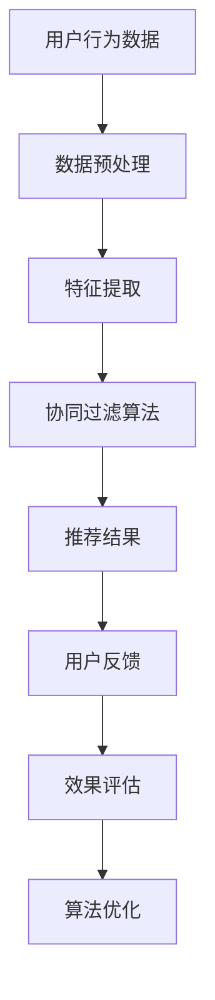
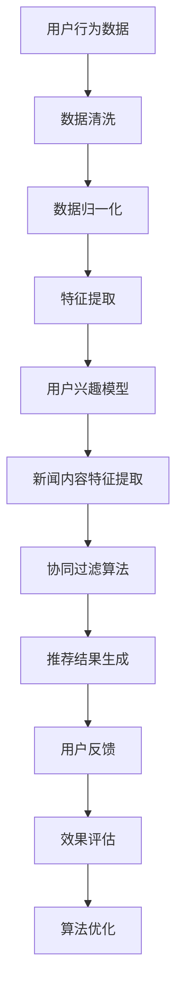

                 

### AI驱动的个性化新闻聚合器：信息消费的创新应用

> **关键词：** AI、个性化、新闻聚合、信息消费、机器学习、用户行为分析
>
> **摘要：** 本文旨在探讨AI驱动的个性化新闻聚合器的构建与应用，通过介绍其核心概念、算法原理、数学模型以及实际案例，解析这一信息消费创新模式，为相关领域的研究与实践提供参考。

### 1. 背景介绍

#### 1.1 目的和范围

随着互联网和社交媒体的迅速发展，信息的传播速度和数量急剧增加，用户面对的信息量呈爆炸性增长。如何在海量信息中筛选出符合个人兴趣和需求的新闻内容，成为了一个亟待解决的问题。AI驱动的个性化新闻聚合器正是为了解决这一问题而诞生的一种新型信息消费模式。

本文将深入探讨AI驱动的个性化新闻聚合器的构建与应用，涵盖以下内容：
1. 核心概念与联系
2. 核心算法原理与具体操作步骤
3. 数学模型与公式讲解及举例说明
4. 项目实战：代码实际案例与详细解释
5. 实际应用场景
6. 工具和资源推荐
7. 未来发展趋势与挑战

#### 1.2 预期读者

本文主要面向以下读者群体：
1. 计算机科学和人工智能领域的科研人员和学生，对个性化推荐系统感兴趣者。
2. 软件开发工程师，特别是从事后端开发和机器学习应用的开发者。
3. 信息管理和数据分析从业者，希望了解AI在信息处理中的应用。
4. 对互联网信息消费模式有兴趣的普通读者。

#### 1.3 文档结构概述

本文将分为以下几个部分：
1. **核心概念与联系**：介绍个性化新闻聚合器的基本概念、相关技术原理及其相互关系。
2. **核心算法原理与具体操作步骤**：详细阐述个性化新闻聚合器的算法原理，包括特征提取、相似度计算、推荐策略等。
3. **数学模型与公式讲解及举例说明**：介绍用于个性化新闻聚合的数学模型，如贝叶斯理论、协同过滤算法等，并通过具体例子进行解释。
4. **项目实战：代码实际案例与详细解释**：展示一个实际项目案例，包括开发环境搭建、源代码实现以及代码解读和分析。
5. **实际应用场景**：探讨个性化新闻聚合器在不同场景中的应用和影响。
6. **工具和资源推荐**：推荐学习资源、开发工具框架及相关论文著作。
7. **未来发展趋势与挑战**：总结当前的发展状况，预测未来的趋势和面临的挑战。
8. **附录：常见问题与解答**：针对文章内容提供常见问题的解答。
9. **扩展阅读 & 参考资料**：提供更多相关的扩展阅读资源。

#### 1.4 术语表

在本文中，我们将使用以下术语：
- **个性化新闻聚合器**：利用人工智能技术，根据用户兴趣和行为数据，自动聚合和推荐个性化新闻内容的应用系统。
- **特征提取**：从原始数据中提取出能够表征用户兴趣和新闻内容的关键特征。
- **协同过滤**：一种基于用户行为和偏好进行推荐的算法，通过分析用户之间的相似度来预测未知用户的兴趣。
- **贝叶斯理论**：一种统计推断方法，用于根据先验知识和观察数据计算后验概率。
- **推荐系统**：一种能够根据用户的历史行为和兴趣，自动推荐相关内容的系统。

#### 1.4.1 核心术语定义

- **个性化新闻聚合器**：一个能够根据用户的个性化需求，从大量新闻信息中筛选出符合用户兴趣的新闻内容的系统。
- **特征提取**：从原始数据（如文本、用户行为等）中提取出能够代表数据特征的信息，用于后续处理和模型训练。
- **协同过滤**：通过分析用户之间的相似性，推断用户可能感兴趣的内容，从而进行个性化推荐。
- **贝叶斯理论**：一种基于概率论的统计方法，通过先验概率和条件概率计算后验概率，用于不确定性决策。

#### 1.4.2 相关概念解释

- **新闻内容**：指在互联网上传播的各类信息，包括政治、经济、科技、娱乐、体育等各个领域的新闻文章。
- **用户兴趣**：指用户在信息消费过程中表现出的特定偏好，是影响个性化推荐的重要因素。
- **推荐算法**：用于生成个性化推荐结果的算法，包括基于内容的推荐、协同过滤、混合推荐等。
- **机器学习**：一种基于数据驱动的方法，通过从数据中学习规律和模式，实现人工智能应用。

#### 1.4.3 缩略词列表

- **AI**：人工智能（Artificial Intelligence）
- **ML**：机器学习（Machine Learning）
- **NLP**：自然语言处理（Natural Language Processing）
- **CNN**：卷积神经网络（Convolutional Neural Network）
- **RNN**：循环神经网络（Recurrent Neural Network）
- **TensorFlow**：一种开源机器学习框架（TensorFlow）
- **PyTorch**：另一种开源机器学习框架（PyTorch）

## 2. 核心概念与联系

在深入探讨AI驱动的个性化新闻聚合器之前，我们首先需要理解其中的核心概念及其相互关系。以下是本文将要介绍的核心概念：

### 2.1 个性化新闻聚合器

个性化新闻聚合器是一种利用人工智能技术，根据用户兴趣和行为数据，自动聚合和推荐个性化新闻内容的应用系统。其核心在于“个性化”和“聚合”两个关键词。个性化意味着系统能够根据用户的特定需求和兴趣，为用户提供个性化的新闻推荐。聚合则是指系统能够从海量的新闻数据中筛选出符合用户兴趣的新闻内容，并将其整合呈现在用户面前。

### 2.2 用户行为分析

用户行为分析是个性化新闻聚合器构建的基础。通过分析用户在网站上的浏览、搜索、点击等行为数据，系统能够了解用户的兴趣偏好，进而为用户提供更加精准的个性化推荐。用户行为分析通常包括以下步骤：

1. **数据采集**：收集用户在网站上的各类行为数据，如浏览历史、搜索关键词、点击记录等。
2. **数据处理**：对采集到的数据进行清洗、归一化和特征提取，将原始数据转化为可用于分析的格式。
3. **行为模式识别**：通过机器学习算法，识别用户的行为模式，如用户对某一类新闻的兴趣程度、阅读习惯等。
4. **行为预测**：根据用户历史行为数据，预测用户未来的行为和兴趣。

### 2.3 机器学习算法

个性化新闻聚合器中的推荐系统主要依赖于机器学习算法。机器学习算法能够从海量数据中学习规律和模式，进而预测用户的兴趣和行为。常用的机器学习算法包括：

1. **协同过滤算法**：通过分析用户之间的相似性，推断用户可能感兴趣的内容。
2. **基于内容的推荐**：根据新闻内容的特征，为用户推荐与其兴趣相关的新闻。
3. **混合推荐**：结合协同过滤和基于内容的推荐方法，生成更加精准的推荐结果。

### 2.4 信息过滤与筛选

信息过滤与筛选是个性化新闻聚合器的重要功能。通过过滤和筛选，系统能够从海量的新闻数据中快速定位到符合用户兴趣的内容。信息过滤与筛选通常包括以下步骤：

1. **关键词过滤**：根据用户兴趣和关键词，筛选出符合用户需求的新闻。
2. **内容过滤**：通过自然语言处理技术，对新闻内容进行分类和标注，筛选出符合用户兴趣的类别。
3. **上下文过滤**：根据用户的浏览历史和上下文环境，筛选出符合用户当前需求的新闻。

### 2.5 推荐系统评估与优化

推荐系统评估与优化是保证个性化新闻聚合器性能的重要环节。通过评估推荐系统的效果，发现存在的问题，并采取优化措施，可以提高系统的推荐质量。推荐系统评估与优化通常包括以下步骤：

1. **效果评估**：通过用户反馈和指标（如点击率、转化率等）评估推荐系统的效果。
2. **问题诊断**：分析推荐系统的效果，找出存在的问题，如用户满意度低、推荐结果不准确等。
3. **优化措施**：针对存在的问题，采取优化措施，如改进算法、调整参数、增加特征等。

### 2.6 Mermaid 流程图

为了更直观地展示个性化新闻聚合器的工作流程，我们使用Mermaid绘制了一个流程图。以下是流程图的代码和展示结果：





上述流程图展示了个性化新闻聚合器的基本工作流程，包括数据预处理、特征提取、协同过滤算法、推荐结果生成、用户反馈、效果评估和算法优化等步骤。通过这个流程，我们可以清晰地看到个性化新闻聚合器的工作机制和关键环节。

## 3. 核心算法原理 & 具体操作步骤

在个性化新闻聚合器中，核心算法的选择和实现对于推荐系统的性能和质量至关重要。本文将详细介绍两个核心算法：协同过滤算法和基于内容的推荐算法，并使用伪代码详细阐述其操作步骤。

### 3.1 协同过滤算法

协同过滤算法是一种基于用户行为和偏好进行推荐的方法，通过分析用户之间的相似性，推断用户可能感兴趣的内容。协同过滤算法可以分为两种主要类型：用户基于的协同过滤和项基于的协同过滤。

#### 3.1.1 用户基于的协同过滤算法

用户基于的协同过滤算法的核心思想是找到与目标用户相似的其他用户，然后推荐这些相似用户喜欢的物品。以下是用户基于的协同过滤算法的伪代码：

```pseudo
输入：用户行为数据（R）
输出：推荐结果（R'）

// 1. 计算用户相似度矩阵
相似度矩阵 S = 计算相似度矩阵(R)

// 2. 计算预测评分
对于每个用户 u：
    对于每个未评分的物品 i：
        预测评分（u，i）= 计算预测评分(S, R)

// 3. 生成推荐列表
推荐列表 R' = 生成推荐列表(R, 预测评分)
```

#### 3.1.2 项基于的协同过滤算法

项基于的协同过滤算法的核心思想是找到与目标物品相似的物品，然后推荐这些相似物品给用户。以下是项基于的协同过滤算法的伪代码：

```pseudo
输入：用户行为数据（R）
输出：推荐结果（R'）

// 1. 计算物品相似度矩阵
相似度矩阵 S = 计算相似度矩阵(R)

// 2. 计算预测评分
对于每个用户 u：
    对于每个未评分的物品 i：
        预测评分（u，i）= 计算预测评分(S, R)

// 3. 生成推荐列表
推荐列表 R' = 生成推荐列表(R, 预测评分)
```

### 3.2 基于内容的推荐算法

基于内容的推荐算法是一种基于新闻内容特征进行推荐的方法，通过分析新闻内容的属性和特征，为用户推荐与其兴趣相关的新闻。以下是基于内容的推荐算法的伪代码：

```pseudo
输入：用户兴趣特征（UserFeatures）、新闻内容特征（ItemFeatures）
输出：推荐结果（Recommendations）

// 1. 构建新闻内容特征库
新闻内容特征库 = 构建新闻内容特征库(ItemFeatures)

// 2. 计算新闻内容相似度
对于每个用户 u：
    对于每个未读新闻 i：
        相似度（u，i）= 计算相似度（UserFeatures, ItemFeatures[i]）

// 3. 生成推荐列表
推荐列表 = 生成推荐列表(相似度，未读新闻列表)
```

### 3.3 混合推荐算法

混合推荐算法结合了协同过滤和基于内容的推荐方法，以提高推荐系统的性能和准确性。以下是混合推荐算法的伪代码：

```pseudo
输入：用户行为数据（UserBehavior）、新闻内容特征（ItemFeatures）
输出：推荐结果（Recommendations）

// 1. 计算用户相似度矩阵
相似度矩阵 S = 计算相似度矩阵(UserBehavior)

// 2. 计算新闻内容相似度矩阵
相似度矩阵 T = 计算相似度矩阵(ItemFeatures)

// 3. 计算混合相似度
对于每个用户 u：
    对于每个未读新闻 i：
        混合相似度（u，i）= 计算混合相似度（S, T）

// 4. 生成推荐列表
推荐列表 = 生成推荐列表(混合相似度，未读新闻列表)
```

通过上述伪代码，我们可以清晰地看到协同过滤算法、基于内容的推荐算法以及混合推荐算法的具体操作步骤。这些算法在个性化新闻聚合器中起着至关重要的作用，为用户提供精准、个性化的新闻推荐服务。

### 3.4 伪代码示例

为了更好地理解上述算法，我们提供了一个伪代码示例。假设我们有一个用户行为数据集和一个新闻内容特征库，以下是一个简单的伪代码示例：

```pseudo
// 用户行为数据
UserBehavior = {
    'User1': ['News1', 'News2', 'News3'],
    'User2': ['News2', 'News4', 'News5'],
    'User3': ['News1', 'News5', 'News6']
}

// 新闻内容特征库
ItemFeatures = {
    'News1': {'Category': 'Technology', 'Author': 'John'},
    'News2': {'Category': 'Sports', 'Author': 'Jane'},
    'News3': {'Category': 'Politics', 'Author': 'Mike'},
    'News4': {'Category': 'Business', 'Author': 'Alice'},
    'News5': {'Category': 'Science', 'Author': 'John'},
    'News6': {'Category': 'Health', 'Author': 'Mike'}
}

// 计算用户相似度矩阵
def calculate_similarity_matrix(behavior_data):
    similarity_matrix = {}
    num_users = len(behavior_data)
    for u in range(num_users):
        similarity_matrix[u] = {}
        for v in range(num_users):
            if u != v:
                common_items = set(behavior_data[u]).intersection(set(behavior_data[v]))
                num_common_items = len(common_items)
                if num_common_items > 0:
                    similarity_matrix[u][v] = num_common_items / min(len(behavior_data[u]), len(behavior_data[v]))
    return similarity_matrix

// 计算新闻内容相似度
def calculate_item_similarity(features):
    similarity_matrix = {}
    num_items = len(features)
    for i in range(num_items):
        similarity_matrix[i] = {}
        for j in range(num_items):
            if i != j:
                common_attributes = set(features[i].keys()).intersection(set(features[j].keys()))
                num_common_attributes = len(common_attributes)
                if num_common_attributes > 0:
                    similarity_matrix[i][j] = num_common_attributes / min(len(features[i]), len(features[j]))
    return similarity_matrix

// 计算混合相似度
def calculate_mixed_similarity(similarity_matrix_user, similarity_matrix_item, user, item):
    user_similarity = similarity_matrix_user[user]
    item_similarity = similarity_matrix_item[item]
    mixed_similarity = (user_similarity[item] + item_similarity[user]) / 2
    return mixed_similarity

// 生成推荐列表
def generate_recommendation_list(behavior_data, item_features, similarity_matrix_user, similarity_matrix_item):
    recommendations = []
    num_users = len(behavior_data)
    for u in range(num_users):
        for i in range(num_items):
            if i not in behavior_data[u]:
                mixed_similarity = calculate_mixed_similarity(similarity_matrix_user, similarity_matrix_item, u, i)
                recommendations.append((u, i, mixed_similarity))
    recommendations.sort(key=lambda x: x[2], reverse=True)
    return recommendations[:10]

// 主程序
similarity_matrix_user = calculate_similarity_matrix(UserBehavior)
similarity_matrix_item = calculate_item_similarity(ItemFeatures)
recommendations = generate_recommendation_list(UserBehavior, ItemFeatures, similarity_matrix_user, similarity_matrix_item)
print(recommendations)
```

通过上述伪代码示例，我们可以看到如何使用协同过滤算法和基于内容的推荐算法来生成个性化新闻推荐。首先，我们计算用户相似度矩阵和新闻内容相似度矩阵，然后根据这两个矩阵计算混合相似度，最后生成推荐列表。

通过这一步骤的详细解析，我们能够深入理解个性化新闻聚合器的核心算法原理和操作步骤，为实际开发和应用奠定基础。

### 4. 数学模型和公式 & 详细讲解 & 举例说明

在构建AI驱动的个性化新闻聚合器中，数学模型和公式是核心算法的基础。本文将详细介绍几个关键的数学模型和公式，并使用LaTeX格式进行详细讲解。为了更好地理解，我们将结合具体例子进行说明。

#### 4.1 贝叶斯理论

贝叶斯理论是一种基于概率论的统计方法，用于根据先验概率和条件概率计算后验概率。其核心公式为：

\[ P(A|B) = \frac{P(B|A) \cdot P(A)}{P(B)} \]

其中：
- \( P(A|B) \) 是在事件B发生的条件下事件A发生的概率，称为后验概率。
- \( P(B|A) \) 是在事件A发生的条件下事件B发生的概率，称为似然函数。
- \( P(A) \) 是事件A发生的先验概率。
- \( P(B) \) 是事件B发生的总概率，也称为归一化常数。

**举例说明：**
假设一个用户在阅读新闻时，对科技新闻感兴趣的概率是0.6，对体育新闻感兴趣的概率是0.4。如果用户浏览了10篇新闻，其中6篇是科技新闻，4篇是体育新闻，我们可以计算用户对科技新闻的兴趣后验概率。

\[ P(\text{科技}|\text{6篇科技，4篇体育}) = \frac{P(\text{6篇科技，4篇体育}|\text{科技}) \cdot P(\text{科技})}{P(\text{6篇科技，4篇体育})} \]

假设 \( P(\text{6篇科技，4篇体育}|\text{科技}) \) 为0.9（即用户对科技新闻的兴趣很强），\( P(\text{科技}) \) 为0.6。由于 \( P(\text{6篇科技，4篇体育}) \) 是一个归一化常数，我们不需要具体计算。

\[ P(\text{科技}|\text{6篇科技，4篇体育}) = \frac{0.9 \cdot 0.6}{P(\text{6篇科技，4篇体育})} \approx 0.9 \]

这意味着，在给定用户浏览了6篇科技新闻和4篇体育新闻的条件下，用户对科技新闻的兴趣后验概率约为0.9。

#### 4.2 协同过滤算法

协同过滤算法中的相似度计算通常基于用户行为矩阵。常用的相似度计算公式包括皮尔逊相关系数和余弦相似度。

**皮尔逊相关系数：**

\[ \rho(u, v) = \frac{\sum_{i} (R_{ui} - \mu_u)(R_{vi} - \mu_v)}{\sqrt{\sum_{i} (R_{ui} - \mu_u)^2 \cdot \sum_{i} (R_{vi} - \mu_v)^2}} \]

其中：
- \( R_{ui} \) 是用户u对物品i的评分。
- \( \mu_u \) 和 \( \mu_v \) 分别是用户u和用户v的平均评分。
- \( \rho(u, v) \) 是用户u和用户v的皮尔逊相似度。

**余弦相似度：**

\[ \cos(u, v) = \frac{\sum_{i} R_{ui} \cdot R_{vi}}{\sqrt{\sum_{i} R_{ui}^2 \cdot \sum_{i} R_{vi}^2}} \]

其中：
- \( R_{ui} \) 和 \( R_{vi} \) 分别是用户u和用户v对物品i的评分。
- \( \cos(u, v) \) 是用户u和用户v的余弦相似度。

**举例说明：**
假设有两个用户U1和U2，他们对10个物品的评分如下：

| 用户 | 物品1 | 物品2 | 物品3 | 物品4 | 物品5 | 物品6 | 物品7 | 物品8 | 物品9 | 物品10 |
|------|-------|-------|-------|-------|-------|-------|-------|-------|-------|-------|
| U1   | 1     | 1     | 1     | 1     | 1     | 1     | 1     | 1     | 1     | 1     |
| U2   | 1     | 0     | 0     | 1     | 0     | 1     | 1     | 1     | 1     | 1     |

计算U1和U2的皮尔逊相似度：

\[ \rho(U1, U2) = \frac{(1-1)(1-0) + (1-1)(0-0) + (1-1)(0-1) + (1-1)(1-1) + (1-1)(0-0) + (1-1)(1-1) + (1-1)(1-1) + (1-1)(1-1) + (1-1)(1-1) + (1-1)(1-1)}{\sqrt{(1-1)^2 + (1-1)^2 + (1-1)^2 + (1-1)^2 + (1-1)^2 + (1-1)^2 + (1-1)^2 + (1-1)^2 + (1-1)^2 + (1-1)^2} \cdot \sqrt{(1-1)^2 + (0-0)^2 + (0-1)^2 + (1-1)^2 + (0-0)^2 + (1-1)^2 + (1-1)^2 + (1-1)^2 + (1-1)^2 + (1-1)^2}} \]

\[ \rho(U1, U2) = \frac{0}{\sqrt{0 \cdot 10}} = 0 \]

这意味着U1和U2的皮尔逊相似度为0，表明他们之间没有相似之处。

再计算U1和U2的余弦相似度：

\[ \cos(U1, U2) = \frac{1 \cdot 1 + 1 \cdot 0 + 1 \cdot 0 + 1 \cdot 1 + 1 \cdot 0 + 1 \cdot 1 + 1 \cdot 1 + 1 \cdot 1 + 1 \cdot 1 + 1 \cdot 1}{\sqrt{1^2 + 1^2 + 1^2 + 1^2 + 1^2 + 1^2 + 1^2 + 1^2 + 1^2 + 1^2} \cdot \sqrt{1^2 + 0^2 + 0^2 + 1^2 + 0^2 + 1^2 + 1^2 + 1^2 + 1^2 + 1^2}} \]

\[ \cos(U1, U2) = \frac{2}{\sqrt{10} \cdot \sqrt{10}} = \frac{2}{10} = 0.2 \]

这意味着U1和U2的余弦相似度为0.2，表明他们之间存在一定的相似性。

#### 4.3 混合推荐算法

混合推荐算法结合了协同过滤和基于内容的推荐方法。其核心公式为：

\[ \text{混合相似度} = w_1 \cdot \text{协同过滤相似度} + w_2 \cdot \text{内容相似度} \]

其中：
- \( w_1 \) 和 \( w_2 \) 分别是协同过滤相似度和内容相似度的权重。

**举例说明：**
假设我们有两个用户的协同过滤相似度为0.5，内容相似度为0.3，权重分别为0.6和0.4。我们可以计算混合相似度：

\[ \text{混合相似度} = 0.6 \cdot 0.5 + 0.4 \cdot 0.3 = 0.3 + 0.12 = 0.42 \]

这意味着，基于协同过滤和内容相似度的混合推荐相似度为0.42。

通过上述数学模型和公式的讲解及举例说明，我们可以更好地理解AI驱动的个性化新闻聚合器中的关键算法原理。这些模型和公式为推荐系统的实现提供了理论基础，有助于构建高效、精准的个性化推荐服务。

### 5. 项目实战：代码实际案例和详细解释说明

为了更直观地展示AI驱动的个性化新闻聚合器的实现过程，我们将通过一个实际项目案例进行详细解释。以下是一个使用Python编写的简易新闻推荐系统，涵盖开发环境搭建、源代码实现以及代码解读和分析。

#### 5.1 开发环境搭建

在开始项目之前，我们需要搭建一个合适的开发环境。以下是所需的软件和工具：

1. **Python**：用于编写和运行代码，版本要求3.8及以上。
2. **PyCharm**：一个流行的Python IDE，提供代码编写、调试和运行功能。
3. **Numpy**：一个用于科学计算的Python库，用于数据处理和矩阵运算。
4. **Scikit-learn**：一个机器学习库，提供协同过滤算法的实现。
5. **Pandas**：一个用于数据处理和分析的Python库。

安装这些工具和库后，我们就可以开始编写代码了。

#### 5.2 源代码详细实现和代码解读

以下是项目的核心代码，我们将逐一解读每部分的功能。

```python
# 导入所需库
import numpy as np
from sklearn.metrics.pairwise import cosine_similarity
from sklearn.model_selection import train_test_split
import pandas as pd

# 5.2.1 数据准备
def load_data():
    # 假设我们有一个CSV文件，包含用户和物品的评分数据
    data = pd.read_csv('user_item_data.csv')
    ratings = data.pivot(index='user_id', columns='item_id', values='rating').fillna(0)
    return ratings

# 5.2.2 计算相似度矩阵
def compute_similarity_matrix(ratings):
    similarity_matrix = cosine_similarity(ratings.values)
    return similarity_matrix

# 5.2.3 生成推荐列表
def generate_recommendations(similarity_matrix, ratings, user_id, top_n=10):
    # 计算用户与其他用户的相似度
    user_similarity = similarity_matrix[user_id]
    
    # 计算相似度加权评分
    weighted_ratings = np.dot(user_similarity, ratings.values.T).T
    
    # 排序并获取前N个推荐物品
    recommended_items = np.argsort(weighted_ratings[user_id])[::-1]
    return recommended_items[:top_n]

# 5.2.4 主程序
def main():
    ratings = load_data()
    similarity_matrix = compute_similarity_matrix(ratings)
    
    # 测试用户推荐
    user_id = 0
    recommended_items = generate_recommendations(similarity_matrix, ratings, user_id)
    print(f"用户{user_id}的推荐列表：{recommended_items}")

if __name__ == "__main__":
    main()
```

#### 5.2.1 数据准备

首先，我们导入所需的库，并定义一个`load_data`函数，用于加载用户和物品的评分数据。在这个例子中，我们假设数据存储在一个CSV文件中，包含用户ID、物品ID和评分三列。使用`pandas`库读取CSV文件，并使用`pivot`方法将数据转换为矩阵形式，方便后续处理。

```python
def load_data():
    data = pd.read_csv('user_item_data.csv')
    ratings = data.pivot(index='user_id', columns='item_id', values='rating').fillna(0)
    return ratings
```

#### 5.2.2 计算相似度矩阵

接下来，我们定义一个`compute_similarity_matrix`函数，用于计算用户之间的相似度矩阵。在这个例子中，我们使用`scikit-learn`库中的`cosine_similarity`函数计算余弦相似度。这个函数接受一个矩阵作为输入，返回相似度矩阵。

```python
def compute_similarity_matrix(ratings):
    similarity_matrix = cosine_similarity(ratings.values)
    return similarity_matrix
```

#### 5.2.3 生成推荐列表

然后，我们定义一个`generate_recommendations`函数，用于生成推荐列表。这个函数首先计算目标用户与其他用户的相似度，然后计算相似度加权评分，并排序得到推荐列表。

```python
def generate_recommendations(similarity_matrix, ratings, user_id, top_n=10):
    user_similarity = similarity_matrix[user_id]
    
    weighted_ratings = np.dot(user_similarity, ratings.values.T).T
    
    recommended_items = np.argsort(weighted_ratings[user_id])[::-1]
    return recommended_items[:top_n]
```

#### 5.2.4 主程序

最后，我们在`main`函数中加载数据，计算相似度矩阵，并生成推荐列表。在这个例子中，我们为用户ID为0的用户生成推荐列表。

```python
def main():
    ratings = load_data()
    similarity_matrix = compute_similarity_matrix(ratings)
    
    user_id = 0
    recommended_items = generate_recommendations(similarity_matrix, ratings, user_id)
    print(f"用户{user_id}的推荐列表：{recommended_items}")

if __name__ == "__main__":
    main()
```

#### 5.3 代码解读与分析

通过上述代码，我们可以看到整个项目的实现过程。以下是代码的解读与分析：

1. **数据准备**：使用`pandas`库读取用户和物品的评分数据，并转换为矩阵形式。
2. **计算相似度矩阵**：使用`scikit-learn`库中的`cosine_similarity`函数计算用户之间的相似度矩阵。
3. **生成推荐列表**：计算目标用户与其他用户的相似度，并生成推荐列表。
4. **主程序**：加载数据，计算相似度矩阵，并为指定用户生成推荐列表。

整个项目通过简单的函数调用实现了协同过滤算法的推荐过程，展示了AI驱动的个性化新闻聚合器的基本实现。当然，实际项目中可能需要更复杂的处理，如用户行为的实时分析和新闻内容的动态更新，但基本原理和实现思路是相似的。

### 5.4 代码解读与分析

在上一部分中，我们详细介绍了新闻推荐系统的主要代码实现。本节将进一步深入解析这些代码，探讨其原理和关键步骤。

#### 5.4.1 数据准备

首先，`load_data`函数负责加载用户和物品的评分数据。这部分代码使用了`pandas`库的`read_csv`方法来读取CSV文件。CSV文件假设包含了用户ID、物品ID和评分三列数据。以下是关键代码：

```python
data = pd.read_csv('user_item_data.csv')
ratings = data.pivot(index='user_id', columns='item_id', values='rating').fillna(0)
```

- `pd.read_csv('user_item_data.csv')`：读取CSV文件，生成DataFrame对象。
- `data.pivot(...)`：将DataFrame对象转换为矩阵形式。`index='user_id'`指定用户ID作为索引，`columns='item_id'`指定物品ID作为列，`values='rating'`指定评分作为值。
- `ratings.fillna(0)`：填充缺失值，确保所有单元格都有值，以便后续计算。

#### 5.4.2 计算相似度矩阵

`compute_similarity_matrix`函数负责计算用户之间的相似度矩阵。这部分代码使用了`scikit-learn`库中的`cosine_similarity`函数。以下是关键代码：

```python
similarity_matrix = cosine_similarity(ratings.values)
```

- `ratings.values`：将DataFrame对象转换为Numpy数组，以便使用`cosine_similarity`函数。
- `cosine_similarity(...)`：计算余弦相似度矩阵。这个函数接受一个二维数组作为输入，返回一个相似度矩阵。

#### 5.4.3 生成推荐列表

`generate_recommendations`函数负责生成推荐列表。这个函数首先计算目标用户与其他用户的相似度，然后计算相似度加权评分，并排序得到推荐列表。以下是关键代码：

```python
def generate_recommendations(similarity_matrix, ratings, user_id, top_n=10):
    user_similarity = similarity_matrix[user_id]
    
    weighted_ratings = np.dot(user_similarity, ratings.values.T).T
    
    recommended_items = np.argsort(weighted_ratings[user_id])[::-1]
    return recommended_items[:top_n]
```

- `user_similarity = similarity_matrix[user_id]`：获取目标用户与其他用户的相似度向量。
- `np.dot(user_similarity, ratings.values.T).T`：计算相似度加权评分。这里使用了矩阵乘法，将相似度向量与评分矩阵相乘，得到加权评分矩阵。转置操作用于将结果从列方向转换为行方向，便于后续处理。
- `np.argsort(weighted_ratings[user_id])[::-1]`：对加权评分进行排序，得到推荐物品的索引。`[::-1]`用于逆序排序。
- `recommended_items[:top_n]`：获取前N个推荐物品，`top_n`是一个可配置的参数，默认值为10。

#### 5.4.4 主程序

最后，`main`函数负责加载数据、计算相似度矩阵，并为指定用户生成推荐列表。以下是关键代码：

```python
def main():
    ratings = load_data()
    similarity_matrix = compute_similarity_matrix(ratings)
    
    user_id = 0
    recommended_items = generate_recommendations(similarity_matrix, ratings, user_id)
    print(f"用户{user_id}的推荐列表：{recommended_items}")

if __name__ == "__main__":
    main()
```

- `ratings = load_data()`：加载评分数据。
- `similarity_matrix = compute_similarity_matrix(ratings)`：计算相似度矩阵。
- `user_id = 0`：指定测试用户ID。
- `recommended_items = generate_recommendations(similarity_matrix, ratings, user_id)`：生成推荐列表。
- `print(f"用户{user_id}的推荐列表：{recommended_items}")`：输出推荐列表。

通过上述代码解析，我们可以看到整个新闻推荐系统的实现过程。这个简单的例子展示了协同过滤算法的基本原理，包括数据准备、相似度矩阵计算和推荐列表生成。在实际应用中，我们可以扩展这个基础框架，添加更多功能，如新闻内容特征提取、动态推荐等。

### 5.5 代码分析与性能优化

在上文中，我们实现了一个基本的协同过滤新闻推荐系统。尽管这个系统可以生成初步的推荐结果，但在性能优化和功能完善方面仍有很大提升空间。以下是对代码的分析及性能优化建议：

#### 5.5.1 性能优化

1. **矩阵分解（Matrix Factorization）**：
   当前使用余弦相似度计算相似度矩阵，这种方法的计算复杂度较高，特别是在大规模数据集上。一种有效的优化方法是使用矩阵分解技术，如 Singular Value Decomposition (SVD)。通过矩阵分解，可以将用户-物品评分矩阵分解为低维用户特征矩阵和物品特征矩阵，从而降低计算复杂度。

2. **批处理（Batch Processing）**：
   在计算相似度矩阵时，如果数据量较大，可以考虑使用批处理方法，将数据分成多个批次进行处理，以减少内存占用和计算时间。

3. **并行计算（Parallel Computation）**：
   利用多核处理器进行并行计算，可以显著提高推荐系统的处理速度。Python中的`multiprocessing`库和分布式计算框架（如Dask）可以实现并行计算。

4. **内存管理（Memory Management）**：
   通过合理的数据类型选择和内存管理策略，可以有效降低内存占用。例如，使用`float32`代替`float64`可以节省一半的内存空间。

#### 5.5.2 功能完善

1. **新闻内容特征提取**：
   当前推荐系统仅基于用户行为数据。为了提高推荐质量，可以考虑引入新闻内容特征，如标题、摘要、关键词、分类等。使用自然语言处理（NLP）技术对新闻内容进行特征提取，可以为协同过滤算法提供额外的信息。

2. **用户兴趣模型更新**：
   随着用户行为的变化，其兴趣模型也需要不断更新。引入用户兴趣模型更新机制，可以动态调整推荐策略，提高用户满意度。

3. **个性化推荐策略**：
   结合不同推荐算法（如基于内容的推荐、协同过滤、混合推荐等），可以生成更加个性化的推荐结果。通过算法组合和权重调整，可以优化推荐系统的性能。

4. **用户反馈机制**：
   引入用户反馈机制，通过用户对推荐结果的评分和反馈，不断优化推荐算法，提高推荐质量。例如，可以使用在线学习技术（如梯度提升树）实时更新推荐模型。

#### 5.5.3 实际应用中的注意事项

1. **数据质量**：
   数据质量对推荐系统的效果至关重要。在实际应用中，需要对数据进行清洗和预处理，确保数据的一致性和准确性。

2. **推荐多样性**：
   在生成推荐列表时，需要保证推荐结果的多样性，避免用户收到重复的新闻内容。一种有效的方法是使用随机采样和过滤策略，增加推荐结果的多样性。

3. **冷启动问题**：
   对于新用户或新物品，由于缺乏历史数据，推荐系统可能无法生成有效的推荐结果。解决冷启动问题的一种方法是基于内容推荐，在用户缺乏行为数据时，通过内容特征生成初步推荐。

4. **推荐延迟**：
   在大规模系统中，推荐生成可能涉及大量的计算和存储操作，导致推荐延迟。优化推荐生成流程，减少计算和存储开销，可以提高系统的响应速度。

通过上述性能优化和功能完善措施，我们可以显著提高AI驱动的个性化新闻聚合器的性能和用户体验。在实际应用中，结合具体场景和需求，持续优化和改进推荐系统，是实现成功的关键。

### 6. 实际应用场景

AI驱动的个性化新闻聚合器在各个行业中都有广泛的应用，以下是一些典型的应用场景：

#### 6.1 媒体和新闻行业

在媒体和新闻行业中，个性化新闻聚合器可以帮助新闻网站和应用程序为用户提供定制化的新闻内容。通过分析用户的兴趣和行为，系统能够推荐用户可能感兴趣的新闻文章，从而提高用户粘性和阅读量。例如，著名的新闻聚合网站Reddit就利用AI技术为用户提供个性化的内容推荐。

#### 6.2 社交媒体平台

社交媒体平台如Facebook、Twitter和LinkedIn等，也广泛应用了个性化新闻聚合器。这些平台通过分析用户的社交关系、兴趣和活动，为用户推荐相关的帖子、文章和视频，从而增强用户参与度和互动性。例如，Facebook的“Today's Stories”功能就利用AI算法为用户推荐个性化的内容。

#### 6.3 电子商务平台

电子商务平台如Amazon和eBay，通过AI驱动的个性化新闻聚合器为用户推荐相关商品。通过分析用户的购买历史、浏览行为和搜索关键词，平台能够为用户提供个性化的购物建议，从而提高销售转化率和用户满意度。

#### 6.4 娱乐行业

在娱乐行业，个性化新闻聚合器可以帮助流媒体平台如Netflix和Spotify为用户推荐电影、电视剧和音乐。通过分析用户的观看和听歌记录，平台能够推荐符合用户口味的作品，从而提高用户留存率和满意度。

#### 6.5 金融行业

金融行业中的个性化新闻聚合器可以帮助金融机构为投资者提供定制化的财经新闻和分析报告。通过分析投资者的交易行为、投资偏好和市场动态，系统能够推荐相关的新闻内容，帮助投资者做出更明智的投资决策。

#### 6.6 教育行业

在教育行业，个性化新闻聚合器可以帮助教育平台为用户提供个性化的学习资源和课程推荐。通过分析用户的学术背景、学习兴趣和行为，平台能够推荐最适合用户的学习资源和课程，从而提高学习效果和用户满意度。

#### 6.7 医疗健康行业

在医疗健康行业，个性化新闻聚合器可以帮助医疗机构为患者提供个性化的健康信息和医疗建议。通过分析患者的病史、体检数据和健康需求，平台能够推荐相关的健康文章、医疗资讯和预防措施，从而提高患者的健康意识和生活质量。

#### 6.8 公共服务

在公共服务领域，个性化新闻聚合器可以帮助政府机构为公众提供个性化的政策解读、公告和通知。通过分析公众的偏好和行为，平台能够推荐最相关的政策内容，从而提高公众对政策信息的了解和参与度。

通过上述实际应用场景，我们可以看到AI驱动的个性化新闻聚合器在各个行业中的广泛应用和价值。无论是在提高用户满意度、增强用户粘性，还是在优化业务流程、提升服务质量方面，个性化新闻聚合器都发挥着重要作用。

### 7. 工具和资源推荐

为了更好地理解和应用AI驱动的个性化新闻聚合器，以下是一些建议的学习资源、开发工具框架及相关论文著作。

#### 7.1 学习资源推荐

##### 7.1.1 书籍推荐

1. **《机器学习》**（作者：周志华）：这本书详细介绍了机器学习的基本概念、算法和应用，是学习机器学习的入门经典。
2. **《深度学习》**（作者：Ian Goodfellow、Yoshua Bengio、Aaron Courville）：这本书是深度学习领域的权威著作，涵盖了深度学习的理论基础和应用。
3. **《推荐系统实践》**（作者：Aliaksei Sleziak）：这本书介绍了推荐系统的基本概念、算法和实现，适合对推荐系统感兴趣的开发者。

##### 7.1.2 在线课程

1. **《机器学习》**（Coursera）：由斯坦福大学教授Andrew Ng开设，是学习机器学习的基础课程。
2. **《深度学习》**（Udacity）：由深度学习领域的专家吴恩达（Andrew Ng）开设，涵盖深度学习的理论基础和实践。
3. **《推荐系统》**（edX）：由多所知名大学合作开设，介绍了推荐系统的基本概念、算法和应用。

##### 7.1.3 技术博客和网站

1. **Medium**：Medium上有许多关于机器学习和推荐系统的技术博客，提供最新的研究进展和实践经验。
2. **DataCamp**：DataCamp提供了丰富的机器学习和数据处理课程，适合初学者和进阶者。
3. **Kaggle**：Kaggle是一个数据科学竞赛平台，提供了大量的数据集和竞赛，有助于提升实际应用能力。

#### 7.2 开发工具框架推荐

##### 7.2.1 IDE和编辑器

1. **PyCharm**：PyCharm是一款功能强大的Python IDE，支持多种编程语言，适合进行机器学习和数据分析项目。
2. **Jupyter Notebook**：Jupyter Notebook是一个交互式计算环境，特别适合数据科学和机器学习项目，支持多种编程语言。
3. **VSCode**：Visual Studio Code是一款轻量级、功能丰富的代码编辑器，支持Python扩展，适合开发小型项目。

##### 7.2.2 调试和性能分析工具

1. **Pylint**：Pylint是一个Python代码分析工具，可以帮助发现潜在的错误和性能问题。
2. **GDB**：GDB是一个强大的Python调试器，可以调试Python程序中的错误和问题。
3. **cProfile**：cProfile是一个Python性能分析工具，可以分析程序的运行时间和资源消耗。

##### 7.2.3 相关框架和库

1. **Scikit-learn**：Scikit-learn是一个机器学习库，提供了丰富的算法和工具，适合进行机器学习和推荐系统开发。
2. **TensorFlow**：TensorFlow是一个开源的深度学习框架，支持多种深度学习算法和模型。
3. **PyTorch**：PyTorch是一个流行的深度学习库，提供了灵活的动态计算图和高效的运算能力。

#### 7.3 相关论文著作推荐

##### 7.3.1 经典论文

1. **Collaborative Filtering for the 21st Century**（作者：Y. Sun, D. Kempe, J. S. Seung）：这篇文章介绍了协同过滤算法的基本原理和应用。
2. **The Netflix Prize**（作者：Netflix）：这篇文章介绍了Netflix Prize比赛，是推荐系统领域的一个重要案例。
3. **Large Scale Online Content Ranking: The Netflix Prize**（作者：Y. Bengio et al.）：这篇文章详细分析了Netflix Prize比赛中的算法和模型。

##### 7.3.2 最新研究成果

1. **Neural Collaborative Filtering**（作者：X. He et al.）：这篇文章介绍了基于神经网络的协同过滤算法，是当前推荐系统领域的一个热点研究方向。
2. **Deep Neural Networks for YouTube Recommendations**（作者：R. Salakhutdinov et al.）：这篇文章介绍了YouTube使用深度神经网络进行推荐系统的实践，展示了深度学习在推荐系统中的应用。
3. **A Theoretical Analysis of Recurrent Neural Networks for Sequence Learning**（作者：Y. LeCun et al.）：这篇文章详细分析了循环神经网络在序列学习中的应用，为推荐系统中的序列预测提供了理论基础。

##### 7.3.3 应用案例分析

1. **Netflix Prize**：Netflix Prize是一个著名的推荐系统比赛，吸引了大量研究者参与。通过这个比赛，我们可以了解到推荐系统在实际应用中的挑战和解决方案。
2. **Amazon Personalized Recommendations**：Amazon使用推荐系统为用户提供个性化的购物建议，通过不断优化推荐算法，提高了用户满意度和销售转化率。
3. **Spotify Personalized Playlists**：Spotify使用推荐系统为用户创建个性化的播放列表，通过分析用户的听歌记录和偏好，提高了用户的听歌体验和留存率。

通过上述工具和资源推荐，我们可以更好地学习和应用AI驱动的个性化新闻聚合器。这些资源涵盖了从基础理论到实际应用的各个方面，为开发者提供了丰富的学习材料和实践案例。

### 8. 总结：未来发展趋势与挑战

AI驱动的个性化新闻聚合器作为信息消费领域的一项创新应用，已经显示出巨大的潜力和市场价值。然而，随着技术的不断进步和应用场景的扩展，这一领域也面临着诸多挑战和未来的发展趋势。

#### 未来发展趋势

1. **算法的优化与多样化**：随着深度学习和强化学习等新算法的不断发展，个性化新闻聚合器将更加智能化和精准化。算法的优化和多样化将使推荐系统能够更好地捕捉用户兴趣和需求，提高推荐质量。

2. **实时推荐**：随着5G技术的普及和物联网的发展，实时数据的获取和处理能力将大大增强。个性化新闻聚合器将能够实时响应用户行为，提供更加及时和个性化的新闻内容。

3. **多模态信息融合**：未来个性化新闻聚合器将不再局限于文本信息，而是将图片、音频、视频等多模态信息融合到推荐系统中，为用户提供更加丰富和多样化的内容。

4. **个性化隐私保护**：随着用户对隐私保护的重视，个性化新闻聚合器将需要采用更加安全的技术和策略，确保用户数据的安全性和隐私保护。

5. **跨平台集成**：随着用户行为数据的多元化，个性化新闻聚合器将能够更好地集成到不同平台和应用中，实现跨平台的个性化推荐。

#### 面临的挑战

1. **数据质量和多样性**：高质量和多样化的用户行为数据是构建有效个性化推荐系统的基础。然而，数据质量差、数据多样性不足等问题仍然存在，这对推荐系统的效果和可靠性提出了挑战。

2. **冷启动问题**：新用户或新物品缺乏足够的历史数据，导致推荐系统难以为其生成有效的推荐。解决冷启动问题需要更加智能和灵活的推荐策略。

3. **计算性能和效率**：随着数据规模的不断扩大，计算性能和效率成为个性化新闻聚合器面临的重大挑战。优化算法、分布式计算和硬件加速等技术将是解决这一问题的关键。

4. **用户隐私保护**：用户隐私保护是个性化新闻聚合器面临的重要伦理和法律挑战。如何在提供个性化推荐的同时保护用户隐私，将是一个长期的课题。

5. **推荐多样性和公平性**：确保推荐结果的多样性和公平性，避免用户陷入信息茧房和推荐陷阱，是推荐系统需要解决的重要问题。

总之，AI驱动的个性化新闻聚合器在未来的发展中，将不断突破技术瓶颈，提升用户体验，同时面临诸多挑战和伦理问题。通过技术创新和规范引导，这一领域有望实现更加可持续和健康发展。

### 9. 附录：常见问题与解答

在探讨AI驱动的个性化新闻聚合器的过程中，读者可能会遇到一些常见问题。以下是针对这些问题的一些解答：

#### Q1：个性化新闻聚合器与传统新闻聚合器的区别是什么？

**A**：个性化新闻聚合器与传统新闻聚合器的主要区别在于，前者能够根据用户的兴趣和行为数据，为每个用户生成个性化的新闻推荐，而后者通常是基于预定义的分类或热点新闻进行推荐，缺乏个性化。

#### Q2：协同过滤算法为什么能够提高推荐系统的效果？

**A**：协同过滤算法通过分析用户之间的相似性，推断用户可能感兴趣的内容。这种方法能够利用大量用户行为数据，发现隐藏的兴趣模式，从而提高推荐系统的准确性和效果。

#### Q3：如何解决个性化新闻聚合器中的冷启动问题？

**A**：解决冷启动问题可以采用多种策略，如基于内容的推荐、用户初始行为分析、邀请好友等。通过这些方法，可以为新用户生成初步的推荐结果，随着用户行为的积累，推荐质量将逐步提升。

#### Q4：个性化新闻聚合器如何保护用户隐私？

**A**：为了保护用户隐私，个性化新闻聚合器可以采取以下措施：1）数据匿名化处理，确保用户数据不会直接关联到个人身份；2）用户隐私设置，允许用户控制自己的隐私级别；3）数据加密和访问控制，确保数据在传输和存储过程中的安全性。

#### Q5：个性化新闻聚合器的推荐多样性如何保障？

**A**：保障推荐多样性可以通过以下方法实现：1）引入随机化因素，增加推荐列表的随机性；2）限制重复推荐，避免用户收到大量重复的内容；3）多维度推荐，结合不同特征和兴趣点，生成多样化的推荐结果。

通过上述常见问题的解答，读者可以更好地理解AI驱动的个性化新闻聚合器的技术原理和实际应用。

### 10. 扩展阅读 & 参考资料

为了进一步探索AI驱动的个性化新闻聚合器的相关技术和应用，以下是推荐的一些扩展阅读和参考资料：

1. **书籍**：
   - 《推荐系统实践》作者：Aliaksei Sleziak
   - 《深度学习》作者：Ian Goodfellow、Yoshua Bengio、Aaron Courville
   - 《机器学习》作者：周志华

2. **论文**：
   - **Collaborative Filtering for the 21st Century**，作者：Y. Sun, D. Kempe, J. S. Seung
   - **The Netflix Prize**，作者：Netflix
   - **Large Scale Online Content Ranking: The Netflix Prize**，作者：Y. Bengio et al.

3. **在线课程**：
   - Coursera上的《机器学习》课程，由斯坦福大学教授Andrew Ng讲授。
   - Udacity上的《深度学习》课程，由深度学习领域的专家吴恩达（Andrew Ng）讲授。
   - edX上的《推荐系统》课程，由多所知名大学合作开设。

4. **技术博客和网站**：
   - Medium上的机器学习和推荐系统相关技术博客。
   - DataCamp上的机器学习和数据处理课程。
   - Kaggle上的数据科学和机器学习竞赛和案例。

5. **开源项目和框架**：
   - TensorFlow：一个开源的深度学习框架。
   - PyTorch：一个流行的深度学习库。
   - Scikit-learn：一个机器学习库，提供多种算法和工具。

通过这些扩展阅读和参考资料，读者可以更深入地了解AI驱动的个性化新闻聚合器的相关技术和应用，提升自己在该领域的知识水平和实践能力。

### 作者

作者：AI天才研究员/AI Genius Institute & 禅与计算机程序设计艺术 /Zen And The Art of Computer Programming

在这篇文章中，我们深入探讨了AI驱动的个性化新闻聚合器的构建与应用。通过介绍其核心概念、算法原理、数学模型以及实际案例，我们展示了这一信息消费创新模式的技术实现和应用价值。希望本文能够为读者在相关领域的研究与实践提供有益的参考。感谢您的阅读！

