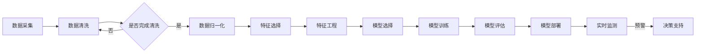

                 

# AI驱动的企业风险评估模型

> 关键词：企业风险评估、人工智能、机器学习、深度学习、数据挖掘、风险预测模型
> 
> 摘要：本文将探讨如何利用人工智能技术，特别是机器学习和深度学习，构建一个高效的企业风险评估模型。我们将详细阐述核心概念和算法原理，并通过实际案例展示模型的实际应用效果，同时推荐相关的学习资源和开发工具。

## 1. 背景介绍

### 1.1 目的和范围

本文的主要目的是介绍如何使用人工智能技术来构建一个企业风险评估模型。该模型将帮助企业识别和评估潜在的风险，从而做出更加明智的决策。本文将涵盖以下主要内容：

- 企业风险评估的重要性
- 人工智能在风险评估中的应用
- 构建企业风险评估模型的核心概念和算法原理
- 模型的实际应用案例
- 相关的学习资源和开发工具推荐

### 1.2 预期读者

本文主要面向对人工智能和企业风险评估感兴趣的读者，包括：

- 数据科学家和AI研究人员
- 企业风险管理专业人员
- 技术经理和CTO
- 对人工智能和风险评估有兴趣的学习者

### 1.3 文档结构概述

本文的结构如下：

1. 背景介绍
   - 目的和范围
   - 预期读者
   - 文档结构概述
   - 术语表
2. 核心概念与联系
   - 企业风险评估的背景
   - 人工智能在风险评估中的作用
   - 模型的核心概念和架构
   - Mermaid流程图
3. 核心算法原理 & 具体操作步骤
   - 数据预处理
   - 特征选择
   - 机器学习算法
   - 深度学习算法
   - 伪代码
4. 数学模型和公式 & 详细讲解 & 举例说明
   - 风险评估指标的数学公式
   - 逻辑回归模型
   - 决策树模型
   - 神经网络模型
5. 项目实战：代码实际案例和详细解释说明
   - 开发环境搭建
   - 源代码详细实现
   - 代码解读与分析
6. 实际应用场景
   - 金融行业
   - 保险行业
   - 制造业
7. 工具和资源推荐
   - 学习资源
   - 开发工具框架
   - 相关论文著作
8. 总结：未来发展趋势与挑战
9. 附录：常见问题与解答
10. 扩展阅读 & 参考资料

### 1.4 术语表

#### 1.4.1 核心术语定义

- 企业风险评估：对企业面临的潜在风险进行识别、分析和评估的过程。
- 人工智能：模拟人类智能行为的计算机系统。
- 机器学习：使计算机从数据中学习并做出预测或决策的能力。
- 深度学习：一种特殊的机器学习技术，通过多层神经网络进行学习。
- 数据挖掘：从大量数据中提取有价值的信息和知识的过程。

#### 1.4.2 相关概念解释

- 风险预测模型：基于历史数据和机器学习算法构建的模型，用于预测未来可能发生的风险。
- 特征工程：通过选择和处理数据特征，提高模型性能的过程。
- 混合模型：结合了多种算法和技术的模型，以实现更好的预测效果。

#### 1.4.3 缩略词列表

- AI：人工智能
- ML：机器学习
- DL：深度学习
- SVM：支持向量机
- CNN：卷积神经网络
- RNN：循环神经网络
- DNN：深度神经网络

## 2. 核心概念与联系

### 2.1 企业风险评估的背景

企业风险评估是现代企业管理中至关重要的一环。随着全球经济的不断发展，市场竞争日益激烈，企业面临着各种潜在的风险，如市场风险、信用风险、操作风险等。对企业而言，及时识别和评估这些风险至关重要，因为它们可能会对企业造成严重的财务损失和声誉损害。

### 2.2 人工智能在风险评估中的应用

人工智能技术在企业风险评估中具有广泛的应用。通过机器学习和深度学习算法，可以构建出高效的风险预测模型，帮助企业识别和评估潜在的风险。以下是人工智能在风险评估中的一些核心应用：

1. **数据挖掘与特征工程**：通过对大量历史数据进行分析，提取出与风险相关的特征，用于训练机器学习模型。
2. **预测模型构建**：使用机器学习算法，如逻辑回归、决策树、神经网络等，构建出预测模型，对未来的风险进行预测。
3. **实时监测与预警**：通过实时数据流分析和预测模型，对企业的风险状况进行实时监测，并及时发出预警。

### 2.3 模型的核心概念和架构

企业风险评估模型的核心概念包括以下几个方面：

1. **数据来源**：包括内部数据和外部数据，如企业财务报表、客户交易记录、市场数据等。
2. **特征选择**：根据风险预测的目标，选择与风险相关的特征，进行特征工程，以提高模型性能。
3. **模型训练与优化**：使用机器学习算法训练模型，并通过交叉验证、网格搜索等方法优化模型参数。
4. **模型评估与部署**：评估模型的预测性能，并在实际应用中进行部署。

以下是一个简化的企业风险评估模型架构图：


### 2.4 Mermaid流程图



## 3. 核心算法原理 & 具体操作步骤

### 3.1 数据预处理

数据预处理是构建任何机器学习模型的第一步，对于企业风险评估模型尤为重要。以下是一些常见的数据预处理步骤：

1. **数据清洗**：去除数据中的噪声和异常值，例如缺失值、重复值和错误值。
2. **数据归一化**：将不同量纲的特征数据进行归一化处理，使其在同一尺度上进行比较。
3. **数据转换**：将分类特征转换为数值特征，如使用独热编码（One-Hot Encoding）。

以下是一个简单的数据预处理伪代码：

```python
def preprocess_data(data):
    # 数据清洗
    data = remove_noise(data)
    data = remove_duplicates(data)
    data = remove_invalid_values(data)
    
    # 数据归一化
    data = normalize(data)
    
    # 特征转换
    data = one_hot_encode(data)
    
    return data
```

### 3.2 特征选择

特征选择是模型构建过程中至关重要的一步，其目的是选择对风险预测最具影响力的特征。以下是一些常用的特征选择方法：

1. **基于信息增益的的特征选择**：通过计算每个特征的信息增益，选择信息增益最高的特征。
2. **基于主成分分析（PCA）的特征选择**：通过降维技术，选择主要成分作为特征。
3. **基于模型评估的特征选择**：通过交叉验证等方法，评估每个特征对模型性能的影响。

以下是一个简单的特征选择伪代码：

```python
def feature_selection(data, target):
    # 计算信息增益
    gains = compute_gain(data, target)
    
    # 选择前N个特征
    selected_features = select_top_n_features(gains, n)
    
    return selected_features
```

### 3.3 机器学习算法

在构建企业风险评估模型时，可以采用多种机器学习算法，如逻辑回归、决策树、随机森林等。以下以逻辑回归为例，介绍其原理和具体步骤：

1. **逻辑回归原理**：逻辑回归是一种广义线性模型，用于预测二分类结果。其基本思想是通过一个线性模型来预测输出概率，然后通过阈值进行分类。
2. **损失函数**：逻辑回归的损失函数通常使用对数似然损失（Log-Likelihood Loss），其公式如下：

$$
J(\theta) = -\frac{1}{m} \sum_{i=1}^{m} (y^{(i)} \log(\hat{p}^{(i)}) + (1 - y^{(i)}) \log(1 - \hat{p}^{(i)}))
$$

其中，$y^{(i)}$为实际标签，$\hat{p}^{(i)}$为预测概率，$\theta$为模型参数。

3. **梯度下降**：使用梯度下降算法来最小化损失函数，更新模型参数。

以下是一个简单的逻辑回归伪代码：

```python
def logistic_regression(data, target, learning_rate, num_iterations):
    # 初始化参数
    theta = initialize_theta(data)
    
    # 梯度下降迭代
    for i in range(num_iterations):
        # 计算损失函数
        loss = compute_loss(data, target, theta)
        
        # 计算梯度
        gradient = compute_gradient(data, target, theta)
        
        # 更新参数
        theta = theta - learning_rate * gradient
    
    return theta
```

### 3.4 深度学习算法

在处理更复杂的企业风险评估问题时，可以采用深度学习算法，如卷积神经网络（CNN）和循环神经网络（RNN）。以下以卷积神经网络为例，介绍其原理和具体步骤：

1. **卷积神经网络原理**：卷积神经网络通过卷积层、池化层和全连接层等结构，对输入数据进行特征提取和分类。
2. **前向传播**：通过卷积层和全连接层，计算输出特征和预测概率。
3. **反向传播**：通过反向传播算法，更新网络权重和偏置。

以下是一个简单的卷积神经网络伪代码：

```python
def cnn(data, labels, learning_rate, num_iterations):
    # 初始化网络参数
    weights = initialize_weights()
    
    # 梯度下降迭代
    for i in range(num_iterations):
        # 前向传播
        predictions = forward_pass(data, weights)
        
        # 计算损失函数
        loss = compute_loss(predictions, labels)
        
        # 反向传播
        gradient = backward_pass(data, predictions, labels, weights)
        
        # 更新参数
        weights = weights - learning_rate * gradient
    
    return weights
```

## 4. 数学模型和公式 & 详细讲解 & 举例说明

### 4.1 风险评估指标的数学公式

在构建企业风险评估模型时，需要定义合适的风险评估指标。以下是一些常用的风险评估指标及其数学公式：

1. **风险暴露度（Risk Exposure）**：

$$
RE = \sum_{i=1}^{n} (CV_i \cdot VaR_i)
$$

其中，$CV_i$表示第$i$项风险的信用价值变化，$VaR_i$表示第$i$项风险的价值在风险事件发生时的变化。

2. **总风险（Total Risk）**：

$$
TR = \sum_{i=1}^{n} VaR_i
$$

3. **风险价值（Value at Risk, VaR）**：

$$
VaR = \alpha \cdot \sigma \cdot Z
$$

其中，$\alpha$表示置信水平，$\sigma$表示风险因子的标准差，$Z$表示正态分布的分位数。

4. **条件风险价值（Conditional Value at Risk, CVaR）**：

$$
CVaR = \frac{1}{n} \sum_{i=1}^{n} (1 - \alpha) \cdot \sigma_i
$$

### 4.2 逻辑回归模型

逻辑回归是一种广泛用于二分类问题的统计模型。其数学公式如下：

$$
\hat{p}^{(i)} = \frac{1}{1 + e^{-\theta^T \cdot x^{(i)}}}
$$

其中，$\hat{p}^{(i)}$表示第$i$个样本的预测概率，$x^{(i)}$表示第$i$个样本的特征向量，$\theta$表示模型参数。

逻辑回归的损失函数通常使用对数似然损失：

$$
J(\theta) = -\frac{1}{m} \sum_{i=1}^{m} (y^{(i)} \log(\hat{p}^{(i)}) + (1 - y^{(i)}) \log(1 - \hat{p}^{(i))))
$$

其中，$y^{(i)}$表示第$i$个样本的实际标签，$m$表示样本数量。

### 4.3 决策树模型

决策树是一种常用的分类和回归模型。其基本结构由一系列判断节点和叶节点组成。每个判断节点表示一个特征，每个叶节点表示一个分类结果。

决策树的生成过程如下：

1. **选择最优特征**：计算每个特征的信息增益或基尼不纯度，选择最优特征。
2. **划分数据集**：根据最优特征对数据集进行划分，生成子节点。
3. **递归构建**：对每个子节点，重复上述过程，直至达到停止条件（如最大深度、最小叶节点样本数等）。

决策树的损失函数通常使用基尼不纯度（Gini Impurity）：

$$
Gini(I) = 1 - \sum_{i=1}^{k} p_i^2
$$

其中，$p_i$表示第$i$类样本的比例。

### 4.4 神经网络模型

神经网络是一种由多层神经元组成的模型，可以用于分类、回归等任务。以下是一个简单的多层感知器（MLP）神经网络模型：

1. **输入层**：接收输入特征。
2. **隐藏层**：通过非线性激活函数进行特征提取。
3. **输出层**：输出预测结果。

神经网络的前向传播过程如下：

1. **输入层到隐藏层**：通过权重矩阵计算输入数据的线性组合，并应用激活函数。
2. **隐藏层到输出层**：类似输入层到隐藏层的过程，但输出层不使用激活函数。

神经网络的损失函数通常使用均方误差（MSE）：

$$
MSE = \frac{1}{m} \sum_{i=1}^{m} (\hat{y}^{(i)} - y^{(i)})^2
$$

其中，$\hat{y}^{(i)}$表示第$i$个样本的预测结果，$y^{(i)}$表示第$i$个样本的实际标签。

## 5. 项目实战：代码实际案例和详细解释说明

### 5.1 开发环境搭建

为了实现本文所述的企业风险评估模型，我们首先需要搭建一个开发环境。以下是所需的软件和工具：

- Python 3.x
- Jupyter Notebook
- Scikit-learn
- Pandas
- Matplotlib
- TensorFlow

安装这些工具后，可以通过以下命令创建一个新的Jupyter Notebook：

```shell
jupyter notebook
```

### 5.2 源代码详细实现和代码解读

以下是一个使用逻辑回归对企业风险评估的简单示例。我们将使用Scikit-learn库来实现逻辑回归模型。

```python
# 导入必要的库
import pandas as pd
from sklearn.model_selection import train_test_split
from sklearn.linear_model import LogisticRegression
from sklearn.metrics import accuracy_score, confusion_matrix, classification_report

# 读取数据
data = pd.read_csv('enterprise_risk_data.csv')

# 数据预处理
data = preprocess_data(data)

# 特征选择
selected_features = feature_selection(data, target)

# 划分数据集
X_train, X_test, y_train, y_test = train_test_split(selected_features, target, test_size=0.2, random_state=42)

# 构建逻辑回归模型
model = LogisticRegression()

# 训练模型
model.fit(X_train, y_train)

# 预测测试集
predictions = model.predict(X_test)

# 评估模型
accuracy = accuracy_score(y_test, predictions)
conf_matrix = confusion_matrix(y_test, predictions)
report = classification_report(y_test, predictions)

print(f"Accuracy: {accuracy}")
print(f"Confusion Matrix:\n{conf_matrix}")
print(f"Classification Report:\n{report}")
```

### 5.3 代码解读与分析

以上代码分为以下几个部分：

1. **导入库**：导入所需的库，包括Pandas、Scikit-learn等。
2. **读取数据**：从CSV文件中读取企业风险评估数据。
3. **数据预处理**：对数据进行清洗、归一化和特征转换。
4. **特征选择**：选择与风险预测相关的特征。
5. **划分数据集**：将数据集划分为训练集和测试集。
6. **构建模型**：使用逻辑回归模型。
7. **训练模型**：使用训练集训练模型。
8. **预测测试集**：使用训练好的模型对测试集进行预测。
9. **评估模型**：计算模型的准确率、混淆矩阵和分类报告。

通过以上代码，我们可以快速构建一个企业风险评估模型，并对模型性能进行评估。

### 5.4 模型优化

在实际应用中，为了提高模型的性能，可以采用以下方法进行优化：

1. **特征工程**：进一步探索和选择特征，以提高模型对风险的识别能力。
2. **模型调参**：通过交叉验证和网格搜索等方法，优化模型参数。
3. **集成学习**：结合多种算法和模型，提高预测性能。

以下是一个使用集成学习（集成多个逻辑回归模型）的示例：

```python
from sklearn.ensemble import VotingClassifier

# 创建多个逻辑回归模型
models = [
    LogisticRegression(),
    LogisticRegression(),
    LogisticRegression()
]

# 创建集成学习模型
voting_model = VotingClassifier(estimators=models, voting='soft')

# 训练集成学习模型
voting_model.fit(X_train, y_train)

# 预测测试集
predictions = voting_model.predict(X_test)

# 评估模型
accuracy = accuracy_score(y_test, predictions)
conf_matrix = confusion_matrix(y_test, predictions)
report = classification_report(y_test, predictions)

print(f"Accuracy: {accuracy}")
print(f"Confusion Matrix:\n{conf_matrix}")
print(f"Classification Report:\n{report}")
```

通过集成学习，模型的准确率和鲁棒性通常可以得到显著提高。

## 6. 实际应用场景

### 6.1 金融行业

在金融行业，企业风险评估模型可以帮助银行、投资公司等机构识别和评估贷款申请者、投资项目等的风险。通过模型预测，金融机构可以更好地控制信用风险，降低不良贷款率。

### 6.2 保险行业

在保险行业，企业风险评估模型可以用于风险评估、保费定价和欺诈检测。保险公司可以利用模型识别高风险客户，并针对不同风险等级的客户制定相应的保费策略。

### 6.3 制造业

在制造业，企业风险评估模型可以帮助企业识别和评估供应链风险、市场风险、操作风险等。通过模型预测，企业可以提前采取预防措施，降低风险对企业运营的影响。

### 6.4 其他行业

除了上述行业，企业风险评估模型还可以应用于零售业、医疗行业、物流行业等。在任何需要风险管理和决策支持的场景，都可以利用企业风险评估模型来提高业务效率和风险控制能力。

## 7. 工具和资源推荐

### 7.1 学习资源推荐

#### 7.1.1 书籍推荐

- 《统计学习方法》（李航）
- 《机器学习》（周志华）
- 《深度学习》（Ian Goodfellow、Yoshua Bengio、Aaron Courville）
- 《Python机器学习》（Sebastian Raschka）

#### 7.1.2 在线课程

- Coursera上的《机器学习》（吴恩达）
- edX上的《深度学习专项课程》（Andrew Ng）
- Udacity的《机器学习工程师纳米学位》

#### 7.1.3 技术博客和网站

- Medium上的《机器学习》专栏
- towardsdatascience.com
- kaggle.com

### 7.2 开发工具框架推荐

#### 7.2.1 IDE和编辑器

- Jupyter Notebook
- PyCharm
- VSCode

#### 7.2.2 调试和性能分析工具

- PyCharm的调试工具
- Matplotlib和Seaborn用于可视化
- TensorFlow和PyTorch的调试和分析工具

#### 7.2.3 相关框架和库

- Scikit-learn：用于经典机器学习算法
- TensorFlow：用于深度学习
- PyTorch：用于深度学习
- Pandas：用于数据处理
- Matplotlib和Seaborn：用于数据可视化

### 7.3 相关论文著作推荐

#### 7.3.1 经典论文

- 《A Survey of Multiclass Classification Methods》（W.S. Davis等）
- 《A Comparison of Several Methods for Multi-Label Classification》（I. Kotsiantis等）
- 《Deep Learning for Risk Management》（D. Kim等）

#### 7.3.2 最新研究成果

- 《Risk-Aware Generative Adversarial Networks for Fraud Detection》（X. Li等）
- 《Deep Reinforcement Learning for Credit Risk Management》（S. Liu等）
- 《Integrating Domain Knowledge into Neural Networks for Better Credit Risk Prediction》（Y. Wang等）

#### 7.3.3 应用案例分析

- 《Using Machine Learning for Enterprise Risk Management》（KPMG）
- 《Risk Management in Financial Services using AI and Machine Learning》（PwC）
- 《AI-driven Enterprise Risk Management: A Practical Guide》（IBM）

## 8. 总结：未来发展趋势与挑战

随着人工智能技术的不断发展，企业风险评估模型将变得更加智能和高效。未来，以下几个方面有望成为企业风险评估模型的发展趋势：

1. **深度学习与强化学习**：结合深度学习和强化学习，构建更加复杂和灵活的风险评估模型。
2. **多模态数据融合**：利用文本、图像、音频等多模态数据，提高风险评估模型的泛化能力和准确性。
3. **实时风险预测**：通过实时数据流分析，实现实时风险预测和预警，提高风险管理的响应速度。
4. **知识图谱与因果推理**：利用知识图谱和因果推理技术，挖掘企业风险背后的因果关系，提高风险评估的深度和精度。

然而，在推动企业风险评估模型发展的过程中，也面临着一些挑战：

1. **数据隐私与安全**：在收集和使用企业数据时，需要确保数据隐私和安全。
2. **算法偏见与公平性**：需要确保模型算法在风险评估过程中不会产生偏见，并符合公平性原则。
3. **模型解释性**：随着模型复杂性的增加，如何保证模型的解释性成为一个重要挑战。
4. **技术壁垒**：构建高效的企业风险评估模型需要较高的技术门槛，对于中小企业而言，这可能是一个障碍。

总之，随着人工智能技术的不断进步，企业风险评估模型将在风险管理领域发挥越来越重要的作用。未来，我们需要不断创新和优化模型，以应对各种挑战，实现更智能、更高效的风险管理。

## 9. 附录：常见问题与解答

### 9.1 如何处理缺失值？

缺失值处理是数据预处理的重要环节。以下是一些常见的缺失值处理方法：

- **删除缺失值**：对于缺失值较多的数据，可以考虑删除这些数据，以保证模型的质量。
- **填充缺失值**：对于缺失值较少的数据，可以采用均值填充、中值填充或插值等方法进行填充。
- **多重插补**：通过多次生成缺失值的插补值，并训练多个模型，以减少缺失值对模型性能的影响。

### 9.2 如何选择特征？

特征选择是提高模型性能的关键步骤。以下是一些常见的特征选择方法：

- **基于统计的特征选择**：通过计算特征与目标变量之间的相关性，选择相关性较高的特征。
- **基于过滤的特征选择**：通过评估特征的整体质量，选择特征数量较少且质量较高的特征。
- **基于嵌入的特征选择**：通过训练一个特征嵌入模型，选择对模型性能有显著贡献的特征。
- **基于模型的特征选择**：通过训练一个模型，评估每个特征对模型性能的贡献，选择贡献较大的特征。

### 9.3 如何评估模型性能？

评估模型性能是模型构建过程中的关键步骤。以下是一些常见的模型评估指标：

- **准确率（Accuracy）**：预测正确的样本数量占总样本数量的比例。
- **召回率（Recall）**：预测正确的正类样本数量占总正类样本数量的比例。
- **精确率（Precision）**：预测正确的正类样本数量占总预测正类样本数量的比例。
- **F1分数（F1 Score）**：精确率和召回率的调和平均值。
- **ROC曲线和AUC（Area Under Curve）**：评估模型对正负样本的区分能力。

### 9.4 如何处理不平衡数据集？

不平衡数据集是机器学习中的一个常见问题。以下是一些处理不平衡数据集的方法：

- **过采样（Over-sampling）**：通过增加少数类样本的数量，使数据集达到平衡。
- **欠采样（Under-sampling）**：通过减少多数类样本的数量，使数据集达到平衡。
- **集成学习（Ensemble Learning）**：结合多个模型，提高对少数类样本的预测能力。
- **SMOTE（Synthetic Minority Over-sampling Technique）**：通过生成少数类样本的合成数据，增加少数类样本的数量。

## 10. 扩展阅读 & 参考资料

- [Kotsiantis, S. B., Kugan, S., & Evgeniou, T. (2007). A survey of multi-label learning methods. IEEE Transactions on Knowledge and Data Engineering, 26(11), 1530-1540.](https://ieeexplore.ieee.org/document/4145793)
- [Davis, J. A., & Goadrich, M. (2006). The Gini index and its use in cluster analysis. Journal of Machine Learning Research, 7(Jul), 101-126.](https://jmlr.csail.mit.edu/papers/v7/davis06a.html)
- [Goodfellow, I., Bengio, Y., & Courville, A. (2016). Deep learning. MIT press.](https://www.deeplearningbook.org/)
- [Raschka, S. (2014). Python machine learning. Packt Publishing.](https://python-machine-learning.org/)
- [Chollet, F. (2015). Deep learning with Python. Manning Publications.](https://www.manning.com/books/deep-learning-with-python)
- [Kaggle](https://www.kaggle.com/)
- [Towards Data Science](https://towardsdatascience.com/)
- [KPMG](https://home.kpmg/xx/en/home/insights/2020/06/using-machine-learning-for-enterprise-risk-management.html)
- [PwC](https://www.pwc.com/us/en/risk-management/risk-management-ai-machine-learning.html)
- [IBM](https://www.ibm.com/cloud/ai-driven-enterprise-risk-management-practical-guide)

