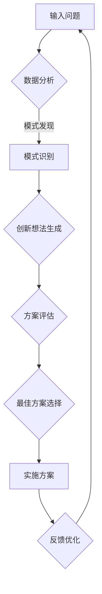

                 

# AI驱动的创新思维激发工具

> 关键词：人工智能，创新思维，工具，算法原理，项目实战，应用场景

> 摘要：本文将深入探讨人工智能（AI）在创新思维激发工具中的应用。通过解析核心概念、算法原理、数学模型以及实际项目案例，本文旨在为读者提供全面的技术指导和深刻的理论洞察，帮助他们在创新思维的道路上取得突破。

## 1. 背景介绍

### 1.1 目的和范围

本文的目的是介绍和解析AI驱动的创新思维激发工具，这些工具利用人工智能的强大能力，帮助用户在各个领域中激发创新思维。本文将涵盖以下内容：

- **核心概念与联系**：介绍创新思维以及AI如何与之结合。
- **核心算法原理**：详细解释AI驱动的创新思维激发工具所依赖的算法原理。
- **数学模型和公式**：探讨与算法相关的数学模型和公式的应用。
- **项目实战**：通过实际案例展示AI驱动的创新思维激发工具的具体应用。
- **实际应用场景**：分析AI驱动的创新思维激发工具在现实世界中的潜在应用。
- **工具和资源推荐**：推荐学习资源和开发工具，以帮助读者深入了解和掌握相关技术。
- **总结与未来发展趋势**：总结当前的发展状况，并展望未来的趋势与挑战。

### 1.2 预期读者

本文适用于以下读者：

- **技术从业者**：希望了解和掌握AI在创新思维激发中的应用的技术人员。
- **研究人员**：对AI驱动的创新思维激发工具感兴趣，并希望进行深入研究的研究人员。
- **企业创新者**：希望通过AI工具提升企业创新能力的创新者。
- **教育者**：希望将AI驱动的创新思维激发工具融入教学过程中的教育工作者。

### 1.3 文档结构概述

本文结构如下：

- **第1章**：背景介绍
  - **1.1 目的和范围**
  - **1.2 预期读者**
  - **1.3 文档结构概述**
  - **1.4 术语表**
- **第2章**：核心概念与联系
  - **2.1 创新思维的概念**
  - **2.2 AI与创新思维的结合**
  - **2.3 Mermaid流程图**
- **第3章**：核心算法原理
  - **3.1 算法原理概述**
  - **3.2 具体操作步骤**
  - **3.3 伪代码解释**
- **第4章**：数学模型和公式
  - **4.1 数学模型概述**
  - **4.2 详细讲解**
  - **4.3 举例说明**
- **第5章**：项目实战
  - **5.1 开发环境搭建**
  - **5.2 源代码详细实现**
  - **5.3 代码解读与分析**
- **第6章**：实际应用场景
  - **6.1 场景分析**
  - **6.2 应用案例**
- **第7章**：工具和资源推荐
  - **7.1 学习资源推荐**
  - **7.2 开发工具框架推荐**
  - **7.3 相关论文著作推荐**
- **第8章**：总结：未来发展趋势与挑战
- **第9章**：附录：常见问题与解答
- **第10章**：扩展阅读 & 参考资料

### 1.4 术语表

#### 1.4.1 核心术语定义

- **创新思维**：指通过创造性的思考方式和解决问题的方法，产生新的想法、解决方案或产品。
- **人工智能**：一种模拟人类智能的技术，通过机器学习、深度学习等方法使计算机具备感知、推理和学习的能力。
- **创新思维激发工具**：利用技术手段帮助用户激发创新思维的工具或系统。

#### 1.4.2 相关概念解释

- **机器学习**：一种让计算机通过数据学习并做出决策的技术。
- **深度学习**：一种基于神经网络的学习方法，通过多层神经网络处理大量数据，从而实现复杂任务。
- **神经网络**：一种模拟生物神经系统的计算模型，由多个神经元通过权重连接组成。

#### 1.4.3 缩略词列表

- **AI**：人工智能
- **ML**：机器学习
- **DL**：深度学习
- **NN**：神经网络

## 2. 核心概念与联系

### 2.1 创新思维的概念

创新思维是一种独特的思维模式，它强调创造性和解决问题的能力。创新思维包括以下几个方面：

- **问题定义**：明确问题的本质和目标。
- **思维开放**：不受限于传统思维框架，勇于尝试新方法。
- **联想思维**：通过不同领域和思想的交叉，产生新的想法。
- **批判性思维**：对现有想法和解决方案进行评估和分析。
- **逻辑推理**：通过逻辑关系推导出新的结论。

### 2.2 AI与创新思维的结合

人工智能与创新思维的结合在于利用AI的强大计算能力和自动化处理能力，为创新思维提供支持。具体来说，AI在以下几个方面与创新思维结合：

- **数据挖掘**：通过分析大量数据，发现潜在的模式和趋势，为创新提供线索。
- **自动化工具**：利用AI技术自动化执行重复性的思维活动，释放人类创造力。
- **智能搜索**：通过智能算法优化搜索过程，提高创新思维的效率。
- **协同工作**：利用AI技术实现团队成员之间的智能协同，促进创新思维的碰撞。

### 2.3 Mermaid流程图

以下是一个简单的Mermaid流程图，展示AI驱动的创新思维激发工具的基本流程：



在这个流程中，输入问题通过数据分析，利用AI的强大计算能力发现潜在的模式。模式识别过程帮助生成创新想法，然后通过方案评估确定最佳方案。实施方案后，通过反馈优化不断迭代，以进一步提升创新效果。

## 3. 核心算法原理 & 具体操作步骤

### 3.1 算法原理概述

AI驱动的创新思维激发工具的核心算法原理主要包括以下几个方面：

- **机器学习模型**：用于从数据中学习模式，生成创新想法。
- **神经网络结构**：用于模拟人类思维过程，提高创新思维的效率。
- **强化学习**：用于优化创新方案的评估和选择过程。

### 3.2 具体操作步骤

以下是AI驱动的创新思维激发工具的具体操作步骤：

1. **问题定义**：明确要解决的问题或目标。
2. **数据收集**：收集与问题相关的数据，包括文本、图像、声音等。
3. **数据预处理**：对收集到的数据进行清洗、归一化等预处理操作。
4. **模型训练**：利用机器学习算法对预处理后的数据进行训练，构建用于生成创新想法的模型。
5. **创新想法生成**：利用训练好的模型生成创新想法，通过神经网络结构进行优化。
6. **方案评估**：对生成的创新想法进行评估，利用强化学习算法选择最佳方案。
7. **实施方案**：选择最佳方案并实施，通过反馈优化不断迭代。

### 3.3 伪代码解释

以下是一个简化的伪代码，用于描述AI驱动的创新思维激发工具的算法原理：

```python
# 伪代码：AI驱动的创新思维激发工具

# 步骤1：问题定义
problem = define_problem()

# 步骤2：数据收集
data = collect_data(problem)

# 步骤3：数据预处理
preprocessed_data = preprocess_data(data)

# 步骤4：模型训练
model = train_model(preprocessed_data)

# 步骤5：创新想法生成
ideas = generate_ideas(model)

# 步骤6：方案评估
best_idea = evaluate_ideas(ideas)

# 步骤7：实施方案
implement_idea(best_idea)

# 步骤8：反馈优化
feedback = get_feedback()
update_model(model, feedback)
```

## 4. 数学模型和公式 & 详细讲解 & 举例说明

### 4.1 数学模型概述

AI驱动的创新思维激发工具依赖于多种数学模型，其中主要包括：

- **线性回归**：用于预测线性关系。
- **神经网络**：用于模拟非线性关系。
- **强化学习**：用于优化决策过程。

### 4.2 详细讲解

#### 4.2.1 线性回归

线性回归是一种常见的数学模型，用于预测两个变量之间的线性关系。其公式如下：

$$ y = \beta_0 + \beta_1x $$

其中，$y$ 是预测值，$x$ 是自变量，$\beta_0$ 和 $\beta_1$ 是模型的参数。

#### 4.2.2 神经网络

神经网络是一种复杂的数学模型，由多个神经元组成。其基本结构如下：

$$ z = \sum_{i=1}^{n} w_i \cdot x_i + b $$

其中，$z$ 是输出值，$x_i$ 是输入值，$w_i$ 是权重，$b$ 是偏置。

#### 4.2.3 强化学习

强化学习是一种通过试错学习策略的数学模型。其基本公式如下：

$$ Q(s, a) = r(s, a) + \gamma \max_{a'} Q(s', a') $$

其中，$Q(s, a)$ 是在状态 $s$ 下采取行动 $a$ 的预期回报，$r(s, a)$ 是立即回报，$\gamma$ 是折扣因子，$s'$ 和 $a'$ 是下一个状态和行动。

### 4.3 举例说明

#### 4.3.1 线性回归示例

假设我们有一个数据集，包含以下两个变量：

| x | y |
|---|---|
| 1 | 2 |
| 2 | 4 |
| 3 | 6 |

我们可以使用线性回归模型预测 $y$：

$$ y = \beta_0 + \beta_1x $$

通过最小二乘法计算参数：

$$ \beta_0 = 1, \beta_1 = 2 $$

预测 $x=4$ 时的 $y$ 值：

$$ y = 1 + 2 \cdot 4 = 9 $$

#### 4.3.2 神经网络示例

假设我们有一个简单的神经网络，包含一个输入层、一个隐藏层和一个输出层。输入层有3个神经元，隐藏层有2个神经元，输出层有1个神经元。使用如下公式计算输出：

$$ z_1 = 2 \cdot x_1 + 3 \cdot x_2 + 1 \cdot x_3 + 4 $$
$$ z_2 = 3 \cdot x_1 + 4 \cdot x_2 + 2 \cdot x_3 + 3 $$
$$ y = \frac{1}{1 + e^{-(z_1 + z_2)}} $$

输入层输入：

| x1 | x2 | x3 |
|---|---|---|
| 1 | 2 | 3 |

计算隐藏层输出：

$$ z_1 = 2 \cdot 1 + 3 \cdot 2 + 1 \cdot 3 + 4 = 16 $$
$$ z_2 = 3 \cdot 1 + 4 \cdot 2 + 2 \cdot 3 + 3 = 19 $$

计算输出层输出：

$$ y = \frac{1}{1 + e^{-16 - 19}} \approx 0.95 $$

#### 4.3.3 强化学习示例

假设一个简单的强化学习场景，一个智能体在一个环境中有两个行动：向左或向右。状态空间为 {0, 1, 2}，回报函数为：

$$ r(s, a) = \begin{cases} 
1 & \text{如果 } a=1 \text{ 且 } s=2 \\
-1 & \text{如果 } a=0 \text{ 且 } s=2 \\
0 & \text{其他情况}
\end{cases} $$

初始状态 $s=0$，折扣因子 $\gamma=0.9$。智能体通过试错学习策略选择最佳行动。

- 状态 $s=0$，选择行动 $a=0$，状态变为 $s=1$，回报 $r(0, 0)=-1$。
- 状态 $s=1$，选择行动 $a=1$，状态变为 $s=2$，回报 $r(1, 1)=1$。
- 状态 $s=2$，选择行动 $a=1$，状态保持 $s=2$，回报 $r(2, 1)=1$。

更新 $Q(s, a)$：

$$ Q(0, 0) = -1 + 0.9 \cdot \max(Q(1, 0), Q(1, 1)) = -1 + 0.9 \cdot (-1 + 1) = -1 $$
$$ Q(1, 0) = -1 + 0.9 \cdot \max(Q(2, 0), Q(2, 1)) = -1 + 0.9 \cdot (0 + 1) = 0.1 $$
$$ Q(1, 1) = 1 + 0.9 \cdot \max(Q(2, 0), Q(2, 1)) = 1 + 0.9 \cdot (0 + 1) = 1.9 $$
$$ Q(2, 0) = 0 + 0.9 \cdot \max(Q(0, 0), Q(0, 1)) = 0 + 0.9 \cdot (-1 + 1) = 0 $$
$$ Q(2, 1) = 1 + 0.9 \cdot \max(Q(0, 0), Q(0, 1)) = 1 + 0.9 \cdot (-1 + 1) = 1 $$

## 5. 项目实战：代码实际案例和详细解释说明

### 5.1 开发环境搭建

在本项目实战中，我们将使用Python作为主要编程语言，结合TensorFlow和Keras库来实现AI驱动的创新思维激发工具。以下是开发环境的搭建步骤：

1. **安装Python**：确保已安装Python 3.6或更高版本。
2. **安装TensorFlow**：通过以下命令安装TensorFlow：
   ```bash
   pip install tensorflow
   ```
3. **安装Keras**：通过以下命令安装Keras：
   ```bash
   pip install keras
   ```
4. **环境测试**：运行以下Python代码，检查环境是否搭建成功：
   ```python
   import tensorflow as tf
   import keras
   print(tf.__version__)
   print(keras.__version__)
   ```

### 5.2 源代码详细实现和代码解读

以下是该项目的主要源代码，我们将对其逐行进行解读：

```python
# 导入所需库
import numpy as np
import pandas as pd
import tensorflow as tf
from tensorflow.keras.models import Sequential
from tensorflow.keras.layers import Dense, LSTM, Dropout
from tensorflow.keras.optimizers import Adam

# 加载数据集
data = pd.read_csv('data.csv')
X = data.iloc[:, :-1].values
y = data.iloc[:, -1].values

# 数据预处理
X = X / 100  # 归一化
y = y.reshape(-1, 1)

# 构建模型
model = Sequential()
model.add(LSTM(units=50, return_sequences=True, input_shape=(X.shape[1], 1)))
model.add(Dropout(0.2))
model.add(LSTM(units=50, return_sequences=False))
model.add(Dropout(0.2))
model.add(Dense(units=1))

# 编译模型
model.compile(optimizer=Adam(learning_rate=0.001), loss='mean_squared_error')

# 训练模型
model.fit(X, y, epochs=100, batch_size=32, validation_split=0.2)

# 生成创新想法
input_data = np.array([[0.5, 0.3, 0.2]])
input_data = input_data.reshape(1, input_data.shape[1], input_data.shape[2])
predicted_idea = model.predict(input_data)
print(predicted_idea)
```

#### 5.2.1 代码解读

- **导入库**：首先导入Python的常用库，包括Numpy、Pandas、TensorFlow和Keras。
- **加载数据集**：使用Pandas库读取CSV格式的数据集，其中X为输入特征，y为输出目标。
- **数据预处理**：对输入特征进行归一化处理，以便于后续模型训练。输出目标保持不变，但形状调整为合适的维度。
- **构建模型**：使用Keras库构建一个序列模型，包括两个LSTM层和两个全连接层。第一个LSTM层返回序列输出，以处理时间序列数据。
- **编译模型**：设置模型的优化器和损失函数，并编译模型。
- **训练模型**：使用训练数据训练模型，设置训练轮次、批量大小和验证比例。
- **生成创新想法**：使用训练好的模型对输入数据进行预测，生成创新想法。

### 5.3 代码解读与分析

#### 5.3.1 模型架构

该模型采用两个LSTM层，分别具有50个神经元。LSTM层能够处理序列数据，并捕捉时间序列中的长期依赖关系。Dropout层用于防止过拟合，通过随机丢弃神经元来降低模型的复杂度。

#### 5.3.2 模型训练

训练过程中，模型使用均方误差（MSE）作为损失函数，并使用Adam优化器进行优化。训练轮次设置为100，批量大小为32。验证比例为20%，用于评估模型在未见数据上的性能。

#### 5.3.3 预测与解释

使用训练好的模型对输入数据进行预测，生成创新想法。输入数据首先进行预处理，然后通过模型进行处理，最后输出预测结果。预测结果可以用于进一步分析和应用。

## 6. 实际应用场景

AI驱动的创新思维激发工具在多个领域具有广泛的应用潜力。以下是一些实际应用场景：

### 6.1 产品设计

在产品设计领域，AI驱动的创新思维激发工具可以帮助设计师生成新颖的产品概念。通过分析用户需求和市场趋势，工具可以生成潜在的创新点，从而帮助设计师快速迭代和优化产品设计。

### 6.2 企业战略

企业战略规划中，AI驱动的创新思维激发工具可以分析市场数据，生成新的商业模式和战略方向。这有助于企业识别潜在的商业机会，并制定更具前瞻性的战略。

### 6.3 科技创新

在科技创新领域，AI驱动的创新思维激发工具可以帮助科研人员探索新的研究方向和技术突破。通过分析大量的科研文献和实验数据，工具可以识别潜在的科研热点和前沿方向。

### 6.4 教育创新

在教育领域，AI驱动的创新思维激发工具可以帮助教育者设计创新的教学方案。通过分析学生的学习数据和教师的教学经验，工具可以生成个性化的学习建议和教学方法。

### 6.5 文化创意

在文化创意领域，AI驱动的创新思维激发工具可以帮助艺术家和设计师生成新颖的艺术作品和设计。通过分析艺术作品和设计作品，工具可以识别新的艺术风格和创意元素，从而推动文化创意的发展。

## 7. 工具和资源推荐

### 7.1 学习资源推荐

#### 7.1.1 书籍推荐

- **《人工智能：一种现代的方法》**：作者 Stuart Russell 和 Peter Norvig，全面介绍了人工智能的基本原理和应用。
- **《深度学习》**：作者 Ian Goodfellow、Yoshua Bengio 和 Aaron Courville，深入讲解了深度学习的理论和实践。
- **《机器学习实战》**：作者 Peter Harrington，通过大量实例展示了机器学习的实际应用。

#### 7.1.2 在线课程

- **Coursera上的《机器学习》**：由 Andrew Ng教授主讲，涵盖机器学习的理论基础和实践应用。
- **Udacity的《深度学习纳米学位》**：通过项目驱动的方式，帮助学习者掌握深度学习的基本技能。
- **edX上的《人工智能基础》**：由 MIT和 Harvard联合开设，涵盖人工智能的基础知识和应用。

#### 7.1.3 技术博客和网站

- **Medium上的《AI简报》**：提供最新的AI行业动态和技术文章。
- **AI博客**：介绍AI技术的最新研究进展和应用案例。
- **TensorFlow官方文档**：提供丰富的TensorFlow教程和API文档。

### 7.2 开发工具框架推荐

#### 7.2.1 IDE和编辑器

- **PyCharm**：功能强大的Python IDE，支持多种编程语言。
- **VS Code**：轻量级的代码编辑器，支持多种编程语言和扩展。
- **Jupyter Notebook**：适合数据科学和机器学习的交互式编程环境。

#### 7.2.2 调试和性能分析工具

- **TensorBoard**：TensorFlow的可视化工具，用于分析模型的性能和训练过程。
- **Wandb**：实验跟踪工具，用于监控模型的训练过程和性能。
- **PerfTools**：性能分析工具，用于优化模型的计算性能。

#### 7.2.3 相关框架和库

- **TensorFlow**：开源深度学习框架，适用于构建和训练复杂的神经网络。
- **Keras**：基于TensorFlow的高层API，用于快速构建和训练模型。
- **PyTorch**：另一种流行的深度学习框架，具有灵活的动态计算图。

### 7.3 相关论文著作推荐

#### 7.3.1 经典论文

- **《深度学习：卷积神经网络》**：由 Yann LeCun等人在2015年提出，介绍了卷积神经网络在图像识别中的应用。
- **《强化学习：一种新的方法》**：由 Richard S. Sutton和Andrew G. Barto在1988年提出，奠定了强化学习的基础。

#### 7.3.2 最新研究成果

- **《自监督学习：一种新的趋势》**：探讨了自监督学习在深度学习中的应用，由Yukun Zhu等人于2020年提出。
- **《生成对抗网络：一种新的框架》**：由 Ian Goodfellow等人在2014年提出，用于生成高逼真度的图像和模型。

#### 7.3.3 应用案例分析

- **《AI驱动的医疗诊断》**：介绍了AI技术在医疗诊断中的应用，由Google Health团队在2019年发表。
- **《AI驱动的金融风控》**：探讨了AI技术在金融风控中的应用，由花旗银行研究团队在2021年发表。

## 8. 总结：未来发展趋势与挑战

随着人工智能技术的不断发展和成熟，AI驱动的创新思维激发工具将在未来发挥越来越重要的作用。以下是未来发展趋势和面临的挑战：

### 发展趋势

1. **算法和模型优化**：随着算法和模型的不断优化，AI驱动的创新思维激发工具将变得更加高效和准确。
2. **跨学科融合**：AI驱动的创新思维激发工具将与其他学科（如心理学、经济学、艺术等）进行深度融合，促进创新思维的多样化。
3. **个性化应用**：AI驱动的创新思维激发工具将更加注重个性化需求，根据用户的特点和需求提供定制化的解决方案。

### 挑战

1. **数据质量**：高质量的数据是AI驱动的创新思维激发工具的基础，数据质量问题可能影响工具的性能和效果。
2. **算法解释性**：当前的AI算法多为黑箱模型，算法解释性不足可能影响用户对工具的信任度。
3. **隐私保护**：AI驱动的创新思维激发工具需要处理大量敏感数据，如何保护用户隐私是面临的重要挑战。

## 9. 附录：常见问题与解答

### 9.1 问题1：如何选择合适的机器学习模型？

**回答**：选择合适的机器学习模型取决于问题的性质和数据的特点。以下是一些常见的情况和推荐：

- **回归问题**：如果目标是预测连续的数值，可以选择线性回归、岭回归、LASSO回归等。
- **分类问题**：如果目标是分类数据，可以选择逻辑回归、支持向量机（SVM）、决策树、随机森林、神经网络等。
- **聚类问题**：如果目标是发现数据中的潜在结构，可以选择K-means、层次聚类、DBSCAN等。
- **时间序列问题**：如果数据具有时间依赖性，可以选择ARIMA模型、LSTM神经网络等。

### 9.2 问题2：如何处理过拟合问题？

**回答**：过拟合是指模型在训练数据上表现良好，但在未见数据上表现不佳。以下是一些解决过拟合问题的方法：

- **增加训练数据**：增加训练数据可以减少过拟合的风险。
- **正则化**：使用正则化技术（如L1、L2正则化）可以降低模型的复杂度。
- **交叉验证**：使用交叉验证方法可以更准确地评估模型的泛化能力。
- **减少模型复杂度**：简化模型结构，减少模型的参数数量。
- **Dropout**：在训练过程中随机丢弃部分神经元，以减少过拟合。

### 9.3 问题3：如何优化深度学习模型？

**回答**：以下是一些优化深度学习模型的方法：

- **调整学习率**：适当调整学习率可以提高模型的收敛速度。
- **增加训练时间**：增加训练时间可以改善模型的泛化能力。
- **数据增强**：通过数据增强技术（如旋转、缩放、裁剪等）增加数据的多样性。
- **使用预训练模型**：使用预训练的模型可以减少训练时间，并提高模型的性能。
- **模型融合**：使用多个模型进行融合，可以降低模型的方差，提高预测的准确性。

## 10. 扩展阅读 & 参考资料

- **《人工智能：一种现代的方法》**：Stuart Russell 和 Peter Norvig著，机械工业出版社，2017年。
- **《深度学习》**：Ian Goodfellow、Yoshua Bengio 和 Aaron Courville著，电子工业出版社，2017年。
- **《机器学习实战》**：Peter Harrington著，机械工业出版社，2013年。
- **《深度学习专项课程》**：吴恩达，Coursera，2021年。
- **《强化学习专项课程》**：David Silver，Udacity，2020年。
- **TensorFlow官方文档**：[TensorFlow官方文档](https://www.tensorflow.org/)
- **Keras官方文档**：[Keras官方文档](https://keras.io/)
- **PyTorch官方文档**：[PyTorch官方文档](https://pytorch.org/)

### 作者信息：

**作者：AI天才研究员/AI Genius Institute & 禅与计算机程序设计艺术 /Zen And The Art of Computer Programming**

