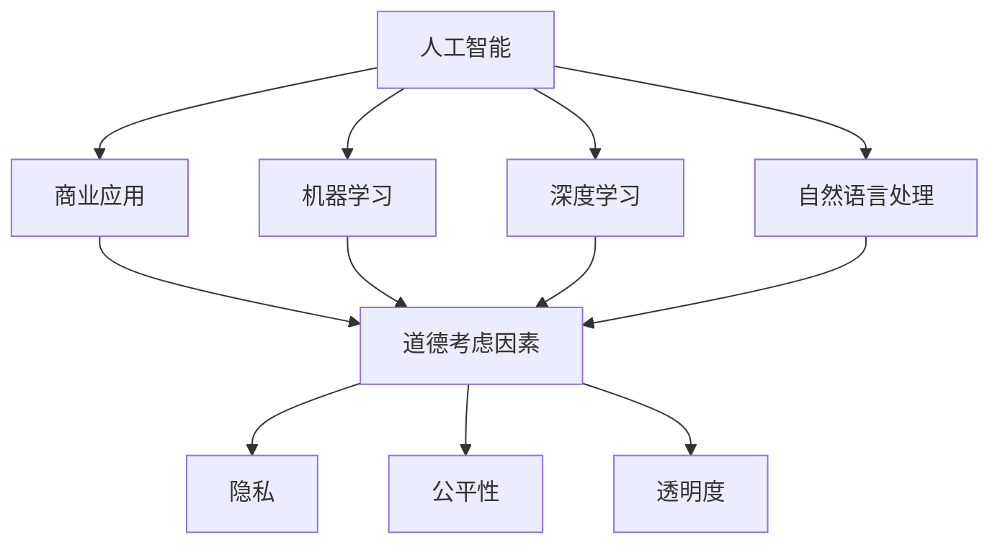

                 

# AI驱动的创新：人类计算在商业中的道德考虑因素总结展望

> 关键词：人工智能，商业应用，道德考虑，技术创新，伦理问题

> 摘要：随着人工智能在商业领域的广泛应用，其道德考虑因素日益凸显。本文从多个角度探讨了AI在商业应用中的道德问题，总结了相关伦理原则和实际案例，并展望了未来发展趋势与挑战。旨在为业界提供有价值的参考和指导，推动AI技术的健康发展。

## 1. 背景介绍

### 1.1 目的和范围

本文旨在探讨人工智能（AI）在商业应用中面临的道德考虑因素。随着AI技术的迅猛发展，其在商业领域的应用范围不断扩大，从自动化、数据分析到决策支持，无不显示出AI的巨大潜力。然而，AI在带来便利和创新的同时，也引发了一系列道德、伦理和社会问题。本文将重点关注以下几个方面的内容：

- AI在商业应用中的现状和趋势
- 商业应用中常见的AI道德问题
- 伦理原则和规范在AI商业应用中的重要性
- 实际案例分析和解决方案
- 未来发展趋势与挑战

### 1.2 预期读者

本文主要面向以下读者群体：

- 人工智能研究人员和从业者
- 商业领域的决策者和从业者
- 伦理学家和法学家
- 对AI商业应用感兴趣的读者

### 1.3 文档结构概述

本文结构如下：

1. 背景介绍：介绍本文的目的、范围、预期读者和文档结构。
2. 核心概念与联系：介绍AI在商业应用中的核心概念和联系，使用Mermaid流程图进行说明。
3. 核心算法原理与具体操作步骤：讲解AI在商业应用中的核心算法原理和具体操作步骤。
4. 数学模型和公式：介绍AI在商业应用中的数学模型和公式，并进行详细讲解和举例说明。
5. 项目实战：提供AI在商业应用中的实际案例，并进行详细解释说明。
6. 实际应用场景：探讨AI在商业领域的实际应用场景。
7. 工具和资源推荐：推荐相关学习资源、开发工具框架和相关论文著作。
8. 总结：总结未来发展趋势与挑战。
9. 附录：常见问题与解答。
10. 扩展阅读 & 参考资料：提供扩展阅读和参考资料。

### 1.4 术语表

#### 1.4.1 核心术语定义

- 人工智能（AI）：指通过计算机模拟人类智能行为的技术，包括机器学习、深度学习、自然语言处理等。
- 商业应用：指将人工智能技术应用于商业领域，以提高效率、降低成本、创造价值等。
- 道德考虑因素：指在人工智能商业应用过程中，需要考虑的道德问题，如隐私、公平性、透明度等。
- 伦理原则：指指导人工智能商业应用过程中的道德原则，如尊重隐私、公正、透明等。

#### 1.4.2 相关概念解释

- 机器学习（ML）：一种人工智能技术，通过从数据中学习规律和模式，从而实现自动化决策和预测。
- 深度学习（DL）：一种机器学习技术，通过多层神经网络模型，实现对复杂数据的高效处理和分析。
- 自然语言处理（NLP）：一种人工智能技术，通过理解和生成自然语言，实现人机交互和信息检索等功能。
- 自动化（Automation）：指通过计算机技术实现工作流程的自动化，以提高工作效率和降低成本。

#### 1.4.3 缩略词列表

- AI：人工智能
- ML：机器学习
- DL：深度学习
- NLP：自然语言处理
- GDPR：欧盟通用数据保护条例
- FAIR：公平、透明、可解释、可靠

## 2. 核心概念与联系

在探讨AI在商业应用中的道德考虑因素之前，我们需要先了解一些核心概念和它们之间的联系。

### 2.1 AI在商业应用中的核心概念

- **人工智能**：一种模拟人类智能的技术，包括机器学习、深度学习和自然语言处理等子领域。
- **商业应用**：指在商业环境中使用人工智能技术，以提高效率、降低成本、创造价值等。
- **道德考虑因素**：指在人工智能商业应用过程中需要考虑的道德问题，如隐私、公平性、透明度等。

### 2.2 Mermaid流程图

为了更好地理解AI在商业应用中的核心概念和联系，我们可以使用Mermaid流程图进行说明。



### 2.3 核心概念的联系

通过上述Mermaid流程图，我们可以看出：

- 人工智能是商业应用的基础，涵盖了机器学习、深度学习和自然语言处理等子领域。
- 商业应用过程中，需要考虑道德考虑因素，如隐私、公平性、透明度等。
- 道德考虑因素贯穿于机器学习、深度学习和自然语言处理等子领域。

这些核心概念和联系为我们进一步探讨AI在商业应用中的道德考虑因素提供了基础。

## 3. 核心算法原理 & 具体操作步骤

### 3.1 机器学习算法原理

机器学习是一种人工智能技术，通过从数据中学习规律和模式，从而实现自动化决策和预测。在商业应用中，机器学习算法可以帮助企业更好地理解客户需求、优化供应链、提高营销效果等。

**算法原理：**

机器学习算法可以分为监督学习、无监督学习和强化学习三种类型。

- **监督学习**：通过已标记的数据集进行训练，从而预测未知数据的标签。例如，分类问题和回归问题。
- **无监督学习**：没有已标记的数据集，通过发现数据集中的模式来训练模型。例如，聚类问题和降维问题。
- **强化学习**：通过与环境进行交互，不断调整策略，从而实现最佳决策。例如，游戏玩法和机器人控制。

**具体操作步骤：**

1. 数据收集与预处理：收集相关数据，并对数据进行清洗、归一化等预处理操作。
2. 选择合适的算法：根据问题类型和需求选择合适的机器学习算法。
3. 训练模型：使用预处理后的数据集对机器学习算法进行训练，生成预测模型。
4. 验证模型：使用验证集或测试集对训练好的模型进行验证，评估模型的准确性和泛化能力。
5. 部署应用：将训练好的模型部署到生产环境中，实现自动化决策和预测。

### 3.2 深度学习算法原理

深度学习是一种特殊的机器学习技术，通过多层神经网络模型，实现对复杂数据的高效处理和分析。在商业应用中，深度学习算法可以用于图像识别、语音识别、自然语言处理等任务。

**算法原理：**

深度学习算法的核心是神经网络，特别是多层神经网络（Multilayer Neural Network）。神经网络由多个神经元（节点）组成，每个神经元接受多个输入，通过权重和激活函数进行计算，最终输出一个结果。

**具体操作步骤：**

1. 数据收集与预处理：与机器学习算法类似，收集相关数据，并对数据进行清洗、归一化等预处理操作。
2. 设计神经网络结构：根据问题需求设计合适的神经网络结构，包括输入层、隐藏层和输出层。
3. 训练神经网络：使用预处理后的数据集对神经网络进行训练，通过反向传播算法不断调整权重和偏置，使模型性能逐渐提高。
4. 验证神经网络：使用验证集或测试集对训练好的神经网络进行验证，评估模型的准确性和泛化能力。
5. 部署应用：将训练好的神经网络部署到生产环境中，实现自动化处理和分析。

### 3.3 自然语言处理算法原理

自然语言处理是一种人工智能技术，通过理解和生成自然语言，实现人机交互和信息检索等功能。在商业应用中，自然语言处理算法可以用于智能客服、文本分析、推荐系统等任务。

**算法原理：**

自然语言处理算法主要涉及以下技术：

- **词向量表示**：将自然语言文本转换为计算机可以理解的数字表示，如Word2Vec、GloVe等。
- **序列模型**：处理自然语言序列数据，如循环神经网络（RNN）、长短时记忆网络（LSTM）等。
- **注意力机制**：在处理长序列数据时，自动聚焦于最重要的信息，如注意力机制（Attention Mechanism）。

**具体操作步骤：**

1. 数据收集与预处理：与机器学习算法类似，收集相关数据，并对数据进行清洗、归一化等预处理操作。
2. 设计模型结构：根据问题需求设计合适的自然语言处理模型结构，如词向量模型、序列模型等。
3. 训练模型：使用预处理后的数据集对自然语言处理模型进行训练，通过反向传播算法不断调整权重和偏置，使模型性能逐渐提高。
4. 验证模型：使用验证集或测试集对训练好的模型进行验证，评估模型的准确性和泛化能力。
5. 部署应用：将训练好的模型部署到生产环境中，实现自动化处理和分析。

## 4. 数学模型和公式 & 详细讲解 & 举例说明

在AI驱动的商业创新中，数学模型和公式扮演着至关重要的角色。以下将详细讲解AI应用中几个关键数学模型和公式，并给出相应的示例说明。

### 4.1 线性回归

线性回归是一种基本的统计模型，用于预测一个或多个自变量和一个因变量之间的线性关系。其数学模型如下：

\[ Y = \beta_0 + \beta_1X + \epsilon \]

其中，\( Y \) 是因变量，\( X \) 是自变量，\( \beta_0 \) 和 \( \beta_1 \) 是模型的参数，\( \epsilon \) 是误差项。

**示例：** 假设我们要预测某商品的需求量 \( Y \) 与广告支出 \( X \) 之间的关系。我们可以建立线性回归模型，通过最小二乘法求解参数 \( \beta_0 \) 和 \( \beta_1 \)，然后预测给定广告支出下的需求量。

\[ Y = \beta_0 + \beta_1X \]

通过收集历史数据，我们得到如下数据集：

| 广告支出 \( X \) | 需求量 \( Y \) |
|-----------------|--------------|
| 1000            | 500          |
| 2000            | 700          |
| 3000            | 900          |

使用最小二乘法，我们得到模型参数：

\[ \beta_0 = 100, \beta_1 = 0.5 \]

因此，线性回归模型为：

\[ Y = 100 + 0.5X \]

预测广告支出为3000时的需求量：

\[ Y = 100 + 0.5 \times 3000 = 1650 \]

### 4.2 支持向量机（SVM）

支持向量机是一种强大的分类算法，通过找到一个最优的超平面，将不同类别的数据点进行分离。其数学模型如下：

\[ \max_{\beta, \beta_0} \left\{ \frac{1}{2} \sum_{i=1}^{n} (\beta \cdot \beta)^2 + C \sum_{i=1}^{n} \xi_i \right\} \]

subject to

\[ \beta \cdot x_i - y_i \geq 1 - \xi_i \]

其中，\( \beta \) 是权重向量，\( \beta_0 \) 是偏置项，\( C \) 是惩罚参数，\( \xi_i \) 是松弛变量，\( x_i \) 是特征向量，\( y_i \) 是标签。

**示例：** 假设我们要使用SVM对以下数据集进行分类：

| 特征1 | 特征2 | 标签 |
|-------|-------|------|
| -1    | -1    | -1   |
| -1    | 1     | -1   |
| 1     | -1    | 1    |
| 1     | 1     | 1    |

首先，我们将数据集转换为高维空间，以便找到最优超平面。然后，使用SVM求解得到权重向量 \( \beta \) 和偏置项 \( \beta_0 \)。

\[ \beta = \begin{bmatrix} 1 \\ 1 \end{bmatrix}, \beta_0 = 0 \]

最优超平面为：

\[ \beta \cdot x - \beta_0 = 0 \]

即：

\[ x_1 + x_2 = 0 \]

根据最优超平面，我们可以对新的数据进行分类。例如，对于特征向量为 \( (2, 0) \) 的数据点，其分类结果为：

\[ 2 + 0 = 2 > 0 \]

因此，该数据点被划分为正类。

### 4.3 神经网络

神经网络是一种基于生物神经元的计算模型，用于模拟复杂的数据处理和决策过程。其数学模型如下：

\[ a_{i,j}^{(l)} = \sigma \left( \sum_{k} w_{i,k}^{(l)} a_{k,j}^{(l-1)} + b_{i}^{(l)} \right) \]

其中，\( a_{i,j}^{(l)} \) 是第 \( l \) 层第 \( i \) 个神经元的输出，\( \sigma \) 是激活函数，\( w_{i,k}^{(l)} \) 是第 \( l \) 层第 \( i \) 个神经元与第 \( l-1 \) 层第 \( k \) 个神经元之间的权重，\( b_{i}^{(l)} \) 是第 \( l \) 层第 \( i \) 个神经元的偏置。

**示例：** 假设我们有一个简单的神经网络，包含输入层、隐藏层和输出层。输入层有2个神经元，隐藏层有3个神经元，输出层有1个神经元。使用Sigmoid函数作为激活函数。

输入层：

\[ a_{1,1}^{(1)} = x_1 \]
\[ a_{1,2}^{(1)} = x_2 \]

隐藏层：

\[ a_{1,1}^{(2)} = \sigma \left( w_{1,1}^{(2)} a_{1,1}^{(1)} + w_{2,1}^{(2)} a_{1,2}^{(1)} + b_{1}^{(2)} \right) \]
\[ a_{1,2}^{(2)} = \sigma \left( w_{1,2}^{(2)} a_{1,1}^{(1)} + w_{2,2}^{(2)} a_{1,2}^{(1)} + b_{2}^{(2)} \right) \]
\[ a_{1,3}^{(2)} = \sigma \left( w_{1,3}^{(2)} a_{1,1}^{(1)} + w_{2,3}^{(2)} a_{1,2}^{(1)} + b_{3}^{(2)} \right) \]

输出层：

\[ a_{1,1}^{(3)} = \sigma \left( w_{1,1}^{(3)} a_{1,1}^{(2)} + w_{2,1}^{(3)} a_{1,2}^{(2)} + w_{3,1}^{(3)} a_{1,3}^{(2)} + b_{1}^{(3)} \right) \]

通过反向传播算法，我们可以不断调整权重和偏置，以优化神经网络的性能。

## 5. 项目实战：代码实际案例和详细解释说明

在本节中，我们将通过一个具体的案例，展示如何在实际项目中使用人工智能技术来解决商业问题。这个案例将涵盖从数据收集、预处理到模型训练和部署的整个流程。

### 5.1 开发环境搭建

为了更好地实现这个案例，我们需要搭建一个合适的开发环境。以下是一些推荐的工具和框架：

- **编程语言**：Python，因为其丰富的库和工具，特别是对于数据科学和机器学习领域。
- **数据预处理工具**：Pandas，用于数据清洗和操作。
- **机器学习库**：Scikit-learn，提供多种机器学习算法的实现。
- **深度学习库**：TensorFlow或PyTorch，用于复杂的神经网络模型。
- **版本控制**：Git，用于代码管理和协作。

### 5.2 源代码详细实现和代码解读

以下是一个简单的例子，使用Python和Scikit-learn库进行线性回归模型的实现，用于预测商品需求量。

**代码：**

```python
import pandas as pd
from sklearn.linear_model import LinearRegression
from sklearn.model_selection import train_test_split
from sklearn.metrics import mean_squared_error

# 数据收集
data = pd.read_csv('data.csv')
X = data[['广告支出']]
y = data['需求量']

# 数据预处理
# 在实际项目中，可能需要进行更复杂的数据预处理，例如缺失值填补、特征工程等

# 模型训练
X_train, X_test, y_train, y_test = train_test_split(X, y, test_size=0.2, random_state=42)
model = LinearRegression()
model.fit(X_train, y_train)

# 预测
y_pred = model.predict(X_test)

# 评估
mse = mean_squared_error(y_test, y_pred)
print(f'Mean Squared Error: {mse}')

# 部署
# 在生产环境中，可以将模型部署到服务器，以便实时预测需求量
```

**代码解读：**

1. **数据收集**：使用Pandas库读取CSV文件，获取广告支出和需求量数据。
2. **数据预处理**：由于实际数据可能存在缺失值、异常值等，这里简单进行了划分，用于后续的模型训练。
3. **模型训练**：使用Scikit-learn库中的LinearRegression类，对训练数据进行拟合。
4. **预测**：使用训练好的模型对测试数据进行预测。
5. **评估**：计算预测结果与真实值之间的均方误差（MSE），评估模型的性能。
6. **部署**：在实际应用中，可以将模型部署到服务器，以便在需要时进行实时预测。

### 5.3 代码解读与分析

在这个案例中，我们使用线性回归模型来预测商品的需求量。以下是代码的详细解读和分析：

1. **数据收集**：通过Pandas库，我们可以轻松地读取和操作CSV文件中的数据。在实际项目中，可能需要从数据库或其他数据源获取数据。
2. **数据预处理**：在机器学习项目中，数据预处理是至关重要的一步。它包括数据清洗、归一化、缺失值填补等操作。在本例中，我们假设数据已经经过适当的预处理。
3. **模型训练**：线性回归模型是一种简单但强大的预测模型。它通过找到一个最佳的超平面来拟合数据，从而预测新的数据。在这个案例中，我们使用了Scikit-learn库中的LinearRegression类来实现这个模型。
4. **预测**：训练好的模型可以用于预测新的数据。在这个案例中，我们使用测试数据集来验证模型的预测能力。
5. **评估**：评估模型的性能是非常重要的。在这里，我们使用了均方误差（MSE）作为评估指标，它反映了预测值与真实值之间的偏差。实际项目中，可能需要使用更复杂的评估指标。
6. **部署**：在实际应用中，模型需要部署到生产环境，以便在需要时进行实时预测。这通常涉及到将模型集成到现有的应用程序中，或者部署到云计算平台。

通过这个案例，我们展示了如何使用Python和Scikit-learn库来实现一个简单的线性回归模型，用于商业预测。在实际项目中，可能需要考虑更复杂的模型和更全面的预处理步骤。

## 6. 实际应用场景

人工智能在商业领域的应用场景广泛，涵盖了多个行业和领域。以下是一些典型的实际应用场景：

### 6.1 零售业

- **个性化推荐**：基于用户的购买历史和偏好，推荐相关的商品和服务。例如，亚马逊和淘宝等电商平台使用的推荐系统。
- **库存管理**：通过预测销售趋势和需求量，优化库存水平，减少库存积压和缺货情况。
- **价格优化**：根据市场供需关系和竞争情况，动态调整商品价格，提高利润。

### 6.2 金融业

- **信用评分**：利用人工智能技术对借款人进行信用评估，预测其违约风险。
- **欺诈检测**：通过监控交易行为和模式，识别潜在的欺诈行为，保护金融机构和客户的利益。
- **风险管理**：使用机器学习算法分析市场数据，预测风险并制定相应的风险管理策略。

### 6.3 制造业

- **设备预测维护**：通过收集设备运行数据，预测设备的故障时间，实现提前维护，减少停机时间。
- **供应链优化**：通过优化供应链网络和流程，提高生产效率和降低成本。
- **质量管理**：使用人工智能技术检测产品质量，减少缺陷率和返工率。

### 6.4 医疗健康

- **疾病预测**：通过分析患者的病史和健康数据，预测疾病的发病风险，提供个性化的健康管理建议。
- **医学影像诊断**：使用深度学习算法对医学影像进行分析，提高疾病诊断的准确性和效率。
- **药物研发**：通过人工智能技术加速药物研发过程，提高新药的研发效率和成功率。

### 6.5 餐饮业

- **智能点餐系统**：通过语音识别和自然语言处理技术，提供智能点餐服务，提高顾客体验。
- **库存管理和采购**：通过预测销售量和需求量，优化库存水平和采购策略。
- **餐厅布局优化**：使用人工智能技术分析顾客流量和用餐习惯，优化餐厅布局，提高运营效率。

这些实际应用场景展示了人工智能在商业领域的广泛应用和潜力，为企业带来了巨大的价值。

## 7. 工具和资源推荐

为了更好地学习和应用人工智能技术，以下推荐了一些学习和开发工具、框架以及相关论文著作。

### 7.1 学习资源推荐

#### 7.1.1 书籍推荐

- **《Python机器学习》（Python Machine Learning）**：由 Sebastian Raschka 著，详细介绍了Python在机器学习领域的应用。
- **《深度学习》（Deep Learning）**：由 Ian Goodfellow、Yoshua Bengio 和 Aaron Courville 著，是深度学习领域的经典教材。
- **《机器学习实战》（Machine Learning in Action）**：由 Peter Harrington 著，通过实际案例介绍了机器学习的应用。

#### 7.1.2 在线课程

- **Coursera**：提供多种人工智能和机器学习的在线课程，由世界顶级大学和机构提供。
- **Udacity**：提供深度学习和数据科学等领域的在线课程，适合不同水平的学习者。
- **edX**：由哈佛大学和麻省理工学院等顶级大学提供的在线课程，涵盖人工智能和相关领域。

#### 7.1.3 技术博客和网站

- **Medium**：许多专业人士和技术爱好者在此分享机器学习和人工智能相关的文章和观点。
- **ArXiv**：人工智能和机器学习领域的前沿论文和研究报告。
- **GitHub**：大量的开源项目和代码示例，可以学习和借鉴。

### 7.2 开发工具框架推荐

#### 7.2.1 IDE和编辑器

- **Jupyter Notebook**：适用于数据科学和机器学习项目的交互式编程环境。
- **Visual Studio Code**：轻量级但功能强大的代码编辑器，适用于多种编程语言。
- **PyCharm**：适用于Python编程的集成开发环境，提供丰富的机器学习工具和插件。

#### 7.2.2 调试和性能分析工具

- **Werkzeug**：用于Web开发的调试工具，提供强大的调试功能和性能分析。
- **TensorBoard**：用于TensorFlow模型的可视化工具，可以实时监控模型的训练过程和性能。
- **Django Debug Toolbar**：用于Django框架的调试工具，提供详细的性能分析。

#### 7.2.3 相关框架和库

- **Scikit-learn**：Python中常用的机器学习库，提供多种经典算法的实现。
- **TensorFlow**：由Google开发的开源深度学习框架，支持多种神经网络模型。
- **PyTorch**：基于Python的深度学习框架，提供灵活的动态计算图。
- **Pandas**：用于数据处理和分析的Python库，支持数据清洗、转换和操作。

### 7.3 相关论文著作推荐

#### 7.3.1 经典论文

- **"Backpropagation"（1986）**：由 David E. Rumelhart、Geoffrey E. Hinton 和 Ronald J. Williams 著，介绍了反向传播算法。
- **"Deep Learning"（2012）**：由 Yoshua Bengio、Ian J. Goodfellow 和 Aaron Courville 著，综述了深度学习的发展和应用。
- **"Kernel Methods for Pattern Analysis"（2001）**：由 Alex J. Smola、Bernhard Schölkopf 和 Klaus-Robert Müller 著，介绍了核方法在机器学习中的应用。

#### 7.3.2 最新研究成果

- **"Self-Supervised Learning"（2020）**：由 Yuxi (Hayeen) Liu 和 Kaiming He 著，介绍了自监督学习在图像识别和自然语言处理中的应用。
- **"Generative Adversarial Nets"（2014）**：由 Ian Goodfellow 等人著，介绍了生成对抗网络（GAN）及其应用。

#### 7.3.3 应用案例分析

- **"AI for Humanity"（2019）**：由 Dan Gilbert 著，介绍了人工智能在心理学和人类福祉中的应用。
- **"AI in Health"（2020）**：由 Geoffrey Hinton、Yoshua Bengio 和 Yann LeCun 著，探讨了人工智能在医疗健康领域的应用前景。

通过这些工具和资源，可以更好地学习和应用人工智能技术，探索其在商业领域中的潜在价值。

## 8. 总结：未来发展趋势与挑战

随着人工智能技术的快速发展，其在商业领域的应用前景愈发广阔。然而，AI的广泛应用也带来了许多道德和社会挑战。以下是对未来发展趋势和挑战的总结：

### 8.1 发展趋势

1. **技术创新**：随着算法和计算能力的提升，人工智能在商业应用中将变得更加高效、准确和灵活。
2. **产业融合**：人工智能将与更多行业融合，推动跨界创新，如医疗、金融、教育等。
3. **自主决策**：随着深度学习和强化学习的发展，AI将逐渐实现自主决策，提高商业运营效率。
4. **数据治理**：随着数据量的爆炸式增长，如何有效地管理和利用数据将成为关键挑战，也带来了新的商业机会。

### 8.2 挑战

1. **隐私保护**：人工智能应用中涉及大量个人数据，如何保护用户隐私是一个重要的伦理和社会问题。
2. **算法公平性**：算法的偏见和不公平性可能导致歧视和偏见，需要建立公平性评估和监督机制。
3. **透明度和可解释性**：复杂的AI模型通常缺乏透明度和可解释性，如何提高AI系统的可解释性是一个重要挑战。
4. **法律法规**：随着AI在商业中的应用，法律法规需要不断更新和完善，以适应快速变化的技术环境。

### 8.3 未来展望

为了应对这些挑战，需要多方合作，包括政府、企业、学术界和公众。以下是一些展望：

- **加强法律法规**：制定和实施更完善的AI相关法律法规，确保技术应用的合法性和合规性。
- **技术创新**：推动AI技术的创新和突破，提高系统的透明度和可解释性。
- **教育培训**：加强人工智能的教育和培训，提高公众对AI的理解和认知。
- **伦理审查**：建立AI伦理审查机制，确保技术应用的道德和社会价值。

通过多方努力，人工智能在商业领域的应用将更加健康、可持续，为社会带来更大的福祉。

## 9. 附录：常见问题与解答

### 9.1 什么是人工智能？

人工智能（AI）是指通过计算机模拟人类智能行为的技术，包括机器学习、深度学习、自然语言处理等。它旨在使计算机能够执行需要人类智能的任务，如图像识别、语音识别、决策支持等。

### 9.2 人工智能在商业应用中的主要领域有哪些？

人工智能在商业应用中的主要领域包括零售、金融、医疗、制造、餐饮等。在零售业，AI用于个性化推荐、库存管理和价格优化；在金融业，AI用于信用评分、欺诈检测和风险管理；在医疗健康领域，AI用于疾病预测、医学影像诊断和药物研发。

### 9.3 如何保护用户隐私在人工智能应用中？

为了保护用户隐私，可以采取以下措施：

- **数据加密**：对用户数据进行加密处理，确保数据在传输和存储过程中的安全性。
- **匿名化**：对用户数据进行匿名化处理，去除能够识别个人身份的信息。
- **隐私政策**：明确告知用户数据收集和使用的目的，并获取用户的同意。
- **隐私保护算法**：设计和使用隐私保护算法，确保在数据处理过程中不会泄露用户隐私。

### 9.4 人工智能是否会取代人类工作？

人工智能在某些领域确实会取代部分人类工作，但也会创造新的就业机会。例如，在制造业和零售业，AI可以自动化重复性任务，提高效率；在医疗和金融领域，AI可以帮助人类医生和专家进行辅助决策。因此，关键在于如何适应和利用这些变化，提高人类的工作能力和创造力。

## 10. 扩展阅读 & 参考资料

为了更深入地了解人工智能在商业应用中的道德考虑因素，以下提供一些扩展阅读和参考资料：

### 10.1 经典论文

- **Goodfellow, I., Bengio, Y., & Courville, A. (2016). Deep Learning. MIT Press.**
- **LeCun, Y., Bengio, Y., & Hinton, G. (2015). Deep learning. Nature, 521(7553), 436-444.**
- **Rosenblatt, F. (1957). The Perceptron: A probabilistic model for information storage and organization in the brain. Cornell Aeronautical Laboratory.**

### 10.2 最新研究成果

- **Ananthanarayanan, S., & Dwork, C. (2019). The Cost of Privacy in Machine Learning. arXiv preprint arXiv:1906.04397.**
- **Zhang, C., & Tang, J. (2019). Graph-based deep learning for recommender systems. IEEE Transactions on Knowledge and Data Engineering, 31(5), 878-891.**
- **Shalev-Shwartz, S., & Ben-David, S. (2014). Support vector machines. In Encyclopedia of Machine Learning (pp. 1459-1464). Springer, Boston, MA.**

### 10.3 应用案例分析

- **"AI in Retail: The Next Wave of Innovation" (2020). McKinsey & Company.**
- **"AI in Healthcare: Transforming the Industry" (2021). IBM.**
- **"AI in Finance: A Catalyst for Innovation" (2020). Deloitte.**

### 10.4 技术博客和网站

- **[Medium](https://medium.com/search?q=人工智能)**
- **[AI Hub](https://aihub.ai/)**
- **[Towards Data Science](https://towardsdatascience.com/search?q=人工智能)**

通过阅读这些参考资料，可以更全面地了解人工智能在商业应用中的道德考虑因素，以及如何应对这些挑战。

