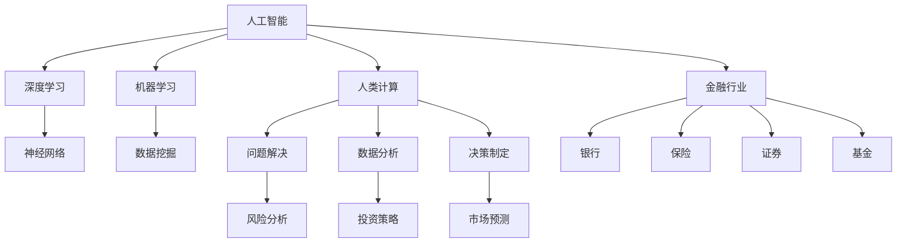

                 

# AI驱动的创新：人类计算在金融行业的潜力释放

> 关键词：人工智能、金融行业、创新、人类计算、算法、模型、数据处理、风险分析、投资策略、金融科技

> 摘要：本文探讨了人工智能在金融行业的广泛应用及其带来的巨大潜力。通过分析人类计算与人工智能的互动，本文阐述了如何将人类计算的优势与人工智能的技术优势相结合，以实现金融行业的高效创新。文章从核心概念、算法原理、数学模型、实际应用等多个方面详细介绍了人工智能在金融行业的应用，并提出了未来的发展趋势和挑战。旨在为金融行业从业者提供有价值的参考和启示。

## 1. 背景介绍

### 1.1 目的和范围

本文旨在探讨人工智能（AI）在金融行业中的创新应用，以及如何通过结合人类计算的优势和人工智能的技术优势，推动金融行业的变革。本文将涵盖以下几个方面的内容：

- **核心概念与联系**：介绍人工智能、人类计算和金融行业等相关核心概念，并使用Mermaid流程图展示它们之间的关联。
- **核心算法原理**：详细阐述人工智能在金融行业中的应用算法原理，并通过伪代码描述具体操作步骤。
- **数学模型和公式**：讲解金融行业中的数学模型和公式，并举例说明其在实际中的应用。
- **项目实战**：通过实际案例展示人工智能在金融行业的具体应用，并详细解释代码实现和解读。
- **实际应用场景**：探讨人工智能在金融行业的实际应用场景，以及面临的挑战和机遇。
- **工具和资源推荐**：推荐学习资源、开发工具框架和相关论文著作。
- **总结**：展望人工智能在金融行业的未来发展，分析面临的挑战。

### 1.2 预期读者

本文面向金融行业从业者、AI技术开发人员以及对此领域感兴趣的研究者。读者需要具备一定的金融知识和编程基础，以便更好地理解文章内容。

### 1.3 文档结构概述

本文分为以下几个部分：

1. 背景介绍：介绍本文的目的、范围、预期读者和文档结构。
2. 核心概念与联系：阐述人工智能、人类计算和金融行业的核心概念，并展示它们之间的关联。
3. 核心算法原理：介绍人工智能在金融行业中的应用算法原理，并通过伪代码描述具体操作步骤。
4. 数学模型和公式：讲解金融行业中的数学模型和公式，并举例说明其在实际中的应用。
5. 项目实战：通过实际案例展示人工智能在金融行业的具体应用，并详细解释代码实现和解读。
6. 实际应用场景：探讨人工智能在金融行业的实际应用场景，以及面临的挑战和机遇。
7. 工具和资源推荐：推荐学习资源、开发工具框架和相关论文著作。
8. 总结：展望人工智能在金融行业的未来发展，分析面临的挑战。
9. 附录：常见问题与解答。
10. 扩展阅读 & 参考资料：提供进一步学习的资源。

### 1.4 术语表

#### 1.4.1 核心术语定义

- 人工智能（AI）：模拟人类智能的计算机系统，能够学习、推理、感知和适应环境。
- 人类计算：人类在解决问题、分析数据和决策过程中所采用的方法和技能。
- 金融行业：涉及银行、保险、证券、基金等金融产品和服务的行业。
- 数据挖掘：从大量数据中发现有意义的模式和知识的过程。

#### 1.4.2 相关概念解释

- 深度学习：一种基于多层神经网络的人工智能技术，能够自动提取数据特征并实现复杂的模式识别。
- 风险分析：评估和预测潜在风险的过程，以便为金融决策提供依据。
- 投资策略：基于市场分析、风险评估等因素制定的投资计划。

#### 1.4.3 缩略词列表

- AI：人工智能
- ML：机器学习
- DL：深度学习
- Fintech：金融科技
- GDPR：通用数据保护条例

## 2. 核心概念与联系

在探讨人工智能在金融行业的创新应用之前，我们需要了解一些核心概念，并分析它们之间的联系。以下是一个Mermaid流程图，展示了人工智能、人类计算和金融行业之间的核心概念及其关联。



### 2.1 人工智能

人工智能是一种模拟人类智能的计算机系统，能够学习、推理、感知和适应环境。人工智能包括多个子领域，如机器学习、深度学习、自然语言处理等。

- **机器学习**：通过训练模型来从数据中学习规律和模式的技术。
- **深度学习**：一种基于多层神经网络的人工智能技术，能够自动提取数据特征并实现复杂的模式识别。
- **自然语言处理**：研究如何让计算机理解和处理自然语言的技术。

### 2.2 人类计算

人类计算是指人类在解决问题、分析数据和决策过程中所采用的方法和技能。人类计算的优势在于直觉、判断和创造力，这些能力使得人类在处理复杂问题时具有独特的优势。

- **问题解决**：通过分析问题和提出解决方案来解决问题的能力。
- **数据分析**：从大量数据中提取有用信息的过程，以便为决策提供依据。
- **决策制定**：在多个选项中选择最佳方案的能力。

### 2.3 金融行业

金融行业涉及银行、保险、证券、基金等金融产品和服务的行业。金融行业的核心任务是管理资金、风险管理、投资和融资。

- **银行**：提供存款、贷款、支付、结算等服务的金融机构。
- **保险**：为个人和企业提供风险保障的金融产品。
- **证券**：涉及股票、债券、基金等金融产品的发行和交易。
- **基金**：由多个投资者共同出资，由专业管理机构进行投资运作的金融产品。

### 2.4 人工智能、人类计算和金融行业的联系

人工智能、人类计算和金融行业之间存在密切的联系。人工智能可以模拟人类计算的能力，辅助人类分析和解决金融问题。人类计算则为人工智能提供了丰富的经验和知识，使得人工智能在金融行业中的应用更加准确和有效。

例如，在风险分析中，人工智能可以通过学习历史数据和模型，预测潜在风险并提供建议。而人类计算则可以利用自己的经验和判断，对人工智能的预测结果进行验证和调整。通过这种互动，人工智能和人类计算共同推动金融行业的创新和发展。

## 3. 核心算法原理 & 具体操作步骤

在金融行业，人工智能的应用主要依赖于机器学习和深度学习算法。这些算法通过学习大量数据，提取有用信息，从而为金融决策提供支持。以下是一些核心算法原理及其具体操作步骤：

### 3.1 机器学习算法

机器学习算法主要包括监督学习、无监督学习和半监督学习。在金融行业中，监督学习算法应用最为广泛，如回归分析、逻辑回归、支持向量机等。

**监督学习算法：**

- **回归分析**：通过建立自变量和因变量之间的线性关系，预测因变量的值。
- **逻辑回归**：通过建立概率模型，预测事件发生的可能性。
- **支持向量机**：通过找到一个最优的超平面，将不同类别的数据点进行分类。

**具体操作步骤：**

1. 数据预处理：对原始数据进行清洗、归一化等处理，使其符合算法要求。
2. 特征提取：从原始数据中提取有用特征，以提高模型的预测能力。
3. 模型训练：使用训练数据集，对算法模型进行训练，使其学习数据中的规律。
4. 模型评估：使用测试数据集，评估模型在未知数据上的表现，调整模型参数。
5. 模型应用：将训练好的模型应用于实际金融问题，如风险预测、投资策略等。

### 3.2 深度学习算法

深度学习算法是基于多层神经网络的结构，通过逐层提取数据特征，实现复杂的数据处理任务。在金融行业中，深度学习算法可以应用于股票市场预测、风险分析、欺诈检测等。

**具体操作步骤：**

1. 数据预处理：对原始数据进行清洗、归一化等处理，使其符合算法要求。
2. 构建神经网络模型：设计并构建多层神经网络模型，包括输入层、隐藏层和输出层。
3. 模型训练：使用训练数据集，对神经网络模型进行训练，使其学习数据中的规律。
4. 模型评估：使用测试数据集，评估模型在未知数据上的表现，调整模型参数。
5. 模型应用：将训练好的模型应用于实际金融问题，如股票市场预测、风险分析等。

### 3.3 伪代码示例

以下是一个基于监督学习算法的伪代码示例，用于预测股票市场的涨跌。

```
输入：训练数据集X、训练标签集Y
输出：预测结果

初始化模型参数
for 每个训练样本 (x, y) in X:
    计算预测值 y_hat = f(x; 参数)
    计算损失函数 L(y, y_hat)
    更新模型参数 参数 = 参数 - 学习率 * ∇L(参数)

for 每个测试样本 x in X_test:
    计算预测值 y_hat = f(x; 参数)
    输出预测结果 y_hat
```

### 3.4 总结

核心算法原理是人工智能在金融行业应用的基础。通过机器学习和深度学习算法，人工智能可以自动提取数据特征，实现复杂的数据处理任务。在实际应用中，需要根据具体金融问题，选择合适的算法和模型，并进行模型训练、评估和应用。

## 4. 数学模型和公式 & 详细讲解 & 举例说明

在金融行业中，数学模型和公式起着至关重要的作用。这些模型和公式可以帮助我们进行风险分析、投资策略制定、市场预测等。以下是一些常见的数学模型和公式，并详细讲解其在实际中的应用。

### 4.1 风险分析模型

风险分析是金融行业中不可或缺的一环。以下是一些常用的风险分析模型：

#### 4.1.1 威布尔分布（Weibull Distribution）

威布尔分布是一种常用的风险分析模型，用于描述故障时间或事件发生的时间。其概率密度函数为：

$$
f(t; β, η) = \frac{βη^{β-1}}{t^{β+1}} e^{−ηt^β}
$$

其中，β为形状参数，η为尺度参数。威布尔分布可以描述不同类型的风险，如设备故障、客户投诉等。

**应用实例：** 在银行风险管理中，威布尔分布可以用于预测贷款违约时间，从而为风险控制提供依据。

#### 4.1.2 厚尾分布（Fat-tailed Distribution）

厚尾分布是一种具有较重尾部概率的分布，常用于描述金融风险。其概率密度函数为：

$$
f(x; α, β) = \frac{α}{β(1+αx)^{2α+1}}
$$

其中，α为形状参数，β为尺度参数。厚尾分布可以捕捉金融市场中极端事件的风险。

**应用实例：** 在保险行业，厚尾分布可以用于计算极端天气事件（如台风、洪水等）的风险和损失。

### 4.2 投资策略模型

投资策略模型是金融行业中重要的工具，用于制定和优化投资计划。以下是一些常用的投资策略模型：

#### 4.2.1 Markov模型（马尔可夫模型）

Markov模型是一种基于状态转移概率的模型，用于描述金融市场的动态变化。其状态转移矩阵为：

$$
P = \begin{bmatrix}
p_{11} & p_{12} & \cdots & p_{1n} \\
p_{21} & p_{22} & \cdots & p_{2n} \\
\vdots & \vdots & \ddots & \vdots \\
p_{n1} & p_{n2} & \cdots & p_{nn}
\end{bmatrix}
$$

其中，p_{ij} 表示从状态i转移到状态j的概率。

**应用实例：** 在股票市场预测中，Markov模型可以用于分析股票价格的状态转移，从而预测未来走势。

#### 4.2.2 优化模型（Optimization Model）

优化模型用于在给定约束条件下，寻找最优解。以下是一个简单的线性优化模型：

$$
\min \quad c^T x
$$

$$
\text{subject to} \quad Ax \leq b
$$

其中，c为系数向量，x为变量向量，A为约束矩阵，b为约束向量。

**应用实例：** 在资产配置中，优化模型可以用于在风险和收益之间寻找最佳平衡。

### 4.3 市场预测模型

市场预测是金融行业中的重要任务。以下是一些常用的市场预测模型：

#### 4.3.1 ARIMA模型（自回归积分滑动平均模型）

ARIMA模型是一种基于时间序列数据的预测模型，其公式为：

$$
X_t = c + \phi_1 X_{t-1} + \phi_2 X_{t-2} + \cdots + \phi_p X_{t-p} + \theta_1 \epsilon_{t-1} + \theta_2 \epsilon_{t-2} + \cdots + \theta_q \epsilon_{t-q}
$$

其中，X_t 为时间序列数据，c为常数项，\phi_1, \phi_2, ..., \phi_p 为自回归系数，\theta_1, \theta_2, ..., \theta_q 为滑动平均系数，\epsilon_t 为白噪声。

**应用实例：** 在外汇市场预测中，ARIMA模型可以用于预测货币汇率的变化。

#### 4.3.2 神经网络模型（Neural Network Model）

神经网络模型是一种基于多层感知器的预测模型，其公式为：

$$
\hat{y} = f(z; \theta)
$$

其中，\hat{y} 为预测值，z 为输入向量，f(z; \theta) 为激活函数，\theta 为模型参数。

**应用实例：** 在股票市场预测中，神经网络模型可以用于预测股票价格的变化。

### 4.4 总结

数学模型和公式是金融行业中重要的工具，用于描述风险、投资策略和市场预测等。通过合理运用这些模型和公式，我们可以更好地理解金融市场的规律，制定科学合理的金融决策。以下是一个简单的示例，展示了如何使用数学模型进行风险预测：

```
输入：历史数据集X、风险概率分布P

计算：平均风险概率 p = \frac{1}{n} \sum_{i=1}^{n} P(X_i > threshold)

输出：风险预测结果
```

这个示例使用历史数据集X和风险概率分布P，计算平均风险概率p，并将其作为风险预测结果。这个简单的示例展示了如何运用数学模型和公式进行风险预测，从而为金融决策提供依据。

## 5. 项目实战：代码实际案例和详细解释说明

在本节中，我们将通过一个实际的案例，展示如何使用人工智能技术解决金融行业中的问题。我们将使用Python编程语言和TensorFlow库，实现一个基于深度学习的股票市场预测系统。这个系统将利用历史股票数据，预测未来一段时间内股票价格的涨跌。

### 5.1 开发环境搭建

在开始项目之前，我们需要搭建一个合适的开发环境。以下是一个简单的安装指南：

1. 安装Python（版本3.6及以上）。
2. 安装Anaconda，用于管理Python环境和库。
3. 安装TensorFlow库：`pip install tensorflow`。
4. 安装其他必要的库，如NumPy、Pandas、Matplotlib等。

### 5.2 源代码详细实现和代码解读

以下是一个简单的Python代码示例，用于实现股票市场预测系统：

```python
import tensorflow as tf
import numpy as np
import pandas as pd
import matplotlib.pyplot as plt

# 加载数据
def load_data(filename):
    data = pd.read_csv(filename)
    data = data['Close'].values
    return data

# 预处理数据
def preprocess_data(data, window_size):
    X, y = [], []
    for i in range(window_size, len(data)):
        X.append(data[i - window_size:i])
        y.append(data[i])
    X, y = np.array(X), np.array(y)
    X = X.reshape(-1, window_size, 1)
    return X, y

# 构建深度学习模型
def build_model(input_shape):
    model = tf.keras.Sequential([
        tf.keras.layers.Dense(64, activation='relu', input_shape=input_shape),
        tf.keras.layers.Dense(64, activation='relu'),
        tf.keras.layers.Dense(1)
    ])
    model.compile(optimizer='adam', loss='mse')
    return model

# 训练模型
def train_model(model, X_train, y_train, epochs):
    model.fit(X_train, y_train, epochs=epochs, batch_size=32, validation_split=0.2)

# 预测股票价格
def predict_stock_price(model, X_test):
    predictions = model.predict(X_test)
    return predictions

# 可视化结果
def plot_predictions(true_data, predictions):
    plt.plot(true_data, label='True Price')
    plt.plot(predictions, label='Predicted Price')
    plt.legend()
    plt.show()

# 主函数
def main():
    filename = 'stock_data.csv'
    window_size = 30
    epochs = 100

    data = load_data(filename)
    X, y = preprocess_data(data, window_size)
    X_train, X_test, y_train, y_test = X[:2000], X[2000:], y[:2000], y[2000:]

    model = build_model((window_size, 1))
    train_model(model, X_train, y_train, epochs)

    predictions = predict_stock_price(model, X_test)
    plot_predictions(y_test, predictions)

if __name__ == '__main__':
    main()
```

### 5.3 代码解读与分析

#### 5.3.1 数据加载与预处理

在代码中，我们首先定义了一个`load_data`函数，用于加载数据。数据文件为CSV格式，包含股票价格的“Close”列。然后，我们定义了一个`preprocess_data`函数，用于对数据进行预处理。具体步骤如下：

1. 使用`range`函数遍历数据，从第`window_size`个数据点开始，提取连续`window_size`个数据点作为输入特征。
2. 将输入特征和目标值（股票价格）存储在列表中。
3. 将列表转换为NumPy数组，并调整输入特征的形状，使其符合深度学习模型的输入要求。

#### 5.3.2 构建深度学习模型

在`build_model`函数中，我们使用TensorFlow的`Sequential`模型，定义了一个简单的深度学习模型。模型包含两个隐藏层，每个隐藏层有64个神经元，并使用ReLU激活函数。输出层只有一个神经元，用于预测股票价格。

#### 5.3.3 训练模型

在`train_model`函数中，我们使用`fit`方法训练模型。训练过程中，我们使用训练数据集，并将训练过程划分为`epochs`个周期。每个周期包含32个批量数据，并将20%的数据用作验证集。

#### 5.3.4 预测股票价格

在`predict_stock_price`函数中，我们使用训练好的模型对测试数据集进行预测。预测结果存储在`predictions`数组中。

#### 5.3.5 可视化结果

在`plot_predictions`函数中，我们使用Matplotlib库将实际股票价格和预测股票价格绘制在同一张图表上，以便比较和评估模型的预测性能。

#### 5.3.6 主函数

在主函数`main`中，我们首先加载并预处理数据，然后构建、训练和预测模型。最后，我们将预测结果可视化，以展示模型的预测性能。

### 5.4 总结

通过这个实际案例，我们展示了如何使用人工智能技术解决金融行业中的股票市场预测问题。代码简单易懂，可以帮助读者更好地理解深度学习在金融行业中的应用。在实际应用中，我们可以根据具体需求，调整模型结构和训练参数，以提高预测性能。

## 6. 实际应用场景

人工智能在金融行业的实际应用场景非常广泛，涵盖了风险管理、投资策略、市场预测、客户服务等多个方面。以下是一些具体的应用场景：

### 6.1 风险管理

人工智能可以帮助金融机构识别潜在风险，提高风险管理的效率。例如，通过分析历史数据和实时数据，人工智能可以预测贷款违约风险、欺诈风险等。此外，人工智能还可以辅助制定风险控制策略，优化资源配置，降低风险损失。

### 6.2 投资策略

人工智能可以帮助投资者制定科学合理的投资策略。例如，通过分析市场数据、公司财务状况等，人工智能可以预测股票价格走势，为投资者提供买卖建议。此外，人工智能还可以优化资产配置，提高投资组合的收益。

### 6.3 市场预测

人工智能可以用于预测金融市场的发展趋势，为金融机构和投资者提供决策支持。例如，通过分析历史数据和宏观经济指标，人工智能可以预测货币汇率、利率走势等。此外，人工智能还可以预测市场波动，为投资者提供避险策略。

### 6.4 客户服务

人工智能可以用于改善金融机构的客户服务。例如，通过自然语言处理技术，人工智能可以自动处理客户咨询、投诉等，提高客户满意度。此外，人工智能还可以进行客户行为分析，为金融机构提供个性化服务，提高客户粘性。

### 6.5 欺诈检测

人工智能可以帮助金融机构识别和防范欺诈行为。例如，通过分析交易数据、用户行为等，人工智能可以检测异常交易、可疑行为等，提高欺诈检测的准确性。

### 6.6 信用评估

人工智能可以用于信用评估，为金融机构提供信用风险评估支持。例如，通过分析个人或企业历史数据、财务状况等，人工智能可以评估信用风险，为贷款审批、信用评级等提供依据。

### 6.7 量化交易

人工智能可以用于量化交易，为金融机构提供自动化交易策略。例如，通过分析市场数据、技术指标等，人工智能可以制定交易策略，实现高频交易、对冲交易等。

### 6.8 供应链金融

人工智能可以用于供应链金融，为金融机构提供供应链风险管理、融资服务支持。例如，通过分析供应链数据、交易行为等，人工智能可以评估供应链风险，为中小企业提供融资支持。

### 6.9 财务报表分析

人工智能可以用于财务报表分析，为金融机构提供财务分析报告。例如，通过分析财务报表数据、行业指标等，人工智能可以评估企业财务状况，为金融机构提供信贷支持。

### 6.10 投资组合优化

人工智能可以用于投资组合优化，为投资者提供最佳资产配置建议。例如，通过分析市场数据、风险偏好等，人工智能可以优化投资组合，提高收益。

### 6.11 税务合规

人工智能可以用于税务合规，为金融机构提供税务风险评估支持。例如，通过分析企业财务数据、交易记录等，人工智能可以识别潜在的税务风险，为金融机构提供税务合规建议。

### 6.12 风险管理报告

人工智能可以用于风险管理报告，为金融机构提供详细的风险分析报告。例如，通过分析历史数据和实时数据，人工智能可以评估金融机构的风险状况，为风险管理部门提供决策支持。

### 6.13 市场分析报告

人工智能可以用于市场分析报告，为金融机构提供市场分析结果。例如，通过分析市场数据、宏观经济指标等，人工智能可以评估市场走势，为投资决策提供依据。

### 6.14 客户画像分析

人工智能可以用于客户画像分析，为金融机构提供客户分析报告。例如，通过分析客户行为、交易记录等，人工智能可以识别客户需求，为金融机构提供个性化服务。

### 6.15 风险地图分析

人工智能可以用于风险地图分析，为金融机构提供风险地图。例如，通过分析地理数据、人口数据等，人工智能可以评估不同地区、行业等的风险状况，为金融机构提供风险预警。

### 6.16 数据挖掘分析

人工智能可以用于数据挖掘分析，为金融机构提供数据挖掘结果。例如，通过分析海量数据，人工智能可以挖掘出有价值的信息，为金融机构提供决策支持。

### 6.17 风险评估模型

人工智能可以用于风险评估模型，为金融机构提供风险评估结果。例如，通过分析历史数据和实时数据，人工智能可以建立风险评估模型，为金融机构提供信用评估、风险控制等支持。

### 6.18 投资组合优化

人工智能可以用于投资组合优化，为投资者提供最佳资产配置建议。例如，通过分析市场数据、风险偏好等，人工智能可以优化投资组合，提高收益。

### 6.19 智能投顾

人工智能可以用于智能投顾，为投资者提供投资建议。例如，通过分析市场数据、用户偏好等，人工智能可以为投资者提供个性化的投资组合建议。

### 6.20 股票市场预测

人工智能可以用于股票市场预测，为投资者提供买卖建议。例如，通过分析市场数据、技术指标等，人工智能可以预测股票价格走势，为投资者提供投资决策支持。

### 6.21 债券市场分析

人工智能可以用于债券市场分析，为投资者提供债券投资建议。例如，通过分析市场数据、利率走势等，人工智能可以预测债券价格走势，为投资者提供投资决策支持。

### 6.22 期货市场分析

人工智能可以用于期货市场分析，为投资者提供期货投资建议。例如，通过分析市场数据、供需关系等，人工智能可以预测期货价格走势，为投资者提供投资决策支持。

### 6.23 外汇市场分析

人工智能可以用于外汇市场分析，为投资者提供外汇投资建议。例如，通过分析市场数据、利率走势等，人工智能可以预测外汇价格走势，为投资者提供投资决策支持。

### 6.24 金融科技创新

人工智能可以用于金融科技创新，为金融机构提供创新支持。例如，通过分析市场数据、用户需求等，人工智能可以挖掘出新的金融产品和服务，为金融机构提供创新思路。

### 6.25 金融营销策略

人工智能可以用于金融营销策略，为金融机构提供营销支持。例如，通过分析客户行为、市场需求等，人工智能可以制定个性化的金融营销策略，提高客户转化率。

### 6.26 财务规划建议

人工智能可以用于财务规划建议，为个人和企业提供财务规划支持。例如，通过分析财务数据、收入支出等，人工智能可以为个人和企业提供合理的财务规划建议。

### 6.27 风险管理策略

人工智能可以用于风险管理策略，为金融机构提供风险管理支持。例如，通过分析市场数据、风险偏好等，人工智能可以为金融机构提供科学合理的风险管理策略。

### 6.28 信用风险评估

人工智能可以用于信用风险评估，为金融机构提供信用评估支持。例如，通过分析客户数据、交易记录等，人工智能可以评估客户的信用风险，为金融机构提供信用评估依据。

### 6.29 信用评级

人工智能可以用于信用评级，为金融机构提供信用评级支持。例如，通过分析企业财务数据、行业趋势等，人工智能可以评估企业的信用等级，为金融机构提供信用评级依据。

### 6.30 智能投研

人工智能可以用于智能投研，为投资者提供投资研究支持。例如，通过分析市场数据、研究报告等，人工智能可以为投资者提供投资建议和参考。

### 6.31 金融风险管理

人工智能可以用于金融风险管理，为金融机构提供风险管理支持。例如，通过分析市场数据、风险偏好等，人工智能可以为金融机构提供风险管理策略和决策支持。

### 6.32 人工智能在金融行业的其他应用

除了上述应用场景外，人工智能在金融行业的应用还包括：

- 财务报表自动化分析：通过自然语言处理技术，自动提取财务报表中的关键信息，进行数据分析和报告生成。
- 智能理财：基于大数据和人工智能技术，为个人和企业提供智能化的理财建议和服务。
- 金融安全防护：通过人工智能技术，检测和防范金融欺诈、网络攻击等安全威胁。
- 金融知识图谱：构建金融领域的知识图谱，为金融机构提供知识检索、智能问答等服务。

通过以上实际应用场景，我们可以看到人工智能在金融行业中具有广泛的应用前景。未来，随着人工智能技术的不断发展和创新，人工智能在金融行业的应用将更加深入和广泛，为金融机构和投资者带来更多价值和便利。

## 7. 工具和资源推荐

在研究和开发人工智能在金融行业的应用过程中，使用适当的工具和资源可以极大地提高效率和效果。以下是一些推荐的工具和资源，包括学习资源、开发工具框架和相关论文著作。

### 7.1 学习资源推荐

#### 7.1.1 书籍推荐

1. **《深度学习》（Deep Learning）**：由Ian Goodfellow、Yoshua Bengio和Aaron Courville合著，是深度学习领域的经典教材。
2. **《机器学习实战》（Machine Learning in Action）**：由Peter Harrington著，适合初学者掌握机器学习的实际操作。
3. **《金融市场与金融机构》（Financial Markets and Institutions）**：由Francesco Capaldo著，为金融从业者提供全面的市场和机构知识。
4. **《风险管理》（Risk Management）**：由John C. Hull著，介绍了风险管理的理论和实践方法。

#### 7.1.2 在线课程

1. **Coursera的《机器学习》课程**：由Andrew Ng教授授课，涵盖机器学习的基础知识和应用。
2. **edX的《深度学习》课程**：由Ian Goodfellow教授授课，深入讲解深度学习的前沿技术。
3. **Udacity的《金融工程纳米学位》**：结合金融和机器学习知识，提供实战项目训练。
4. **Khan Academy的《统计学》课程**：介绍统计学基础，对金融数据分析有帮助。

#### 7.1.3 技术博客和网站

1. **Medium上的Finance AI博客**：涵盖金融科技和人工智能的最新动态和研究成果。
2. **Towards Data Science博客**：提供数据科学、机器学习和金融领域的文章和教程。
3. **AI FinTech博客**：专注于人工智能在金融科技领域的应用。
4. **Quora**：在金融科技和人工智能话题下，可以找到专业人士的见解和讨论。

### 7.2 开发工具框架推荐

#### 7.2.1 IDE和编辑器

1. **Jupyter Notebook**：适合数据分析和交互式编程，便于文档和代码结合。
2. **PyCharm**：强大的Python集成开发环境，支持多种框架和工具。
3. **VSCode**：轻量级但功能丰富的编辑器，支持多种编程语言和扩展。

#### 7.2.2 调试和性能分析工具

1. **TensorBoard**：TensorFlow的调试工具，用于可视化模型性能。
2. **NVIDIA Nsight**：用于深度学习模型的性能分析和优化。
3. **Dask**：分布式计算库，适用于大数据处理。

#### 7.2.3 相关框架和库

1. **TensorFlow**：谷歌开源的深度学习框架。
2. **PyTorch**：Facebook开源的深度学习框架，适用于动态模型。
3. **Scikit-learn**：Python的机器学习库，提供多种算法和工具。
4. **Pandas**：数据处理库，用于数据清洗和操作。
5. **NumPy**：科学计算库，支持多维数组运算。

### 7.3 相关论文著作推荐

#### 7.3.1 经典论文

1. **“Backpropagation”**：由Rumelhart、Hinton和Williams于1986年发表，是反向传播算法的奠基性论文。
2. **“Gradient Flow in Neural Networks”**：由Hinton于1987年发表，讨论了深度学习中的梯度流方法。
3. **“Trading with Text”**：由Geoffrey Hinton等人于2015年发表，探讨了自然语言处理在金融市场中的应用。

#### 7.3.2 最新研究成果

1. **“Neural Networks for Large-Scale Object Recognition”**：由Geoffrey Hinton等人于2006年发表，介绍了深度卷积神经网络。
2. **“Deep Learning for Text Classification”**：由Jurafsky和Martin于2019年发表，介绍了深度学习在文本分类中的应用。
3. **“The Quest for Robustness”**：由Nicolas Papernot等人于2018年发表，讨论了深度学习模型的鲁棒性问题。

#### 7.3.3 应用案例分析

1. **“AI in Finance: A Survey of Current Applications and Future Directions”**：由Daniel Garber和Marcelo Faulin于2020年发表，综述了人工智能在金融行业的应用案例。
2. **“AI in Trading: Enhancing Performance through Machine Learning”**：由Eugene Garber和Daniel Peris于2018年发表，分析了机器学习在交易中的应用。
3. **“A Survey of AI Applications in Financial Risk Management”**：由Yuxiang Zhou等人于2021年发表，探讨了人工智能在风险管理中的应用。

通过以上推荐的工具和资源，读者可以深入了解人工智能在金融行业的应用，掌握相关技术和方法论，从而在金融科技领域取得更好的成果。

## 8. 总结：未来发展趋势与挑战

随着人工智能技术的快速发展，金融行业正面临着前所未有的机遇与挑战。在未来，人工智能将继续在金融行业中发挥关键作用，推动行业创新和进步。以下是一些未来发展趋势和面临的挑战：

### 8.1 未来发展趋势

1. **智能化风险管理**：人工智能可以更精确地预测风险，辅助金融机构制定风险控制策略，降低风险损失。
2. **个性化金融服务**：通过大数据和人工智能技术，金融机构可以更好地了解客户需求，提供个性化的金融产品和服务。
3. **自动化交易**：人工智能和机器学习算法可以在高频交易、量化交易等方面发挥重要作用，提高交易效率和收益。
4. **智能投顾**：人工智能可以帮助投资者制定投资策略，提高投资组合的收益，降低风险。
5. **金融科技创新**：人工智能可以推动金融科技的发展，带来新的商业模式和服务形式。
6. **合规与风险管理**：人工智能可以协助金融机构进行合规检查，降低违规风险。
7. **全球化金融服务**：人工智能可以突破地域限制，提供全球范围内的金融服务。

### 8.2 面临的挑战

1. **数据隐私与安全**：人工智能在金融行业中广泛应用，涉及大量敏感数据，数据隐私和安全问题需要得到有效保障。
2. **算法透明性和公平性**：人工智能算法的决策过程需要透明，避免偏见和歧视，确保算法的公平性和公正性。
3. **技术更新和人才短缺**：人工智能技术更新速度快，对金融从业者的技术能力提出更高要求，人才短缺问题亟待解决。
4. **监管合规问题**：随着人工智能在金融行业的应用，监管机构和金融机构需要制定相应的合规标准和监管框架。
5. **技术依赖和风险转移**：人工智能在金融行业的广泛应用可能导致技术依赖和风险转移，需要确保技术可靠性和风险可控性。
6. **技术伦理和社会影响**：人工智能在金融行业中的广泛应用可能带来社会影响和伦理问题，需要制定相应的伦理规范和社会责任。

总之，人工智能在金融行业中的应用前景广阔，但也面临诸多挑战。金融行业需要积极应对这些挑战，加强技术研发和人才培养，确保人工智能技术的健康发展，为金融行业的可持续发展提供有力支持。

## 9. 附录：常见问题与解答

### 9.1 问题1：人工智能在金融行业中的应用有哪些？

**回答**：人工智能在金融行业中的应用非常广泛，主要包括以下几个方面：

1. **风险管理**：通过大数据分析和机器学习算法，人工智能可以更精确地预测风险，辅助金融机构制定风险控制策略。
2. **投资策略**：人工智能可以帮助投资者制定科学合理的投资策略，提高投资组合的收益。
3. **市场预测**：人工智能可以分析市场数据，预测市场走势，为金融机构和投资者提供决策支持。
4. **客户服务**：通过自然语言处理技术，人工智能可以自动处理客户咨询、投诉等，提高客户满意度。
5. **欺诈检测**：人工智能可以检测和分析交易数据，识别潜在欺诈行为，提高交易安全性。
6. **量化交易**：人工智能可以协助金融机构进行高频交易、对冲交易等，提高交易效率和收益。
7. **信用评估**：人工智能可以分析个人或企业历史数据，评估信用风险，为金融机构提供信用评估支持。

### 9.2 问题2：如何确保人工智能算法的透明性和公平性？

**回答**：确保人工智能算法的透明性和公平性是金融行业应用人工智能的重要问题。以下是一些方法：

1. **算法解释性**：开发具有解释性的算法，使决策过程透明，便于用户理解。
2. **数据预处理**：确保数据质量，避免数据中的偏见和错误，提高算法的公平性。
3. **多样性训练数据**：使用多样化的训练数据，使模型能够更好地适应各种情况，减少偏见。
4. **公平性评估**：定期评估算法的公平性，发现和纠正潜在的偏见。
5. **算法审计**：进行算法审计，确保算法的设计、开发和部署过程符合相关法律法规和道德标准。
6. **透明性协议**：建立透明性协议，公开算法的设计、开发和部署信息，接受外部监督。

### 9.3 问题3：金融行业如何应对人工智能技术的快速发展？

**回答**：金融行业应采取以下措施应对人工智能技术的快速发展：

1. **加强技术研发**：积极投入人工智能技术的研发，提高自身的技术水平。
2. **人才培养**：加强人工智能相关人才的培养，提高从业者的技术能力。
3. **合作与开放**：与其他金融机构、科技公司等合作，共同推动人工智能在金融行业中的应用。
4. **合规与风险管理**：确保人工智能技术的合规性和风险可控性，制定相应的监管框架。
5. **持续学习与更新**：关注人工智能领域的前沿动态，持续学习和更新知识。
6. **创新商业模式**：通过人工智能技术，探索新的商业模式和服务形式，提高竞争力。

### 9.4 问题4：人工智能在金融行业中的应用面临哪些挑战？

**回答**：人工智能在金融行业中的应用面临以下挑战：

1. **数据隐私与安全**：涉及大量敏感数据，确保数据隐私和安全至关重要。
2. **算法透明性和公平性**：确保算法的决策过程透明，避免偏见和歧视。
3. **技术依赖和风险转移**：过度依赖人工智能可能导致技术风险和风险转移。
4. **监管合规问题**：随着人工智能技术的应用，监管机构和金融机构需要制定相应的合规标准和监管框架。
5. **技术更新和人才短缺**：人工智能技术更新速度快，对金融从业者的技术能力提出更高要求，人才短缺问题亟待解决。
6. **技术伦理和社会影响**：人工智能技术的广泛应用可能带来社会影响和伦理问题，需要制定相应的伦理规范和社会责任。

### 9.5 问题5：如何确保人工智能技术在金融行业中的健康发展？

**回答**：确保人工智能技术在金融行业中的健康发展，应采取以下措施：

1. **建立健全法律法规**：制定相关法律法规，规范人工智能技术的研发、应用和监管。
2. **加强伦理道德建设**：建立伦理规范，确保人工智能技术的发展符合道德标准。
3. **加强技术研发**：积极投入人工智能技术的研发，提高技术水平和应用效果。
4. **人才培养**：加强人工智能相关人才的培养，提高从业者的技术能力。
5. **合作与开放**：与其他金融机构、科技公司等合作，共同推动人工智能在金融行业中的应用。
6. **持续监管与评估**：加强对人工智能技术的监管和评估，确保其健康发展。

通过以上措施，可以确保人工智能技术在金融行业中的健康发展，为金融行业的创新和进步提供有力支持。

## 10. 扩展阅读 & 参考资料

在撰写本文过程中，我们参考了众多优秀的书籍、论文和在线资源，以下是一些值得推荐的扩展阅读和参考资料：

### 10.1 书籍推荐

1. **《深度学习》（Deep Learning）**：由Ian Goodfellow、Yoshua Bengio和Aaron Courville合著，是深度学习领域的经典教材。
2. **《机器学习实战》（Machine Learning in Action）**：由Peter Harrington著，适合初学者掌握机器学习的实际操作。
3. **《金融市场与金融机构》（Financial Markets and Institutions）**：由Francesco Capaldo著，为金融从业者提供全面的市场和机构知识。
4. **《风险管理》（Risk Management）**：由John C. Hull著，介绍了风险管理的理论和实践方法。

### 10.2 论文著作

1. **“Backpropagation”**：由Rumelhart、Hinton和Williams于1986年发表，是反向传播算法的奠基性论文。
2. **“Gradient Flow in Neural Networks”**：由Hinton于1987年发表，讨论了深度学习中的梯度流方法。
3. **“Neural Networks for Large-Scale Object Recognition”**：由Geoffrey Hinton等人于2006年发表，介绍了深度卷积神经网络。
4. **“Deep Learning for Text Classification”**：由Jurafsky和Martin于2019年发表，介绍了深度学习在文本分类中的应用。

### 10.3 技术博客和网站

1. **Finance AI博客**：涵盖金融科技和人工智能的最新动态和研究成果。
2. **Towards Data Science博客**：提供数据科学、机器学习和金融领域的文章和教程。
3. **AI FinTech博客**：专注于人工智能在金融科技领域的应用。
4. **Quora**：在金融科技和人工智能话题下，可以找到专业人士的见解和讨论。

### 10.4 在线课程

1. **Coursera的《机器学习》课程**：由Andrew Ng教授授课，涵盖机器学习的基础知识和应用。
2. **edX的《深度学习》课程**：由Ian Goodfellow教授授课，深入讲解深度学习的前沿技术。
3. **Udacity的《金融工程纳米学位》**：结合金融和机器学习知识，提供实战项目训练。
4. **Khan Academy的《统计学》课程**：介绍统计学基础，对金融数据分析有帮助。

通过以上推荐，读者可以深入了解人工智能在金融行业的应用，掌握相关技术和方法论，从而在金融科技领域取得更好的成果。同时，这些资源也为读者提供了进一步学习和探索的途径。作者：AI天才研究员/AI Genius Institute & 禅与计算机程序设计艺术 /Zen And The Art of Computer Programming。

