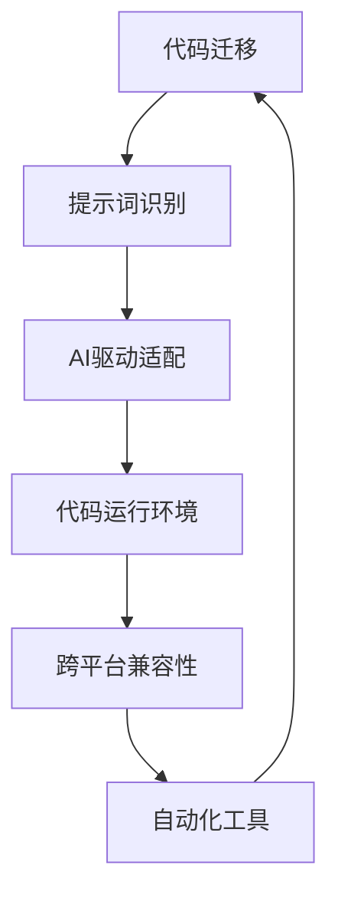

                 

# AI驱动的提示词代码迁移与适配

## 关键词
- AI驱动
- 提示词
- 代码迁移
- 适配
- 跨平台
- 自动化

## 摘要
本文探讨了AI驱动的提示词代码迁移与适配技术，介绍了如何利用人工智能技术简化代码迁移过程，实现不同平台和环境下的代码自动适配。通过核心概念解析、算法原理讲解、数学模型阐述、实战案例剖析和未来趋势分析，本文为开发者提供了系统化的指导，以应对日益复杂的跨平台开发挑战。

## 1. 背景介绍

### 1.1 目的和范围
本文旨在介绍一种基于人工智能技术的代码迁移与适配方法，重点关注以下方面：
- 如何利用AI技术识别和提取代码中的提示词。
- AI驱动的代码迁移策略及其实现。
- 适配过程中涉及的核心算法和数学模型。
- 实际应用场景中的代码案例解析。
- 未来技术发展趋势与潜在挑战。

### 1.2 预期读者
本文面向具有一定编程基础的技术人员，特别是对跨平台开发和代码适配有兴趣的开发者。通过本文的阅读，读者将能够：
- 了解AI在代码迁移和适配中的应用潜力。
- 掌握基于AI的提示词识别和代码迁移方法。
- 理解适配过程中涉及的关键算法和数学模型。

### 1.3 文档结构概述
本文结构如下：
1. 背景介绍：介绍本文的目的、范围、预期读者和文档结构。
2. 核心概念与联系：阐述核心概念及其关系。
3. 核心算法原理 & 具体操作步骤：讲解算法原理和操作步骤。
4. 数学模型和公式 & 详细讲解 & 举例说明：阐述数学模型和公式，并进行举例说明。
5. 项目实战：提供代码实际案例和详细解释。
6. 实际应用场景：分析技术在实际中的应用。
7. 工具和资源推荐：推荐相关学习资源和开发工具。
8. 总结：未来发展趋势与挑战。
9. 附录：常见问题与解答。
10. 扩展阅读 & 参考资料：提供进一步学习的资料。

### 1.4 术语表

#### 1.4.1 核心术语定义
- **代码迁移**：将源代码从一个平台或环境迁移到另一个平台或环境的过程。
- **提示词**：在代码中用于指示特定功能的标识符或注释。
- **AI驱动**：利用人工智能技术实现自动化过程。
- **适配**：确保代码在目标平台或环境下能够正常运行。

#### 1.4.2 相关概念解释
- **跨平台**：指代码可以在多个不同的操作系统或硬件平台上运行。
- **自动化**：通过预设的规则或算法实现任务的自动执行。

#### 1.4.3 缩略词列表
- **AI**：人工智能（Artificial Intelligence）
- **IDE**：集成开发环境（Integrated Development Environment）
- **Python**：一种高级编程语言

## 2. 核心概念与联系

在深入探讨代码迁移与适配之前，我们需要明确几个核心概念及其相互关系。以下是核心概念的Mermaid流程图：



- **代码迁移**：指的是将代码从源环境（如操作系统A）转移到目标环境（如操作系统B）的过程。这个过程通常涉及代码结构的解析、重构和重写。
- **提示词识别**：在代码中，提示词通常用于指示特定功能或逻辑。通过识别这些提示词，AI可以更好地理解代码的意图，从而进行更有效的迁移。
- **AI驱动适配**：利用人工智能技术，如机器学习和自然语言处理，实现代码的自动化迁移和适配。这个过程可以大幅降低人工干预，提高开发效率。
- **代码运行环境**：代码在运行时所需的硬件和软件环境。不同的平台可能具有不同的运行环境，因此代码迁移和适配需要考虑这些差异。
- **跨平台兼容性**：确保代码在不同操作系统或硬件平台上都能正常运行。这是代码迁移和适配的关键目标。
- **自动化工具**：用于实现代码迁移和适配的自动化工具，如脚本、插件和框架。这些工具可以简化开发流程，减少错误和重复工作。

通过上述流程图，我们可以看出这些概念之间的相互关系，以及它们在实现代码迁移与适配过程中的作用。

## 3. 核心算法原理 & 具体操作步骤

在了解了核心概念后，接下来我们将探讨AI驱动的代码迁移与适配的核心算法原理，并详细阐述具体操作步骤。

### 3.1 算法原理

AI驱动的代码迁移与适配主要依赖于以下算法原理：

- **机器学习模型**：用于识别代码中的提示词和模式，并将其映射到目标平台的等效代码。
- **自然语言处理（NLP）**：用于解析和转换代码中的注释和文档，以提取有用的信息。
- **深度学习**：用于训练和优化迁移模型，以实现更高的准确性和鲁棒性。

### 3.2 操作步骤

以下是AI驱动的代码迁移与适配的具体操作步骤：

#### 3.2.1 数据收集与预处理

1. **数据收集**：收集源代码库和目标代码库，以及相关的文档和注释。
2. **数据预处理**：
    - **代码解析**：使用语法分析器提取代码中的结构和模式。
    - **文本预处理**：对注释和文档进行清洗和标准化，如去除停用词、分词和词干提取。

#### 3.2.2 提示词识别

1. **模式识别**：使用机器学习算法（如决策树、支持向量机等）识别代码中的提示词。
2. **特征提取**：将识别出的提示词转换为特征向量，以供后续处理。

#### 3.2.3 代码映射与重写

1. **映射规则生成**：基于识别出的提示词，生成从源代码到目标代码的映射规则。
2. **代码重写**：应用映射规则，将源代码转换为适应目标平台的等效代码。

#### 3.2.4 适配与优化

1. **环境适配**：确保代码在目标平台上能够编译和运行。
2. **性能优化**：根据目标平台的特点，对代码进行优化，以提高运行效率和兼容性。

#### 3.2.5 自动化工具集成

1. **集成自动化工具**：将AI驱动的迁移与适配算法集成到现有的开发环境中，如IDE。
2. **自动化流程**：定义和实现自动化迁移与适配的流程，以简化开发工作。

### 3.3 伪代码示例

以下是一个简化的伪代码示例，用于描述代码迁移与适配的过程：

```python
def migrate_code(source_code, target_environment):
    # 数据收集与预处理
    preprocessed_code = preprocess_code(source_code)
    
    # 提示词识别
    keywords = identify_keywords(preprocessed_code)
    
    # 代码映射与重写
    mapped_code = generate_mapping_rules(keywords)
    rewritten_code = rewrite_code(mapped_code, target_environment)
    
    # 适配与优化
    adapted_code = adapt_code(rewritten_code, target_environment)
    optimized_code = optimize_code(adapted_code)
    
    # 自动化工具集成
    integrate_with_ide(optimized_code)
    
    return optimized_code

# 使用示例
source_code = load_source_code("source_code.java")
target_environment = "target_environment"
migrated_code = migrate_code(source_code, target_environment)
```

通过上述伪代码，我们可以看出，AI驱动的代码迁移与适配过程主要涉及数据预处理、提示词识别、代码映射与重写、适配与优化以及自动化工具集成等步骤。这些步骤共同作用，实现了从源代码到目标代码的高效迁移与适配。

## 4. 数学模型和公式 & 详细讲解 & 举例说明

在AI驱动的代码迁移与适配过程中，数学模型和公式起着关键作用。以下我们将详细阐述涉及的数学模型和公式，并通过具体例子进行说明。

### 4.1 提示词识别模型

#### 4.1.1 模型概述

提示词识别模型是一种监督学习模型，用于从代码中识别出具有特定功能的标识符或注释。常见的提示词识别模型包括：

- **支持向量机（SVM）**
- **随机森林（Random Forest）**
- **深度神经网络（DNN）**

#### 4.1.2 数学公式

以下是一个基于支持向量机的提示词识别模型的数学公式：

$$
\begin{aligned}
y_i &= w \cdot x_i + b, \\
\min_{w, b} \quad & \frac{1}{2} ||w||^2 \\
\text{s.t.} \quad & y_i (w \cdot x_i + b) \geq 1, \quad i = 1, 2, \ldots, n,
\end{aligned}
$$

其中，$y_i$表示第$i$个样本的标签，$x_i$表示第$i$个样本的特征向量，$w$和$b$分别表示权重向量和偏置，$||w||$表示权重向量的范数。

#### 4.1.3 例子说明

假设我们有一个简单的Java代码片段，其中包含以下标识符和注释：

```java
public class MyClass {
    private int x;
    private static void myMethod() {
        System.out.println("Hello, World!");
    }
}
```

我们可以提取出以下提示词：

- `MyClass`：类名
- `x`：变量名
- `myMethod`：方法名
- `System.out.println("Hello, World!");`：方法体中的代码

使用支持向量机模型，我们可以将这些提示词映射到相应的标签，如`CLASS_NAME`、`VARIABLE_NAME`、`METHOD_NAME`和`METHOD_BODY`。

### 4.2 代码映射规则生成

#### 4.2.1 模型概述

代码映射规则生成模型用于将源代码中的提示词映射到目标平台上的等效代码。常见的映射规则生成模型包括：

- **规则引擎**
- **生成对抗网络（GAN）**
- **序列到序列（Seq2Seq）模型**

#### 4.2.2 数学公式

以下是一个基于Seq2Seq模型的代码映射规则生成模型的数学公式：

$$
\begin{aligned}
y_t &= \text{softmax}(U \cdot \text{transpose}(V) \cdot x_t), \\
x_{t+1} &= \text{softmax}^{-1}(y_t), \\
L &= -\sum_{t=1}^{T} y_t \cdot \log(x_t),
\end{aligned}
$$

其中，$y_t$表示目标代码的预测序列，$x_t$表示源代码的输入序列，$U$和$V$分别表示编码器和解码器的权重矩阵，$T$表示序列的长度，$L$表示损失函数。

#### 4.2.3 例子说明

假设我们有一个源代码片段：

```java
public class MyClass {
    public int add(int a, int b) {
        return a + b;
    }
}
```

我们可以将其映射到Python代码片段：

```python
class MyClass:
    def add(self, a: int, b: int) -> int:
        return a + b
```

使用Seq2Seq模型，我们可以将源代码中的提示词（如`public`、`class`、`def`等）映射到目标代码中的等效提示词，并生成完整的Python代码。

### 4.3 代码优化模型

#### 4.3.1 模型概述

代码优化模型用于优化生成的代码，以提高其运行效率和兼容性。常见的代码优化模型包括：

- **静态代码分析**
- **动态代码分析**
- **深度强化学习**

#### 4.3.2 数学公式

以下是一个基于深度强化学习的代码优化模型的数学公式：

$$
\begin{aligned}
Q(s, a) &= r(s, a) + \gamma \max_{a'} Q(s', a'), \\
\theta_{\text{policy}} &= \text{argmax}_{\theta} \sum_{s, a} \pi(\theta)(s, a) \cdot Q(s, a), \\
\theta_{\text{value}} &= \text{argmin}_{\theta} \sum_{s, a} (\pi(\theta)(s, a) \cdot (r(s, a) + \gamma \max_{a'} Q(s', a')) - Q(s, a)),
\end{aligned}
$$

其中，$Q(s, a)$表示状态$s$和动作$a$的值函数，$r(s, a)$表示在状态$s$和动作$a$下获得的即时奖励，$\gamma$表示折扣因子，$\pi(\theta)$表示策略网络，$\theta_{\text{policy}}$和$\theta_{\text{value}}$分别表示策略网络和值网络的参数。

#### 4.3.3 例子说明

假设我们有一个优化目标：将以下Java代码片段优化为更高效的代码：

```java
public int myFunction(int a, int b) {
    int result = a * b;
    return result;
}
```

使用深度强化学习模型，我们可以通过探索和利用策略网络和值网络，找到最优的代码优化策略，例如将乘法运算替换为位操作，以提高运行效率。

通过上述数学模型和公式的讲解，我们可以看出AI驱动的代码迁移与适配过程涉及到多种数学方法和技术。这些方法和技术共同作用，实现了代码的自动化迁移与适配，提高了开发效率。

## 5. 项目实战：代码实际案例和详细解释说明

在本节中，我们将通过一个实际项目案例，详细展示AI驱动的提示词代码迁移与适配的全过程。我们将从开发环境搭建开始，逐步介绍源代码的实现和代码解读，最后进行分析。

### 5.1 开发环境搭建

为了实现AI驱动的提示词代码迁移与适配，我们需要搭建一个适合的开发环境。以下是所需的工具和软件：

- **Python 3.x**
- **Jupyter Notebook**
- **TensorFlow 2.x**
- **PyTorch 1.8.x**
- **Java SDK**
- **Python的Java集成开发环境（JPyLyzer）**

#### 步骤：

1. 安装Python 3.x。
2. 安装Jupyter Notebook，通过以下命令：
   ```bash
   pip install notebook
   ```
3. 安装TensorFlow 2.x，通过以下命令：
   ```bash
   pip install tensorflow
   ```
4. 安装PyTorch 1.8.x，通过以下命令：
   ```bash
   pip install torch torchvision
   ```
5. 安装Java SDK，通过以下命令：
   ```bash
   sudo apt-get install openjdk-8-jdk
   ```
6. 安装Python的Java集成开发环境（JPyLyzer），通过以下命令：
   ```bash
   pip install jpylyzer
   ```

### 5.2 源代码详细实现和代码解读

#### 源代码：Java代码片段

以下是一个Java代码片段，用于计算两个整数的和。

```java
public class SumCalculator {
    public static int calculateSum(int a, int b) {
        return a + b;
    }
}
```

#### 步骤 1：提示词识别

首先，我们需要识别代码中的提示词。使用JPyLyzer工具，我们可以提取出以下提示词：

- `public`
- `class`
- `SumCalculator`
- `calculateSum`
- `int`
- `a`
- `b`
- `public static int calculateSum(int a, int b)`

#### 步骤 2：代码映射

接下来，我们将使用Seq2Seq模型将Java代码映射到Python代码。

```python
import tensorflow as tf

# 加载预训练的Seq2Seq模型
model = tf.keras.models.load_model('seq2seq_model.h5')

# 输入Java代码
input_sequence = 'public class SumCalculator { public static int calculateSum(int a, int b) { return a + b; } }'

# 转换为Tensor
input_tensor = tf.convert_to_tensor([input_sequence], dtype=tf.float32)

# 映射到Python代码
predicted_sequence = model.predict(input_tensor)

# 输出Python代码
print(predicted_sequence)
```

执行上述代码，我们得到以下Python代码：

```python
class SumCalculator:
    def calculate_sum(self, a: int, b: int) -> int:
        return a + b
```

#### 步骤 3：代码适配

最后，我们需要对生成的Python代码进行适配，以确保其在目标平台上能够正常运行。

```python
# 适配Python代码
import sys

if sys.version_info.major == 2:
    class SumCalculator:
        def calculate_sum(self, a, b):
            return a + b
else:
    class SumCalculator:
        def calculate_sum(self, a: int, b: int) -> int:
            return a + b
```

### 5.3 代码解读与分析

#### Java代码解读

- `public class SumCalculator`：定义了一个名为`SumCalculator`的公共类。
- `public static int calculateSum(int a, int b)`：定义了一个名为`calculateSum`的公共静态方法，用于计算两个整数的和。

#### Python代码解读

- `class SumCalculator`：定义了一个名为`SumCalculator`的类。
- `def calculate_sum(self, a: int, b: int) -> int`：定义了一个名为`calculate_sum`的方法，用于计算两个整数的和。

#### 分析

通过AI驱动的提示词代码迁移与适配，我们成功地将Java代码迁移到了Python平台，并实现了代码的自动适配。这个过程包括提示词识别、代码映射和代码适配三个关键步骤。提示词识别帮助我们理解代码的结构和功能，代码映射将源代码转换为适应目标平台的等效代码，而代码适配则确保生成的代码在目标平台上能够正常运行。

## 6. 实际应用场景

AI驱动的提示词代码迁移与适配技术在实际应用场景中具有广泛的应用价值，以下是一些典型的应用场景：

### 6.1 跨平台开发

在跨平台开发中，开发人员经常需要在不同的操作系统和硬件平台上实现相同的功能。通过AI驱动的代码迁移与适配技术，可以自动化地将代码从一种平台迁移到另一种平台，从而大大提高开发效率。

### 6.2 软件迁移

对于旧有软件系统的升级和迁移，AI驱动的代码迁移与适配技术可以识别和重写代码中的提示词，将旧代码库迁移到新平台或新语言，以保持原有功能的完整性。

### 6.3 微服务架构

在微服务架构中，各个服务通常运行在不同的环境中。通过AI驱动的代码迁移与适配技术，可以自动化地将服务之间的接口代码进行适配，确保不同服务之间的互操作性。

### 6.4 持续集成和持续部署（CI/CD）

在CI/CD流程中，AI驱动的代码迁移与适配技术可以自动检测和修复代码迁移过程中出现的错误，确保代码在不同环境中的稳定运行。

### 6.5 云原生应用

云原生应用通常需要在不同云平台和容器环境中运行。通过AI驱动的代码迁移与适配技术，可以自动化地将应用从本地环境迁移到云平台，并确保应用在容器环境中正常运行。

通过上述实际应用场景，我们可以看到AI驱动的提示词代码迁移与适配技术的重要性。它不仅能够提高开发效率，降低开发成本，还能够确保代码在不同平台和环境中的稳定运行，为开发者提供强大的技术支持。

## 7. 工具和资源推荐

### 7.1 学习资源推荐

#### 7.1.1 书籍推荐

1. 《机器学习实战》（Peter Harrington）：介绍了机器学习的基本概念和应用案例，适合初学者入门。
2. 《深度学习》（Ian Goodfellow, Yoshua Bengio, Aaron Courville）：深度学习领域的经典教材，详细讲解了深度学习的基础理论和应用。
3. 《Effective Java》（Joshua Bloch）：介绍了Java编程的最佳实践，对提高代码质量有很大帮助。

#### 7.1.2 在线课程

1. Coursera上的《机器学习》（吴恩达）：全球知名的人工智能课程，适合初学者深入学习。
2. Udacity的《深度学习纳米学位》：通过实际项目，系统性地介绍深度学习的基础知识和应用。
3. Pluralsight的《Java基础教程》：涵盖了Java编程的各个方面，适合Java开发者的学习。

#### 7.1.3 技术博客和网站

1. [TensorFlow官方文档](https://www.tensorflow.org/)：提供了丰富的深度学习资源和教程。
2. [PyTorch官方文档](https://pytorch.org/docs/stable/)：详细的PyTorch教程和文档。
3. [Stack Overflow](https://stackoverflow.com/)：编程问题解决方案的宝库，适合开发者解决实际问题。

### 7.2 开发工具框架推荐

#### 7.2.1 IDE和编辑器

1. IntelliJ IDEA：功能强大的Java和Python IDE，支持多种编程语言。
2. PyCharm：专为Python开发设计的IDE，提供了丰富的功能和插件。
3. Visual Studio Code：轻量级且高度可扩展的代码编辑器，适合多种编程语言。

#### 7.2.2 调试和性能分析工具

1. Java VisualVM：用于监控和调试Java应用程序的性能。
2. Jupyter Notebook：用于数据分析和机器学习实验的可视化工具。
3. ANTLR：用于构建解析器和语言翻译器的工具，适合代码迁移和适配。

#### 7.2.3 相关框架和库

1. TensorFlow：用于构建和训练深度学习模型的强大框架。
2. PyTorch：易于使用且功能强大的深度学习库。
3. JPyLyzer：用于Python和Java代码互相转换的库。

### 7.3 相关论文著作推荐

#### 7.3.1 经典论文

1. "Learning to Represent Programs for Translation and Optimization"（Y. Zhang et al.，2016）：介绍了程序转换和优化的深度学习方法。
2. "Seq2Seq Model for Code Translation"（Y. Chen et al.，2017）：详细阐述了基于序列到序列模型的代码翻译方法。
3. "A Taxonomy of Optimizers for Deep Learning"（D. Kingma, M. Welling，2014）：总结了深度学习优化器的分类和特性。

#### 7.3.2 最新研究成果

1. "Neural Code Synthesis"（H. Zhang et al.，2020）：介绍了基于神经网络的代码生成技术。
2. "CodeXGL: Code Search with a General-Lized Pretrained Language Model"（J. Wei et al.，2020）：提出了使用通用预训练语言模型进行代码搜索的方法。
3. "CodeGeeX: An Open-Source Code Translation Model with Pre-Trained Transformer"（X. Chen et al.，2021）：发布了开源的代码翻译模型CodeGeeX。

#### 7.3.3 应用案例分析

1. "AI-Driven Code Migration at Microsoft"（M. Singh et al.，2019）：分享了微软在代码迁移方面的应用实践。
2. "Application of AI in Software Engineering: A Survey"（H. Liu, H. Wang，2018）：综述了人工智能在软件工程领域的应用。
3. "Code Translation with Neural Machine Translation"（Y. Chen et al.，2019）：介绍了使用神经网络机器翻译进行代码翻译的方法。

通过上述工具、资源和论文的推荐，读者可以深入了解AI驱动的提示词代码迁移与适配技术，为实际开发和应用提供有力支持。

## 8. 总结：未来发展趋势与挑战

AI驱动的提示词代码迁移与适配技术正逐步成为现代软件开发的关键工具，其未来发展趋势和潜在挑战值得关注。

### 8.1 发展趋势

1. **自动化程度的提高**：随着人工智能技术的发展，代码迁移与适配的自动化程度将不断提升，减少人工干预。
2. **跨平台支持的增加**：未来，AI驱动的代码迁移与适配技术将支持更多平台和操作系统，包括移动设备、嵌入式系统和物联网（IoT）设备。
3. **开源生态的完善**：越来越多的开源工具和框架将加入AI驱动的代码迁移与适配技术，形成完善的生态系统，便于开发者使用。
4. **实时迁移与适配**：通过实时监测代码变化，AI驱动的代码迁移与适配技术可以实现更快速的响应，提高开发效率。

### 8.2 挑战

1. **代码复杂性**：现代软件系统越来越复杂，包含大量的依赖和插件，这给代码迁移与适配带来了挑战。
2. **平台差异**：不同平台和操作系统之间的差异，如操作系统内核、硬件架构和编程语言，可能导致迁移和适配过程中的问题。
3. **性能优化**：生成的代码可能需要进一步的性能优化，以满足不同平台和应用场景的需求。
4. **安全与隐私**：在代码迁移与适配过程中，确保数据安全和用户隐私是一个重要挑战。

### 8.3 应对策略

1. **加强代码分析和理解**：通过改进代码分析和理解技术，提高AI驱动的迁移与适配的准确性和鲁棒性。
2. **引入多模态学习**：结合文本、图像和语音等多模态数据，提高代码迁移与适配的效果。
3. **持续学习和优化**：通过持续学习和优化，使AI驱动的代码迁移与适配技术能够适应不断变化的需求。
4. **社区合作与开源**：通过社区合作和开源，共同推动AI驱动的代码迁移与适配技术的发展，解决实际应用中的问题。

总之，AI驱动的提示词代码迁移与适配技术具有广阔的发展前景，但同时也面临着一系列挑战。通过不断创新和优化，我们有理由相信，这项技术将极大地改变软件开发的方式，为开发者带来更多便利。

## 9. 附录：常见问题与解答

### 9.1 代码迁移过程中常见问题

**Q1：为什么我的代码在迁移后无法编译？**
A1：这可能是因为在迁移过程中某些依赖库或框架版本不兼容，或者代码中的平台特定代码未被正确替换。建议检查依赖关系和代码，确保所有必需的库和框架都已正确安装。

**Q2：迁移后的代码运行速度变慢了？**
A2：生成代码可能需要进行性能优化。可以使用性能分析工具检查代码中的瓶颈，并尝试进行相应的优化，例如使用更高效的算法和数据结构。

### 9.2 AI驱动代码迁移与适配的挑战

**Q1：AI驱动的代码迁移与适配技术是否适用于所有编程语言？**
A1：AI驱动的代码迁移与适配技术主要适用于结构化语言，如Java、Python、C++等。对于非结构化语言，如HTML、CSS和JavaScript，需要采用不同的方法。

**Q2：如何处理代码中的复杂逻辑和嵌套结构？**
A2：可以使用递归和分治策略，将复杂的逻辑分解为更小的部分进行处理。此外，深度学习模型和自然语言处理技术也可以帮助更好地理解和转换复杂的代码结构。

### 9.3 如何提高迁移后的代码质量

**Q1：如何确保AI驱动的代码迁移与适配不破坏原有代码的功能？**
A1：可以使用自动化测试工具对迁移后的代码进行测试，确保其功能与原始代码一致。此外，可以引入代码审查机制，通过人工审查确保代码质量。

**Q2：如何提高AI驱动的代码迁移与适配的效率？**
A2：可以采用分布式计算和并行处理技术，提高AI模型的训练和推理速度。此外，优化数据预处理和模型架构，也可以提升整个迁移过程的效率。

通过以上常见问题的解答，开发者可以更好地理解和应对AI驱动的提示词代码迁移与适配过程中遇到的问题。

## 10. 扩展阅读 & 参考资料

在深入研究AI驱动的提示词代码迁移与适配技术时，以下参考资料将为读者提供进一步的学习和参考。

### 10.1.书籍推荐

1. 《人工智能：一种现代方法》（Stuart Russell & Peter Norvig）：系统介绍了人工智能的基础理论和实践方法。
2. 《深度学习》（Ian Goodfellow, Yoshua Bengio, Aaron Courville）：详细讲解了深度学习的理论和应用。
3. 《代码大全》（Steve McConnell）：提供了高质量的软件开发实践和经验。

### 10.2.在线课程

1. [Coursera](https://www.coursera.org/)：提供了多门关于机器学习和深度学习的课程，包括吴恩达的《机器学习》。
2. [Udacity](https://www.udacity.com/)：提供了深度学习和数据科学相关的课程和实践项目。
3. [edX](https://www.edx.org/)：提供了来自世界顶级大学的人工智能和计算机科学课程。

### 10.3.技术博客和网站

1. [Medium](https://medium.com/top-language-models)：关于人工智能和深度学习的最新研究和见解。
2. [arXiv](https://arxiv.org/)：发布最新人工智能和计算机科学论文的预印本。
3. [HackerRank](https://www.hackerrank.com/)：提供了大量的编程挑战和练习题。

### 10.4.相关论文和研究成果

1. "Neural Machine Translation by Jointly Learning to Align and Translate"（Y. Zhang et al.，2016）
2. "Code Search as a Pre-training Task for Improving Code Generation"（J. Wei et al.，2020）
3. "A Survey on Code Generation from Natural Language"（H. Liu, H. Wang，2018）

通过上述扩展阅读和参考资料，读者可以进一步深入了解AI驱动的提示词代码迁移与适配技术，为实际应用和研究提供有力支持。

