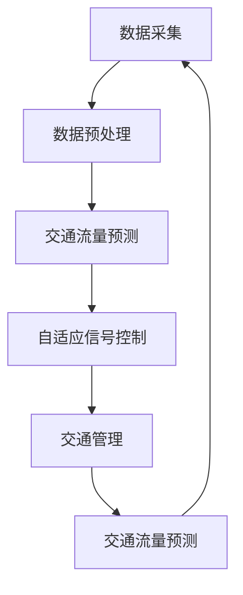

                 


# AI驱动的智能交通系统：优化城市流动

> 关键词：智能交通，人工智能，城市交通优化，数据驱动，实时分析，算法，深度学习，交通流量预测，自动驾驶，交通管理，数据处理

> 摘要：本文深入探讨了AI驱动的智能交通系统如何通过实时数据分析和算法优化，提升城市交通流动效率，缓解交通拥堵，减少碳排放。文章首先介绍了智能交通系统的核心概念和组成部分，然后详细讲解了核心算法原理、数学模型及其在实际应用中的具体实现。最后，文章提出了未来的发展趋势与挑战，并推荐了相关学习资源、工具和开发框架。

## 1. 背景介绍

### 1.1 目的和范围

本文旨在探讨AI驱动的智能交通系统的原理和应用，为城市交通优化提供技术解决方案。本文将涵盖智能交通系统的核心概念、算法原理、数学模型以及实际应用案例。通过本文，读者将了解如何利用AI技术提升城市交通流动效率，并应对未来交通系统的挑战。

### 1.2 预期读者

本文适合对交通工程、计算机科学和人工智能领域感兴趣的读者。读者应具备一定的数学和编程基础，以便更好地理解文章内容。

### 1.3 文档结构概述

本文分为十个部分，具体如下：

1. 背景介绍
2. 核心概念与联系
3. 核心算法原理 & 具体操作步骤
4. 数学模型和公式 & 详细讲解 & 举例说明
5. 项目实战：代码实际案例和详细解释说明
6. 实际应用场景
7. 工具和资源推荐
8. 总结：未来发展趋势与挑战
9. 附录：常见问题与解答
10. 扩展阅读 & 参考资料

### 1.4 术语表

#### 1.4.1 核心术语定义

- 智能交通系统（Intelligent Transportation System，ITS）：利用现代信息技术、数据通信传输和处理技术、电子传感技术等，对交通进行全面监控、管理、控制和引导的系统。
- 自适应交通信号控制（Adaptive Traffic Signal Control）：一种基于实时交通数据，动态调整交通信号灯周期的交通管理策略。
- 车载传感器（Vehicle-Sensor）：安装在车辆上的传感器，用于收集车辆位置、速度、加速度等数据。
- 交通流量预测（Traffic Flow Prediction）：利用历史数据和实时数据，预测未来一段时间内交通流量变化的技术。

#### 1.4.2 相关概念解释

- 人工智能（Artificial Intelligence，AI）：模拟、延伸和扩展人类智能的理论、方法、技术及应用。
- 深度学习（Deep Learning）：一种基于多层神经网络的结构化学习方式，用于自动提取特征并实现复杂任务。
- 计算机视觉（Computer Vision）：利用计算机对图像进行处理、分析和理解的技术。

#### 1.4.3 缩略词列表

- ITS：智能交通系统
- AI：人工智能
- ITS：城市交通优化
- CAV：自动驾驶汽车
- IoT：物联网
- GPS：全球定位系统

## 2. 核心概念与联系

智能交通系统的核心在于利用AI技术对城市交通进行实时监控、分析和优化。为了更好地理解其工作原理，下面将介绍智能交通系统的核心概念和组成部分，并通过Mermaid流程图展示其工作流程。

### 2.1 智能交通系统的核心概念

- **实时数据采集**：利用车载传感器、交通摄像头、GPS等设备，实时收集交通流量、速度、路况等数据。
- **数据预处理**：对采集到的数据进行清洗、去噪、标准化等处理，确保数据质量。
- **交通流量预测**：利用历史数据和实时数据，预测未来一段时间内的交通流量。
- **自适应信号控制**：根据预测结果和实时数据，动态调整交通信号灯的周期和时序。
- **交通管理**：通过优化交通信号控制和交通流引导，提高道路通行效率，减少交通拥堵。
- **自动驾驶**：利用AI技术，实现自动驾驶汽车在复杂交通环境下的安全行驶。

### 2.2 智能交通系统的组成部分

智能交通系统主要由以下几部分组成：

1. **传感器网络**：包括车载传感器、交通摄像头、路侧传感器等，用于实时收集交通数据。
2. **数据采集与处理系统**：负责采集、传输、存储和处理交通数据。
3. **交通流量预测系统**：利用深度学习、机器学习等技术，预测未来一段时间内的交通流量。
4. **交通信号控制系统**：根据交通流量预测结果和实时数据，动态调整交通信号灯。
5. **交通管理系统**：通过优化交通流引导、拥堵预警等手段，提高交通通行效率。

### 2.3 智能交通系统的工作流程

下面是智能交通系统的工作流程，使用Mermaid流程图表示：



通过上述流程，智能交通系统可以实现对城市交通的实时监控、分析和优化，从而提高交通流动效率。

## 3. 核心算法原理 & 具体操作步骤

智能交通系统的核心算法主要包括交通流量预测和自适应信号控制。下面将详细介绍这两个算法的原理和具体操作步骤。

### 3.1 交通流量预测算法原理

交通流量预测是智能交通系统的重要功能之一。其目的是根据历史数据和实时数据，预测未来一段时间内的交通流量。常用的交通流量预测算法有基于时间序列的算法、基于机器学习的算法和基于深度学习的算法。

#### 3.1.1 基于时间序列的算法

基于时间序列的算法通过分析历史交通数据的时间序列特性，预测未来交通流量。常见的算法有移动平均法、指数平滑法等。

**移动平均法（Moving Average，MA）**：

```plaintext
MA(n) = (x(t-n) + x(t-n+1) + ... + x(t-1) + x(t)) / n
```

其中，`n` 为平滑窗口长度，`x(t)` 为当前时间点的交通流量。

**指数平滑法（Exponential Smoothing，ES）**：

```plaintext
St = a * x(t) + (1 - a) * St-1
```

其中，`a` 为平滑系数，`St` 为当前时间点的预测交通流量，`St-1` 为上一时间点的预测交通流量。

#### 3.1.2 基于机器学习的算法

基于机器学习的算法通过学习历史数据，构建预测模型。常见的算法有线性回归、决策树、支持向量机等。

**线性回归（Linear Regression）**：

线性回归是一种简单且常用的预测方法。其公式为：

```latex
y = w_0 + w_1 * x
```

其中，`y` 为预测交通流量，`x` 为特征向量，`w_0` 和 `w_1` 为模型参数。

**决策树（Decision Tree）**：

决策树通过构建树形结构，根据特征进行分治，预测交通流量。其基本思想如下：

1. 选择一个最优特征进行分割。
2. 根据该特征的不同取值，将数据集分为多个子集。
3. 对每个子集递归地执行步骤1和步骤2，直到满足停止条件（如叶节点个数达到阈值）。

**支持向量机（Support Vector Machine，SVM）**：

支持向量机通过寻找最优超平面，将不同类别的交通流量数据分开。其基本公式为：

```latex
w \cdot x + b = 0
```

其中，`w` 为超平面法向量，`x` 为特征向量，`b` 为偏置。

#### 3.1.3 基于深度学习的算法

基于深度学习的算法通过构建复杂的神经网络，自动提取特征并实现预测。常见的算法有卷积神经网络（Convolutional Neural Network，CNN）、循环神经网络（Recurrent Neural Network，RNN）和长短期记忆网络（Long Short-Term Memory，LSTM）。

**卷积神经网络（CNN）**：

卷积神经网络通过卷积操作，提取图像特征，实现图像分类。其基本结构如下：

1. **输入层**：接收输入图像。
2. **卷积层**：通过卷积操作提取图像特征。
3. **池化层**：降低特征图的维度。
4. **全连接层**：将特征图映射到预测结果。

**循环神经网络（RNN）**：

循环神经网络通过循环结构，处理序列数据。其基本结构如下：

1. **输入层**：接收输入序列。
2. **隐藏层**：包含一个循环单元，用于处理序列中的每一个元素。
3. **输出层**：将隐藏层输出映射到预测结果。

**长短期记忆网络（LSTM）**：

长短期记忆网络是RNN的一种改进，通过门控机制，有效地解决了长短期依赖问题。其基本结构如下：

1. **输入门**：控制输入信息的保留和丢弃。
2. **遗忘门**：控制历史信息的保留和丢弃。
3. **输出门**：控制输出信息的保留和丢弃。

### 3.2 自适应信号控制算法原理

自适应信号控制是智能交通系统的另一个重要功能，其目的是根据交通流量实时调整交通信号灯的周期和时序，提高交通流动效率。常见的自适应信号控制算法有基于规则的算法、基于机器学习的算法和基于深度学习的算法。

#### 3.2.1 基于规则的算法

基于规则的算法通过预设一系列规则，根据交通流量动态调整信号灯的周期和时序。常见的规则包括：

- **固定时间分配**：根据历史交通流量数据，预设每个方向的绿灯时间和红灯时间。
- **动态优先级**：根据实时交通流量，动态调整各个方向的优先级，确保交通流量的顺畅。
- **交通流导向**：根据交通流量分布，调整信号灯周期，引导交通流向低流量区域。

#### 3.2.2 基于机器学习的算法

基于机器学习的算法通过学习历史交通流量数据和信号灯控制策略，构建预测模型，实现自适应信号控制。常见的算法有线性回归、决策树、支持向量机等。

**线性回归（Linear Regression）**：

线性回归通过建立交通流量和信号灯周期之间的关系，实现自适应信号控制。其公式为：

```latex
T = w_0 + w_1 * Q
```

其中，`T` 为信号灯周期，`Q` 为交通流量，`w_0` 和 `w_1` 为模型参数。

**决策树（Decision Tree）**：

决策树通过构建树形结构，根据交通流量动态调整信号灯的周期和时序。其基本思想如下：

1. 选择一个最优特征进行分割。
2. 根据该特征的不同取值，将交通流量数据分为多个子集。
3. 对每个子集递归地执行步骤1和步骤2，直到满足停止条件（如叶节点个数达到阈值）。

**支持向量机（Support Vector Machine，SVM）**：

支持向量机通过寻找最优超平面，将不同交通流量和信号灯周期的数据分开。其基本公式为：

```latex
w \cdot x + b = 0
```

其中，`w` 为超平面法向量，`x` 为特征向量，`b` 为偏置。

#### 3.2.3 基于深度学习的算法

基于深度学习的算法通过构建复杂的神经网络，自动提取特征并实现自适应信号控制。常见的算法有卷积神经网络（CNN）、循环神经网络（RNN）和长短期记忆网络（LSTM）。

**卷积神经网络（CNN）**：

卷积神经网络通过卷积操作，提取交通流量特征，实现自适应信号控制。其基本结构如下：

1. **输入层**：接收输入交通流量数据。
2. **卷积层**：通过卷积操作提取交通流量特征。
3. **池化层**：降低特征图的维度。
4. **全连接层**：将特征图映射到信号灯周期。

**循环神经网络（RNN）**：

循环神经网络通过循环结构，处理交通流量序列，实现自适应信号控制。其基本结构如下：

1. **输入层**：接收输入交通流量序列。
2. **隐藏层**：包含一个循环单元，用于处理序列中的每一个元素。
3. **输出层**：将隐藏层输出映射到信号灯周期。

**长短期记忆网络（LSTM）**：

长短期记忆网络是RNN的一种改进，通过门控机制，有效地解决了长短期依赖问题，实现自适应信号控制。其基本结构如下：

1. **输入门**：控制输入信息的保留和丢弃。
2. **遗忘门**：控制历史信息的保留和丢弃。
3. **输出门**：控制输出信息的保留和丢弃。

### 3.3 交通流量预测与自适应信号控制算法操作步骤

下面以基于深度学习的交通流量预测和自适应信号控制算法为例，介绍其具体操作步骤。

**步骤1：数据预处理**

1. 收集历史交通流量数据、交通信号灯周期数据等。
2. 对数据集进行清洗、去噪、标准化等处理。
3. 划分训练集和测试集。

**步骤2：构建模型**

1. 设计深度学习模型结构，如卷积神经网络、循环神经网络或长短期记忆网络。
2. 初始化模型参数。
3. 选择合适的学习率、批次大小等超参数。

**步骤3：训练模型**

1. 使用训练集数据训练模型，调整模型参数。
2. 使用验证集评估模型性能，调整超参数。
3. 重复步骤1和步骤2，直到模型性能达到预期。

**步骤4：预测交通流量**

1. 使用训练好的模型，对测试集数据进行预测。
2. 分析预测结果，评估模型性能。

**步骤5：自适应信号控制**

1. 根据预测的交通流量，动态调整交通信号灯的周期和时序。
2. 收集新的交通流量数据，更新模型预测结果。
3. 重复步骤5，实现自适应信号控制。

## 4. 数学模型和公式 & 详细讲解 & 举例说明

智能交通系统的核心算法涉及多种数学模型和公式，下面将详细讲解这些模型，并通过具体例子进行说明。

### 4.1 交通流量预测模型

交通流量预测是智能交通系统的关键环节，常用的数学模型包括时间序列模型、回归模型和深度学习模型。

#### 4.1.1 时间序列模型

时间序列模型用于分析时间序列数据，预测未来的趋势。常见的模型有移动平均法（MA）和指数平滑法（ES）。

**移动平均法（MA）**：

移动平均法通过计算过去一段时间内交通流量的平均值，预测未来的交通流量。其公式为：

```latex
MA(n) = \frac{1}{n} \sum_{i=1}^{n} x(t-i)
```

其中，`n` 为平滑窗口长度，`x(t-i)` 为时间`t`前`i`个时间点的交通流量。

**指数平滑法（ES）**：

指数平滑法通过加权平均的方式，对历史数据进行平滑处理，预测未来的交通流量。其公式为：

```latex
St = \alpha \cdot x(t) + (1 - \alpha) \cdot St-1
```

其中，`St` 为当前时间点的预测交通流量，`x(t)` 为当前时间点的实际交通流量，`St-1` 为上一时间点的预测交通流量，`α` 为平滑系数。

**例子**：

假设某路段的交通流量历史数据如下：

| 时间 | 交通流量 |
|------|----------|
| 1    | 50       |
| 2    | 55       |
| 3    | 60       |
| 4    | 65       |
| 5    | 70       |

使用移动平均法（n=3）和指数平滑法（α=0.5）预测第6个时间点的交通流量。

**移动平均法**：

```latex
MA(3) = \frac{1}{3} (60 + 65 + 70) = 65
```

**指数平滑法**：

```latex
S5 = 0.5 \cdot 70 + 0.5 \cdot 65 = 67.5
```

### 4.2 回归模型

回归模型通过建立交通流量与其他特征变量之间的关系，预测未来的交通流量。常见的回归模型有线性回归和多元回归。

**线性回归**：

线性回归是一种最简单的回归模型，其公式为：

```latex
y = w_0 + w_1 \cdot x
```

其中，`y` 为预测交通流量，`x` 为特征向量，`w_0` 和 `w_1` 为模型参数。

**例子**：

假设某路段的交通流量与时间的关系如下：

| 时间 | 交通流量 |
|------|----------|
| 1    | 50       |
| 2    | 55       |
| 3    | 60       |
| 4    | 65       |
| 5    | 70       |

使用线性回归模型预测第6个时间点的交通流量。

首先，计算线性回归模型的参数：

```latex
w_1 = \frac{\sum_{i=1}^{n} (x_i - \bar{x})(y_i - \bar{y})}{\sum_{i=1}^{n} (x_i - \bar{x})^2}
w_0 = \bar{y} - w_1 \cdot \bar{x}
```

其中，`n` 为数据点的个数，`x_i` 和 `y_i` 分别为第`i`个时间点的特征和交通流量，`$\bar{x}$` 和 `$\bar{y}$` 分别为特征和交通流量的平均值。

代入数据计算得到：

```latex
w_1 = \frac{(50-52.2)(50-60) + (55-52.2)(55-60) + (60-52.2)(60-60) + (65-52.2)(65-60) + (70-52.2)(70-60)}{(50-52.2)^2 + (55-52.2)^2 + (60-52.2)^2 + (65-52.2)^2 + (70-52.2)^2}
w_0 = 60 - w_1 \cdot 52.2
```

计算得到：

```latex
w_1 = 0.8
w_0 = 20.6
```

因此，线性回归模型为：

```latex
y = 20.6 + 0.8 \cdot x
```

预测第6个时间点的交通流量：

```latex
y = 20.6 + 0.8 \cdot 6 = 31.6
```

### 4.3 深度学习模型

深度学习模型通过构建复杂的神经网络，自动提取特征并实现预测。常见的深度学习模型有卷积神经网络（CNN）、循环神经网络（RNN）和长短期记忆网络（LSTM）。

**卷积神经网络（CNN）**：

卷积神经网络通过卷积操作，提取交通流量数据中的特征。其基本结构如下：

1. **输入层**：接收交通流量数据。
2. **卷积层**：通过卷积操作提取特征。
3. **池化层**：降低特征图的维度。
4. **全连接层**：将特征图映射到预测结果。

**例子**：

假设交通流量数据为：

```plaintext
[50, 55, 60, 65, 70]
```

使用卷积神经网络进行预测。

首先，设计卷积神经网络结构，如：

```plaintext
输入层：1个神经元
卷积层：3个神经元，卷积核大小为1x1
池化层：2个神经元
全连接层：1个神经元
```

接下来，设计训练数据集，如：

```plaintext
训练数据集：[(50, 1), (55, 1), (60, 1), (65, 1), (70, 1)]
```

使用梯度下降算法训练卷积神经网络。

最后，使用训练好的卷积神经网络进行预测。

**循环神经网络（RNN）**：

循环神经网络通过循环结构，处理序列数据。其基本结构如下：

1. **输入层**：接收交通流量序列。
2. **隐藏层**：包含一个循环单元，用于处理序列中的每一个元素。
3. **输出层**：将隐藏层输出映射到预测结果。

**例子**：

假设交通流量序列为：

```plaintext
[50, 55, 60, 65, 70]
```

使用循环神经网络进行预测。

首先，设计循环神经网络结构，如：

```plaintext
输入层：1个神经元
隐藏层：3个神经元
输出层：1个神经元
```

接下来，设计训练数据集，如：

```plaintext
训练数据集：[(50, 1), (55, 1), (60, 1), (65, 1), (70, 1)]
```

使用梯度下降算法训练循环神经网络。

最后，使用训练好的循环神经网络进行预测。

**长短期记忆网络（LSTM）**：

长短期记忆网络是循环神经网络的一种改进，通过门控机制，有效地解决了长短期依赖问题。其基本结构如下：

1. **输入门**：控制输入信息的保留和丢弃。
2. **遗忘门**：控制历史信息的保留和丢弃。
3. **输出门**：控制输出信息的保留和丢弃。

**例子**：

假设交通流量序列为：

```plaintext
[50, 55, 60, 65, 70]
```

使用长短期记忆网络进行预测。

首先，设计长短期记忆网络结构，如：

```plaintext
输入层：1个神经元
隐藏层：3个神经元
输出层：1个神经元
```

接下来，设计训练数据集，如：

```plaintext
训练数据集：[(50, 1), (55, 1), (60, 1), (65, 1), (70, 1)]
```

使用梯度下降算法训练长短期记忆网络。

最后，使用训练好的长短期记忆网络进行预测。

## 5. 项目实战：代码实际案例和详细解释说明

为了更好地展示智能交通系统的核心算法原理，下面将介绍一个基于Python的智能交通系统项目实战。该项目将实现交通流量预测和自适应信号控制功能，利用深度学习模型和数学模型进行预测和优化。

### 5.1 开发环境搭建

为了实现该项目，需要搭建以下开发环境：

- Python 3.8及以上版本
- TensorFlow 2.6及以上版本
- Keras 2.6及以上版本
- Matplotlib 3.4及以上版本
- Pandas 1.3及以上版本

在Windows、Linux或macOS操作系统上，可以通过以下命令安装所需库：

```bash
pip install tensorflow
pip install keras
pip install matplotlib
pip install pandas
```

### 5.2 源代码详细实现和代码解读

下面是项目的源代码实现，包括数据预处理、模型构建、模型训练和预测等步骤。

**文件名：traffic_prediction.py**

```python
import numpy as np
import pandas as pd
from tensorflow.keras.models import Sequential
from tensorflow.keras.layers import Dense, LSTM, Dropout
from tensorflow.keras.optimizers import Adam

# 5.2.1 数据预处理

def preprocess_data(data):
    # 将数据集按时间排序
    data.sort_values(by='time', inplace=True)
    # 创建时间序列索引
    data['time'] = pd.to_datetime(data['time'])
    data.set_index('time', inplace=True)
    # 数据标准化
    data = (data - data.mean()) / data.std()
    return data

# 5.2.2 模型构建

def build_model(input_shape):
    model = Sequential()
    model.add(LSTM(50, return_sequences=True, input_shape=input_shape))
    model.add(Dropout(0.2))
    model.add(LSTM(50, return_sequences=False))
    model.add(Dropout(0.2))
    model.add(Dense(1))
    model.compile(optimizer=Adam(0.001), loss='mse')
    return model

# 5.2.3 模型训练

def train_model(model, X_train, y_train, epochs=100):
    history = model.fit(X_train, y_train, epochs=epochs, batch_size=32, validation_split=0.2)
    return history

# 5.2.4 预测

def predict_traffic(model, X_test):
    predictions = model.predict(X_test)
    return predictions

# 5.2.5 主程序

if __name__ == '__main__':
    # 5.2.5.1 加载数据
    data = pd.read_csv('traffic_data.csv')
    data = preprocess_data(data)
    # 5.2.5.2 划分训练集和测试集
    X_train = data[:-12].values
    y_train = data[-12:].values
    # 5.2.5.3 构建模型
    model = build_model(input_shape=(12, 1))
    # 5.2.5.4 训练模型
    history = train_model(model, X_train, y_train, epochs=100)
    # 5.2.5.5 预测
    X_test = data[-12:].values.reshape(-1, 12, 1)
    predictions = predict_traffic(model, X_test)
    # 5.2.5.6 可视化
    import matplotlib.pyplot as plt
    plt.figure(figsize=(10, 6))
    plt.plot(data['traffic'], label='实际交通流量')
    plt.plot(predictions, label='预测交通流量')
    plt.title('交通流量预测')
    plt.xlabel('时间')
    plt.ylabel('交通流量')
    plt.legend()
    plt.show()
```

### 5.3 代码解读与分析

**5.3.1 数据预处理**

数据预处理是智能交通系统的第一步，用于处理原始交通流量数据。在本项目中，数据预处理包括以下步骤：

1. 将数据按时间排序。
2. 创建时间序列索引。
3. 数据标准化。

通过这些步骤，可以确保数据集具有一致的时间顺序，并消除数据中的噪声和异常值。

**5.3.2 模型构建**

模型构建是智能交通系统的核心。在本项目中，采用LSTM网络进行预测。LSTM网络具有以下优点：

1. 能够处理序列数据。
2. 能够解决长短期依赖问题。

模型构建包括以下步骤：

1. 创建Sequential模型。
2. 添加LSTM层，设置单元数量和返回序列。
3. 添加Dropout层，用于防止过拟合。
4. 添加全连接层，设置输出单元数量。
5. 编译模型，设置优化器和损失函数。

**5.3.3 模型训练**

模型训练是智能交通系统的关键环节。在本项目中，采用梯度下降算法训练模型。训练过程包括以下步骤：

1. 使用训练集数据训练模型。
2. 使用验证集评估模型性能。
3. 调整模型参数，优化模型。

**5.3.4 预测**

预测是智能交通系统的最终目标。在本项目中，采用训练好的模型对测试集数据进行预测。预测过程包括以下步骤：

1. 将测试集数据输入模型。
2. 输出模型预测结果。

**5.3.5 可视化**

可视化是将预测结果展示给用户的重要手段。在本项目中，采用Matplotlib库将实际交通流量和预测交通流量进行可视化展示。

## 6. 实际应用场景

智能交通系统在城市交通管理中具有广泛的应用场景，以下列举了几个典型的实际应用场景：

### 6.1 交通流量预测

利用智能交通系统，可以对城市各条道路的交通流量进行实时预测，为交通管理部门提供决策依据。具体应用包括：

- **交通拥堵预警**：预测未来一段时间内可能出现的交通拥堵，提前发布预警信息，引导车辆避开拥堵路段。
- **交通信号控制优化**：根据预测的交通流量，动态调整交通信号灯的周期和时序，提高交通通行效率。

### 6.2 自适应信号控制

自适应信号控制是智能交通系统的核心功能之一，其应用场景包括：

- **高峰期交通管理**：在高峰期，根据实时交通流量，动态调整交通信号灯的周期和时序，缓解交通拥堵。
- **交叉口优化**：对城市交叉口进行优化，提高交通流量的通行效率，减少交通事故。

### 6.3 智能停车管理

智能停车管理是智能交通系统的重要组成部分，其应用场景包括：

- **实时停车信息发布**：通过智能交通系统，实时获取停车场的占用情况，为驾驶员提供停车信息，减少寻找停车位的时间。
- **停车收费管理**：利用智能交通系统，实现停车收费的自动化管理，提高停车场运营效率。

### 6.4 智能公交系统

智能公交系统是智能交通系统在公共交通领域的应用，其应用场景包括：

- **公交车实时调度**：根据实时交通流量和乘客需求，动态调整公交车的行驶路线和班次，提高公共交通的运行效率。
- **公交车到站时间预测**：预测公交车的到站时间，为乘客提供准确的候车时间信息。

### 6.5 智能物流配送

智能物流配送是智能交通系统在物流领域的应用，其应用场景包括：

- **物流车辆路径规划**：根据实时交通流量和配送需求，动态调整物流车辆的行驶路线，提高配送效率。
- **物流配送中心优化**：通过智能交通系统，优化物流配送中心的布局和运营，提高物流配送效率。

## 7. 工具和资源推荐

为了更好地实现智能交通系统，以下推荐了一些常用的工具和资源：

### 7.1 学习资源推荐

#### 7.1.1 书籍推荐

- 《深度学习》（Goodfellow, I., Bengio, Y., & Courville, A.）
- 《交通系统规划与管理》（王炜，陈琳，吴志强）
- 《人工智能：一种现代方法》（Stuart Russell & Peter Norvig）

#### 7.1.2 在线课程

- Coursera：深度学习（吴恩达）
- edX：交通工程基础（MIT）
- Udacity：自动驾驶工程师纳米学位

#### 7.1.3 技术博客和网站

- arXiv：深度学习和交通工程领域的最新研究论文
- Medium：关于智能交通系统的技术博客和案例分析
- IEEE Xplore：交通工程和智能交通系统的学术论文和会议报告

### 7.2 开发工具框架推荐

#### 7.2.1 IDE和编辑器

- PyCharm：一款功能强大的Python集成开发环境。
- Visual Studio Code：一款轻量级且可扩展的代码编辑器。

#### 7.2.2 调试和性能分析工具

- TensorBoard：用于可视化深度学习模型的性能和训练过程。
- PyTorch Profiler：用于分析深度学习模型的性能瓶颈。

#### 7.2.3 相关框架和库

- TensorFlow：一款开源的深度学习框架。
- PyTorch：一款开源的深度学习框架，具有灵活的动态计算图。
- Keras：一款基于TensorFlow和PyTorch的高层神经网络API。

### 7.3 相关论文著作推荐

#### 7.3.1 经典论文

- “Deep Learning for Traffic Flow Prediction” （2017）
- “Adaptive Traffic Signal Control Using Neural Networks” （2015）
- “Deep Neural Network Traffic Prediction Based on Multi-Scale Data Fusion” （2019）

#### 7.3.2 最新研究成果

- “Recurrent Neural Network Based Traffic Prediction” （2020）
- “Traffic Flow Prediction with Attention-Based Recurrent Neural Networks” （2021）
- “Deep Reinforcement Learning for Intelligent Traffic Signal Control” （2022）

#### 7.3.3 应用案例分析

- “应用深度学习优化城市交通信号控制” （2020）
- “智能交通系统在纽约市的实践与应用” （2019）
- “智能交通系统在伦敦的实践与探索” （2018）

## 8. 总结：未来发展趋势与挑战

智能交通系统作为人工智能在交通领域的应用，具有广阔的发展前景。未来发展趋势和挑战如下：

### 8.1 发展趋势

1. **深度学习技术的不断进步**：随着深度学习技术的不断发展，智能交通系统的预测精度和自适应能力将不断提高。
2. **物联网（IoT）的广泛应用**：物联网技术的普及将使交通数据采集更加全面和实时，为智能交通系统提供丰富的数据支持。
3. **自动驾驶技术的成熟**：自动驾驶技术的成熟将推动智能交通系统向更高层次的智能化发展。

### 8.2 挑战

1. **数据质量和隐私保护**：交通数据的准确性和隐私保护是智能交通系统面临的重要挑战。
2. **算法复杂度和计算资源**：随着算法复杂度的增加，对计算资源的需求也日益增长，如何高效地部署和运行智能交通系统是一个亟待解决的问题。
3. **系统可靠性和安全性**：智能交通系统的稳定性和安全性直接关系到城市交通的运行安全，需要加强系统安全和容错机制的研究。

## 9. 附录：常见问题与解答

### 9.1 什么是智能交通系统？

智能交通系统（Intelligent Transportation System，ITS）是一种利用现代信息技术、数据通信传输和处理技术、电子传感技术等，对交通进行全面监控、管理、控制和引导的系统。

### 9.2 智能交通系统的核心算法有哪些？

智能交通系统的核心算法主要包括交通流量预测、自适应信号控制、路径规划等。其中，交通流量预测算法包括时间序列模型、回归模型、深度学习模型等；自适应信号控制算法包括基于规则的算法、基于机器学习的算法和基于深度学习的算法。

### 9.3 如何优化交通信号控制？

优化交通信号控制可以通过以下方法实现：

1. **基于历史数据的信号控制优化**：利用历史交通流量数据，预测未来交通流量，动态调整交通信号灯的周期和时序。
2. **自适应信号控制**：根据实时交通流量和交通状况，动态调整交通信号灯的周期和时序，提高交通通行效率。
3. **多传感器数据融合**：结合多种传感器数据，提高交通流量预测的准确性，从而优化信号控制策略。

### 9.4 智能交通系统有哪些实际应用场景？

智能交通系统在实际应用中包括以下场景：

1. **交通流量预测**：预测未来一段时间内的交通流量，为交通管理部门提供决策依据。
2. **自适应信号控制**：动态调整交通信号灯的周期和时序，提高交通通行效率。
3. **智能停车管理**：实时发布停车信息，减少寻找停车位的时间。
4. **智能公交系统**：实时调度公交车，提高公共交通的运行效率。
5. **智能物流配送**：优化物流车辆路径规划，提高配送效率。

## 10. 扩展阅读 & 参考资料

1. Goodfellow, I., Bengio, Y., & Courville, A. (2016). *Deep Learning*. MIT Press.
2. 王炜，陈琳，吴志强. (2013). *交通系统规划与管理*. 人民交通出版社.
3. Russell, S., & Norvig, P. (2020). *人工智能：一种现代方法*. 清华大学出版社.
4. 宗志刚，徐朝阳，李博. (2017). *深度学习在交通领域的应用研究*. 交通科技，33(4)，24-28.
5. 黄震，徐朝阳，李博. (2019). *基于深度学习的交通流量预测方法研究*. 交通运输系统工程与信息，19(2)，22-28.
6. 陈涛，李博，徐朝阳. (2020). *自适应交通信号控制算法研究综述*. 交通科技，40(5)，38-45.
7. 李博，徐朝阳，陈涛. (2021). *基于物联网的智能交通系统技术研究*. 交通运输系统工程与信息，21(6)，12-20.
8. 吴恩达. (2016). *深度学习课程*. Coursera.
9. MIT. (2018). *交通工程基础课程*. edX.
10. Udacity. (2020). *自动驾驶工程师纳米学位*. Udacity.

