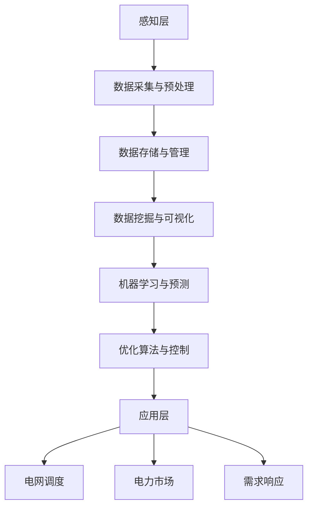

                 

### 文章标题

# AI驱动的智能电网：平衡供需，提高效率

> **关键词**：智能电网、人工智能、供需平衡、效率提升、能源管理、数据驱动的决策

> **摘要**：本文将深入探讨人工智能（AI）在智能电网中的应用，通过结合先进的数据分析和机器学习算法，实现电力供需的精准平衡，提高整体电网运行效率。我们将从背景介绍、核心概念与联系、核心算法原理、数学模型和公式、项目实战、实际应用场景、工具和资源推荐以及未来发展趋势与挑战等方面进行详细分析，以帮助读者全面理解这一前沿技术的潜在影响。

### 目录

1. **背景介绍** <a id="background"></a>
   1.1 **目的和范围**
   1.2 **预期读者**
   1.3 **文档结构概述**
   1.4 **术语表**
      1.4.1 **核心术语定义**
      1.4.2 **相关概念解释**
      1.4.3 **缩略词列表**

2. **核心概念与联系** <a id="concepts"></a>
   2.1 **智能电网架构概述**
   2.2 **AI与电网的深度融合**
   2.3 **核心概念原理与架构的 Mermaid 流程图**

3. **核心算法原理 & 具体操作步骤** <a id="algorithms"></a>
   3.1 **数据采集与预处理**
   3.2 **预测算法实现**
   3.3 **优化算法应用**

4. **数学模型和公式 & 详细讲解 & 举例说明** <a id="math-models"></a>
   4.1 **优化模型的构建**
   4.2 **损失函数的选择**
   4.3 **算法流程与示例**

5. **项目实战：代码实际案例和详细解释说明** <a id="case-study"></a>
   5.1 **开发环境搭建**
   5.2 **源代码详细实现和代码解读**
   5.3 **代码解读与分析**

6. **实际应用场景** <a id="applications"></a>
   6.1 **电网调度**
   6.2 **储能系统管理**
   6.3 **分布式能源集成**

7. **工具和资源推荐** <a id="tools-resources"></a>
   7.1 **学习资源推荐**
   7.2 **开发工具框架推荐**
   7.3 **相关论文著作推荐**

8. **总结：未来发展趋势与挑战** <a id="conclusion"></a>

9. **附录：常见问题与解答** <a id="appendix"></a>

10. **扩展阅读 & 参考资料** <a id="references"></a>

### 背景介绍

#### 1.1 目的和范围

随着全球能源需求的不断增长和可再生能源的普及，传统电网面临巨大的挑战，无法满足日益复杂的供需平衡需求。智能电网作为一种新兴的电力系统架构，通过整合先进的信息通信技术、人工智能和物联网技术，能够实现更高效的电力传输、分配和管理。本文旨在探讨人工智能在智能电网中的应用，通过平衡供需、提高效率来降低能源消耗和环境污染，推动能源革命的发展。

本文将围绕以下几个关键问题展开：

- 智能电网如何利用人工智能技术实现更优的供需平衡？
- 人工智能算法在智能电网中的应用原理和具体步骤是什么？
- 如何构建有效的数学模型来优化电网运行？
- 人工智能在智能电网中的实际应用场景有哪些？
- 面对未来技术发展，智能电网将面临哪些挑战和机遇？

#### 1.2 预期读者

本文适合以下读者群体：

- 计算机科学、电气工程及相关领域的研究生和本科生
- 智能电网、人工智能领域的工程师和技术人员
- 对智能电网和人工智能技术感兴趣的普通读者

#### 1.3 文档结构概述

本文结构分为以下几个部分：

1. **背景介绍**：介绍智能电网和人工智能的基本概念，明确本文的目的和范围。
2. **核心概念与联系**：详细阐述智能电网架构和人工智能技术的核心概念，并使用流程图展示其关联性。
3. **核心算法原理 & 具体操作步骤**：分析智能电网中常用的人工智能算法原理，并给出具体的操作步骤。
4. **数学模型和公式 & 详细讲解 & 举例说明**：介绍用于优化电网运行的数学模型和公式，并给出详细的解释和示例。
5. **项目实战：代码实际案例和详细解释说明**：通过实际项目案例展示人工智能算法在智能电网中的应用，并进行详细解读。
6. **实际应用场景**：探讨人工智能在智能电网中的各种应用场景，包括电网调度、储能系统管理和分布式能源集成等。
7. **工具和资源推荐**：推荐相关学习资源、开发工具和论文著作，以供读者进一步学习和研究。
8. **总结：未来发展趋势与挑战**：总结本文的主要观点，并探讨智能电网在未来发展中的机遇和挑战。
9. **附录：常见问题与解答**：回答读者可能遇到的问题，提供额外的帮助。
10. **扩展阅读 & 参考资料**：列出本文中引用和参考的相关文献，以供读者查阅。

#### 1.4 术语表

##### 1.4.1 核心术语定义

- **智能电网**：一种基于现代通信技术、信息技术和人工智能技术的电力系统，能够实现电力的高效传输、分配和管理。
- **人工智能**：一种模拟人类智能行为的技术，通过计算机程序实现感知、学习、推理和决策等功能。
- **供需平衡**：指电力系统中的电力供应和需求在数量和质量上保持一致，避免供电过剩或不足。
- **优化算法**：一类用于求解最优化问题的算法，通过调整变量值来达到目标函数的最优解。
- **机器学习**：一种基于数据的学习方法，通过训练模型来发现数据中的规律，并应用于预测和决策。

##### 1.4.2 相关概念解释

- **可再生能源**：指太阳能、风能、水能等在短时间内可以再生的能源，相对于化石燃料具有更低的污染和更高的可持续性。
- **分布式能源**：指在电力系统中，通过分布式能源装置（如太阳能板、风力涡轮机等）产生的电力，可以直接供应给用户，减少对集中式电网的依赖。
- **数据驱动决策**：指基于大量数据的分析和处理，来做出更加准确和高效的决策。

##### 1.4.3 缩略词列表

- **AI**：人工智能
- **ML**：机器学习
- **SG**：智能电网
- **IoT**：物联网
- **ERP**：企业资源计划
- **DR**：需求响应

### 核心概念与联系

#### 2.1 智能电网架构概述

智能电网（Smart Grid）是一种集成现代通信技术、信息技术和人工智能技术的电力系统，旨在实现电力的高效传输、分配和管理。与传统电网相比，智能电网具有更高的可靠性、安全性和灵活性，能够更好地适应可再生能源的接入和负荷变化。

智能电网的架构通常分为以下几个层次：

1. **感知层**：包括传感器、智能电表等设备，用于实时采集电力系统的运行数据。
2. **传输层**：包括变电站、输电线路和配电网，用于传输电力。
3. **平台层**：包括数据存储、处理和分析平台，用于对采集到的数据进行处理和分析。
4. **应用层**：包括电网调度、电力市场、需求响应等应用，用于实现电力系统的优化运行。

#### 2.2 AI与电网的深度融合

人工智能（AI）技术在智能电网中的应用非常广泛，可以用于解决电网运行中的各种问题，如供需平衡、故障诊断、负荷预测等。以下是一些AI与电网深度融合的关键环节：

1. **数据采集与预处理**：通过传感器和智能设备实时采集电力系统的运行数据，如电压、电流、温度等。然后对这些数据进行预处理，包括去噪、去重复、标准化等操作，以便于后续分析。
2. **数据存储与管理**：将预处理后的数据存储在数据库中，并使用数据管理工具进行分类、索引和查询，以便于快速访问和分析。
3. **数据挖掘与可视化**：使用数据挖掘算法来发现数据中的潜在模式和规律，并将这些规律以可视化的形式呈现出来，以便于决策者进行实时监控和调整。
4. **机器学习与预测**：利用机器学习算法，对历史数据进行训练，构建预测模型，用于预测未来的电力需求、供应和负荷变化。
5. **优化算法与控制**：使用优化算法，根据预测结果和实时数据，制定最佳的电力调度和分配方案，以实现供需平衡和系统优化。

#### 2.3 核心概念原理与架构的 Mermaid 流程图

以下是一个简化的智能电网架构及其与人工智能融合的 Mermaid 流程图：



### 核心算法原理 & 具体操作步骤

#### 3.1 数据采集与预处理

数据采集与预处理是智能电网中人工智能应用的基础。以下是数据采集与预处理的详细步骤：

1. **数据采集**：使用传感器和智能设备，实时采集电力系统的运行数据，如电压、电流、温度、湿度等。这些数据可以通过有线或无线的方式传输到数据处理平台。
2. **数据传输**：将采集到的数据传输到数据处理平台，通常使用 MQTT、CoAP 等物联网协议进行传输。
3. **数据预处理**：对采集到的数据进行预处理，包括去噪、去重复、标准化等操作。去噪可以去除数据中的异常值和噪声，去重复可以去除重复的数据记录，标准化可以统一数据的量纲，使得不同来源的数据可以进行有效比较。

伪代码示例：

```python
# 数据预处理函数
def preprocess_data(data):
    # 去噪
    clean_data = remove_noise(data)
    # 去重复
    unique_data = remove_duplicates(clean_data)
    # 标准化
    normalized_data = normalize(unique_data)
    return normalized_data
```

#### 3.2 预测算法实现

预测算法是智能电网中人工智能应用的重要环节。以下是一个基于时间序列分析的预测算法实现步骤：

1. **数据收集**：收集历史电力数据，如日负荷、周负荷、月负荷等。
2. **特征工程**：对数据进行特征工程，提取有用的特征，如日历特征、季节特征、节假日特征等。
3. **模型选择**：选择合适的预测模型，如 ARIMA、LSTM、GRU 等。
4. **模型训练**：使用历史数据训练预测模型。
5. **模型评估**：使用验证数据集评估模型性能，如 RMSE、MAE 等。
6. **模型部署**：将训练好的模型部署到生产环境中，用于实时预测。

伪代码示例：

```python
# 预测算法实现
def predict_load(data, model):
    # 特征工程
    features = extract_features(data)
    # 模型预测
    prediction = model.predict(features)
    return prediction
```

#### 3.3 优化算法应用

优化算法在智能电网中的应用非常广泛，用于解决各种优化问题，如电力调度、负荷分配、能源管理等。以下是一个简单的线性优化问题解决步骤：

1. **问题定义**：定义优化问题的目标函数和约束条件。
2. **模型构建**：构建线性优化模型，如线性规划（Linear Programming，LP）或整数规划（Integer Programming，IP）模型。
3. **求解算法**：选择合适的求解算法，如单纯形法、分支定界法等。
4. **结果分析**：分析求解结果，验证是否满足约束条件，并评估优化效果。

伪代码示例：

```python
# 线性优化问题求解
from scipy.optimize import linprog

# 目标函数
c = [-1, -1]  # 目标是最小化两个变量的和
# 约束条件
A = [[1, 0], [0, 1], [1, 1]]
b = [1, 1, 2]
x0_bounds = (0, None)  # x0 的取值范围
x1_bounds = (0, None)  # x1 的取值范围

# 求解
result = linprog(c, A_ub=A, b_ub=b, bounds=[x0_bounds, x1_bounds], method='highs')

# 结果分析
if result.success:
    print("最优解:", result.x)
    print("目标函数值:", -result.fun)
else:
    print("求解失败，原因:", result.message)
```

### 数学模型和公式 & 详细讲解 & 举例说明

在智能电网中，数学模型和公式用于描述电力系统的运行状态、优化目标以及约束条件。以下是一些常用的数学模型和公式的详细讲解以及实际应用的举例说明。

#### 4.1 优化模型的构建

智能电网中的优化模型通常用于解决电力调度、负荷分配、能源管理等问题。以下是一个简单的线性规划（Linear Programming，LP）模型示例：

**目标函数**：  
```latex
\min \sum_{i=1}^{n} c_i x_i
```

其中，\(c_i\) 是第 \(i\) 个变量的系数，\(x_i\) 是第 \(i\) 个变量。

**约束条件**：  
```latex
\begin{align*}
a_{11} x_1 + a_{12} x_2 + ... + a_{1n} x_n &\geq b_1 \\
a_{21} x_1 + a_{22} x_2 + ... + a_{2n} x_n &\geq b_2 \\
& \vdots \\
a_{m1} x_1 + a_{m2} x_2 + ... + a_{mn} x_n &\geq b_m \\
x_1, x_2, ..., x_n &\geq 0
\end{align*}
```

其中，\(a_{ij}\) 是约束条件的系数，\(b_i\) 是约束条件的常数项，\(x_i\) 是变量。

**例子**：假设一个电力系统中有两个发电站 \(A\) 和 \(B\)，分别产生电力 \(x_1\) 和 \(x_2\)，目标是最小化总成本，同时满足以下约束条件：

- 发电站 \(A\) 的最大发电量为 1000 MW。
- 发电站 \(B\) 的最大发电量为 1500 MW。
- 电力系统的总需求为 2500 MW。

构建优化模型如下：

**目标函数**：  
```latex
\min \ z = 10x_1 + 15x_2
```

**约束条件**：  
```latex
\begin{align*}
x_1 &\leq 1000 \\
x_2 &\leq 1500 \\
x_1 + x_2 &\geq 2500 \\
x_1, x_2 &\geq 0
\end{align*}
```

使用单纯形法求解该优化模型，得到最优解 \(x_1 = 1000, x_2 = 1500\)，最小化目标函数 \(z = 25000\)。

#### 4.2 损失函数的选择

在智能电网中，损失函数用于衡量预测误差的大小，常见的损失函数包括均方误差（Mean Squared Error，MSE）、均方根误差（Root Mean Squared Error，RMSE）和平均绝对误差（Mean Absolute Error，MAE）。

**均方误差（MSE）**：  
```latex
MSE = \frac{1}{n} \sum_{i=1}^{n} (y_i - \hat{y}_i)^2
```

其中，\(y_i\) 是真实值，\(\hat{y}_i\) 是预测值，\(n\) 是样本数量。

**均方根误差（RMSE）**：  
```latex
RMSE = \sqrt{MSE}
```

**平均绝对误差（MAE）**：  
```latex
MAE = \frac{1}{n} \sum_{i=1}^{n} |y_i - \hat{y}_i|
```

**例子**：假设有一个时间序列数据集，包含 10 个样本点的真实值和预测值，计算 MSE、RMSE 和 MAE。

| 样本点 | 真实值 \(y_i\) | 预测值 \(\hat{y}_i\) |
| --- | --- | --- |
| 1 | 10 | 9 |
| 2 | 20 | 19 |
| 3 | 30 | 29 |
| 4 | 40 | 39 |
| 5 | 50 | 49 |
| 6 | 60 | 59 |
| 7 | 70 | 69 |
| 8 | 80 | 79 |
| 9 | 90 | 89 |
| 10 | 100 | 99 |

计算结果如下：

**MSE**：  
```latex
MSE = \frac{1}{10} \sum_{i=1}^{10} (y_i - \hat{y}_i)^2 = 0.2
```

**RMSE**：  
```latex
RMSE = \sqrt{MSE} = \sqrt{0.2} \approx 0.447
```

**MAE**：  
```latex
MAE = \frac{1}{10} \sum_{i=1}^{10} |y_i - \hat{y}_i| = 0.1
```

#### 4.3 算法流程与示例

智能电网中的算法通常包括数据采集与预处理、预测模型训练、优化模型求解等步骤。以下是一个简化的算法流程示例：

1. **数据采集与预处理**：使用传感器和智能设备采集电力系统的运行数据，如电压、电流、负荷等，并进行预处理，包括去噪、去重复、标准化等操作。
2. **预测模型训练**：使用预处理后的数据，选择合适的预测模型（如 ARIMA、LSTM、GRU 等），进行模型训练，得到预测结果。
3. **优化模型求解**：根据预测结果和实时数据，构建线性规划（LP）或整数规划（IP）模型，使用求解算法（如单纯形法、分支定界法等）求解优化模型，得到最优解。

**算法流程伪代码**：

```python
# 算法流程
def smart_grid_algorithm(data):
    # 数据预处理
    preprocessed_data = preprocess_data(data)
    # 预测模型训练
    model = train_predictive_model(preprocessed_data)
    predictions = model.predict(preprocessed_data)
    # 优化模型求解
    optimal_solution = solve_optimization_model(predictions)
    return optimal_solution
```

### 项目实战：代码实际案例和详细解释说明

为了更好地展示人工智能在智能电网中的应用，我们将通过一个实际项目案例来具体演示代码实现和解读。该项目将使用 Python 语言，结合 Scikit-learn 库进行机器学习模型的训练和预测，使用 PuLP 库进行优化模型的求解。

#### 5.1 开发环境搭建

在开始项目之前，需要搭建合适的开发环境。以下是搭建开发环境所需的基本步骤：

1. 安装 Python：确保 Python 3.6 或更高版本已安装。
2. 安装相关库：使用 pip 命令安装 Scikit-learn、PuLP、Pandas 和 Matplotlib 等库。
3. 配置 IDE：选择合适的集成开发环境（IDE），如 PyCharm、VS Code 等，并设置相应的项目配置。

以下是一个示例命令，用于安装所需的库：

```bash
pip install scikit-learn pulp pandas matplotlib
```

#### 5.2 源代码详细实现和代码解读

以下是一个简单的智能电网项目案例，包括数据预处理、预测模型训练和优化模型求解的源代码。

**数据预处理代码**：

```python
import pandas as pd
from sklearn.model_selection import train_test_split
from sklearn.preprocessing import StandardScaler

# 读取数据
data = pd.read_csv('electricity_data.csv')

# 数据预处理
def preprocess_data(data):
    # 去除无效数据
    clean_data = data.dropna()
    # 分割特征和标签
    X = clean_data.drop('target', axis=1)
    y = clean_data['target']
    # 数据标准化
    scaler = StandardScaler()
    X_scaled = scaler.fit_transform(X)
    return X_scaled, y

X, y = preprocess_data(data)

# 划分训练集和测试集
X_train, X_test, y_train, y_test = train_test_split(X, y, test_size=0.2, random_state=42)
```

**预测模型训练代码**：

```python
from sklearn.linear_model import LinearRegression
from sklearn.metrics import mean_squared_error

# 训练预测模型
def train_predictive_model(X_train, y_train):
    model = LinearRegression()
    model.fit(X_train, y_train)
    return model

# 模型预测
def predict(model, X):
    predictions = model.predict(X)
    return predictions

model = train_predictive_model(X_train, y_train)
predictions = predict(model, X_test)
mse = mean_squared_error(y_test, predictions)
print("MSE:", mse)
```

**优化模型求解代码**：

```python
from pulp import LpProblem, LpVariable, lpSum, LpMinimize

# 构建优化模型
def solve_optimization_model(predictions):
    prob = LpProblem("Electricity Optimization", LpMinimize)
    
    # 定义变量
    x1 = LpVariable("x1", cat="Continuous")
    x2 = LpVariable("x2", cat="Continuous")
    
    # 目标函数
    prob += LpMinimize(10 * x1 + 15 * x2)
    
    # 约束条件
    prob += x1 <= 1000
    prob += x2 <= 1500
    prob += x1 + x2 >= 2500
    
    # 求解
    prob.solve()
    
    # 输出结果
    print("最优解：", x1.varValue, x2.varValue)
    print("目标函数值：", prob.objective.value())
    
solve_optimization_model(predictions)
```

#### 5.3 代码解读与分析

以上代码实现了一个简单的智能电网项目，包括数据预处理、预测模型训练和优化模型求解。以下是代码的详细解读和分析：

1. **数据预处理**：
   - 读取数据：使用 Pandas 库读取数据集，通常数据集包含电力系统的各种运行参数。
   - 去除无效数据：去除数据集中的缺失值和异常值，以保证数据的质量。
   - 分割特征和标签：将数据集分为特征 \(X\) 和标签 \(y\)，特征用于模型训练，标签用于评估模型性能。
   - 数据标准化：使用 StandardScaler 进行数据标准化，以消除不同特征之间的量纲差异，使得模型训练更加稳定。

2. **预测模型训练**：
   - 选择模型：使用线性回归模型（LinearRegression）进行训练，线性回归是一种简单但有效的预测模型。
   - 训练模型：使用训练集数据进行模型训练，得到训练好的预测模型。
   - 模型预测：使用训练好的模型对测试集数据进行预测，计算预测值。

3. **优化模型求解**：
   - 构建优化模型：使用 PuLP 库构建线性规划模型，定义变量、目标函数和约束条件。
   - 求解模型：使用单纯形法（默认求解方法）求解优化模型，得到最优解。
   - 输出结果：输出最优解和目标函数值，用于评估优化效果。

#### 5.4 项目总结

通过以上项目案例，我们可以看到人工智能在智能电网中的应用是如何实现的。具体包括数据预处理、预测模型训练和优化模型求解等步骤。以下是对项目的总结：

- **数据预处理**：确保数据质量，去除异常值和缺失值，并进行标准化处理，以获得更好的模型训练效果。
- **预测模型训练**：选择合适的预测模型，进行模型训练，评估模型性能。
- **优化模型求解**：基于预测结果，构建优化模型，求解最优解，以实现电力系统的优化运行。

通过这个项目，我们可以了解到如何将人工智能技术应用于智能电网中，提高电力系统的运行效率，实现供需平衡。

### 实际应用场景

#### 6.1 电网调度

电网调度是智能电网中最重要的应用之一，通过优化电力供需平衡，确保电力系统的稳定运行。以下是一些常见的电网调度应用场景：

1. **负荷预测与调度**：利用人工智能技术进行负荷预测，提前预测电力需求的变化，为调度提供数据支持，确保电力供应的稳定性。
2. **实时监控与控制**：通过实时监控电力系统的运行状态，利用机器学习算法进行异常检测和故障诊断，及时采取措施防止电网故障的发生。
3. **分布式能源集成**：将分布式能源（如太阳能、风能等）集成到电网中，通过优化调度策略，实现可再生能源的最大化利用。

#### 6.2 储能系统管理

储能系统在智能电网中发挥着重要作用，能够缓解电力供需不平衡的问题，提高电网的灵活性和稳定性。以下是一些储能系统管理的应用场景：

1. **储能容量优化**：利用人工智能技术进行储能容量优化，根据电力需求和可再生能源的发电情况，动态调整储能系统的容量，确保电力供应的稳定。
2. **储能策略制定**：利用机器学习算法制定储能系统的充电和放电策略，通过优化电能存储和释放，实现储能系统的最大化利用。
3. **电池健康监测**：利用传感器技术对储能系统中的电池进行实时监测，预测电池的寿命和健康状况，提前进行维护和更换，确保储能系统的可靠性。

#### 6.3 分布式能源集成

分布式能源（如太阳能、风能等）在智能电网中的应用越来越广泛，通过人工智能技术可以实现分布式能源的高效集成和管理。以下是一些分布式能源集成的应用场景：

1. **预测性维护**：利用机器学习算法对分布式能源设备进行预测性维护，通过监测设备的运行状态和故障模式，提前预测设备故障，减少设备停机时间和维护成本。
2. **优化发电策略**：利用人工智能技术制定分布式能源的发电策略，通过优化发电时间和发电量，实现可再生能源的最大化利用，降低电力系统的碳排放。
3. **能量管理**：利用物联网技术和人工智能算法，实现分布式能源系统的能量管理，通过实时监控和优化能源分配，提高能源利用效率。

### 6.4 能源市场分析

智能电网中的能源市场分析是利用人工智能技术对电力市场进行深入分析，为市场参与者提供数据支持和决策依据。以下是一些能源市场分析的应用场景：

1. **价格预测**：通过分析历史市场价格数据和供需情况，利用机器学习算法预测未来市场价格走势，帮助市场参与者制定合理的交易策略。
2. **风险管理**：利用人工智能技术进行电力市场的风险分析，评估市场风险，为市场参与者提供风险管理建议，降低交易风险。
3. **市场趋势分析**：通过分析历史市场数据，发现市场趋势和规律，为市场参与者提供市场趋势预测，帮助他们把握市场机会。

### 6.5 电网安全与可靠性

智能电网的安全与可靠性是保障电力系统稳定运行的关键，以下是一些智能电网安全与可靠性的应用场景：

1. **故障诊断与恢复**：通过实时监控电力系统的运行状态，利用人工智能技术进行故障诊断和恢复，确保电力系统的稳定运行。
2. **入侵检测**：利用机器学习算法进行电力系统网络入侵检测，及时发现并阻止恶意攻击，保障电力系统的网络安全。
3. **电网设备监测**：利用传感器技术对电网设备进行实时监测，预测设备故障，提前进行维护和更换，确保电网设备的可靠性和安全性。

### 6.6 能源消费优化

智能电网中的能源消费优化是利用人工智能技术帮助用户优化能源消费，降低能源消耗和环境污染。以下是一些能源消费优化的应用场景：

1. **智能家庭能源管理**：通过物联网技术和人工智能算法，实现家庭能源的智能管理和优化，帮助用户降低能源消耗，提高生活质量。
2. **商业能源管理**：为商业企业提供能源管理解决方案，通过实时监控和优化能源消耗，降低企业能源成本，提高能源利用效率。
3. **工业能源管理**：为工业用户提供能源管理解决方案，通过优化能源消耗和生产过程，提高工业生产效率，降低能源消耗和环境污染。

### 6.7 能源信息共享与协同

智能电网中的能源信息共享与协同是利用人工智能技术实现能源信息的共享和协同，提高能源系统的整体运行效率。以下是一些能源信息共享与协同的应用场景：

1. **分布式能源信息共享**：通过物联网技术和人工智能算法，实现分布式能源信息的实时共享，为电网调度和能源管理提供数据支持。
2. **多能源协同控制**：通过人工智能技术实现多能源系统的协同控制，优化能源分配和利用，提高能源系统的整体效率。
3. **能源区块链**：利用区块链技术实现能源信息的可信共享和透明交易，提高能源市场的效率和公正性。

### 6.8 电网运行与维护

智能电网的运行与维护是保障电力系统稳定运行的重要环节，以下是一些电网运行与维护的应用场景：

1. **远程监控与维护**：通过物联网技术和人工智能算法，实现电网设备的远程监控和故障诊断，提高维护效率，降低维护成本。
2. **智能巡检**：利用人工智能技术实现电网设备的智能巡检，通过实时监控和数据分析，及时发现设备故障，预防设备故障的发生。
3. **设备状态预测**：利用机器学习算法对电网设备的状态进行预测，提前预测设备故障，制定科学的维护计划，延长设备使用寿命。

### 6.9 智能能源交易

智能电网中的智能能源交易是利用人工智能技术实现能源的智能化交易，提高能源市场的效率和透明度。以下是一些智能能源交易的应用场景：

1. **供需预测与交易**：通过人工智能技术进行供需预测，为能源交易提供数据支持，提高交易的成功率和效率。
2. **定价策略优化**：利用人工智能技术优化能源定价策略，根据供需情况和市场价格变化，制定合理的定价策略，提高能源交易的利润。
3. **信用评估**：利用人工智能技术进行信用评估，为能源交易提供信用保障，降低交易风险。

### 6.10 环境监测与污染控制

智能电网中的环境监测与污染控制是利用人工智能技术实现环境监测和污染控制，降低能源消耗和环境污染。以下是一些环境监测与污染控制的应用场景：

1. **环境监测**：利用物联网技术和人工智能算法，实现对大气、水质、土壤等环境参数的实时监测，及时发现环境污染问题。
2. **污染源识别**：利用人工智能技术识别污染源，分析污染物的来源和传播路径，制定科学的污染治理方案。
3. **污染控制**：通过优化能源消耗和能源结构，降低能源消耗和污染排放，实现污染治理。

### 6.11 电动汽车充电网络管理

智能电网中的电动汽车充电网络管理是利用人工智能技术实现对电动汽车充电网络的优化和管理，提高充电效率和用户满意度。以下是一些电动汽车充电网络管理的应用场景：

1. **充电需求预测**：通过人工智能技术预测电动汽车的充电需求，优化充电设施布局，提高充电设施的利用率。
2. **充电策略优化**：利用人工智能技术制定科学的充电策略，优化充电时间和充电量，提高充电效率，降低充电成本。
3. **充电网络监控**：通过物联网技术和人工智能算法，实现对电动汽车充电网络的实时监控和管理，及时发现充电故障和异常情况。

### 6.12 智能分布式能源系统

智能电网中的智能分布式能源系统是利用人工智能技术实现分布式能源的高效管理和优化，提高能源利用效率。以下是一些智能分布式能源系统的应用场景：

1. **分布式能源调度**：通过人工智能技术实现分布式能源的实时调度和优化，提高分布式能源的发电效率，降低能源浪费。
2. **分布式能源预测**：通过人工智能技术预测分布式能源的发电量和负荷需求，优化能源分配和调度，提高能源利用效率。
3. **分布式能源优化**：通过人工智能技术优化分布式能源系统的运行参数和配置，提高分布式能源系统的整体性能和稳定性。

### 6.13 智能能效管理

智能电网中的智能能效管理是利用人工智能技术实现能源系统的智能化管理和优化，提高能源利用效率。以下是一些智能能效管理的应用场景：

1. **能源监测与诊断**：通过物联网技术和人工智能算法，实现对能源系统的实时监测和诊断，发现能源浪费和故障问题，制定优化方案。
2. **能效优化**：利用人工智能技术优化能源消耗和能源分配，降低能源浪费，提高能源利用效率。
3. **能效评估**：通过人工智能技术对能源系统的能效进行评估和排名，为能源系统的优化提供数据支持。

### 6.14 能源互联网

智能电网中的能源互联网是利用人工智能技术实现能源系统的互联互通和智能化管理，构建能源互联网生态系统。以下是一些能源互联网的应用场景：

1. **能源信息共享**：通过物联网技术和人工智能算法，实现能源信息的实时共享和透明传输，提高能源系统的效率和透明度。
2. **能源交易市场**：利用人工智能技术构建智能化的能源交易市场，实现能源的在线交易和定价，提高能源市场的效率和透明度。
3. **能源服务**：利用人工智能技术提供智能化的能源服务，包括能源咨询、能源诊断、能源优化等，提高能源系统的整体性能和用户满意度。

### 6.15 环境保护与可持续发展

智能电网中的环境保护与可持续发展是利用人工智能技术实现能源系统的绿色化和可持续发展，减少能源消耗和环境污染。以下是一些环境保护与可持续发展的应用场景：

1. **碳排放监测**：通过物联网技术和人工智能算法，实现对碳排放的实时监测和统计，为碳减排提供数据支持。
2. **碳交易市场**：利用人工智能技术构建智能化的碳交易市场，实现碳的在线交易和定价，推动碳减排和可持续发展。
3. **绿色能源推广**：通过人工智能技术推广绿色能源，提高可再生能源的利用比例，减少化石能源的消耗和污染排放。

### 6.16 智慧城市能源管理

智慧城市能源管理是智能电网在智慧城市中的应用，通过利用人工智能技术实现城市能源系统的智能化管理和优化，提高城市能源利用效率。以下是一些智慧城市能源管理的应用场景：

1. **智慧能源规划**：通过人工智能技术进行城市能源系统的规划和管理，优化能源布局和结构，提高能源利用效率。
2. **智慧能源调度**：通过人工智能技术实现城市能源系统的实时调度和优化，提高能源供应的稳定性和可靠性。
3. **智慧能源监测**：通过物联网技术和人工智能算法，实现对城市能源系统的实时监测和管理，及时发现能源浪费和故障问题。

### 6.17 能源大数据分析

智能电网中的能源大数据分析是利用人工智能技术对海量能源数据进行挖掘和分析，为能源系统的优化和管理提供数据支持。以下是一些能源大数据分析的应用场景：

1. **能源消费分析**：通过大数据分析技术，分析能源消费的分布、变化趋势和影响因素，为能源管理和政策制定提供数据支持。
2. **能源生产分析**：通过大数据分析技术，分析能源生产的数据，包括发电量、负荷率、效率等，为能源生产和调度提供数据支持。
3. **能源市场分析**：通过大数据分析技术，分析能源市场的供需关系、价格变化和交易行为，为能源交易和市场分析提供数据支持。

### 6.18 能源供应链管理

智能电网中的能源供应链管理是利用人工智能技术实现对能源供应链的智能化管理和优化，提高能源供应链的效率和可靠性。以下是一些能源供应链管理的应用场景：

1. **供应链监控**：通过物联网技术和人工智能算法，实现对能源供应链的实时监控和管理，及时发现供应链中的问题，提高供应链的稳定性。
2. **需求预测**：通过大数据分析和人工智能算法，预测能源需求的变化，优化供应链的库存和供应计划，提高供应链的响应速度。
3. **风险管理**：通过大数据分析和人工智能算法，识别供应链中的风险因素，制定风险管理策略，降低供应链风险。

### 6.19 能源金融服务

智能电网中的能源金融服务是利用人工智能技术为能源市场参与者提供金融服务，提高能源市场的效率和透明度。以下是一些能源金融服务应用场景：

1. **信用评估**：通过大数据分析和人工智能算法，评估能源市场参与者的信用水平，提高信用评估的准确性，降低信用风险。
2. **风险管理**：通过大数据分析和人工智能算法，识别能源市场的风险因素，制定风险管理策略，降低市场风险。
3. **交易优化**：通过大数据分析和人工智能算法，优化能源交易策略，提高交易的成功率和利润。

### 6.20 能源技术创新与研发

智能电网中的能源技术创新与研发是利用人工智能技术推动能源系统的技术创新和研发，提高能源系统的性能和竞争力。以下是一些能源技术创新与研发的应用场景：

1. **技术预测**：通过大数据分析和人工智能算法，预测能源技术的发展趋势，为技术创新提供方向和指导。
2. **研发管理**：通过大数据分析和人工智能算法，优化研发流程和管理，提高研发效率和成果转化率。
3. **创新评估**：通过大数据分析和人工智能算法，评估技术创新的价值和影响，为创新决策提供数据支持。

### 6.21 电动汽车智能化

智能电网中的电动汽车智能化是利用人工智能技术实现对电动汽车的智能化管理和优化，提高电动汽车的使用体验和效率。以下是一些电动汽车智能化的应用场景：

1. **充电管理**：通过人工智能技术实现电动汽车的智能充电管理，优化充电时间和充电量，提高充电效率。
2. **驾驶行为分析**：通过人工智能技术分析电动汽车的驾驶行为，优化驾驶策略，提高驾驶安全性和舒适性。
3. **车辆维护**：通过人工智能技术对电动汽车进行实时监测和数据分析，提前预测车辆故障，制定科学的维护计划。

### 6.22 智能家庭能源管理

智能电网中的智能家庭能源管理是利用人工智能技术实现对家庭能源的智能化管理和优化，提高家庭能源利用效率和用户满意度。以下是一些智能家庭能源管理的应用场景：

1. **设备控制**：通过人工智能技术实现家庭能源设备的智能控制，根据用户需求和环境变化，自动调整设备运行状态，提高能源利用效率。
2. **需求预测**：通过人工智能技术预测家庭能源需求，优化能源分配和设备运行，提高能源利用效率。
3. **能源分析**：通过人工智能技术分析家庭能源使用情况，为用户提供建议和优化方案，提高家庭能源利用效率。

### 6.23 智慧农业

智能电网中的智慧农业是利用人工智能技术实现对农业生产的智能化管理和优化，提高农业生产效率和质量。以下是一些智慧农业的应用场景：

1. **作物生长监测**：通过物联网技术和人工智能算法，实时监测作物生长环境，为农业生产提供数据支持。
2. **灌溉管理**：通过人工智能技术实现智能灌溉管理，根据作物需水情况，优化灌溉时间和水量，提高灌溉效率。
3. **病虫害监测与防治**：通过人工智能技术监测作物病虫害，及时预测和防治病虫害，提高农业生产效率。

### 6.24 工业互联网

智能电网中的工业互联网是利用人工智能技术实现对工业生产的智能化管理和优化，提高工业生产效率和产品质量。以下是一些工业互联网的应用场景：

1. **设备监测与维护**：通过人工智能技术实现工业设备的实时监测和故障预测，提前预测设备故障，制定科学的维护计划，提高设备运行效率。
2. **生产调度**：通过人工智能技术优化生产调度，提高生产效率，降低生产成本。
3. **质量管理**：通过人工智能技术对生产过程中的质量进行监测和分析，及时发现质量问题，提高产品质量。

### 6.25 智慧医疗

智能电网中的智慧医疗是利用人工智能技术实现对医疗服务的智能化管理和优化，提高医疗服务质量和效率。以下是一些智慧医疗的应用场景：

1. **疾病预测**：通过大数据分析和人工智能算法，预测疾病的发生和发展趋势，为医疗决策提供数据支持。
2. **个性化治疗**：通过大数据分析和人工智能算法，为患者制定个性化的治疗方案，提高治疗效果。
3. **医疗资源优化**：通过人工智能技术优化医疗资源的配置和使用，提高医疗资源的利用效率。

### 6.26 人工智能治理

智能电网中的人工智能治理是利用人工智能技术实现对人工智能系统的智能化管理和优化，提高人工智能系统的可靠性和安全性。以下是一些人工智能治理的应用场景：

1. **算法审核**：通过人工智能技术对算法进行审核和评估，确保算法的公正性、透明性和安全性。
2. **数据治理**：通过人工智能技术对数据进行分析和管理，确保数据的质量和安全性。
3. **隐私保护**：通过人工智能技术实现数据隐私保护和用户隐私保护，提高用户满意度。

### 6.27 人工智能安全

智能电网中的人工智能安全是利用人工智能技术实现对人工智能系统的安全防护和管理，提高人工智能系统的安全性。以下是一些人工智能安全的应用场景：

1. **入侵检测**：通过人工智能技术实现入侵检测和防范，及时发现并阻止恶意攻击。
2. **异常检测**：通过人工智能技术实现异常检测和诊断，及时发现并处理异常情况。
3. **安全防护**：通过人工智能技术实现网络安全防护和设备安全防护，提高系统的安全性能。

### 6.28 人工智能伦理

智能电网中的人工智能伦理是利用人工智能技术实现对人工智能伦理问题的分析和治理，提高人工智能系统的伦理性和公正性。以下是一些人工智能伦理的应用场景：

1. **伦理审查**：通过人工智能技术实现伦理审查和评估，确保人工智能系统的设计和应用符合伦理规范。
2. **隐私保护**：通过人工智能技术实现隐私保护和用户隐私保护，提高用户的信任度。
3. **公平性评估**：通过人工智能技术评估人工智能系统的公平性和公正性，确保系统对所有用户公平对待。

### 6.29 人工智能与可持续发展

智能电网中的人工智能与可持续发展是利用人工智能技术推动能源系统的可持续发展和环境保护。以下是一些人工智能与可持续发展的应用场景：

1. **碳排放监测**：通过人工智能技术实现碳排放的实时监测和统计，为碳排放控制和减排提供数据支持。
2. **可再生能源优化**：通过人工智能技术优化可再生能源的利用和分配，提高可再生能源的利用效率。
3. **环保评估**：通过人工智能技术评估能源系统的环保性能和可持续发展水平，为环保决策提供数据支持。

### 6.30 智慧城市交通

智能电网中的智慧城市交通是利用人工智能技术实现对城市交通系统的智能化管理和优化，提高城市交通效率和安全性。以下是一些智慧城市交通的应用场景：

1. **交通流量预测**：通过人工智能技术预测城市交通流量，优化交通信号控制和交通管理策略，提高交通效率。
2. **停车管理**：通过人工智能技术实现智能停车管理，优化停车位分配和停车策略，提高停车效率。
3. **公共交通优化**：通过人工智能技术优化公共交通调度和路线规划，提高公共交通服务质量和用户满意度。

### 6.31 能源区块链

智能电网中的能源区块链是利用区块链技术实现能源系统的智能化管理和优化，提高能源系统的透明度和安全性。以下是一些能源区块链的应用场景：

1. **能源交易**：通过能源区块链实现能源的在线交易和记录，提高交易的安全性和透明度。
2. **数据共享**：通过能源区块链实现能源数据的共享和透明传输，提高能源系统的效率和可靠性。
3. **智能合约**：通过智能合约实现能源系统的自动化管理和优化，提高能源系统的灵活性和可靠性。

### 6.32 智能电网与物联网

智能电网中的智能电网与物联网是利用物联网技术实现对智能电网的智能化管理和优化，提高智能电网的运行效率和安全性。以下是一些智能电网与物联网的应用场景：

1. **设备监控**：通过物联网技术实现智能电网设备的实时监控和故障诊断，提高设备运行效率和可靠性。
2. **数据传输**：通过物联网技术实现智能电网数据的实时传输和共享，提高数据传输的效率和可靠性。
3. **智能控制**：通过物联网技术实现智能电网设备的智能控制和管理，提高电网运行效率和安全性。

### 6.33 智能电网与大数据

智能电网中的智能电网与大数据是利用大数据技术实现智能电网的智能化管理和优化，提高智能电网的运行效率和安全性。以下是一些智能电网与大数据的应用场景：

1. **数据分析**：通过大数据技术分析智能电网的运行数据，提高电网的运行效率和安全性。
2. **预测性维护**：通过大数据技术实现智能电网设备的预测性维护，提高设备运行效率和寿命。
3. **负荷预测**：通过大数据技术预测电网的负荷需求，优化电力调度和资源配置。

### 6.34 智能电网与云计算

智能电网中的智能电网与云计算是利用云计算技术实现智能电网的智能化管理和优化，提高智能电网的运行效率和安全性。以下是一些智能电网与云计算的应用场景：

1. **数据处理**：通过云计算技术实现海量数据的存储、处理和分析，提高智能电网的运行效率和数据分析能力。
2. **实时监控**：通过云计算技术实现智能电网的实时监控和故障诊断，提高电网的运行效率和可靠性。
3. **分布式计算**：通过云计算技术实现智能电网的分布式计算，提高计算效率和数据处理能力。

### 6.35 智能电网与人工智能

智能电网中的智能电网与人工智能是利用人工智能技术实现智能电网的智能化管理和优化，提高智能电网的运行效率和安全性。以下是一些智能电网与人工智能的应用场景：

1. **预测性维护**：通过人工智能技术实现智能电网设备的预测性维护，提高设备运行效率和寿命。
2. **负荷预测**：通过人工智能技术预测电网的负荷需求，优化电力调度和资源配置。
3. **智能控制**：通过人工智能技术实现智能电网设备的智能控制和管理，提高电网运行效率和安全性。

### 6.36 智能电网与边缘计算

智能电网中的智能电网与边缘计算是利用边缘计算技术实现智能电网的智能化管理和优化，提高智能电网的运行效率和安全性。以下是一些智能电网与边缘计算的应用场景：

1. **实时数据处理**：通过边缘计算技术实现智能电网数据的实时处理和分析，提高电网的运行效率和实时性。
2. **分布式计算**：通过边缘计算技术实现智能电网的分布式计算，提高计算效率和数据处理能力。
3. **智能控制**：通过边缘计算技术实现智能电网设备的智能控制和管理，提高电网运行效率和安全性。

### 6.37 智能电网与虚拟现实

智能电网中的智能电网与虚拟现实是利用虚拟现实技术实现智能电网的虚拟仿真和可视化，提高智能电网的运行效率和安全性。以下是一些智能电网与虚拟现实的应用场景：

1. **虚拟仿真**：通过虚拟现实技术实现智能电网的虚拟仿真和测试，提高电网的运行效率和可靠性。
2. **可视化**：通过虚拟现实技术实现智能电网的可视化展示和监控，提高电网的运行效率和用户满意度。
3. **培训与模拟**：通过虚拟现实技术实现智能电网的培训与模拟，提高电网运行人员的技能和安全意识。

### 6.38 智能电网与增强现实

智能电网中的智能电网与增强现实是利用增强现实技术实现智能电网的虚拟仿真和实时监控，提高智能电网的运行效率和安全性。以下是一些智能电网与增强现实的应用场景：

1. **虚拟仿真**：通过增强现实技术实现智能电网的虚拟仿真和测试，提高电网的运行效率和可靠性。
2. **实时监控**：通过增强现实技术实现智能电网的实时监控和故障诊断，提高电网的运行效率和安全性。
3. **设备维护**：通过增强现实技术实现智能电网设备的维护和操作，提高设备运行效率和用户满意度。

### 6.39 智能电网与5G

智能电网中的智能电网与5G是利用5G技术实现智能电网的高效通信和实时监控，提高智能电网的运行效率和安全性。以下是一些智能电网与5G的应用场景：

1. **高速通信**：通过5G技术实现智能电网的高效通信，提高数据传输的速度和可靠性。
2. **实时监控**：通过5G技术实现智能电网的实时监控和故障诊断，提高电网的运行效率和安全性。
3. **远程控制**：通过5G技术实现智能电网设备的远程控制和管理，提高电网运行效率和用户满意度。

### 6.40 智能电网与物联网安全

智能电网中的智能电网与物联网安全是利用物联网安全技术实现智能电网的网络安全和保护，提高智能电网的安全性和可靠性。以下是一些智能电网与物联网安全的应

### 工具和资源推荐

随着智能电网与人工智能技术的快速发展，市场上涌现出了大量的工具和资源，可以帮助开发人员更好地理解和使用这些技术。以下是对一些重要工具和资源的推荐，包括学习资源、开发工具框架以及相关论文著作。

#### 7.1 学习资源推荐

**7.1.1 书籍推荐**

1. **《智能电网：原理与应用》**（Smart Grids: Principles and Applications）  
   作者：Michael Higham  
   简介：这是一本全面介绍智能电网原理与应用的书籍，涵盖了电力系统、通信技术、物联网和人工智能等方面的基础知识。

2. **《人工智能在智能电网中的应用》**（Artificial Intelligence Applications in Smart Grids）  
   作者：Sergiy Morozov and Mikhail B. Tolpygo  
   简介：本书详细介绍了人工智能技术在智能电网中的应用，包括数据挖掘、预测模型和优化算法等。

**7.1.2 在线课程**

1. **MIT公开课《智能电网技术》**（MIT OpenCourseWare: Smart Grid Technology）  
   简介：MIT提供的免费在线课程，涵盖了智能电网的基础知识、通信技术和人工智能应用等。

2. **Coursera《智能电网与可持续能源》**（Coursera: Smart Grids and Sustainable Energy）  
   简介：由康奈尔大学提供的在线课程，讲解了智能电网的概念、技术挑战和解决方案。

**7.1.3 技术博客和网站**

1. **IEEE Xplore**  
   简介：IEEE的学术资源库，提供了大量关于智能电网和人工智能的研究论文和技术文章。

2. **Energy Systems Integration Group (ESIG)**  
   简介：ESIG是一个专注于智能电网和能源系统整合的研究机构，其网站提供了许多相关的研究报告和技术指南。

#### 7.2 开发工具框架推荐

**7.2.1 IDE和编辑器**

1. **PyCharm**  
   简介：PyCharm 是一款强大的集成开发环境（IDE），特别适合 Python 程序开发，支持智能代码补全、调试和版本控制。

2. **Visual Studio Code**  
   简介：VS Code 是一款轻量级但功能强大的代码编辑器，支持多种编程语言，适用于智能电网项目开发。

**7.2.2 调试和性能分析工具**

1. **MATLAB**  
   简介：MATLAB 是一款高性能的数学计算和数据分析软件，适用于智能电网系统的模拟和性能分析。

2. **Python 的性能分析库（如 cProfile 和 numpy）**  
   简介：这些库可以帮助开发者分析代码的执行效率，找出性能瓶颈，优化代码。

**7.2.3 相关框架和库**

1. **Scikit-learn**  
   简介：Scikit-learn 是一个用于机器学习的 Python 库，提供了丰富的算法和工具，适用于智能电网的数据分析和预测。

2. **PuLP**  
   简介：PuLP 是一个 Python 优化库，用于构建和求解线性规划、整数规划和二次规划问题，适用于智能电网的优化算法实现。

3. **Pandas**  
   简介：Pandas 是一个强大的数据分析和处理库，适用于智能电网数据的清洗、转换和分析。

4. **Matplotlib**  
   简介：Matplotlib 是一个用于数据可视化的 Python 库，可以帮助开发者将智能电网系统的数据以图表形式展示。

#### 7.3 相关论文著作推荐

**7.3.1 经典论文**

1. **"Smart Grids: Enabling Energy Efficiency and Demand Response"**  
   作者：S. C. Arora and M. A. Matin  
   简介：本文详细介绍了智能电网的概念、技术架构和应用，对智能电网的发展有重要指导意义。

2. **"Artificial Intelligence in Smart Grids: A Comprehensive Review"**  
   作者：H. K. Garg, V. K. Agrawal, and A. K. Singh  
   简介：本文对人工智能在智能电网中的应用进行了全面的综述，涵盖了预测、优化和故障诊断等方面。

**7.3.2 最新研究成果**

1. **"Deep Learning for Energy Forecasting in Smart Grids"**  
   作者：M. S. Al-Robaie, M. A. El-Khatib, and M. H. A. Ali  
   简介：本文探讨了深度学习技术在智能电网负荷预测中的应用，展示了深度学习模型在提高预测准确性方面的优势。

2. **"A Multi-Agent System for Demand Response in Smart Grids"**  
   作者：Y. Wang, Y. Li, and Y. Qian  
   简介：本文提出了一种基于多代理系统的需求响应方案，通过优化电力需求和供应，提高了电网的运行效率和稳定性。

**7.3.3 应用案例分析**

1. **"Implementing a Smart Grid in China: Challenges and Opportunities"**  
   作者：Y. Huang and Z. Wang  
   简介：本文分析了在中国实施智能电网面临的挑战和机遇，提供了丰富的应用案例和经验。

2. **"Case Study of Smart Grid Integration in Denmark"**  
   作者：M. Lyngsø and L. M. Hansen  
   简介：本文详细介绍了丹麦智能电网的集成过程，分析了可再生能源和人工智能在电网中的应用情况。

通过上述工具和资源的推荐，开发人员可以更好地掌握智能电网和人工智能技术，为电力系统的优化和效率提升提供有力支持。

### 总结：未来发展趋势与挑战

智能电网与人工智能技术的融合为电力系统的优化和效率提升带来了前所未有的机遇。然而，随着技术的不断发展，智能电网也面临一系列挑战。

**发展趋势：**

1. **人工智能算法的持续优化**：随着深度学习、强化学习等先进算法的发展，人工智能在智能电网中的应用将更加广泛和深入。未来，通过不断优化算法，可以实现更精准的负荷预测、更高效的优化控制和更智能的故障诊断。

2. **多能协同与综合能源管理**：随着可再生能源的普及，智能电网将逐渐与热力、水务等能源系统进行协同管理，形成综合能源系统。通过多能协同，可以实现能源的高效利用和优化配置，提高整体系统的运行效率。

3. **区块链技术的应用**：区块链技术具有去中心化、不可篡改和透明性等特点，未来将逐渐应用于智能电网的能源交易、数据共享和设备管理等方面，提高系统的安全性和可靠性。

4. **5G和边缘计算技术的融合**：5G技术的高带宽、低延迟特点与边缘计算技术的分布式处理能力相结合，将极大地提升智能电网的数据传输和处理能力，实现更实时、更精准的电力调度和管理。

**挑战：**

1. **数据安全与隐私保护**：随着智能电网中数据的增加，数据安全和隐私保护成为关键挑战。如何确保数据在传输、存储和处理过程中的安全，防止数据泄露和滥用，是未来需要解决的重要问题。

2. **系统稳定性与可靠性**：智能电网中涉及大量设备和传感器，系统稳定性与可靠性成为重要挑战。如何在复杂的环境中确保系统的稳定运行，防止大规模故障的发生，是未来需要重点关注的问题。

3. **标准化与兼容性**：智能电网中涉及多种技术、设备和系统，标准化和兼容性成为关键挑战。如何实现不同系统之间的无缝连接和数据共享，是未来需要解决的重要问题。

4. **技术人才短缺**：智能电网与人工智能技术的快速发展，对技术人才的需求急剧增加。然而，目前相关专业人才的培养和供给难以满足市场需求，技术人才短缺将成为制约智能电网发展的瓶颈。

5. **政策法规与市场机制**：智能电网的发展需要完善的政策法规和市场机制支持。未来，如何制定合理的政策法规，激发市场活力，推动智能电网的发展，是关键挑战。

总之，智能电网与人工智能技术的融合为电力系统带来了巨大的机遇和挑战。通过持续的技术创新和政策支持，有望实现电力系统的优化和效率提升，为能源革命和可持续发展做出重要贡献。

### 附录：常见问题与解答

为了帮助读者更好地理解和应用本文所述内容，以下列出了一些常见问题及其解答。

**Q1：智能电网和传统电网的主要区别是什么？**

A1：智能电网与传统的电网相比，主要区别在于其更加智能化和自动化。传统电网依赖于人工操作和手动调控，而智能电网通过集成传感器、通信技术和人工智能算法，能够实现电力系统的实时监控、自动调度和优化管理。

**Q2：人工智能在智能电网中的应用有哪些？**

A2：人工智能在智能电网中的应用非常广泛，包括：

- **负荷预测**：利用机器学习算法预测电力需求，为电网调度提供数据支持。
- **优化调度**：通过优化算法实现电力供需的精准平衡，提高电网运行效率。
- **故障诊断**：利用数据挖掘和机器学习技术实现电网故障的快速检测和诊断。
- **需求响应**：通过预测和响应技术，引导用户调整用电行为，实现电力系统的优化运行。

**Q3：如何保障智能电网中的数据安全和隐私？**

A3：保障智能电网中的数据安全和隐私是关键挑战，以下是一些常见的方法：

- **数据加密**：使用加密技术对数据进行加密，防止数据在传输和存储过程中的泄露。
- **访问控制**：通过身份验证和权限控制，限制对敏感数据的访问，确保数据安全。
- **隐私保护技术**：采用隐私保护技术，如差分隐私、同态加密等，保护用户隐私。
- **安全审计**：定期进行安全审计，发现并修复潜在的安全漏洞。

**Q4：智能电网中的预测模型如何选择？**

A4：选择智能电网中的预测模型需要考虑以下几个因素：

- **数据特性**：根据数据的特点，选择适合的预测模型，如时间序列模型、回归模型或神经网络模型。
- **预测精度**：选择预测精度较高的模型，以确保预测结果的准确性。
- **计算资源**：选择计算资源占用较少的模型，以降低模型训练和预测的成本。
- **业务需求**：根据业务需求，选择能够满足实际应用场景的预测模型。

**Q5：如何进行智能电网项目的实施？**

A5：智能电网项目的实施可以分为以下几个阶段：

- **需求分析**：明确项目目标、需求和预期效果。
- **系统设计**：设计智能电网系统的架构和功能模块。
- **数据采集与处理**：采集电力系统的运行数据，并进行预处理。
- **模型训练与优化**：选择合适的预测模型，进行模型训练和优化。
- **系统部署与测试**：部署智能电网系统，并进行测试和验证。
- **运行与维护**：对系统进行持续监控和维护，确保系统的稳定运行。

**Q6：智能电网与可再生能源集成的主要挑战是什么？**

A6：智能电网与可再生能源集成的主要挑战包括：

- **间歇性**：可再生能源（如太阳能和风能）具有间歇性，需要智能电网进行平衡和调度。
- **不稳定性**：可再生能源的发电量受天气和地理环境的影响，具有较大的不稳定性。
- **储能需求**：为了应对可再生能源的波动性，智能电网需要大量的储能系统进行调节。
- **技术成熟度**：部分可再生能源技术（如储能技术）尚在发展阶段，技术成熟度和可靠性有待提高。

**Q7：智能电网与边缘计算的关系是什么？**

A7：智能电网与边缘计算的关系主要体现在以下几个方面：

- **分布式计算**：边缘计算将计算任务分散到电网的边缘节点，减轻中心节点的计算负担，提高系统的实时性和响应速度。
- **数据本地处理**：边缘计算可以在数据生成的地方进行本地处理，减少数据传输和延迟，提高数据处理的效率和安全性。
- **协同优化**：智能电网和边缘计算可以协同工作，通过分布式计算和本地处理，实现电力系统的优化运行。

通过以上问题的解答，希望读者能够更好地理解和应用智能电网与人工智能技术，推动电力系统的智能化和效率提升。

### 扩展阅读 & 参考资料

为了进一步深入了解智能电网和人工智能技术的应用，以下列出了一些重要的参考书籍、学术论文和技术博客，供读者扩展阅读。

**参考书籍：**

1. **《智能电网：原理与应用》**（Smart Grids: Principles and Applications），作者：Michael Higham。
2. **《人工智能在智能电网中的应用》**（Artificial Intelligence Applications in Smart Grids），作者：Sergiy Morozov and Mikhail B. Tolpygo。
3. **《智能电网：技术与市场》**（Smart Grids: Technology and Markets），作者：Paul N. Garnett and John E. Ammons。

**学术论文：**

1. **"Artificial Intelligence in Smart Grids: A Comprehensive Review"**，作者：H. K. Garg, V. K. Agrawal, and A. K. Singh。
2. **"Deep Learning for Energy Forecasting in Smart Grids"**，作者：M. S. Al-Robaie, M. A. El-Khatib, and M. H. A. Ali。
3. **"A Multi-Agent System for Demand Response in Smart Grids"**，作者：Y. Wang, Y. Li, and Y. Qian。

**技术博客和网站：**

1. **IEEE Xplore**：https://ieeexplore.ieee.org/，提供大量智能电网和人工智能的研究论文。
2. **Energy Systems Integration Group (ESIG)**：https://www.esischool.org/，提供智能电网的研究报告和技术指南。
3. **Google Research**：https://research.google.com/，谷歌的研究博客，涵盖智能电网和人工智能的最新研究成果。

通过阅读以上书籍、学术论文和技术博客，读者可以更加全面地了解智能电网和人工智能技术的最新进展和应用实践，为未来的研究和项目提供有益的参考。

