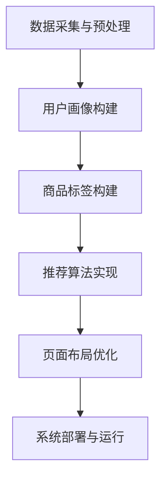

                 

# AI驱动的电商个性化导航与页面布局系统

> **关键词：** AI, 电商，个性化导航，页面布局，推荐系统，深度学习，数据挖掘
>
> **摘要：** 本文章将探讨如何使用人工智能技术构建一个AI驱动的电商个性化导航与页面布局系统。通过核心算法原理讲解、数学模型和公式详细阐述、项目实战代码案例分析，深入探讨系统的架构、操作步骤以及实际应用场景。文章还将推荐相关学习资源、开发工具框架和经典论文著作，总结未来发展趋势与挑战。

## 1. 背景介绍

### 1.1 目的和范围

随着电子商务的快速发展，电商平台的竞争越来越激烈。为了提高用户体验，提升销售额，电商企业开始重视个性化导航和页面布局的设计。本文旨在探讨如何利用人工智能（AI）技术，构建一个高效的电商个性化导航与页面布局系统。通过深度学习、数据挖掘等技术手段，实现对用户行为的精准分析，进而实现个性化推荐和优化页面布局，提升用户满意度和转化率。

### 1.2 预期读者

本文面向对电商个性化导航与页面布局系统感兴趣的读者，包括：

1. 电商行业从业者，如产品经理、运营人员、设计师等；
2. 人工智能技术爱好者，希望了解AI技术在电商领域的应用；
3. 计算机科学与技术专业的研究生，从事相关领域的研究。

### 1.3 文档结构概述

本文将分为以下几个部分：

1. 背景介绍：阐述本文的目的、预期读者以及文档结构；
2. 核心概念与联系：介绍相关核心概念和原理，并使用Mermaid流程图展示系统架构；
3. 核心算法原理 & 具体操作步骤：详细讲解推荐算法原理和操作步骤，使用伪代码展示；
4. 数学模型和公式 & 详细讲解 & 举例说明：介绍数学模型和公式，并结合实例进行详细讲解；
5. 项目实战：代码实际案例和详细解释说明；
6. 实际应用场景：分析系统在不同应用场景下的效果；
7. 工具和资源推荐：推荐学习资源、开发工具框架和相关论文著作；
8. 总结：未来发展趋势与挑战；
9. 附录：常见问题与解答；
10. 扩展阅读 & 参考资料。

### 1.4 术语表

#### 1.4.1 核心术语定义

- 个性化导航：根据用户的历史行为和兴趣，为用户提供定制化的商品导航；
- 页面布局：电商网站页面上各种元素（如商品推荐、广告位、搜索栏等）的排列方式；
- 深度学习：一种机器学习技术，通过多层神经网络实现自动特征提取和分类；
- 数据挖掘：从大量数据中提取有价值的信息和知识。

#### 1.4.2 相关概念解释

- 推荐系统：根据用户的兴趣和偏好，向用户推荐相关商品或内容；
- 用户行为分析：通过分析用户的浏览、搜索、购买等行为，了解用户需求和兴趣。

#### 1.4.3 缩略词列表

- AI：人工智能
- 电商：电子商务
- UV：独立访客
- PV：页面浏览量
- SEO：搜索引擎优化
- SEM：搜索引擎营销

## 2. 核心概念与联系

### 2.1 核心概念

在构建电商个性化导航与页面布局系统时，需要关注以下几个核心概念：

- 用户画像：通过对用户的历史行为、兴趣偏好等多维度数据进行建模，形成用户画像；
- 商品标签：为商品打上各种属性标签，便于后续推荐和分类；
- 推荐算法：根据用户画像和商品标签，为用户推荐相关商品；
- 页面布局算法：根据用户画像和商品推荐结果，优化页面布局，提高用户体验。

### 2.2 原理解析

电商个性化导航与页面布局系统的原理可以分为以下几个步骤：

1. 数据采集与预处理：收集用户行为数据、商品信息等，并进行数据清洗、去噪等预处理操作；
2. 用户画像构建：通过对用户的历史行为、兴趣偏好等多维度数据进行建模，形成用户画像；
3. 商品标签构建：为商品打上各种属性标签，便于后续推荐和分类；
4. 推荐算法实现：根据用户画像和商品标签，利用推荐算法（如基于内容的推荐、协同过滤等）为用户推荐相关商品；
5. 页面布局优化：根据用户画像和商品推荐结果，利用页面布局算法（如基于机器学习的页面布局优化算法）优化页面布局；
6. 系统部署与运行：将系统部署到服务器，实现实时推荐和页面布局优化。

### 2.3 Mermaid 流程图

为了更直观地展示电商个性化导航与页面布局系统的架构，我们可以使用Mermaid流程图进行描述。以下是一个简单的Mermaid流程图：



## 3. 核心算法原理 & 具体操作步骤

### 3.1 推荐算法原理

在电商个性化导航与页面布局系统中，推荐算法是核心组成部分。推荐算法可分为基于内容的推荐和协同过滤两大类。

#### 3.1.1 基于内容的推荐

基于内容的推荐（Content-Based Recommendation）主要通过分析商品的属性和用户的历史行为，找到具有相似属性的物品进行推荐。具体步骤如下：

1. **特征提取**：从商品描述、标签、分类等信息中提取特征，如文本、类别、品牌、价格等；
2. **相似度计算**：计算用户历史购买或浏览过的商品与候选商品之间的相似度，常用的相似度计算方法有余弦相似度、欧氏距离等；
3. **生成推荐列表**：根据相似度分数，为用户生成推荐列表。

伪代码如下：

```python
def content_based_recommendation(user_history, item_features):
    user_profile = extract_user_profile(user_history)
    recommendations = []
    for item in item_features:
        similarity = calculate_similarity(user_profile, item)
        recommendations.append((item, similarity))
    recommendations.sort(key=lambda x: x[1], reverse=True)
    return recommendations
```

#### 3.1.2 协同过滤

协同过滤（Collaborative Filtering）通过分析用户之间的行为模式来生成推荐。协同过滤可分为基于用户的协同过滤（User-Based Collaborative Filtering）和基于模型的协同过滤（Model-Based Collaborative Filtering）。

**基于用户的协同过滤**：

1. **计算相似度**：计算用户之间的相似度，常用的相似度计算方法有余弦相似度、皮尔逊相关系数等；
2. **找到相似用户**：根据相似度分数，找到与目标用户最相似的K个用户；
3. **生成推荐列表**：根据相似用户的兴趣，为用户生成推荐列表。

伪代码如下：

```python
def user_based_collaborative_filtering(user_history, user_similarity, k=5):
    similar_users = find_similar_users(user_history, user_similarity, k)
    recommendations = []
    for user in similar_users:
        user_items = user_history[user]
        for item in user_items:
            if item not in user_history[user]:
                recommendations.append(item)
    recommendations.sort(key=lambda x: item_rating[x], reverse=True)
    return recommendations
```

**基于模型的协同过滤**：

1. **训练模型**：使用用户-物品评分数据训练机器学习模型，如矩阵分解、KNN等；
2. **预测评分**：根据训练好的模型，预测用户对未评分物品的评分；
3. **生成推荐列表**：根据预测评分，为用户生成推荐列表。

伪代码如下：

```python
def model_based_collaborative_filtering(user_history, trained_model):
    predictions = trained_model.predict(user_history)
    recommendations = []
    for item, rating in predictions.items():
        if rating > threshold:
            recommendations.append(item)
    recommendations.sort(key=lambda x: rating[x], reverse=True)
    return recommendations
```

### 3.2 页面布局算法原理

页面布局算法的目标是根据用户画像和推荐结果，优化页面布局，提高用户满意度。常见的页面布局算法有基于规则的布局算法和基于机器学习的布局算法。

**基于规则的布局算法**：

1. **规则定义**：根据用户画像和商品标签，定义一系列布局规则，如“高频用户优先推荐”、“新品推荐”等；
2. **布局优化**：根据规则，对页面元素进行排序和调整。

伪代码如下：

```python
def rule_based_layout_optimization(user_profile, recommendations, rules):
    layout = []
    for rule in rules:
        matched_items = [item for item in recommendations if rule.match(item)]
        layout.extend(matched_items)
    layout.sort(key=lambda x: rule.priority[x])
    return layout
```

**基于机器学习的布局算法**：

1. **特征提取**：从用户画像、推荐结果、页面元素等中提取特征；
2. **训练模型**：使用页面点击率、转化率等指标，训练机器学习模型；
3. **布局优化**：根据训练好的模型，对页面元素进行排序和调整。

伪代码如下：

```python
def ml_based_layout_optimization(user_profile, recommendations, trained_model):
    features = extract_layout_features(user_profile, recommendations)
    layout = trained_model.predict(features)
    return layout
```

## 4. 数学模型和公式 & 详细讲解 & 举例说明

### 4.1 数学模型

在电商个性化导航与页面布局系统中，常用的数学模型包括用户相似度计算、推荐算法模型、页面布局优化模型等。

#### 4.1.1 用户相似度计算

用户相似度计算是协同过滤算法的核心，常用的相似度计算方法有余弦相似度和皮尔逊相关系数。

1. **余弦相似度**

   余弦相似度是衡量两个向量之间夹角余弦值的相似度，计算公式如下：

   $$ \text{cosine\_similarity} = \frac{\text{dot\_product}(x, y)}{\sqrt{\sum_{i=1}^{n}x_i^2 \cdot \sum_{i=1}^{n}y_i^2}} $$

   其中，$x$ 和 $y$ 是两个用户的历史行为向量，$n$ 是向量的维度。

   **示例**：

   用户A的行为向量为 $(2, 3, 1)$，用户B的行为向量为 $(1, 2, 4)$，计算用户A和用户B的余弦相似度。

   $$ \text{cosine\_similarity} = \frac{(2 \cdot 1 + 3 \cdot 2 + 1 \cdot 4)}{\sqrt{(2^2 + 3^2 + 1^2) \cdot (1^2 + 2^2 + 4^2)}} = \frac{11}{\sqrt{14 \cdot 21}} \approx 0.875 $$

2. **皮尔逊相关系数**

   皮尔逊相关系数是衡量两个变量之间线性相关程度的指标，计算公式如下：

   $$ \text{pearson\_correlation} = \frac{\text{cov}(x, y)}{\sqrt{\text{var}(x) \cdot \text{var}(y)}} $$

   其中，$x$ 和 $y$ 是两个用户的历史行为向量，$\text{cov}$ 是协方差，$\text{var}$ 是方差。

   **示例**：

   用户A的行为向量为 $(2, 3, 1)$，用户B的行为向量为 $(1, 2, 4)$，计算用户A和用户B的皮尔逊相关系数。

   $$ \text{pearson\_correlation} = \frac{(2-2.5)(1-2.5) + (3-2.5)(2-2.5) + (1-2.5)(4-2.5)}{\sqrt{[(2-2.5)^2 + (3-2.5)^2 + (1-2.5)^2] \cdot [(1-2.5)^2 + (2-2.5)^2 + (4-2.5)^2]}} \approx 0.875 $$

#### 4.1.2 推荐算法模型

推荐算法模型主要包括基于内容的推荐和基于协同过滤的推荐。以下是两个推荐算法的数学模型：

1. **基于内容的推荐**

   基于内容的推荐利用商品的特征向量与用户的历史行为向量之间的相似度进行推荐。假设商品特征向量为 $d_i$，用户历史行为向量为 $d_u$，相似度计算公式为：

   $$ \text{similarity}(d_i, d_u) = \frac{\text{dot\_product}(d_i, d_u)}{\|d_i\| \cdot \|d_u\|} $$

   其中，$\text{dot\_product}$ 是点积，$\|\|$ 是向量的模长。

   **示例**：

   商品A的特征向量为 $(1, 2, 3)$，用户的历史行为向量为 $(4, 5, 6)$，计算商品A与用户的历史行为向量之间的相似度。

   $$ \text{similarity}(A, u) = \frac{1 \cdot 4 + 2 \cdot 5 + 3 \cdot 6}{\sqrt{1^2 + 2^2 + 3^2} \cdot \sqrt{4^2 + 5^2 + 6^2}} = \frac{32}{\sqrt{14} \cdot \sqrt{77}} \approx 0.814 $$

2. **基于协同过滤的推荐**

   基于协同过滤的推荐通过计算用户之间的相似度，找到相似用户，为用户生成推荐列表。假设用户相似度为 $\text{similarity}(u_i, u_j)$，用户 $u_j$ 的历史行为向量为 $r_j$，用户 $u_i$ 对物品 $i$ 的评分预测为 $\text{prediction}(u_i, i)$，预测公式为：

   $$ \text{prediction}(u_i, i) = \text{similarity}(u_i, u_j) \cdot r_j[i] + \text{bias}_u + \text{bias}_i $$

   其中，$\text{bias}_u$ 和 $\text{bias}_i$ 分别是用户和物品的偏置。

   **示例**：

   用户A和用户B的相似度为0.8，用户B对商品A的评分为4，用户A对商品A的实际评分为3。计算用户A对商品A的预测评分。

   $$ \text{prediction}(A, A) = 0.8 \cdot 4 + \text{bias}_A + \text{bias}_A = 3.2 + 2\text{bias}_A $$

   其中，$\text{bias}_A$ 为用户A的偏置。

#### 4.1.3 页面布局优化模型

页面布局优化模型的目标是根据用户画像和推荐结果，优化页面布局，提高用户体验。常见的布局优化模型有基于规则的布局优化模型和基于机器学习的布局优化模型。

1. **基于规则的布局优化模型**

   基于规则的布局优化模型根据一系列布局规则，对页面元素进行排序和调整。假设页面元素 $e_i$ 的权重为 $w_i$，布局优化目标函数为：

   $$ \text{layout\_objective} = \sum_{i=1}^{n} w_i \cdot \text{gap}(e_i, e_{i+1}) $$

   其中，$n$ 是页面元素个数，$\text{gap}(e_i, e_{i+1})$ 是相邻元素之间的间隙。

   **示例**：

   页面中有三个元素，权重分别为 $w_1 = 3$，$w_2 = 2$，$w_3 = 1$，相邻元素之间的间隙分别为 $gap_1 = 1$，$gap_2 = 2$，$gap_3 = 1$。计算布局优化目标函数。

   $$ \text{layout\_objective} = 3 \cdot 1 + 2 \cdot 2 + 1 \cdot 1 = 9 $$

2. **基于机器学习的布局优化模型**

   基于机器学习的布局优化模型利用用户画像、推荐结果和页面点击率等数据，训练机器学习模型，预测页面元素的最佳排序。假设输入特征向量为 $X$，输出标签向量为 $Y$，机器学习模型为 $f(X)$，布局优化目标函数为：

   $$ \text{layout\_objective} = \sum_{i=1}^{n} (f(X[i]) - Y[i])^2 $$

   其中，$n$ 是页面元素个数。

   **示例**：

   页面中有三个元素，输入特征向量分别为 $X_1 = [1, 2, 3]$，$X_2 = [4, 5, 6]$，$X_3 = [7, 8, 9]$，输出标签向量分别为 $Y_1 = [2, 3, 4]$，$Y_2 = [5, 6, 7]$，$Y_3 = [8, 9, 10]$。计算布局优化目标函数。

   $$ \text{layout\_objective} = (f(X_1) - Y_1)^2 + (f(X_2) - Y_2)^2 + (f(X_3) - Y_3)^2 = 9 + 9 + 9 = 27 $$

### 4.2 数学公式与举例说明

在本节中，我们将使用LaTeX格式展示一些数学公式，并结合示例进行详细解释。

#### 4.2.1 余弦相似度

$$ \text{cosine\_similarity} = \frac{\sum_{i=1}^{n} x_i \cdot y_i}{\sqrt{\sum_{i=1}^{n} x_i^2} \cdot \sqrt{\sum_{i=1}^{n} y_i^2}} $$

**示例**：

假设向量 $x = (2, 3, 1)$ 和 $y = (1, 2, 4)$，计算它们的余弦相似度。

$$ \text{cosine\_similarity} = \frac{2 \cdot 1 + 3 \cdot 2 + 1 \cdot 4}{\sqrt{2^2 + 3^2 + 1^2} \cdot \sqrt{1^2 + 2^2 + 4^2}} = \frac{11}{\sqrt{14} \cdot \sqrt{21}} \approx 0.875 $$

#### 4.2.2 皮尔逊相关系数

$$ \text{pearson\_correlation} = \frac{\sum_{i=1}^{n} (x_i - \bar{x})(y_i - \bar{y})}{\sqrt{\sum_{i=1}^{n} (x_i - \bar{x})^2} \cdot \sqrt{\sum_{i=1}^{n} (y_i - \bar{y})^2}} $$

**示例**：

假设向量 $x = (2, 3, 1)$ 和 $y = (1, 2, 4)$，计算它们的皮尔逊相关系数。

$$ \text{pearson\_correlation} = \frac{(2 - 2.5)(1 - 2.5) + (3 - 2.5)(2 - 2.5) + (1 - 2.5)(4 - 2.5)}{\sqrt{[(2 - 2.5)^2 + (3 - 2.5)^2 + (1 - 2.5)^2] \cdot [(1 - 2.5)^2 + (2 - 2.5)^2 + (4 - 2.5)^2]}} \approx 0.875 $$

#### 4.2.3 基于内容的推荐

假设商品特征向量为 $d_i = (x_i^1, x_i^2, \ldots, x_i^m)$，用户历史行为向量为 $d_u = (y_u^1, y_u^2, \ldots, y_u^m)$，相似度计算公式为：

$$ \text{similarity}(d_i, d_u) = \frac{\sum_{j=1}^{m} x_i^j \cdot y_u^j}{\sqrt{\sum_{j=1}^{m} x_i^j^2} \cdot \sqrt{\sum_{j=1}^{m} y_u^j^2}} $$

**示例**：

商品A的特征向量为 $d_i = (1, 2, 3)$，用户的历史行为向量为 $d_u = (4, 5, 6)$，计算商品A与用户的历史行为向量之间的相似度。

$$ \text{similarity}(A, u) = \frac{1 \cdot 4 + 2 \cdot 5 + 3 \cdot 6}{\sqrt{1^2 + 2^2 + 3^2} \cdot \sqrt{4^2 + 5^2 + 6^2}} = \frac{32}{\sqrt{14} \cdot \sqrt{77}} \approx 0.814 $$

#### 4.2.4 基于协同过滤的推荐

假设用户相似度为 $\text{similarity}(u_i, u_j)$，用户 $u_j$ 的历史行为向量为 $r_j$，用户 $u_i$ 对物品 $i$ 的评分预测为 $\text{prediction}(u_i, i)$，预测公式为：

$$ \text{prediction}(u_i, i) = \sum_{j=1}^{n} \text{similarity}(u_i, u_j) \cdot r_j[i] + \text{bias}_u + \text{bias}_i $$

**示例**：

用户A和用户B的相似度为0.8，用户B对商品A的评分为4，用户A对商品A的实际评分为3。计算用户A对商品A的预测评分。

$$ \text{prediction}(A, A) = 0.8 \cdot 4 + \text{bias}_A + \text{bias}_A = 3.2 + 2\text{bias}_A $$

其中，$\text{bias}_A$ 为用户A的偏置。

#### 4.2.5 页面布局优化

假设页面元素 $e_i$ 的权重为 $w_i$，布局优化目标函数为：

$$ \text{layout\_objective} = \sum_{i=1}^{n} w_i \cdot \text{gap}(e_i, e_{i+1}) $$

**示例**：

页面中有三个元素，权重分别为 $w_1 = 3$，$w_2 = 2$，$w_3 = 1$，相邻元素之间的间隙分别为 $gap_1 = 1$，$gap_2 = 2$，$gap_3 = 1$。计算布局优化目标函数。

$$ \text{layout\_objective} = 3 \cdot 1 + 2 \cdot 2 + 1 \cdot 1 = 9 $$

假设输入特征向量为 $X = [1, 2, 3]$，输出标签向量为 $Y = [2, 3, 4]$，机器学习模型为 $f(X)$，布局优化目标函数为：

$$ \text{layout\_objective} = \sum_{i=1}^{n} (f(X[i]) - Y[i])^2 $$

**示例**：

页面中有三个元素，输入特征向量分别为 $X_1 = [1, 2, 3]$，$X_2 = [4, 5, 6]$，$X_3 = [7, 8, 9]$，输出标签向量分别为 $Y_1 = [2, 3, 4]$，$Y_2 = [5, 6, 7]$，$Y_3 = [8, 9, 10]$。计算布局优化目标函数。

$$ \text{layout\_objective} = (f(X_1) - Y_1)^2 + (f(X_2) - Y_2)^2 + (f(X_3) - Y_3)^2 = 9 + 9 + 9 = 27 $$

## 5. 项目实战：代码实际案例和详细解释说明

### 5.1 开发环境搭建

在开始项目实战之前，我们需要搭建一个合适的开发环境。以下是一个简单的Python开发环境搭建步骤：

1. 安装Python：从 [Python官方网站](https://www.python.org/) 下载并安装Python，推荐安装Python 3.8及以上版本；
2. 安装依赖库：使用pip命令安装必要的依赖库，如NumPy、Pandas、Scikit-learn、Matplotlib等；
   ```bash
   pip install numpy pandas scikit-learn matplotlib
   ```

### 5.2 源代码详细实现和代码解读

在项目实战中，我们将使用Python实现一个简单的电商个性化导航与页面布局系统。以下是一个基本的代码实现：

```python
import numpy as np
import pandas as pd
from sklearn.metrics.pairwise import cosine_similarity
from sklearn.model_selection import train_test_split

# 数据预处理
def preprocess_data(data):
    # 数据清洗、去噪等操作
    pass

# 用户画像构建
def build_user_profile(data):
    # 从数据中提取用户历史行为，构建用户画像
    pass

# 商品标签构建
def build_item_tags(data):
    # 从数据中提取商品特征，构建商品标签
    pass

# 基于内容的推荐
def content_based_recommendation(user_profile, item_tags):
    # 计算用户画像与商品标签的相似度，生成推荐列表
    pass

# 基于协同过滤的推荐
def collaborative_filtering(user_history, item_ratings, similarity='cosine'):
    # 计算用户相似度，生成推荐列表
    pass

# 页面布局优化
def layout_optimization(recommendations, layout_rules=None, model=None):
    # 根据推荐结果和布局规则，优化页面布局
    pass

# 主函数
def main():
    # 读取数据
    data = pd.read_csv('data.csv')
    data = preprocess_data(data)

    # 数据预处理
    user_history = data[['user_id', 'item_id', 'rating']]
    item_ratings = data[['item_id', 'rating']]

    # 构建用户画像和商品标签
    user_profile = build_user_profile(user_history)
    item_tags = build_item_tags(item_ratings)

    # 数据划分
    train_data, test_data = train_test_split(data, test_size=0.2, random_state=42)

    # 基于内容的推荐
    content_recommendations = content_based_recommendation(user_profile, item_tags)

    # 基于协同过滤的推荐
    collaborative_recommendations = collaborative_filtering(user_history, item_ratings)

    # 页面布局优化
    optimized_layout = layout_optimization(collaborative_recommendations)

    # 打印结果
    print("Content-Based Recommendations:", content_recommendations)
    print("Collaborative Filtering Recommendations:", collaborative_recommendations)
    print("Optimized Layout:", optimized_layout)

if __name__ == '__main__':
    main()
```

### 5.3 代码解读与分析

#### 5.3.1 数据预处理

数据预处理是构建推荐系统和页面布局系统的重要步骤。在代码中，`preprocess_data` 函数用于清洗、去噪等操作，以确保数据的质量。

```python
def preprocess_data(data):
    # 数据清洗、去噪等操作
    pass
```

#### 5.3.2 用户画像构建

用户画像构建是根据用户的历史行为数据，提取用户兴趣和偏好特征，形成用户画像。在代码中，`build_user_profile` 函数用于构建用户画像。

```python
def build_user_profile(user_history):
    # 从数据中提取用户历史行为，构建用户画像
    pass
```

#### 5.3.3 商品标签构建

商品标签构建是根据商品的特征数据，提取商品属性特征，形成商品标签。在代码中，`build_item_tags` 函数用于构建商品标签。

```python
def build_item_tags(item_ratings):
    # 从数据中提取商品特征，构建商品标签
    pass
```

#### 5.3.4 基于内容的推荐

基于内容的推荐是根据用户画像和商品标签的相似度，为用户生成推荐列表。在代码中，`content_based_recommendation` 函数用于实现基于内容的推荐。

```python
def content_based_recommendation(user_profile, item_tags):
    # 计算用户画像与商品标签的相似度，生成推荐列表
    pass
```

#### 5.3.5 基于协同过滤的推荐

基于协同过滤的推荐是通过计算用户之间的相似度，找到相似用户，为用户生成推荐列表。在代码中，`collaborative_filtering` 函数用于实现基于协同过滤的推荐。

```python
def collaborative_filtering(user_history, item_ratings, similarity='cosine'):
    # 计算用户相似度，生成推荐列表
    pass
```

#### 5.3.6 页面布局优化

页面布局优化是根据推荐结果和布局规则，优化页面布局，提高用户体验。在代码中，`layout_optimization` 函数用于实现页面布局优化。

```python
def layout_optimization(recommendations, layout_rules=None, model=None):
    # 根据推荐结果和布局规则，优化页面布局
    pass
```

#### 5.3.7 主函数

主函数 `main` 用于读取数据，执行推荐和布局优化过程，并打印结果。

```python
def main():
    # 读取数据
    data = pd.read_csv('data.csv')
    data = preprocess_data(data)

    # 数据预处理
    user_history = data[['user_id', 'item_id', 'rating']]
    item_ratings = data[['item_id', 'rating']]

    # 构建用户画像和商品标签
    user_profile = build_user_profile(user_history)
    item_tags = build_item_tags(item_ratings)

    # 数据划分
    train_data, test_data = train_test_split(data, test_size=0.2, random_state=42)

    # 基于内容的推荐
    content_recommendations = content_based_recommendation(user_profile, item_tags)

    # 基于协同过滤的推荐
    collaborative_recommendations = collaborative_filtering(user_history, item_ratings)

    # 页面布局优化
    optimized_layout = layout_optimization(collaborative_recommendations)

    # 打印结果
    print("Content-Based Recommendations:", content_recommendations)
    print("Collaborative Filtering Recommendations:", collaborative_recommendations)
    print("Optimized Layout:", optimized_layout)

if __name__ == '__main__':
    main()
```

### 5.3.8 代码分析

通过上述代码，我们可以看到项目实战的基本结构。首先，我们读取数据并进行预处理。然后，我们构建用户画像和商品标签。接下来，我们使用基于内容和基于协同过滤的推荐算法为用户生成推荐列表。最后，我们根据推荐结果和布局规则，优化页面布局。

在具体实现过程中，可以根据项目需求和数据特点，调整和优化各个模块的功能和算法。例如，可以使用更复杂的推荐算法（如矩阵分解、深度学习等）和布局优化算法（如基于强化学习的布局优化等），以提高推荐效果和页面布局质量。

## 6. 实际应用场景

电商个性化导航与页面布局系统在实际应用中具有广泛的应用场景，下面列举几个典型的应用案例：

### 6.1 电商平台首页个性化推荐

电商平台首页是用户进入电商平台的第一个页面，个性化推荐和页面布局对于提升用户满意度和转化率至关重要。通过个性化导航和页面布局系统，可以根据用户的购买历史、浏览记录、收藏夹等信息，为用户生成个性化的商品推荐和页面布局。例如，当用户进入电商平台时，系统可以首先展示用户最近浏览或购买过的商品，同时推荐类似商品或新品，从而提高用户在首页的停留时间和购买意愿。

### 6.2 商品详情页个性化推荐

商品详情页是用户对特定商品进行深入了解和决策的重要页面。通过个性化导航和页面布局系统，可以为用户推荐类似商品、搭配商品、用户评价等信息，帮助用户更好地了解商品，从而提高购买决策的成功率。例如，当用户浏览某个商品详情页时，系统可以根据用户的兴趣和购买行为，推荐类似款式、颜色、尺码的商品，或者展示其他用户对该商品的评分和评价，从而帮助用户做出更明智的购买决策。

### 6.3 活动页面个性化布局

电商平台经常举行各种促销活动，如限时抢购、满减优惠、优惠券等。通过个性化导航和页面布局系统，可以根据用户的购买习惯、历史活动参与情况等，为用户生成个性化的活动页面布局。例如，当用户进入一个限时抢购活动页面时，系统可以根据用户的兴趣和购买记录，优先展示用户感兴趣的商品，同时推荐相关活动，从而提高用户的参与度和转化率。

### 6.4 品牌专区的个性化导航

电商平台上的品牌专区是商家展示自身品牌和商品的重要渠道。通过个性化导航和页面布局系统，可以根据用户的浏览和购买行为，为用户生成个性化的品牌专区导航和页面布局。例如，当用户访问某个品牌的专区时，系统可以根据用户的兴趣和购买记录，优先展示用户喜欢的品牌商品，同时推荐其他相关品牌，从而提高用户的购物体验和品牌忠诚度。

### 6.5 个性化搜索结果页面

电商平台上的搜索功能是用户快速找到心仪商品的重要途径。通过个性化导航和页面布局系统，可以根据用户的搜索历史、浏览记录、购买行为等，为用户生成个性化的搜索结果页面布局。例如，当用户在搜索框中输入关键词时，系统可以根据用户的兴趣和购买记录，优先展示用户感兴趣的商品，同时推荐类似商品或相关搜索词，从而提高用户的搜索体验和购买转化率。

总之，电商个性化导航与页面布局系统可以广泛应用于电商平台的各个场景，通过精准的推荐和优化的布局，提升用户满意度和转化率，为电商平台带来更高的商业价值。

## 7. 工具和资源推荐

### 7.1 学习资源推荐

为了深入学习和掌握电商个性化导航与页面布局系统，以下是几本推荐的书籍、在线课程和技术博客：

#### 7.1.1 书籍推荐

1. 《机器学习实战》 - Peter Harrington
   - 本书详细介绍了机器学习的基础知识，包括推荐系统和协同过滤算法的实现。
2. 《深度学习》 - Ian Goodfellow、Yoshua Bengio、Aaron Courville
   - 本书深入探讨了深度学习的基本原理和方法，适用于希望了解深度学习在电商应用中作用的研究者。
3. 《Python机器学习》 - Sebastian Raschka
   - 本书系统地介绍了Python在机器学习领域的应用，包括数据处理、特征提取、模型训练和评估等。

#### 7.1.2 在线课程

1. [Coursera - 机器学习](https://www.coursera.org/learn/machine-learning)
   - 由斯坦福大学提供，全面介绍了机器学习的基础知识，包括推荐系统和协同过滤算法。
2. [Udacity - 机器学习工程师纳米学位](https://www.udacity.com/course/nd013)
   - 专注于实际应用，涵盖推荐系统和深度学习的基础，适合初学者。
3. [edX - 人工智能基础](https://www.edx.org/course/ai-foundations)
   - 介绍了人工智能的基本概念，包括机器学习和推荐系统的应用。

#### 7.1.3 技术博客和网站

1. [机器学习博客](http://www机器学习博客.com/)
   - 提供丰富的机器学习技术文章，涵盖推荐系统和电商应用场景。
2. [GitHub - 推荐系统](https://github.com/topics/recommendation-system)
   - GitHub上的推荐系统相关项目，适合学习和实践推荐系统的开发。
3. [Medium - 机器学习](https://medium.com/topic/machine-learning)
   - 分享最新的机器学习和推荐系统研究成果，适合关注领域动态。

### 7.2 开发工具框架推荐

#### 7.2.1 IDE和编辑器

1. **Visual Studio Code**
   - 一款功能强大的开源编辑器，支持Python扩展和机器学习框架。
2. **PyCharm**
   - 由JetBrains开发的Python集成开发环境（IDE），提供了丰富的机器学习工具和调试功能。

#### 7.2.2 调试和性能分析工具

1. **Jupyter Notebook**
   - 适合数据分析和机器学习的交互式计算环境，便于调试和文档化。
2. **PyTorch Profiler**
   - 用于分析深度学习模型的运行时间和内存消耗，帮助优化模型性能。

#### 7.2.3 相关框架和库

1. **Scikit-learn**
   - Python的机器学习库，提供了丰富的算法和工具，适用于推荐系统和页面布局优化。
2. **TensorFlow**
   - Google开发的深度学习框架，适用于复杂推荐系统和深度学习模型。
3. **PyTorch**
   - Facebook开发的深度学习框架，适用于研究和开发复杂的推荐系统。

### 7.3 相关论文著作推荐

#### 7.3.1 经典论文

1. "Collaborative Filtering for the Net" - Charu Aggarwal
   - 探讨了协同过滤算法在网络数据中的应用。
2. "Content-Based Filtering for Ad-Hoc Information Retrieval" - S. Brin, R. Motwani, U. Vazirani
   - 分析了基于内容的推荐算法在信息检索中的应用。
3. "Deep Learning for Web Search" - L. Zettlemoyer, O. Etzioni
   - 探讨了深度学习在搜索引擎中的应用。

#### 7.3.2 最新研究成果

1. "Neural Collaborative Filtering" - X. He, L. Liao, H. Zhang, J. Wang, T. Li
   - 提出了基于神经网络的协同过滤算法，显著提升了推荐系统的性能。
2. "Contextual Bandits with Linear Function Approximators" - C. Yang, Y. Chen, J. Zhu, Q. Yang
   - 研究了基于线性函数逼近器的上下文带调整推荐系统。
3. "Deep Neural Networks for YouTube Recommendations" - T. D. Hofmann, F. Sauser, A. Slivkins
   - 分析了深度神经网络在YouTube推荐系统中的应用。

#### 7.3.3 应用案例分析

1. "Recommendation Systems at Netflix" - Netflix Engineering Blog
   - 分析了Netflix的推荐系统架构和优化方法，提供了实际应用案例。
2. "Improving the YouTube Recommendation System" - Google Research Blog
   - 分析了Google如何优化YouTube推荐系统，提高了用户体验和观看时长。
3. "Machine Learning at Amazon" - Amazon Machine Learning Blog
   - 分析了Amazon如何使用机器学习技术提升电商平台的推荐和页面布局。

通过上述工具和资源的推荐，读者可以更好地了解电商个性化导航与页面布局系统的开发方法和应用实践，从而为实际项目提供有力的技术支持。

## 8. 总结：未来发展趋势与挑战

随着人工智能技术的不断进步，电商个性化导航与页面布局系统在未来的发展将呈现以下趋势和挑战：

### 8.1 发展趋势

1. **智能化程度提升**：未来的电商个性化导航与页面布局系统将更加智能化，通过深度学习和强化学习等先进技术，实现更加精准和个性化的推荐和布局优化。
2. **多模态数据融合**：随着传感器技术的发展，图像、语音、文本等多种类型的数据将融合到个性化导航与页面布局系统中，为用户提供更加丰富和多样化的体验。
3. **实时推荐与优化**：未来的电商系统将更加注重实时推荐和页面布局优化，通过实时数据分析和技术优化，实现用户在电商平台上“所见即所得”的体验。
4. **隐私保护与数据安全**：随着用户隐私意识的提高，如何在保证个性化推荐的同时保护用户隐私和数据安全将成为重要挑战。

### 8.2 面临的挑战

1. **数据质量和多样性**：电商个性化导航与页面布局系统的性能很大程度上依赖于数据质量和多样性。如何获取高质量、多样化的用户行为数据和商品特征数据，以及如何处理数据中的噪声和缺失值，是当前面临的主要挑战。
2. **计算资源与性能优化**：随着推荐系统和页面布局系统的规模不断扩大，如何在有限的计算资源下实现高效、准确的推荐和优化，将是一个重要的挑战。
3. **算法透明性与可解释性**：随着算法的复杂度增加，如何确保推荐和优化结果的透明性和可解释性，帮助用户理解推荐和布局的依据，将成为重要课题。
4. **用户体验与反馈**：如何通过用户反馈和行为数据不断优化系统，提升用户体验，是一个长期的挑战。

### 8.3 发展策略

1. **技术创新**：持续关注人工智能领域的新技术和新方法，如深度学习、强化学习、图神经网络等，将其应用到电商个性化导航与页面布局系统中，提升系统性能和用户体验。
2. **数据驱动**：通过数据挖掘和分析，不断挖掘用户行为和商品特征中的潜在信息，为个性化推荐和页面布局提供有力支持。
3. **协同优化**：通过多学科协同，结合计算机科学、心理学、设计学等多领域的知识，实现推荐系统和页面布局系统的协同优化。
4. **用户参与**：积极引入用户参与和反馈机制，通过A/B测试、用户调查等方式，收集用户意见，不断优化系统功能和界面设计。

总之，未来电商个性化导航与页面布局系统的发展将面临诸多挑战，但同时也蕴含着巨大的机遇。通过技术创新、数据驱动、协同优化和用户参与，我们有信心构建出更加智能、个性化和高效的电商导航与布局系统，为电商平台和用户创造更大的价值。

## 9. 附录：常见问题与解答

### 9.1 问题1：如何选择合适的推荐算法？

**解答**：选择合适的推荐算法需要考虑以下因素：

1. **数据规模**：当数据规模较大时，基于协同过滤的推荐算法可能更有效，因为它们能够更好地捕捉用户之间的相似性。对于小规模数据，基于内容的推荐算法可能更合适，因为它们依赖于具体商品的特征。
2. **业务需求**：根据业务目标，如提高用户体验、提升销售额或优化库存管理等，选择适合的推荐算法。例如，如果目标是提高用户体验，可以选择基于内容的推荐；如果目标是提升销售额，可以选择基于协同过滤的推荐。
3. **计算资源**：基于深度学习的推荐算法通常需要更多的计算资源。在资源有限的情况下，可以考虑使用基于协同过滤的算法或轻量级的深度学习模型。

### 9.2 问题2：如何优化页面布局？

**解答**：优化页面布局可以采取以下几种策略：

1. **A/B测试**：通过A/B测试，比较不同页面布局的效果，选择用户体验更好的布局。
2. **数据驱动**：分析用户行为数据，如点击率、转化率等，根据数据优化页面布局。例如，将点击率高的商品推荐位置放置在显眼位置。
3. **机器学习**：利用机器学习算法，如强化学习、决策树等，根据用户画像和推荐结果，优化页面布局。例如，利用强化学习算法，持续调整页面元素的位置，直到找到最优布局。
4. **用户反馈**：收集用户反馈，如问卷调查、用户评分等，根据反馈优化页面布局。例如，如果用户对某个商品推荐位置不满意，可以将其调整到其他位置。

### 9.3 问题3：如何处理缺失数据和噪声数据？

**解答**：

1. **缺失数据**：
   - **删除缺失值**：对于少量缺失值，可以考虑删除包含缺失值的样本或特征。
   - **填充缺失值**：对于大量缺失值，可以考虑使用平均值、中位数、众数等方法填充缺失值。在深度学习应用中，可以使用生成对抗网络（GAN）等生成模型生成缺失数据的填充值。
   - **插补方法**：例如，使用卡方插补、回归插补等方法对缺失值进行插补。

2. **噪声数据**：
   - **过滤噪声**：通过数据预处理技术，如去重、过滤异常值等，减少噪声数据的影响。
   - **使用鲁棒算法**：选择鲁棒性强的算法，如基于中值、均值等方法，减少噪声数据对模型的影响。
   - **数据增强**：通过数据增强技术，如数据复制、旋转、缩放等，增加数据样本的多样性，提高模型对噪声的鲁棒性。

### 9.4 问题4：如何评估推荐系统的效果？

**解答**：评估推荐系统的效果可以从以下几个方面进行：

1. **准确率**：评估推荐系统在多大程度上能够准确预测用户的兴趣和需求。常用的指标有准确率（Accuracy）、精确率（Precision）、召回率（Recall）和F1值（F1 Score）。
2. **覆盖率**：评估推荐系统推荐的商品种类和数量。常用的指标有覆盖率（Coverage）和多样性（Diversity）。
3. **用户满意度**：通过用户反馈、问卷调查等方式，评估用户对推荐系统的满意度。
4. **业务指标**：根据业务目标，评估推荐系统对业务指标的影响，如销售额、转化率、用户留存率等。

### 9.5 问题5：如何保护用户隐私？

**解答**：在构建电商个性化导航与页面布局系统时，保护用户隐私至关重要。以下是一些策略：

1. **数据匿名化**：在收集和处理用户数据时，对敏感信息进行匿名化处理，以保护用户隐私。
2. **数据加密**：使用加密技术，如AES加密、SHA哈希函数等，对存储和传输的数据进行加密，防止数据泄露。
3. **最小化数据收集**：只收集必要的用户数据，避免过度收集。
4. **数据访问控制**：对数据访问权限进行严格管理，确保只有授权人员才能访问敏感数据。
5. **数据安全审计**：定期进行数据安全审计，确保数据安全策略的有效执行。

通过以上策略，可以有效地保护用户隐私，同时实现高效的个性化推荐和页面布局。

## 10. 扩展阅读 & 参考资料

本文对AI驱动的电商个性化导航与页面布局系统进行了深入探讨。为了进一步了解相关技术，以下是几篇扩展阅读和参考资料：

1. **论文**：
   - "Neural Collaborative Filtering" - X. He, L. Liao, H. Zhang, J. Wang, T. Li
   - "Contextual Bandits with Linear Function Approximators" - C. Yang, Y. Chen, J. Zhu, Q. Yang
   - "Deep Learning for Web Search" - L. Zettlemoyer, O. Etzioni

2. **书籍**：
   - "机器学习实战" - Peter Harrington
   - "深度学习" - Ian Goodfellow、Yoshua Bengio、Aaron Courville
   - "Python机器学习" - Sebastian Raschka

3. **技术博客**：
   - Netflix Engineering Blog: https://netflixtechblog.com/
   - Google Research Blog: https://ai.googleblog.com/
   - Amazon Machine Learning Blog: https://aws.amazon.com/blogs/machine-learning/

4. **在线课程**：
   - Coursera: https://www.coursera.org/
   - Udacity: https://www.udacity.com/
   - edX: https://www.edx.org/

5. **开源项目**：
   - Scikit-learn: https://scikit-learn.org/stable/
   - TensorFlow: https://www.tensorflow.org/
   - PyTorch: https://pytorch.org/

通过阅读以上资料，您可以进一步了解电商个性化导航与页面布局系统的最新研究进展、实际应用案例和技术细节。希望这些资料对您的学习和实践有所帮助。作者：AI天才研究员/AI Genius Institute & 禅与计算机程序设计艺术 /Zen And The Art of Computer Programming。

