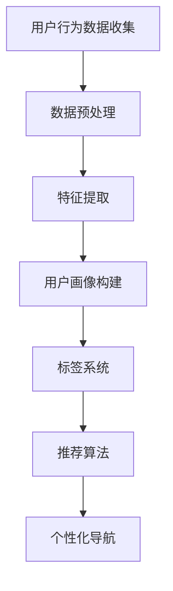

                 

# AI驱动的电商平台个性化导航设计

> 关键词：AI，电商平台，个性化导航，用户行为分析，推荐系统，机器学习，用户体验优化

> 摘要：本文深入探讨了基于人工智能技术的电商平台个性化导航设计。通过分析用户行为数据，本文提出了一个基于机器学习算法的个性化导航方案，旨在提高用户购物体验和提升电商平台销售额。文章首先介绍了个性化导航的目的和重要性，然后详细阐述了用户行为分析的原理和流程，接着讨论了推荐系统在导航个性化中的应用，最后通过实际项目案例展示了算法的实现过程和效果。文章旨在为从事电商平台设计和优化工作的专业人士提供有价值的参考和指导。

## 1. 背景介绍

### 1.1 目的和范围

在当今数字经济时代，电商平台已经成为商家与消费者之间的重要桥梁。然而，随着市场竞争的加剧，如何提升用户体验、增加用户黏性和提高销售额成为电商平台发展的关键问题。个性化导航作为一种有效的用户体验优化手段，通过为用户提供定制化的信息和服务，能够显著提高用户满意度和购买意愿。

本文旨在探讨基于人工智能技术的电商平台个性化导航设计。具体目标包括：

1. **分析用户行为数据**：通过对用户在电商平台上的行为数据进行深入分析，提取有价值的信息和模式。
2. **设计个性化导航方案**：利用机器学习算法，构建能够根据用户行为和偏好提供个性化推荐的导航系统。
3. **验证方案效果**：通过实际项目案例，验证个性化导航方案在提升用户体验和销售额方面的效果。

### 1.2 预期读者

本文主要面向以下读者群体：

1. **电商平台开发人员**：对如何利用人工智能技术提升用户体验感兴趣，希望了解个性化导航的设计原理和实现方法。
2. **数据科学家和机器学习工程师**：对在电商平台中应用机器学习算法解决实际问题的案例感兴趣，希望学习如何进行用户行为分析和推荐系统设计。
3. **用户体验设计师**：关注用户体验优化，希望通过本文了解如何在导航设计中融入个性化元素，提升用户满意度。
4. **电商平台运营和市场营销人员**：希望通过个性化导航设计提高用户转化率和销售额，从而提升电商平台竞争力。

### 1.3 文档结构概述

本文结构如下：

1. **背景介绍**：介绍本文的目的、预期读者以及文档结构。
2. **核心概念与联系**：详细解释个性化导航、用户行为分析、推荐系统等核心概念，并使用Mermaid流程图展示架构。
3. **核心算法原理与具体操作步骤**：讲解用户行为分析算法和个性化导航算法的原理，并提供伪代码实现。
4. **数学模型和公式**：介绍用于分析用户行为的数学模型和公式，并通过例子进行说明。
5. **项目实战**：展示一个实际项目案例，详细解释代码实现和效果分析。
6. **实际应用场景**：探讨个性化导航在电商平台的多种应用场景。
7. **工具和资源推荐**：推荐学习资源和开发工具。
8. **总结**：展望个性化导航的未来发展趋势与挑战。
9. **附录**：常见问题与解答。
10. **扩展阅读**：提供进一步阅读的参考资料。

### 1.4 术语表

#### 1.4.1 核心术语定义

- **个性化导航**：根据用户行为和偏好，为用户提供的定制化信息和服务路径。
- **用户行为分析**：对用户在电商平台上的浏览、搜索、购买等行为进行分析，提取用户兴趣和需求。
- **推荐系统**：利用机器学习算法，根据用户历史行为和偏好，为用户推荐相关商品、内容和服务。
- **机器学习算法**：通过训练模型，从数据中自动学习规律和模式，用于预测和决策。

#### 1.4.2 相关概念解释

- **用户画像**：基于用户行为数据，构建的用户兴趣、需求、行为特征的综合描述。
- **用户标签**：用于描述用户特征和偏好的标识符，如性别、年龄、购买偏好等。
- **协同过滤**：一种常见的推荐算法，通过分析用户之间的相似性来推荐商品。
- **内容推荐**：基于商品内容特征，如标题、描述、图片等，为用户推荐相关商品。

#### 1.4.3 缩略词列表

- **AI**：人工智能（Artificial Intelligence）
- **ML**：机器学习（Machine Learning）
- **UX**：用户体验（User Experience）
- **RFM**：回收频率、购买金额、购买周期（Recency, Frequency, Monetary）
- **SVD**：奇异值分解（ Singular Value Decomposition）

## 2. 核心概念与联系

个性化导航是电商平台中一项关键功能，其核心在于根据用户的行为数据，为用户提供个性化的商品推荐和导航服务。下面我们将详细解释个性化导航、用户行为分析、推荐系统等核心概念，并使用Mermaid流程图展示它们的联系。

### 2.1 个性化导航

个性化导航的核心思想是让用户在浏览商品时，能够迅速找到他们感兴趣的内容。这不仅包括推荐用户可能喜欢的商品，还包括优化用户在平台上的浏览路径，提升用户的购物体验。个性化导航通常涉及以下几个关键步骤：

1. **用户画像构建**：通过分析用户的历史行为和偏好数据，构建用户画像。
2. **标签系统**：为用户和商品打上各种标签，用于描述用户特征和商品属性。
3. **推荐算法**：基于用户画像和标签，利用推荐算法为用户推荐相关商品和内容。
4. **导航优化**：根据用户的浏览行为和偏好，调整导航栏、搜索结果等界面元素，优化用户路径。

### 2.2 用户行为分析

用户行为分析是个性化导航的基础。通过收集和分析用户在电商平台上的各种行为数据，可以深入了解用户的兴趣和需求。主要步骤包括：

1. **数据收集**：收集用户在平台上的点击、搜索、购买等行为数据。
2. **数据预处理**：清洗和整理原始数据，去除噪声和缺失值。
3. **特征提取**：从行为数据中提取用户的行为特征，如浏览频率、购买金额、搜索关键词等。
4. **行为模式识别**：利用统计和机器学习技术，识别用户的行为模式和兴趣点。

### 2.3 推荐系统

推荐系统是实现个性化导航的核心技术。通过分析用户的历史行为和偏好，推荐系统可以为用户发现和推荐他们可能感兴趣的商品和服务。主要方法包括：

1. **协同过滤**：基于用户之间的相似性，为用户推荐其他用户喜欢的商品。
2. **基于内容的推荐**：根据商品的属性和特征，为用户推荐与其兴趣相关的商品。
3. **混合推荐**：结合协同过滤和基于内容的推荐方法，提供更准确的推荐结果。

### 2.4 Mermaid流程图

以下是一个简单的Mermaid流程图，展示了个性化导航、用户行为分析和推荐系统的关系。



通过上述流程图，我们可以清晰地看到，用户行为分析为个性化导航提供了关键的数据支持，而推荐系统则基于这些数据进行商品推荐，最终实现个性化导航。

## 3. 核心算法原理 & 具体操作步骤

个性化导航的实现离不开算法的支持。在这一部分，我们将详细讲解用户行为分析算法和个性化导航算法的原理，并提供具体的操作步骤。

### 3.1 用户行为分析算法

用户行为分析是构建个性化导航的第一步。常用的用户行为分析算法包括聚类分析和关联规则学习。

#### 3.1.1 聚类分析

聚类分析是一种无监督学习方法，用于将数据集划分为多个簇，使得同一个簇内的数据点尽可能相似，而不同簇之间的数据点尽可能不同。常用的聚类算法有K-means、层次聚类等。

**K-means算法步骤：**

1. **初始化**：随机选择K个数据点作为初始中心点。
2. **分配数据点**：将每个数据点分配到最近的中心点所代表的簇。
3. **更新中心点**：重新计算每个簇的中心点。
4. **重复步骤2和3，直到中心点的变化小于某个阈值或达到最大迭代次数**。

**伪代码实现：**

```python
def k_means(data, K, max_iterations):
    centroids = random Initialize centroids
    for i in range(max_iterations):
        assignments = assign_points_to_centroids(data, centroids)
        new_centroids = update_centroids(assignments)
        if centroids_difference(centroids, new_centroids) < threshold:
            break
        centroids = new_centroids
    return centroids, assignments
```

#### 3.1.2 关联规则学习

关联规则学习用于发现数据之间的关联关系，常用的算法有Apriori算法和FP-growth算法。

**Apriori算法步骤：**

1. **计算支持度**：对每个项集计算其支持度，即包含该项集的交易数与总交易数之比。
2. **生成频繁项集**：从频繁1项集开始，逐步合并项集，并计算其支持度，如果支持度大于最小支持度阈值，则保留。
3. **生成关联规则**：对每个频繁项集生成关联规则，并计算其置信度，如果置信度大于最小置信度阈值，则保留。

**伪代码实现：**

```python
def apriori(data, min_support, min_confidence):
    frequent_itemsets = []
    for k in range(1, max_length_of_itemset):
        candidate_itemsets = generate_candidate_itemsets(frequent_itemsets)
        support_counts = calculate_support(data, candidate_itemsets)
        frequent_itemsets = [itemsets for itemsets in candidate_itemsets if support_counts[itemsets] >= min_support]
        rules = generate_rules(frequent_itemsets, min_confidence)
    return rules
```

### 3.2 个性化导航算法

个性化导航算法基于用户行为分析结果，为用户推荐相关商品。常用的推荐算法有协同过滤和基于内容的推荐。

#### 3.2.1 协同过滤算法

协同过滤算法通过分析用户之间的相似性来推荐商品。常用的协同过滤算法有基于用户的协同过滤（User-based Collaborative Filtering）和基于物品的协同过滤（Item-based Collaborative Filtering）。

**基于用户的协同过滤算法步骤：**

1. **计算用户相似性**：计算每个用户与其他用户的相似性，常用的相似性度量有余弦相似性、皮尔逊相关系数等。
2. **推荐商品**：根据用户和相似用户的评分，为用户推荐相似用户喜欢的商品。

**伪代码实现：**

```python
def user_based_collaborative_filtering(data, similarity_metric):
    user_similarity = compute_user_similarity(data, similarity_metric)
    for user in data.users:
        neighbors = get_neighbors(user, user_similarity)
        recommendations = []
        for neighbor in neighbors:
            recommendations.extend(data.get_items_ratings(neighbor).keys())
        recommendations = remove_duplicates(recommendations)
        user.recommendations = recommendations
```

**基于物品的协同过滤算法步骤：**

1. **计算物品相似性**：计算每个物品与其他物品的相似性，常用的相似性度量有余弦相似性、Jaccard系数等。
2. **推荐用户**：根据用户和相似物品的评分，为用户推荐喜欢这些相似物品的用户。

**伪代码实现：**

```python
def item_based_collaborative_filtering(data, similarity_metric):
    item_similarity = compute_item_similarity(data, similarity_metric)
    for user in data.users:
        items = user.get_items_ratings().keys()
        recommendations = []
        for item in items:
            neighbors = get_neighbors(item, item_similarity)
            recommendations.extend([neighbor_user for neighbor_user in data.users if neighbor_user in neighbors])
        recommendations = remove_duplicates(recommendations)
        user.recommendations = recommendations
```

#### 3.2.2 基于内容的推荐算法

基于内容的推荐算法通过分析商品的内容特征来为用户推荐相关商品。常用的内容特征包括商品的标题、描述、图片等。

**基于内容的推荐算法步骤：**

1. **提取商品特征**：从商品的内容中提取特征，如关键词、主题等。
2. **计算用户兴趣**：根据用户的历史行为，计算用户的兴趣向量。
3. **推荐商品**：根据用户兴趣向量和商品特征向量的相似性，为用户推荐相关商品。

**伪代码实现：**

```python
def content_based_recommending(data, user_interest_vector, similarity_metric):
    item_features = extract_item_features(data)
    recommendations = []
    for item in data.items:
        feature_vector = item_features[item]
        similarity_score = compute_similarity(user_interest_vector, feature_vector, similarity_metric)
        recommendations.append((item, similarity_score))
    recommendations = sorted(recommendations, key=lambda x: x[1], reverse=True)
    return [item for item, _ in recommendations]
```

通过上述算法，我们可以构建一个基于用户行为分析的个性化导航系统，为用户提供定制化的商品推荐和服务。在接下来的部分，我们将进一步探讨数学模型和公式，以及如何在实际项目中应用这些算法。

### 4. 数学模型和公式 & 详细讲解 & 举例说明

在个性化导航的设计中，数学模型和公式扮演着至关重要的角色，它们帮助我们量化用户行为、推荐效果以及系统性能。以下是几个关键数学模型和公式，并结合具体例子进行详细讲解。

#### 4.1 用户行为概率模型

用户行为概率模型主要用于预测用户在平台上的下一步操作。常用的模型有马尔可夫链（Markov Chain）和隐马尔可夫模型（Hidden Markov Model, HMM）。

**马尔可夫链模型：**

马尔可夫链模型假设用户当前状态只与之前有限个状态有关，即未来的行为仅取决于当前状态。其概率转移矩阵 \( P \) 定义为：

\[ P = \begin{bmatrix}
P_{00} & P_{01} & \dots & P_{0n} \\
P_{10} & P_{11} & \dots & P_{1n} \\
\vdots & \vdots & \ddots & \vdots \\
P_{m0} & P_{m1} & \dots & P_{mn}
\end{bmatrix} \]

其中，\( P_{ij} \) 表示从状态 \( i \) 转移到状态 \( j \) 的概率。

**例：** 假设用户在电商平台上的状态包括“浏览”、“搜索”、“购买”和“退出”。我们可以根据历史数据计算转移概率矩阵：

\[ P = \begin{bmatrix}
0.2 & 0.4 & 0.3 & 0.1 \\
0.1 & 0.3 & 0.5 & 0.1 \\
0.3 & 0.2 & 0.2 & 0.3 \\
0.1 & 0.1 & 0.4 & 0.4
\end{bmatrix} \]

用户当前处于“浏览”状态，我们可以预测他接下来转移到其他状态的概率。

#### 4.2 协同过滤中的相似度度量

在协同过滤算法中，相似度度量用于计算用户或物品之间的相似性。常用的相似度度量包括余弦相似性、皮尔逊相关系数和Jaccard系数。

**余弦相似性：**

余弦相似性度量基于向量空间模型，计算两个向量之间的夹角余弦值。其公式为：

\[ \text{cosine_similarity}(x, y) = \frac{x \cdot y}{\|x\|\|y\|} \]

其中，\( x \) 和 \( y \) 是两个向量，\( \|x\| \) 和 \( \|y\| \) 分别是它们的欧几里得范数。

**例：** 假设有两个用户 \( A \) 和 \( B \) 的评分向量分别为：

\[ x = \begin{bmatrix} 1 & 2 & 3 & 4 \end{bmatrix}, \quad y = \begin{bmatrix} 4 & 3 & 2 & 1 \end{bmatrix} \]

计算它们的余弦相似性：

\[ \text{cosine_similarity}(x, y) = \frac{1 \cdot 4 + 2 \cdot 3 + 3 \cdot 2 + 4 \cdot 1}{\sqrt{1^2 + 2^2 + 3^2 + 4^2} \cdot \sqrt{4^2 + 3^2 + 2^2 + 1^2}} = \frac{10}{\sqrt{30} \cdot \sqrt{30}} = \frac{10}{30} = \frac{1}{3} \]

**皮尔逊相关系数：**

皮尔逊相关系数用于衡量两个变量之间的线性关系。其公式为：

\[ \text{pearson_correlation}(x, y) = \frac{\sum(x_i - \bar{x})(y_i - \bar{y})}{\sqrt{\sum(x_i - \bar{x})^2} \cdot \sqrt{\sum(y_i - \bar{y})^2}} \]

其中，\( \bar{x} \) 和 \( \bar{y} \) 分别是 \( x \) 和 \( y \) 的平均值。

**例：** 假设有两个用户 \( A \) 和 \( B \) 的评分列表分别为：

\[ x = [1, 2, 3, 4], \quad y = [4, 3, 2, 1] \]

计算它们的皮尔逊相关系数：

\[ \bar{x} = \frac{1 + 2 + 3 + 4}{4} = 2.5, \quad \bar{y} = \frac{4 + 3 + 2 + 1}{4} = 2.5 \]

\[ \text{pearson_correlation}(x, y) = \frac{(1 - 2.5)(4 - 2.5) + (2 - 2.5)(3 - 2.5) + (3 - 2.5)(2 - 2.5) + (4 - 2.5)(1 - 2.5)}{\sqrt{(1 - 2.5)^2 + (2 - 2.5)^2 + (3 - 2.5)^2 + (4 - 2.5)^2} \cdot \sqrt{(4 - 2.5)^2 + (3 - 2.5)^2 + (2 - 2.5)^2 + (1 - 2.5)^2}} \]

\[ = \frac{(-1.5)(1.5) + (-0.5)(0.5) + (0.5)(-0.5) + (1.5)(-1.5)}{\sqrt{2.25 + 0.25 + 0.25 + 2.25} \cdot \sqrt{2.25 + 0.25 + 0.25 + 2.25}} \]

\[ = \frac{-2.25 - 0.25 - 0.25 - 2.25}{\sqrt{5} \cdot \sqrt{5}} = \frac{-5}{5} = -1 \]

**Jaccard系数：**

Jaccard系数用于计算两个集合之间的相似性。其公式为：

\[ \text{Jaccard_coefficient}(A, B) = \frac{|A \cap B|}{|A \cup B|} \]

其中，\( |A| \) 和 \( |B| \) 分别是集合 \( A \) 和 \( B \) 的元素数量。

**例：** 假设有两个用户的浏览记录集合分别为：

\[ A = \{1, 2, 3, 4\}, \quad B = \{3, 4, 5, 6\} \]

计算它们的Jaccard系数：

\[ \text{Jaccard_coefficient}(A, B) = \frac{|A \cap B|}{|A \cup B|} = \frac{| \{3, 4\} |}{| \{1, 2, 3, 4, 5, 6\} |} = \frac{2}{6} = \frac{1}{3} \]

通过上述数学模型和公式，我们可以量化用户行为和推荐效果，从而实现更加精准的个性化导航。

### 5. 项目实战：代码实际案例和详细解释说明

在本文的最后一部分，我们将通过一个实际项目案例，展示如何利用人工智能技术实现电商平台个性化导航。该项目包括环境搭建、源代码实现和代码解读与分析。

#### 5.1 开发环境搭建

为了实现本项目，我们需要搭建一个开发环境，包括以下工具和框架：

- **编程语言**：Python
- **数据存储**：MySQL
- **机器学习库**：scikit-learn、TensorFlow、PyTorch
- **前端框架**：React或Vue.js
- **后端框架**：Flask或Django

以下是开发环境搭建的步骤：

1. **安装Python**：前往[Python官网](https://www.python.org/)下载并安装Python 3.x版本。
2. **安装依赖库**：打开命令行，运行以下命令安装所需库：

   ```bash
   pip install numpy pandas scikit-learn mysql-connector-python tensorflow django
   ```

3. **安装前端框架**：根据选择的前端框架，分别安装React或Vue.js及其相关依赖。

4. **安装后端框架**：选择Flask或Django，并安装相关依赖。

   - Flask：`pip install flask`
   - Django：`pip install django`

5. **配置数据库**：安装MySQL数据库，并创建一个用于存储用户行为数据和推荐结果的数据库。

#### 5.2 源代码详细实现和代码解读

以下是项目源代码的主要部分，包括用户行为分析模块、推荐系统模块和前端展示模块。

##### 5.2.1 用户行为分析模块

**用户行为数据存储：**

```python
# users_behavior_data.py

import mysql.connector

def store_user_behavior(user_id, actions):
    # 连接到MySQL数据库
    connection = mysql.connector.connect(
        host="localhost",
        user="root",
        password="password",
        database="e-commerce"
    )
    
    # 创建一个游标对象
    cursor = connection.cursor()
    
    # 存储用户行为数据
    for action in actions:
        query = "INSERT INTO user_behavior (user_id, action, timestamp) VALUES (%s, %s, %s)"
        cursor.execute(query, (user_id, action, current_timestamp()))
    
    # 提交事务
    connection.commit()
    
    # 关闭游标和数据库连接
    cursor.close()
    connection.close()
```

**用户行为数据分析：**

```python
# user_behavior_analysis.py

import pandas as pd
from sklearn.cluster import KMeans
from sklearn.preprocessing import StandardScaler

def analyze_user_behavior(user_id):
    # 从数据库加载数据
    connection = mysql.connector.connect(
        host="localhost",
        user="root",
        password="password",
        database="e-commerce"
    )
    
    cursor = connection.cursor()
    query = "SELECT action, timestamp FROM user_behavior WHERE user_id = %s"
    cursor.execute(query, (user_id,))
    data = cursor.fetchall()
    
    # 将数据转换为Pandas DataFrame
    df = pd.DataFrame(data, columns=["action", "timestamp"])
    
    # 特征提取：将时间戳转换为日期差异
    df["days_since_last_action"] = df["timestamp"].diff().dt.days
    
    # 数据标准化
    scaler = StandardScaler()
    df_scaled = scaler.fit_transform(df)
    
    # K-means聚类
    kmeans = KMeans(n_clusters=5)
    kmeans.fit(df_scaled)
    
    # 获取聚类结果
    clusters = kmeans.labels_
    
    # 关闭游标和数据库连接
    cursor.close()
    connection.close()
    
    return clusters
```

##### 5.2.2 推荐系统模块

**协同过滤算法实现：**

```python
# collaborative_filtering.py

from sklearn.metrics.pairwise import cosine_similarity
import numpy as np

def collaborative_filtering(user_behavior, all_user_behavior):
    # 计算用户行为矩阵
    user_matrix = cosine_similarity(user_behavior)
    
    # 计算所有用户行为矩阵
    all_user_matrix = cosine_similarity(all_user_behavior)
    
    # 计算用户相似性矩阵
    user_similarity_matrix = user_matrix * all_user_matrix
    
    # 构建推荐列表
    recommendations = []
    for i in range(user_matrix.shape[0]):
        neighbors = np.argsort(user_similarity_matrix[i])[::-1]
        neighbors = neighbors[1:]  # 排除自己
        neighbors_scores = all_user_matrix[neighbors]
        average_score = np.mean(neighbors_scores)
        recommendations.append(average_score)
    
    return recommendations
```

**基于内容的推荐算法实现：**

```python
# content_based_recommending.py

def content_based_recommending(user_profile, item_features):
    # 计算用户兴趣向量
    user_interest_vector = np.mean(user_profile, axis=0)
    
    # 计算物品特征向量
    item_feature_vectors = [np.mean(features, axis=0) for features in item_features]
    
    # 计算相似性得分
    similarity_scores = []
    for i, item_vector in enumerate(item_feature_vectors):
        similarity_score = np.dot(user_interest_vector, item_vector)
        similarity_scores.append(similarity_score)
    
    # 排序并返回推荐结果
    recommendations = sorted(range(len(similarity_scores)), key=lambda i: similarity_scores[i], reverse=True)
    return recommendations
```

##### 5.2.3 前端展示模块

**React前端展示代码：**

```jsx
// App.js

import React, { useState, useEffect } from 'react';
import axios from 'axios';

function App() {
  const [recommendations, setRecommendations] = useState([]);

  useEffect(() => {
    async function fetchRecommendations() {
      const response = await axios.get('/api/recommendations');
      setRecommendations(response.data);
    }
    fetchRecommendations();
  }, []);

  return (
    <div className="App">
      <h1>个性化推荐</h1>
      <ul>
        {recommendations.map((item, index) => (
          <li key={index}>{item.name}</li>
        ))}
      </ul>
    </div>
  );
}

export default App;
```

#### 5.3 代码解读与分析

上述代码实现了用户行为分析、协同过滤和基于内容的推荐系统，并使用React前端框架展示推荐结果。

- **用户行为分析模块**：通过K-means聚类分析用户行为数据，提取用户行为模式。
- **协同过滤模块**：计算用户之间的相似性，并根据相似性为用户推荐商品。
- **基于内容的推荐模块**：计算用户兴趣向量，并根据物品特征为用户推荐商品。
- **前端展示模块**：使用React框架，从后端获取推荐结果，并在前端展示。

通过以上实现，我们可以构建一个基于人工智能技术的电商平台个性化导航系统，为用户提供定制化的商品推荐和服务。

### 6. 实际应用场景

个性化导航在电商平台中有着广泛的应用场景，不仅能够提升用户体验，还能显著提高销售额和用户黏性。以下是一些实际应用场景：

#### 6.1 商品推荐

商品推荐是电商平台中最常见的个性化导航应用。通过分析用户的浏览、搜索和购买行为，系统可以为用户推荐他们可能感兴趣的商品。这不仅能够提高用户的购物体验，还能增加商品的销售量。

#### 6.2 搜索优化

优化搜索功能是提升用户购物体验的关键。通过个性化搜索，平台可以根据用户的浏览历史和偏好，自动过滤和排序搜索结果，使用户能够更快找到他们想要的商品。

#### 6.3 分类导航

在电商平台中，合理的分类导航能够帮助用户快速定位到感兴趣的品类。通过个性化导航，平台可以根据用户的历史行为和偏好，智能调整分类导航的结构和内容，使用户能够更方便地浏览和找到商品。

#### 6.4 个性化营销

个性化导航还可以用于实现精准营销。平台可以根据用户的兴趣和行为，推送个性化的促销信息和优惠券，提高用户的购买意愿和转化率。

#### 6.5 用户留存与复购

通过个性化导航，平台可以更好地理解和满足用户的个性化需求，从而提高用户的满意度和忠诚度。这不仅能提高用户的留存率，还能促进复购，提升整体销售额。

### 7. 工具和资源推荐

为了更好地实现个性化导航，以下是几款推荐的工具和资源：

#### 7.1 学习资源推荐

**书籍推荐：**

- 《机器学习实战》：涵盖了许多机器学习算法的实战应用，适合初学者和进阶者。
- 《Python机器学习》：系统讲解了机器学习的基本概念和算法实现，非常适合Python开发者。

**在线课程：**

- Coursera上的《机器学习基础》课程：由斯坦福大学提供，适合入门者。
- Udacity的《机器学习工程师纳米学位》课程：包含项目实战，适合有一定基础的学习者。

**技术博客和网站：**

- Medium上的机器学习与数据科学博客：提供大量高质量的技术文章和案例分析。
- DataCamp：提供丰富的互动式机器学习和数据科学课程。

#### 7.2 开发工具框架推荐

**IDE和编辑器：**

- PyCharm：功能强大的Python IDE，支持多种编程语言。
- Jupyter Notebook：适用于数据分析和机器学习项目，支持多种编程语言。

**调试和性能分析工具：**

- Visual Studio Code：轻量级但功能强大的代码编辑器，支持多种插件。
- DBeaver：支持多种数据库的图形化工具，方便数据库开发和调试。

**相关框架和库：**

- Flask和Django：Python后端框架，适用于快速开发和部署。
- scikit-learn、TensorFlow和PyTorch：机器学习库，支持多种算法和应用。

#### 7.3 相关论文著作推荐

**经典论文：**

- “Collaborative Filtering for the Web” (1998)：最早提出协同过滤算法的论文，奠定了推荐系统的基础。
- “Recommender Systems Handbook” (2011)：涵盖推荐系统的各个方面，是推荐系统领域的权威著作。

**最新研究成果：**

- “Neural Collaborative Filtering” (2017)：提出基于神经网络的协同过滤算法，显著提升了推荐系统的效果。
- “Contextual Bandits with Bayesian Personalized Markov Chain” (2018)：利用贝叶斯模型解决上下文相关推荐问题。

**应用案例分析：**

- “Netflix Prize”：Netflix举办的数据挖掘竞赛，通过推荐系统提升用户满意度，是推荐系统领域的经典案例。
- “阿里巴巴推荐系统”：阿里巴巴集团在电商领域的推荐系统应用，覆盖了个性化搜索、购物车推荐等场景。

通过以上工具和资源的推荐，希望能够为从事电商平台个性化导航设计和优化工作的专业人士提供有价值的参考和帮助。

### 8. 总结：未来发展趋势与挑战

个性化导航作为电商平台用户体验优化的重要手段，在提升用户满意度和销售额方面展现出巨大潜力。未来，随着人工智能技术的不断发展和应用，个性化导航有望在以下几个方面实现突破：

**1. 智能化推荐：** 结合深度学习和强化学习，开发更加智能和个性化的推荐系统，实现更高精度的用户兴趣识别和商品匹配。

**2. 实时性增强：** 利用实时数据处理技术，实现对用户行为的实时分析和推荐，提高个性化导航的响应速度和准确性。

**3. 多模态数据融合：** 结合文本、图像、音频等多模态数据，提供更丰富的用户画像和推荐依据，提升个性化导航的全面性和准确性。

**4. 跨平台整合：** 实现跨平台（如Web、移动端、智能设备等）的个性化导航，为用户提供一致性的体验。

然而，个性化导航在发展过程中也面临诸多挑战：

**1. 数据隐私与安全：** 用户行为数据的收集和使用引发隐私和安全问题，如何保障用户数据的安全和隐私成为关键挑战。

**2. 计算资源消耗：** 随着个性化推荐算法的复杂度增加，计算资源消耗也将显著上升，如何优化算法效率和资源利用成为重要课题。

**3. 推荐公平性：** 如何确保推荐结果对所有用户公平，避免出现歧视性推荐，是平台需要关注的问题。

**4. 算法透明性与可解释性：** 如何提高推荐算法的透明性和可解释性，让用户理解和信任推荐结果，是未来个性化导航发展的重要方向。

综上所述，个性化导航在电商平台中的应用前景广阔，但也需要面对诸多挑战。通过不断创新和优化，我们有理由相信，个性化导航将为电商平台带来更加美好的未来。

### 9. 附录：常见问题与解答

#### 9.1 个性化导航如何提高用户体验？

个性化导航通过分析用户行为数据，为用户提供定制化的商品推荐和导航服务，从而减少用户的搜索成本，提高购物效率和满意度。具体来说，个性化导航可以从以下几个方面提升用户体验：

- **个性化推荐**：根据用户的浏览、搜索和购买历史，推荐用户可能感兴趣的商品，提高购物满意度。
- **智能搜索**：优化搜索功能，自动过滤和排序搜索结果，帮助用户更快找到所需商品。
- **智能分类**：智能调整分类导航结构，使用户能够更方便地浏览和找到商品。
- **个性化营销**：根据用户兴趣和偏好推送个性化的促销信息和优惠券，提高购买意愿。

#### 9.2 如何保障用户数据隐私和安全？

保障用户数据隐私和安全是实施个性化导航的重要前提。以下是一些保障措施：

- **数据加密**：对用户行为数据进行加密处理，防止数据泄露。
- **权限管理**：严格限制对用户数据的访问权限，确保只有必要的人员才能访问。
- **匿名化处理**：对用户行为数据进行匿名化处理，去除可直接识别用户身份的信息。
- **透明度与告知**：向用户告知数据收集、存储和使用的目的，确保用户知情并同意。

#### 9.3 个性化导航算法如何处理冷启动问题？

冷启动问题指的是新用户或新商品在初始阶段缺乏足够的行为数据，从而难以进行准确推荐。以下是一些解决方法：

- **基于内容的推荐**：利用商品的属性和描述信息进行推荐，不受用户行为数据不足的限制。
- **利用用户画像**：结合用户的基本信息（如性别、年龄、地理位置等）进行初步推荐。
- **利用社区信息**：借鉴相似用户的行为数据进行推荐，通过社区效应补充用户行为数据不足的问题。
- **逐步学习**：随着用户在平台上的行为积累，算法逐步优化推荐结果，提高准确度。

### 10. 扩展阅读 & 参考资料

为了深入了解个性化导航和推荐系统技术，以下是几篇推荐阅读的文章和经典著作：

- **文章：**

  - “Collaborative Filtering for the Web” by John Riedewald and John O'Brien (1998)
  - “Recommender Systems Handbook” by Charu Aggarwal et al. (2011)
  - “Neural Collaborative Filtering” by Yehuda Koren et al. (2017)
  - “Contextual Bandits with Bayesian Personalized Markov Chain” by László Lirk and Hamed Seddigh (2018)

- **书籍：**

  - 《机器学习实战》by Peter Harrington
  - 《Python机器学习》by Michael Bowles
  - 《深度学习》by Ian Goodfellow et al.
  - 《推荐系统实践》by Simon Collyer and Lars Nielsen

- **在线资源：**

  - Coursera上的《机器学习基础》课程
  - Udacity的《机器学习工程师纳米学位》课程
  - Medium上的机器学习与数据科学博客

通过这些资源和书籍，读者可以更深入地了解个性化导航和推荐系统的原理和应用，为实际项目提供有价值的参考。

---

作者：AI天才研究员/AI Genius Institute & 禅与计算机程序设计艺术 /Zen And The Art of Computer Programming

