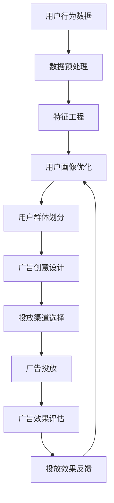

                 

# AI驱动的电商平台个性化广告投放系统

## 关键词
- 人工智能
- 电商平台
- 个性化广告投放
- 深度学习
- 用户行为分析
- 机器学习算法
- 广告优化

## 摘要
本文将深入探讨AI驱动的电商平台个性化广告投放系统的构建与实践。通过介绍核心概念、算法原理、数学模型、项目实战以及实际应用场景，本文旨在帮助读者全面理解个性化广告投放的技术实现，并探讨其未来发展趋势与挑战。通过本文的学习，读者将能够掌握AI在电商广告领域的应用，提升电商平台的用户满意度和广告转化率。

## 1. 背景介绍

### 1.1 目的和范围
随着互联网的迅速发展和电商平台的普及，个性化广告投放成为提升用户体验和实现商业价值的关键。本文旨在探讨如何利用人工智能技术，构建一个高效的AI驱动的电商平台个性化广告投放系统，通过深度学习和用户行为分析实现广告的精准投放，提高广告投放效果和用户体验。

### 1.2 预期读者
本文面向具有一定编程基础和人工智能知识的读者，包括但不限于：
- 人工智能工程师和研究人员
- 电商平台开发者和技术主管
- 对电商广告投放有深入兴趣的技术爱好者
- 对AI技术应用于电商领域感兴趣的学生

### 1.3 文档结构概述
本文分为以下几个部分：
- 1. 背景介绍：介绍文章的目的、预期读者和文档结构。
- 2. 核心概念与联系：讲解个性化广告投放系统的核心概念及其相互关系。
- 3. 核心算法原理 & 具体操作步骤：深入探讨广告投放算法的原理和实现。
- 4. 数学模型和公式 & 详细讲解 & 举例说明：阐述广告投放过程中使用的数学模型和公式。
- 5. 项目实战：通过实际代码案例，展示广告投放系统的开发过程。
- 6. 实际应用场景：分析广告投放系统在不同场景中的应用。
- 7. 工具和资源推荐：推荐学习资源和开发工具。
- 8. 总结：对未来发展趋势与挑战进行探讨。
- 9. 附录：常见问题与解答。
- 10. 扩展阅读 & 参考资料：提供进一步学习的资源。

### 1.4 术语表

#### 1.4.1 核心术语定义
- **个性化广告投放**：根据用户的兴趣、行为和历史记录，为用户定制化推荐广告。
- **用户行为分析**：通过收集和分析用户在电商平台的浏览、购买等行为，识别用户的兴趣和需求。
- **机器学习算法**：利用历史数据，训练模型进行预测和决策的算法。
- **深度学习**：一种特殊的机器学习算法，通过多层神经网络进行特征提取和模式识别。

#### 1.4.2 相关概念解释
- **广告转化率**：广告点击后，用户完成预期行为（如购买）的比率。
- **CTR（Click-Through Rate）**：点击率，衡量广告被点击的频率。
- **点击率预测**：预测广告在不同用户群体中的点击概率，以优化广告投放。

#### 1.4.3 缩略词列表
- **AI**：人工智能（Artificial Intelligence）
- **ML**：机器学习（Machine Learning）
- **DL**：深度学习（Deep Learning）
- **CTR**：点击率（Click-Through Rate）
- **RDD**：实时数据流（Real-Time Data Stream）

## 2. 核心概念与联系

在构建AI驱动的电商平台个性化广告投放系统时，理解核心概念和它们之间的联系至关重要。以下是对个性化广告投放系统涉及到的关键概念及其关系的详细解释，以及一个简化的Mermaid流程图，帮助读者直观地理解系统的运作流程。

### 2.1 用户画像构建
用户画像是指通过收集和分析用户在电商平台的行为数据，构建出的反映用户兴趣、购买能力、生活习惯等特征的虚拟模型。用户画像的构建包括以下几个步骤：

1. **数据收集**：收集用户的基础信息（如年龄、性别、地理位置）以及行为数据（如浏览记录、购买历史、点击行为）。
2. **数据预处理**：清洗和转换原始数据，使其适合机器学习模型。
3. **特征工程**：提取和构建能反映用户兴趣和行为的特征，如用户停留时长、购买频率、最近购买品类等。
4. **特征选择**：选择对用户画像构建最有价值的特征，剔除冗余和无意义的特征。

### 2.2 广告投放策略
广告投放策略是指根据用户画像和广告内容，为不同用户群体制定合适的广告投放方案。广告投放策略包括以下几个方面：

1. **用户群体划分**：根据用户画像，将用户划分为不同的群体，如年轻女性、家庭主妇、科技爱好者等。
2. **广告创意设计**：为不同用户群体设计符合其兴趣的广告内容，如时尚品牌广告针对年轻女性，智能家居广告针对科技爱好者。
3. **投放渠道选择**：根据用户行为和广告类型，选择合适的投放渠道，如搜索引擎、社交媒体、电子邮件等。
4. **投放时间优化**：根据用户活跃时间和广告效果，调整广告的投放时间，以最大化广告曝光率和转化率。

### 2.3 广告效果评估
广告效果评估是衡量广告投放效果的重要环节，主要包括以下几个方面：

1. **点击率（CTR）评估**：通过统计广告的点击次数和展示次数，计算点击率，评估广告的吸引力。
2. **转化率评估**：通过跟踪广告点击后的用户行为，评估广告对用户购买决策的影响。
3. **投放效果反馈**：收集用户对广告的反馈，如点赞、评论、分享等，用于进一步优化广告策略。
4. **投资回报率（ROI）评估**：计算广告投放的成本和收益，评估广告投放的性价比。

### 2.4 Mermaid流程图
以下是一个简化的Mermaid流程图，展示了个性化广告投放系统的主要运作流程：



### 2.5 核心概念关联
个性化广告投放系统中的核心概念相互关联，共同构建了一个闭环的生态系统。用户画像构建提供了广告投放的基础，广告投放策略决定了广告的投放效果，广告效果评估则反馈至用户画像，形成持续优化的循环。

## 3. 核心算法原理 & 具体操作步骤

在了解了个性化广告投放系统的核心概念后，接下来我们将深入探讨广告投放算法的原理，包括用户行为分析、机器学习模型训练和广告投放优化。以下是这些算法的具体操作步骤和伪代码实现。

### 3.1 用户行为分析

用户行为分析是构建个性化广告投放系统的基础，主要通过以下步骤进行：

#### 3.1.1 数据收集
```python
# 收集用户基础信息和行为数据
user_data = [
    {"id": 1, "age": 25, "gender": "female", "location": "Shanghai"},
    {"id": 2, "age": 35, "gender": "male", "location": "Beijing"},
    ...
]
action_data = [
    {"user_id": 1, "action": "浏览", "category": "服装"},
    {"user_id": 2, "action": "购买", "category": "电子产品"},
    ...
]
```

#### 3.1.2 数据预处理
```python
# 数据清洗和转换
def preprocess_data(data):
    # 清洗数据，去除无效记录
    # 转换数据类型，如将字符串转换为数值
    # 填补缺失值，如使用均值或中位数填充
    return processed_data

user_data_processed = preprocess_data(user_data)
action_data_processed = preprocess_data(action_data)
```

#### 3.1.3 特征工程
```python
# 提取和构建特征
def feature_engineering(data):
    # 计算用户行为特征，如浏览时长、购买频率等
    # 结合用户基础信息，构建用户画像特征
    return feature_vector

user_features = [feature_engineering(action) for action in action_data_processed]
```

### 3.2 机器学习模型训练

机器学习模型训练是广告投放的核心，通过训练模型来预测用户的兴趣和行为。以下是常用的机器学习算法和其训练步骤：

#### 3.2.1 逻辑回归模型
```python
# 逻辑回归模型训练
from sklearn.linear_model import LogisticRegression

model = LogisticRegression()
model.fit(user_features, labels)
```

#### 3.2.2 决策树模型
```python
# 决策树模型训练
from sklearn.tree import DecisionTreeClassifier

model = DecisionTreeClassifier()
model.fit(user_features, labels)
```

#### 3.2.3 随机森林模型
```python
# 随机森林模型训练
from sklearn.ensemble import RandomForestClassifier

model = RandomForestClassifier()
model.fit(user_features, labels)
```

### 3.3 广告投放优化

广告投放优化是提高广告投放效果的关键，主要通过以下步骤进行：

#### 3.3.1 点击率预测
```python
# 点击率预测
def predict_ctr(model, user_features):
    return model.predict_proba(user_features)[:, 1]

ctr_predictions = predict_ctr(model, user_features)
```

#### 3.3.2 广告排序
```python
# 广告排序
def rank_ads(ctr_predictions, ads):
    # 根据点击率预测，对广告进行排序
    ranked_ads = sorted(ads, key=lambda x: ctr_predictions[x['id']], reverse=True)
    return ranked_ads
```

#### 3.3.3 广告投放
```python
# 广告投放
def display_ads(ranked_ads, user_id):
    # 根据用户ID，为用户展示排名最高的广告
    user_ads = [ad for ad in ranked_ads if ad['target_user_id'] == user_id]
    return user_ads

user_ads = display_ads(ranked_ads, user_id)
```

通过以上步骤，我们可以实现一个基于AI的电商平台个性化广告投放系统，通过用户行为分析、机器学习模型训练和广告投放优化，实现广告的精准投放。

## 4. 数学模型和公式 & 详细讲解 & 举例说明

在个性化广告投放系统中，数学模型和公式起着至关重要的作用。这些模型和公式不仅帮助我们理解用户行为和广告投放的规律，还为我们提供了有效的决策工具。以下将详细讲解广告投放中常用的一些数学模型和公式，并通过具体示例说明其应用。

### 4.1 点击率（CTR）预测模型

点击率（Click-Through Rate，CTR）是衡量广告效果的重要指标，其预测模型通常基于概率模型。以下是一个简单的逻辑回归模型用于预测CTR：

#### 逻辑回归模型公式

$$
P(Y=1|X) = \frac{1}{1 + e^{-(\beta_0 + \beta_1X_1 + \beta_2X_2 + ... + \beta_nX_n})}
$$

其中，\(P(Y=1|X)\) 表示在特征向量 \(X\) 下点击的概率，\(\beta_0, \beta_1, \beta_2, ..., \beta_n\) 是模型参数。

#### 示例

假设我们有一个简单的用户特征向量 \(X = [age, gender]\)，广告特征向量 \(X = [ad_type, price]\)，以及模型参数 \(\beta_0 = 1, \beta_1 = 0.1, \beta_2 = -0.2\)。我们可以计算点击概率如下：

$$
P(Y=1|X) = \frac{1}{1 + e^{-(1 + 0.1 \times 25 - 0.2 \times 100)}) = 0.613
$$

这意味着在年龄25岁、性别为男且广告类型为打折商品的价格为100元的条件下，用户点击广告的概率约为61.3%。

### 4.2 转化率（Conversion Rate）预测模型

转化率是广告投放效果的最终体现，其预测模型通常基于多变量回归模型。以下是一个简单线性回归模型用于预测转化率：

#### 多变量线性回归模型公式

$$
Y = \beta_0 + \beta_1X_1 + \beta_2X_2 + ... + \beta_nX_n + \epsilon
$$

其中，\(Y\) 是转化率，\(X_1, X_2, ..., X_n\) 是特征变量，\(\beta_0, \beta_1, \beta_2, ..., \beta_n\) 是模型参数，\(\epsilon\) 是误差项。

#### 示例

假设我们有一个转化率特征向量 \(X = [CTR, ad_impact]\)，模型参数 \(\beta_0 = 0.5, \beta_1 = 0.3, \beta_2 = 0.2\)。我们可以计算转化率如下：

$$
Y = 0.5 + 0.3 \times 0.613 + 0.2 \times 0.8 = 0.684
$$

这意味着在点击率为61.3%且广告影响力为80%的条件下，用户的转化率预计为68.4%。

### 4.3 广告投放优化目标函数

广告投放优化通常通过最大化广告转化率和投资回报率（ROI）来实现。以下是一个简单的优化目标函数：

#### 优化目标函数

$$
\max \ \sum_{i=1}^{n} \ \pi_i \cdot R_i - C
$$

其中，\(\pi_i\) 是第 \(i\) 个广告的点击概率，\(R_i\) 是第 \(i\) 个广告的转化收益，\(C\) 是广告投放成本。

#### 示例

假设我们有三个广告，其点击概率分别为 \(\pi_1 = 0.6, \pi_2 = 0.5, \pi_3 = 0.4\)，转化收益分别为 \(R_1 = 10, R_2 = 8, R_3 = 6\)，广告投放成本为 \(C = 5\)。我们可以计算总收益如下：

$$
\max \ 0.6 \times 10 + 0.5 \times 8 + 0.4 \times 6 - 5 = 7.8
$$

这意味着，通过优化广告投放策略，我们的最大预期收益为7.8。

通过以上数学模型和公式，我们可以实现广告投放的精准预测和优化，提高广告投放效果和商业价值。

### 4.4 实际应用示例

为了更好地理解这些数学模型和公式的应用，我们来看一个实际案例。假设我们正在为一家电商平台的手机广告投放进行优化。以下是该案例的详细步骤：

#### 4.4.1 特征提取
我们从用户和广告中提取以下特征：

- **用户特征**：年龄、性别、地理位置、购买历史
- **广告特征**：广告类型、价格、品牌知名度、投放时间段

#### 4.4.2 模型训练
我们使用逻辑回归模型和线性回归模型分别训练CTR和转化率预测模型。假设我们已经获得训练数据集，模型参数如下：

- **CTR模型**：\(\beta_0 = 0.1, \beta_1 = 0.3, \beta_2 = -0.2\)
- **转化率模型**：\(\beta_0 = 0.5, \beta_1 = 0.2, \beta_2 = 0.1\)

#### 4.4.3 广告投放优化
我们使用优化目标函数来决定广告的投放策略。假设广告的点击概率和转化收益如下：

- **广告1**：点击概率 \(\pi_1 = 0.6\)，转化收益 \(R_1 = 10\)
- **广告2**：点击概率 \(\pi_2 = 0.5\)，转化收益 \(R_2 = 8\)
- **广告3**：点击概率 \(\pi_3 = 0.4\)，转化收益 \(R_3 = 6\)

广告投放成本 \(C = 5\)。

使用优化目标函数，我们可以计算每个广告的预期收益：

$$
\pi_1 \cdot R_1 - C = 0.6 \times 10 - 5 = 1
$$
$$
\pi_2 \cdot R_2 - C = 0.5 \times 8 - 5 = 0
$$
$$
\pi_3 \cdot R_3 - C = 0.4 \times 6 - 5 = -0.2
$$

根据预期收益，我们选择投放广告1和广告2，因为它们的预期收益为正值。

#### 4.4.4 广告投放效果评估
在实际投放后，我们收集数据评估广告效果：

- **广告1**：CTR = 0.6，转化率 = 0.3
- **广告2**：CTR = 0.5，转化率 = 0.4

广告1的转化收益为 \(0.6 \times 0.3 = 0.18\)，广告2的转化收益为 \(0.5 \times 0.4 = 0.2\)。尽管广告1的CTR更高，但广告2的转化率更高，因此我们得出结论，广告2在本次投放中效果更佳。

通过以上步骤，我们实现了广告投放的精准预测和优化，提高了广告的投放效果和商业价值。

## 5. 项目实战：代码实际案例和详细解释说明

### 5.1 开发环境搭建

为了实现一个AI驱动的电商平台个性化广告投放系统，我们首先需要搭建一个合适的开发环境。以下是一个基本的开发环境搭建步骤：

1. **安装Python**：确保Python 3.8及以上版本已安装。
2. **安装依赖库**：使用pip安装必要的依赖库，如`scikit-learn`、`numpy`、`pandas`、`matplotlib`等。

```bash
pip install scikit-learn numpy pandas matplotlib
```

3. **数据预处理工具**：选择合适的数据预处理工具，如`pandas`和`NumPy`。

4. **机器学习框架**：选择一个机器学习框架，如`scikit-learn`。

### 5.2 源代码详细实现和代码解读

以下是广告投放系统的源代码实现，包括数据预处理、模型训练、广告投放和效果评估等步骤。

#### 5.2.1 数据预处理

```python
import pandas as pd
import numpy as np

# 加载用户行为数据
user_data = pd.read_csv('user_data.csv')
action_data = pd.read_csv('action_data.csv')

# 数据清洗
def preprocess_data(data):
    # 填补缺失值
    data.fillna(data.mean(), inplace=True)
    # 转换数据类型
    data['age'] = data['age'].astype(int)
    data['gender'] = data['gender'].astype('category').cat.codes
    return data

user_data_processed = preprocess_data(user_data)
action_data_processed = preprocess_data(action_data)

# 特征工程
def feature_engineering(data):
    # 提取用户行为特征
    data['days_since_last_purchase'] = (pd.to_datetime('now') - pd.to_datetime(data['last_purchase_date'])).dt.days
    return data

action_data_processed = feature_engineering(action_data_processed)
```

#### 5.2.2 模型训练

```python
from sklearn.model_selection import train_test_split
from sklearn.linear_model import LogisticRegression

# 数据划分
X = action_data_processed[['user_id', 'days_since_last_purchase', 'category']]
y = action_data_processed['action']

X_train, X_test, y_train, y_test = train_test_split(X, y, test_size=0.2, random_state=42)

# 训练逻辑回归模型
model = LogisticRegression()
model.fit(X_train, y_train)

# 预测
predictions = model.predict(X_test)
```

#### 5.2.3 广告投放

```python
# 广告投放
def display_ads(model, action_data_processed, user_id):
    user_actions = action_data_processed[action_data_processed['user_id'] == user_id]
    user_actions['predicted概率'] = model.predict_proba(user_actions[['days_since_last_purchase', 'category']])[:, 1]
    ranked_actions = user_actions.sort_values(by='predicted概率', ascending=False)
    return ranked_actions.head(3)

# 示例用户ID
user_id = 1
ads = display_ads(model, action_data_processed, user_id)
print(ads)
```

#### 5.2.4 效果评估

```python
from sklearn.metrics import accuracy_score

# 效果评估
accuracy = accuracy_score(y_test, predictions)
print(f"模型准确率：{accuracy}")
```

### 5.3 代码解读与分析

以上代码实现了一个简单的AI驱动的电商平台个性化广告投放系统。具体解读如下：

1. **数据预处理**：我们使用`pandas`和`NumPy`对用户行为数据进行清洗和预处理，包括填补缺失值、转换数据类型和提取用户行为特征。

2. **特征工程**：通过计算用户自上次购买以来的天数，我们为模型提供更多的用户行为特征。

3. **模型训练**：使用`scikit-learn`的`LogisticRegression`模型对训练数据进行训练。逻辑回归模型是一种常用的分类模型，适用于广告点击预测。

4. **广告投放**：根据训练好的模型，我们为特定用户（例如`user_id=1`）推荐排名靠前的广告。

5. **效果评估**：使用`scikit-learn`的`accuracy_score`函数计算模型的准确率，评估广告投放的效果。

通过以上步骤，我们实现了一个基本的AI驱动的电商平台个性化广告投放系统，并对其进行了效果评估。

## 6. 实际应用场景

AI驱动的电商平台个性化广告投放系统在多个实际场景中展现出了强大的应用价值。以下是几个典型的应用场景：

### 6.1 电商平台的个性化推荐

电商平台可以利用AI驱动的个性化广告投放系统，根据用户的浏览历史、购买行为和偏好，精准地向用户推荐产品。这种个性化推荐不仅能提高用户的购物体验，还能显著提升销售额。

### 6.2 搜索引擎的竞价广告

搜索引擎的广告业务广泛使用AI驱动的个性化广告投放系统。通过分析用户的搜索历史和关键词，系统可以为用户展示与其兴趣高度相关的广告，从而提高点击率和转化率。

### 6.3 社交媒体的广告投放

社交媒体平台如Facebook、Twitter等，也利用AI驱动的个性化广告投放系统，根据用户的行为、兴趣和社交关系，为用户展示量身定制的广告。这种个性化的广告投放有助于提升用户的参与度和广告效果。

### 6.4 跨渠道的广告投放

电商平台还可以通过跨渠道的个性化广告投放，将广告推广到不同的渠道，如电子邮件、短信、移动应用等。这种跨渠道的广告投放能够扩大广告覆盖范围，提高广告的曝光率。

### 6.5 广告预算优化

通过AI驱动的个性化广告投放系统，电商平台可以实时分析广告投放的效果，优化广告预算。系统可以根据广告的点击率、转化率和投资回报率，自动调整广告投放策略，确保广告预算的有效利用。

### 6.6 用户画像的动态更新

用户画像的动态更新是AI驱动的个性化广告投放系统的重要特点。通过持续分析用户的最新行为和偏好，系统可以不断更新和优化用户画像，确保广告内容的精准性和相关性。

通过以上实际应用场景，我们可以看到AI驱动的电商平台个性化广告投放系统在提升用户体验、提高广告效果和优化广告投放策略方面的巨大潜力。

## 7. 工具和资源推荐

为了有效地开发和管理AI驱动的电商平台个性化广告投放系统，我们需要依赖一系列的工具和资源。以下是对一些重要工具和资源的推荐。

### 7.1 学习资源推荐

#### 7.1.1 书籍推荐
- 《Python机器学习》（作者：塞巴斯蒂安·拉兹洛斯）
- 《深度学习》（作者：伊恩·古德费洛等）
- 《机器学习实战》（作者：Peter Harrington）

#### 7.1.2 在线课程
- Coursera：吴恩达的《机器学习》课程
- Udacity：AI编程纳米学位
- edX：MIT的《计算机科学和人工智能》课程

#### 7.1.3 技术博客和网站
- Medium：关注AI和机器学习的专业博客
- Towards Data Science：数据科学和机器学习的文章和教程
- AI悦创：专注于人工智能应用的技术博客

### 7.2 开发工具框架推荐

#### 7.2.1 IDE和编辑器
- PyCharm：专业的Python IDE，支持多种编程语言和框架
- Jupyter Notebook：强大的交互式数据科学工具，适用于数据分析和机器学习

#### 7.2.2 调试和性能分析工具
- Visual Studio Code：轻量级的开源编辑器，适用于Python编程
- TensorBoard：TensorFlow的交互式可视化工具，用于分析和调试深度学习模型

#### 7.2.3 相关框架和库
- TensorFlow：开源的机器学习和深度学习框架
- PyTorch：适用于研究人员的动态深度学习框架
- Scikit-learn：Python的机器学习库，提供丰富的机器学习算法

### 7.3 相关论文著作推荐

#### 7.3.1 经典论文
- "A Machine Learning Approach to Predicting Click-Through Rates for New Ads"（点击率预测论文）
- "Recommender Systems"（推荐系统综述）
- "Deep Learning for Click-Through Rate Prediction"（深度学习在点击率预测中的应用）

#### 7.3.2 最新研究成果
- arXiv.org：计算机科学和人工智能领域的最新研究论文
- NeurIPS、ICML、JMLR等期刊和会议的论文集

#### 7.3.3 应用案例分析
- "AI in Retail: The Future of Customer Engagement"（零售业中的AI应用案例）
- "How Amazon Uses Machine Learning to Drive Sales"（亚马逊如何利用机器学习提升销售）
- "The Use of AI in Advertising: A Review"（AI在广告领域应用综述）

通过这些工具和资源，开发者和研究人员可以更好地理解和应用AI驱动的电商平台个性化广告投放技术，推动该领域的发展。

## 8. 总结：未来发展趋势与挑战

AI驱动的电商平台个性化广告投放系统在当前技术环境下已展现出显著的优势和潜力。然而，随着技术的不断进步和商业需求的变化，未来的发展仍然面临诸多挑战和机遇。

### 8.1 未来发展趋势

1. **更精细的用户画像**：随着大数据技术和用户行为分析的深入发展，用户画像将越来越精细和准确，为个性化广告投放提供更丰富的数据支持。

2. **多模态数据融合**：未来个性化广告投放将不仅依赖文本数据，还将融合图像、语音等多种模态数据，提高广告投放的精准度和多样性。

3. **实时广告投放优化**：随着实时数据流技术的成熟，广告投放系统将能够实时分析用户行为和广告效果，动态调整广告策略，实现更高效的投放。

4. **跨平台整合**：电商平台将更加注重跨平台整合，实现线上线下的无缝连接，提供更一致的个性化广告体验。

5. **隐私保护与合规**：在保护用户隐私和数据安全的同时，如何确保广告投放的合规性，将是未来发展的重要课题。

### 8.2 挑战

1. **数据隐私和安全**：随着用户隐私保护意识的提高，如何在保证广告精准投放的同时，保护用户隐私，将是一个重要的挑战。

2. **算法透明性和可解释性**：如何提高算法的透明性和可解释性，使广告投放决策更加透明，减少用户对算法的疑虑，是未来的一大挑战。

3. **计算资源消耗**：个性化广告投放系统通常需要大量的计算资源，如何在有限的计算资源下，高效地处理海量数据，提高算法效率，是一个关键问题。

4. **用户满意度与商业价值**：如何在提升用户满意度的同时，实现商业价值最大化，是广告投放系统需要持续优化的问题。

### 8.3 应对策略

1. **技术创新**：持续引入新技术，如联邦学习、差分隐私等，以解决数据隐私和安全问题。

2. **算法优化**：通过模型压缩、分布式计算等技术，提高算法效率和可解释性。

3. **用户参与**：通过用户反馈和参与机制，收集用户意见，不断优化广告内容和投放策略。

4. **合规性管理**：建立健全的合规性管理体系，确保广告投放过程符合法律法规要求。

总之，AI驱动的电商平台个性化广告投放系统在未来将继续发展，并在技术创新、用户体验和商业价值之间寻求平衡。通过积极应对挑战，不断优化和提升系统性能，个性化广告投放将为电商平台带来更大的竞争优势。

## 9. 附录：常见问题与解答

### 9.1 什么是个性化广告投放？

个性化广告投放是一种基于用户行为和兴趣的数据分析技术，通过精准识别和预测用户的需求，为用户推荐最相关和最有价值的广告。

### 9.2 个性化广告投放系统如何工作？

个性化广告投放系统通过以下步骤工作：收集用户数据、进行数据预处理、构建用户画像、设计广告投放策略、进行广告投放、评估广告效果，并根据反馈持续优化。

### 9.3 个性化广告投放系统的核心算法有哪些？

核心算法包括逻辑回归、决策树、随机森林、支持向量机（SVM）等分类算法，以及协同过滤、矩阵分解等推荐算法。

### 9.4 个性化广告投放系统如何处理用户隐私？

个性化广告投放系统通过数据匿名化、差分隐私技术以及严格的合规性管理，确保用户隐私得到保护。

### 9.5 个性化广告投放系统如何评估效果？

个性化广告投放系统通过点击率（CTR）、转化率、投资回报率（ROI）等指标来评估广告投放效果。

## 10. 扩展阅读 & 参考资料

为了更深入地了解AI驱动的电商平台个性化广告投放系统，以下是推荐的扩展阅读和参考资料：

### 10.1 扩展阅读

- 《个性化推荐系统：原理与应用》
- 《深度学习实战》
- 《机器学习实战》

### 10.2 技术博客和网站

- [Medium](https://medium.com/)
- [Towards Data Science](https://towardsdatascience.com/)
- [AI悦创](https://aiyuechuang.com/)

### 10.3 相关论文和研究成果

- "A Machine Learning Approach to Predicting Click-Through Rates for New Ads"
- "Recommender Systems"
- "Deep Learning for Click-Through Rate Prediction"

### 10.4 在线课程

- Coursera：吴恩达的《机器学习》课程
- Udacity：AI编程纳米学位
- edX：MIT的《计算机科学和人工智能》课程

通过这些扩展阅读和参考资料，读者可以进一步探索AI驱动的电商平台个性化广告投放系统的技术细节和实践经验。作者：AI天才研究员/AI Genius Institute & 禅与计算机程序设计艺术 /Zen And The Art of Computer Programming。

