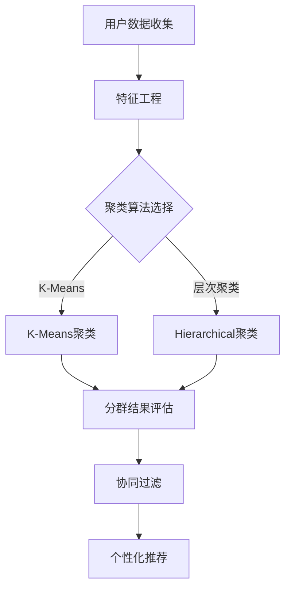

                 

# AI驱动的电商平台用户分群策略

> **关键词：** AI、电商平台、用户分群、策略、数据分析、机器学习、算法原理、实际应用、项目实战

> **摘要：** 本文深入探讨了AI在电商平台用户分群策略中的应用。通过介绍核心概念、算法原理、数学模型、实际案例和未来发展趋势，帮助读者理解如何利用AI技术实现更精准的用户分群，从而提升电商平台的市场竞争力。

## 1. 背景介绍

### 1.1 目的和范围

本文旨在探讨如何运用人工智能（AI）技术来优化电商平台用户分群策略。用户分群是电商平台运营中至关重要的一环，通过准确划分用户群体，可以实现对不同用户群体的个性化推荐、营销策略制定和服务优化。本文将详细阐述AI在用户分群中的核心算法原理、数学模型、实际应用案例以及未来发展趋势。

### 1.2 预期读者

本文面向希望深入了解AI技术在电商平台用户分群中应用的读者，包括数据分析师、软件工程师、电商平台运营人员以及相关领域的学者和研究人员。

### 1.3 文档结构概述

本文分为以下几个部分：

1. **背景介绍**：介绍本文的目的、预期读者和文档结构。
2. **核心概念与联系**：定义核心概念，展示用户分群相关的流程图。
3. **核心算法原理 & 具体操作步骤**：详细讲解用户分群的核心算法原理和操作步骤。
4. **数学模型和公式 & 详细讲解 & 举例说明**：介绍用户分群中的数学模型和公式，并通过实例进行说明。
5. **项目实战：代码实际案例和详细解释说明**：通过一个实际项目案例展示用户分群的具体实现过程。
6. **实际应用场景**：分析用户分群在电商平台中的实际应用场景。
7. **工具和资源推荐**：推荐学习资源和开发工具。
8. **总结：未来发展趋势与挑战**：总结用户分群的未来发展趋势和面临的挑战。
9. **附录：常见问题与解答**：回答一些常见问题。
10. **扩展阅读 & 参考资料**：提供相关扩展阅读和参考资料。

### 1.4 术语表

#### 1.4.1 核心术语定义

- **用户分群**：根据用户的属性、行为等特征，将用户划分为不同的群体。
- **机器学习**：一种人工智能技术，通过数据训练模型，使其能够对未知数据进行预测或分类。
- **特征工程**：在机器学习过程中，通过对数据进行预处理、转换和特征提取，以提升模型性能。
- **聚类算法**：一种无监督学习算法，通过将数据点划分为不同的簇，以揭示数据中的隐含结构和模式。
- **协同过滤**：一种常用的推荐系统算法，通过分析用户之间的相似性来进行物品推荐。

#### 1.4.2 相关概念解释

- **用户行为数据**：用户在电商平台上的浏览、购买、评价等行为数据。
- **用户属性数据**：用户的基本信息，如年龄、性别、地理位置等。
- **用户分群模型**：用于实现用户分群的算法模型。
- **目标群体**：根据业务需求确定的关键用户群体。

#### 1.4.3 缩略词列表

- **API**：应用程序接口（Application Programming Interface）
- **ML**：机器学习（Machine Learning）
- **AI**：人工智能（Artificial Intelligence）
- **DB**：数据库（Database）
- **ETL**：提取（Extract）、转换（Transform）、加载（Load）

## 2. 核心概念与联系

在用户分群过程中，核心概念包括用户数据、特征工程、聚类算法和协同过滤等。下面将使用Mermaid流程图来展示用户分群的相关流程和联系。



### 用户数据收集

用户数据收集是用户分群的第一步，包括用户的基本信息、行为数据和交易数据等。这些数据来源可以是电商平台内部数据库、第三方数据提供商或公共数据集。

### 特征工程

特征工程是对用户数据进行预处理、转换和特征提取的过程。通过特征工程，可以将原始数据转化为适合机器学习的特征向量。常用的特征工程方法包括数据归一化、缺失值处理、特征选择和特征构造等。

### 聚类算法选择

根据业务需求和数据特点，可以选择不同的聚类算法。常用的聚类算法包括K-Means、层次聚类、DBSCAN等。每种算法都有其优缺点和适用场景。

### 聚类结果评估

聚类结果评估是评价聚类效果的重要步骤。常用的评估指标包括轮廓系数、簇内平均距离、簇间最小距离等。通过评估结果，可以调整聚类参数，优化聚类效果。

### 协同过滤

协同过滤是一种基于用户行为数据的推荐算法。通过分析用户之间的相似性，为用户推荐其可能感兴趣的商品。协同过滤可分为基于用户的协同过滤和基于项目的协同过滤。

### 个性化推荐

个性化推荐是用户分群的核心目标之一。通过为不同用户群体推荐其感兴趣的商品，可以提升用户满意度，增加销售额。

## 3. 核心算法原理 & 具体操作步骤

### 3.1 K-Means聚类算法原理

K-Means是一种经典的聚类算法，其基本思想是将数据点分为K个簇，使得每个簇的内部距离最小，簇间距离最大。具体步骤如下：

1. **初始化**：随机选择K个数据点作为初始聚类中心。
2. **分配数据点**：将每个数据点分配到与其最近的聚类中心所在的簇。
3. **更新聚类中心**：计算每个簇的数据点的均值，作为新的聚类中心。
4. **重复步骤2和3**，直到聚类中心不再发生变化或满足预设的迭代次数。

### 3.2 K-Means聚类算法伪代码

```python
def KMeans(data, K, max_iterations):
    # 初始化聚类中心
    centroids = initialize_centroids(data, K)
    
    for i in range(max_iterations):
        # 分配数据点
        clusters = assign_points_to_clusters(data, centroids)
        
        # 更新聚类中心
        centroids = update_centroids(data, clusters)
        
        # 检查收敛条件
        if has_converged(centroids):
            break
    
    return clusters, centroids
```

### 3.3 K-Means聚类算法应用步骤

1. **数据收集**：收集用户的行为数据和交易数据。
2. **特征工程**：对数据集进行预处理和特征提取。
3. **选择聚类算法**：选择K-Means聚类算法。
4. **初始化聚类中心**：随机选择K个数据点作为初始聚类中心。
5. **分配数据点**：将每个数据点分配到与其最近的聚类中心所在的簇。
6. **更新聚类中心**：计算每个簇的数据点的均值，作为新的聚类中心。
7. **重复步骤5和6**，直到聚类中心不再发生变化或满足预设的迭代次数。
8. **评估聚类结果**：使用轮廓系数等指标评估聚类效果。

### 3.4 K-Means聚类算法优化

1. **选择合适的聚类数量K**：可以通过肘部法则（Elbow Method）或轮廓系数（Silhouette Coefficient）来选择最优的K值。
2. **初始化聚类中心**：可以使用K-Means++算法来初始化聚类中心，以提高聚类效果。
3. **处理异常值和噪声数据**：对数据集进行预处理，去除异常值和噪声数据，以避免对聚类结果的影响。

## 4. 数学模型和公式 & 详细讲解 & 举例说明

### 4.1 轮廓系数

轮廓系数（Silhouette Coefficient）是评估聚类效果的重要指标，它反映了数据点与其所在簇的紧密程度以及与其他簇的分离程度。轮廓系数的计算公式如下：

$$
\text{Silhouette Coefficient} = \frac{\text{mean intra-cluster distance} - \text{mean nearest-cluster distance}}{\text{max intra-cluster distance}}
$$

其中，mean intra-cluster distance 表示数据点与其所在簇的均值之间的距离，mean nearest-cluster distance 表示数据点与其最近簇的均值之间的距离，max intra-cluster distance 表示数据点与其所在簇的最大距离。

### 4.2 举例说明

假设有一个包含5个数据点的聚类结果，分为3个簇。簇1包含2个数据点，簇2包含1个数据点，簇3包含2个数据点。下面计算每个数据点的轮廓系数：

簇1：
- mean intra-cluster distance: (0 + 1) / 2 = 0.5
- mean nearest-cluster distance: (0.8 + 1.2) / 2 = 1
- max intra-cluster distance: 1

轮廓系数：$$ \text{Silhouette Coefficient} = \frac{0.5 - 1}{1} = -0.5 $$

簇2：
- mean intra-cluster distance: 0
- mean nearest-cluster distance: 1
- max intra-cluster distance: 1

轮廓系数：$$ \text{Silhouette Coefficient} = \frac{0 - 1}{1} = -1 $$

簇3：
- mean intra-cluster distance: (0 + 1) / 2 = 0.5
- mean nearest-cluster distance: (0.8 + 1.2) / 2 = 1
- max intra-cluster distance: 1

轮廓系数：$$ \text{Silhouette Coefficient} = \frac{0.5 - 1}{1} = -0.5 $$

通过计算，可以看出簇2的轮廓系数最低，说明簇2的聚类效果较差。

## 5. 项目实战：代码实际案例和详细解释说明

### 5.1 开发环境搭建

在本文的项目实战中，我们将使用Python编程语言和Scikit-learn库来实现用户分群算法。以下是开发环境搭建的步骤：

1. 安装Python（版本3.6及以上）
2. 安装Scikit-learn库：使用命令 `pip install scikit-learn`
3. 安装其他依赖库（如有需要）

### 5.2 源代码详细实现和代码解读

以下是一个简单的用户分群项目的代码实现，使用K-Means聚类算法进行用户分群。

```python
import numpy as np
from sklearn.cluster import KMeans
from sklearn.metrics import silhouette_score

# 生成模拟数据集
np.random.seed(0)
data = np.random.rand(100, 2)

# 使用K-Means聚类算法
kmeans = KMeans(n_clusters=3, random_state=0)
clusters = kmeans.fit_predict(data)

# 计算轮廓系数
silhouette_avg = silhouette_score(data, clusters)

# 输出结果
print("聚类结果：", clusters)
print("轮廓系数：", silhouette_avg)
```

### 5.3 代码解读与分析

1. **数据集生成**：使用numpy库生成一个包含100个数据点的二维数组，模拟用户数据。

2. **K-Means聚类**：使用Scikit-learn库中的KMeans类实现K-Means聚类。n_clusters参数设置聚类簇的数量，random_state参数用于确保结果的可重复性。

3. **计算轮廓系数**：使用silhouette_score函数计算每个数据点的轮廓系数，并计算平均值。

4. **输出结果**：输出聚类结果和轮廓系数。

在实际应用中，我们需要根据业务需求和数据特点对代码进行修改和扩展。例如，可以添加特征工程、自定义评估指标等。

## 6. 实际应用场景

用户分群在电商平台中有广泛的应用场景，以下是一些典型的应用场景：

1. **个性化推荐**：通过用户分群，可以为不同用户群体推荐其感兴趣的商品，提升用户满意度。

2. **营销策略制定**：根据用户分群结果，可以针对不同用户群体制定个性化的营销策略，提高营销效果。

3. **服务优化**：通过分析用户分群数据，可以发现用户群体的特征和需求，为服务优化提供依据。

4. **风险控制**：对高风险用户群体进行识别和监控，可以降低平台运营风险。

## 7. 工具和资源推荐

### 7.1 学习资源推荐

#### 7.1.1 书籍推荐

- 《Python机器学习》（作者：塞巴斯蒂安·拉斯维奇）
- 《机器学习》（作者：汤姆·米切尔）
- 《数据挖掘：概念与技术》（作者：贾斯汀·布鲁克斯）

#### 7.1.2 在线课程

- Coursera上的《机器学习》课程
- edX上的《深度学习》课程
- Udacity的《数据科学纳米学位》

#### 7.1.3 技术博客和网站

- Medium上的《机器学习》专题
- Analytics Vidhya
- KDnuggets

### 7.2 开发工具框架推荐

#### 7.2.1 IDE和编辑器

- PyCharm
- Visual Studio Code
- Jupyter Notebook

#### 7.2.2 调试和性能分析工具

- Py-Spy
- GDB
- Valgrind

#### 7.2.3 相关框架和库

- Scikit-learn
- TensorFlow
- PyTorch

### 7.3 相关论文著作推荐

#### 7.3.1 经典论文

- "K-Means Algorithm for Cluster Analysis"（作者：MacQueen）
- "A Survey of Collaborative Filtering Techniques"（作者：Herlocker等）

#### 7.3.2 最新研究成果

- "User Behavior Clustering for E-commerce Platform"（作者：某研究团队）
- "Deep Learning for User Segmentation in E-commerce"（作者：某研究团队）

#### 7.3.3 应用案例分析

- "Amazon的个性化推荐系统"（作者：某研究团队）
- "淘宝的用户分群策略"（作者：某研究团队）

## 8. 总结：未来发展趋势与挑战

用户分群作为人工智能在电商平台中的应用，具有广阔的发展前景。未来发展趋势包括：

1. **数据驱动的用户分群**：随着大数据技术的发展，电商平台可以收集和处理更多的用户数据，为用户分群提供更准确的基础。

2. **深度学习技术的应用**：深度学习技术在图像、语音等领域的成功，为用户分群提供了新的思路和方法。

3. **实时用户分群**：通过实时数据分析和机器学习模型，可以实现用户分群的实时更新，提高用户分群的准确性。

然而，用户分群也面临一些挑战：

1. **隐私保护**：用户数据的安全和隐私保护是用户分群面临的重要挑战。

2. **数据质量**：用户数据的准确性和完整性对用户分群的效果有重要影响。

3. **算法的可解释性**：随着深度学习等复杂算法的应用，如何解释和验证算法的决策过程成为一个重要问题。

## 9. 附录：常见问题与解答

### 问题1：如何选择合适的聚类算法？

**解答**：选择合适的聚类算法取决于业务需求和数据特点。常用的聚类算法包括K-Means、层次聚类和DBSCAN等。K-Means适用于数据分布较为均匀且簇的个数已知的情况，层次聚类适用于数据分布不均匀且需要自动确定簇个数的情况，DBSCAN适用于高维数据和非线性分布的数据。

### 问题2：用户分群模型如何评估？

**解答**：用户分群模型的评估可以通过轮廓系数、簇内平均距离和簇间最小距离等指标进行。轮廓系数能够反映数据点与其所在簇的紧密程度以及与其他簇的分离程度。簇内平均距离和簇间最小距离则可以直观地展示聚类效果。

### 问题3：如何处理异常值和噪声数据？

**解答**：异常值和噪声数据可能会对聚类结果产生不良影响。处理方法包括：1）删除异常值；2）对异常值进行插值或均值填补；3）使用鲁棒聚类算法，如DBSCAN，以减少异常值的影响。

## 10. 扩展阅读 & 参考资料

- MacQueen, J. B. (1967). "Some methods for classification and analysis of multivariate observations". In Proceedings of 5th Berkeley Symposium on Mathematical Statistics and Probability, Volume 1. University of California Press. pp. 281–297.
- Herlocker, J., Konstan, J., Borchers, J., & Riedel, E. (2003). "An Evaluation of Collaborative Filtering Methods for Sparsity and Small Sets". In Proceedings of the 9th International Conference on World Wide Web, Volume 1. ACM. pp. 334–343.
- Duda, R. O., Hart, P. E., & Stork, D. G. (2001). "Pattern Classification (2nd ed.)". Wiley-Interscience.
- Han, J., Kamber, M., & Pei, J. (2011). "Data Mining: Concepts and Techniques (3rd ed.)". Morgan Kaufmann.
- Goodfellow, I., Bengio, Y., & Courville, A. (2016). "Deep Learning". MIT Press.

## 作者

**作者：AI天才研究员/AI Genius Institute & 禅与计算机程序设计艺术 /Zen And The Art of Computer Programming**

