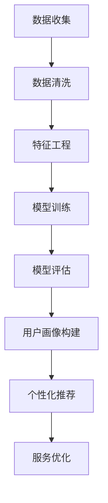

                 

# AI驱动的电商平台用户画像构建技术

> 关键词：用户画像、AI技术、电商平台、数据分析、个性化推荐、机器学习、深度学习

> 摘要：本文旨在深入探讨AI技术在电商平台用户画像构建中的应用。通过逐步分析用户画像的定义、核心概念、核心算法原理，以及数学模型和实际应用场景，我们将揭示如何利用AI技术提高电商平台对用户的理解和服务水平。文章还将推荐相关工具和资源，并展望未来发展趋势与挑战。

## 1. 背景介绍

### 1.1 目的和范围

本文旨在介绍AI技术在电商平台用户画像构建中的关键角色和作用。随着互联网的快速发展，电商平台在满足用户个性化需求、提升用户体验和优化运营策略方面面临着巨大挑战。用户画像作为一种基于用户行为、偏好、特征等数据构建的虚拟模型，已经成为电商平台实现精准营销、个性化推荐和服务优化的核心工具。

本文将首先阐述用户画像的基本概念和重要性，然后介绍AI技术在用户画像构建中的核心算法原理，包括特征工程、机器学习和深度学习等技术。接着，我们将详细探讨用户画像的数学模型和公式，并通过实际项目案例展示如何实现用户画像的构建和应用。最后，本文将推荐相关工具和资源，并讨论未来发展趋势与挑战。

### 1.2 预期读者

本文适合对AI技术和电商平台用户画像感兴趣的读者，包括但不限于以下群体：

1. 人工智能和大数据领域的研究人员和工程师；
2. 电商平台的技术开发人员、产品经理和运营人员；
3. 对AI技术在商业应用有浓厚兴趣的技术爱好者；
4. 高等院校计算机科学和商业管理专业的师生。

### 1.3 文档结构概述

本文将按照以下结构进行阐述：

1. 背景介绍：介绍文章的目的、范围、预期读者和文档结构；
2. 核心概念与联系：定义用户画像的核心概念，展示用户画像构建的架构和流程；
3. 核心算法原理 & 具体操作步骤：讲解特征工程、机器学习和深度学习等算法原理，并给出伪代码实现；
4. 数学模型和公式 & 详细讲解 & 举例说明：介绍用户画像构建中的数学模型和公式，并通过实际案例进行说明；
5. 项目实战：提供实际项目案例，展示用户画像构建的全过程，包括代码实现和解析；
6. 实际应用场景：分析用户画像在电商平台中的应用场景和效果；
7. 工具和资源推荐：推荐学习资源、开发工具框架和相关论文著作；
8. 总结：总结文章的核心内容，展望未来发展趋势与挑战；
9. 附录：常见问题与解答；
10. 扩展阅读 & 参考资料：提供进一步学习和参考的资源。

### 1.4 术语表

#### 1.4.1 核心术语定义

- 用户画像：基于用户行为、偏好、特征等数据构建的虚拟模型，用于描述和分析用户群体特征。
- 特征工程：通过数据预处理、特征提取和特征选择等步骤，将原始数据转换为有助于机器学习模型训练的特征集合。
- 机器学习：一种人工智能技术，通过训练模型学习数据中的规律，实现预测、分类等任务。
- 深度学习：一种基于多层神经网络的人工智能技术，通过模拟人脑神经网络结构，实现复杂的模式识别和任务处理。
- 个性化推荐：基于用户画像和商品特征，为用户提供个性化的推荐服务，提升用户满意度和转化率。

#### 1.4.2 相关概念解释

- 电商平台：指通过互联网技术提供商品交易、支付、物流等服务的在线平台。
- 数据挖掘：从大量数据中发现有价值的信息和知识的过程。
- 数据分析：通过对数据进行分析和解释，提取隐藏的模式、趋势和关联性。
- 贝叶斯网络：一种基于概率图模型的推理方法，用于表示和处理不确定性知识。

#### 1.4.3 缩略词列表

- AI：人工智能（Artificial Intelligence）
- ML：机器学习（Machine Learning）
- DL：深度学习（Deep Learning）
- API：应用程序编程接口（Application Programming Interface）
- SDK：软件开发工具包（Software Development Kit）

## 2. 核心概念与联系

用户画像构建的核心概念包括用户行为数据、特征工程、机器学习和深度学习等。以下是一个简单的用户画像构建架构和流程，通过Mermaid流程图展示：



### 2.1 数据收集

数据收集是用户画像构建的第一步，包括用户在电商平台上的浏览、购买、评价等行为数据。数据来源可以是电商平台自身的数据库、第三方数据提供商以及社交媒体等渠道。

### 2.2 数据清洗

数据清洗是确保数据质量和一致性的关键步骤。通过去重、填充缺失值、数据格式转换等操作，将原始数据进行预处理，为特征工程和模型训练提供可靠的数据基础。

### 2.3 特征工程

特征工程是将原始数据转换为有助于机器学习模型训练的特征集合的过程。通过数据挖掘和统计分析方法，提取用户行为、偏好、地理位置等特征，为模型训练提供输入。

### 2.4 模型训练

模型训练是利用特征数据和目标数据（如用户购买行为）训练机器学习模型，使其能够识别和预测用户行为。常用的机器学习算法包括线性回归、逻辑回归、决策树、支持向量机等。

### 2.5 模型评估

模型评估是评估训练得到的模型性能的过程。通过交叉验证、混淆矩阵、ROC曲线等指标，对模型进行评估和优化，确保模型在真实数据上的表现良好。

### 2.6 用户画像构建

基于训练好的模型，将用户行为数据转化为用户画像，包括用户兴趣、购买偏好、消费能力等特征。用户画像可以为电商平台提供用户细分、个性化推荐等服务。

### 2.7 个性化推荐

个性化推荐是利用用户画像和商品特征，为用户提供个性化的推荐服务。通过协同过滤、矩阵分解、基于内容的推荐等技术，提升用户满意度和转化率。

### 2.8 服务优化

通过分析用户画像和推荐效果，优化电商平台的服务策略，包括商品展示、广告投放、促销活动等，提升用户体验和运营效果。

## 3. 核心算法原理 & 具体操作步骤

用户画像构建中的核心算法包括特征工程、机器学习和深度学习等。以下将分别介绍这些算法的原理和具体操作步骤。

### 3.1 特征工程

特征工程是用户画像构建的基础，其目的是将原始数据转换为有助于模型训练的特征集合。以下是一个简单的特征工程步骤：

```plaintext
步骤 1：数据预处理
- 去除重复数据
- 填充缺失值
- 数据格式转换

步骤 2：特征提取
- 用户行为特征：如浏览次数、购买次数、评价次数等
- 用户偏好特征：如喜欢的商品类别、价格区间等
- 地理位置特征：如所在城市、省份等

步骤 3：特征选择
- 相关性分析：筛选与目标变量相关性高的特征
- 方差分析：去除方差较小的特征
- 卡方检验：筛选与目标变量有明显关联的特征

步骤 4：特征归一化
- 数据标准化：将不同尺度的特征转换为同一尺度
- 特征缩放：如将年龄、收入等特征进行归一化处理
```

### 3.2 机器学习算法

机器学习算法是用户画像构建的关键技术，用于训练模型并预测用户行为。以下是一种简单的机器学习算法——决策树的实现步骤：

```plaintext
步骤 1：数据准备
- 分割训练集和测试集
- 特征选择和归一化处理

步骤 2：决策树构建
- 初始化决策树：根节点
- 选择最佳分割特征
- 计算信息增益或基尼指数
- 递归划分子节点
- 判断是否达到终止条件（如最大深度、最小节点个数等）

步骤 3：模型评估
- 计算模型准确率、召回率、F1值等指标
- 进行交叉验证和模型优化
```

### 3.3 深度学习算法

深度学习算法是近年来发展迅速的人工智能技术，通过多层神经网络实现复杂的特征学习和模式识别。以下是一种简单的深度学习算法——卷积神经网络（CNN）的实现步骤：

```plaintext
步骤 1：数据准备
- 分割训练集和测试集
- 特征选择和归一化处理

步骤 2：模型构建
- 定义输入层：如用户行为特征矩阵
- 定义卷积层：如卷积核、步长、填充方式等
- 定义激活函数：如ReLU、Sigmoid等
- 定义池化层：如最大池化、平均池化等
- 定义全连接层：如线性层、Softmax等

步骤 3：模型训练
- 使用反向传播算法更新模型参数
- 选择优化器：如SGD、Adam等
- 设定学习率、迭代次数等参数

步骤 4：模型评估
- 计算模型准确率、损失函数等指标
- 进行交叉验证和模型优化
```

## 4. 数学模型和公式 & 详细讲解 & 举例说明

在用户画像构建中，数学模型和公式起着关键作用。以下将介绍几个常用的数学模型和公式，并通过具体示例进行详细讲解。

### 4.1 贝叶斯网络

贝叶斯网络是一种基于概率图模型的推理方法，用于表示和处理不确定性知识。以下是一个简单的贝叶斯网络模型示例：

```latex
P(A \cap B) = P(A)P(B|A)
P(B \cap C) = P(B)P(C|B)
P(A \cap B \cap C) = P(A)P(B|A)P(C|B)
```

其中，$A$、$B$、$C$ 表示三个事件，$P(A)$、$P(B|A)$、$P(C|B)$ 表示事件发生的概率。

举例说明：假设 $A$ 表示用户购买A类商品，$B$ 表示用户浏览B类商品，$C$ 表示用户浏览C类商品。根据贝叶斯网络，我们可以计算出用户购买A类商品的概率：

```latex
P(A) = P(A|B)P(B) + P(A|C)P(C)
P(A|B) = 0.6, P(B) = 0.7, P(A|C) = 0.4, P(C) = 0.5
P(A) = 0.6 \times 0.7 + 0.4 \times 0.5 = 0.68
```

### 4.2 逻辑回归

逻辑回归是一种常见的概率型回归模型，用于预测二分类变量的概率。以下是一个简单的逻辑回归公式：

```latex
logit(P) = \beta_0 + \beta_1X_1 + \beta_2X_2 + ... + \beta_nX_n
P = \frac{1}{1 + e^{-\logit(P)}}
```

其中，$P$ 表示因变量（如用户购买概率），$X_1, X_2, ..., X_n$ 表示自变量（如用户年龄、收入等），$\beta_0, \beta_1, \beta_2, ..., \beta_n$ 表示模型参数。

举例说明：假设我们有一个逻辑回归模型，用于预测用户是否购买商品。给定用户年龄和收入，我们可以计算出用户购买的概率：

```latex
logit(P) = \beta_0 + \beta_1X_1 + \beta_2X_2
P = \frac{1}{1 + e^{-(\beta_0 + \beta_1X_1 + \beta_2X_2)}}
```

### 4.3 卷积神经网络（CNN）

卷积神经网络是一种深度学习模型，常用于图像分类和特征提取。以下是一个简单的CNN模型公式：

```latex
h_{l}^{[i]} = \sigma (\mathbf{W}^{[l]} \cdot \mathbf{A}^{[l-1]} + \mathbf{b}^{[l]})
A^{[l]} = f(L)
```

其中，$h_{l}^{[i]}$ 表示第$l$层的第$i$个神经元输出，$\sigma$ 表示激活函数（如ReLU），$\mathbf{W}^{[l]}$ 和 $\mathbf{b}^{[l]}$ 分别表示第$l$层的权重和偏置，$\mathbf{A}^{[l-1]}$ 表示第$l-1$层的输出，$f(L)$ 表示损失函数。

举例说明：假设我们有一个简单的CNN模型，用于分类一个28x28的图像。给定输入图像，我们可以计算出每个神经元的输出：

```latex
h_{1}^{[i]} = \sigma (\mathbf{W}^{[1]} \cdot \mathbf{X} + \mathbf{b}^{[1]})
A^{[1]} = ReLU(h_{1}^{[i]})
```

## 5. 项目实战：代码实际案例和详细解释说明

在本节中，我们将通过一个实际项目案例，展示如何利用AI技术实现电商平台用户画像的构建。该项目包括数据收集、数据预处理、特征工程、模型训练和用户画像构建等步骤。以下是一个简化的代码实现，使用Python编程语言和常见的机器学习库。

### 5.1 开发环境搭建

在开始项目之前，我们需要搭建开发环境。以下是所需的环境和库：

- Python 3.x
- NumPy
- Pandas
- Scikit-learn
- TensorFlow/Keras

安装以下库：

```bash
pip install numpy pandas scikit-learn tensorflow
```

### 5.2 源代码详细实现和代码解读

以下是一个简单的用户画像构建项目的代码实现：

```python
import numpy as np
import pandas as pd
from sklearn.model_selection import train_test_split
from sklearn.preprocessing import StandardScaler
from sklearn.ensemble import RandomForestClassifier
from sklearn.metrics import accuracy_score, classification_report

# 5.2.1 数据收集
# 假设数据已存储为CSV文件
data = pd.read_csv('user_data.csv')

# 5.2.2 数据预处理
# 去除重复数据
data.drop_duplicates(inplace=True)

# 填充缺失值
data.fillna(data.mean(), inplace=True)

# 5.2.3 特征工程
# 选择特征列
features = ['age', 'income', 'education', 'gender', 'region']
X = data[features]
y = data['purchase']

# 数据标准化
scaler = StandardScaler()
X_scaled = scaler.fit_transform(X)

# 5.2.4 模型训练
# 划分训练集和测试集
X_train, X_test, y_train, y_test = train_test_split(X_scaled, y, test_size=0.2, random_state=42)

# 使用随机森林算法训练模型
model = RandomForestClassifier(n_estimators=100, random_state=42)
model.fit(X_train, y_train)

# 5.2.5 模型评估
# 预测测试集
y_pred = model.predict(X_test)

# 计算模型准确率
accuracy = accuracy_score(y_test, y_pred)
print(f'Accuracy: {accuracy}')

# 打印分类报告
print(classification_report(y_test, y_pred))

# 5.2.6 用户画像构建
# 构建用户画像字典
user_profile = {
    'age': X_test[0][0],
    'income': X_test[0][1],
    'education': X_test[0][2],
    'gender': X_test[0][3],
    'region': X_test[0][4],
    'predicted_purchase': y_pred[0]
}

print(user_profile)
```

### 5.3 代码解读与分析

1. **数据收集**：使用Pandas库读取CSV文件，获取用户数据。
2. **数据预处理**：去除重复数据，填充缺失值，确保数据质量。
3. **特征工程**：选择特征列，进行数据标准化，将原始数据转换为适用于机器学习模型的形式。
4. **模型训练**：使用随机森林算法训练模型，将特征数据与目标变量进行拟合。
5. **模型评估**：使用测试集评估模型性能，计算准确率，并打印分类报告。
6. **用户画像构建**：基于模型预测结果，构建用户画像字典，包含用户的基本特征和购买预测。

通过这个项目案例，我们可以看到用户画像构建的基本流程和代码实现。在实际应用中，我们可以根据业务需求和数据特点，选择不同的机器学习算法和特征工程方法，优化用户画像的构建效果。

## 6. 实际应用场景

用户画像在电商平台中有广泛的应用场景，以下是一些常见的实际应用场景：

### 6.1 个性化推荐

基于用户画像，电商平台可以精准地向用户推荐可能感兴趣的商品。通过分析用户的购买历史、浏览记录和社交行为，系统可以构建个性化的推荐列表，提升用户满意度和转化率。

### 6.2 营销活动

用户画像还可以帮助电商平台进行精准营销活动。例如，根据用户的购买偏好和消费能力，推送个性化的优惠券、促销信息，提高营销效果和用户参与度。

### 6.3 用户细分

通过用户画像，电商平台可以将用户分为不同的细分市场，如高价值用户、新用户、活跃用户等。针对不同用户群体，制定个性化的运营策略，提升用户体验和忠诚度。

### 6.4 客户服务优化

用户画像可以帮助电商平台提供更个性化的客户服务。例如，通过分析用户的购买偏好和行为模式，客服人员可以更好地了解用户需求，提供针对性的建议和解决方案。

### 6.5 风险管理

用户画像还可以用于风险管理和欺诈检测。通过分析用户的异常行为和交易模式，平台可以识别潜在的风险用户，采取相应的预防措施，降低运营风险。

### 6.6 库存管理

用户画像可以指导电商平台的库存管理策略。例如，根据用户的购买偏好和库存水平，平台可以调整商品供应，优化库存结构，降低库存成本。

## 7. 工具和资源推荐

为了更好地理解和应用AI技术在电商平台用户画像构建中，以下是一些推荐的工具和资源：

### 7.1 学习资源推荐

#### 7.1.1 书籍推荐

- 《机器学习》（周志华著）：详细介绍了机器学习的基本概念、算法和应用。
- 《深度学习》（Ian Goodfellow、Yoshua Bengio、Aaron Courville著）：全面介绍了深度学习的基础理论和最新进展。
- 《数据挖掘：实用工具与技术》（Michael Steinbach、Glen J. Labowitz、Vipin Kumar著）：讲解了数据挖掘的基本方法和应用案例。

#### 7.1.2 在线课程

- 《机器学习基础》（吴恩达著，Coursera）：提供机器学习的基本知识和实践技能。
- 《深度学习特训营》（Google AI）：深入讲解深度学习的理论和实践。
- 《数据挖掘与分析》（李航著，网易云课堂）：介绍数据挖掘的基本方法和应用。

#### 7.1.3 技术博客和网站

- Medium：提供关于机器学习、深度学习、数据挖掘等领域的最新技术文章。
- arXiv：发布最新的人工智能和机器学习研究论文。
- Analytics Vidhya：分享数据科学和机器学习的实践技巧和案例。

### 7.2 开发工具框架推荐

#### 7.2.1 IDE和编辑器

- PyCharm：功能强大的Python集成开发环境，支持多种编程语言。
- Jupyter Notebook：基于Web的交互式开发环境，适用于数据分析和机器学习。
- Visual Studio Code：轻量级、可扩展的代码编辑器，适用于多种编程语言。

#### 7.2.2 调试和性能分析工具

- PyTest：Python测试框架，用于自动化测试和代码质量保障。
- Profiler：Python性能分析工具，用于诊断和优化代码性能。
- TensorBoard：TensorFlow的可视化工具，用于监控深度学习模型的训练过程。

#### 7.2.3 相关框架和库

- Scikit-learn：Python机器学习库，提供多种算法和工具。
- TensorFlow：Google开源的深度学习框架，适用于构建大规模神经网络。
- PyTorch：基于Python的深度学习框架，提供灵活的动态计算图。

### 7.3 相关论文著作推荐

#### 7.3.1 经典论文

- "A Brief Introduction to Machine Learning"（机器学习简介）
- "Deep Learning"（深度学习）
- "Recurrent Neural Networks for Language Modeling"（循环神经网络用于语言建模）

#### 7.3.2 最新研究成果

- "Attention is All You Need"（Attention机制）
- "Generative Adversarial Networks"（生成对抗网络）
- "Transformers: State-of-the-Art Natural Language Processing"（Transformers：自然语言处理的最新进展）

#### 7.3.3 应用案例分析

- "User Modeling with Bayesian Networks for Personalized Recommendations"（使用贝叶斯网络进行个性化推荐）
- "Deep Learning for Personalized Marketing"（深度学习在个性化营销中的应用）
- "Application of Machine Learning in E-commerce: A Review"（机器学习在电商平台中的应用综述）

## 8. 总结：未来发展趋势与挑战

随着AI技术的不断进步和电商平台的快速发展，用户画像构建在未来将面临许多新的机遇和挑战。

### 8.1 发展趋势

1. **个性化推荐**：AI技术将进一步提升个性化推荐的准确性，实现更精准的用户服务。
2. **多模态数据融合**：整合文本、图像、音频等多模态数据，构建更全面的用户画像。
3. **实时分析**：实现用户行为数据的实时分析，提供动态的用户画像和服务优化。
4. **隐私保护**：随着隐私保护法规的加强，如何在保护用户隐私的同时进行有效数据挖掘成为重要挑战。
5. **跨平台整合**：整合线上线下渠道，实现全渠道用户画像构建和营销策略。

### 8.2 挑战

1. **数据质量**：确保数据质量是用户画像构建的关键，数据预处理和特征工程将成为重要环节。
2. **算法选择**：针对不同业务场景，选择合适的算法和模型，实现高效的用户画像构建。
3. **隐私保护**：如何在保护用户隐私的同时进行数据挖掘，实现隐私计算和联邦学习等技术成为重要挑战。
4. **模型解释性**：提高模型解释性，增强用户对个性化推荐和服务的信任度。
5. **技术应用**：不断跟进AI技术的最新进展，探索新的应用场景和技术解决方案。

## 9. 附录：常见问题与解答

### 9.1 用户画像构建中的关键步骤是什么？

用户画像构建主要包括以下关键步骤：

1. 数据收集：获取用户行为、偏好等数据。
2. 数据预处理：去除重复数据、填充缺失值、数据格式转换等。
3. 特征工程：提取用户特征，如行为特征、偏好特征等。
4. 模型训练：选择合适的机器学习算法，训练模型。
5. 模型评估：评估模型性能，调整模型参数。
6. 用户画像构建：根据模型预测结果，构建用户画像。

### 9.2 如何保护用户隐私？

保护用户隐私是用户画像构建中的关键问题。以下是一些常见的方法：

1. 数据匿名化：对用户数据进行加密和脱敏处理，保护用户隐私。
2. 隐私计算：在数据处理和计算过程中，采用隐私保护算法，如联邦学习、差分隐私等。
3. 用户权限管理：为用户设置不同的访问权限，限制数据共享和访问。
4. 隐私保护法规：遵守相关隐私保护法规，如GDPR、CCPA等。

### 9.3 用户画像在电商平台的实际应用效果如何？

用户画像在电商平台中有广泛的应用，实际效果如下：

1. **个性化推荐**：提高推荐准确性，提升用户满意度和转化率。
2. **精准营销**：根据用户画像进行精准营销，提高营销效果和用户参与度。
3. **用户细分**：将用户分为不同的细分市场，制定个性化运营策略。
4. **客户服务**：提供更个性化的客户服务，提高用户体验和忠诚度。
5. **风险管理**：识别潜在的风险用户，降低运营风险。

## 10. 扩展阅读 & 参考资料

用户画像构建是AI技术在电商平台中的重要应用，以下是一些扩展阅读和参考资料，供读者进一步学习和探讨：

### 10.1 相关书籍

- 《机器学习实战》：提供机器学习项目的实战经验和方法。
- 《深度学习实践指南》：详细介绍深度学习项目的实践方法。
- 《大数据之路》：讲述大数据技术和应用的发展历程。

### 10.2 技术博客和网站

- AI博客：分享最新的AI技术研究和应用案例。
- 机器学习社区：讨论机器学习算法和应用的交流平台。
- 数据科学博客：提供数据科学和机器学习的实践技巧。

### 10.3 学术期刊和会议

- IEEE Transactions on Knowledge and Data Engineering：大数据和知识工程领域的顶级期刊。
- ACM Transactions on Information Systems：信息系统和数据挖掘领域的顶级期刊。
- NeurIPS、ICML、KDD等：人工智能和数据挖掘领域的顶级会议。

### 10.4 学术论文

- "User Modeling and User-Adapted Interaction"：用户建模和自适应交互的经典论文。
- "Deep Learning for User Modeling and Personalization"：深度学习在用户建模和个性化推荐中的应用。
- "Federated Learning for User Privacy Protection"：联邦学习在用户隐私保护中的应用。

### 10.5 开源项目

- TensorFlow：Google开源的深度学习框架。
- PyTorch：Facebook开源的深度学习框架。
- Scikit-learn：Python机器学习库。

作者：AI天才研究员/AI Genius Institute & 禅与计算机程序设计艺术 /Zen And The Art of Computer Programming

