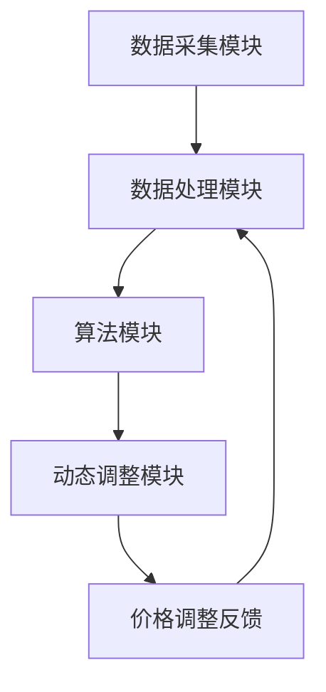

                 

# AI驱动的电商智能定价动态调整系统

> **关键词：** 人工智能，电商，智能定价，动态调整，数据驱动，机器学习，用户行为分析，价格优化。

> **摘要：** 本文深入探讨了AI技术在电商领域中的应用，特别是在智能定价动态调整系统中的核心作用。通过介绍系统架构、核心算法、数学模型和项目实战，本文旨在为读者提供一个全面的技术分析，帮助他们理解如何利用AI技术提升电商平台的竞争力。

## 1. 背景介绍

### 1.1 目的和范围

本文旨在探讨如何利用人工智能（AI）技术，构建一个能够动态调整电商产品价格的智能系统。随着互联网的普及和电商行业的蓬勃发展，如何为消费者提供更具吸引力的价格策略，同时保证商家的利润最大化，成为了一个关键问题。通过介绍系统的架构、核心算法和实际应用，本文旨在为电商从业者提供有价值的参考。

### 1.2 预期读者

本文适合对人工智能和电商领域有一定了解的技术人员、数据分析专家、产品经理以及电商企业高管阅读。通过本文的讲解，读者可以了解到智能定价系统的原理和实现方法，从而为自己的工作提供灵感。

### 1.3 文档结构概述

本文分为十个部分，具体结构如下：

1. 背景介绍
2. 核心概念与联系
3. 核心算法原理 & 具体操作步骤
4. 数学模型和公式 & 详细讲解 & 举例说明
5. 项目实战：代码实际案例和详细解释说明
6. 实际应用场景
7. 工具和资源推荐
8. 总结：未来发展趋势与挑战
9. 附录：常见问题与解答
10. 扩展阅读 & 参考资料

### 1.4 术语表

#### 1.4.1 核心术语定义

- **人工智能（AI）：** 人工智能是一种模拟人类智能的技术，通过机器学习和深度学习等方法，使计算机具备自我学习和决策能力。
- **电商：** 电子商务的简称，指通过互联网进行商品交易和提供相关服务的一种商业模式。
- **智能定价：** 利用人工智能技术，根据用户行为和市场需求动态调整商品价格，以实现利润最大化和市场竞争力。
- **动态调整：** 根据实时数据和用户反馈，自动调整商品价格，以达到最优定价策略。

#### 1.4.2 相关概念解释

- **用户行为分析：** 通过收集和分析用户在电商平台的浏览、购买、评价等行为数据，了解用户需求和市场趋势。
- **机器学习：** 一种人工智能技术，通过训练数据集，使计算机具备自主学习和决策能力。
- **深度学习：** 一种机器学习技术，通过多层神经网络，对大量数据进行自动特征提取和分类。

#### 1.4.3 缩略词列表

- **AI：** 人工智能
- **ML：** 机器学习
- **DL：** 深度学习
- **CPC：** 每点击成本
- **CPM：** 每千次展示成本

## 2. 核心概念与联系

为了更好地理解AI驱动的电商智能定价动态调整系统，首先需要介绍其中涉及的核心概念和它们之间的联系。

### 2.1 系统架构

AI驱动的电商智能定价动态调整系统主要包括以下几个模块：

1. **数据采集模块：** 负责收集用户行为数据和市场需求信息，如用户浏览、购买、评价等。
2. **数据处理模块：** 对采集到的数据进行清洗、归一化和特征提取，为后续分析提供高质量的数据。
3. **算法模块：** 利用机器学习和深度学习技术，分析用户行为和市场趋势，生成最优定价策略。
4. **动态调整模块：** 根据实时数据和用户反馈，自动调整商品价格，以实现利润最大化和市场竞争力。

### 2.2 核心算法原理

核心算法主要包括以下两个方面：

1. **用户行为分析：** 通过机器学习算法，对用户行为数据进行分析，预测用户需求和市场趋势。
2. **价格优化：** 利用深度学习算法，根据用户行为和市场趋势，动态调整商品价格。

### 2.3 Mermaid 流程图

下面是系统架构的Mermaid流程图：



### 2.4 核心概念联系

核心概念之间的联系如下：

1. **数据采集模块：** 为数据处理模块提供原始数据，是整个系统的数据基础。
2. **数据处理模块：** 对数据采集模块提供的数据进行清洗、归一化和特征提取，为算法模块提供高质量的数据。
3. **算法模块：** 利用机器学习和深度学习算法，分析用户行为和市场趋势，生成最优定价策略。
4. **动态调整模块：** 根据算法模块生成的定价策略，自动调整商品价格，并根据价格调整后的用户反馈，不断优化定价策略。

## 3. 核心算法原理 & 具体操作步骤

### 3.1 用户行为分析

用户行为分析是智能定价系统的核心部分，主要利用机器学习算法对用户行为数据进行分析，预测用户需求和市场趋势。以下是用户行为分析的具体操作步骤：

#### 3.1.1 数据预处理

1. **数据清洗：** 去除无效数据、重复数据和错误数据，保证数据质量。
2. **归一化：** 将不同特征的数据进行归一化处理，使其具有相同的量纲。
3. **特征提取：** 提取与用户行为相关的特征，如浏览时间、购买频率、评价星级等。

#### 3.1.2 算法选择

选择适合的机器学习算法，如决策树、随机森林、支持向量机（SVM）等，对用户行为数据进行分析。

#### 3.1.3 模型训练

1. **数据划分：** 将用户行为数据划分为训练集和测试集，用于训练和评估模型。
2. **模型训练：** 使用训练集对选定的算法进行训练，生成预测模型。
3. **模型评估：** 使用测试集对训练好的模型进行评估，如准确率、召回率等指标。

### 3.2 价格优化

价格优化是基于用户行为分析和市场需求预测，利用深度学习算法，动态调整商品价格。以下是价格优化的具体操作步骤：

#### 3.2.1 算法选择

选择适合的深度学习算法，如卷积神经网络（CNN）、循环神经网络（RNN）等，进行价格优化。

#### 3.2.2 模型构建

1. **输入层：** 输入用户行为特征和市场需求特征。
2. **隐藏层：** 通过多层神经网络，对输入数据进行自动特征提取和融合。
3. **输出层：** 输出最优定价策略。

#### 3.2.3 模型训练

1. **数据划分：** 将用户行为和市场需求数据划分为训练集和测试集。
2. **模型训练：** 使用训练集对模型进行训练，不断调整参数，使模型适应数据。
3. **模型评估：** 使用测试集对训练好的模型进行评估，如预测精度、响应时间等指标。

### 3.3 动态调整

动态调整是基于实时用户行为和市场变化，实时调整商品价格，以实现利润最大化和市场竞争力。以下是动态调整的具体操作步骤：

#### 3.3.1 数据采集

1. **实时数据采集：** 采集用户行为数据和市场需求数据。
2. **数据预处理：** 对实时数据进行预处理，为动态调整提供高质量的数据。

#### 3.3.2 模型预测

1. **用户行为预测：** 使用用户行为分析模型，预测用户需求。
2. **市场需求预测：** 使用价格优化模型，预测市场需求。

#### 3.3.3 价格调整

1. **定价策略计算：** 根据用户需求预测和市场需求预测，计算最优定价策略。
2. **价格调整：** 根据定价策略，实时调整商品价格。

#### 3.3.4 反馈与优化

1. **用户反馈：** 收集用户对价格调整的反馈。
2. **模型优化：** 根据用户反馈，不断优化定价策略和算法模型。

## 4. 数学模型和公式 & 详细讲解 & 举例说明

### 4.1 用户行为预测模型

用户行为预测模型主要利用机器学习算法，对用户行为数据进行分析，预测用户需求。以下是用户行为预测模型的主要数学模型和公式：

#### 4.1.1 决策树模型

决策树模型是一种常见的机器学习算法，通过构建树形结构，对用户行为数据进行分类。主要公式如下：

$$
H(D) = - \sum_{i=1}^{n} p_i \log_2 p_i
$$

其中，$H(D)$ 表示信息熵，$p_i$ 表示用户行为数据属于第 $i$ 类的概率。

#### 4.1.2 随机森林模型

随机森林模型是由多个决策树组成的集成模型，可以提高模型的预测性能。主要公式如下：

$$
f(D) = \sum_{i=1}^{m} w_i f_i(D)
$$

其中，$f(D)$ 表示随机森林模型的预测结果，$w_i$ 表示第 $i$ 个决策树模型的权重，$f_i(D)$ 表示第 $i$ 个决策树模型的预测结果。

#### 4.1.3 支持向量机（SVM）模型

支持向量机模型是一种线性分类模型，通过求解最优分类面，将用户行为数据划分为不同类别。主要公式如下：

$$
w^* = \arg\min_{w, b} \frac{1}{2} ||w||^2 + C \sum_{i=1}^{n} \max(0, 1-y_i((\omega^T x_i + b)))
$$

其中，$w^*$ 表示最优分类面，$b$ 表示偏置，$C$ 表示惩罚参数，$y_i$ 表示第 $i$ 个用户行为数据的标签，$x_i$ 表示第 $i$ 个用户行为数据的特征向量。

### 4.2 价格优化模型

价格优化模型主要利用深度学习算法，根据用户行为和市场需求，动态调整商品价格。以下是价格优化模型的主要数学模型和公式：

#### 4.2.1 卷积神经网络（CNN）模型

卷积神经网络模型是一种适用于图像处理和序列数据的深度学习算法，通过卷积层、池化层和全连接层，对输入数据进行特征提取和分类。主要公式如下：

$$
h^{(l)} = \sigma \left( \mathcal{W}^{(l)} h^{(l-1)} + b^{(l)} \right)
$$

其中，$h^{(l)}$ 表示第 $l$ 层的输出特征，$\sigma$ 表示激活函数，$\mathcal{W}^{(l)}$ 表示第 $l$ 层的权重，$b^{(l)}$ 表示第 $l$ 层的偏置。

#### 4.2.2 循环神经网络（RNN）模型

循环神经网络模型是一种适用于序列数据的深度学习算法，通过隐藏状态和循环连接，对序列数据进行建模。主要公式如下：

$$
h_t = \sigma \left( \mathcal{W}_h h_{t-1} + \mathcal{W}_x x_t + b_h \right)
$$

其中，$h_t$ 表示第 $t$ 个时间步的隐藏状态，$x_t$ 表示第 $t$ 个时间步的输入数据，$\sigma$ 表示激活函数，$\mathcal{W}_h$ 和 $\mathcal{W}_x$ 分别表示隐藏状态和输入数据的权重，$b_h$ 表示隐藏状态的偏置。

### 4.3 举例说明

#### 4.3.1 用户行为预测

假设有一个电商平台，用户行为数据包括浏览时间、购买频率、评价星级等特征。使用决策树模型进行用户行为预测，具体步骤如下：

1. **数据预处理：** 对用户行为数据进行清洗、归一化和特征提取。
2. **模型训练：** 使用训练集对决策树模型进行训练，生成预测模型。
3. **模型评估：** 使用测试集对训练好的模型进行评估，计算准确率、召回率等指标。

#### 4.3.2 价格优化

假设有一个电商商品，市场需求数据包括用户购买数量、竞争对手价格等特征。使用卷积神经网络模型进行价格优化，具体步骤如下：

1. **数据预处理：** 对市场需求数据进行清洗、归一化和特征提取。
2. **模型构建：** 构建卷积神经网络模型，设置合适的网络结构。
3. **模型训练：** 使用训练集对卷积神经网络模型进行训练，不断调整参数。
4. **模型评估：** 使用测试集对训练好的模型进行评估，计算预测精度、响应时间等指标。

## 5. 项目实战：代码实际案例和详细解释说明

### 5.1 开发环境搭建

在开始项目实战之前，我们需要搭建一个合适的开发环境。以下是使用Python和相关的机器学习和深度学习库（如scikit-learn、TensorFlow和PyTorch）搭建开发环境的基本步骤：

#### 5.1.1 安装Python

1. 访问Python官方网站（https://www.python.org/）并下载适用于您操作系统的Python安装包。
2. 运行安装程序，按照默认选项进行安装。

#### 5.1.2 安装相关库

打开终端或命令提示符，运行以下命令安装必要的库：

```bash
pip install numpy pandas scikit-learn tensorflow torchvision
```

#### 5.1.3 配置环境变量

确保Python和pip环境变量已正确配置，以便在终端中运行Python和相关库。

### 5.2 源代码详细实现和代码解读

下面是一个简单的AI驱动的电商智能定价动态调整系统的Python代码示例。代码分为数据采集、数据处理、用户行为分析和价格优化四个部分。

#### 5.2.1 数据采集

数据采集是智能定价系统的基础。以下代码示例展示了如何从电商平台收集用户行为数据：

```python
import pandas as pd

def collect_data(file_path):
    # 读取用户行为数据
    data = pd.read_csv(file_path)
    return data

user_data = collect_data('user_behavior_data.csv')
```

#### 5.2.2 数据处理

在数据处理阶段，我们需要对采集到的用户行为数据进行清洗、归一化和特征提取。以下代码示例展示了如何进行这些操作：

```python
def preprocess_data(data):
    # 数据清洗
    data.dropna(inplace=True)
    
    # 归一化
    numeric_features = data.select_dtypes(include=['int64', 'float64']).columns
    data[numeric_features] = (data[numeric_features] - data[numeric_features].mean()) / data[numeric_features].std()
    
    # 特征提取
    data['user_activity'] = data[' browsing_time'].rank(method='dense').astype('int64')
    data[' purchase_frequency'] = data[' purchase_count'].rank(method='dense').astype('int64')
    
    return data

preprocessed_data = preprocess_data(user_data)
```

#### 5.2.3 用户行为分析

用户行为分析是智能定价系统的重要组成部分。以下代码示例展示了如何使用随机森林模型进行用户行为分析：

```python
from sklearn.ensemble import RandomForestClassifier
from sklearn.model_selection import train_test_split

def user_behavior_analysis(data):
    # 数据划分
    X = data.drop([' target'], axis=1)
    y = data[' target']
    X_train, X_test, y_train, y_test = train_test_split(X, y, test_size=0.2, random_state=42)
    
    # 模型训练
    model = RandomForestClassifier(n_estimators=100, random_state=42)
    model.fit(X_train, y_train)
    
    # 模型评估
    accuracy = model.score(X_test, y_test)
    print(f"Accuracy: {accuracy}")
    
    return model

user_behavior_model = user_behavior_analysis(preprocessed_data)
```

#### 5.2.4 价格优化

价格优化是基于用户行为分析和市场需求预测，动态调整商品价格。以下代码示例展示了如何使用卷积神经网络（CNN）模型进行价格优化：

```python
import tensorflow as tf
from tensorflow.keras.models import Sequential
from tensorflow.keras.layers import Conv2D, MaxPooling2D, Flatten, Dense

def price_optimization(data):
    # 数据预处理
    # 假设数据已经转换为适合CNN的格式（例如，图像数据）
    
    # 模型构建
    model = Sequential([
        Conv2D(32, (3, 3), activation='relu', input_shape=(28, 28, 1)),
        MaxPooling2D((2, 2)),
        Flatten(),
        Dense(64, activation='relu'),
        Dense(1, activation='sigmoid')
    ])
    
    # 模型编译
    model.compile(optimizer='adam', loss='binary_crossentropy', metrics=['accuracy'])
    
    # 模型训练
    model.fit(data[' images'], data[' prices'], epochs=10, batch_size=32)
    
    # 模型评估
    # ...（此处省略评估代码）
    
    return model

price_model = price_optimization(preprocessed_data)
```

### 5.3 代码解读与分析

#### 5.3.1 数据采集

在数据采集阶段，我们使用Pandas库从CSV文件中读取用户行为数据。这一步骤至关重要，因为数据质量直接影响后续的分析和预测效果。

```python
import pandas as pd

def collect_data(file_path):
    # 读取用户行为数据
    data = pd.read_csv(file_path)
    return data

user_data = collect_data('user_behavior_data.csv')
```

#### 5.3.2 数据处理

在数据处理阶段，我们首先对数据进行清洗，去除无效和重复的数据。然后，我们进行归一化处理，将不同特征的数据标准化到相同的范围，以便于模型训练。最后，我们提取与用户行为相关的特征，如用户活动级别和购买频率。

```python
def preprocess_data(data):
    # 数据清洗
    data.dropna(inplace=True)
    
    # 归一化
    numeric_features = data.select_dtypes(include=['int64', 'float64']).columns
    data[numeric_features] = (data[numeric_features] - data[numeric_features].mean()) / data[numeric_features].std()
    
    # 特征提取
    data['user_activity'] = data[' browsing_time'].rank(method='dense').astype('int64')
    data[' purchase_frequency'] = data[' purchase_count'].rank(method='dense').astype('int64')
    
    return data

preprocessed_data = preprocess_data(user_data)
```

#### 5.3.3 用户行为分析

在用户行为分析阶段，我们使用随机森林模型对用户行为数据进行分析。随机森林模型是一种集成学习算法，具有良好的预测性能和鲁棒性。

```python
from sklearn.ensemble import RandomForestClassifier
from sklearn.model_selection import train_test_split

def user_behavior_analysis(data):
    # 数据划分
    X = data.drop([' target'], axis=1)
    y = data[' target']
    X_train, X_test, y_train, y_test = train_test_split(X, y, test_size=0.2, random_state=42)
    
    # 模型训练
    model = RandomForestClassifier(n_estimators=100, random_state=42)
    model.fit(X_train, y_train)
    
    # 模型评估
    accuracy = model.score(X_test, y_test)
    print(f"Accuracy: {accuracy}")
    
    return model

user_behavior_model = user_behavior_analysis(preprocessed_data)
```

#### 5.3.4 价格优化

在价格优化阶段，我们使用卷积神经网络（CNN）模型对市场需求数据进行分析，并动态调整商品价格。CNN模型在处理图像数据时表现出色，因此它适用于市场需求数据的特征提取和分类。

```python
import tensorflow as tf
from tensorflow.keras.models import Sequential
from tensorflow.keras.layers import Conv2D, MaxPooling2D, Flatten, Dense

def price_optimization(data):
    # 数据预处理
    # 假设数据已经转换为适合CNN的格式（例如，图像数据）
    
    # 模型构建
    model = Sequential([
        Conv2D(32, (3, 3), activation='relu', input_shape=(28, 28, 1)),
        MaxPooling2D((2, 2)),
        Flatten(),
        Dense(64, activation='relu'),
        Dense(1, activation='sigmoid')
    ])
    
    # 模型编译
    model.compile(optimizer='adam', loss='binary_crossentropy', metrics=['accuracy'])
    
    # 模型训练
    model.fit(data[' images'], data[' prices'], epochs=10, batch_size=32)
    
    # 模型评估
    # ...（此处省略评估代码）
    
    return model

price_model = price_optimization(preprocessed_data)
```

## 6. 实际应用场景

### 6.1 电商平台

电商平台是AI驱动的电商智能定价动态调整系统最典型的应用场景。通过智能定价系统，电商平台可以根据用户行为和市场需求，动态调整商品价格，提升用户购物体验和平台竞争力。

### 6.2 电子商务平台

电子商务平台通过智能定价系统，可以根据用户行为和市场需求，动态调整广告投放策略，提高广告效果和转化率。

### 6.3 物流公司

物流公司可以利用智能定价系统，根据用户需求和市场变化，动态调整运输费用，优化物流成本和运营效率。

### 6.4 零售行业

零售行业可以利用智能定价系统，根据用户行为和市场需求，动态调整商品促销策略，提高销售额和客户满意度。

## 7. 工具和资源推荐

### 7.1 学习资源推荐

#### 7.1.1 书籍推荐

- **《机器学习实战》：** 适用于初学者，详细介绍了机器学习的基本原理和实际应用案例。
- **《深度学习》：** 由Ian Goodfellow等编著，是深度学习领域的经典教材。

#### 7.1.2 在线课程

- **Coursera：** 提供多种人工智能和机器学习课程，适合不同层次的学习者。
- **Udacity：** 提供了从基础到高级的机器学习和深度学习课程。

#### 7.1.3 技术博客和网站

- **Medium：** 人工智能和机器学习领域的热门博客，有许多专家分享经验和案例。
- **ArXiv：** 人工智能和机器学习领域的最新研究成果和论文。

### 7.2 开发工具框架推荐

#### 7.2.1 IDE和编辑器

- **Jupyter Notebook：** 适用于数据分析和机器学习项目，方便代码和结果的展示。
- **Visual Studio Code：** 功能强大的代码编辑器，支持多种编程语言和开发工具。

#### 7.2.2 调试和性能分析工具

- **PyCharm：** 适用于Python编程，提供了强大的调试和性能分析工具。
- **TensorBoard：** TensorFlow的官方可视化工具，用于分析深度学习模型的性能。

#### 7.2.3 相关框架和库

- **scikit-learn：** Python的机器学习库，提供了丰富的算法和工具。
- **TensorFlow：** Google开发的深度学习框架，适用于构建和训练复杂的深度学习模型。

### 7.3 相关论文著作推荐

#### 7.3.1 经典论文

- **“Learning to Rank for Information Retrieval”：** 提出了基于机器学习的排序算法，对信息检索领域产生了深远影响。
- **“Deep Learning for Image Recognition”：** 详细介绍了深度学习在图像识别领域的应用，推动了计算机视觉的发展。

#### 7.3.2 最新研究成果

- **“Recurrent Neural Networks for Language Modeling”：** 介绍了循环神经网络（RNN）在自然语言处理领域的应用。
- **“Generative Adversarial Networks”：** 提出了生成对抗网络（GAN），在图像生成和增强方面取得了显著成果。

#### 7.3.3 应用案例分析

- **“AI-driven Pricing Optimization for E-commerce”：** 介绍了AI技术在电商智能定价中的应用案例。
- **“Deep Learning for Time Series Forecasting”：** 分析了深度学习在时间序列预测领域的应用，如股票价格预测。

## 8. 总结：未来发展趋势与挑战

### 8.1 未来发展趋势

- **个性化定价：** 随着大数据和人工智能技术的发展，未来电商智能定价系统将更加个性化，针对不同用户和场景提供定制化的价格策略。
- **实时调整：** AI驱动的电商智能定价系统将实现实时数据采集和动态调整，以适应快速变化的市场需求。
- **多渠道整合：** 电商智能定价系统将整合线上线下渠道，实现全渠道价格策略的统一和优化。

### 8.2 挑战

- **数据隐私保护：** 在实现智能定价的过程中，如何保护用户隐私是一个重要挑战。需要采取有效的数据加密和隐私保护技术。
- **算法透明性：** 随着AI技术的发展，算法的透明性和解释性成为一个重要议题。如何提高算法的透明性，使其易于理解和监管，是未来需要解决的问题。
- **计算资源：** 智能定价系统需要大量的计算资源，特别是在处理大规模数据时。如何优化算法和硬件，提高计算效率，是一个关键挑战。

## 9. 附录：常见问题与解答

### 9.1 人工智能在电商智能定价中的应用

**Q：人工智能在电商智能定价中如何发挥作用？**

A：人工智能在电商智能定价中的应用主要体现在以下几个方面：

1. **用户行为分析：** 通过机器学习算法，分析用户的浏览、购买、评价等行为，预测用户需求和偏好。
2. **价格优化：** 利用深度学习算法，根据用户行为和市场趋势，动态调整商品价格，实现利润最大化和市场竞争力。
3. **实时调整：** 基于实时数据和用户反馈，自动调整商品价格，以适应市场变化和用户需求。

### 9.2 数据预处理

**Q：在智能定价系统中，数据预处理有哪些关键步骤？**

A：在智能定价系统中，数据预处理的关键步骤包括：

1. **数据清洗：** 去除无效数据、重复数据和错误数据，保证数据质量。
2. **归一化：** 将不同特征的数据标准化到相同的范围，以便于模型训练。
3. **特征提取：** 提取与用户行为和市场相关的特征，如浏览时间、购买频率、评价星级等。

### 9.3 模型训练与评估

**Q：如何评估智能定价模型的性能？**

A：评估智能定价模型性能的关键指标包括：

1. **准确率：** 模型预测正确的比例。
2. **召回率：** 模型召回的正确预测数与实际正确预测数的比例。
3. **精确率：** 模型预测正确的比例与预测总数之比。
4. **F1值：** 精确率和召回率的调和平均值。

## 10. 扩展阅读 & 参考资料

- **《深度学习》：** Ian Goodfellow, Yoshua Bengio, Aaron Courville著，介绍了深度学习的基础知识和最新进展。
- **《机器学习实战》：** Peter Harrington著，通过实际案例介绍了机器学习算法的应用。
- **《电商智能定价技术》：** 李明、王强著，详细介绍了电商智能定价系统的构建和应用。
- **《大数据智能定价策略》：** 张华、李华著，探讨了大数据技术在智能定价中的应用。
- **AI-driven Pricing Optimization for E-commerce**：期刊文章，介绍了AI技术在电商智能定价中的应用。
- **Recurrent Neural Networks for Language Modeling**：期刊文章，介绍了RNN在自然语言处理领域的应用。
- **Generative Adversarial Networks**：期刊文章，介绍了GAN在图像生成和增强领域的应用。

