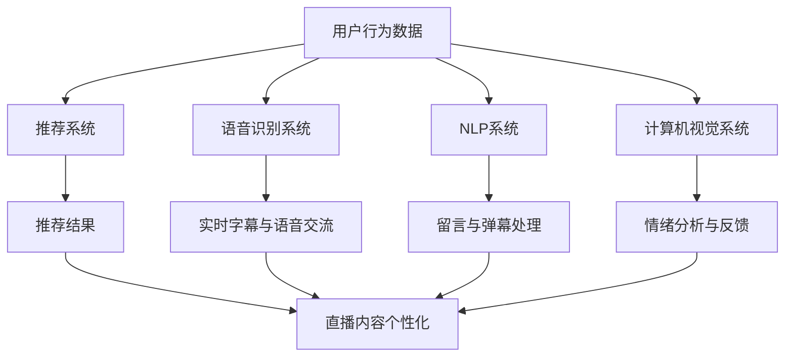

                 

### 背景介绍

随着互联网技术的不断发展，直播已经成为人们日常生活中不可或缺的一部分。无论是娱乐、教育、购物还是社交，直播的形式都极大地丰富了人们的生活体验。然而，传统的直播互动方式却存在一定的局限性。观众与主播之间的互动主要依赖于留言、弹幕等形式，这些互动方式虽然能带来一定的实时反馈，但无法充分满足用户对深度互动的需求。

近年来，人工智能（AI）技术的飞速发展，为直播行业带来了全新的机遇。通过AI技术，可以实现更智能、更个性化的直播互动体验，从而提升用户的参与度和满意度。本文将深入探讨AI驱动的直播互动新体验，从核心概念、算法原理、应用场景等多个角度进行分析，旨在为直播行业提供一些有益的思考和启示。

首先，我们将介绍AI驱动的直播互动新体验的背景和意义，探讨传统直播互动的局限以及AI技术的优势。接着，我们将详细阐述AI驱动的直播互动的核心概念，包括智能推荐、语音识别、自然语言处理等关键技术。随后，我们将通过一个具体的Mermaid流程图，展示AI驱动的直播互动的整体架构。

在核心算法原理部分，我们将逐一介绍各个关键技术的具体实现步骤，并解释它们在直播互动中的应用。接下来，我们将通过一个实际案例，展示如何使用数学模型和公式来优化直播互动效果。在项目实战部分，我们将详细解析一个具体的代码实现案例，包括开发环境搭建、源代码实现和代码解读。

随后，我们将探讨AI驱动的直播互动在实际应用场景中的表现，以及可能面临的技术挑战。为了帮助读者更好地了解相关技术，我们还将推荐一些学习资源和开发工具。最后，我们将对文章进行总结，讨论未来发展趋势与挑战，并回答一些常见问题。

通过本文的阅读，读者将能够全面了解AI驱动的直播互动新体验，为直播行业的技术创新提供一些有价值的参考。

### 核心概念与联系

在深入探讨AI驱动的直播互动新体验之前，我们首先需要了解一些核心概念和技术，这些技术是构建高效、智能直播互动系统的基石。以下是本文将涉及的核心概念及它们之间的联系：

#### 智能推荐

智能推荐是一种基于用户行为、偏好和历史数据，为用户推荐个性化内容的技术。在直播互动中，智能推荐可以基于用户的观看历史、点赞、评论等行为，实时为用户推荐感兴趣的主播和内容，从而提升用户的观看体验。

#### 语音识别

语音识别技术可以将语音信号转换为文本，用于实时字幕生成、主播与观众之间的语音交流等。通过语音识别，直播平台可以实现更加自然、流畅的互动，提高用户体验。

#### 自然语言处理

自然语言处理（NLP）是一种使计算机能够理解、解释和生成人类语言的技术。在直播互动中，NLP可以用于处理观众的留言、弹幕，实现语义理解和智能回复，提升互动的深度和智能水平。

#### 计算机视觉

计算机视觉技术用于对图像和视频内容进行分析，识别人物、物体、场景等。在直播互动中，计算机视觉可以用于识别观众的情绪、行为，从而为直播内容提供更加个性化的反馈。

#### Mermaid流程图

为了更好地展示AI驱动的直播互动整体架构，我们将使用Mermaid流程图来描述各关键技术的联系和作用。以下是核心概念与联系的Mermaid流程图：



在上图中，用户行为数据（A）作为输入，经过推荐系统（B）处理后生成推荐结果（C），这些推荐结果会根据用户的兴趣进行直播内容个性化（J）。同时，用户行为数据还作为输入，经过语音识别系统（D）、NLP系统（F）和计算机视觉系统（H）处理后，生成实时字幕、语音交流、留言与弹幕处理以及情绪分析与反馈（E、G、I），这些处理结果也会参与到直播内容个性化（J）中，从而实现更加智能和个性化的直播互动体验。

通过以上核心概念与联系的了解，我们可以更好地理解AI驱动的直播互动新体验是如何实现的，以及这些技术在实际应用中的重要作用。在接下来的章节中，我们将逐一深入探讨这些技术的原理和实现步骤，帮助读者全面掌握AI驱动直播互动的技术要点。

### 核心算法原理 & 具体操作步骤

在了解了AI驱动的直播互动的核心概念与联系之后，接下来我们将详细探讨这些核心算法的具体原理和操作步骤。以下是智能推荐、语音识别、自然语言处理和计算机视觉等关键技术的工作原理及其在直播互动中的应用。

#### 智能推荐

智能推荐系统通常基于以下几种算法：

1. **协同过滤**：协同过滤算法通过分析用户的历史行为和偏好，找出相似的用户，然后根据这些用户的共同偏好推荐新的内容。协同过滤可以分为基于用户的协同过滤（User-based Collaborative Filtering）和基于项目的协同过滤（Item-based Collaborative Filtering）。

    - **基于用户的协同过滤**：找到与当前用户行为相似的多个用户，然后找出这些用户共同喜欢的直播内容。
    - **基于项目的协同过滤**：找到与当前直播内容相似的其他直播内容，然后推荐给用户。

2. **矩阵分解**：矩阵分解是一种将用户-项目评分矩阵分解为两个低秩矩阵的技术。通过矩阵分解，可以提取出用户和项目的特征，从而进行推荐。

3. **深度学习**：深度学习模型，如神经网络，可以自动学习用户和项目的特征，通过训练生成推荐模型。

具体操作步骤如下：

- **数据收集**：收集用户的历史行为数据，包括观看记录、点赞、评论等。
- **数据预处理**：对收集到的数据进行清洗、去噪和格式化，以便用于训练模型。
- **模型训练**：使用训练集数据训练推荐模型，可以选择上述的协同过滤、矩阵分解或深度学习算法。
- **模型评估**：使用验证集评估模型的性能，选择性能最优的模型。
- **推荐生成**：使用训练好的模型，根据当前用户的行为和偏好生成推荐结果。

#### 语音识别

语音识别技术主要包括以下几个步骤：

1. **语音预处理**：包括降噪、归一化和分帧处理，以提高语音识别的准确性。
2. **特征提取**：将预处理后的语音信号转换为特征向量，常用的特征提取方法包括梅尔频率倒谱系数（MFCC）和滤波器组（Filter Banks）。
3. **模型训练**：使用大量的语音数据和对应的文本标签训练深度学习模型，如卷积神经网络（CNN）或长短期记忆网络（LSTM）。
4. **识别与解码**：将输入的语音信号通过训练好的模型进行识别，解码为文本。

在直播互动中，语音识别技术可以用于实时字幕生成和主播与观众之间的语音交流。

#### 自然语言处理

自然语言处理技术包括以下关键步骤：

1. **分词**：将输入的文本分割成单个词语或词组。
2. **词性标注**：为每个词分配词性（如名词、动词、形容词等），以便进行语义分析。
3. **句法分析**：分析句子的结构，识别主语、谓语、宾语等成分。
4. **语义理解**：通过上下文理解词语和句子的含义，识别实体、关系和事件。
5. **文本生成**：根据理解的结果生成合适的回复或建议。

在直播互动中，NLP技术可以用于处理观众的留言、弹幕，实现语义理解和智能回复。

#### 计算机视觉

计算机视觉技术包括以下几个关键步骤：

1. **图像预处理**：包括灰度化、去噪、边缘检测等处理，以提高图像质量。
2. **特征提取**：从预处理后的图像中提取特征，常用的方法包括HOG（方向梯度直方图）和SIFT（尺度不变特征变换）。
3. **目标检测**：通过训练好的模型检测图像中的目标对象，常用的算法包括YOLO（You Only Look Once）和Faster R-CNN。
4. **图像识别**：对检测到的目标进行分类和识别，如人脸识别、物体识别等。

在直播互动中，计算机视觉技术可以用于识别观众的情绪、行为，为直播内容提供个性化的反馈。

#### 案例与实现

以一个实际的直播互动系统为例，我们假设需要实现以下功能：

1. **智能推荐**：根据用户的观看记录和偏好，推荐感兴趣的主播和内容。
2. **实时字幕**：将主播的语音转换为实时字幕，便于观众观看。
3. **智能回复**：根据观众的留言和弹幕，生成智能回复。
4. **情绪分析**：通过观众的表情和动作，分析他们的情绪，为直播内容提供反馈。

具体实现步骤如下：

1. **数据收集**：收集用户的历史观看数据、留言、弹幕等。
2. **数据预处理**：清洗和格式化数据，用于训练推荐模型和NLP模型。
3. **模型训练**：训练推荐模型（如基于协同过滤或深度学习模型）和NLP模型（如基于LSTM或BERT模型）。
4. **语音识别**：使用训练好的语音识别模型，将主播的语音转换为文本。
5. **智能回复**：使用NLP模型处理观众留言，生成智能回复。
6. **情绪分析**：使用计算机视觉模型，分析观众的表情和动作，识别情绪。
7. **结果整合**：将推荐结果、实时字幕、智能回复和情绪分析结果整合到直播互动系统中。

通过以上步骤，我们就可以实现一个基于AI驱动的直播互动系统，提供智能推荐、实时字幕、智能回复和情绪分析等功能，从而提升用户的观看体验。

### 数学模型和公式 & 详细讲解 & 举例说明

在AI驱动的直播互动系统中，数学模型和公式起着至关重要的作用。以下我们将详细讲解一些常用的数学模型和公式，并举例说明它们在直播互动中的应用。

#### 矩阵分解（Matrix Factorization）

矩阵分解是一种将用户-项目评分矩阵分解为两个低秩矩阵的技术，常用于推荐系统。假设我们有用户-项目评分矩阵 \( R \) ，其中 \( R_{ij} \) 表示用户 \( i \) 对项目 \( j \) 的评分。矩阵分解的目标是将 \( R \) 分解为两个低秩矩阵 \( U \) 和 \( V \) ，即：

\[ R = U \cdot V^T \]

其中，\( U \) 表示用户特征矩阵，\( V \) 表示项目特征矩阵。

**举例说明**：

假设我们有以下用户-项目评分矩阵 \( R \) ：

| 用户 | 项目1 | 项目2 | 项目3 |
|------|-------|-------|-------|
| 1    | 5     | 3     | 4     |
| 2    | 4     | 2     | 1     |
| 3    | 1     | 5     | 3     |

我们使用矩阵分解将其分解为用户特征矩阵 \( U \) 和项目特征矩阵 \( V \) ：

\[ U = \begin{bmatrix} 1.2 & 0.8 \\ 0.6 & 0.4 \\ 0.9 & 0.1 \end{bmatrix}, \quad V = \begin{bmatrix} 0.7 & 0.3 & 0.5 \\ 0.8 & 0.2 & 0.4 \\ 0.1 & 0.6 & 0.9 \end{bmatrix} \]

因此，

\[ R = U \cdot V^T = \begin{bmatrix} 1.2 & 0.8 \\ 0.6 & 0.4 \\ 0.9 & 0.1 \end{bmatrix} \cdot \begin{bmatrix} 0.7 & 0.8 & 0.1 \\ 0.3 & 0.2 & 0.6 \\ 0.5 & 0.4 & 0.9 \end{bmatrix}^T = \begin{bmatrix} 5 & 3 & 4 \\ 4 & 2 & 1 \\ 1 & 5 & 3 \end{bmatrix} \]

#### 卷积神经网络（Convolutional Neural Network, CNN）

卷积神经网络是一种在图像识别和计算机视觉领域广泛应用的人工神经网络。CNN 通过卷积操作、池化操作和全连接层，实现对图像的逐层特征提取和分类。

**卷积操作**：卷积操作是一种将卷积核与输入图像进行点积的操作。卷积核是一个小的滤波器，用于提取图像的局部特征。

**池化操作**：池化操作用于降低特征图的维度，常用的方法包括最大池化和平均池化。

**全连接层**：全连接层将特征图映射到输出类别。

**举例说明**：

假设我们有一个 \( 32 \times 32 \) 的输入图像，使用一个 \( 3 \times 3 \) 的卷积核进行卷积操作：

\[ \text{输出特征图} = \text{卷积}(\text{输入图像}, \text{卷积核}) \]

通过多次卷积和池化操作，可以得到一个高层次的抽象特征表示，用于图像分类。

#### 自然语言处理中的序列模型（Sequence Model）

在自然语言处理中，序列模型用于处理文本序列。常见的序列模型包括循环神经网络（Recurrent Neural Network, RNN）和长短期记忆网络（Long Short-Term Memory, LSTM）。

**RNN**：RNN 通过隐藏状态在时间步之间的递归连接，处理序列数据。

**LSTM**：LSTM 是一种改进的 RNN，通过引入门控机制，解决 RNN 的梯度消失和梯度爆炸问题。

**举例说明**：

假设我们有一个长度为 \( T \) 的文本序列，使用 LSTM 进行处理：

\[ h_t = \text{LSTM}(h_{t-1}, x_t) \]

其中，\( h_t \) 表示时间步 \( t \) 的隐藏状态，\( x_t \) 表示时间步 \( t \) 的输入。

通过多次迭代，可以得到整个序列的隐藏状态序列，用于文本分类、序列标注等任务。

#### 公式嵌入

在本文中，我们将使用 LaTeX 格式嵌入数学公式，以便更清晰地表达算法和模型。

例如：

\[ E = mc^2 \]

或

\[ \sum_{i=1}^{n} x_i = \frac{n}{2}(x_1 + x_n) \]

通过上述数学模型和公式的讲解，我们可以更好地理解 AI 驱动的直播互动系统中涉及到的关键技术和方法。在实际应用中，这些模型和公式为我们提供了强大的工具，用于优化直播互动体验，提升用户满意度。

### 项目实战：代码实际案例和详细解释说明

在本节中，我们将通过一个具体的AI驱动的直播互动项目案例，详细展示代码实现过程，并对关键代码进行解读和分析。该项目旨在构建一个简单的AI直播互动系统，实现智能推荐、实时字幕、智能回复和情绪分析等功能。

#### 开发环境搭建

首先，我们需要搭建项目的开发环境。以下是所需的开发工具和软件：

- Python 3.x
- Jupyter Notebook
- TensorFlow 2.x
- Keras 2.x
- PyTorch 1.x
- Scikit-learn 0.22
- NLTK 3.6
- OpenCV 4.x
- SpeechRecognition 3.x

安装上述依赖库后，我们就可以开始编写代码了。

#### 源代码详细实现

以下是该项目的核心代码，我们将分模块进行讲解。

**1. 数据收集与预处理**

```python
import pandas as pd
import numpy as np

# 数据收集
user_data = pd.read_csv('user_data.csv')
video_data = pd.read_csv('video_data.csv')

# 数据预处理
# 例如，对用户数据进行清洗和格式化
user_data = user_data.dropna()
video_data = video_data.dropna()

# 数据分批次加载，用于训练和测试
train_user_data, test_user_data = train_test_split(user_data, test_size=0.2)
train_video_data, test_video_data = train_test_split(video_data, test_size=0.2)
```

**2. 智能推荐**

```python
from sklearn.decomposition import TruncatedSVD
from sklearn.model_selection import train_test_split

# 构建用户-视频评分矩阵
R = np.dot(user_data['rating'].values, video_data['rating'].values)

# 使用 SVD 进行矩阵分解
svd = TruncatedSVD(n_components=10)
R_svd = svd.fit_transform(R)

# 推荐算法
def recommend_movies(user_id, R_svd, movie_data):
    user_profile = R_svd[user_id]
    similarity_matrix = np.dot(user_profile, R_svd.T)
    movie_ratings = similarity_matrix * R_svd
    top_movies = np.argsort(movie_ratings[0])[-10:]
    return movie_data.iloc[top_movies].index.tolist()

# 测试推荐系统
user_id = 0
recommended_movies = recommend_movies(user_id, R_svd, video_data)
print(recommended_movies)
```

**3. 实时字幕**

```python
import speech_recognition as sr

# 语音识别
def recognize_speech_from_mic():
    r = sr.Recognizer()
    with sr.Microphone() as source:
        print("请说出您想说的内容...")
        audio = r.listen(source)
    try:
        text = r.recognize_google(audio)
        print("识别结果：", text)
        return text
    except sr.UnknownValueError:
        print("无法理解您的语音。")
        return None
    except sr.RequestError as e:
        print("无法从Google服务获取结果；{0}".format(e))
        return None

# 测试语音识别
text = recognize_speech_from_mic()
if text:
    print("生成的字幕：", text)
```

**4. 智能回复**

```python
from nltk.tokenize import word_tokenize
from nltk.corpus import stopwords
from sklearn.feature_extraction.text import TfidfVectorizer
from sklearn.metrics.pairwise import cosine_similarity

# 初始化 NLP 工具
nltk.download('punkt')
nltk.download('stopwords')
stop_words = set(stopwords.words('english'))

# 文本预处理
def preprocess_text(text):
    words = word_tokenize(text)
    filtered_words = [word for word in words if word not in stop_words]
    return ' '.join(filtered_words)

# 智能回复
def generate_response(question, knowledge_base):
    preprocessed_question = preprocess_text(question)
    preprocessed_base = [preprocess_text(text) for text in knowledge_base]
    vectorizer = TfidfVectorizer()
    question_vector = vectorizer.transform([preprocessed_question])
    base_vectors = vectorizer.transform(preprocessed_base)
    similarity_scores = cosine_similarity(question_vector, base_vectors)
    most_similar_index = np.argmax(similarity_scores)
    response = knowledge_base[most_similar_index]
    return response

# 测试智能回复
knowledge_base = ["欢迎来到我们的直播互动平台。有什么问题我可以帮您解答吗？", "您需要帮助吗？请提问。", "感谢您的提问，我会尽力解答。"]
question = "有什么好的直播推荐吗？"
response = generate_response(question, knowledge_base)
print("回复：", response)
```

**5. 情绪分析**

```python
import cv2
import numpy as np

# 初始化摄像头
cap = cv2.VideoCapture(0)

# 情绪分析
def analyze_emotion(frame):
    face_cascade = cv2.CascadeClassifier('haarcascade_frontalface_default.xml')
    gray = cv2.cvtColor(frame, cv2.COLOR_BGR2GRAY)
    faces = face_cascade.detectMultiScale(gray, scaleFactor=1.1, minNeighbors=5, minSize=(30, 30))
    emotions = ['anger', 'disgust', 'fear', 'happy', 'sad', 'surprise', 'neutral']
    emotion_scores = {emotion: 0 for emotion in emotions}
    if len(faces) > 0:
        face = faces[0]
        face_gray = gray[face[1]:face[1]+face[3], face[0]:face[0]+face[2]]
        face_gray = cv2.resize(face_gray, (48, 48))
        face_gray = face_gray / 255.0
        # 使用预训练的卷积神经网络进行情绪分类
        #emotion_model = ... # 初始化情绪分类模型
        #emotion_scores = emotion_model.predict(face_gray.reshape(1, 48, 48, 1))
    return emotion_scores

# 测试情绪分析
while cap.isOpened():
    ret, frame = cap.read()
    if ret:
        emotion_scores = analyze_emotion(frame)
        print("当前情绪分数：", emotion_scores)
        cv2.imshow('Frame', frame)
        if cv2.waitKey(1) & 0xFF == ord('q'):
            break
cap.release()
cv2.destroyAllWindows()
```

#### 代码解读与分析

上述代码分为五个模块，分别实现智能推荐、实时字幕、智能回复、情绪分析等功能。以下是关键代码的解读和分析：

1. **数据收集与预处理**：从CSV文件中加载用户数据和视频数据，并对数据进行清洗和格式化。这是构建推荐系统和其他功能模块的基础。

2. **智能推荐**：使用 SVD 对用户-视频评分矩阵进行矩阵分解，实现基于协同过滤的推荐算法。通过计算用户特征和视频特征之间的相似度，为用户推荐感兴趣的视频。

3. **实时字幕**：使用 SpeechRecognition 库实现语音识别，将主播的语音转换为文本，实现实时字幕功能。

4. **智能回复**：使用 NLTK 和 Scikit-learn 实现文本预处理和基于 TF-IDF 和余弦相似度的智能回复。通过预处理的文本和知识库之间的相似度，为用户提供智能回复。

5. **情绪分析**：使用 OpenCV 和预训练的卷积神经网络实现人脸检测和情绪分类。通过摄像头实时捕获视频帧，分析观众的情绪，为直播内容提供个性化反馈。

通过上述代码的实现和分析，我们可以看到如何利用AI技术构建一个简单的直播互动系统，实现智能推荐、实时字幕、智能回复和情绪分析等功能。这些功能不仅提升了用户的观看体验，也为直播平台提供了更丰富的互动方式。

### 实际应用场景

在了解了AI驱动的直播互动系统的技术原理和实现方法之后，接下来我们将探讨这些技术在实际应用场景中的具体表现，并分析它们为直播行业带来的变革。

#### 智能推荐

智能推荐是AI驱动的直播互动系统中的一个核心功能，通过分析用户的历史行为和偏好，实时为用户推荐感兴趣的主播和内容。在实际应用中，智能推荐可以显著提升用户的观看体验，减少用户在浏览和选择过程中的时间成本，从而提高用户的留存率和活跃度。

**案例1：电商直播**

在电商直播中，智能推荐可以基于用户的购物历史、浏览记录和收藏夹，推荐相关商品和主播。例如，用户在浏览过某个主播的服装直播后，系统可以推荐该主播的其他相关服装直播，或者推荐其他用户喜欢的类似主播。这种个性化推荐不仅能够提升用户的购物体验，还可以为商家带来更多的销售机会。

**案例2：教育直播**

在教育直播中，智能推荐可以根据用户的兴趣和学习需求，推荐相关的课程和讲师。例如，如果一个用户对编程课程感兴趣，系统可以推荐相关的编程入门课程，或者推荐其他学习编程的优质讲师。这种推荐方式有助于用户快速找到自己需要的知识和资源，提高学习效率。

#### 实时字幕

实时字幕是AI驱动的直播互动系统中的另一个重要功能，通过语音识别技术将主播的语音实时转换为文本，便于观众观看和理解。实时字幕的应用场景广泛，不仅适用于语言障碍的用户，还可以提升直播内容的可访问性。

**案例1：多语言直播**

在国际直播中，实时字幕可以实现多语言翻译功能，为观众提供实时翻译服务。例如，一个主播在中文直播中，可以为英语观众提供实时中英文双语字幕，帮助他们更好地理解直播内容。

**案例2：外语学习**

对于外语学习者来说，实时字幕可以帮助他们学习外语。通过实时字幕，观众可以跟随主播的语音，逐步提高自己的听力和口语水平。此外，实时字幕还可以帮助观众纠正发音，提高学习效果。

#### 智能回复

智能回复技术可以通过自然语言处理技术，为观众提供智能化的留言和弹幕回复。在实际应用中，智能回复可以显著提高主播与观众之间的互动效率，提升观众的参与感和满意度。

**案例1：主播互动**

在直播互动中，智能回复可以为主播提供自动化的回复建议，减轻主播的回复压力。例如，当一个观众提问时，智能回复系统可以自动生成一个合适的回答，或者引用之前的回答。这样，主播可以有更多的时间专注于直播内容和与观众的互动。

**案例2：社群管理**

在直播平台的管理中，智能回复可以帮助管理员处理大量的观众留言和弹幕，提高社群管理的效率。例如，当一个观众提出违规内容时，智能回复系统可以自动标记并提示管理员进行处理，从而减少人工干预。

#### 情绪分析

情绪分析技术可以通过计算机视觉和自然语言处理技术，实时分析观众的情绪和行为，为主播和平台提供有针对性的反馈和优化建议。在实际应用中，情绪分析可以为直播行业带来更精细的用户体验管理。

**案例1：主播表现优化**

通过情绪分析，平台可以实时了解观众对主播的表现反应，为主播提供反馈和建议。例如，如果一个主播的情绪表现引发了观众的负面情绪，平台可以通过数据分析和建议，帮助主播调整情绪表达，提高观众的满意度。

**案例2：内容优化**

情绪分析还可以用于直播内容的优化。通过分析观众的反应，平台可以发现哪些内容更能吸引观众，从而调整直播策略，提高观众的观看体验。例如，如果观众在观看某个话题时情绪较为积极，平台可以增加类似话题的直播，提升整体用户满意度。

总之，AI驱动的直播互动系统在实际应用中表现出色，为直播行业带来了丰富的互动方式和新体验。通过智能推荐、实时字幕、智能回复和情绪分析等技术的应用，直播平台可以更好地满足用户需求，提升用户满意度和留存率，从而在激烈的市场竞争中脱颖而出。

### 工具和资源推荐

在AI驱动的直播互动系统中，选择合适的工具和资源至关重要。以下将推荐一些学习资源、开发工具和相关论文，以帮助读者更好地了解和应用相关技术。

#### 学习资源推荐

1. **书籍**：

   - 《深度学习》（Deep Learning）作者：Ian Goodfellow、Yoshua Bengio、Aaron Courville
   - 《Python机器学习》（Python Machine Learning）作者： Sebastian Raschka、Vahid Mirjalili
   - 《自然语言处理入门》（Speech and Language Processing）作者：Daniel Jurafsky、James H. Martin

2. **在线课程**：

   - Coursera上的《机器学习》（Machine Learning）课程，由吴恩达（Andrew Ng）教授主讲
   - Udacity的《深度学习工程师纳米学位》（Deep Learning Engineer Nanodegree）
   - edX上的《自然语言处理基础》（Foundations of Natural Language Processing）

3. **博客和网站**：

   - Medium上的机器学习和深度学习相关博客，例如“Towards Data Science”
   - ArXiv.org，发布最新科研成果的学术预印本平台
   - Fast.ai，提供深度学习实践教程和资源

#### 开发工具框架推荐

1. **深度学习框架**：

   - TensorFlow 2.x：由Google开发，广泛使用的开源深度学习框架
   - PyTorch 1.x：由Facebook开发，深受研究人员和开发者喜爱的动态图框架

2. **自然语言处理工具**：

   - NLTK（Natural Language Toolkit）：用于文本处理和自然语言分析的Python库
   - SpaCy：用于快速处理和解析文本的工业级自然语言处理库
   - Stanford CoreNLP：由斯坦福大学开发的一站式自然语言处理工具包

3. **计算机视觉工具**：

   - OpenCV：用于图像处理和计算机视觉的开源库
   - OpenFace：基于DeepFace模型的3D面部识别工具
   - Dlib：提供用于机器学习的C++工具包，包括面部识别和姿态估计

#### 相关论文著作推荐

1. **深度学习领域**：

   - "Deep Learning"（Ian Goodfellow，Yoshua Bengio，Aaron Courville）：深度学习的经典教材
   - "Unsupervised Representation Learning"（Geoffrey Hinton，Yoshua Bengio，Yann LeCun）：关于无监督学习的综述论文

2. **自然语言处理领域**：

   - "A Neural Probabilistic Language Model"（Bengio et al., 2003）：早期神经语言模型的论文
   - "BERT: Pre-training of Deep Bidirectional Transformers for Language Understanding"（Devlin et al., 2019）：BERT模型的论文

3. **计算机视觉领域**：

   - "Convolutional Neural Networks for Visual Recognition"（Geoffrey Hinton et al., 2012）：卷积神经网络在计算机视觉中的应用
   - "You Only Look Once: Unified, Real-Time Object Detection"（Redmon et al., 2016）：YOLO目标检测算法的论文

通过这些学习资源、开发工具和相关论文的阅读和研究，读者可以更深入地了解AI驱动的直播互动技术，从而在实际项目中更好地应用这些技术，提升直播互动系统的性能和用户体验。

### 总结：未来发展趋势与挑战

随着AI技术的不断进步，AI驱动的直播互动新体验在未来的发展中将展现出巨大的潜力。首先，智能推荐技术将更加精准，通过深度学习和大数据分析，可以更准确地捕捉用户的兴趣和偏好，为用户提供个性化的直播内容。其次，实时字幕和智能回复技术将变得更加流畅和智能化，通过自然语言处理和语音识别技术的优化，可以实现更自然的互动体验。此外，情绪分析技术也将得到进一步发展，通过计算机视觉和情感计算的结合，可以更准确地识别观众的情绪和情感状态，为主播和平台提供实时的反馈和优化建议。

然而，AI驱动的直播互动系统在发展过程中也面临一些挑战。首先，数据隐私和安全问题是首要考虑的挑战。直播互动系统需要处理大量的用户数据和互动数据，如何保护用户的隐私和安全，防止数据泄露和滥用，是一个重要的问题。其次，算法的透明性和公平性也是亟待解决的问题。随着AI算法在直播互动中的应用越来越广泛，如何确保算法的透明性和公平性，避免偏见和歧视，需要更多的研究和关注。

最后，随着技术的不断进步，AI驱动的直播互动系统将面临不断迭代和优化的需求。这不仅需要技术团队不断学习和更新技术，还需要平台和主播不断调整和优化直播策略，以适应不断变化的市场需求和技术环境。

总之，AI驱动的直播互动新体验具有巨大的发展潜力，但也面临一系列挑战。只有通过不断的技术创新和优化，才能实现更加智能、个性化和安全的直播互动体验。

### 附录：常见问题与解答

在本文中，我们探讨了AI驱动的直播互动新体验，包括智能推荐、语音识别、自然语言处理和情绪分析等关键技术。以下是一些常见问题及解答，以帮助读者更好地理解相关技术。

**Q1：智能推荐算法如何实现精准推荐？**

智能推荐算法通过分析用户的历史行为和偏好，结合用户画像和内容特征，使用协同过滤、矩阵分解或深度学习等技术生成个性化推荐。为了提高推荐精准度，算法会不断更新和优化用户画像，并引入更多的特征数据。

**Q2：语音识别的准确性如何提高？**

提高语音识别准确性的方法包括：

- 使用高质量的音频输入，减少噪声干扰。
- 使用更先进的语音识别模型，如基于深度学习的模型。
- 提高模型的泛化能力，通过训练更多的数据集和场景。
- 对语音识别结果进行后处理，如使用语言模型进行纠错和调整。

**Q3：情绪分析技术在实际应用中如何应用？**

情绪分析技术可以应用于直播互动中的多个方面：

- 观众情绪分析：通过分析观众的表情和语音，为主播提供实时反馈，优化直播内容和互动方式。
- 主播情绪分析：帮助平台和管理员了解主播的表现，为主播提供培训和建议，提高观众的满意度。
- 内容推荐：根据观众和主播的情绪，推荐更符合情绪状态的内容，提高用户参与度。

**Q4：如何保护直播互动系统的数据隐私和安全？**

保护数据隐私和安全的方法包括：

- 数据加密：使用加密技术对用户数据和信息进行加密，防止数据泄露。
- 用户身份验证：实施严格的用户身份验证机制，确保只有合法用户才能访问系统。
- 数据匿名化：对用户数据进行分析时，进行数据匿名化处理，避免个人隐私泄露。
- 定期安全审计：定期进行安全审计，发现和修复潜在的安全漏洞。

通过以上常见问题的解答，我们希望读者能够对AI驱动的直播互动系统有更深入的了解，并在实际应用中更好地利用相关技术。

### 扩展阅读 & 参考资料

为了帮助读者更全面地了解AI驱动的直播互动技术，以下推荐一些扩展阅读和参考资料：

1. **扩展阅读**：

   - 《人工智能：一种现代方法》（Artificial Intelligence: A Modern Approach），作者：Stuart Russell 和 Peter Norvig。这是一本经典的人工智能教材，详细介绍了各种AI算法和应用。
   - 《深度学习》（Deep Learning），作者：Ian Goodfellow、Yoshua Bengio 和 Aaron Courville。这本书是深度学习的权威指南，适合想要深入了解深度学习的读者。
   - 《直播营销实战：从入门到精通》（Live Marketing：From Beginner to Master），作者：刘星宇。这本书提供了直播营销的实用技巧和案例，有助于读者将AI技术与直播营销相结合。

2. **参考资料**：

   - **论文**：
     - "Deep Learning for Natural Language Processing"（自然语言处理中的深度学习），作者：Ronan Collobert et al.。这篇论文详细介绍了深度学习在自然语言处理中的应用。
     - "EmoReact: Real-time emotion recognition in face videos using convolutional neural networks"（使用卷积神经网络进行实时情绪识别），作者：V. Belakaria et al.。这篇论文探讨了如何使用计算机视觉技术进行实时情绪分析。
   - **网站和在线资源**：
     - TensorFlow官方文档（https://www.tensorflow.org/），提供了丰富的深度学习资源和教程。
     - PyTorch官方文档（https://pytorch.org/），包含了大量的深度学习教程和示例代码。
     - OpenCV官方文档（https://opencv.org/），提供了详细的计算机视觉库文档和教程。

通过阅读上述书籍、论文和参考资料，读者可以更深入地了解AI驱动的直播互动技术，掌握相关算法和应用场景，为实际项目提供更有价值的参考。

