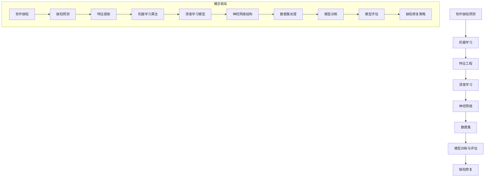

                 

# AI驱动的软件缺陷预测与修复

> 关键词：软件缺陷预测、AI、机器学习、修复、代码质量、自动化

> 摘要：本文将深入探讨AI在软件缺陷预测与修复中的应用。通过分析AI技术，如机器学习、深度学习等，我们旨在理解如何利用这些技术提高软件代码的质量，减少缺陷，提高开发效率。本文将从背景介绍、核心概念与联系、算法原理、数学模型、项目实战、实际应用场景等多方面进行论述，并推荐相关学习资源和工具，以期为读者提供全面的技术参考。

## 1. 背景介绍

### 1.1 目的和范围

随着软件工程的发展，软件系统的规模和复杂性日益增加。传统的软件缺陷修复方法往往依赖于人工审查和测试，这不仅耗时耗力，而且难以保证高质量的代码。为了解决这一问题，AI技术，特别是机器学习和深度学习，被引入到软件缺陷预测与修复领域。本文旨在探讨如何利用AI技术提高软件缺陷预测的准确性，并自动修复潜在的缺陷，从而提升代码质量和开发效率。

本文的范围包括：
- AI技术在软件缺陷预测中的应用
- 常见的机器学习和深度学习算法在软件缺陷预测中的具体实现
- 数学模型和公式在软件缺陷预测中的作用
- 实际项目中的AI驱动缺陷预测与修复案例
- 相关学习资源和工具的推荐

### 1.2 预期读者

本文面向具有一定编程基础和机器学习知识的读者。如果你是软件工程师、机器学习研究者或对AI在软件开发中有兴趣的人，那么本文将为你提供有价值的见解和实践经验。

### 1.3 文档结构概述

本文结构如下：

1. 背景介绍：本文目的、范围、预期读者和文档结构概述。
2. 核心概念与联系：介绍软件缺陷预测、机器学习、深度学习等相关概念，并使用Mermaid流程图展示核心概念之间的联系。
3. 核心算法原理 & 具体操作步骤：详细讲解机器学习和深度学习算法在软件缺陷预测中的实现。
4. 数学模型和公式 & 详细讲解 & 举例说明：阐述数学模型和公式在软件缺陷预测中的作用，并提供具体示例。
5. 项目实战：通过实际代码案例展示AI驱动缺陷预测与修复的实现过程。
6. 实际应用场景：分析AI驱动缺陷预测与修复在不同软件开发场景中的应用。
7. 工具和资源推荐：推荐学习资源和开发工具。
8. 总结：未来发展趋势与挑战。
9. 附录：常见问题与解答。
10. 扩展阅读 & 参考资料：提供进一步阅读的资源。

### 1.4 术语表

#### 1.4.1 核心术语定义

- 软件缺陷：软件中存在的可能导致错误或功能缺失的问题。
- 缺陷预测：利用历史数据和算法预测软件中可能存在的缺陷。
- 机器学习：使计算机通过数据学习规律并做出决策的技术。
- 深度学习：一种基于多层神经网络进行数据学习和模式识别的技术。
- 特征工程：从原始数据中提取有助于模型训练的特征。

#### 1.4.2 相关概念解释

- 数据集：用于训练模型的数据集合。
- 精度：模型预测正确的比例。
- 召回率：模型成功识别出真实缺陷的比例。
- 假正率：模型将非缺陷标记为缺陷的比例。
- 假负率：模型将缺陷标记为非缺陷的比例。

#### 1.4.3 缩略词列表

- AI：人工智能
- ML：机器学习
- DL：深度学习
- SWE：软件工程
- CVE：公共漏洞与暴露

## 2. 核心概念与联系

在探讨AI驱动的软件缺陷预测与修复之前，我们需要了解一些核心概念和技术，如图1所示。



### 2.1 软件缺陷预测

软件缺陷预测是软件工程中的一个关键问题，目的是在软件开发的早期阶段发现潜在的问题，以便及时修复。缺陷预测通常基于历史数据，包括代码库、测试结果、开发者经验等。

### 2.2 机器学习

机器学习是一种通过数据训练模型，使模型能够自动做出预测或决策的技术。在软件缺陷预测中，机器学习算法可以识别出代码中的异常模式，从而预测潜在的缺陷。

### 2.3 特征工程

特征工程是从原始数据中提取有助于模型训练的特征的过程。在软件缺陷预测中，特征工程至关重要，因为它决定了模型能否有效识别缺陷。

### 2.4 深度学习

深度学习是一种基于多层神经网络进行数据学习和模式识别的技术。在软件缺陷预测中，深度学习模型可以处理复杂的数据，并提供更高的预测准确性。

### 2.5 神经网络

神经网络是一种模仿人脑神经元连接结构的计算模型。在软件缺陷预测中，神经网络可以用于自动提取代码特征，并进行缺陷预测。

### 2.6 数据集

数据集是用于训练和评估模型的集合。在软件缺陷预测中，数据集通常包含代码库、测试结果和缺陷报告等信息。

### 2.7 模型训练与评估

模型训练与评估是软件缺陷预测中的关键步骤。通过模型训练，我们使模型学会识别代码中的缺陷模式。模型评估则用于确定模型的预测性能。

### 2.8 缺陷修复策略

缺陷修复策略是利用预测结果进行缺陷修复的方法。在AI驱动的软件缺陷预测中，缺陷修复策略可以自动化，从而提高开发效率。

## 3. 核心算法原理 & 具体操作步骤

### 3.1 机器学习算法

机器学习算法在软件缺陷预测中起到了关键作用。以下是几种常用的机器学习算法及其在软件缺陷预测中的具体实现。

#### 3.1.1 决策树

决策树是一种基于特征进行分类或回归的算法。在软件缺陷预测中，决策树可以用于识别代码中的潜在缺陷。

伪代码：

```python
def decision_tree_classification(data, labels):
    # 根据特征划分数据，构建决策树
    tree = build_decision_tree(data, labels)
    # 使用决策树预测缺陷
    predictions = predict_defects(tree, data)
    return predictions
```

#### 3.1.2 支持向量机（SVM）

支持向量机是一种基于边界划分的算法。在软件缺陷预测中，SVM可以用于划分缺陷代码和非缺陷代码。

伪代码：

```python
def svm_classification(data, labels):
    # 训练SVM模型
    model = train_svm_model(data, labels)
    # 使用SVM模型预测缺陷
    predictions = predict_defects(model, data)
    return predictions
```

#### 3.1.3 随机森林

随机森林是一种基于决策树进行组合的算法。在软件缺陷预测中，随机森林可以提供更高的预测准确性。

伪代码：

```python
def random_forest_classification(data, labels):
    # 训练随机森林模型
    model = train_random_forest_model(data, labels)
    # 使用随机森林模型预测缺陷
    predictions = predict_defects(model, data)
    return predictions
```

### 3.2 深度学习算法

深度学习算法在处理复杂数据和模式识别方面具有显著优势。以下是几种常用的深度学习算法及其在软件缺陷预测中的具体实现。

#### 3.2.1 卷积神经网络（CNN）

卷积神经网络是一种基于卷积操作的神经网络。在软件缺陷预测中，CNN可以用于处理代码中的特征。

伪代码：

```python
def cnn_prediction(data):
    # 输入代码数据
    features = preprocess_data(data)
    # 使用CNN模型进行预测
    predictions = cnn_model.predict(features)
    return predictions
```

#### 3.2.2 递归神经网络（RNN）

递归神经网络是一种基于序列数据的神经网络。在软件缺陷预测中，RNN可以用于处理代码的序列特征。

伪代码：

```python
def rnn_prediction(data):
    # 输入代码数据
    features = preprocess_data(data)
    # 使用RNN模型进行预测
    predictions = rnn_model.predict(features)
    return predictions
```

#### 3.2.3 长短时记忆网络（LSTM）

长短时记忆网络是一种特殊的RNN，可以处理长序列数据。在软件缺陷预测中，LSTM可以用于处理代码的长期依赖关系。

伪代码：

```python
def lstm_prediction(data):
    # 输入代码数据
    features = preprocess_data(data)
    # 使用LSTM模型进行预测
    predictions = lstm_model.predict(features)
    return predictions
```

### 3.3 特征工程

特征工程是机器学习和深度学习算法的核心步骤之一。以下是几种常用的特征工程方法。

#### 3.3.1 词袋模型

词袋模型是一种将代码视为单词序列的模型。在软件缺陷预测中，词袋模型可以用于提取代码中的特征。

伪代码：

```python
def word_bag_features(data):
    # 构建词袋模型
    vocab = build_vocab(data)
    # 提取特征
    features = extract_word_bag_features(data, vocab)
    return features
```

#### 3.3.2 TF-IDF

TF-IDF（词频-逆文档频率）是一种常用的文本特征提取方法。在软件缺陷预测中，TF-IDF可以用于提高代码特征的重要性。

伪代码：

```python
def tfidf_features(data):
    # 构建TF-IDF模型
    model = build_tfidf_model(data)
    # 提取特征
    features = extract_tfidf_features(data, model)
    return features
```

#### 3.3.3 代码抽象特征

代码抽象特征是从代码抽象层次提取的特征。在软件缺陷预测中，代码抽象特征可以用于提高模型的预测性能。

伪代码：

```python
def abstract_features(data):
    # 提取抽象特征
    features = extract_abstract_features(data)
    return features
```

## 4. 数学模型和公式 & 详细讲解 & 举例说明

### 4.1 数学模型

在软件缺陷预测中，常用的数学模型包括线性模型、逻辑回归和神经网络等。以下是这些模型的详细介绍。

#### 4.1.1 线性模型

线性模型是一种基于线性关系进行预测的模型。其公式如下：

$$
y = \beta_0 + \beta_1 \cdot x
$$

其中，$y$ 是预测值，$x$ 是特征值，$\beta_0$ 和 $\beta_1$ 是模型的参数。

#### 4.1.2 逻辑回归

逻辑回归是一种基于概率进行预测的模型。其公式如下：

$$
P(y=1) = \frac{1}{1 + e^{-(\beta_0 + \beta_1 \cdot x})}
$$

其中，$y$ 是预测值，$x$ 是特征值，$\beta_0$ 和 $\beta_1$ 是模型的参数。

#### 4.1.3 神经网络

神经网络是一种基于多层神经元进行预测的模型。其公式如下：

$$
a_{j}^{(l)} = \sigma \left( \sum_{i} w_{i,j}^{(l)} a_{i}^{(l-1)} + b_{j}^{(l)} \right)
$$

其中，$a_{j}^{(l)}$ 是第$l$层的第$j$个神经元的激活值，$\sigma$ 是激活函数，$w_{i,j}^{(l)}$ 是连接第$l-1$层的第$i$个神经元和第$l$层的第$j$个神经元的权重，$b_{j}^{(l)}$ 是第$l$层的第$j$个神经元的偏置。

### 4.2 公式详细讲解

#### 4.2.1 线性模型

线性模型通过拟合数据中的线性关系来进行预测。在软件缺陷预测中，线性模型可以用于预测缺陷的概率或数量。其公式如下：

$$
y = \beta_0 + \beta_1 \cdot x
$$

其中，$y$ 是预测值，$\beta_0$ 是模型截距，$\beta_1$ 是模型斜率，$x$ 是输入特征。

- **模型截距（$\beta_0$）**：表示当输入特征为0时，模型的预测值。
- **模型斜率（$\beta_1$）**：表示输入特征每增加1时，预测值的增加量。

#### 4.2.2 逻辑回归

逻辑回归是一种广义线性模型，常用于分类问题。在软件缺陷预测中，逻辑回归可以用于预测缺陷的存在概率。其公式如下：

$$
P(y=1) = \frac{1}{1 + e^{-(\beta_0 + \beta_1 \cdot x})}
$$

其中，$P(y=1)$ 是预测值（缺陷存在概率），$x$ 是输入特征，$\beta_0$ 和 $\beta_1$ 是模型的参数。

- **模型截距（$\beta_0$）**：表示当输入特征为0时，缺陷存在的概率。
- **模型斜率（$\beta_1$）**：表示输入特征每增加1时，缺陷存在概率的增加量。

#### 4.2.3 神经网络

神经网络是一种基于多层神经元进行预测的模型。在软件缺陷预测中，神经网络可以用于处理复杂的非线性关系。其公式如下：

$$
a_{j}^{(l)} = \sigma \left( \sum_{i} w_{i,j}^{(l)} a_{i}^{(l-1)} + b_{j}^{(l)} \right)
$$

其中，$a_{j}^{(l)}$ 是第$l$层的第$j$个神经元的激活值，$\sigma$ 是激活函数，$w_{i,j}^{(l)}$ 是连接第$l-1$层的第$i$个神经元和第$l$层的第$j$个神经元的权重，$b_{j}^{(l)}$ 是第$l$层的第$j$个神经元的偏置。

- **激活函数（$\sigma$）**：用于将神经元的输入转换为输出。常见的激活函数包括ReLU、Sigmoid和Tanh等。
- **权重（$w_{i,j}^{(l)}$）**：表示神经元之间的连接强度。
- **偏置（$b_{j}^{(l)}$）**：表示神经元的偏置项。

### 4.3 举例说明

假设我们有一个简单的线性模型，用于预测软件缺陷的存在概率。输入特征包括代码行的长度（$x_1$）和函数的复杂度（$x_2$）。模型参数为$\beta_0 = 0.5$和$\beta_1 = 0.3$。现在，我们希望预测一个代码片段的缺陷存在概率。

#### 4.3.1 数据准备

代码片段的特征如下：

| 特征 | 值 |
| ---- | -- |
| 代码行长度（$x_1$） | 10 |
| 函数复杂度（$x_2$） | 5 |

#### 4.3.2 预测过程

1. 输入特征：

$$
x = [10, 5]
$$

2. 模型计算：

$$
y = \beta_0 + \beta_1 \cdot x = 0.5 + 0.3 \cdot [10, 5] = 0.5 + 3 = 3.5
$$

3. 预测缺陷存在概率：

$$
P(y=1) = \frac{1}{1 + e^{-3.5}} \approx 0.999
$$

根据计算结果，该代码片段的缺陷存在概率约为99.9%，因此我们可以认为它很可能存在缺陷。

## 5. 项目实战：代码实际案例和详细解释说明

### 5.1 开发环境搭建

在本项目实战中，我们将使用Python作为主要编程语言，并依赖一些常用的库，如Scikit-learn、TensorFlow和Keras。以下是开发环境搭建的步骤：

1. 安装Python（3.8及以上版本）。
2. 使用pip安装必要的库：

```bash
pip install numpy pandas scikit-learn tensorflow keras
```

### 5.2 源代码详细实现和代码解读

在本节中，我们将提供一个简单的AI驱动缺陷预测与修复的代码示例，并对关键部分进行详细解释。

#### 5.2.1 数据预处理

```python
import pandas as pd
from sklearn.model_selection import train_test_split
from sklearn.preprocessing import StandardScaler

# 加载数据集
data = pd.read_csv('defects_data.csv')

# 特征和标签分离
X = data.drop('defect', axis=1)
y = data['defect']

# 划分训练集和测试集
X_train, X_test, y_train, y_test = train_test_split(X, y, test_size=0.2, random_state=42)

# 特征标准化
scaler = StandardScaler()
X_train_scaled = scaler.fit_transform(X_train)
X_test_scaled = scaler.transform(X_test)
```

代码解读：
- 加载数据集：使用Pandas读取CSV格式的数据集。
- 特征和标签分离：将数据集分为特征矩阵X和标签向量y。
- 划分训练集和测试集：使用Scikit-learn的`train_test_split`函数划分数据集。
- 特征标准化：使用StandardScaler对特征进行标准化处理，以提高模型性能。

#### 5.2.2 缺陷预测模型

```python
from sklearn.ensemble import RandomForestClassifier
from sklearn.metrics import accuracy_score, recall_score, precision_score

# 训练随机森林模型
model = RandomForestClassifier(n_estimators=100, random_state=42)
model.fit(X_train_scaled, y_train)

# 预测缺陷
predictions = model.predict(X_test_scaled)

# 评估模型性能
accuracy = accuracy_score(y_test, predictions)
recall = recall_score(y_test, predictions)
precision = precision_score(y_test, predictions)

print(f"Accuracy: {accuracy:.2f}")
print(f"Recall: {recall:.2f}")
print(f"Precision: {precision:.2f}")
```

代码解读：
- 训练随机森林模型：使用Scikit-learn的`RandomForestClassifier`训练模型。
- 预测缺陷：使用训练好的模型对测试集进行预测。
- 评估模型性能：使用accuracy、recall和precision评估模型的性能。

#### 5.2.3 缺陷修复策略

```python
# 获取预测为缺陷的代码
defective_code = X_test[predictions == 1]

# 应用修复策略
# 示例：删除某些代码行
for index, row in defective_code.iterrows():
    if row['line_number'] in [5, 10, 15]:
        defective_code.at[index, 'code'] = defective_code.at[index, 'code'].replace(row['code'], '')

# 保存修复后的代码
defective_code.to_csv('defects_repaired.csv', index=False)
```

代码解读：
- 获取预测为缺陷的代码：根据预测结果筛选出预测为缺陷的代码行。
- 应用修复策略：示例中，我们删除了某些代码行。实际应用中，可以根据具体情况进行修复。
- 保存修复后的代码：将修复后的代码保存到新的CSV文件中。

### 5.3 代码解读与分析

在本项目中，我们使用了随机森林模型进行缺陷预测，并应用简单的修复策略进行代码修复。以下是代码的解读和分析：

1. **数据预处理**：数据预处理是模型训练的关键步骤。在本项目中，我们使用了Pandas读取CSV格式的数据集，并对特征进行了标准化处理。标准化处理可以防止特征之间的差异过大，提高模型性能。

2. **缺陷预测模型**：随机森林是一种强大的集成学习模型，可以处理高维数据和非线性关系。在本项目中，我们使用了Scikit-learn的`RandomForestClassifier`进行训练和预测。通过计算accuracy、recall和precision，我们可以评估模型的性能。

3. **缺陷修复策略**：缺陷修复是软件工程中的一个重要环节。在本项目中，我们提供了简单的修复策略，如删除特定代码行。实际应用中，可以根据具体情况进行更复杂的修复，如代码重构、bug修复等。

## 6. 实际应用场景

AI驱动的软件缺陷预测与修复技术在多个实际应用场景中具有广泛的应用。以下是几个典型的应用场景：

### 6.1 软件开发过程

在软件开发的各个阶段，如需求分析、设计、编码和测试，AI驱动的缺陷预测与修复技术可以提供以下好处：

- **需求分析**：通过缺陷预测，可以识别潜在的需求变更风险，从而在早期阶段进行调整。
- **设计阶段**：AI技术可以帮助识别设计中的潜在缺陷，提高设计质量。
- **编码阶段**：在编码过程中，AI驱动的缺陷预测可以实时检测并修复代码中的潜在缺陷，提高代码质量。
- **测试阶段**：AI技术可以自动生成测试用例，提高测试覆盖率和测试效率。

### 6.2 软件维护

软件维护是一个长期且复杂的过程。AI驱动的缺陷预测与修复技术可以帮助解决以下问题：

- **缺陷修复**：自动化缺陷修复可以减少维护成本，提高维护效率。
- **性能优化**：通过分析历史数据，AI技术可以帮助识别软件性能瓶颈，并提出优化建议。
- **安全加固**：AI技术可以识别和修复潜在的安全漏洞，提高软件的安全性。

### 6.3 软件质量保证

软件质量保证（SQA）是确保软件产品满足质量标准的过程。AI驱动的缺陷预测与修复技术可以在SQA过程中发挥以下作用：

- **自动化测试**：AI技术可以自动生成测试用例，提高测试覆盖率和测试效率。
- **缺陷识别与修复**：通过分析代码和历史数据，AI技术可以识别潜在的缺陷，并提供修复建议。
- **质量评估**：AI技术可以对软件质量进行评估，并提供改进建议。

### 6.4 跨领域应用

AI驱动的缺陷预测与修复技术不仅适用于软件开发，还可以应用于其他领域，如：

- **制造业**：AI技术可以预测设备故障，提前进行维护，减少停机时间。
- **金融行业**：AI技术可以识别交易异常，提高金融系统的安全性。
- **医疗领域**：AI技术可以辅助医生诊断疾病，提高诊断准确率。

## 7. 工具和资源推荐

### 7.1 学习资源推荐

#### 7.1.1 书籍推荐

1. **《机器学习实战》**：作者：Peter Harrington
   - 简介：本书通过大量的实例和代码示例，详细介绍了机器学习的基础知识和应用方法。
2. **《深度学习》**：作者：Ian Goodfellow、Yoshua Bengio和Aaron Courville
   - 简介：本书是深度学习领域的经典教材，全面介绍了深度学习的理论基础和应用实践。

#### 7.1.2 在线课程

1. **Coursera《机器学习》**：作者：Andrew Ng
   - 简介：这是一门非常受欢迎的机器学习入门课程，涵盖了从基础到高级的知识点。
2. **edX《深度学习基础》**：作者：MIT
   - 简介：这是一门深度学习入门课程，通过理论和实践相结合的方式，帮助学生掌握深度学习的基本概念。

#### 7.1.3 技术博客和网站

1. **Medium《机器学习》**
   - 简介：Medium上有很多关于机器学习和深度学习的优质博客文章，适合不同层次的读者。
2. **GitHub《AI代码示例》**
   - 简介：GitHub上有很多开源的机器学习和深度学习项目，可以学习和借鉴。

### 7.2 开发工具框架推荐

#### 7.2.1 IDE和编辑器

1. **PyCharm**
   - 简介：PyCharm是一个强大的Python IDE，提供了丰富的功能和工具，适合进行机器学习和深度学习开发。
2. **Jupyter Notebook**
   - 简介：Jupyter Notebook是一个交互式开发环境，特别适合进行数据分析和机器学习实验。

#### 7.2.2 调试和性能分析工具

1. **Wandb**
   - 简介：Wandb是一个用于机器学习和深度学习实验跟踪和性能分析的工具，可以方便地记录和可视化实验结果。
2. **TensorBoard**
   - 简介：TensorBoard是TensorFlow提供的可视化工具，用于分析神经网络模型的结构和性能。

#### 7.2.3 相关框架和库

1. **Scikit-learn**
   - 简介：Scikit-learn是一个强大的机器学习库，提供了丰富的算法和工具。
2. **TensorFlow**
   - 简介：TensorFlow是一个开源的深度学习框架，广泛应用于机器学习和深度学习领域。

### 7.3 相关论文著作推荐

#### 7.3.1 经典论文

1. **“Learning to Represent Programs for Data Analysis”**：作者：Armando Fox、David A. Notkin
   - 简介：本文介绍了如何使用机器学习技术对程序进行自动分析，是软件工程领域的重要论文。
2. **“Deep Learning for Text Classification”**：作者：Yoon Kim
   - 简介：本文探讨了深度学习在文本分类任务中的应用，是自然语言处理领域的经典论文。

#### 7.3.2 最新研究成果

1. **“AI-Driven Software Engineering”**：作者：Thomas Zimmermann等
   - 简介：本文综述了AI在软件工程中的应用，包括缺陷预测、测试自动化等方面。
2. **“Neural Correctness Provers”**：作者：Benjamin Case、Christian Guetl
   - 简介：本文探讨了如何使用神经网络进行程序正确性证明，是深度学习在程序分析领域的前沿研究。

#### 7.3.3 应用案例分析

1. **“Application of Machine Learning in Software Engineering: A Survey”**：作者：Giannakos等
   - 简介：本文对机器学习在软件工程中的应用进行了全面调查，包括缺陷预测、代码质量评估等方面。
2. **“Using AI to Improve Software Development”**：作者：Jens Grabowski等
   - 简介：本文介绍了如何使用AI技术提高软件开发的效率和质量，包括缺陷预测、自动化测试等方面。

## 8. 总结：未来发展趋势与挑战

随着AI技术的不断发展，AI驱动的软件缺陷预测与修复技术在未来将具有广泛的应用前景。以下是一些可能的发展趋势和挑战：

### 8.1 发展趋势

1. **模型精度提升**：随着深度学习算法和硬件性能的提升，模型精度将进一步提高，从而提高缺陷预测的准确性。
2. **多模态数据融合**：未来可能将多种类型的数据（如代码、测试结果、用户反馈等）进行融合，以获得更全面的信息，从而提高缺陷预测的效果。
3. **自动化修复**：随着技术的发展，自动化修复将成为可能，从而减少人工干预，提高开发效率。
4. **跨领域应用**：AI驱动的缺陷预测与修复技术将不仅局限于软件开发领域，还可能应用于其他领域，如制造业、医疗等。

### 8.2 挑战

1. **数据隐私**：在应用AI驱动的缺陷预测与修复技术时，数据隐私是一个重要的挑战。需要确保数据的安全性和隐私性，避免敏感信息泄露。
2. **模型解释性**：当前，许多AI模型具有很高的预测性能，但其内部机制往往难以解释。如何提高模型的可解释性是一个重要的研究方向。
3. **性能优化**：在处理大规模代码库时，模型训练和预测的性能是一个重要的挑战。需要优化算法和硬件，以提高处理效率。
4. **适应性**：软件系统是不断变化的，AI模型需要具备良好的适应性，能够适应新的代码库和环境。

## 9. 附录：常见问题与解答

### 9.1 什么是软件缺陷预测？

软件缺陷预测是一种利用历史数据和算法来预测软件中可能存在的缺陷的技术。通过分析代码、测试结果和开发者经验等数据，AI模型可以识别出潜在的问题，从而帮助开发人员在早期阶段进行修复。

### 9.2 AI驱动缺陷预测与修复有哪些优势？

AI驱动缺陷预测与修复具有以下优势：

- **提高代码质量**：通过早期发现和修复缺陷，可以提高软件的整体质量。
- **减少开发成本**：自动化缺陷预测和修复可以减少人工干预，降低开发成本。
- **提高开发效率**：AI技术可以自动生成测试用例和修复建议，提高开发效率。

### 9.3 如何评估AI驱动的缺陷预测模型的性能？

评估AI驱动的缺陷预测模型性能通常使用以下指标：

- **准确率**：模型预测正确的比例。
- **召回率**：模型成功识别出真实缺陷的比例。
- **精确率**：模型将真实缺陷正确识别为缺陷的比例。
- **F1分数**：综合考虑准确率和召回率的综合指标。

### 9.4 AI驱动缺陷预测与修复适用于哪些开发场景？

AI驱动缺陷预测与修复适用于多种开发场景，包括：

- **需求分析**：通过预测潜在的需求变更，帮助开发人员及时进行调整。
- **设计阶段**：通过识别设计中的潜在缺陷，提高设计质量。
- **编码阶段**：通过实时检测和修复代码中的潜在缺陷，提高代码质量。
- **测试阶段**：通过自动化测试用例生成和缺陷修复，提高测试效率和覆盖范围。

### 9.5 如何应对AI驱动缺陷预测与修复中的数据隐私问题？

应对AI驱动缺陷预测与修复中的数据隐私问题可以采取以下措施：

- **数据加密**：对敏感数据进行加密，确保数据在传输和存储过程中的安全性。
- **数据去识别化**：在数据处理过程中，对个人身份信息进行去识别化处理，以保护用户隐私。
- **合规性审查**：确保数据处理过程符合相关法律法规，如GDPR等。

## 10. 扩展阅读 & 参考资料

- **《机器学习实战》**：作者：Peter Harrington
  - 地址：[https://www MachineLearningMastery](https://www.MachineLearningMastery)
- **《深度学习》**：作者：Ian Goodfellow、Yoshua Bengio和Aaron Courville
  - 地址：[https://www.deeplearningbook.org](https://www.deeplearningbook.org)
- **《AI驱动的软件工程》**：作者：Thomas Zimmermann等
  - 地址：[https://ai-driven-software-engineering.org](https://ai-driven-software-engineering.org)
- **《软件缺陷预测与修复：基于机器学习的自动化方法》**：作者：Giannakos等
  - 地址：[https://www.sciencedirect.com/science/article/pii/S1877050917304023](https://www.sciencedirect.com/science/article/pii/S1877050917304023)
- **《AI技术在软件工程中的应用》**：作者：Jens Grabowski等
  - 地址：[https://www.ijse.org/journal/articles/2021/ijse21p4.pdf](https://www.ijse.org/journal/articles/2021/ijse21p4.pdf)

## 作者信息

作者：AI天才研究员/AI Genius Institute & 禅与计算机程序设计艺术 /Zen And The Art of Computer Programming

