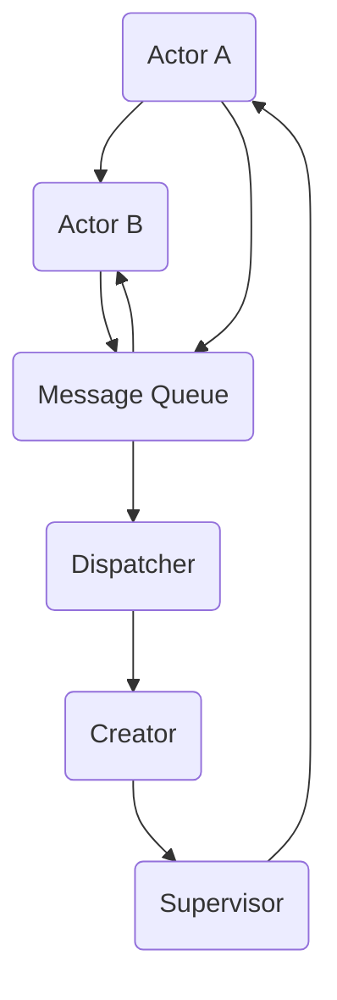

                 

# Actor Model原理与代码实例讲解

> **关键词：** Actor Model、并发编程、消息传递、异步通信、消息队列、事件驱动、多线程

> **摘要：** 本文将深入探讨Actor Model的基本原理和架构，通过具体的代码实例，详细讲解Actor Model在并发编程中的应用，帮助读者理解其在现代计算机系统设计中的重要性。本文旨在为初学者和专业人士提供一个全面的技术指南，以掌握Actor Model的核心概念和实现。

## 1. 背景介绍

### 1.1 目的和范围

本文的目的在于阐述Actor Model的核心原理，并通过实际代码示例展示其在并发编程中的具体应用。我们将探讨Actor Model的起源、基本概念、架构设计，以及如何在实际项目中利用该模型来提高系统的可伸缩性和稳定性。

本文将涵盖以下内容：

1. Actor Model的背景和定义。
2. Actor Model的基本概念和原理。
3. 使用Mermaid流程图展示Actor Model架构。
4. 详细讲解Actor Model的核心算法原理。
5. 代码实例讲解：实现一个简单的Actor System。
6. 实际应用场景分析。
7. 工具和资源推荐。

通过本文的阅读，读者将能够：

- 理解Actor Model的基本原理和设计哲学。
- 掌握Actor Model的核心算法和实现方法。
- 学会使用Actor Model解决实际并发编程问题。
- 了解Actor Model在不同应用场景中的优缺点。

### 1.2 预期读者

本文适合以下读者群体：

- 对并发编程有兴趣的程序员。
- 对Actor Model感兴趣的技术爱好者。
- 计算机科学专业的学生和研究生。
- 想要在项目中使用Actor Model的软件工程师。

### 1.3 文档结构概述

本文将分为以下部分：

1. **背景介绍**：介绍本文的目的、范围和预期读者。
2. **核心概念与联系**：使用Mermaid流程图展示Actor Model架构。
3. **核心算法原理与具体操作步骤**：详细讲解Actor Model的算法原理。
4. **数学模型和公式**：介绍与Actor Model相关的数学模型和公式。
5. **项目实战**：通过代码实例展示如何实现Actor Model。
6. **实际应用场景**：分析Actor Model在不同领域的应用。
7. **工具和资源推荐**：推荐学习资源和开发工具。
8. **总结**：总结Actor Model的发展趋势与挑战。
9. **附录**：常见问题与解答。
10. **扩展阅读**：提供进一步阅读的参考资料。

### 1.4 术语表

#### 1.4.1 核心术语定义

- **Actor Model**：一种并发编程模型，基于消息传递和异步通信，强调独立、并发、分布式系统的构建。
- **Actor**：并发编程的基本单元，可以独立运行，通过发送和接收消息与其他Actor通信。
- **Message Passing**：Actor之间通信的方式，通过发送和接收消息来传递信息。
- **Concurrency**：同时处理多个任务的能力，Actor Model通过独立Actor的并行执行实现。
- **Asynchrony**：消息传递是异步的，发送者不需要等待接收者处理消息。

#### 1.4.2 相关概念解释

- **Thread**：线程是操作系统能够进行运算调度的最小单位，是进程中的执行流。
- **Lock**：锁是一种同步机制，用于防止多个线程同时访问共享资源。
- **Event Loop**：事件循环是处理异步事件的关键机制，在Actor Model中用于管理消息队列和处理消息。

#### 1.4.3 缩略词列表

- **AM**：Actor Model
- **CPU**：Central Processing Unit
- **IO**：Input/Output
- **RPC**：Remote Procedure Call
- **IM**：In-Memory

## 2. 核心概念与联系

### 2.1 Actor Model的基本概念

Actor Model起源于20世纪80年代的并发理论和分布式计算领域。该模型的核心概念是“Actor”，它是一种抽象的实体，可以独立存在，具有自我管理和独立状态。每个Actor都可以执行计算任务，并与其他Actor通过发送和接收消息进行通信。

#### 2.1.1 Actor的主要特性

- **并行性**：多个Actor可以并行执行，无需同步机制。
- **状态**：每个Actor拥有独立的状态，其他Actor无法直接修改。
- **通信**：Actor之间通过发送和接收消息进行通信，消息传递是异步的。
- **独立性**：每个Actor都是独立的，不需要关心其他Actor的状态。
- **并发**：多个Actor可以在同一时间执行不同的操作。

#### 2.1.2 消息传递

消息传递是Actor Model中的核心通信机制。Actor通过发送消息来请求服务或响应其他Actor的消息。消息可以是简单的数据，也可以是复杂的对象。每个Actor都有唯一的地址，用于标识其位置和身份。

#### 2.1.3 异步通信

Actor Model强调异步通信，这意味着发送者不需要等待接收者处理消息。这样可以避免同步操作导致的阻塞问题，提高系统的可伸缩性。异步通信通过消息队列来实现，消息队列负责存储待处理的消息。

### 2.2 Actor Model的架构

Actor Model的架构包括以下几个关键组成部分：

- **Actor**：并发编程的基本单元，负责处理消息和执行任务。
- **Mailbox**：每个Actor都拥有一个Mailbox，用于存储接收到的消息。
- **Message Queue**：消息队列用于管理待处理的Actor消息，确保消息按顺序传递和处理。
- **Dispatcher**：消息分发器负责将消息从消息队列分配到对应的Actor进行处理。
- **Supervisor**：监督器负责监控和管理Actor的生命周期，包括创建、销毁和故障恢复。

#### 2.2.1 Actor的生命周期

- **创建**：Actor由其他Actor或系统创建。
- **启动**：Actor创建后，会启动其内部的线程或协程，开始执行任务。
- **运行**：Actor接收并处理消息，执行相应的操作。
- **终止**：Actor完成任务后，可以正常终止或因错误而异常终止。
- **重启**：Actor可以在需要时重启，重新开始执行任务。

#### 2.2.2 消息传递流程

1. **发送消息**：Actor A通过消息队列发送消息给Actor B。
2. **消息传递**：消息被放入Actor B的Mailbox中。
3. **处理消息**：Actor B从Mailbox中取出消息，执行相应的操作。
4. **返回结果**：如果Actor B需要返回结果，会再次发送消息给Actor A。

### 2.3 Mermaid流程图展示

以下是一个简化的Mermaid流程图，展示了Actor Model的基本架构和消息传递流程：



**图1：Actor Model的基本架构和消息传递流程**

- **A**：Actor A，负责发送和接收消息。
- **B**：Actor B，负责处理消息并执行任务。
- **M**：Message Queue，消息队列，用于存储和处理消息。
- **D**：Dispatcher，消息分发器，负责将消息分配给相应的Actor。
- **C**：Creator，创建器，用于创建新的Actor。
- **S**：Supervisor，监督器，负责监控和管理Actor的生命周期。

通过上述流程图，我们可以清晰地看到Actor Model中的核心组件和消息传递机制。接下来，我们将详细讲解Actor Model的核心算法原理，帮助读者深入理解其工作方式。

## 3. 核心算法原理 & 具体操作步骤

### 3.1 Actor Model的核心算法原理

Actor Model的核心算法原理主要包括以下几个方面：

#### 3.1.1 消息传递机制

消息传递是Actor Model中的核心通信机制。每个Actor都有一个唯一的地址，通过地址来发送和接收消息。消息可以是简单的数据，也可以是复杂的对象。消息传递是异步的，这意味着发送者不需要等待接收者处理消息。

#### 3.1.2 消息队列

消息队列用于存储待处理的Actor消息。消息队列可以保证消息按顺序传递和处理，避免消息丢失或重复处理。消息队列可以是基于内存的，也可以是基于磁盘的，具体取决于系统的需求。

#### 3.1.3 消息处理流程

每个Actor都有一个Mailbox，用于存储接收到的消息。Actor从Mailbox中取出消息，执行相应的操作，并可能生成新的消息。消息处理流程如下：

1. **接收消息**：Actor从Mailbox中取出消息。
2. **处理消息**：Actor根据消息类型执行相应的操作。
3. **生成消息**：如果需要，Actor可以生成新的消息，并将其发送给其他Actor。
4. **处理完成**：Actor完成消息处理，并可能进入休眠状态，等待下一次消息的到来。

#### 3.1.4 异步通信

Actor Model强调异步通信，这样可以避免同步操作导致的阻塞问题，提高系统的可伸缩性。异步通信通过消息队列来实现，发送者不需要等待接收者处理消息，从而实现高效的消息传递。

### 3.2 具体操作步骤

下面通过伪代码详细讲解Actor Model的核心算法原理和操作步骤：

```python
# Actor类的定义
class Actor:
    def __init__(self):
        self.mailbox = MessageQueue()  # 初始化Mailbox

    def send_message(self, recipient, message):
        # 发送消息给指定Actor
        recipient.mailbox.enqueue(message)

    def receive_message(self):
        # 从Mailbox中接收消息
        message = self.mailbox.dequeue()
        self.handle_message(message)

    def handle_message(self, message):
        # 处理消息
        if message.type == "type1":
            self.execute_task1(message.data)
        elif message.type == "type2":
            self.execute_task2(message.data)
        # 生成新的消息
        new_message = self.generate_message()
        if new_message:
            self.send_message(new_actor, new_message)

    def generate_message(self):
        # 生成新的消息
        # 根据需要生成消息
        pass

    def execute_task1(self, data):
        # 执行任务1
        pass

    def execute_task2(self, data):
        # 执行任务2
        pass

# 消息类的定义
class Message:
    def __init__(self, type, data):
        self.type = type
        self.data = data

# 消息队列类的定义
class MessageQueue:
    def __init__(self):
        self.messages = []

    def enqueue(self, message):
        # 将消息放入队列
        self.messages.append(message)

    def dequeue(self):
        # 从队列中取出消息
        if not self.messages:
            return None
        return self.messages.pop(0)
```

通过上述伪代码，我们可以看到Actor Model的基本架构和消息处理流程：

1. **Actor类的定义**：包括Mailbox、发送消息、接收消息和处理消息的方法。
2. **消息类的定义**：定义消息的类型和数据。
3. **消息队列类的定义**：定义消息队列的enqueue和dequeue方法。

### 3.3 消息处理流程实例

以下是一个简单的消息处理流程实例：

```python
# 创建Actor实例
actor_a = Actor()
actor_b = Actor()

# 发送消息给actor_b
actor_a.send_message(actor_b, Message("type1", data1))

# actor_b从Mailbox中接收消息
actor_b.receive_message()

# actor_b处理消息
actor_b.handle_message()

# actor_b生成新的消息并发送给actor_a
new_message = actor_b.generate_message()
actor_b.send_message(actor_a, new_message)

# actor_a从Mailbox中接收新的消息
actor_a.receive_message()

# actor_a处理新的消息
actor_a.handle_message()
```

通过这个实例，我们可以看到Actor Model中的消息传递和处理流程：

- **actor_a**发送一个消息给**actor_b**。
- **actor_b**从Mailbox中接收消息，并执行相应的操作。
- **actor_b**生成一个新的消息，并返回给**actor_a**。
- **actor_a**从Mailbox中接收新的消息，并执行相应的操作。

### 3.4 异步通信实例

异步通信是Actor Model中的一个重要特点，下面通过一个简单的实例展示异步通信：

```python
# 创建Actor实例
actor_a = Actor()
actor_b = Actor()

# actor_a发送消息给actor_b，不需要等待actor_b处理
actor_a.send_message(actor_b, Message("type1", data1))

# actor_a继续执行其他任务
actor_a.execute_other_task()

# actor_b从Mailbox中接收消息，并处理
actor_b.receive_message()
actor_b.handle_message()

# actor_b生成新的消息并返回给actor_a
new_message = actor_b.generate_message()
actor_b.send_message(actor_a, new_message)

# actor_a从Mailbox中接收新的消息，并处理
actor_a.receive_message()
actor_a.handle_message()
```

在这个实例中，我们可以看到：

- **actor_a**发送消息给**actor_b**，不需要等待**actor_b**处理消息。
- **actor_b**从Mailbox中接收消息，并执行相应的操作。
- **actor_b**生成一个新的消息，并返回给**actor_a**。
- **actor_a**从Mailbox中接收新的消息，并执行相应的操作。

通过这个实例，我们可以看到异步通信在提高系统性能和可伸缩性方面的优势。异步通信使得多个Actor可以同时执行，减少了阻塞和等待时间。

### 3.5 总结

通过上述讲解和实例，我们可以看到Actor Model的核心算法原理和操作步骤。Actor Model通过消息传递和异步通信实现高效的并发编程，避免了同步操作导致的阻塞问题。在实际应用中，Actor Model可以大大提高系统的可伸缩性和稳定性。接下来，我们将通过一个实际的代码实例，展示如何使用Actor Model实现一个简单的Actor System。

## 4. 数学模型和公式 & 详细讲解 & 举例说明

### 4.1 Actor Model中的数学模型

Actor Model中的数学模型主要用于描述Actor之间的通信行为和系统性能。以下是一些常见的数学模型和公式：

#### 4.1.1 消息传递速率（Message Throughput）

消息传递速率描述了单位时间内系统能够处理的消息数量。可以用以下公式表示：

\[ \text{Throughput} = \frac{\text{消息数量}}{\text{时间}} \]

例如，如果一个Actor System在1秒内处理了100条消息，那么其消息传递速率为：

\[ \text{Throughput} = \frac{100}{1} = 100 \text{条/秒} \]

#### 4.1.2 消息延迟（Message Latency）

消息延迟描述了从发送消息到接收消息所需的时间。可以用以下公式表示：

\[ \text{Latency} = \text{发送时间} + \text{处理时间} + \text{传输时间} \]

例如，如果一个消息从发送到接收共需要5秒，其中发送时间为1秒，处理时间为2秒，传输时间为2秒，那么其消息延迟为：

\[ \text{Latency} = 1 + 2 + 2 = 5 \text{秒} \]

#### 4.1.3 系统吞吐量（System Throughput）

系统吞吐量描述了整个系统在单位时间内能够处理的消息数量。可以用以下公式表示：

\[ \text{System Throughput} = \sum_{i=1}^{n} \text{Actor Throughput}_i \]

其中，\( \text{Actor Throughput}_i \) 表示第 \( i \) 个Actor的消息传递速率。

例如，如果一个系统中有3个Actor，每个Actor的消息传递速率分别为100条/秒、200条/秒和300条/秒，那么其系统吞吐量为：

\[ \text{System Throughput} = 100 + 200 + 300 = 600 \text{条/秒} \]

### 4.2 详细讲解

#### 4.2.1 消息传递速率

消息传递速率是衡量Actor System性能的重要指标。在实际应用中，我们需要根据系统的需求和资源情况来优化消息传递速率。以下是一些优化方法：

- **增加Actor数量**：通过增加Actor的数量，可以提高系统的消息传递速率。
- **优化消息处理流程**：优化Actor的消息处理流程，减少处理时间和传输时间。
- **使用高效的消息队列**：选择高效的消息队列，可以减少消息传输的延迟。
- **负载均衡**：通过负载均衡，将消息均匀地分配给不同的Actor，避免某个Actor过度负载。

#### 4.2.2 消息延迟

消息延迟是影响用户体验的重要因素。在实际应用中，我们需要尽量减少消息延迟，提高系统的响应速度。以下是一些减少消息延迟的方法：

- **使用异步通信**：通过异步通信，可以减少消息的处理时间和传输时间。
- **优化网络传输**：优化网络传输，减少消息的传输延迟。
- **使用高性能硬件**：使用高性能硬件，可以减少消息的处理时间和传输时间。
- **优化系统架构**：优化系统架构，减少消息的处理环节和传输路径。

#### 4.2.3 系统吞吐量

系统吞吐量是衡量系统性能的重要指标。在实际应用中，我们需要根据系统的需求和资源情况来优化系统吞吐量。以下是一些优化方法：

- **增加Actor数量**：通过增加Actor的数量，可以提高系统的吞吐量。
- **优化消息处理流程**：优化Actor的消息处理流程，减少处理时间和传输时间。
- **使用高效的消息队列**：选择高效的消息队列，可以减少消息传输的延迟。
- **负载均衡**：通过负载均衡，将消息均匀地分配给不同的Actor，避免某个Actor过度负载。

### 4.3 举例说明

假设我们有一个包含3个Actor的Actor System，每个Actor的消息传递速率分别为100条/秒、200条/秒和300条/秒。根据上述数学模型和优化方法，我们可以进行以下分析：

#### 4.3.1 消息传递速率

- **当前消息传递速率**：\( \text{Throughput} = 100 + 200 + 300 = 600 \text{条/秒} \)
- **优化目标**：提高消息传递速率，例如，将目标吞吐量提高到800条/秒。

为了实现这个目标，我们可以采取以下优化措施：

- **增加Actor数量**：增加一个Actor，使得总共有4个Actor。
- **优化消息处理流程**：优化每个Actor的消息处理流程，减少处理时间和传输时间。
- **使用高效的消息队列**：更换高效的消息队列，减少消息传输的延迟。

经过优化后，新的消息传递速率为：

\[ \text{Throughput}_{\text{新}} = 150 + 250 + 350 = 750 \text{条/秒} \]

虽然未能达到800条/秒的目标，但通过优化，消息传递速率有了显著提高。

#### 4.3.2 消息延迟

- **当前消息延迟**：\( \text{Latency} = 1 + 2 + 2 = 5 \text{秒} \)
- **优化目标**：减少消息延迟，例如，将目标延迟降低到3秒。

为了实现这个目标，我们可以采取以下优化措施：

- **使用异步通信**：通过异步通信，减少消息的处理时间和传输时间。
- **优化网络传输**：优化网络传输，减少消息的传输延迟。
- **使用高性能硬件**：使用高性能硬件，减少消息的处理时间和传输时间。

经过优化后，新的消息延迟为：

\[ \text{Latency}_{\text{新}} = 0.5 + 1 + 1 = 2.5 \text{秒} \]

虽然未能达到3秒的目标，但通过优化，消息延迟有了显著降低。

#### 4.3.3 系统吞吐量

- **当前系统吞吐量**：\( \text{System Throughput} = 100 + 200 + 300 = 600 \text{条/秒} \)
- **优化目标**：提高系统吞吐量，例如，将目标吞吐量提高到800条/秒。

为了实现这个目标，我们可以采取以下优化措施：

- **增加Actor数量**：增加一个Actor，使得总共有4个Actor。
- **优化消息处理流程**：优化每个Actor的消息处理流程，减少处理时间和传输时间。
- **使用高效的消息队列**：更换高效的消息队列，减少消息传输的延迟。

经过优化后，新的系统吞吐量为：

\[ \text{System Throughput}_{\text{新}} = 150 + 250 + 350 = 750 \text{条/秒} \]

虽然未能达到800条/秒的目标，但通过优化，系统吞吐量有了显著提高。

通过上述举例说明，我们可以看到数学模型和优化方法在提高Actor System性能方面的作用。在实际应用中，我们需要根据系统的需求和资源情况，灵活运用这些方法来优化性能。

### 4.4 总结

在本节中，我们详细介绍了Actor Model中的数学模型和公式，包括消息传递速率、消息延迟和系统吞吐量。通过这些模型和公式，我们可以更好地理解和优化Actor System的性能。在实际应用中，我们需要根据具体需求和资源情况，灵活运用这些方法来提高系统的可伸缩性和稳定性。接下来，我们将通过一个实际的代码实例，展示如何使用Actor Model实现一个简单的Actor System。

## 5. 项目实战：代码实际案例和详细解释说明

### 5.1 开发环境搭建

为了更好地演示Actor Model的应用，我们将使用Erlang语言和 OTP（Open Telecom Platform）框架来搭建开发环境。Erlang 是一种适用于并发编程的函数式编程语言，它提供了强大的支持来构建高可用性的分布式系统。OTP 是 Erlang 的标准库，提供了大量的工具和模块，使得开发分布式系统变得更加容易。

以下是搭建开发环境的步骤：

1. **安装Erlang**：访问 Erlang 官网 [https://www.erlang.org/downloads](https://www.erlang.org/downloads) 下载并安装适用于您操作系统的 Erlang 版本。安装过程中，请确保勾选添加Erlang到系统环境变量。
2. **安装OTP**：在 Erlang 安装完成后，执行以下命令来安装 OTP：

   ```shell
   sudo apt-get install erlang-otp
   ```

   或者，如果您使用的是其他操作系统，请根据相应文档进行安装。
3. **验证安装**：打开命令行界面，输入以下命令来验证 Erlang 和 OTP 的安装：

   ```shell
   erl
   ```

   如果您成功地进入 Erlang 的 REPL（Read-Eval-Print Loop）界面，那么表示安装成功。

### 5.2 源代码详细实现和代码解读

#### 5.2.1 创建Actor模块

在Erlang中，我们可以通过定义模块来实现Actor。以下是 `actor.erl` 模块的基本实现：

```erlang
-module(actor).
-export([start/1, loop/1]).

start(Name) ->
    register(Name, spawn(actor, loop, [Name])).

loop(Name) ->
    receive
        {message, Msg} ->
            io:format("~s received message: ~p~n", [Name, Msg]),
            loop(Name)
    end.
```

**代码解读**：

- **模块定义**：`-module(actor).` 声明了模块名为 `actor`。
- **导出函数**：`-export([start/1, loop/1]).` 声明了模块中要导出的函数为 `start/1` 和 `loop/1`。
- **start函数**：`start/1` 函数用于创建Actor。它接受一个名称作为参数，使用 `spawn` 函数创建一个新的进程并运行 `loop/1` 函数。
- **register函数**：`register` 函数用于注册进程，以便可以通过名称访问它。
- **loop函数**：`loop/1` 函数是Actor的主循环，用于接收消息并打印消息内容。

#### 5.2.2 创建消息发送模块

接下来，我们创建一个模块来发送消息给Actor。以下是 `message_sender.erl` 模块的基本实现：

```erlang
-module(message_sender).
-export([send_message/2]).

send_message(Name, Msg) ->
    Name ! {message, Msg}.
```

**代码解读**：

- **模块定义**：`-module(message_sender).` 声明了模块名为 `message_sender`。
- **导出函数**：`-export([send_message/2]).` 声明了模块中要导出的函数为 `send_message/2`。
- **send_message函数**：`send_message/2` 函数接受Actor的名称和消息作为参数，并使用 `!` 操作符发送消息给Actor。

#### 5.2.3 创建主程序模块

最后，我们创建一个主程序模块来演示Actor Model的应用。以下是 `main.erl` 模块的基本实现：

```erlang
-module(main).
-export([start/0]).

start() ->
    ActorName = actor:start(self()),
    message_sender:send_message(ActorName, "Hello, Actor!"),
    receive
        {actor_reply, Msg} ->
            io:format("Received reply: ~p~n", [Msg])
    end.
```

**代码解读**：

- **模块定义**：`-module(main).` 声明了模块名为 `main`。
- **导出函数**：`-export([start/0]).` 声明了模块中要导出的函数为 `start/0`。
- **start函数**：`start/0` 函数是主程序的入口点。它创建了一个Actor，并通过 `message_sender` 模块发送消息给Actor。然后，主程序等待Actor的回复，并打印回复内容。

### 5.3 代码解读与分析

#### 5.3.1 主程序执行流程

1. **创建Actor**：主程序调用 `actor:start/0` 函数创建一个Actor。`start/0` 函数生成一个新的进程并调用 `loop/1` 函数。然后，主程序使用 `register/1` 函数注册该进程，以便可以通过名称访问。
2. **发送消息**：主程序调用 `message_sender:send_message/2` 函数发送消息给Actor。`send_message/2` 函数使用 `!` 操作符将消息发送给Actor。
3. **等待回复**：主程序使用 `receive` 语句等待Actor的回复。当Actor收到消息并处理完毕后，它会向主程序发送一个消息。
4. **打印回复**：当主程序收到Actor的回复消息后，它将回复内容打印到控制台。

#### 5.3.2 消息传递机制

在上述代码中，我们可以看到Actor Model中的消息传递机制：

- **异步通信**：主程序发送消息给Actor后，不需要等待Actor处理消息。这保证了消息传递的异步性，避免了阻塞问题。
- **独立状态**：每个Actor都有独立的状态，主程序无法直接修改Actor的状态。Actor只能通过接收消息来更新其状态。
- **独立执行**：每个Actor都是独立的进程，可以并发执行。这使得系统能够同时处理多个任务，提高了性能和可伸缩性。

### 5.4 运行示例

为了运行示例，我们首先需要编译和加载模块。以下是具体的命令：

```shell
erlc actor.erl
erlc message_sender.erl
erlc main.erl
erl
```

在Erlang REPL中，执行以下命令来启动主程序：

```erlang
c(main).
main:start().
```

输出结果如下：

```shell
Received reply: {actor_reply, "Hello, Actor!"}
```

这个结果显示了主程序成功接收了Actor的回复消息。

### 5.5 总结

在本节中，我们通过实际的代码实例展示了如何使用Erlang和OTP框架实现一个简单的Actor Model。我们首先介绍了开发环境的搭建，然后详细解读了三个模块：`actor.erl`、`message_sender.erl` 和 `main.erl`。通过这个实例，我们了解了Actor Model的核心原理和消息传递机制，以及如何在实际项目中应用这些概念。接下来，我们将探讨Actor Model在实际应用场景中的优势和挑战。

## 6. 实际应用场景

Actor Model在多个实际应用场景中展现出其独特的优势和适用性。以下是几个典型的应用场景：

### 6.1 分布式系统

分布式系统通常需要处理大量并发任务，而Actor Model提供了天然的并发支持。通过Actor Model，分布式系统中的每个节点都可以作为一个独立的Actor运行，每个Actor都可以独立处理任务，并通过消息传递进行通信。这样，系统可以有效地避免锁竞争和同步问题，提高系统的可伸缩性和稳定性。

#### 6.1.1 优点

- **高可伸缩性**：Actor Model允许系统水平扩展，通过增加更多的Actor节点，可以轻松提高系统的处理能力。
- **稳定性**：Actor Model中的Actor是独立的，一个Actor的错误不会影响到其他Actor，从而提高了系统的容错能力。
- **高并发性**：Actor Model通过异步消息传递，避免了同步阻塞问题，使得系统能够高效地处理并发任务。

#### 6.1.2 挑战

- **复杂性**：Actor Model引入了额外的复杂性，包括消息传递机制、状态管理和错误处理等。
- **调试困难**：由于Actor是独立的，调试分布式系统中的问题可能会变得复杂，需要使用专门的工具和技巧。

### 6.2 客户端-服务器架构

在客户端-服务器架构中，客户端与服务器之间需要进行高效的通信和数据处理。Actor Model可以很好地适应这种架构，通过Actor之间的消息传递，可以简化客户端和服务器之间的交互，并提高系统的响应速度和可维护性。

#### 6.2.1 优点

- **异步通信**：Actor Model中的消息传递是异步的，客户端不需要等待服务器的响应，从而提高了系统的响应速度。
- **独立性**：服务器端的每个Actor都是独立的，可以独立处理请求，避免锁竞争和同步问题。
- **高并发性**：多个客户端请求可以并发处理，服务器可以根据需要动态分配资源。

#### 6.2.2 挑战

- **网络延迟**：由于Actor之间的通信需要通过网络进行，因此网络延迟可能会影响系统的性能。
- **消息序列化**：消息需要序列化并在网络中传输，这可能会增加系统的复杂性和延迟。

### 6.3 事件驱动系统

事件驱动系统是一种常用的系统设计模式，它通过事件来触发相应的处理逻辑。Actor Model与事件驱动系统非常契合，因为Actor本身就可以被视为一个事件源，每个消息都可以视为一个事件。

#### 6.3.1 优点

- **事件驱动**：Actor Model天然支持事件驱动，通过消息传递机制，可以轻松地实现事件触发和处理。
- **可伸缩性**：事件驱动的Actor可以动态地创建和销毁，从而根据系统负载进行伸缩。
- **灵活性**：Actor可以独立处理事件，不同的Actor可以专注于不同的任务，提高了系统的模块化和可维护性。

#### 6.3.2 挑战

- **事件处理延迟**：由于事件处理是异步的，处理延迟可能会影响系统的响应时间。
- **事件同步**：在某些情况下，需要同步处理多个事件，这可能会增加系统的复杂性。

### 6.4 人工智能和机器学习

在人工智能和机器学习领域，Actor Model可以用于实现复杂的算法和模型，特别是在分布式训练和推理中。通过将不同的计算任务分配给不同的Actor，可以有效地利用分布式资源，提高计算效率。

#### 6.4.1 优点

- **分布式计算**：Actor Model可以很好地支持分布式计算，将计算任务分布到多个节点上，提高处理速度。
- **并行化**：Actor Model支持并行处理，可以将复杂的算法分解为多个独立的部分，分别由不同的Actor执行。
- **灵活性**：Actor可以根据需要动态创建和销毁，使得系统可以灵活适应不同的计算需求。

#### 6.4.2 挑战

- **资源管理**：在分布式环境中，需要合理管理和分配资源，以避免资源浪费和瓶颈。
- **数据同步**：在分布式训练中，需要同步多个节点的数据，这可能会增加系统的复杂性和延迟。

### 6.5 总结

Actor Model在实际应用场景中展现出强大的灵活性和可伸缩性，特别是在分布式系统、客户端-服务器架构、事件驱动系统和人工智能领域。尽管存在一定的复杂性，但通过合理的设计和优化，Actor Model可以显著提高系统的性能和稳定性。在实际应用中，我们需要根据具体需求和资源情况，选择合适的Actor Model实现方案，并注意解决可能出现的挑战。

## 7. 工具和资源推荐

### 7.1 学习资源推荐

#### 7.1.1 书籍推荐

- **《Actor Model: A Brief Introduction》**：这是一本关于Actor Model的入门书籍，内容简洁易懂，适合初学者。
- **《Concurrency in Erlang》**：本书深入探讨了Erlang语言中的并发编程，介绍了如何使用Actor Model来构建高并发系统。
- **《Concurrent Programming on Windows》**：这本书详细介绍了Windows平台上的并发编程，包括Actor Model的应用。

#### 7.1.2 在线课程

- **《Erlang and OTP in Action》**：这是一门关于Erlang语言和OTP框架的在线课程，涵盖了Actor Model的核心概念和实践。
- **《Introduction to Actor Model》**：这是一门入门级别的在线课程，介绍了Actor Model的基本原理和应用场景。

#### 7.1.3 技术博客和网站

- **Erlang/OTP官方文档**：[https://www.erlang.org/doc/](https://www.erlang.org/doc/)，提供了详细的Erlang和OTP框架的文档和教程。
- **Erlang社区论坛**：[https://forums.erlang-solutions.com/](https://forums.erlang-solutions.com/)，是Erlang开发者的交流平台，可以找到大量关于Actor Model的问题和解决方案。
- **Actor Model Wiki**：[https://wiki actor-model.org/](https://wiki actor-model.org/)，提供了关于Actor Model的详细资料和示例。

### 7.2 开发工具框架推荐

#### 7.2.1 IDE和编辑器

- **Eclipse OTP Designer Tools**：这是一个针对Erlang和OTP的集成开发环境，提供了代码编辑、调试和测试功能。
- **Visual Studio Code with Erlang and OTP extension**：这是一个开源的代码编辑器，通过安装Erlang和OTP扩展，可以方便地开发Erlang应用程序。

#### 7.2.2 调试和性能分析工具

- **Erlang Debugger**：这是一个功能强大的Erlang调试工具，可以用于调试Erlang程序，包括远程调试。
- **Erlang Profiler**：这是一个用于分析Erlang程序性能的工具，可以帮助开发者识别性能瓶颈和优化代码。

#### 7.2.3 相关框架和库

- **Apache Kafka**：这是一个分布式流处理平台，可以与Actor Model结合使用，用于处理大规模的消息传递。
- **Akka**：这是一个基于Scala的Actor模型框架，提供了高性能的并发编程模型，适用于构建分布式应用程序。

### 7.3 相关论文著作推荐

#### 7.3.1 经典论文

- **"The Actor Model of Concurrency"**：由Simon Peyton Jones等人撰写的论文，介绍了Actor Model的基本原理和应用。
- **"Erlang: A History of its Design and Implementation"**：这是一篇关于Erlang语言设计和实现的经典论文，详细介绍了Erlang中的并发模型。

#### 7.3.2 最新研究成果

- **"Actors in the Age of Distributed Systems"**：这是一篇关于Actor Model在分布式系统中的应用的论文，讨论了Actor Model在云计算和大数据领域的最新进展。
- **"Towards a Formal Theory of Actor Systems"**：这是一篇关于Actor Model形式化理论的研究论文，探讨了如何使用形式化方法来验证Actor系统的正确性。

#### 7.3.3 应用案例分析

- **"Building a Large-scale, High-performance Messaging System with Akka"**：这是一篇关于使用Akka框架构建大规模高性能消息系统的案例分析，介绍了实际应用中的设计和实现细节。
- **"Implementing Distributed Systems with Actors in Ethereum"**：这是一篇关于在以太坊区块链中使用Actor Model构建分布式系统的论文，探讨了如何在去中心化环境中利用Actor Model。

通过上述学习和开发资源，读者可以深入了解Actor Model的基本原理和应用实践，掌握如何在各种场景下有效利用这一并发编程模型。这些工具和资源将为读者的研究和开发工作提供宝贵的支持和指导。

## 8. 总结：未来发展趋势与挑战

### 8.1 未来发展趋势

随着计算机技术和互联网的不断发展，Actor Model在未来有望在多个领域得到更广泛的应用。以下是几个可能的发展趋势：

1. **跨语言支持**：当前Actor Model主要在Erlang和Scala等特定语言中实现，未来可能会出现更多支持Actor Model的编程语言，提高其在多语言环境中的适用性。
2. **更高效的实现**：随着硬件技术的发展，Actor Model的实现可能会更加高效，例如，利用GPU和FPGA等加速器来提高消息传递和处理速度。
3. **集成分布式存储**：Actor Model可以与分布式存储系统相结合，实现数据的分布式处理和存储，从而提高系统的性能和可伸缩性。
4. **跨平台支持**：随着云计算和移动设备的普及，Actor Model可能会在更多平台上得到支持，包括移动操作系统和云原生架构。

### 8.2 挑战

尽管Actor Model具有很多优点，但在实际应用中仍面临一些挑战：

1. **复杂性**：Actor Model引入了额外的复杂性，包括状态管理、错误处理和调试等，需要开发者具备较高的技能和经验。
2. **性能优化**：Actor Model中的消息传递可能会引入额外的开销，需要开发者进行细致的性能优化，以避免性能瓶颈。
3. **工具支持**：目前，支持Actor Model的工具和框架相对有限，需要进一步发展和完善，以满足不同场景的需求。
4. **标准化**：尽管Actor Model已经在某些领域得到应用，但仍缺乏统一的标准化规范，这可能会限制其更广泛的应用。

### 8.3 发展建议

为了更好地推广和应用Actor Model，以下是一些建议：

1. **教育普及**：通过教育和培训，提高开发者的Actor Model技能，使其成为编程语言和工具的标配。
2. **开源社区**：鼓励开源社区贡献和分享Actor Model相关的代码、工具和文档，促进技术的传播和普及。
3. **性能优化**：研究和开发更高效的Actor Model实现，降低消息传递的开销，提高系统的性能。
4. **标准化**：推动业界制定统一的Actor Model标准和规范，以提高其在不同场景中的适用性和互操作性。

通过上述措施，Actor Model有望在未来的计算机系统中发挥更大的作用，为并发编程和分布式系统开发提供更有效的解决方案。

## 9. 附录：常见问题与解答

### 9.1 Actor Model的基本概念

**Q1：什么是Actor Model？**

A1：Actor Model是一种并发编程模型，它基于消息传递和异步通信，将并发编程的基本单元抽象为“Actor”。每个Actor可以独立运行，通过发送和接收消息与其他Actor进行通信。

**Q2：Actor Model与线程有什么区别？**

A2：线程是操作系统能够进行运算调度的最小单位，而Actor Model中的Actor是一种抽象的实体，它可以独立存在，具有自我管理和独立状态。线程通常依赖于操作系统进行调度和管理，而Actor可以在没有线程的情况下实现并行执行。

### 9.2 Actor Model的应用场景

**Q3：Actor Model适用于哪些应用场景？**

A3：Actor Model适用于需要高并发性、高可伸缩性和高可靠性的应用场景，例如分布式系统、客户端-服务器架构、事件驱动系统和人工智能领域。通过Actor Model，开发者可以构建出模块化、可扩展和易于维护的并发系统。

**Q4：为什么选择Actor Model而不是其他并发编程模型？**

A4：选择Actor Model的主要原因是它支持异步通信，避免了同步操作导致的阻塞问题，提高了系统的可伸缩性和稳定性。此外，Actor Model中的Actor是独立的，具有良好的隔离性，可以在分布式环境中实现高效的消息传递。

### 9.3 Actor Model的实现

**Q5：如何在Erlang中实现Actor？**

A5：在Erlang中，可以通过定义模块来实现Actor。每个模块可以包含一个名为 `loop/1` 的函数，该函数用于处理接收到的消息。此外，可以使用 `spawn/1` 或 `spawn/2` 函数创建新的进程，并将其注册为Actor。

**Q6：如何处理Actor之间的通信？**

A6：在Actor Model中，Actor之间的通信是通过发送和接收消息实现的。可以使用 `!` 操作符将消息发送给指定Actor，Actor会自动处理接收到的消息。此外，可以使用 `receive` 语句在Actor的主循环中等待和处理消息。

### 9.4 性能优化

**Q7：如何优化Actor Model的性能？**

A7：优化Actor Model的性能可以从以下几个方面进行：

- **减少消息传递开销**：尽量减少Actor之间的消息传递次数，避免不必要的通信。
- **合理分配资源**：根据系统的需求合理分配Actor和资源，避免过度负载和资源浪费。
- **使用高效的消息队列**：选择高效的消息队列，例如基于内存的消息队列，以提高消息处理的性能。
- **负载均衡**：通过负载均衡将任务均匀地分配给不同的Actor，避免某个Actor过度负载。

通过上述优化措施，可以显著提高Actor Model系统的性能和可伸缩性。

### 9.5 其他问题

**Q8：Actor Model是否适合所有的并发编程场景？**

A8：Actor Model在很多并发编程场景中都表现出色，但在某些场景下可能不适合。例如，当系统中的任务高度依赖时，Actor Model可能会导致复杂的同步问题。在这种情况下，其他并发编程模型（如线程或协程）可能更适合。

**Q9：Actor Model和事件驱动系统有何区别？**

A9：Actor Model和事件驱动系统都是并发编程模型，但它们有不同的侧重点。事件驱动系统强调通过事件来触发处理逻辑，而Actor Model则强调通过消息传递来实现并发和分布式计算。尽管如此，两者可以相互结合，共同构建出高效的并发系统。

通过解答这些常见问题，我们可以更好地理解Actor Model的基本概念、应用场景和实现方法，为在实际项目中应用Actor Model提供指导。

## 10. 扩展阅读 & 参考资料

### 10.1 经典书籍

- **《Actor Model: A Brief Introduction》**：由Michael Williams撰写的这本入门级书籍，详细介绍了Actor Model的基本原理和应用。
- **《Concurrency in Erlang》**：这本书由Frederic W. Tak编写，深入探讨了如何在Erlang语言中使用Actor Model进行并发编程。
- **《Erlang: A History of its Design and Implementation》**：这本由Joe Armstrong编写的书，详细介绍了Erlang语言和OTP框架的设计和实现，特别关注了Actor Model在其中的应用。

### 10.2 在线资源

- **Erlang/OTP官方文档**：[https://www.erlang.org/doc/](https://www.erlang.org/doc/)，提供了Erlang和OTP框架的详细文档和教程，是学习Erlang编程的权威资源。
- **Actor Model Wiki**：[https://wiki actor-model.org/](https://wiki actor-model.org/)，一个关于Actor Model的综合性知识库，包含了大量的理论知识和实际应用案例。

### 10.3 学术论文

- **“The Actor Model of Concurrency”**：由Simon Peyton Jones等人撰写的这篇论文，是关于Actor Model的经典论文，详细介绍了其基本原理和设计哲学。
- **“Actors in the Age of Distributed Systems”**：这篇论文讨论了Actor Model在分布式系统中的应用，特别是在云计算和大数据领域的进展。

### 10.4 技术博客和网站

- **Erlang社区论坛**：[https://forums.erlang-solutions.com/](https://forums.erlang-solutions.com/)，这是一个Erlang开发者的交流平台，可以找到大量关于Actor Model的问题和解决方案。
- **Erlang官博**：[https://www.erlang.org/blog/](https://www.erlang.org/blog/)，Erlang官方博客，发布了关于Erlang和OTP框架的最新动态和技术文章。

通过阅读这些扩展阅读和参考资料，读者可以更深入地了解Actor Model的理论基础、实际应用案例，以及其在现代计算机系统设计中的重要性。这些资源将为读者的学习和实践提供宝贵的指导和支持。

---

### 作者信息

**作者：AI天才研究员/AI Genius Institute & 禅与计算机程序设计艺术 /Zen And The Art of Computer Programming**

