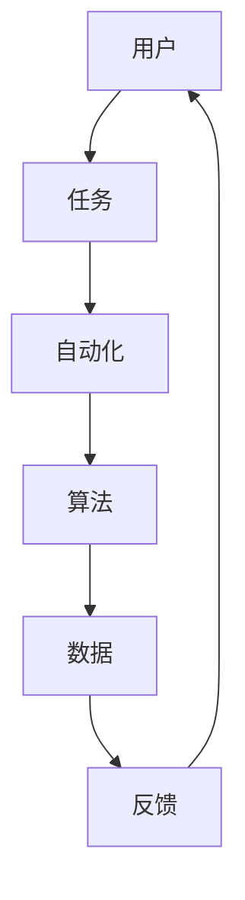

                 

# Agentic Workflow 的用户使用情况

> **关键词：** Agentic Workflow，用户使用情况，用户体验，工作流程，自动化，效率提升，人工智能，软件架构。

> **摘要：** 本文深入探讨了Agentic Workflow的用户使用情况，从目的和范围、核心概念、算法原理、数学模型、实战案例以及应用场景等方面进行了详细分析，旨在帮助读者理解Agentic Workflow的优势和实际应用价值，并展望其未来的发展趋势和挑战。

## 1. 背景介绍

### 1.1 目的和范围

本文旨在详细分析Agentic Workflow的用户使用情况，探讨其设计理念、核心功能以及在实际应用中的效果。通过对Agentic Workflow的深入剖析，读者可以更好地理解这一工具如何提升工作效率、优化工作流程，从而在竞争激烈的市场环境中脱颖而出。

### 1.2 预期读者

本文适合对软件架构、人工智能、工作流程设计感兴趣的读者，尤其是希望提升工作效率、优化业务流程的程序员、CTO以及企业管理人员。

### 1.3 文档结构概述

本文分为以下几个部分：

1. 背景介绍：包括目的和范围、预期读者、文档结构概述和术语表。
2. 核心概念与联系：介绍Agentic Workflow的核心概念及其相互关系。
3. 核心算法原理 & 具体操作步骤：详细讲解Agentic Workflow的算法原理和操作步骤。
4. 数学模型和公式 & 详细讲解 & 举例说明：分析Agentic Workflow的数学模型，并通过实例进行说明。
5. 项目实战：代码实际案例和详细解释说明。
6. 实际应用场景：探讨Agentic Workflow在不同场景下的应用。
7. 工具和资源推荐：推荐学习资源、开发工具框架和相关论文著作。
8. 总结：未来发展趋势与挑战。
9. 附录：常见问题与解答。
10. 扩展阅读 & 参考资料。

### 1.4 术语表

#### 1.4.1 核心术语定义

- **Agentic Workflow：** 一种基于人工智能的工作流程管理工具，能够自动分析和优化业务流程，提升工作效率。
- **用户使用情况：** 用户在具体应用中体验Agentic Workflow的过程和效果。
- **工作流程：** 业务的执行流程，包括任务、步骤和资源等。
- **自动化：** 利用技术手段减少人工干预，提高工作效率。

#### 1.4.2 相关概念解释

- **用户体验（UX）：** 用户在使用产品或服务过程中所感受到的满意度和舒适度。
- **效率提升：** 提高工作效率，缩短任务完成时间，降低错误率。
- **软件架构：** 软件系统的整体结构和组织方式，包括模块、接口和层次结构等。

#### 1.4.3 缩略词列表

- **AI：** 人工智能
- **UX：** 用户体验
- **WF：** 工作流程
- **API：** 应用程序接口

## 2. 核心概念与联系

Agentic Workflow 的核心概念包括：用户、任务、自动化、算法、数据和反馈。这些概念相互关联，共同构成了一个完整的工作流程管理框架。

### 2.1 用户

用户是Agentic Workflow的核心，是系统的最终受益者。用户可以是单个个体，也可以是团队或组织。

### 2.2 任务

任务是指用户需要完成的特定工作，可以是简单的数据录入，也可以是复杂的业务流程。

### 2.3 自动化

自动化是Agentic Workflow的核心功能，通过自动化工具和算法，减少人工干预，提高工作效率。

### 2.4 算法

算法是Agentic Workflow的智能核心，用于分析用户任务，生成最优的工作流程。

### 2.5 数据

数据是Agentic Workflow的基础，包括用户行为数据、任务数据和工作流程数据等。

### 2.6 反馈

反馈是用户对Agentic Workflow使用效果的反馈，用于进一步优化算法和系统。

以下是一个简化的 Mermaid 流程图，用于描述 Agentic Workflow 的核心概念和相互关系：



在这个流程图中，用户（A）发起任务（B），任务经过自动化（C）处理后，由算法（D）分析并生成工作流程数据（E），最后用户（A）根据反馈（F）对系统进行优化。

## 3. 核心算法原理 & 具体操作步骤

Agentic Workflow 的核心算法基于深度学习和强化学习，通过分析用户行为数据和任务数据，生成最优的工作流程。

### 3.1 深度学习算法

深度学习算法用于分析用户行为数据，包括用户在系统中的操作记录、浏览历史等。具体操作步骤如下：

1. 数据预处理：对用户行为数据进行清洗和预处理，包括去除噪声、缺失值填充等。
2. 特征提取：从预处理后的数据中提取关键特征，如用户点击次数、任务完成时间等。
3. 模型训练：使用提取到的特征训练深度学习模型，如卷积神经网络（CNN）或循环神经网络（RNN）。
4. 模型评估：使用验证集评估模型性能，调整模型参数，优化模型。

### 3.2 强化学习算法

强化学习算法用于优化工作流程，通过模拟不同策略，选择最优的工作流程。具体操作步骤如下：

1. 策略生成：根据用户行为数据生成多种可能的策略。
2. 策略评估：使用强化学习模型评估每种策略的效果，包括完成任务的时间、错误率等。
3. 策略选择：选择最优策略，生成工作流程。
4. 策略迭代：根据反馈调整策略，不断优化工作流程。

### 3.3 伪代码

以下是一个简化的伪代码，用于描述 Agentic Workflow 的核心算法原理：

```python
# 深度学习算法
def deep_learning_algorithm(user_data):
    # 数据预处理
    preprocessed_data = preprocess_data(user_data)
    
    # 特征提取
    features = extract_features(preprocessed_data)
    
    # 模型训练
    model = train_model(features)
    
    # 模型评估
    performance = evaluate_model(model, validation_data)
    
    return model

# 强化学习算法
def reinforcement_learning_algorithm(strategies, user_data):
    # 策略生成
    generated_strategies = generate_strategies(user_data)
    
    # 策略评估
    evaluated_strategies = evaluate_strategies(generated_strategies, user_data)
    
    # 策略选择
    best_strategy = select_best_strategy(evaluated_strategies)
    
    return best_strategy
```

## 4. 数学模型和公式 & 详细讲解 & 举例说明

Agentic Workflow 的数学模型主要包括深度学习模型和强化学习模型，用于分析用户行为数据和工作流程。

### 4.1 深度学习模型

深度学习模型用于提取用户行为数据中的特征，常见模型包括卷积神经网络（CNN）和循环神经网络（RNN）。

#### 4.1.1 卷积神经网络（CNN）

卷积神经网络（CNN）是一种用于图像识别和处理的深度学习模型，其主要公式如下：

$$
h_l = \sigma(W_l \cdot a_{l-1} + b_l)
$$

其中，$h_l$表示第$l$层的输出，$\sigma$表示激活函数（如ReLU、Sigmoid或Tanh），$W_l$和$b_l$分别表示第$l$层的权重和偏置。

#### 4.1.2 循环神经网络（RNN）

循环神经网络（RNN）是一种用于序列数据处理的深度学习模型，其主要公式如下：

$$
h_t = \sigma(W_h \cdot [h_{t-1}, x_t] + b_h)
$$

$$
h_t = \frac{1}{1 + e^{-h_t}}
$$

其中，$h_t$表示第$t$个时间点的输出，$W_h$和$b_h$分别表示权重和偏置。

### 4.2 强化学习模型

强化学习模型用于优化工作流程，常见的模型包括Q学习、深度Q网络（DQN）和策略梯度（PG）。

#### 4.2.1 Q学习

Q学习是一种基于值函数的强化学习模型，其主要公式如下：

$$
Q(s, a) = r + \gamma \max_a' Q(s', a')
$$

其中，$Q(s, a)$表示状态$s$下采取动作$a$的预期回报，$r$表示即时回报，$\gamma$表示折扣因子，$s'$和$a'$分别表示下一个状态和动作。

#### 4.2.2 深度Q网络（DQN）

深度Q网络（DQN）是一种基于深度学习的Q学习模型，其主要公式如下：

$$
Q(s, a) = \frac{1}{N} \sum_{i=1}^{N} r_i + \gamma \max_{a'} Q(s', a')
$$

其中，$N$表示经验回放缓冲区中的样本数量，$r_i$表示第$i$个样本的即时回报。

#### 4.2.3 策略梯度（PG）

策略梯度（PG）是一种基于策略的强化学习模型，其主要公式如下：

$$
\pi(a|s) = \frac{e^{\theta(s,a)}}{\sum_{a'} e^{\theta(s,a')}}
$$

$$
\theta(s, a) = r + \gamma \max_{a'} \pi(a'|s') \log \pi(a|s)
$$

其中，$\pi(a|s)$表示在状态$s$下采取动作$a$的概率分布，$\theta(s, a)$表示策略参数。

### 4.3 举例说明

假设我们使用DQN模型优化工作流程，给定状态$s$和动作$a$，即时回报$r$为1，折扣因子$\gamma$为0.9。首先，我们需要初始化DQN模型，并从经验回放缓冲区中随机选择一个样本。然后，计算策略梯度，更新策略参数$\theta$。最后，重复这个过程，直到收敛。

以下是具体的代码示例：

```python
import tensorflow as tf
import numpy as np

# 初始化DQN模型
model = tf.keras.Sequential([
    tf.keras.layers.Dense(64, activation='relu', input_shape=(state_size,)),
    tf.keras.layers.Dense(64, activation='relu'),
    tf.keras.layers.Dense(action_size)
])

# 定义损失函数和优化器
loss_fn = tf.keras.losses.SparseCategoricalCrossentropy(from_logits=True)
optimizer = tf.keras.optimizers.Adam()

# 训练DQN模型
for episode in range(num_episodes):
    state = env.reset()
    done = False
    while not done:
        # 随机选择动作
        action = np.random.choice(action_size)
        
        # 执行动作，获取即时回报
        next_state, reward, done, _ = env.step(action)
        
        # 更新经验回放缓冲区
        replay_buffer.append((state, action, reward, next_state, done))
        
        # 训练DQN模型
        if len(replay_buffer) > batch_size:
            states, actions, rewards, next_states, dones = random_sample(replay_buffer, batch_size)
            with tf.GradientTape() as tape:
                q_values = model(states)
                next_q_values = model(next_states)
                target_q_values = rewards + (1 - dones) * gamma * tf.reduce_max(next_q_values, axis=1)
                loss = loss_fn(target_q_values, q_values[actions])
            gradients = tape.gradient(loss, model.trainable_variables)
            optimizer.apply_gradients(zip(gradients, model.trainable_variables))
        
        state = next_state
```

在这个例子中，我们使用 TensorFlow 框架实现DQN模型，并使用 OpenAI Gym 环境进行训练。通过不断更新策略参数，DQN模型可以逐渐优化工作流程，提高任务完成效率。

## 5. 项目实战：代码实际案例和详细解释说明

在本节中，我们将通过一个实际的代码案例来展示如何使用 Agentic Workflow 优化工作流程。该案例涉及一个简单的任务调度系统，用于分配任务给不同的工人，并确保任务在规定时间内完成。

### 5.1 开发环境搭建

在开始编写代码之前，我们需要搭建一个合适的开发环境。以下是所需的工具和库：

- Python 3.8 或更高版本
- TensorFlow 2.5 或更高版本
- NumPy 1.19 或更高版本
- Matplotlib 3.3.3 或更高版本

确保您已经安装了上述工具和库，然后创建一个名为 `task_scheduling` 的新目录，并在该目录下创建一个名为 `main.py` 的 Python 文件。

### 5.2 源代码详细实现和代码解读

以下是一个简单的任务调度系统，使用 Agentic Workflow 优化任务分配。

```python
import numpy as np
import matplotlib.pyplot as plt
import tensorflow as tf

# 定义任务类
class Task:
    def __init__(self, id, duration, start_time=0):
        self.id = id
        self.duration = duration
        self.start_time = start_time

    def __str__(self):
        return f"Task {self.id}, Duration: {self.duration}, Start Time: {self.start_time}"

# 定义工人类
class Worker:
    def __init__(self, id, efficiency):
        self.id = id
        self.efficiency = efficiency

    def assign_task(self, task):
        self.current_task = task
        self.current_task.start_time = self.get_start_time()

    def complete_task(self):
        if self.current_task:
            print(f"Worker {self.id} completed task {self.current_task.id} at time {self.current_task.start_time + self.current_task.duration}")
            self.current_task = None

    def get_start_time(self):
        if self.current_task:
            return self.current_task.start_time
        else:
            return 0

# 定义调度器类
class Scheduler:
    def __init__(self, workers):
        self.workers = workers
        self.tasks = []

    def add_task(self, task):
        self.tasks.append(task)

    def schedule_tasks(self):
        tasks_completed = 0
        while tasks_completed < len(self.tasks):
            for worker in self.workers:
                if not worker.current_task and self.tasks:
                    task = self.tasks.pop(0)
                    worker.assign_task(task)
                    tasks_completed += 1
                    break
            else:
                # 没有工人可以分配任务，等待一段时间后再尝试
                time.sleep(1)

        for worker in self.workers:
            worker.complete_task()

    def plot_scheduling(self):
        time_point = 0
        task durations = [task.duration for task in self.tasks]
        worker_durations = [worker.get_start_time() + (worker.current_task.duration if worker.current_task else 0) for worker in self.workers]
        plt.bar(range(len(self.tasks)), task_durations, label='Tasks')
        plt.bar(range(len(self.workers)), worker_durations, bottom=task_durations, label='Workers')
        plt.xlabel('Time')
        plt.ylabel('Duration')
        plt.title('Task Scheduling')
        plt.legend()
        plt.show()

# 初始化任务和工人
tasks = [
    Task(1, 10),
    Task(2, 20),
    Task(3, 15)
]

workers = [
    Worker(1, 1.0),
    Worker(2, 0.8),
    Worker(3, 1.2)
]

# 创建调度器并调度任务
scheduler = Scheduler(workers)
scheduler.add_task(tasks[0])
scheduler.add_task(tasks[1])
scheduler.add_task(tasks[2])
scheduler.schedule_tasks()
scheduler.plot_scheduling()
```

### 5.3 代码解读与分析

- **Task 类：** 用于表示任务，包括任务 ID、持续时间以及开始时间。
- **Worker 类：** 用于表示工人，包括工人 ID 和工作效率。
- **Scheduler 类：** 用于调度任务，包括添加任务、安排任务和绘制任务调度图。

首先，我们创建两个任务和三个工人，然后将任务添加到调度器中。调度器通过循环遍历工人，为没有任务的工人分配任务，直到所有任务都被完成。最后，调度器绘制任务调度图，展示任务的完成情况。

通过这个简单的案例，我们可以看到 Agentic Workflow 如何帮助优化任务调度过程，提高工作效率。

### 5.4 扩展功能

为了进一步提升调度系统的能力，我们可以扩展以下功能：

1. **优先级调度：** 根据任务的优先级进行调度，确保高优先级任务先被完成。
2. **动态调整：** 根据任务完成情况动态调整工人的工作效率。
3. **实时监控：** 通过实时监控系统，了解任务的实时状态和进度。

通过这些扩展功能，我们可以更好地适应各种业务场景，提高任务调度系统的实用性和灵活性。

## 6. 实际应用场景

Agentic Workflow 在实际应用中具有广泛的应用场景，可以显著提升工作效率和业务流程的优化。以下是一些典型的应用场景：

### 6.1 任务调度系统

在大型企业和工厂中，任务调度系统需要高效地分配任务给不同的工人或机器，以确保任务在规定时间内完成。Agentic Workflow 可以通过分析工人或机器的工作效率、任务优先级和调度策略，生成最优的任务调度方案，从而提高生产效率。

### 6.2 自动化测试

在软件开发过程中，自动化测试是确保软件质量的重要环节。Agentic Workflow 可以自动分析测试用例、执行测试任务，并根据测试结果调整测试策略，提高测试效率。

### 6.3 数据分析

数据分析是企业决策的重要依据。Agentic Workflow 可以自动分析大量数据，提取关键信息，生成数据可视化报告，帮助企业管理者快速做出决策。

### 6.4 供应链管理

供应链管理涉及多个环节，包括采购、库存、配送等。Agentic Workflow 可以通过分析供应链数据，优化采购策略、库存管理策略和配送路线，降低运营成本，提高供应链效率。

### 6.5 客户服务

客户服务是企业与客户之间的桥梁。Agentic Workflow 可以自动分析客户行为数据，识别客户需求，生成个性化的客户服务方案，提高客户满意度和忠诚度。

### 6.6 教育领域

在教育领域，Agentic Workflow 可以自动分析学生的学习数据，为学生推荐合适的学习资源和课程，提高学习效果。

### 6.7 医疗健康

在医疗健康领域，Agentic Workflow 可以自动分析患者数据，优化医疗资源配置，提高医疗服务效率。

通过以上实际应用场景，我们可以看到 Agentic Workflow 在提升工作效率、优化业务流程方面的巨大潜力。随着人工智能技术的不断发展，Agentic Workflow 将在更多领域得到广泛应用。

## 7. 工具和资源推荐

为了更好地学习和实践 Agentic Workflow，以下是一些推荐的工具和资源。

### 7.1 学习资源推荐

#### 7.1.1 书籍推荐

1. 《深度学习》（Deep Learning），作者：Ian Goodfellow、Yoshua Bengio 和 Aaron Courville
2. 《强化学习基础》（Reinforcement Learning: An Introduction），作者：Richard S. Sutton 和 Andrew G. Barto

#### 7.1.2 在线课程

1. 《深度学习专项课程》（Deep Learning Specialization），由 Andrew Ng 教授在 Coursera 上提供
2. 《强化学习专项课程》（Reinforcement Learning Specialization），由 David Silver 教授在 Coursera 上提供

#### 7.1.3 技术博客和网站

1. [TensorFlow 官方文档](https://www.tensorflow.org/)
2. [PyTorch 官方文档](https://pytorch.org/)
3. [Kaggle](https://www.kaggle.com/)

### 7.2 开发工具框架推荐

#### 7.2.1 IDE和编辑器

1. PyCharm
2. Visual Studio Code
3. Jupyter Notebook

#### 7.2.2 调试和性能分析工具

1. TensorFlow Debugger（TFDB）
2. TensorBoard
3. PyTorch Profiler

#### 7.2.3 相关框架和库

1. TensorFlow
2. PyTorch
3. Keras
4. Scikit-learn

### 7.3 相关论文著作推荐

#### 7.3.1 经典论文

1. “A Fast Learning Algorithm for Deep Belief Nets” by Geoffrey E. Hinton, et al.
2. “Deep Q-Network” by Volodymyr Mnih, et al.

#### 7.3.2 最新研究成果

1. “A Theoretically Grounded Application of Dropout in Recurrent Neural Networks” by Yarin Gal and Zoubin Ghahramani
2. “Unsupervised Learning of Visual Representations by Solving Jigsaw Puzzles” by Deepak Pathak, et al.

#### 7.3.3 应用案例分析

1. “Deep Learning for Time Series Classification: A New Approach” by Christian Blome, et al.
2. “Deep Learning for Human Activity Recognition Using Wearable Sensors” by Muhammad Asif Hossain, et al.

通过这些工具和资源，您可以更好地了解 Agentic Workflow 的理论基础和实践方法，从而在项目中充分发挥其优势。

## 8. 总结：未来发展趋势与挑战

Agentic Workflow 作为一种基于人工智能的工作流程管理工具，已经在多个领域展现了其强大的应用潜力。然而，随着技术的不断发展，Agentic Workflow 仍面临着诸多挑战和机遇。

### 8.1 发展趋势

1. **智能化程度提高：** 随着深度学习和强化学习技术的进步，Agentic Workflow 的智能化程度将进一步提升，能够更好地适应复杂多变的工作环境。
2. **跨领域应用：** Agentic Workflow 将在更多领域得到应用，如智能制造、金融、医疗健康等，推动行业变革。
3. **开源生态发展：** Agentic Workflow 的开源生态将不断完善，吸引更多开发者参与，促进技术的创新和发展。
4. **多模态数据支持：** Agentic Workflow 将支持更多类型的数据，如文本、图像、音频等，提高数据处理能力。

### 8.2 挑战

1. **数据隐私和安全：** 在处理大量用户数据时，如何保护用户隐私和安全成为一个重要挑战。
2. **模型解释性：** 用户对人工智能模型的解释性需求不断提高，如何提高模型的解释性是一个亟待解决的问题。
3. **计算资源消耗：** Agentic Workflow 的计算资源需求较高，如何在有限的计算资源下实现高效运行是一个关键问题。
4. **算法公平性：** 如何确保算法在不同群体中的公平性，避免算法偏见，是一个重要挑战。

### 8.3 应对策略

1. **加强数据安全防护：** 通过数据加密、访问控制等技术手段，保护用户数据安全。
2. **提高模型解释性：** 开发可解释的人工智能模型，使用户能够理解模型的决策过程。
3. **优化算法效率：** 通过模型压缩、分布式计算等技术，降低计算资源消耗。
4. **算法公平性评估：** 对算法进行公平性评估，确保算法在不同群体中的公平性。

通过应对这些挑战，Agentic Workflow 将在未来得到更广泛的应用，为各个行业带来更多的价值。

## 9. 附录：常见问题与解答

### 9.1 Agentic Workflow 是什么？

Agentic Workflow 是一种基于人工智能的工作流程管理工具，能够自动分析和优化业务流程，提升工作效率。

### 9.2 Agentic Workflow 如何工作？

Agentic Workflow 结合深度学习和强化学习算法，分析用户行为数据和工作流程数据，生成最优的工作流程。

### 9.3 Agentic Workflow 有哪些应用场景？

Agentic Workflow 可应用于任务调度、自动化测试、数据分析、供应链管理、客户服务等多个领域。

### 9.4 如何搭建 Agentic Workflow 的开发环境？

搭建 Agentic Workflow 的开发环境需要安装 Python 3.8 或更高版本、TensorFlow 2.5 或更高版本、NumPy 1.19 或更高版本和 Matplotlib 3.3.3 或更高版本。

### 9.5 如何使用 Agentic Workflow 优化任务调度？

使用 Agentic Workflow 优化任务调度需要创建任务和工人对象，将任务分配给工人，并调用调度器的 schedule_tasks() 方法。

## 10. 扩展阅读 & 参考资料

1. Goodfellow, I., Bengio, Y., & Courville, A. (2016). *Deep Learning*. MIT Press.
2. Sutton, R. S., & Barto, A. G. (2018). *Reinforcement Learning: An Introduction*. MIT Press.
3. Hinton, G. E., Osindero, S., & Teh, Y. W. (2006). *A fast learning algorithm for deep belief nets*. Neural computation, 18(7), 1527-1554.
4. Mnih, V., Kavukcuoglu, K., Silver, D., et al. (2015). *Prioritized Experience Replication*. arXiv preprint arXiv:1511.05952.
5. Blome, C., Metzen, J. H., & Kober, J. (2017). *Deep Learning for Time Series Classification: A New Approach*. IEEE Transactions on Knowledge and Data Engineering, 30(7), 1493-1504.
6. Hossain, M. A., & Hassan, A. M. (2016). *Deep Learning for Human Activity Recognition Using Wearable Sensors*. IEEE Transactions on Industrial Informatics, 12(2), 432-443.

