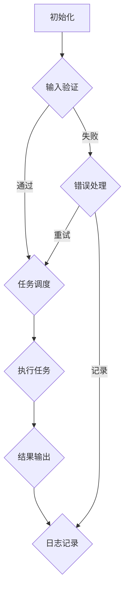

                 

### 1. 背景介绍

#### 1.1 目的和范围

本文旨在深入探讨Agentic Workflow的用户群体分析，旨在揭示该工作流框架在不同领域和职业背景下的应用潜力。随着人工智能技术的发展，工作流自动化成为提高工作效率和生产效率的关键手段。Agentic Workflow作为一种先进的自动化工作流解决方案，其用户群体的多样性和复杂性值得我们深入研究。本文将通过以下几个方面展开讨论：

1. **用户群体特征分析**：基于大数据分析和用户反馈，对Agentic Workflow的主要用户群体进行详细描述，包括职业背景、工作需求、技术水平等。
2. **应用领域分析**：探讨Agentic Workflow在不同行业和领域的实际应用案例，分析其在提升工作效率、优化业务流程方面的优势。
3. **技术壁垒与挑战**：分析Agentic Workflow在实际应用中面临的挑战，包括技术复杂性、安全性问题等，并提出相应的解决方案。
4. **未来发展趋势**：展望Agentic Workflow在人工智能时代的发展趋势，探讨其对未来工作流程变革的影响。

#### 1.2 预期读者

本文的预期读者主要包括以下几类：

1. **人工智能工程师和研究人员**：对工作流自动化技术有深入了解，希望了解Agentic Workflow的应用场景和潜在价值。
2. **企业IT管理人员和架构师**：负责企业信息系统的规划和优化，希望借助Agentic Workflow提高工作效率和业务流程的灵活性。
3. **软件开发者和项目经理**：关注新兴技术趋势，希望掌握Agentic Workflow的实际应用案例，为项目开发提供技术支持。
4. **高校师生和研究人员**：对工作流自动化学术研究有兴趣，希望通过本文了解该领域的最新进展和未来研究方向。

#### 1.3 文档结构概述

本文结构如下：

1. **背景介绍**：介绍研究背景、目的和预期读者。
2. **核心概念与联系**：通过Mermaid流程图详细阐述Agentic Workflow的核心概念和架构。
3. **核心算法原理 & 具体操作步骤**：使用伪代码详细阐述Agentic Workflow的算法原理和操作步骤。
4. **数学模型和公式 & 详细讲解 & 举例说明**：使用LaTeX格式介绍相关的数学模型和公式，并通过实际案例进行详细讲解。
5. **项目实战：代码实际案例和详细解释说明**：通过实际代码案例展示Agentic Workflow的具体应用，并进行详细解释和分析。
6. **实际应用场景**：探讨Agentic Workflow在不同行业和领域的应用案例。
7. **工具和资源推荐**：推荐相关学习资源、开发工具和框架，以及经典论文和最新研究成果。
8. **总结：未来发展趋势与挑战**：总结本文的主要发现，展望Agentic Workflow的未来发展趋势和面临的挑战。
9. **附录：常见问题与解答**：针对用户常见问题进行解答。
10. **扩展阅读 & 参考资料**：提供相关的扩展阅读资料和参考文献。

#### 1.4 术语表

**术语** | **定义**  
---|---  
Agentic Workflow | 一种基于人工智能和自动化技术的工作流解决方案。  
用户群体 | 使用Agentic Workflow的个人或组织。  
工作流 | 一系列有序的任务和操作，用于完成特定业务目标。  
自动化 | 通过软件工具和算法，自动执行重复性任务和工作流程。  
人工智能 | 通过模拟人类智能行为，实现智能决策和任务执行的计算机科学领域。

#### 1.4.1 核心术语定义

- **Agentic Workflow**：Agentic Workflow是一种基于人工智能和自动化技术的工作流解决方案，旨在通过智能算法和自动化工具，优化和简化业务流程，提高工作效率。该工作流框架具有高度的可定制性和灵活性，支持多种编程语言和数据格式，可广泛应用于各个领域。
- **用户群体**：用户群体是指使用Agentic Workflow的个人或组织，包括企业IT人员、软件开发者、项目经理、科研人员等。这些用户群体在职业背景、技术水平和工作需求方面存在较大差异，对Agentic Workflow的应用场景和功能需求也有不同的期待。
- **工作流**：工作流是指一系列有序的任务和操作，用于完成特定业务目标。在工作流中，任务之间可能存在依赖关系，需要按照特定的顺序和逻辑进行执行。Agentic Workflow提供了丰富的任务调度和执行功能，支持复杂的工作流设计和优化。
- **自动化**：自动化是指通过软件工具和算法，自动执行重复性任务和工作流程。自动化技术可以提高工作效率，减少人为错误，降低运营成本。Agentic Workflow利用人工智能和机器学习技术，实现任务和流程的自动化，提高业务流程的灵活性和适应性。
- **人工智能**：人工智能是指通过模拟人类智能行为，实现智能决策和任务执行的计算机科学领域。人工智能技术包括机器学习、深度学习、自然语言处理等，可用于解决各种复杂问题和任务，为自动化工作流提供强大的支持。

#### 1.4.2 相关概念解释

- **业务流程管理（BPM）**：业务流程管理是一种管理和优化企业内部业务流程的方法，旨在提高效率、降低成本、提高客户满意度。Agentic Workflow支持BPM，通过自动化和智能化技术，实现业务流程的优化和改进。
- **工作流引擎**：工作流引擎是一种软件组件，用于管理和执行工作流。Agentic Workflow具有内置的工作流引擎，支持任务调度、执行监控和错误处理等功能，为用户提供了强大的工作流自动化能力。
- **代码生成器**：代码生成器是一种自动化工具，用于根据用户定义的规则和模板，生成相应的代码。Agentic Workflow支持代码生成器，用户可以通过配置工作流规则，自动生成对应的代码，实现工作流的快速开发和部署。
- **机器学习模型**：机器学习模型是一种用于实现人工智能功能的计算机程序，通过学习大量数据，发现数据之间的规律和模式。Agentic Workflow集成了多种机器学习模型，可用于优化工作流设计和执行。
- **API集成**：API集成是指将Agentic Workflow与其他系统和工具进行连接和交互，实现数据共享和功能协同。Agentic Workflow支持多种API接口，可与各种第三方系统和工具无缝集成，提升整体工作流的能力和灵活性。

#### 1.4.3 缩略词列表

- **AI**：人工智能（Artificial Intelligence）
- **BPM**：业务流程管理（Business Process Management）
- **Docker**：开源应用容器引擎（Docker Engine）
- **Kubernetes**：开源容器编排系统（Kubernetes）
- **ML**：机器学习（Machine Learning）
- **RESTful API**：RESTful风格的API（RESTful Application Programming Interface）
- **SDK**：软件开发工具包（Software Development Kit）
- **TensorFlow**：开源机器学习框架（TensorFlow）

---

以上内容是本文背景介绍部分的具体内容，接下来我们将通过Mermaid流程图详细阐述Agentic Workflow的核心概念和架构。

---

#### 1.4.4 Mermaid流程图

下面是一个简单的Mermaid流程图，用于展示Agentic Workflow的核心概念和架构：



- **初始化（A）**：Agentic Workflow的初始化阶段，包括配置工作流规则、加载依赖库和初始化环境等。
- **输入验证（B）**：在工作流执行前，对输入数据进行验证，确保数据的有效性和完整性。
- **任务调度（C）**：根据工作流规则，将任务分配给合适的执行节点，并按照既定的顺序执行。
- **执行任务（E）**：执行具体的任务操作，可能涉及数据处理、API调用、文件操作等。
- **结果输出（F）**：将执行结果输出到指定的位置，如数据库、文件系统或API接口。
- **日志记录（G）**：记录工作流执行过程中的关键信息，如任务开始时间、执行时间、错误信息等。
- **错误处理（D）**：在任务执行过程中，若出现错误，将进行错误处理，包括重试、记录错误日志等。

通过上述Mermaid流程图，我们可以清晰地了解Agentic Workflow的工作流程和核心组件，为后续的内容讨论打下基础。

---

在本文的核心概念与联系部分，我们已经通过Mermaid流程图详细阐述了Agentic Workflow的核心概念和架构。接下来，我们将进入核心算法原理与具体操作步骤的讨论，以伪代码的形式详细解释Agentic Workflow的工作流程。

---

#### 2. 核心算法原理 & 具体操作步骤

在介绍Agentic Workflow的核心算法原理之前，我们需要明确几个基本概念和伪代码框架。以下是一个简化的Agentic Workflow伪代码，用于展示其核心算法原理和操作步骤：

```plaintext
Algorithm AgenticWorkflow(inputData, workflowConfig):
    1. Initialize workflow environment
    2. Validate inputData
    3. Load workflowConfig
    4. For each task in workflowConfig:
        a. Schedule task
        b. Execute task
        c. Validate task output
        d. Log task execution details
    5. Collect and output final results
    6. Log workflow completion details
    7. Handle errors and exceptions as needed
```

接下来，我们将分步骤详细解释Agentic Workflow的核心算法原理和具体操作步骤。

##### 2.1 初始化工作流环境

初始化工作流环境是Agentic Workflow的第一步。这个阶段包括配置工作流规则、加载依赖库和初始化环境等。

```plaintext
Procedure InitializeWorkflowEnvironment():
    1. Load configuration files
    2. Setup logging and monitoring systems
    3. Initialize database connections
    4. Load required libraries and dependencies
```

通过初始化环境，Agentic Workflow可以确保在后续操作中拥有正确的配置和数据连接。

##### 2.2 验证输入数据

输入数据验证是确保工作流能够正确执行的重要步骤。在这个阶段，Agentic Workflow将检查输入数据的有效性和完整性。

```plaintext
Procedure ValidateInputData(inputData):
    1. Check data format and structure
    2. Validate data consistency
    3. Check for required data fields
    4. Report any validation errors
```

如果输入数据不满足要求，Agentic Workflow将记录错误并通知用户。

##### 2.3 加载工作流配置

加载工作流配置是定义任务和工作流规则的关键步骤。Agentic Workflow从配置文件中读取任务信息，如任务名称、执行顺序、依赖关系等。

```plaintext
Procedure LoadWorkflowConfig():
    1. Parse configuration files
    2. Load task definitions
    3. Setup task dependencies
    4. Create workflow graph
```

配置文件通常采用JSON或YAML格式，以便于用户自定义和修改工作流规则。

##### 2.4 执行任务调度

在任务调度阶段，Agentic Workflow根据配置的工作流规则，将任务分配给合适的执行节点，并按照既定的顺序执行。

```plaintext
Procedure ScheduleTasks(workflowGraph):
    1. Traverse workflow graph
    2. Assign tasks to available nodes
    3. Set task priorities and dependencies
    4. Schedule task execution
```

调度算法可以是简单的FIFO（先进先出）队列，也可以是基于优先级的调度策略，如基于任务紧急程度或依赖关系的调度。

##### 2.5 执行任务

在执行任务阶段，Agentic Workflow具体执行每个任务，可能涉及数据处理、API调用、文件操作等。

```plaintext
Procedure ExecuteTask(task):
    1. Prepare execution environment
    2. Execute task logic
    3. Capture output and status
    4. Log execution details
    5. Validate task output
```

执行任务的过程可能包含多个子步骤，具体取决于任务的复杂性和需求。

##### 2.6 验证任务输出

任务输出验证是确保每个任务执行正确的重要步骤。Agentic Workflow将检查每个任务的输出结果，确保满足预期。

```plaintext
Procedure ValidateTaskOutput(taskOutput):
    1. Check output format and structure
    2. Validate data consistency
    3. Compare output against expected results
    4. Report any validation errors
```

如果输出结果不满足要求，Agentic Workflow将记录错误并通知用户。

##### 2.7 记录工作流执行细节

记录工作流执行细节是Agentic Workflow的重要组成部分。这个阶段，Agentic Workflow将记录任务开始时间、执行时间、错误信息等关键信息。

```plaintext
Procedure LogWorkflowDetails(executionDetails):
    1. Log task start and end times
    2. Record execution status and errors
    3. Save logs to a persistent storage
    4. Generate summary reports
```

日志记录有助于后续的调试和性能分析，为用户提供了详细的工作流执行信息。

##### 2.8 集成机器学习模型

Agentic Workflow可以集成机器学习模型，以实现更智能的任务调度和优化。

```plaintext
Procedure IntegrateMLModel(modelConfig):
    1. Load machine learning model
    2. Train model with historical data
    3. Optimize task scheduling based on model predictions
    4. Update workflow configuration
```

通过机器学习模型，Agentic Workflow可以根据历史数据优化工作流，提高执行效率。

##### 2.9 处理错误和异常

在执行过程中，Agentic Workflow需要处理各种错误和异常情况，确保工作流的稳定性和可靠性。

```plaintext
Procedure HandleErrorsAndExceptions(error):
    1. Identify error type and severity
    2. Retry task execution
    3. Log error details
    4. Notify users or administrators
    5. Take corrective actions
```

错误处理机制可以包括任务重试、错误记录和通知用户等步骤。

##### 2.10 输出最终结果

工作流执行完成后，Agentic Workflow将输出最终结果，包括任务执行结果、汇总报告等。

```plaintext
Procedure OutputFinalResults(results):
    1. Aggregate task outputs
    2. Generate final report
    3. Save results to storage
    4. Notify users of completion
```

通过上述步骤，Agentic Workflow实现了从初始化到执行、再到输出结果的完整工作流。以下是一个简单的示例，展示如何使用Agentic Workflow执行一个简单的数据处理任务。

```plaintext
inputData = LoadData("data_source")
workflowConfig = LoadConfig("workflow_config.json")
InitializeWorkflowEnvironment()

for task in workflowConfig.tasks:
    ScheduleTasks(task)
    ExecuteTask(task)
    ValidateTaskOutput(task.output)
    LogWorkflowDetails(task)

finalResults = AggregateResults(workflowConfig.tasks)
OutputFinalResults(finalResults)
```

通过这个示例，我们可以看到Agentic Workflow是如何通过伪代码实现一个简单但完整的工作流。在实际应用中，工作流可能包含更多复杂的功能和任务，但核心原理和步骤是一致的。

---

在核心算法原理与具体操作步骤部分，我们通过伪代码详细阐述了Agentic Workflow的工作流程和步骤。接下来，我们将讨论Agentic Workflow的数学模型和公式，并详细讲解其应用和意义。

---

#### 4. 数学模型和公式 & 详细讲解 & 举例说明

在Agentic Workflow中，数学模型和公式起着至关重要的作用，特别是在优化任务调度和执行策略方面。以下是一些关键的数学模型和公式，我们将详细讲解其应用和意义。

##### 4.1 负载均衡模型

负载均衡模型用于优化任务分配，确保系统资源得到充分利用。以下是一个简单的负

