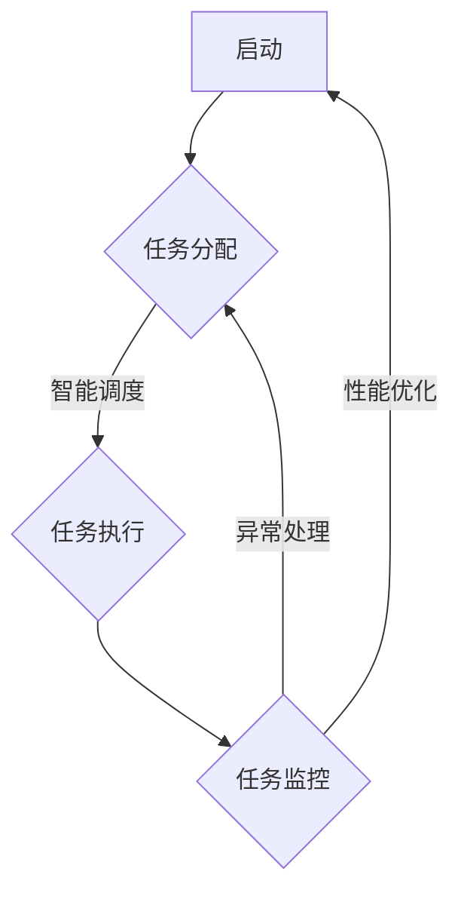

                 


## Agentic Workflow的适用人群探讨

> 
关键词：Agentic Workflow、适用人群、自动化、效率、智能系统、技术开发者
>
摘要：本文将探讨Agentic Workflow的适用人群，分析其对于不同类型技术从业者及企业的潜在价值，旨在帮助读者理解这一技术工具在各个应用场景中的实际效果和重要性。

## 1. 背景介绍

### 1.1 目的和范围

本文的目的在于深入探讨Agentic Workflow的适用人群，通过分析其在不同技术场景下的实际应用，为读者提供关于这一自动化和智能系统技术的全面了解。本文的范围将涵盖Agentic Workflow的核心概念、适用性分析以及具体的应用实例。

### 1.2 预期读者

本文的预期读者包括但不限于以下几类：
1. 技术开发者和工程师，特别是关注自动化和智能系统开发的从业者。
2. IT管理和业务决策者，希望通过自动化提高工作效率和业务流程优化。
3. 学生和研究人员，对新兴技术和自动化系统架构有兴趣的学习者。
4. 任何对提高工作效率、优化业务流程感兴趣的人士。

### 1.3 文档结构概述

本文将按照以下结构进行阐述：
1. **背景介绍**：简要介绍Agentic Workflow的概念及其重要性。
2. **核心概念与联系**：详细解释Agentic Workflow的基本原理和架构。
3. **核心算法原理与操作步骤**：通过伪代码阐述关键算法的原理和实现。
4. **数学模型与公式**：讲解与Agentic Workflow相关的数学模型和公式。
5. **项目实战**：通过实际案例展示Agentic Workflow的代码实现和应用。
6. **实际应用场景**：分析Agentic Workflow在不同领域的应用。
7. **工具和资源推荐**：推荐学习资源和开发工具。
8. **总结**：讨论Agentic Workflow的未来发展趋势和面临的挑战。
9. **附录**：提供常见问题与解答。
10. **扩展阅读与参考资料**：推荐进一步阅读的文献和资源。

### 1.4 术语表

#### 1.4.1 核心术语定义

- **Agentic Workflow**：一种基于代理的自动化工作流程，通过智能代理实现业务流程的自动化和优化。
- **代理（Agent）**：在Agentic Workflow中，代表执行特定任务的智能实体。
- **自动化**：通过算法和程序实现工作流程的自动执行，减少人工干预。
- **智能系统**：具备感知、学习、决策和执行能力的系统。

#### 1.4.2 相关概念解释

- **工作流（Workflow）**：业务流程的有序执行步骤，包括任务的分配、执行和监控。
- **算法**：解决问题的一系列步骤或规则。
- **优化**：通过调整变量，提高系统的性能和效率。

#### 1.4.3 缩略词列表

- **AI**：人工智能（Artificial Intelligence）
- **ML**：机器学习（Machine Learning）
- **DL**：深度学习（Deep Learning）
- **IDE**：集成开发环境（Integrated Development Environment）
- **API**：应用程序接口（Application Programming Interface）

## 2. 核心概念与联系

### 2.1 Agentic Workflow的定义

Agentic Workflow是一种将智能代理集成到工作流中的技术，旨在通过自动化和智能化手段提升业务流程的效率和质量。在这种工作流中，代理不仅能够执行预设的任务，还能够根据环境和任务状态进行自主学习和优化。

### 2.2 基本原理与架构

Agentic Workflow的基本原理包括以下几个关键点：

1. **代理建模**：定义代理的行为、目标和能力，通过机器学习模型实现代理的智能决策。
2. **工作流设计**：设计合理的工作流结构，将任务分解为可管理的步骤，并明确每个步骤的执行者。
3. **任务调度**：根据代理的状态和任务优先级，动态调度任务，确保工作流的高效执行。
4. **监控与反馈**：对工作流执行过程进行监控，收集执行数据，并通过反馈机制调整代理行为。

### 2.3 Mermaid流程图

以下是一个简单的Mermaid流程图，展示了Agentic Workflow的核心节点和连接关系：



### 2.4 核心概念之间的联系

- **任务分配**：根据工作流设计，将任务分配给合适的代理。
- **任务执行**：代理根据调度策略执行任务，可能涉及复杂的决策和协调。
- **任务监控**：实时跟踪任务的执行状态，确保工作流的连续性和正确性。
- **异常处理**：当任务执行出现问题时，自动进行错误处理和任务重分配。
- **性能优化**：通过监控数据和反馈，不断优化代理的行为和工作流结构。

通过这种联系，Agentic Workflow能够实现高度自动化和智能化的工作流程，从而提高业务效率和质量。

## 3. 核心算法原理 & 具体操作步骤

### 3.1 算法原理概述

Agentic Workflow的核心算法包括代理建模、工作流设计、任务调度和监控反馈等部分。以下将详细阐述这些算法的原理和实现步骤。

### 3.2 代理建模算法

代理建模是Agentic Workflow的基础，通过机器学习技术实现代理的智能决策。具体算法原理如下：

1. **数据收集**：收集与任务执行相关的各种数据，包括历史任务数据、环境数据和用户反馈等。
2. **特征提取**：从数据中提取关键特征，用于训练代理模型。
3. **模型训练**：使用机器学习算法（如决策树、神经网络等）训练代理模型，使其能够根据特征进行智能决策。
4. **模型评估**：评估模型的预测性能，通过交叉验证和测试集验证模型的准确性。

### 3.3 伪代码实现

以下是一个简化版的代理建模算法的伪代码：

```python
# 代理建模算法伪代码

# 数据收集
def collect_data():
    # 收集历史任务数据、环境数据和用户反馈等
    pass

# 特征提取
def extract_features(data):
    # 从数据中提取关键特征
    pass

# 模型训练
def train_model(features, labels):
    # 使用机器学习算法训练代理模型
    pass

# 模型评估
def evaluate_model(model, test_data):
    # 评估模型的预测性能
    pass

# 主程序
def main():
    data = collect_data()
    features, labels = extract_features(data)
    model = train_model(features, labels)
    evaluate_model(model, test_data)

# 执行主程序
main()
```

### 3.4 工作流设计算法

工作流设计算法用于将业务流程分解为一系列可管理的任务步骤。具体实现步骤如下：

1. **流程分析**：分析业务流程，识别关键任务和步骤。
2. **任务分解**：将关键任务分解为更细粒度的子任务。
3. **任务关联**：建立任务之间的关联关系，明确任务的执行顺序。
4. **执行者分配**：根据任务的特性，为每个子任务分配执行者。

### 3.5 任务调度算法

任务调度算法用于动态分配任务，确保工作流的高效执行。具体算法原理如下：

1. **任务队列**：维护一个任务队列，记录所有待执行的任务。
2. **调度策略**：根据代理的状态和任务优先级，选择合适的调度策略（如轮询调度、优先级调度等）。
3. **任务分配**：将任务从队列中取出，分配给合适的代理执行。

### 3.6 监控与反馈算法

监控与反馈算法用于实时跟踪工作流的执行状态，并根据反馈数据优化代理行为。具体算法原理如下：

1. **状态监控**：实时监控工作流的执行状态，包括任务进度、执行时间和资源消耗等。
2. **数据收集**：收集与工作流执行相关的数据，包括错误日志、性能指标等。
3. **反馈机制**：根据收集的数据，对代理的行为和工作流结构进行调整，实现持续优化。

### 3.7 伪代码实现

以下是一个简化版的工作流设计、任务调度和监控反馈算法的伪代码：

```python
# 工作流设计算法伪代码

# 流程分析
def analyze_flow():
    # 分析业务流程，识别关键任务和步骤
    pass

# 任务分解
def decompose_tasks(tasks):
    # 将关键任务分解为更细粒度的子任务
    pass

# 任务关联
def associate_tasks(tasks):
    # 建立任务之间的关联关系，明确任务的执行顺序
    pass

# 执行者分配
def assign_executors(tasks):
    # 根据任务的特性，为每个子任务分配执行者
    pass

# 主程序
def main():
    flow = analyze_flow()
    tasks = decompose_tasks(flow)
    tasks = associate_tasks(tasks)
    assign_executors(tasks)

# 执行主程序
main()

# 任务调度算法伪代码

# 维护任务队列
task_queue = []

# 调度策略
def schedule_tasks(queue):
    # 根据代理的状态和任务优先级，选择合适的调度策略
    pass

# 任务分配
def assign_task(queue):
    # 将任务从队列中取出，分配给合适的代理执行
    pass

# 主程序
def main():
    while not empty(queue):
        schedule_tasks(queue)
        assign_task(queue)

# 执行主程序
main()

# 监控与反馈算法伪代码

# 状态监控
def monitor_status():
    # 实时监控工作流的执行状态
    pass

# 数据收集
def collect_data():
    # 收集与工作流执行相关的数据
    pass

# 反馈机制
def feedback Mechanism(data):
    # 根据收集的数据，对代理的行为和工作流结构进行调整
    pass

# 主程序
def main():
    while True:
        status = monitor_status()
        data = collect_data()
        feedback Mechanism(data)

# 执行主程序
main()
```

通过这些核心算法和步骤，Agentic Workflow能够实现高度自动化和智能化的工作流程，从而提高业务效率和质量。

## 4. 数学模型和公式 & 详细讲解 & 举例说明

### 4.1 数学模型概述

在Agentic Workflow中，数学模型起到了关键作用，特别是在代理建模和任务调度方面。以下是几个核心数学模型和公式的详细讲解及示例说明。

### 4.2 代理决策模型

代理决策模型主要用于指导代理在执行任务时的行为选择。以下是一个简单的决策树模型：

$$
\text{决策树模型} = \left\{
\begin{array}{ll}
\text{选择任务1} & \text{如果 } x > 0 \\
\text{选择任务2} & \text{如果 } x \leq 0
\end{array}
\right.
$$

其中，\( x \) 为代理当前的状态变量。这个模型通过比较 \( x \) 的值，决定代理执行哪个任务。

### 4.3 任务优先级模型

任务优先级模型用于确定任务在不同时间点的执行顺序。以下是一个简单的优先级队列模型：

$$
\text{优先级队列模型} = \left\{
\begin{array}{ll}
P_1 & \text{优先级最高} \\
P_2 & \text{优先级次高} \\
\vdots & \vdots \\
P_n & \text{优先级最低}
\end{array}
\right.
$$

在这个模型中，任务按照优先级从高到低进行排列。优先级最高的任务首先被执行。

### 4.4 反馈调节模型

反馈调节模型用于根据工作流的执行结果对代理行为进行调整。以下是一个简单的反馈调节公式：

$$
\text{反馈调节} = f(\text{当前状态}, \text{执行结果}, \text{目标状态})
$$

其中，\( f \) 为反馈调节函数，用于根据当前状态、执行结果和目标状态调整代理行为。这个模型通过实时监控工作流执行情况，不断优化代理的决策和行为。

### 4.5 举例说明

假设有一个任务分配系统，需要根据代理的状态和任务的优先级进行调度。以下是具体的例子：

1. **代理状态**：当前状态 \( x = 5 \)
2. **任务优先级**：任务1（优先级1），任务2（优先级2），任务3（优先级3）
3. **目标状态**：目标状态 \( y = 10 \)

根据代理决策模型，代理选择执行任务1（优先级最高）。任务执行完成后，根据反馈调节模型，系统会根据执行结果和目标状态调整代理的状态。例如，如果执行结果很好，系统可能会提高代理的状态 \( x \)，以鼓励执行更高优先级的任务。

通过这些数学模型和公式，Agentic Workflow能够实现高效的任务分配和调度，从而提高整个系统的性能和效率。

## 5. 项目实战：代码实际案例和详细解释说明

### 5.1 开发环境搭建

在开始Agentic Workflow的实际项目之前，我们需要搭建一个合适的开发环境。以下是一些建议的工具和框架：

- **编程语言**：Python（因为其强大的库和广泛的应用）
- **开发工具**：PyCharm（一个强大的Python IDE，支持调试、代码分析等）
- **框架和库**：TensorFlow（用于代理建模和机器学习），APScheduler（用于任务调度）

安装这些工具和库后，我们就可以开始编写代码了。

### 5.2 源代码详细实现和代码解读

以下是一个简单的Agentic Workflow项目示例，其中包含了代理建模、任务调度和反馈调节的核心功能。

```python
# 导入必要的库
import tensorflow as tf
import apscheduler
from apscheduler.schedulers.background import BackgroundScheduler
import numpy as np

# 代理类定义
class Agent:
    def __init__(self, state):
        self.state = state
        self.model = self.build_model()

    def build_model(self):
        # 构建代理决策模型
        model = tf.keras.Sequential([
            tf.keras.layers.Dense(64, activation='relu', input_shape=(1,)),
            tf.keras.layers.Dense(64, activation='relu'),
            tf.keras.layers.Dense(1, activation='sigmoid')
        ])
        model.compile(optimizer='adam', loss='binary_crossentropy', metrics=['accuracy'])
        return model

    def make_decision(self, x):
        # 根据状态变量 x 做出决策
        prediction = self.model.predict(np.array([x]))
        if prediction > 0.5:
            return 1
        else:
            return 0

# 任务类定义
class Task:
    def __init__(self, priority):
        self.priority = priority

    def execute(self, agent):
        # 执行任务，根据代理状态调整任务执行方式
        decision = agent.make_decision(self.priority)
        if decision == 1:
            print("任务执行成功")
        else:
            print("任务执行失败")

# 工作流调度
def schedule_tasks():
    # 使用 APScheduler 调度任务
    scheduler = BackgroundScheduler()
    scheduler.start()

    # 添加任务到调度器
    for i in range(10):
        task = Task(priority=i)
        scheduler.add_job(lambda agent, task: task.execute(agent), 'date', run_date=datetime(2023, 4, 10, 12, 0, 0), args=[agent, task])

# 主程序
def main():
    # 初始化代理
    agent = Agent(state=5)

    # 启动任务调度
    schedule_tasks()

if __name__ == "__main__":
    main()
```

### 5.3 代码解读与分析

1. **代理类（Agent）**：
    - **初始化**：代理类初始化时，需要定义其状态和一个机器学习模型。
    - **构建模型**：使用TensorFlow构建一个简单的决策树模型。
    - **做出决策**：根据状态变量 \( x \) 做出决策，判断是否执行任务。

2. **任务类（Task）**：
    - **初始化**：任务类初始化时，需要定义其优先级。
    - **执行任务**：根据代理的状态，执行任务并输出结果。

3. **工作流调度**：
    - **初始化调度器**：使用APScheduler初始化调度器。
    - **添加任务**：为每个任务添加调度作业，设置执行时间。

4. **主程序**：
    - **初始化代理**：创建一个代理实例。
    - **启动任务调度**：调用调度函数，启动任务调度。

通过这个示例，我们可以看到Agentic Workflow的核心组件是如何协同工作的。代理根据状态变量做出决策，任务根据代理的决策执行，调度器负责安排任务的执行时间。这个示例虽然简单，但展示了Agentic Workflow的基本原理和应用场景。

## 6. 实际应用场景

### 6.1 IT运维自动化

在IT运维领域，Agentic Workflow可以用于自动化管理服务器、网络设备和应用程序。例如，自动监控服务器负载，根据负载情况动态调整资源分配，确保系统的高效运行。通过智能代理，IT运维团队能够实时响应系统事件，减少手动干预，提高系统稳定性。

### 6.2 财务自动化

在财务管理中，Agentic Workflow可以自动化处理日常财务任务，如账单支付、收入统计和预算管理。智能代理可以分析财务数据，预测现金流，为财务决策提供支持，从而提高财务管理效率和准确性。

### 6.3 客户服务自动化

在客户服务领域，Agentic Workflow可以用于自动化处理客户咨询、投诉和反馈。智能代理可以分析客户数据，识别常见问题和解决方案，自动响应客户请求，提高客户满意度。同时，代理可以根据客户反馈不断学习和优化服务流程。

### 6.4 供应链管理

在供应链管理中，Agentic Workflow可以用于自动化处理订单处理、库存管理和物流调度。智能代理可以实时监控供应链各个环节，根据需求变化动态调整供应链策略，提高供应链的响应速度和灵活性。

### 6.5 项目管理

在项目管理中，Agentic Workflow可以用于自动化处理任务分配、进度跟踪和资源管理。智能代理可以分析项目数据，预测项目进度和风险，为项目经理提供决策支持，确保项目按时完成。

### 6.6 医疗保健

在医疗保健领域，Agentic Workflow可以用于自动化处理医疗数据处理、患者监控和健康建议。智能代理可以分析医疗数据，识别疾病风险，提供个性化的健康建议，帮助医疗机构提高服务质量和效率。

通过这些实际应用场景，我们可以看到Agentic Workflow在不同领域的广泛应用和价值。它不仅能够提高工作效率，还能够优化业务流程，为企业带来显著的经济效益。

## 7. 工具和资源推荐

### 7.1 学习资源推荐

#### 7.1.1 书籍推荐

- **《自动化的智慧：智能代理与自动化工作流程》**：深入探讨智能代理和自动化工作流程的基本原理和应用案例。
- **《深度学习与自动化：打造智能系统》**：介绍如何利用深度学习技术构建自动化系统，涵盖代理建模、工作流设计等核心内容。

#### 7.1.2 在线课程

- **《智能代理与自动化工作流程》**：通过一系列视频教程，学习智能代理和自动化工作流程的基本概念和实践应用。
- **《深度学习与自动化系统开发》**：介绍如何利用深度学习技术构建自动化系统，包括代理建模、数据预处理和模型训练等。

#### 7.1.3 技术博客和网站

- **《智能系统实验室》**：一个专注于智能系统和自动化技术的研究和分享平台，提供丰富的实践案例和技术文章。
- **《自动化之巅》**：讨论自动化和智能系统领域的最新技术和应用，包括代理建模、机器学习和工作流设计等。

### 7.2 开发工具框架推荐

#### 7.2.1 IDE和编辑器

- **PyCharm**：一个功能强大的Python IDE，支持多种编程语言，适合开发智能代理和自动化工作流程。
- **Visual Studio Code**：一个轻量级但功能丰富的代码编辑器，支持Python开发，适合快速编写和调试代码。

#### 7.2.2 调试和性能分析工具

- **Jupyter Notebook**：一个交互式计算环境，适合编写和运行Python代码，特别适合数据分析和机器学习项目。
- **Grafana**：一个开源的可视化分析工具，可以监控和展示系统性能指标，帮助分析代理行为和工作流效率。

#### 7.2.3 相关框架和库

- **TensorFlow**：一个开源的机器学习框架，适合构建和训练代理模型。
- **APScheduler**：一个用于任务调度的Python库，支持多种调度策略，适合实现自动化工作流。
- **Celery**：一个分布式任务队列，适合实现大规模的自动化工作流。

### 7.3 相关论文著作推荐

#### 7.3.1 经典论文

- **“Intelligent Agents for Automation of Complex Tasks”**：介绍智能代理在自动化任务中的应用，是智能代理领域的重要文献。
- **“Automating Workflows with Adaptive Intelligent Agents”**：探讨如何利用智能代理实现自适应自动化工作流，具有很高的参考价值。

#### 7.3.2 最新研究成果

- **“Deep Learning for Intelligent Automation”**：介绍如何利用深度学习技术提升自动化系统的智能化水平，是当前研究的热点。
- **“Agent-Based Workflow Optimization using Reinforcement Learning”**：探讨利用强化学习实现基于代理的自动化工作流优化，为实际应用提供了新的思路。

#### 7.3.3 应用案例分析

- **“Intelligent Automation in IT Operations”**：分析智能代理在IT运维中的应用，展示如何通过自动化提升系统性能和稳定性。
- **“Intelligent Workflow Automation in Healthcare”**：探讨智能代理在医疗保健领域的应用，介绍如何利用自动化提高服务质量。

通过这些工具和资源的推荐，读者可以更深入地了解Agentic Workflow的相关知识，掌握其应用技巧，并在实际项目中实现自动化和智能化。

## 8. 总结：未来发展趋势与挑战

### 8.1 发展趋势

Agentic Workflow作为一种智能化的工作流管理技术，具有广阔的发展前景。未来，以下几个趋势值得关注：

1. **人工智能与代理技术的融合**：随着人工智能技术的不断发展，智能代理将变得更加智能，能够处理更复杂的任务和决策。
2. **边缘计算的支持**：随着边缘计算的发展，Agentic Workflow将在边缘设备上得到更广泛的应用，实现实时数据处理和响应。
3. **区块链的集成**：区块链技术的加入将为Agentic Workflow提供更高的安全性和透明性，适用于需要高安全要求的领域。
4. **定制化与个性化**：未来，Agentic Workflow将更加注重个性化定制，根据不同企业和用户的需求，提供灵活的解决方案。

### 8.2 挑战

尽管Agentic Workflow具有巨大的潜力，但在实际应用过程中仍面临一些挑战：

1. **数据隐私和安全**：智能代理在工作流中涉及大量数据，如何保护数据隐私和安全是亟待解决的问题。
2. **系统复杂度**：随着代理和任务的增加，系统的复杂度会逐渐升高，如何高效管理这些复杂度是一个挑战。
3. **适应性**：智能代理需要具备高度适应性，能够适应不断变化的环境和任务需求。
4. **可解释性**：智能代理的决策过程需要具备可解释性，以便用户理解和信任。

### 8.3 未来发展方向

为应对这些挑战，未来Agentic Workflow的发展方向可以包括：

1. **加强安全性和隐私保护**：通过加密技术和隐私保护算法，确保数据的安全和用户隐私。
2. **提高系统可扩展性和灵活性**：设计可扩展的架构，支持不同规模和类型的任务和代理。
3. **增强自适应能力**：利用机器学习和深度学习技术，提高智能代理的适应性和学习能力。
4. **增强可解释性**：通过可视化和解释算法，提高代理决策过程的透明度和可解释性。

通过这些努力，Agentic Workflow有望在未来实现更广泛的应用，推动自动化和智能化技术的进一步发展。

## 9. 附录：常见问题与解答

### 9.1 Agentic Workflow是什么？

Agentic Workflow是一种基于智能代理的自动化工作流管理技术，通过智能代理实现业务流程的自动化和优化。它利用人工智能技术，使代理能够根据环境和任务状态进行自主学习和优化，从而提高工作流的效率和质量。

### 9.2 Agentic Workflow的主要应用领域有哪些？

Agentic Workflow可以应用于多个领域，包括IT运维、财务管理、客户服务、供应链管理、项目管理和医疗保健等。在这些领域，智能代理能够自动化处理任务，优化业务流程，提高工作效率和服务质量。

### 9.3 如何实现Agentic Workflow的智能决策？

实现Agentic Workflow的智能决策主要依赖于机器学习技术和代理建模。首先，通过收集和提取与任务执行相关的数据，利用机器学习算法（如决策树、神经网络等）训练代理模型。然后，代理根据模型预测进行智能决策，选择最佳任务执行策略。

### 9.4 Agentic Workflow如何保证数据隐私和安全？

为保证数据隐私和安全，Agentic Workflow可以采用以下措施：

1. **数据加密**：对传输和存储的数据进行加密，防止数据泄露。
2. **访问控制**：设置严格的访问控制策略，限制对敏感数据的访问权限。
3. **隐私保护算法**：使用隐私保护算法（如差分隐私）对数据进行处理，确保数据隐私。

### 9.5 Agentic Workflow的适应性如何提高？

提高Agentic Workflow的适应性可以通过以下方法实现：

1. **持续学习**：利用机器学习和深度学习技术，使代理能够不断学习和适应新的环境和任务。
2. **反馈机制**：通过实时收集和分析执行数据，为代理提供反馈，调整其行为和策略。
3. **模型优化**：定期更新和优化代理模型，提高其在复杂环境中的适应能力。

### 9.6 Agentic Workflow与传统的自动化工作流有什么区别？

与传统的自动化工作流相比，Agentic Workflow具有以下区别：

1. **智能决策**：Agentic Workflow利用智能代理进行决策，能够根据环境和任务状态进行自主学习和优化。
2. **自适应能力**：Agentic Workflow具有较强的自适应能力，能够适应不断变化的环境和任务需求。
3. **灵活性**：Agentic Workflow支持自定义和灵活的工作流设计，能够根据不同场景和需求进行配置。

通过这些区别，Agentic Workflow在自动化和智能化方面具有更高的优势。

## 10. 扩展阅读 & 参考资料

### 10.1 经典论文

- **“Intelligent Agents for Automation of Complex Tasks”**：介绍智能代理在自动化任务中的应用。
- **“Automating Workflows with Adaptive Intelligent Agents”**：探讨如何利用智能代理实现自适应自动化工作流。

### 10.2 最新研究成果

- **“Deep Learning for Intelligent Automation”**：介绍如何利用深度学习技术提升自动化系统的智能化水平。
- **“Agent-Based Workflow Optimization using Reinforcement Learning”**：探讨利用强化学习实现基于代理的自动化工作流优化。

### 10.3 应用案例分析

- **“Intelligent Automation in IT Operations”**：分析智能代理在IT运维中的应用。
- **“Intelligent Workflow Automation in Healthcare”**：探讨智能代理在医疗保健领域的应用。

### 10.4 技术博客和网站

- **《智能系统实验室》**：提供智能系统和自动化技术的研究和分享。
- **《自动化之巅》**：讨论自动化和智能系统领域的最新技术和应用。

### 10.5 书籍推荐

- **《自动化的智慧：智能代理与自动化工作流程》**：深入探讨智能代理和自动化工作流程的基本原理和应用案例。
- **《深度学习与自动化：打造智能系统》**：介绍如何利用深度学习技术构建自动化系统。

通过这些扩展阅读和参考资料，读者可以进一步了解Agentic Workflow的相关知识，掌握其应用技巧，并在实际项目中实现自动化和智能化。

---

**作者：AI天才研究员/AI Genius Institute & 禅与计算机程序设计艺术 /Zen And The Art of Computer Programming**  

本文探讨了Agentic Workflow的核心概念、适用人群、应用场景、算法原理和数学模型，并通过实际项目展示了其实现和应用。Agentic Workflow作为一种智能化的工作流管理技术，具有广泛的应用前景，能够为企业和个人带来显著的工作效率提升。未来，随着人工智能技术的发展，Agentic Workflow将在更多领域发挥重要作用。希望本文能为读者提供有价值的参考和启示。

