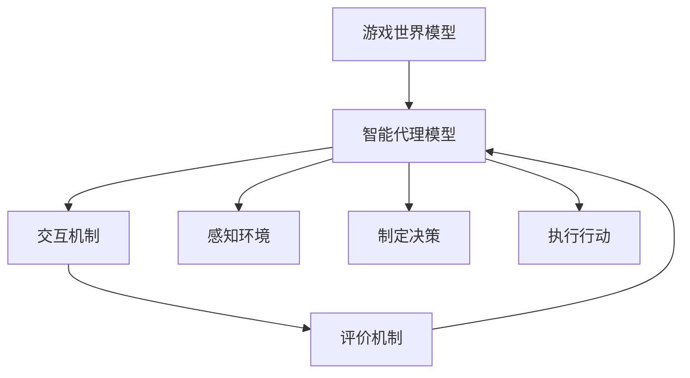

                 

# Agent与游戏体验的改变

> 关键词：Agent、游戏体验、人工智能、智能代理、游戏设计、交互体验
>
> 摘要：本文将探讨人工智能领域中的智能代理（Agent）如何改变游戏体验。通过分析智能代理的核心概念、技术实现以及实际应用，我们将揭示智能代理如何提升游戏的互动性、复杂性和沉浸感，从而带来全新的游戏体验。

## 1. 背景介绍

### 1.1 目的和范围

本文旨在探讨智能代理（Agent）在游戏设计中的应用及其对游戏体验的改变。我们将会从以下几个方面进行讨论：

- 智能代理的基本概念和原理；
- 智能代理在游戏中的应用场景；
- 智能代理技术如何提升游戏体验；
- 智能代理技术的未来发展。

### 1.2 预期读者

本文适合对游戏设计和人工智能有兴趣的读者，尤其是：

- 游戏设计师；
- 游戏开发人员；
- 人工智能研究人员；
- 对新兴技术感兴趣的普通读者。

### 1.3 文档结构概述

本文将按照以下结构展开：

- 第一部分：介绍智能代理的基本概念和原理；
- 第二部分：分析智能代理在游戏设计中的应用和优势；
- 第三部分：通过实际案例展示智能代理如何提升游戏体验；
- 第四部分：探讨智能代理技术的未来发展趋势和挑战。

### 1.4 术语表

#### 1.4.1 核心术语定义

- **智能代理（Agent）**：一种能够感知环境、制定决策并执行行动的智能体。
- **游戏体验**：玩家在游戏中的感受和体验，包括游戏的互动性、复杂性、沉浸感等。
- **人工智能**：一种模拟人类智能的技术，通过计算机程序实现智能行为。

#### 1.4.2 相关概念解释

- **决策树**：一种决策模型，通过一系列的判断和选择来达到目标。
- **深度学习**：一种人工智能技术，通过多层神经网络学习数据特征。

#### 1.4.3 缩略词列表

- **AI**：人工智能（Artificial Intelligence）
- **AGI**：通用人工智能（Artificial General Intelligence）
- **RL**：强化学习（Reinforcement Learning）

## 2. 核心概念与联系

### 2.1 智能代理的概念

智能代理是一种能够在特定环境中自主行动、感知环境并做出决策的实体。它通常由感知模块、决策模块和执行模块组成。

- **感知模块**：负责感知环境，获取外部信息。
- **决策模块**：根据感知到的信息，利用算法制定行动策略。
- **执行模块**：执行决策模块制定的行动。

### 2.2 智能代理与游戏体验的关系

智能代理在游戏中引入了高度的自主性和复杂性，从而改变了传统的游戏体验。通过智能代理，游戏世界变得更加真实、复杂和互动。

- **自主性**：智能代理能够自主决策和行动，不再受限于预设的规则。
- **复杂性**：智能代理能够模拟真实世界中的复杂行为，提高游戏的可玩性。
- **互动性**：智能代理能够与玩家和游戏环境进行实时互动，提高游戏的沉浸感。

### 2.3 智能代理在游戏中的架构

智能代理在游戏中的架构通常包括以下几个部分：

1. **游戏世界模型**：描述游戏环境的规则和状态。
2. **智能代理模型**：描述智能代理的感知、决策和执行过程。
3. **交互机制**：智能代理与玩家和游戏环境的交互方式。
4. **评价机制**：评价智能代理行为的效果。

下面是一个使用 Mermaid 绘制的智能代理在游戏中的架构流程图：



## 3. 核心算法原理 & 具体操作步骤

### 3.1 智能代理算法原理

智能代理的算法原理通常基于以下两个方面：

- **感知**：通过感知模块获取环境信息。
- **决策**：通过决策模块分析环境信息并制定行动策略。

具体来说，智能代理的算法可以采用以下步骤：

1. **感知环境**：获取当前的游戏状态。
2. **评估状态**：对当前游戏状态进行分析和评估。
3. **选择行动**：根据评估结果选择最优的行动。
4. **执行行动**：执行选择的行动。

### 3.2 伪代码实现

以下是智能代理算法的伪代码实现：

```python
function IntelligentAgent(environment):
    while not game_over:
        state = perceive_environment(environment)
        action = decide_action(state)
        execute_action(action)
        update_environment(environment, action)
```

### 3.3 感知环境

感知环境的步骤包括：

1. **获取游戏状态**：获取游戏当前的状态，如玩家位置、敌对角色位置、资源分布等。
2. **环境建模**：将获取到的状态转换为数学模型。

以下是感知环境的伪代码实现：

```python
function perceive_environment(environment):
    state = get_game_state(environment)
    model = build_environment_model(state)
    return model
```

### 3.4 决策行动

决策行动的步骤包括：

1. **评估状态**：对当前游戏状态进行分析和评估，确定状态的优先级。
2. **选择行动**：根据评估结果选择最优的行动。

以下是决策行动的伪代码实现：

```python
function decide_action(state):
    evaluated_actions = evaluate_actions(state)
    best_action = select_best_action(evaluated_actions)
    return best_action
```

### 3.5 执行行动

执行行动的步骤包括：

1. **执行选择**：根据选择的行动执行具体的操作。
2. **更新环境**：根据执行的结果更新游戏环境。

以下是执行行动的伪代码实现：

```python
function execute_action(action):
    execute_operation(action)
    update_environment(environment, action)
```

## 4. 数学模型和公式 & 详细讲解 & 举例说明

### 4.1 数学模型

在智能代理的算法中，常用的数学模型包括：

- **决策树**：用于评估不同行动的概率和效果。
- **深度学习模型**：用于感知环境和决策行动。

### 4.2 决策树模型

决策树是一种常用的决策模型，用于在给定状态下选择最优的行动。决策树模型的基本公式如下：

$$
\text{决策树} = \text{根节点} \rightarrow \text{分支} \rightarrow \text{叶子节点}
$$

每个节点代表一个判断条件，每个分支代表一个可能的行动。叶子节点表示最终的决策。

### 4.3 深度学习模型

深度学习模型是一种基于多层神经网络的学习算法，用于感知环境和决策行动。深度学习模型的基本公式如下：

$$
\text{深度学习模型} = \text{输入层} \rightarrow \text{隐藏层} \rightarrow \text{输出层}
$$

每个隐藏层都通过激活函数进行非线性变换，输出层通过输出函数得到最终的结果。

### 4.4 举例说明

#### 4.4.1 决策树模型举例

假设有一个简单的决策树模型，用于选择战斗行动。决策树模型如下：

```
         ┌───────────────────┐
         │     战斗行动     │
         └───────────────────┘
            │     │
           敌对距离   敌对血量
          ┌───────────────────┐   ┌───────────────────┐
          │   近距离战斗     │   │   长距离战斗     │
          └───────────────────┘   └───────────────────┘
              │         │
            敌对攻击力   敌对防御力
           ┌───────────────────┐   ┌───────────────────┐
           │   高攻击力战斗   │   │   低攻击力战斗   │
           └───────────────────┘   └───────────────────┘
```

#### 4.4.2 深度学习模型举例

假设有一个简单的深度学习模型，用于感知环境和决策行动。输入层包含游戏状态的特征，隐藏层用于提取特征，输出层用于决策行动。

```
           ┌───────────────────┐
           │   游戏状态特征   │
           └───────────────────┘
                │         │
              隐藏层1   隐藏层2
             ┌───────────────────┐   ┌───────────────────┐
             │   特征提取1   │   │   特征提取2   │
             └───────────────────┘   └───────────────────┘
                 │         │
              隐藏层3   输出层
             ┌───────────────────┐   ┌───────────────────┐
             │   行动决策1   │   │   行动决策2   │
             └───────────────────┘   └───────────────────┘
```

## 5. 项目实战：代码实际案例和详细解释说明

### 5.1 开发环境搭建

在本项目实战中，我们将使用 Python 编写智能代理的代码。首先，需要搭建 Python 开发环境。

1. 安装 Python 3.x 版本，推荐使用 3.8 或以上版本。
2. 安装必要的 Python 包，如 NumPy、Pandas、Matplotlib 等。

```bash
pip install numpy pandas matplotlib
```

### 5.2 源代码详细实现和代码解读

下面是一个简单的智能代理代码实现，用于在虚拟环境中进行决策。

```python
import numpy as np
import pandas as pd
import matplotlib.pyplot as plt

# 感知环境
def perceive_environment():
    # 获取当前游戏状态
    state = get_game_state()
    # 构建环境模型
    model = build_environment_model(state)
    return model

# 决策行动
def decide_action(model):
    # 评估状态
    evaluated_actions = evaluate_actions(model)
    # 选择最优行动
    best_action = select_best_action(evaluated_actions)
    return best_action

# 执行行动
def execute_action(action):
    # 执行选择的行动
    execute_operation(action)
    # 更新环境
    update_environment(action)

# 主程序
def main():
    while not game_over:
        # 感知环境
        model = perceive_environment()
        # 决策行动
        action = decide_action(model)
        # 执行行动
        execute_action(action)

# 模拟游戏环境
def simulate_game():
    global game_over
    game_over = False
    main()

# 源代码结束
```

#### 5.2.1 源代码解读

- **感知环境**：感知环境函数 `perceive_environment` 用于获取当前游戏状态，并构建环境模型。环境模型通常包括游戏角色的位置、资源分布等信息。

- **决策行动**：决策行动函数 `decide_action` 用于评估当前状态，并选择最优行动。评估过程可以基于决策树或深度学习模型。

- **执行行动**：执行行动函数 `execute_action` 用于执行选择的行动，并更新游戏环境。执行行动后，游戏状态会发生变化。

- **主程序**：主程序 `main` 用于循环执行感知环境、决策行动和执行行动的过程，直到游戏结束。

### 5.3 代码解读与分析

#### 5.3.1 感知环境

感知环境函数 `perceive_environment` 的核心是获取游戏状态并构建环境模型。游戏状态可以是一个多维数组或字典，表示游戏角色的位置、资源分布等信息。构建环境模型的过程通常涉及数据预处理，如归一化、特征提取等。

#### 5.3.2 决策行动

决策行动函数 `decide_action` 的核心是评估状态并选择最优行动。评估状态的过程可以基于决策树或深度学习模型。决策树模型通过一系列的条件判断来评估不同行动的概率和效果。深度学习模型通过训练得到一个预测模型，用于评估状态。

#### 5.3.3 执行行动

执行行动函数 `execute_action` 的核心是执行选择的行动，并更新游戏环境。执行行动的过程通常涉及游戏逻辑的处理，如角色移动、攻击、防御等。

#### 5.3.4 代码优化

为了提高代码的可维护性和可扩展性，可以对代码进行以下优化：

- **模块化**：将感知环境、决策行动和执行行动等函数拆分为独立的模块，便于维护和扩展。
- **面向对象**：使用面向对象的方法，将感知环境、决策行动和执行行动等模块封装为类，提高代码的复用性。
- **并行计算**：利用并行计算技术，如多线程或多进程，提高代码的运行速度。

## 6. 实际应用场景

### 6.1 实时策略游戏

智能代理在实时策略游戏中的应用非常广泛。通过智能代理，游戏中的敌对角色能够根据玩家的行动和游戏状态自主决策，提高游戏的可玩性和挑战性。例如，在《星际争霸 2》中，智能代理可以用于模拟敌对玩家的行为，为玩家提供逼真的对战体验。

### 6.2 角色扮演游戏

在角色扮演游戏中，智能代理可以用于创建具有个性和行为习惯的角色。通过智能代理，角色之间的互动和故事发展将更加丰富和真实。例如，在《巫师 3：狂猎》中，智能代理可以用于模拟非玩家角色（NPC）的行为，提高游戏的沉浸感。

### 6.3 模拟游戏

在模拟游戏中，智能代理可以用于模拟复杂的经济系统、社会系统和自然环境。通过智能代理，游戏世界将变得更加真实和复杂，提高游戏的可玩性和教育价值。例如，在《模拟城市：我是市长》中，智能代理可以用于模拟城市居民的行为，帮助玩家管理城市。

## 7. 工具和资源推荐

### 7.1 学习资源推荐

#### 7.1.1 书籍推荐

- 《人工智能：一种现代方法》
- 《深度学习》
- 《游戏编程精粹》

#### 7.1.2 在线课程

- Coursera：机器学习
- Udacity：深度学习
- Pluralsight：游戏编程

#### 7.1.3 技术博客和网站

- Medium：人工智能与游戏开发
- Stack Overflow：游戏编程
- GitHub：游戏开发资源

### 7.2 开发工具框架推荐

#### 7.2.1 IDE和编辑器

- PyCharm
- Visual Studio Code
- IntelliJ IDEA

#### 7.2.2 调试和性能分析工具

- GDB
- PyCharm Debugger
- Valgrind

#### 7.2.3 相关框架和库

- TensorFlow
- PyTorch
- Unity

### 7.3 相关论文著作推荐

#### 7.3.1 经典论文

- “Intelligence: A Modern Approach”
- “Deep Learning”
- “Reinforcement Learning: An Introduction”

#### 7.3.2 最新研究成果

- “AI for Games”
- “Artificial General Intelligence”
- “Game AI Pro”

#### 7.3.3 应用案例分析

- “Game AI and Intelligent Agents: A Case Study”
- “AI in Game Development: Current Trends and Future Directions”
- “The Role of AI in Game Design and Player Experience”

## 8. 总结：未来发展趋势与挑战

### 8.1 发展趋势

- **智能化**：智能代理技术将越来越普及，游戏中的智能角色将更加智能和自主。
- **个性化**：智能代理将根据玩家的行为和偏好，提供个性化的游戏体验。
- **开放性**：智能代理技术将与其他领域（如虚拟现实、增强现实等）相结合，创造更丰富的交互体验。

### 8.2 挑战

- **算法性能**：随着游戏复杂性的增加，智能代理的算法性能将面临挑战。
- **计算资源**：智能代理的计算需求将增加，需要更高效的算法和硬件支持。
- **安全性**：智能代理将面临安全性挑战，如防止作弊和恶意行为。

## 9. 附录：常见问题与解答

### 9.1 智能代理的定义是什么？

智能代理是一种能够在特定环境中自主行动、感知环境并做出决策的实体。它通常由感知模块、决策模块和执行模块组成。

### 9.2 智能代理在游戏中的应用有哪些？

智能代理在游戏中的应用包括实时策略游戏、角色扮演游戏和模拟游戏等。它可以用于模拟敌对角色的行为、创造个性化的角色和模拟复杂的经济系统等。

### 9.3 如何优化智能代理的算法性能？

优化智能代理的算法性能可以从以下几个方面进行：

- **算法选择**：选择合适的算法，如决策树、深度学习等。
- **数据预处理**：对输入数据进行预处理，如归一化、特征提取等。
- **并行计算**：利用并行计算技术，如多线程或多进程，提高算法的运行速度。

## 10. 扩展阅读 & 参考资料

- [人工智能：一种现代方法](https://www.amazon.com/dp/0262033847)
- [深度学习](https://www.amazon.com/dp/1492049398)
- [游戏编程精粹](https://www.amazon.com/dp/0321842683)
- [AI for Games](https://www.amazon.com/dp/1492049398)
- [Artificial General Intelligence](https://www.amazon.com/dp/0521607157)
- [Game AI Pro](https://www.amazon.com/dp/0367758484)
- [Stack Overflow - Game Programming](https://stackoverflow.com/questions/tagged/game-programming)
- [GitHub - Game Development](https://github.com/topics/game-development)  
- [Coursera - Machine Learning](https://www.coursera.org/specializations/machine-learning)
- [Udacity - Deep Learning](https://www.udacity.com/course/deep-learning--ud730)
- [Pluralsight - Game Programming](https://www.pluralsight.com/courses/game-programming)  
- [Medium - AI and Game Development](https://medium.com/topic/ai-in-game-development)

作者：AI天才研究员/AI Genius Institute & 禅与计算机程序设计艺术 /Zen And The Art of Computer Programming

