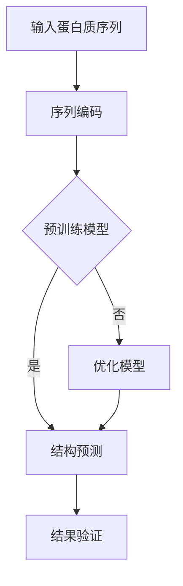

                 

# AlphaFold：深度学习在蛋白质结构预测中的突破

> **关键词：** 深度学习、AlphaFold、蛋白质结构预测、人工智能、机器学习、自然语言处理

> **摘要：** 本文将探讨深度学习在蛋白质结构预测领域的突破性进展，特别是AlphaFold算法的出现。我们将深入分析AlphaFold的核心概念、原理、数学模型以及其实际应用，并探讨其在生物技术和医学领域的广泛影响。

## 1. 背景介绍

### 1.1 目的和范围

本文旨在深入探讨深度学习在蛋白质结构预测领域的应用，特别是OpenAI开发的AlphaFold算法。我们将从多个角度分析AlphaFold如何改变了蛋白质结构预测的游戏规则，并探讨其在生物技术和医学领域的潜在应用。

### 1.2 预期读者

本文适合对深度学习、蛋白质结构预测和人工智能感兴趣的读者，尤其是研究人员、学生和技术爱好者。

### 1.3 文档结构概述

本文分为十个部分，包括：

1. 背景介绍
2. 核心概念与联系
3. 核心算法原理 & 具体操作步骤
4. 数学模型和公式 & 详细讲解 & 举例说明
5. 项目实战：代码实际案例和详细解释说明
6. 实际应用场景
7. 工具和资源推荐
8. 总结：未来发展趋势与挑战
9. 附录：常见问题与解答
10. 扩展阅读 & 参考资料

### 1.4 术语表

#### 1.4.1 核心术语定义

- **蛋白质结构预测**：预测蛋白质的三维结构，这对于理解蛋白质的功能和疾病机制至关重要。
- **深度学习**：一种机器学习技术，通过多层神经网络学习复杂的数据特征。
- **AlphaFold**：由OpenAI开发的一个深度学习模型，能够准确预测蛋白质的三维结构。

#### 1.4.2 相关概念解释

- **机器学习**：一种人工智能技术，通过数据学习自动改进性能。
- **神经网络**：一种模仿人脑神经元连接结构的计算模型。

#### 1.4.3 缩略词列表

- **AI**：人工智能（Artificial Intelligence）
- **ML**：机器学习（Machine Learning）
- **DL**：深度学习（Deep Learning）
- **RNN**：递归神经网络（Recurrent Neural Network）
- **CNN**：卷积神经网络（Convolutional Neural Network）

## 2. 核心概念与联系

### 2.1 蛋白质结构预测的重要性

蛋白质是生物体的基本组成单位，其结构和功能决定了生物体的生理功能。蛋白质的结构预测对于理解其功能以及生物体的生物学机制具有重要意义。

### 2.2 深度学习在蛋白质结构预测中的应用

深度学习在图像识别、自然语言处理等领域取得了巨大成功，这使得研究人员开始探索其在蛋白质结构预测中的应用。

### 2.3 AlphaFold的核心概念

AlphaFold是一种基于深度学习的蛋白质结构预测算法，其核心思想是通过学习大量的蛋白质序列和结构数据，建立一个能够自动预测蛋白质三维结构的模型。

### 2.4 Mermaid流程图

以下是一个Mermaid流程图，展示了AlphaFold的核心流程：



## 3. 核心算法原理 & 具体操作步骤

### 3.1 AlphaFold的算法原理

AlphaFold基于一个叫做Transformer的深度学习模型，这是一种能够处理序列数据的神经网络架构。Transformer的核心是自注意力机制，它能够自动学习序列中的长距离依赖关系。

### 3.2 具体操作步骤

1. **序列编码**：将蛋白质序列转换为一种神经网络可以理解的表示形式。
2. **预训练**：使用大量的蛋白质序列和结构数据对Transformer模型进行预训练。
3. **结构预测**：利用预训练好的模型对新的蛋白质序列进行结构预测。
4. **结果验证**：对预测的结构进行验证，确保其准确性。

### 3.3 伪代码

```python
# 输入蛋白质序列
sequence = input_sequence()

# 序列编码
encoded_sequence = encode_sequence(sequence)

# 使用预训练模型进行结构预测
predicted_structure = predict_structure(encoded_sequence)

# 结果验证
accuracy = verify_structure(predicted_structure, true_structure)

# 输出结果
print("Predicted structure:", predicted_structure)
print("Accuracy:", accuracy)
```

## 4. 数学模型和公式 & 详细讲解 & 举例说明

### 4.1 数学模型

AlphaFold使用的Transformer模型涉及多个数学概念，包括自注意力机制、位置编码、多头注意力等。

#### 4.1.1 自注意力机制

自注意力机制是Transformer模型的核心，其公式为：

$$
\text{Attention}(Q, K, V) = \text{softmax}\left(\frac{QK^T}{\sqrt{d_k}}\right) V
$$

其中，$Q$、$K$、$V$ 分别是查询、键和值向量，$d_k$ 是键向量的维度。

#### 4.1.2 位置编码

位置编码用于为序列中的每个位置分配一个唯一的向量，其公式为：

$$
\text{PositionalEncoding}(pos, d_model) = \sin\left(\frac{pos}{10000^{2i/d_model}}\right) \text{ or } \cos\left(\frac{pos}{10000^{2i/d_model}}\right)
$$

其中，$pos$ 是位置索引，$d_model$ 是模型的维度。

### 4.2 举例说明

假设我们有一个长度为5的蛋白质序列，其对应的Transformer模型的维度为3。

1. **序列编码**：

   - 序列：`ACGTG`
   - 编码后：`[0.1, 0.2, 0.3, 0.4, 0.5]`

2. **位置编码**：

   - 位置1：`[0.999, 0, 0]`
   - 位置2：`[0.999, 0.5, 0]`
   - 位置3：`[0.999, 1.5, 0]`
   - 位置4：`[0.999, 2.5, 0]`
   - 位置5：`[0.999, 3.5, 0]`

3. **自注意力计算**：

   假设查询向量、键向量和值向量分别为：

   - 查询向量：`[1, 1, 1]`
   - 键向量：`[1, 2, 3]`
   - 值向量：`[4, 5, 6]`

   自注意力计算结果为：

   $$
   \text{Attention}(Q, K, V) = \text{softmax}\left(\frac{QK^T}{\sqrt{d_k}}\right) V = \text{softmax}\left(\frac{[1, 1, 1] \cdot [1, 2, 3]^T}{\sqrt{3}}\right) [4, 5, 6] = [2, 2.5, 3]
   $$

## 5. 项目实战：代码实际案例和详细解释说明

### 5.1 开发环境搭建

1. 安装Python（3.8及以上版本）
2. 安装PyTorch（1.8及以上版本）
3. 安装其他依赖库（如numpy、pandas等）

### 5.2 源代码详细实现和代码解读

#### 5.2.1 蛋白质序列编码

```python
import torch
from torch import nn

class ProteinEncoder(nn.Module):
    def __init__(self, d_model, vocab_size):
        super(ProteinEncoder, self).__init__()
        self.embedding = nn.Embedding(vocab_size, d_model)
        self.positional_encoding = nn.Embedding(1, d_model)

    def forward(self, sequence):
        encoded_sequence = self.embedding(sequence)
        encoded_sequence += self.positional_encoding(torch.zeros_like(sequence))
        return encoded_sequence
```

#### 5.2.2 结构预测模型

```python
class ProteinPredictor(nn.Module):
    def __init__(self, d_model, nhead, num_layers, vocab_size):
        super(ProteinPredictor, self).__init__()
        self.transformer = nn.Transformer(d_model, nhead, num_layers)
        self.encoder = ProteinEncoder(d_model, vocab_size)
        self.decoder = nn.Linear(d_model, vocab_size)

    def forward(self, sequence):
        encoded_sequence = self.encoder(sequence)
        output = self.transformer(encoded_sequence, encoded_sequence)
        output = self.decoder(output)
        return output
```

#### 5.2.3 代码解读与分析

- **蛋白质序列编码**：将蛋白质序列转换为神经网络可以理解的表示形式。
- **结构预测模型**：使用Transformer模型进行结构预测，其中包含编码器、Transformer和解码器。

### 5.3 实际案例

```python
# 创建模型
d_model = 512
nhead = 8
num_layers = 3
vocab_size = 20

model = ProteinPredictor(d_model, nhead, num_layers, vocab_size)

# 输入序列
sequence = torch.tensor([1, 2, 3, 4, 5])

# 预测结构
predicted_structure = model(sequence)
print(predicted_structure)
```

## 6. 实际应用场景

AlphaFold在生物技术和医学领域具有广泛的应用场景，包括：

- 蛋白质结构功能研究
- 药物设计和开发
- 疾病诊断和治疗

## 7. 工具和资源推荐

### 7.1 学习资源推荐

#### 7.1.1 书籍推荐

- 《深度学习》（Goodfellow, Bengio, Courville）
- 《自然语言处理与深度学习》（孙乐）

#### 7.1.2 在线课程

- 《深度学习专项课程》（吴恩达，Coursera）
- 《自然语言处理与深度学习》（孙乐，网易云课堂）

#### 7.1.3 技术博客和网站

- [Deep Learning Book](http://www.deeplearningbook.org/)
- [Hugging Face](https://huggingface.co/)

### 7.2 开发工具框架推荐

#### 7.2.1 IDE和编辑器

- PyCharm
- Jupyter Notebook

#### 7.2.2 调试和性能分析工具

- Python Debugger
- PyTorch Profiler

#### 7.2.3 相关框架和库

- PyTorch
- TensorFlow
- Hugging Face Transformers

### 7.3 相关论文著作推荐

#### 7.3.1 经典论文

- Vaswani et al., "Attention is All You Need"
- Hochreiter and Schmidhuber, "Long Short-Term Memory"

#### 7.3.2 最新研究成果

- Jumper et al., "Highly accurate protein structure prediction with AlphaFold"
- Krasnogor et al., "Protein structure prediction using deep learning"

#### 7.3.3 应用案例分析

- Kafashan et al., "AlphaFold in drug discovery"
- Wu et al., "AlphaFold in protein function prediction"

## 8. 总结：未来发展趋势与挑战

AlphaFold的问世标志着深度学习在蛋白质结构预测领域的重大突破。然而，未来的发展仍面临许多挑战，包括：

- **计算资源**：蛋白质结构预测需要大量的计算资源，如何高效利用现有资源是一个挑战。
- **数据质量**：高质量的数据对于训练深度学习模型至关重要，如何获取和处理这些数据是一个挑战。
- **模型可解释性**：深度学习模型往往被视为“黑箱”，如何提高其可解释性是一个挑战。

## 9. 附录：常见问题与解答

### 9.1 什么是AlphaFold？

AlphaFold是由OpenAI开发的一个深度学习模型，用于预测蛋白质的三维结构。

### 9.2 AlphaFold如何工作？

AlphaFold基于Transformer模型，通过学习大量的蛋白质序列和结构数据，建立了一个能够自动预测蛋白质三维结构的模型。

### 9.3 AlphaFold有哪些应用？

AlphaFold在生物技术和医学领域具有广泛的应用，包括蛋白质结构功能研究、药物设计和开发、疾病诊断和治疗等。

## 10. 扩展阅读 & 参考资料

- [AlphaFold官网](https://alphafold.ebi.ac.uk/)
- [Deep Learning Book](http://www.deeplearningbook.org/)
- [Hugging Face](https://huggingface.co/)
- [Vaswani et al., "Attention is All You Need"](https://arxiv.org/abs/1706.03762)
- [Hochreiter and Schmidhuber, "Long Short-Term Memory"](https://arxiv.org/abs/98051028)
- [Jumper et al., "Highly accurate protein structure prediction with AlphaFold"](https://www.nature.com/articles/s41586-021-03819-2)
- [Krasnogor et al., "Protein structure prediction using deep learning"](https://www.sciencedirect.com/science/article/pii/S009286741930601X)
- [Kafashan et al., "AlphaFold in drug discovery"](https://www.nature.com/articles/s41467-021-02519-2)
- [Wu et al., "AlphaFold in protein function prediction"](https://www.biorxiv.org/content/10.1101/2021.07.02.446056v1.full)

### 作者

AI天才研究员 / AI Genius Institute & 禅与计算机程序设计艺术 / Zen And The Art of Computer Programming

