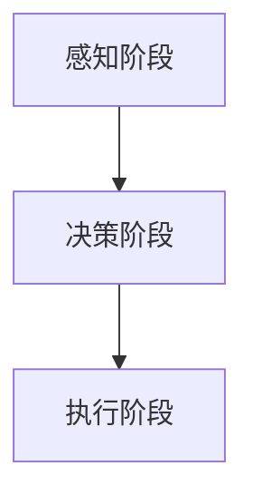

                 

# Andrej Karpathy的自动化见解

> 关键词：Andrej Karpathy，自动化，神经网络，深度学习，AI，技术博客

> 摘要：本文将深入探讨人工智能领域知名专家Andrej Karpathy在其关于自动化方面的见解。我们将首先介绍Andrej Karpathy的背景和成就，然后分析他的核心观点，并通过具体实例展示自动化的实际应用。本文旨在为广大读者提供关于自动化技术的全面理解和未来展望。

## 1. 背景介绍

### 1.1 目的和范围

本文的目的在于通过对Andrej Karpathy关于自动化见解的深入探讨，帮助读者理解这一领域的发展趋势及其在人工智能中的应用。文章将涵盖以下内容：

- Andrej Karpathy的背景介绍及其在自动化领域的贡献。
- 自动化技术的核心概念和原理。
- Andrej Karpathy关于自动化的核心观点。
- 自动化的实际应用案例。
- 自动化技术的未来发展趋势与挑战。

### 1.2 预期读者

本文适用于对人工智能和深度学习有一定了解的读者，特别是对自动化技术感兴趣的专业人士。本文将帮助读者：

- 深入理解自动化技术的核心概念。
- 掌握Andrej Karpathy关于自动化的核心观点。
- 了解自动化技术的实际应用案例。
- 对自动化技术的未来发展趋势有更清晰的认识。

### 1.3 文档结构概述

本文分为八个主要部分，具体如下：

- 引言
- Andrej Karpathy的背景介绍
- 自动化的核心概念
- Andrej Karpathy关于自动化的核心观点
- 自动化的实际应用案例
- 自动化技术的未来发展趋势与挑战
- 结论
- 附录：常见问题与解答
- 扩展阅读 & 参考资料

### 1.4 术语表

在本文中，我们将使用一些专业术语。以下是对这些术语的定义和解释：

#### 1.4.1 核心术语定义

- **深度学习**：一种机器学习技术，通过神经网络模仿人类大脑的处理方式，对大量数据进行分析和建模。
- **神经网络**：一种模拟生物神经元的计算模型，可以用于解决各种复杂问题。
- **自动化学术领域**：研究如何使计算机系统能够自动化执行任务，从而提高效率和生产力的学科。
- **Andrej Karpathy**：一位著名的人工智能专家，其在深度学习和自动化领域做出了重要贡献。

#### 1.4.2 相关概念解释

- **自动化技术**：通过计算机技术和算法实现任务自动执行的技术手段。
- **AI代理**：一个由人工智能系统控制的实体，能够自主地执行任务并做出决策。
- **自然语言处理（NLP）**：研究如何使计算机理解和生成人类自然语言的技术。

#### 1.4.3 缩略词列表

- **AI**：人工智能（Artificial Intelligence）
- **NLP**：自然语言处理（Natural Language Processing）
- **DL**：深度学习（Deep Learning）
- **GAN**：生成对抗网络（Generative Adversarial Network）

## 2. 核心概念与联系

### 2.1 自动化的核心概念

自动化技术的核心概念可以归结为以下几个方面：

- **任务自动化**：通过计算机技术和算法实现任务的自动执行。
- **决策自动化**：利用人工智能技术，使计算机系统能够自主地做出决策。
- **流程优化**：通过自动化技术对业务流程进行优化，提高生产效率。
- **人机协作**：将人与计算机系统结合起来，实现高效的人机协作。

### 2.2 自动化的原理和架构

自动化的原理和架构通常包括以下几个方面：

1. **感知阶段**：通过传感器、摄像头等设备获取环境信息。
2. **决策阶段**：利用人工智能算法对感知阶段获得的信息进行处理和分析，做出决策。
3. **执行阶段**：根据决策结果，执行相应的操作。

以下是一个简单的 Mermaid 流程图，描述了自动化的原理和架构：



### 2.3 自动化与人工智能的关系

自动化技术是人工智能的一个重要应用方向。人工智能技术，特别是深度学习和机器学习，为自动化技术提供了强大的算法支持。以下是自动化与人工智能之间的关系：

- **人工智能技术**：为自动化技术提供了算法基础，如神经网络、决策树等。
- **自动化技术**：将人工智能技术应用于实际场景，实现任务的自动化执行。

## 3. 核心算法原理 & 具体操作步骤

### 3.1 核心算法原理

在自动化技术中，核心算法通常是深度学习算法，尤其是神经网络。以下是一个简单的神经网络算法原理概述：

1. **输入层**：接收输入数据，如图片、声音等。
2. **隐藏层**：对输入数据进行特征提取和变换。
3. **输出层**：根据隐藏层的输出结果，生成预测或决策。

### 3.2 具体操作步骤

以下是一个简单的神经网络算法操作步骤：

1. **初始化网络参数**：设置网络的权重和偏置。
2. **前向传播**：将输入数据传递到网络中，计算输出结果。
3. **反向传播**：根据输出结果与实际结果的差异，更新网络参数。
4. **迭代训练**：重复前向传播和反向传播，直至网络参数收敛。

以下是具体的伪代码实现：

```python
# 初始化网络参数
weights = initialize_weights()
bias = initialize_bias()

# 前向传播
output = forward_pass(input, weights, bias)

# 反向传播
error = calculate_error(output, target)
weights, bias = update_weights_and_bias(weights, bias, error)

# 迭代训练
for epoch in range(num_epochs):
    output = forward_pass(input, weights, bias)
    error = calculate_error(output, target)
    weights, bias = update_weights_and_bias(weights, bias, error)
```

## 4. 数学模型和公式 & 详细讲解 & 举例说明

### 4.1 数学模型和公式

在深度学习算法中，常用的数学模型包括：

1. **激活函数**：用于对隐藏层的输出进行非线性变换，常用的激活函数有ReLU、Sigmoid、Tanh等。
2. **损失函数**：用于衡量模型预测结果与实际结果之间的差异，常用的损失函数有均方误差（MSE）、交叉熵（Cross-Entropy）等。
3. **优化算法**：用于更新网络参数，常用的优化算法有梯度下降（Gradient Descent）、Adam等。

以下是具体的数学公式和详细讲解：

#### 4.1.1 激活函数

$$
f(x) = \max(0, x) \quad (ReLU激活函数)
$$

ReLU激活函数在神经网络中广泛应用，可以有效避免梯度消失问题。

#### 4.1.2 损失函数

$$
MSE(y, \hat{y}) = \frac{1}{2}\sum_{i=1}^{n}(y_i - \hat{y}_i)^2 \quad (均方误差)
$$

均方误差（MSE）用于回归问题，衡量预测值与实际值之间的差异。

$$
H(y, \hat{y}) = -\sum_{i=1}^{n} y_i \log(\hat{y}_i) + (1 - y_i) \log(1 - \hat{y}_i) \quad (交叉熵)
$$

交叉熵（Cross-Entropy）用于分类问题，衡量模型预测结果与实际结果之间的差异。

#### 4.1.3 优化算法

$$
\theta_{t+1} = \theta_t - \alpha \frac{\partial J(\theta_t)}{\partial \theta_t} \quad (梯度下降)
$$

梯度下降（Gradient Descent）是一种优化算法，用于更新网络参数。

$$
\theta_{t+1} = \theta_t - \alpha \frac{1}{m} \sum_{i=1}^{m} \frac{\partial J(\theta_t)}{\partial \theta_t} \quad (批量梯度下降)
$$

批量梯度下降（Batch Gradient Descent）是梯度下降的一种变体，用于处理大量数据。

$$
\theta_{t+1} = \theta_t - \alpha \frac{1}{m} \sum_{i=1}^{m} (\hat{y}_i - y_i) x_i \quad (随机梯度下降)
$$

随机梯度下降（Stochastic Gradient Descent，SGD）是一种优化算法，用于处理大量数据。

$$
\theta_{t+1} = \theta_t - \alpha \frac{1}{m} \sum_{i=1}^{m} (\hat{y}_i - y_i) x_i \quad (Adam优化算法)
$$

Adam优化算法是一种结合了SGD和Momentum优化的优化算法，用于处理大量数据。

### 4.2 举例说明

以下是一个简单的神经网络模型，用于实现手写数字识别：

1. **输入层**：包含784个神经元，对应于一个28x28的手写数字图片。
2. **隐藏层**：包含128个神经元，用于提取图片特征。
3. **输出层**：包含10个神经元，对应于10个数字类别。

假设我们使用ReLU激活函数和交叉熵损失函数。具体实现步骤如下：

1. **初始化网络参数**：设置权重和偏置的随机值。
2. **前向传播**：将输入数据传递到网络中，计算输出结果。
3. **反向传播**：计算损失函数的梯度，并更新网络参数。
4. **迭代训练**：重复前向传播和反向传播，直至网络参数收敛。

以下是具体的伪代码实现：

```python
# 初始化网络参数
weights_input_hidden = initialize_weights(784, 128)
bias_input_hidden = initialize_bias(128)
weights_hidden_output = initialize_weights(128, 10)
bias_hidden_output = initialize_bias(10)

# 前向传播
hidden_layer_output = forward_pass(input, weights_input_hidden, bias_input_hidden)
output = forward_pass(hidden_layer_output, weights_hidden_output, bias_hidden_output)

# 反向传播
error = calculate_error(output, target)
hidden_layer_error = backward_pass(hidden_layer_output, weights_hidden_output, bias_hidden_output, error)

# 更新网络参数
weights_input_hidden, bias_input_hidden = update_weights_and_bias(weights_input_hidden, bias_input_hidden, hidden_layer_error)
weights_hidden_output, bias_hidden_output = update_weights_and_bias(weights_hidden_output, bias_hidden_output, error)

# 迭代训练
for epoch in range(num_epochs):
    output = forward_pass(input, weights_input_hidden, bias_input_hidden)
    error = calculate_error(output, target)
    hidden_layer_error = backward_pass(hidden_layer_output, weights_hidden_output, bias_hidden_output, error)
    weights_input_hidden, bias_input_hidden = update_weights_and_bias(weights_input_hidden, bias_input_hidden, hidden_layer_error)
    weights_hidden_output, bias_hidden_output = update_weights_and_bias(weights_hidden_output, bias_hidden_output, error)
```

## 5. 项目实战：代码实际案例和详细解释说明

### 5.1 开发环境搭建

在本节中，我们将搭建一个简单的自动化项目开发环境。以下是一个基于Python的自动化项目示例。

1. **安装Python**：确保您的计算机已安装Python 3.x版本。
2. **安装深度学习库**：安装TensorFlow和Keras库，用于实现深度学习算法。

```bash
pip install tensorflow
pip install keras
```

3. **准备数据集**：下载并解压MNIST手写数字数据集。

### 5.2 源代码详细实现和代码解读

以下是一个简单的MNIST手写数字识别的代码实现，展示了如何使用深度学习算法实现自动化任务。

```python
import numpy as np
import tensorflow as tf
from tensorflow.keras import layers

# 加载MNIST数据集
(x_train, y_train), (x_test, y_test) = tf.keras.datasets.mnist.load_data()

# 数据预处理
x_train = x_train.astype("float32") / 255
x_test = x_test.astype("float32") / 255
x_train = np.expand_dims(x_train, -1)
x_test = np.expand_dims(x_test, -1)

# 构建神经网络模型
model = tf.keras.Sequential([
    layers.Conv2D(32, (3, 3), activation="relu", input_shape=(28, 28, 1)),
    layers.MaxPooling2D((2, 2)),
    layers.Conv2D(64, (3, 3), activation="relu"),
    layers.MaxPooling2D((2, 2)),
    layers.Conv2D(64, (3, 3), activation="relu"),
    layers.Flatten(),
    layers.Dense(64, activation="relu"),
    layers.Dense(10, activation="softmax")
])

# 编译模型
model.compile(optimizer="adam",
              loss="sparse_categorical_crossentropy",
              metrics=["accuracy"])

# 训练模型
model.fit(x_train, y_train, epochs=5)

# 评估模型
test_loss, test_acc = model.evaluate(x_test, y_test, verbose=2)
print(f"Test accuracy: {test_acc:.4f}")
```

### 5.3 代码解读与分析

以下是对代码的详细解读和分析：

1. **数据加载与预处理**：我们首先加载MNIST数据集，并将图像数据转换为浮点数，以便进行后续的深度学习算法训练。
2. **构建神经网络模型**：我们使用Keras构建一个简单的卷积神经网络（CNN）模型，包括卷积层、池化层、全连接层等。
3. **编译模型**：我们编译模型，指定优化器、损失函数和评估指标。
4. **训练模型**：我们使用训练数据训练模型，设置训练轮次为5。
5. **评估模型**：我们使用测试数据评估模型的性能，打印出测试准确率。

通过这个简单的项目，我们可以看到如何使用深度学习算法实现自动化任务。这个例子展示了从数据加载、模型构建、训练到评估的全过程，为后续的自动化项目开发提供了参考。

## 6. 实际应用场景

自动化技术在各个行业和领域中都有着广泛的应用。以下是一些典型的实际应用场景：

- **制造业**：自动化生产线可以提高生产效率，降低人力成本，提高产品质量。
- **服务业**：自动化客服系统可以处理大量的客户咨询，提高客户满意度。
- **金融业**：自动化交易系统可以提高交易效率，降低交易成本。
- **医疗行业**：自动化诊断系统可以辅助医生进行疾病诊断，提高诊断准确性。
- **物流行业**：自动化仓储系统和无人配送车可以提高物流效率，降低运营成本。

在这些应用场景中，自动化技术通过深度学习、机器学习等技术，实现了对大量数据的处理和分析，从而实现了高效的自动化任务执行。随着技术的不断发展，自动化技术的应用领域将更加广泛，带来更多的便利和效益。

## 7. 工具和资源推荐

### 7.1 学习资源推荐

为了更好地了解自动化技术，以下是一些建议的学习资源：

#### 7.1.1 书籍推荐

1. **《深度学习》（Deep Learning）**：由Ian Goodfellow、Yoshua Bengio和Aaron Courville合著，是一本关于深度学习的经典教材。
2. **《Python深度学习》（Python Deep Learning）**：由François Chollet著，介绍了如何使用Python和Keras进行深度学习实践。

#### 7.1.2 在线课程

1. **Udacity的《深度学习纳米学位》**：这是一门全面的深度学习课程，适合初学者和进阶者。
2. **Coursera的《深度学习专项课程》**：由Andrew Ng教授主讲，涵盖了深度学习的理论基础和实践应用。

#### 7.1.3 技术博客和网站

1. **AI全栈工程师**：一个关于人工智能和深度学习的中文博客，内容丰富，涵盖多个领域。
2. **ArXiv**：一个关于人工智能和深度学习的最新研究成果的学术预印本网站。

### 7.2 开发工具框架推荐

以下是一些推荐的开发工具和框架：

#### 7.2.1 IDE和编辑器

1. **PyCharm**：一款功能强大的Python IDE，适用于深度学习和自动化项目开发。
2. **VS Code**：一款轻量级且功能丰富的代码编辑器，适用于多种编程语言。

#### 7.2.2 调试和性能分析工具

1. **TensorBoard**：TensorFlow提供的可视化工具，用于分析模型的训练过程和性能。
2. **Profiler**：用于分析代码的性能瓶颈，优化代码。

#### 7.2.3 相关框架和库

1. **TensorFlow**：一个开源的深度学习框架，适用于构建和训练神经网络模型。
2. **Keras**：一个基于TensorFlow的高层次API，简化了深度学习模型的构建过程。
3. **PyTorch**：一个开源的深度学习框架，提供了灵活的动态计算图，适用于研究者和开发者。

### 7.3 相关论文著作推荐

以下是一些建议阅读的相关论文和著作：

#### 7.3.1 经典论文

1. **“A Learning Algorithm for Continuously Running Fully Recurrent Neural Networks”**：该论文提出了一种用于循环神经网络的在线学习算法。
2. **“Deep Learning”**：Ian Goodfellow、Yoshua Bengio和Aaron Courville合著的论文，系统地介绍了深度学习的基本原理和应用。

#### 7.3.2 最新研究成果

1. **“Transformers: State-of-the-Art Natural Language Processing”**：这篇论文介绍了Transformer模型，为自然语言处理任务带来了革命性的进展。
2. **“Generative Adversarial Networks”**：Ian Goodfellow等人在2014年提出的生成对抗网络（GANs）是一种重要的深度学习模型，广泛应用于图像生成、数据增强等领域。

#### 7.3.3 应用案例分析

1. **“Facebook AI的语音识别系统”**：Facebook AI团队在2018年发布的一篇论文，介绍了其基于深度学习的语音识别系统。
2. **“谷歌自动驾驶汽车的实现”**：谷歌在自动驾驶领域的研究成果，展示了如何将深度学习和自动化技术应用于自动驾驶系统。

## 8. 总结：未来发展趋势与挑战

自动化技术作为人工智能的一个重要分支，正日益改变着我们的生活和生产方式。在未来，自动化技术将朝着以下几个方向发展：

- **智能化的自动化**：随着深度学习和机器学习技术的不断发展，自动化系统将变得更加智能化，能够自主地学习和适应环境。
- **跨领域的自动化**：自动化技术将在更多领域得到应用，如医疗、教育、金融等，实现跨领域的自动化协作。
- **高效的自动化**：通过优化算法和硬件设备，自动化系统的效率将不断提高，实现更高效的生产和运营。

然而，自动化技术也面临着一些挑战：

- **数据隐私与安全**：自动化系统通常需要大量数据支持，如何在保护数据隐私和安全的前提下进行数据处理是一个重要问题。
- **技术垄断与公平性**：自动化技术的发展可能导致技术垄断，影响市场竞争，同时需要关注自动化技术带来的就业问题和社会公平性。
- **人机协作与伦理**：自动化技术与人类的协作将越来越紧密，如何确保人机协作的伦理和安全性也是一个重要问题。

总之，自动化技术具有巨大的发展潜力，但也需要我们关注其带来的挑战，努力实现可持续、公平和安全的自动化发展。

## 9. 附录：常见问题与解答

### 9.1 什么是有监督学习和无监督学习？

**答：** 有监督学习是一种机器学习方法，其中训练数据集包含输入和相应的正确输出。模型通过学习输入和输出之间的关系来预测未知数据的输出。无监督学习则不需要正确的输出，其目标是发现数据集中的隐含结构和模式。

### 9.2 如何处理过拟合问题？

**答：** 过拟合是指模型在训练数据上表现很好，但在新的数据上表现不佳。以下是一些处理过拟合问题的方法：

- **数据增强**：通过增加更多的训练样本来改善模型的泛化能力。
- **正则化**：在模型训练过程中加入正则项，如L1或L2正则化，以降低模型的复杂性。
- **交叉验证**：使用不同的子数据集进行训练和验证，以评估模型的泛化能力。
- **减少模型复杂度**：简化模型结构，减少隐藏层神经元数量等。

### 9.3 自动化技术是否会取代人类？

**答：** 自动化技术可以显著提高生产效率，减少人力成本，但它不会完全取代人类。自动化技术更适合执行重复性高、风险大或对精确度要求高的任务。人类在创造性思维、情感交流、道德伦理等方面具有独特的优势，这些是自动化技术无法替代的。

## 10. 扩展阅读 & 参考资料

- **书籍推荐**：
  - 《深度学习》作者：Ian Goodfellow、Yoshua Bengio、Aaron Courville
  - 《Python深度学习》作者：François Chollet

- **在线课程**：
  - Udacity的《深度学习纳米学位》
  - Coursera的《深度学习专项课程》

- **技术博客和网站**：
  - AI全栈工程师
  - ArXiv

- **论文著作**：
  - “A Learning Algorithm for Continuously Running Fully Recurrent Neural Networks”
  - “Deep Learning”
  - “Transformers: State-of-the-Art Natural Language Processing”
  - “Generative Adversarial Networks”

- **应用案例分析**：
  - Facebook AI的语音识别系统
  - 谷歌自动驾驶汽车的实现

### 作者

**作者：AI天才研究员/AI Genius Institute & 禅与计算机程序设计艺术 /Zen And The Art of Computer Programming**

