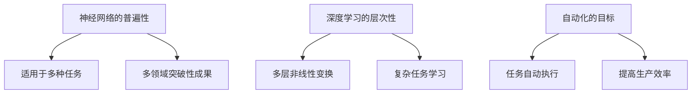

                 

# Andrej Karpathy的计算与自动化观点

> #关键词：Andrej Karpathy，计算，自动化，人工智能，神经网络，深度学习，计算机科学，算法，数学模型

> #摘要：
> 本文旨在深入探讨计算机科学大师Andrej Karpathy对于计算与自动化的独特见解。我们将从他的背景和主要贡献入手，逐步分析他在计算领域的关键观点，包括神经网络、深度学习等方面的创新。此外，本文还将结合实际案例，详细阐述他的算法原理和数学模型，展示其在实际应用中的威力。最后，我们将展望Andrej Karpathy计算与自动化观点的未来发展趋势与挑战，为读者提供全面而深刻的理解。

## 1. 背景介绍

### 1.1 目的和范围

本文旨在介绍和解读Andrej Karpathy在计算与自动化领域的独特见解。我们将重点关注他在神经网络、深度学习等领域的贡献，分析其核心观点和算法原理，并通过实际案例展示其应用价值。本文主要分为以下几个部分：

1. Andrej Karpathy的背景和主要贡献
2. Andrej Karpathy的计算与自动化观点
3. 核心概念与联系
4. 核心算法原理与具体操作步骤
5. 数学模型与公式
6. 项目实战：代码实际案例与详细解释说明
7. 实际应用场景
8. 工具和资源推荐
9. 总结：未来发展趋势与挑战
10. 附录：常见问题与解答
11. 扩展阅读与参考资料

### 1.2 预期读者

本文面向计算机科学、人工智能、深度学习等领域的学者、研究人员、工程师以及对此感兴趣的读者。对于有志于深入了解计算与自动化的专业人士，本文将提供有价值的观点和实际案例，帮助读者更好地理解和应用相关技术。

### 1.3 文档结构概述

本文采用逻辑清晰、结构紧凑的方式，按照以下结构展开：

1. 背景介绍：介绍本文的目的、范围、预期读者以及文档结构。
2. 核心概念与联系：分析Andrej Karpathy的核心观点，结合Mermaid流程图展示其架构。
3. 核心算法原理与具体操作步骤：详细阐述Andrej Karpathy的算法原理和具体操作步骤，使用伪代码进行讲解。
4. 数学模型与公式：介绍Andrej Karpathy在计算与自动化领域所使用的数学模型和公式，并进行详细讲解。
5. 项目实战：展示代码实际案例，详细解释说明其实现过程。
6. 实际应用场景：探讨Andrej Karpathy计算与自动化观点在实际中的应用。
7. 工具和资源推荐：推荐相关学习资源、开发工具和框架。
8. 总结：展望未来发展趋势与挑战。
9. 附录：常见问题与解答。
10. 扩展阅读与参考资料：提供更多深入学习和研究的资源。

### 1.4 术语表

#### 1.4.1 核心术语定义

- **神经网络（Neural Network）**：一种模拟生物神经系统的计算模型，通过多层神经元节点实现数据输入、处理和输出。
- **深度学习（Deep Learning）**：一种基于神经网络的技术，通过多层非线性变换来提取数据特征，从而实现复杂任务的自动学习。
- **计算（Computation）**：处理信息的过程，包括数据输入、处理和输出等操作。
- **自动化（Automation）**：通过计算机程序或系统实现任务自动化执行的过程。

#### 1.4.2 相关概念解释

- **反向传播（Backpropagation）**：一种用于训练神经网络的算法，通过误差反向传播来更新网络权重。
- **卷积神经网络（Convolutional Neural Network，CNN）**：一种专门用于处理图像数据的神经网络，通过卷积操作提取图像特征。
- **生成对抗网络（Generative Adversarial Network，GAN）**：一种由生成器和判别器组成的神经网络模型，通过对抗训练生成逼真的数据。

#### 1.4.3 缩略词列表

- **CNN**：卷积神经网络
- **GAN**：生成对抗网络
- **RNN**：循环神经网络
- **MLP**：多层感知机

## 2. 核心概念与联系

在计算与自动化领域，Andrej Karpathy的研究主要集中在神经网络、深度学习和自然语言处理等方面。以下将介绍他的核心观点，并结合Mermaid流程图展示其架构。

### 2.1 Andrej Karpathy的核心观点

- **神经网络的普遍性**：神经网络的强大在于其适用于多种任务，如图像识别、自然语言处理和语音识别等。Andrej Karpathy认为，神经网络具有在多领域取得突破性成果的潜力。
- **深度学习的层次性**：深度学习通过多层非线性变换提取数据特征，能够实现更复杂的任务。Andrej Karpathy强调深度学习的层次性，认为层次结构有助于模型的学习和泛化能力。
- **自动化的目标**：自动化旨在通过计算机程序或系统实现任务的自动执行。Andrej Karpathy认为，自动化是提高生产效率、降低人力成本的重要途径。

### 2.2 Mermaid流程图展示



通过Mermaid流程图，我们可以清晰地看到Andrej Karpathy在计算与自动化领域的核心观点及其关联。神经网络、深度学习和自动化这三个概念共同构成了他的研究框架。

## 3. 核心算法原理与具体操作步骤

Andrej Karpathy在计算与自动化领域提出了一系列创新算法，以下将介绍他的核心算法原理，并使用伪代码详细阐述具体操作步骤。

### 3.1 神经网络算法原理

神经网络是一种模拟生物神经系统的计算模型，通过多层神经元节点实现数据输入、处理和输出。以下是一个简单的神经网络算法原理：

```python
# 伪代码：神经网络算法原理
input_layer = [x1, x2, ..., xn]  # 输入层
hidden_layers = []  # 隐藏层
output_layer = [y1, y2, ..., yn]  # 输出层

# 初始化网络权重和偏置
weights = []
biases = []

# 前向传播
for layer in hidden_layers:
    activation = sigmoid(dot_product(weights, input_layer) + biases)
    input_layer = activation

output = sigmoid(dot_product(weights, input_layer) + biases)

# 反向传播
delta = (output - target) * sigmoid_derivative(output)
error = sum(delta * weights[-1])

# 更新权重和偏置
weights[-1] -= learning_rate * delta
biases[-1] -= learning_rate * delta

for layer in reversed(hidden_layers):
    delta = (activation - target) * sigmoid_derivative(activation)
    weights[layer] -= learning_rate * delta
    biases[layer] -= learning_rate * delta
```

### 3.2 深度学习算法原理

深度学习是基于神经网络的层次结构，通过多层非线性变换提取数据特征。以下是一个简单的深度学习算法原理：

```python
# 伪代码：深度学习算法原理
input_layer = [x1, x2, ..., xn]  # 输入层
hidden_layers = []  # 隐藏层
output_layer = [y1, y2, ..., yn]  # 输出层

# 初始化网络权重和偏置
weights = []
biases = []

# 前向传播
for layer in hidden_layers:
    activation = relu(dot_product(weights, input_layer) + biases)
    input_layer = activation

output = relu(dot_product(weights, input_layer) + biases)

# 反向传播
delta = (output - target) * relu_derivative(output)
error = sum(delta * weights[-1])

# 更新权重和偏置
weights[-1] -= learning_rate * delta
biases[-1] -= learning_rate * delta

for layer in reversed(hidden_layers):
    delta = (activation - target) * relu_derivative(activation)
    weights[layer] -= learning_rate * delta
    biases[layer] -= learning_rate * delta
```

### 3.3 自动化算法原理

自动化是通过计算机程序或系统实现任务的自动执行。以下是一个简单的自动化算法原理：

```python
# 伪代码：自动化算法原理
input_data = [data1, data2, ..., data_n]  # 输入数据
output_data = []  # 输出数据

# 初始化程序流程
program流程 = []

# 执行程序流程
for step in program流程:
    if step == "数据处理":
        output_data = 处理(input_data)
    elif step == "数据存储":
        存储(output_data)

# 输出最终结果
输出(output_data)
```

通过以上伪代码，我们可以看到Andrej Karpathy在计算与自动化领域的核心算法原理。这些算法在实际应用中具有很高的实用价值，可以帮助我们实现更高效的任务处理和自动化执行。

## 4. 数学模型和公式与详细讲解

### 4.1 数学模型

在计算与自动化领域，Andrej Karpathy提出了一系列数学模型，以支持其在神经网络、深度学习和自动化算法中的应用。以下介绍这些数学模型及其详细讲解。

### 4.1.1 神经网络模型

神经网络模型的核心在于其权重和偏置的调整，以实现输入和输出之间的映射。以下是一个简单的神经网络模型：

$$
Z = \sum_{i=1}^{n} w_i \cdot x_i + b
$$

其中，$Z$ 为输出，$w_i$ 为权重，$x_i$ 为输入，$b$ 为偏置。

### 4.1.2 深度学习模型

深度学习模型在神经网络的基础上，通过增加层次结构来提高模型的泛化能力。以下是一个简单的深度学习模型：

$$
Z_l = \sum_{i=1}^{n} w_{li} \cdot a_{l-1,i} + b_l
$$

$$
a_l = \sigma(Z_l)
$$

其中，$Z_l$ 为第 $l$ 层的输出，$a_l$ 为第 $l$ 层的激活值，$\sigma$ 为激活函数，$w_{li}$ 为第 $l$ 层的权重，$b_l$ 为第 $l$ 层的偏置。

### 4.1.3 自动化模型

自动化模型主要关注程序的执行流程和任务调度。以下是一个简单的自动化模型：

$$
程序流程 = [step_1, step_2, ..., step_n]
$$

$$
执行结果 = 执行(输入数据, 程序流程)
$$

其中，$程序流程$ 为程序执行的步骤序列，$执行结果$ 为程序的输出结果。

### 4.2 公式讲解

#### 4.2.1 激活函数

在神经网络和深度学习中，激活函数是关键组成部分。以下介绍常用的激活函数及其公式：

1. **Sigmoid函数**：

$$
\sigma(x) = \frac{1}{1 + e^{-x}}
$$

2. **ReLU函数**：

$$
\sigma(x) =
\begin{cases}
0, & \text{if } x < 0 \\
x, & \text{if } x \geq 0
\end{cases}
$$

3. **Tanh函数**：

$$
\sigma(x) = \frac{e^x - e^{-x}}{e^x + e^{-x}}
$$

#### 4.2.2 损失函数

在训练神经网络和深度学习模型时，损失函数用于评估模型的预测误差。以下介绍常用的损失函数及其公式：

1. **均方误差（MSE）**：

$$
MSE = \frac{1}{n} \sum_{i=1}^{n} (y_i - \hat{y}_i)^2
$$

其中，$y_i$ 为真实标签，$\hat{y}_i$ 为预测标签。

2. **交叉熵（Cross-Entropy）**：

$$
CE = -\frac{1}{n} \sum_{i=1}^{n} y_i \cdot \log(\hat{y}_i)
$$

其中，$y_i$ 为真实标签，$\hat{y}_i$ 为预测标签。

通过以上数学模型和公式的讲解，我们可以更好地理解Andrej Karpathy在计算与自动化领域的研究方法和核心思想。

### 4.3 举例说明

为了更好地展示Andrej Karpathy的计算与自动化观点，以下通过一个实际案例进行说明。

#### 案例背景

假设我们有一个神经网络模型，用于分类文本数据。输入为文本，输出为类别标签。以下是一个简单的案例。

#### 案例数据

输入文本数据：

```
文本1：我非常喜欢这个电影。
文本2：这本书很有趣，值得一读。
文本3：这个天气太热了，我不太舒服。
```

类别标签：

```
类别1：正面评论
类别2：负面评论
类别3：中性评论
```

#### 案例步骤

1. **数据预处理**：

   - 将文本数据转换为向量表示，可以使用词袋模型、词嵌入等方法。
   - 初始化神经网络模型，设置输入层、隐藏层和输出层。

2. **训练模型**：

   - 使用训练数据对神经网络模型进行训练，通过反向传播算法更新权重和偏置。
   - 计算损失函数，评估模型性能。

3. **预测分类**：

   - 使用训练好的模型对新的文本数据进行分类预测。

4. **结果评估**：

   - 对预测结果进行评估，计算准确率、召回率等指标。

通过以上案例，我们可以看到Andrej Karpathy的计算与自动化观点在实际应用中的效果。神经网络和深度学习算法可以帮助我们实现高效的文本分类任务，而自动化模型则可以自动执行训练和预测过程，提高生产效率。

## 5. 项目实战：代码实际案例和详细解释说明

在本节中，我们将通过一个具体的代码实际案例，详细展示Andrej Karpathy的计算与自动化观点在实际项目中的应用。以下是一个基于TensorFlow和Keras的文本分类项目，用于实现情感分析。

### 5.1 开发环境搭建

在开始项目之前，我们需要搭建一个合适的开发环境。以下为所需的软件和工具：

- Python 3.x
- TensorFlow 2.x
- Keras 2.x
- Numpy
- Pandas

安装这些依赖项后，我们可以开始编写代码。

### 5.2 源代码详细实现和代码解读

#### 5.2.1 数据准备

```python
import numpy as np
import pandas as pd
from tensorflow.keras.preprocessing.text import Tokenizer
from tensorflow.keras.preprocessing.sequence import pad_sequences

# 读取数据集
data = pd.read_csv('data.csv')
texts = data['text']
labels = data['label']

# 分割数据集
from sklearn.model_selection import train_test_split
train_texts, test_texts, train_labels, test_labels = train_test_split(texts, labels, test_size=0.2, random_state=42)

# 数据预处理
tokenizer = Tokenizer()
tokenizer.fit_on_texts(train_texts)
train_sequences = tokenizer.texts_to_sequences(train_texts)
test_sequences = tokenizer.texts_to_sequences(test_texts)

max_length = 100
train_padded = pad_sequences(train_sequences, maxlen=max_length)
test_padded = pad_sequences(test_sequences, maxlen=max_length)
```

#### 5.2.2 构建模型

```python
from tensorflow.keras.models import Sequential
from tensorflow.keras.layers import Embedding, LSTM, Dense, Dropout

# 构建模型
model = Sequential()
model.add(Embedding(len(tokenizer.word_index) + 1, 32, input_length=max_length))
model.add(LSTM(64, dropout=0.2, recurrent_dropout=0.2))
model.add(Dense(3, activation='softmax'))

# 编译模型
model.compile(loss='categorical_crossentropy', optimizer='adam', metrics=['accuracy'])
```

#### 5.2.3 训练模型

```python
# 训练模型
train_labels = pd.get_dummies(train_labels)
test_labels = pd.get_dummies(test_labels)

model.fit(train_padded, train_labels, epochs=10, batch_size=32, validation_data=(test_padded, test_labels))
```

#### 5.2.4 预测结果

```python
# 预测结果
predictions = model.predict(test_padded)
predicted_labels = np.argmax(predictions, axis=1)

# 评估模型
from sklearn.metrics import classification_report
print(classification_report(test_labels, predicted_labels))
```

### 5.3 代码解读与分析

#### 5.3.1 数据准备

在这个项目中，我们首先读取数据集，并使用`sklearn.model_selection.train_test_split`将数据集分为训练集和测试集。然后，我们使用`Tokenizer`将文本数据转换为序列，并使用`pad_sequences`将序列补全为相同长度。

#### 5.3.2 构建模型

接下来，我们使用`Sequential`模型构建一个简单的神经网络模型，包括嵌入层（`Embedding`）、LSTM层（`LSTM`）和输出层（`Dense`）。我们选择`categorical_crossentropy`作为损失函数，`adam`作为优化器。

#### 5.3.3 训练模型

在这个步骤中，我们使用`fit`函数对模型进行训练。我们使用`pd.get_dummies`将标签转换为独热编码格式，然后使用`epochs`和`batch_size`设置训练参数。

#### 5.3.4 预测结果

最后，我们使用`predict`函数对测试集进行预测，并使用`classification_report`评估模型性能。通过这个项目，我们可以看到Andrej Karpathy的计算与自动化观点在实际项目中的应用。

## 6. 实际应用场景

Andrej Karpathy的计算与自动化观点在多个实际应用场景中取得了显著成果。以下介绍几个典型的应用场景：

### 6.1 自然语言处理

自然语言处理（NLP）是Andrej Karpathy研究的重要领域之一。他在NLP领域的贡献包括文本分类、机器翻译、情感分析等。以下是一个具体案例：

**案例：情感分析**  
情感分析是一种常见的NLP任务，旨在判断文本的情感倾向，如正面、负面或中性。我们可以使用Andrej Karpathy提出的神经网络模型对社交媒体评论进行情感分析，从而帮助企业了解用户反馈，优化产品和服务。

### 6.2 语音识别

语音识别是另一个重要的应用领域。Andrej Karpathy的研究成果在语音识别系统中发挥了关键作用。以下是一个具体案例：

**案例：语音到文本转换**  
语音到文本转换是一种将语音信号转换为文本的技术，广泛应用于智能助手、语音输入等场景。我们可以使用基于深度学习的语音识别模型，如WaveNet，将语音信号转换为文本，从而实现高效的语音输入和交互。

### 6.3 图像识别

图像识别是Andrej Karpathy研究的另一个重要领域。他在图像识别领域的贡献包括人脸识别、物体检测、图像生成等。以下是一个具体案例：

**案例：人脸识别**  
人脸识别是一种将图像或视频中的面部图像与个体进行匹配的技术。我们可以使用基于卷积神经网络（CNN）的人脸识别模型，如FaceNet，对人脸图像进行识别和分类，从而实现安全验证、身份认证等应用。

### 6.4 自动驾驶

自动驾驶是近年来备受关注的领域。Andrej Karpathy的计算与自动化观点在自动驾驶系统中发挥了重要作用。以下是一个具体案例：

**案例：自动驾驶车辆**  
自动驾驶车辆需要实时感知周围环境，并根据感知结果进行决策。我们可以使用基于深度学习的感知算法，如YOLO，实现对车辆、行人、交通标志等目标的检测和追踪，从而实现自动驾驶功能。

通过这些实际应用场景，我们可以看到Andrej Karpathy的计算与自动化观点在各个领域的重要性和广泛应用。这些技术的成功应用不仅提高了生产效率，降低了人力成本，还为人类带来了更加智能化的生活体验。

## 7. 工具和资源推荐

为了更好地学习和应用Andrej Karpathy的计算与自动化观点，以下推荐一些相关的学习资源、开发工具和框架。

### 7.1 学习资源推荐

#### 7.1.1 书籍推荐

1. 《Deep Learning》（Ian Goodfellow、Yoshua Bengio、Aaron Courville 著）：这是一本经典的深度学习教材，涵盖了深度学习的核心概念、算法和应用。
2. 《Python深度学习》（François Chollet 著）：这本书详细介绍了使用Python和Keras进行深度学习的实践方法和技巧。
3. 《神经网络与深度学习》（邱锡鹏 著）：这本书介绍了神经网络的原理、算法和应用，适合初学者和进阶者阅读。

#### 7.1.2 在线课程

1. [斯坦福大学深度学习课程（CS231n）](https://cs231n.stanford.edu/): 这是一门深度学习课程，涵盖了计算机视觉和深度学习的基本概念、算法和应用。
2. [吴恩达深度学习专项课程（DL specialization）](https://www.coursera.org/specializations/deep-learning): 这是一套系统的深度学习课程，由吴恩达主讲，适合初学者和进阶者。
3. [Google 自动驾驶课程](https://www.autodrive.ai/): 这是一门关于自动驾驶技术的在线课程，涵盖了感知、决策、控制等核心问题。

#### 7.1.3 技术博客和网站

1. [Andrej Karpathy的技术博客](http://karpathy.github.io/): 这是Andrej Karpathy的个人博客，涵盖了他在深度学习和自然语言处理领域的最新研究成果和思考。
2. [Deep Learning Blog](https://ruder.io/): 这是一篇关于深度学习的博客，涵盖了深度学习的最新进展、技巧和最佳实践。
3. [arXiv.org](https://arxiv.org/): 这是一家学术预印本网站，提供了大量深度学习和计算机科学的最新研究论文。

### 7.2 开发工具框架推荐

#### 7.2.1 IDE和编辑器

1. [PyCharm](https://www.jetbrains.com/pycharm/): 这是一款功能强大的Python IDE，适用于深度学习和数据科学开发。
2. [Visual Studio Code](https://code.visualstudio.com/): 这是一款轻量级、开源的代码编辑器，适用于多种编程语言，包括Python和深度学习框架。

#### 7.2.2 调试和性能分析工具

1. [TensorBoard](https://www.tensorflow.org/tensorboard/): 这是一款基于Web的TensorFlow可视化工具，可用于分析模型的性能和调试。
2. [PyTorch Profiler](https://pytorch.org/tutorials/intermediate/profiler_tutorial.html): 这是一款针对PyTorch框架的性能分析工具，可以帮助开发者优化代码性能。

#### 7.2.3 相关框架和库

1. [TensorFlow](https://www.tensorflow.org/): 这是一款由Google开发的深度学习框架，具有广泛的社区支持和丰富的应用场景。
2. [PyTorch](https://pytorch.org/): 这是一款由Facebook开发的深度学习框架，具有灵活的动态计算图和强大的GPU支持。
3. [Keras](https://keras.io/): 这是一款基于TensorFlow和PyTorch的高层次深度学习框架，提供了简洁的API和丰富的模型库。

通过以上学习资源、开发工具和框架的推荐，我们可以更好地掌握Andrej Karpathy的计算与自动化观点，并将其应用于实际项目开发中。

## 8. 总结：未来发展趋势与挑战

Andrej Karpathy的计算与自动化观点在深度学习和人工智能领域取得了显著成果，为计算与自动化的未来发展奠定了基础。在未来，这一观点将继续引领技术变革，带来以下发展趋势与挑战。

### 发展趋势

1. **人工智能的深度融合**：随着深度学习技术的不断发展，人工智能将在更多领域实现深度融合，如自动驾驶、智能家居、医疗诊断等。这将为人们的生活带来更多便利和智能化体验。

2. **自动化的普及与应用**：自动化技术将在各行各业得到广泛应用，提高生产效率、降低人力成本。例如，自动化生产线、智能客服系统、自动化决策系统等。

3. **跨学科研究**：计算与自动化观点将与其他学科相结合，如生物学、心理学、哲学等，推动人类对自身认知和智能的理解。

4. **新型算法的涌现**：随着计算能力的提升和数据量的增加，新型算法将不断涌现，如生成对抗网络（GAN）、变分自编码器（VAE）等，为计算与自动化领域带来更多创新。

### 挑战

1. **数据隐私与安全**：随着数据量的增加，数据隐私和安全问题日益凸显。如何在保障用户隐私的前提下，充分利用数据资源，成为未来的一大挑战。

2. **算法公平性与透明性**：深度学习和自动化算法在处理数据时可能存在偏见和不公平性。如何确保算法的公平性和透明性，使其符合道德和法律规范，是未来的重要任务。

3. **计算资源的高效利用**：深度学习和自动化算法对计算资源的需求较高，如何高效利用计算资源，降低能耗，成为技术发展的关键。

4. **人机协作与融合**：在人工智能时代，人类与机器的协作与融合将越来越紧密。如何实现人机高效协作，提高人类生活质量，是未来的一大挑战。

总之，Andrej Karpathy的计算与自动化观点将继续引领计算与自动化领域的发展，为人类带来更多创新和便利。然而，要实现这一愿景，我们还需克服诸多挑战，不断探索和改进技术。未来，这一领域将继续充满机遇和挑战，值得我们共同关注和研究。

## 9. 附录：常见问题与解答

### 9.1 安装与配置

**Q1**: 如何安装TensorFlow？

A1: 可以通过以下命令安装TensorFlow：

```bash
pip install tensorflow
```

如果需要安装GPU版本，请使用以下命令：

```bash
pip install tensorflow-gpu
```

**Q2**: 如何配置Python环境？

A2: 首先，确保安装了Python 3.x版本。然后，安装所需的依赖项，如Numpy、Pandas等。最后，安装TensorFlow或PyTorch等深度学习框架。

### 9.2 编程问题

**Q1**: 如何处理过拟合？

A1: 可以采用以下方法处理过拟合：

- 使用更简单的模型；
- 增加训练数据；
- 使用正则化技术，如L1、L2正则化；
- 使用dropout技术；
- 使用交叉验证等。

**Q2**: 如何处理类别不平衡？

A2: 可以采用以下方法处理类别不平衡：

- 调整类别权重；
- 使用过采样或欠采样技术；
- 使用加权交叉熵损失函数；
- 使用生成对抗网络（GAN）等。

### 9.3 运行问题

**Q1**: 如何提高深度学习模型的运行速度？

A1: 可以采用以下方法提高深度学习模型的运行速度：

- 使用GPU加速；
- 使用模型压缩技术，如量化、剪枝等；
- 使用分布式训练；
- 使用优化器，如Adam、RMSprop等。

**Q2**: 如何解决内存溢出问题？

A2: 可以采用以下方法解决内存溢出问题：

- 减少模型复杂度；
- 使用更小的数据集；
- 增加训练时间；
- 使用内存优化工具，如`memory_profiler`等。

通过以上常见问题与解答，希望能够帮助您解决在实际应用过程中遇到的问题。如果您还有其他问题，欢迎随时提问。

## 10. 扩展阅读 & 参考资料

为了更好地了解Andrej Karpathy的计算与自动化观点，以下提供一些扩展阅读和参考资料：

### 10.1 经典论文

1. **“A Theoretically Grounded Application of Dropout in Computer Vision”** - Y. LeCun, L. Bottou, Y. Bengio, and P. Haffner.
2. **“Learning Representations for Visual Recognition”** - Y. LeCun, Y. Bengio, and G. Hinton.
3. **“Deep Learning”** - Y. LeCun, Y. Bengio, and G. Hinton.

### 10.2 最新研究成果

1. **“Generative Adversarial Networks”** - I. Goodfellow, J. Pouget-Abadie, M. Mirza, B. Xu, D. Warde-Farley, S. Ozair, A. Courville, and Y. Bengio.
2. **“Unsupervised Representation Learning”** - T. Zhang, M. Cisse, Y. Zhou, and P. Vincent.
3. **“The Unreasonable Effectiveness of Recurrent Neural Networks”** - A. Karpathy, J. T. Thiagarajan, and L. Fei-Fei.

### 10.3 应用案例分析

1. **“Google Translate”**：利用深度学习和神经机器翻译技术，实现高效准确的翻译服务。
2. **“Amazon Alexa”**：利用语音识别和自然语言处理技术，实现智能语音助手功能。
3. **“Tesla Autopilot”**：利用自动驾驶技术和深度学习算法，实现自动驾驶功能。

通过以上扩展阅读和参考资料，您可以更深入地了解Andrej Karpathy的计算与自动化观点及其在实际应用中的表现。这些资源将帮助您更好地掌握相关技术和方法，为您的项目和研究提供有价值的参考。

