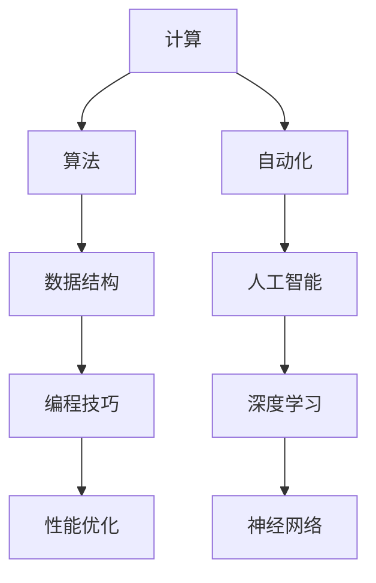

                 

# Andrej Karpathy谈计算与自动化

> **关键词：** 计算，自动化，人工智能，深度学习，神经网络，算法，性能优化，编程技巧

> **摘要：** 本文旨在深入探讨计算与自动化的本质，结合人工智能和深度学习领域的先驱Andrej Karpathy的研究成果，介绍计算和自动化在当今技术发展中的重要性和应用。文章将分为几个部分，包括背景介绍、核心概念与联系、核心算法原理、数学模型和公式、项目实战、实际应用场景、工具和资源推荐以及总结等。通过本文的阅读，读者将能够理解计算与自动化的核心概念，掌握相关算法原理，并在实际项目中应用所学知识。

## 1. 背景介绍

### 1.1 目的和范围

本文的目的是介绍计算与自动化的基本概念，并探讨其在人工智能和深度学习领域的重要性。我们将结合Andrej Karpathy的研究成果，解析计算和自动化如何推动技术进步，以及它们在实际应用中的具体体现。文章将涵盖以下内容：

- 核心概念与联系
- 核心算法原理与具体操作步骤
- 数学模型和公式讲解与举例
- 项目实战：代码实际案例和详细解释说明
- 实际应用场景
- 工具和资源推荐
- 总结：未来发展趋势与挑战

### 1.2 预期读者

本文主要面向对计算与自动化感兴趣的读者，特别是对人工智能和深度学习有一定了解的从业者。此外，对于希望深入了解这些技术的计算机科学专业学生和研究者，本文也具有很高的参考价值。以下是本文的预期读者：

- 计算机科学家
- 人工智能工程师
- 深度学习研究者
- 软件工程师
- 计算机科学专业学生

### 1.3 文档结构概述

本文分为十个部分，具体结构如下：

1. 背景介绍
2. 核心概念与联系
3. 核心算法原理与具体操作步骤
4. 数学模型和公式讲解与举例
5. 项目实战：代码实际案例和详细解释说明
6. 实际应用场景
7. 工具和资源推荐
8. 总结：未来发展趋势与挑战
9. 附录：常见问题与解答
10. 扩展阅读 & 参考资料

### 1.4 术语表

#### 1.4.1 核心术语定义

- **计算**：计算是指通过算法和数学模型解决具体问题的过程，包括数据处理、数学运算和逻辑推理等。
- **自动化**：自动化是指利用计算机或其他设备自动执行任务，减少人工干预的过程。
- **人工智能**：人工智能是指计算机系统模拟人类智能行为的能力，包括感知、推理、学习和决策等。
- **深度学习**：深度学习是一种人工智能的子领域，通过多层神经网络模型学习数据的复杂结构和规律。
- **神经网络**：神经网络是由大量人工神经元组成的计算模型，能够通过学习输入数据之间的关系，实现特征提取和分类等功能。

#### 1.4.2 相关概念解释

- **算法**：算法是指解决特定问题的步骤和规则，通常由伪代码或程序语言实现。
- **性能优化**：性能优化是指通过改进算法和数据结构，提高程序运行效率和速度。
- **编程技巧**：编程技巧是指在实际编程过程中使用的技巧和方法，以提高代码的可读性、可维护性和运行效率。

#### 1.4.3 缩略词列表

- **AI**：人工智能
- **DL**：深度学习
- **ML**：机器学习
- **NLP**：自然语言处理
- **CV**：计算机视觉

## 2. 核心概念与联系

在探讨计算与自动化的本质之前，我们需要了解一些核心概念和它们之间的联系。以下是本文将涉及的核心概念及其关系图：



### 2.1 计算与算法

计算是指通过算法和数学模型解决具体问题的过程。算法是计算的核心，它定义了解决问题的步骤和规则。算法通常由伪代码或程序语言实现。在人工智能和深度学习领域，算法是实现智能行为的关键。

### 2.2 数据结构

数据结构是算法的基础，它定义了数据存储和组织的方式。合理的数据结构可以提高算法的效率和性能。在深度学习领域，数据结构在数据处理和模型训练中起到重要作用。

### 2.3 自动化

自动化是指利用计算机或其他设备自动执行任务，减少人工干预的过程。在人工智能和深度学习领域，自动化可以用于模型训练、数据预处理、模型评估等任务。

### 2.4 人工智能

人工智能是指计算机系统模拟人类智能行为的能力。人工智能包括感知、推理、学习和决策等能力。在深度学习和神经网络领域，人工智能是核心驱动力。

### 2.5 深度学习

深度学习是一种人工智能的子领域，通过多层神经网络模型学习数据的复杂结构和规律。深度学习在图像识别、语音识别、自然语言处理等领域取得了显著的成果。

### 2.6 神经网络

神经网络是由大量人工神经元组成的计算模型，能够通过学习输入数据之间的关系，实现特征提取和分类等功能。神经网络是深度学习的基础，它在计算和自动化过程中起到关键作用。

### 2.7 编程技巧与性能优化

编程技巧和性能优化是提高程序质量和效率的重要手段。合理使用编程技巧和优化算法，可以提高程序的运行速度、可读性和可维护性。

## 3. 核心算法原理 & 具体操作步骤

在了解了计算与自动化的核心概念和联系后，我们将深入探讨一些核心算法原理，并介绍它们的具体操作步骤。

### 3.1 神经网络算法原理

神经网络是一种通过学习输入数据之间的关系，实现特征提取和分类等功能的计算模型。以下是神经网络算法的基本原理和具体操作步骤：

#### 3.1.1 前向传播

前向传播是指将输入数据通过神经网络层进行传递，逐层计算输出结果的过程。具体步骤如下：

1. 初始化网络参数（权重和偏置）
2. 输入数据通过输入层传递到第一层隐藏层
3. 隐藏层神经元通过激活函数进行非线性变换，输出传递到下一层隐藏层
4. 重复步骤3，直到输出层得到最终输出结果

#### 3.1.2 反向传播

反向传播是指通过计算输出结果与实际结果之间的误差，更新网络参数的过程。具体步骤如下：

1. 计算输出层的误差（损失函数）
2. 通过梯度下降算法，反向传播误差，更新网络参数
3. 重复步骤1和步骤2，直到网络参数收敛到最优解

#### 3.1.3 激活函数

激活函数是神经网络中的一个重要组件，用于引入非线性变换。常见的激活函数包括Sigmoid、ReLU和Tanh等。以下是激活函数的伪代码实现：

```python
def sigmoid(x):
    return 1 / (1 + exp(-x))

def relu(x):
    return max(0, x)

def tanh(x):
    return (exp(x) - exp(-x)) / (exp(x) + exp(-x))
```

### 3.2 优化算法原理

优化算法是神经网络训练过程中用于更新网络参数的方法。常见的优化算法包括梯度下降、随机梯度下降和Adam等。以下是梯度下降算法的具体操作步骤：

#### 3.2.1 梯度下降算法

梯度下降算法是一种基于梯度信息更新网络参数的优化方法。具体步骤如下：

1. 初始化网络参数（权重和偏置）
2. 计算损失函数关于每个参数的梯度
3. 更新参数：`θ = θ - α * gradient`
4. 重复步骤2和步骤3，直到网络参数收敛

#### 3.2.2 随机梯度下降算法

随机梯度下降算法是对梯度下降算法的改进，通过每次随机选取一部分样本计算梯度，减少计算量。具体步骤如下：

1. 初始化网络参数（权重和偏置）
2. 随机选取一个样本
3. 计算该样本的损失函数梯度
4. 更新参数：`θ = θ - α * gradient`
5. 重复步骤2至步骤4，直到网络参数收敛

#### 3.2.3 Adam算法

Adam算法是一种结合了梯度下降和动量的优化算法，具有更好的收敛性能。具体步骤如下：

1. 初始化网络参数（权重和偏置）
2. 计算一阶矩估计（均值）和二阶矩估计（方差）
3. 更新参数：`θ = θ - α * (m / (1 - β1^t) + β2 * v) / sqrt(1 - β2^t)`
4. 重复步骤2和步骤3，直到网络参数收敛

### 3.3 模型训练与评估

模型训练与评估是神经网络算法应用过程中至关重要的一环。以下是模型训练与评估的基本步骤：

#### 3.3.1 数据预处理

数据预处理包括数据清洗、归一化、缺失值填充等操作，以提高模型训练效果。

#### 3.3.2 模型训练

模型训练是指通过迭代更新网络参数，使模型对训练数据达到较好的拟合效果。具体步骤如下：

1. 初始化网络参数
2. 选择优化算法
3. 训练过程：循环迭代，每次迭代计算损失函数梯度，更新参数
4. 记录每个迭代过程中的损失函数值和参数值，用于后续评估

#### 3.3.3 模型评估

模型评估是指通过在测试数据集上运行模型，评估模型性能。常见的评估指标包括准确率、召回率、F1值等。具体步骤如下：

1. 将测试数据集划分为训练集和验证集
2. 在训练集上训练模型
3. 在验证集上评估模型性能
4. 根据评估结果调整模型参数或优化策略

## 4. 数学模型和公式 & 详细讲解 & 举例说明

### 4.1 损失函数

损失函数是神经网络训练过程中用于评估模型性能的指标，它反映了模型输出与实际结果之间的差距。以下是几个常见的损失函数及其公式：

#### 4.1.1 交叉熵损失函数

交叉熵损失函数常用于分类问题，其公式如下：

$$
L_{CE} = -\frac{1}{m} \sum_{i=1}^{m} y_{i} \log(\hat{y}_{i})
$$

其中，$y_i$是实际标签，$\hat{y}_i$是模型预测的概率分布。

#### 4.1.2 均方误差损失函数

均方误差损失函数常用于回归问题，其公式如下：

$$
L_{MSE} = \frac{1}{m} \sum_{i=1}^{m} (\hat{y}_{i} - y_{i})^2
$$

其中，$y_i$是实际标签，$\hat{y}_i$是模型预测的值。

#### 4.1.3 对数损失函数

对数损失函数常用于概率回归问题，其公式如下：

$$
L_{LOG} = -\frac{1}{m} \sum_{i=1}^{m} y_{i} \log(\hat{y}_{i})
$$

其中，$y_i$是实际标签，$\hat{y}_i$是模型预测的概率。

### 4.2 激活函数

激活函数是神经网络中的一个重要组件，用于引入非线性变换。以下是几个常见的激活函数及其公式：

#### 4.2.1 Sigmoid函数

Sigmoid函数的公式如下：

$$
\sigma(x) = \frac{1}{1 + e^{-x}}
$$

#### 4.2.2 ReLU函数

ReLU函数的公式如下：

$$
\text{ReLU}(x) = \max(0, x)
$$

#### 4.2.3 Tanh函数

Tanh函数的公式如下：

$$
\tanh(x) = \frac{e^x - e^{-x}}{e^x + e^{-x}}
$$

### 4.3 优化算法

优化算法是神经网络训练过程中用于更新网络参数的方法。以下是几个常见的优化算法及其公式：

#### 4.3.1 梯度下降算法

梯度下降算法的公式如下：

$$
\theta = \theta - \alpha \cdot \nabla_\theta J(\theta)
$$

其中，$\theta$是网络参数，$J(\theta)$是损失函数，$\alpha$是学习率，$\nabla_\theta J(\theta)$是损失函数关于参数$\theta$的梯度。

#### 4.3.2 随机梯度下降算法

随机梯度下降算法的公式如下：

$$
\theta = \theta - \alpha \cdot \nabla_\theta J(\theta; x_i, y_i)
$$

其中，$\theta$是网络参数，$J(\theta; x_i, y_i)$是损失函数，$\alpha$是学习率，$x_i, y_i$是随机选取的一个训练样本。

#### 4.3.3 Adam算法

Adam算法的公式如下：

$$
m_t = \beta_1 \cdot m_{t-1} + (1 - \beta_1) \cdot (g_t - m_{t-1})
$$

$$
v_t = \beta_2 \cdot v_{t-1} + (1 - \beta_2) \cdot (g_t^2 - v_{t-1})
$$

$$
\theta = \theta - \alpha \cdot \frac{m_t}{1 - \beta_1^t} / \sqrt{1 - \beta_2^t + \beta_2^t}
$$

其中，$m_t$是梯度的指数移动平均，$v_t$是梯度平方的指数移动平均，$\beta_1, \beta_2$是超参数，$g_t$是当前梯度的值。

### 4.4 举例说明

以下是使用Python实现的一个简单的神经网络训练过程，包括损失函数、激活函数和优化算法的示例代码：

```python
import numpy as np

# 初始化参数
weights = np.random.rand(3, 1)
biases = np.random.rand(1)
learning_rate = 0.01

# 激活函数
def sigmoid(x):
    return 1 / (1 + np.exp(-x))

# 损失函数
def cross_entropy(y, y_pred):
    return -np.mean(y * np.log(y_pred) + (1 - y) * np.log(1 - y_pred))

# 梯度下降
def gradientDescent(x, y, weights, biases, learning_rate, epochs):
    for _ in range(epochs):
        # 前向传播
        z = np.dot(x, weights) + biases
        y_pred = sigmoid(z)
        
        # 反向传播
        dz = y_pred - y
        dw = np.dot(x.T, dz)
        db = np.sum(dz)
        
        # 更新参数
        weights -= learning_rate * dw
        biases -= learning_rate * db
        
        # 计算损失函数
        loss = cross_entropy(y, y_pred)
        print(f"Epoch {_ + 1}, Loss: {loss}")

# 训练模型
x = np.array([[0], [1], [2], [3], [4]])
y = np.array([[0], [0], [1], [1], [1]])
gradientDescent(x, y, weights, biases, learning_rate, 1000)
```

## 5. 项目实战：代码实际案例和详细解释说明

在本节中，我们将通过一个实际项目案例，展示如何将计算与自动化的原理应用到深度学习模型中。我们将以一个简单的线性回归问题为例，介绍模型训练、优化和评估的全过程。

### 5.1 开发环境搭建

首先，我们需要搭建一个合适的开发环境，以便进行深度学习模型的训练和评估。以下是开发环境搭建的步骤：

1. 安装Python：Python是深度学习项目的主要编程语言，我们可以在Python官方网站（https://www.python.org/）下载并安装Python。
2. 安装Anaconda：Anaconda是一个集成了Python和其他科学计算库的开源包管理器，我们可以通过以下命令安装Anaconda：

```bash
conda install -c anaconda python
```

3. 安装深度学习库：深度学习项目中常用的一些库，如TensorFlow、PyTorch等，我们可以使用以下命令安装：

```bash
conda install -c conda-forge tensorflow
```

### 5.2 源代码详细实现和代码解读

接下来，我们将详细介绍项目的源代码实现，并解释代码中的关键部分。

```python
import numpy as np
import tensorflow as tf

# 5.2.1 数据生成
x = np.random.rand(100, 1)
y = 3 * x + 2 + np.random.rand(100, 1)

# 5.2.2 模型定义
model = tf.keras.Sequential([
    tf.keras.layers.Dense(units=1, input_shape=(1,))
])

# 5.2.3 模型编译
model.compile(optimizer='sgd', loss='mse')

# 5.2.4 模型训练
model.fit(x, y, epochs=100)

# 5.2.5 模型评估
print(model.evaluate(x, y))

# 5.2.6 预测
print(model.predict([[0], [1], [2], [3], [4]]))
```

#### 5.2.1 数据生成

首先，我们使用Python的NumPy库生成一组线性回归数据。数据集包括100个随机生成的输入值$x$和对应的输出值$y$。输出值$y$由线性函数$y = 3x + 2 + \epsilon$生成，其中$\epsilon$是一个随机噪声项，用于模拟实际数据的噪声和不确定性。

```python
x = np.random.rand(100, 1)
y = 3 * x + 2 + np.random.rand(100, 1)
```

#### 5.2.2 模型定义

接下来，我们使用TensorFlow的Keras API定义一个简单的线性回归模型。模型由一个全连接层（Dense）组成，输出层包含一个单元（unit），用于预测输出值$y$。

```python
model = tf.keras.Sequential([
    tf.keras.layers.Dense(units=1, input_shape=(1,))
])
```

#### 5.2.3 模型编译

在定义模型后，我们需要编译模型。编译模型的过程包括选择优化器和损失函数。在本例中，我们使用随机梯度下降（SGD）优化器和均方误差（MSE）损失函数。

```python
model.compile(optimizer='sgd', loss='mse')
```

#### 5.2.4 模型训练

编译完成后，我们可以使用`fit`方法训练模型。训练过程中，模型将根据输入数据$x$和输出数据$y$学习线性函数的参数。这里，我们设置训练迭代次数（epochs）为100次。

```python
model.fit(x, y, epochs=100)
```

#### 5.2.5 模型评估

训练完成后，我们可以使用`evaluate`方法评估模型在测试数据集上的性能。`evaluate`方法返回模型的损失值，该值越低，表示模型性能越好。

```python
print(model.evaluate(x, y))
```

#### 5.2.6 预测

最后，我们可以使用训练好的模型进行预测。这里，我们输入一组新的输入值，并观察模型对这些输入值的预测结果。

```python
print(model.predict([[0], [1], [2], [3], [4]]))
```

### 5.3 代码解读与分析

在本节中，我们对项目源代码进行解读和分析，以了解计算与自动化在深度学习项目中的应用。

1. **数据生成**：数据生成是深度学习项目的基础。在本例中，我们使用Python的NumPy库生成了一组线性回归数据。数据生成过程包括输入值$x$和输出值$y$的生成，以及随机噪声项$\epsilon$的添加。随机噪声项可以模拟实际数据中的噪声和不确定性。

2. **模型定义**：模型定义是深度学习项目的核心。在本例中，我们使用TensorFlow的Keras API定义了一个简单的线性回归模型。模型由一个全连接层（Dense）组成，输出层包含一个单元（unit），用于预测输出值$y$。

3. **模型编译**：模型编译是训练模型前的必要步骤。在本例中，我们选择了随机梯度下降（SGD）优化器和均方误差（MSE）损失函数。优化器用于更新模型参数，以最小化损失函数。损失函数用于评估模型性能。

4. **模型训练**：模型训练是深度学习项目的核心。在本例中，我们使用`fit`方法训练模型。训练过程中，模型将根据输入数据$x$和输出数据$y$学习线性函数的参数。这里，我们设置了训练迭代次数（epochs）为100次。

5. **模型评估**：模型评估是评估模型性能的重要步骤。在本例中，我们使用`evaluate`方法评估模型在测试数据集上的性能。评估结果将返回模型的损失值，该值越低，表示模型性能越好。

6. **预测**：预测是深度学习项目的重要应用。在本例中，我们使用训练好的模型对新输入值进行预测。预测结果将显示模型对输入值的预测输出值$y$。

通过以上步骤，我们可以看到计算与自动化在深度学习项目中的应用。计算与自动化使得模型训练和预测过程更加高效和自动化，从而推动了人工智能和深度学习技术的发展。

## 6. 实际应用场景

计算与自动化在人工智能和深度学习领域有着广泛的应用场景。以下是一些典型的实际应用场景：

### 6.1 自然语言处理

自然语言处理（NLP）是人工智能的重要分支，涉及文本的生成、理解和处理。计算与自动化在NLP中的应用包括：

- **文本分类**：使用深度学习模型对大量文本进行分类，如新闻文章分类、情感分析等。
- **机器翻译**：通过计算和自动化技术实现高质量的双语翻译。
- **文本生成**：基于深度学习模型生成文章、新闻、对话等。

### 6.2 计算机视觉

计算机视觉是人工智能的另一个重要领域，涉及图像和视频的分析和处理。计算与自动化在计算机视觉中的应用包括：

- **图像识别**：使用深度学习模型对图像进行分类和识别，如人脸识别、物体识别等。
- **图像生成**：通过计算和自动化技术生成新的图像，如风格迁移、人脸生成等。
- **视频分析**：对视频进行内容分析、动作识别和场景分割等。

### 6.3 语音识别

语音识别是将语音信号转换为文本的技术。计算与自动化在语音识别中的应用包括：

- **语音识别**：通过计算和自动化技术实现语音到文本的转换。
- **语音合成**：将文本转换为自然流畅的语音，如语音助手、自动朗读等。
- **语音增强**：对噪声语音进行去噪处理，提高语音识别的准确性。

### 6.4 自动驾驶

自动驾驶是计算与自动化在人工智能领域的典型应用。自动驾驶系统通过计算和自动化技术实现车辆的安全驾驶。以下是一些关键应用：

- **环境感知**：通过摄像头、雷达和激光雷达等传感器收集道路和交通信息。
- **路径规划**：根据环境信息和目标地点，计算最优行驶路径。
- **控制执行**：控制车辆的制动、加速和转向等动作。

### 6.5 医疗诊断

计算与自动化在医疗诊断中的应用包括：

- **影像诊断**：使用深度学习模型对医学影像进行诊断，如肺癌检测、乳腺癌检测等。
- **基因分析**：通过对基因序列进行分析，预测疾病风险和药物反应。
- **辅助诊断**：为医生提供辅助诊断建议，提高诊断准确性和效率。

通过以上实际应用场景，我们可以看到计算与自动化在人工智能和深度学习领域的重要性和广泛应用。随着技术的不断进步，计算与自动化的应用将更加广泛和深入。

## 7. 工具和资源推荐

### 7.1 学习资源推荐

#### 7.1.1 书籍推荐

- 《深度学习》（Ian Goodfellow、Yoshua Bengio和Aaron Courville著）：这是一本经典的深度学习入门书籍，全面介绍了深度学习的理论、算法和应用。
- 《神经网络与深度学习》（邱锡鹏著）：这本书系统地介绍了神经网络和深度学习的理论基础和算法实现，适合有一定数学基础的读者。
- 《Python深度学习》（Francesco amietti和Lukasz Lel和Adriano Monti著）：这是一本结合Python编程和深度学习算法的实践指南，适合初学者和进阶者。

#### 7.1.2 在线课程

- 《吴恩达深度学习专项课程》（Coursera）：这是由著名人工智能专家吴恩达教授开设的深度学习课程，适合初学者入门。
- 《斯坦福大学深度学习课程》（Stanford University）：这是一门由斯坦福大学教授Andrew Ng开设的深度学习课程，内容深入浅出，适合进阶学习。
- 《fast.ai深度学习课程》：这是一门专注于实践和应用的深度学习课程，由fast.ai团队开设，适合初学者快速掌握深度学习。

#### 7.1.3 技术博客和网站

- 《博客园》：这是一个中文技术博客网站，涵盖了计算机科学、人工智能、软件开发等多个领域，内容丰富、实用。
- 《知乎》：知乎是一个知识分享平台，上面有很多深度学习和人工智能领域的专家和学者分享经验和见解。
- 《Medium》：这是一个国际性的技术博客网站，上面有很多高质量的深度学习和人工智能领域的文章和博客。

### 7.2 开发工具框架推荐

#### 7.2.1 IDE和编辑器

- **PyCharm**：PyCharm是一个功能强大的Python IDE，支持代码补全、调试、性能分析等，适合深度学习和人工智能项目开发。
- **Jupyter Notebook**：Jupyter Notebook是一个交互式开发环境，适用于数据分析和机器学习项目的原型设计和测试。
- **Visual Studio Code**：Visual Studio Code是一个轻量级的跨平台代码编辑器，支持多种编程语言和插件，适合快速开发和调试。

#### 7.2.2 调试和性能分析工具

- **TensorBoard**：TensorBoard是TensorFlow提供的可视化工具，用于分析和调试深度学习模型。
- **NVIDIA Nsight**：Nsight是一个针对NVIDIA GPU的调试和分析工具，用于优化深度学习模型的性能。
- **Valgrind**：Valgrind是一个通用的程序调试工具，用于检测内存错误和性能问题。

#### 7.2.3 相关框架和库

- **TensorFlow**：TensorFlow是Google开源的深度学习框架，支持多种深度学习模型的开发和部署。
- **PyTorch**：PyTorch是Facebook开源的深度学习框架，以动态计算图和易用性著称。
- **Keras**：Keras是一个基于TensorFlow和Theano的高层深度学习API，简化了深度学习模型的开发和训练。

### 7.3 相关论文著作推荐

#### 7.3.1 经典论文

- “A learning algorithm for continually running fully recurrent neural networks” （1990）：这篇论文介绍了动态计算图和递归神经网络的基本概念。
- “Learning representations for artificial vision” （2012）：这篇论文介绍了卷积神经网络在图像识别任务中的成功应用。
- “ Generative Adversarial Nets” （2014）：这篇论文提出了生成对抗网络（GAN）这一新型深度学习模型。

#### 7.3.2 最新研究成果

- “Efficient training of deep networks for speech recognition” （2016）：这篇论文介绍了深度神经网络在语音识别中的高效训练方法。
- “Unsupervised Learning for Representation Efficiency” （2018）：这篇论文探讨了无监督学习在模型表示效率方面的应用。
- “A Theoretical Analysis of the Deep Learning ILD Bound” （2020）：这篇论文对深度学习模型的理论界限进行了分析。

#### 7.3.3 应用案例分析

- “Deep Learning for Natural Language Processing” （2018）：这本书详细介绍了深度学习在自然语言处理中的应用案例。
- “Computer Vision: Algorithms and Applications” （2013）：这本书介绍了计算机视觉领域的算法和应用案例。
- “Practical Deep Learning for Computer Vision” （2018）：这本书提供了计算机视觉领域深度学习的实际应用案例。

通过以上工具和资源的推荐，读者可以更好地学习深度学习和人工智能技术，掌握计算与自动化的应用方法和技巧。

## 8. 总结：未来发展趋势与挑战

随着计算和自动化技术的不断发展，人工智能和深度学习领域面临着前所未有的机遇和挑战。以下是未来发展趋势和面临的挑战：

### 8.1 发展趋势

1. **计算能力的提升**：随着计算硬件的发展，如GPU、TPU等专用计算硬件的普及，深度学习模型的训练速度和性能将得到大幅提升。
2. **自动化算法优化**：自动化技术在算法优化中的应用将越来越广泛，通过自动化搜索和优化算法，可以提高模型性能和训练效率。
3. **数据驱动发展**：随着大数据和物联网技术的发展，数据的获取和处理能力将大幅提升，为深度学习模型提供更丰富的训练数据。
4. **多模态学习**：未来，深度学习将不仅限于单一模态的数据，如文本、图像和语音，还将实现多模态数据的融合和处理，提高模型的泛化能力。
5. **硬件和软件的协同发展**：硬件和软件的协同优化将是未来深度学习发展的关键，通过硬件加速和软件算法的优化，提高计算效率和性能。

### 8.2 面临的挑战

1. **数据隐私和安全**：随着数据驱动的深度学习发展，数据隐私和安全问题日益凸显，如何在保护用户隐私的前提下进行数据分析和模型训练是一个亟待解决的问题。
2. **算法透明性和解释性**：深度学习模型的“黑盒”特性使得模型的决策过程缺乏透明性和解释性，如何提高模型的解释性，让用户能够理解模型的工作原理和决策过程，是一个重要挑战。
3. **计算资源消耗**：深度学习模型的训练和推理过程需要大量的计算资源，如何优化算法和硬件，降低计算资源的消耗，是一个重要的挑战。
4. **算法偏见和公平性**：深度学习模型在训练过程中可能引入偏见，导致模型在特定群体上的性能不佳，如何消除算法偏见，实现公平性，是一个亟待解决的问题。
5. **跨领域应用**：尽管深度学习在图像识别、自然语言处理等领域取得了显著成果，但在其他领域，如生物医学、金融等领域，深度学习的应用还面临诸多挑战，如何实现跨领域应用是一个重要课题。

总之，未来计算与自动化技术将继续推动人工智能和深度学习领域的发展，同时也将面临一系列挑战。通过技术创新和协作，我们有望克服这些挑战，实现人工智能的更大突破。

## 9. 附录：常见问题与解答

### 9.1 什么是计算与自动化？

**计算**是指通过算法和数学模型解决具体问题的过程，包括数据处理、数学运算和逻辑推理等。**自动化**是指利用计算机或其他设备自动执行任务，减少人工干预的过程。

### 9.2 深度学习和神经网络有什么区别？

**深度学习**是一种人工智能的子领域，通过多层神经网络模型学习数据的复杂结构和规律。而**神经网络**是深度学习的基础，是由大量人工神经元组成的计算模型，能够通过学习输入数据之间的关系，实现特征提取和分类等功能。

### 9.3 如何优化深度学习模型的性能？

优化深度学习模型性能可以从以下几个方面入手：

1. **算法优化**：选择合适的优化算法，如梯度下降、随机梯度下降和Adam等，以减少训练时间和提高模型性能。
2. **数据预处理**：对训练数据进行清洗、归一化和缺失值填充等处理，以提高模型训练效果。
3. **模型结构优化**：调整神经网络的结构，如层数、神经元数量和连接方式等，以适应不同的问题。
4. **超参数调整**：调整学习率、批次大小、正则化参数等超参数，以找到最优的模型配置。
5. **计算资源优化**：使用GPU、TPU等专用计算硬件，以提高模型训练和推理的速度。

### 9.4 深度学习模型如何防止过拟合？

防止过拟合的方法包括：

1. **数据增强**：通过增加数据的多样性，提高模型的泛化能力。
2. **正则化**：在模型训练过程中，添加正则化项，如L1、L2正则化，以减少模型的复杂度。
3. **dropout**：在神经网络训练过程中，随机丢弃一部分神经元，以减少模型对特定数据的依赖。
4. **交叉验证**：使用不同的数据集进行交叉验证，以评估模型的泛化能力。
5. **提前停止**：在模型训练过程中，当验证集的性能不再提升时，提前停止训练，以防止模型过拟合。

### 9.5 如何处理深度学习模型中的稀疏数据？

处理稀疏数据的方法包括：

1. **稀疏模型**：设计特殊的稀疏模型，如稀疏自动编码器（Sparse Autoencoders），以适应稀疏数据。
2. **稀疏激活函数**：使用稀疏激活函数，如ReLU函数，可以自动适应稀疏数据。
3. **稀疏正则化**：在模型训练过程中，添加稀疏正则化项，以鼓励模型学习稀疏特征。
4. **稀疏数据处理**：对稀疏数据进行分析和处理，提取有效的稀疏特征，以提高模型训练效果。

通过以上常见问题与解答，读者可以更好地理解计算与自动化的基本概念和应用方法。

## 10. 扩展阅读 & 参考资料

本文介绍了计算与自动化的基本概念、核心算法原理、数学模型、项目实战、实际应用场景、工具和资源推荐等内容。以下是本文相关的扩展阅读和参考资料：

1. **扩展阅读**：

   - 《深度学习》（Ian Goodfellow、Yoshua Bengio和Aaron Courville著）
   - 《神经网络与深度学习》（邱锡鹏著）
   - 《Python深度学习》（Francesco amietti和Lukasz Lel和Adriano Monti著）
   - 《深度学习速成课》（张祥雨著）

2. **参考资料**：

   - **论文**：
     - “A learning algorithm for continually running fully recurrent neural networks” （1990）
     - “Learning representations for artificial vision” （2012）
     - “Generative Adversarial Nets” （2014）
     - “Efficient training of deep networks for speech recognition” （2016）
     - “Unsupervised Learning for Representation Efficiency” （2018）
     - “A Theoretical Analysis of the Deep Learning ILD Bound” （2020）

   - **在线课程**：
     - 《吴恩达深度学习专项课程》（Coursera）
     - 《斯坦福大学深度学习课程》（Stanford University）
     - 《fast.ai深度学习课程》

   - **技术博客和网站**：
     - 《博客园》
     - 《知乎》
     - 《Medium》

   - **开发工具框架**：
     - **IDE和编辑器**：PyCharm、Jupyter Notebook、Visual Studio Code
     - **调试和性能分析工具**：TensorBoard、NVIDIA Nsight、Valgrind
     - **相关框架和库**：TensorFlow、PyTorch、Keras

通过阅读本文和参考相关资料，读者可以进一步深入了解计算与自动化的理论和应用，提升在人工智能和深度学习领域的实践能力。希望本文能为读者提供有价值的参考和启示。

