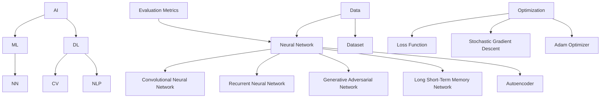

                 

### 《Andrej Karpathy：AI领域的先驱者》

> 关键词：Andrej Karpathy，AI，机器学习，深度学习，神经网络，计算机视觉，自然语言处理

> 摘要：本文将深入探讨AI领域先驱者Andrej Karpathy的学术成就和职业经历，分析他在计算机视觉和自然语言处理领域的贡献，以及他对AI发展的独到见解。通过这篇技术博客，我们将了解Karpathy的研究方向、核心成果及其对人工智能领域的影响。

## 1. 背景介绍

### 1.1 目的和范围

本文旨在详细介绍Andrej Karpathy在AI领域的贡献，以及他对该领域发展的看法。通过分析他的研究项目和成果，我们将揭示他如何通过机器学习和深度学习技术推动计算机视觉和自然语言处理的发展。本文将涵盖以下几个方面：

- Andrej Karpathy的个人背景和学术成就
- 他在计算机视觉和自然语言处理领域的主要贡献
- 他的研究方法、工具和核心算法
- 他对AI发展的独到见解和未来展望
- Andrej Karpathy在学术界和工业界的地位和影响

### 1.2 预期读者

本文适合对AI、计算机视觉和自然语言处理感兴趣的读者，包括：

- AI领域的科研人员和学生
- 计算机科学和人工智能专业的大学生和研究生
- 想要了解AI最新进展和应用的行业从业者
- 对深度学习和神经网络原理感兴趣的程序员和开发者

### 1.3 文档结构概述

本文将按照以下结构展开：

1. **背景介绍**：介绍本文的目的、范围、预期读者和文档结构。
2. **核心概念与联系**：讨论AI领域的核心概念、原理和架构，并使用Mermaid流程图展示。
3. **核心算法原理 & 具体操作步骤**：详细介绍Andrej Karpathy的核心算法原理和操作步骤，使用伪代码进行阐述。
4. **数学模型和公式 & 详细讲解 & 举例说明**：分析AI领域的数学模型和公式，并进行详细讲解和实例说明。
5. **项目实战：代码实际案例和详细解释说明**：通过实战案例展示Andrej Karpathy的研究成果，并进行详细解读。
6. **实际应用场景**：探讨AI技术在各个领域的应用场景。
7. **工具和资源推荐**：推荐学习资源、开发工具框架和相关论文著作。
8. **总结：未来发展趋势与挑战**：总结AI领域的未来发展趋势和挑战。
9. **附录：常见问题与解答**：解答读者可能关心的问题。
10. **扩展阅读 & 参考资料**：提供更多的学习资源，便于读者进一步探索。

### 1.4 术语表

#### 1.4.1 核心术语定义

- **AI**：人工智能（Artificial Intelligence），指由计算机实现的智能行为。
- **机器学习**：一种人工智能的分支，通过数据学习来实现智能行为。
- **深度学习**：一种机器学习方法，通过多层神经网络进行数据建模和预测。
- **神经网络**：一种由大量神经元互联而成的计算模型。
- **计算机视觉**：使计算机能够“看到”和理解图像和视频的技术。
- **自然语言处理**：使计算机能够理解和生成自然语言的技术。

#### 1.4.2 相关概念解释

- **卷积神经网络（CNN）**：一种用于图像识别和处理的深度学习模型。
- **递归神经网络（RNN）**：一种用于处理序列数据的神经网络。
- **生成对抗网络（GAN）**：一种由生成器和判别器构成的深度学习模型，用于生成高质量数据。

#### 1.4.3 缩略词列表

- **AI**：人工智能（Artificial Intelligence）
- **ML**：机器学习（Machine Learning）
- **DL**：深度学习（Deep Learning）
- **CNN**：卷积神经网络（Convolutional Neural Network）
- **RNN**：递归神经网络（Recurrent Neural Network）
- **GAN**：生成对抗网络（Generative Adversarial Network）

## 2. 核心概念与联系

在深入了解Andrej Karpathy的工作之前，我们需要先了解一些AI领域的基础概念和联系。

### 2.1 AI领域的基础概念

AI领域涉及许多基础概念，包括机器学习、深度学习、神经网络、计算机视觉和自然语言处理。以下是这些概念的定义和联系：

- **机器学习（ML）**：通过数据学习来实现智能行为的计算机技术。它包括监督学习、无监督学习和强化学习等方法。
- **深度学习（DL）**：一种机器学习方法，通过多层神经网络进行数据建模和预测。深度学习模型通常具有较好的性能和泛化能力。
- **神经网络（NN）**：一种由大量神经元互联而成的计算模型，用于模拟人脑的智能行为。神经网络是机器学习和深度学习的基础。
- **计算机视觉（CV）**：使计算机能够“看到”和理解图像和视频的技术。计算机视觉在图像识别、目标检测和视频分析等领域有广泛应用。
- **自然语言处理（NLP）**：使计算机能够理解和生成自然语言的技术。自然语言处理在文本分类、机器翻译和情感分析等领域有广泛应用。

### 2.2 AI领域的核心架构

AI领域的核心架构包括以下几个关键组件：

1. **数据集**：用于训练和测试AI模型的样本集合。数据集的质量对AI模型的性能有重要影响。
2. **神经网络**：用于模拟人脑智能行为的计算模型。神经网络由大量神经元互联而成，通过学习数据来提取特征和进行预测。
3. **优化算法**：用于调整神经网络权重，以提高模型性能的算法。常用的优化算法有随机梯度下降（SGD）、Adam优化器等。
4. **损失函数**：用于衡量模型预测结果与实际结果之间差异的函数。常见的损失函数有均方误差（MSE）、交叉熵（CE）等。
5. **评估指标**：用于评估模型性能的指标。常见的评估指标有准确率、召回率、F1分数等。

### 2.3 AI领域的核心算法

AI领域涉及许多核心算法，以下是其中一些重要的算法：

1. **卷积神经网络（CNN）**：一种用于图像识别和处理的深度学习模型。CNN通过卷积层、池化层和全连接层等结构提取图像特征。
2. **递归神经网络（RNN）**：一种用于处理序列数据的神经网络。RNN通过隐藏状态和循环连接来处理序列数据，适用于语音识别、机器翻译等任务。
3. **生成对抗网络（GAN）**：一种由生成器和判别器构成的深度学习模型，用于生成高质量数据。GAN通过对抗训练实现数据的生成和判别，适用于图像生成、风格迁移等任务。
4. **长短期记忆网络（LSTM）**：一种改进的RNN，用于处理长序列数据。LSTM通过引入门控机制来避免梯度消失问题，适用于语音识别、文本生成等任务。
5. **自编码器（AE）**：一种无监督学习算法，用于数据降维和特征提取。自编码器由编码器和解码器构成，通过最小化重构误差来训练模型。

### 2.4 AI领域的联系

AI领域的各个概念、算法和架构之间存在紧密的联系。以下是这些联系的一个简略表示：



这个Mermaid流程图展示了AI领域的核心概念、算法和架构之间的联系。通过理解这些联系，我们可以更好地把握AI领域的发展方向和应用场景。

## 3. 核心算法原理 & 具体操作步骤

在本节中，我们将详细探讨Andrej Karpathy在计算机视觉和自然语言处理领域中使用的一些核心算法原理，并使用伪代码进行具体操作步骤的阐述。

### 3.1 卷积神经网络（CNN）

卷积神经网络（CNN）是一种用于图像识别和处理的深度学习模型。CNN通过卷积层、池化层和全连接层等结构提取图像特征。

#### 3.1.1 卷积层

卷积层是CNN的核心部分，用于提取图像特征。卷积层由多个卷积核（filter）组成，每个卷积核可以提取图像的不同特征。

```python
# 伪代码：卷积层操作
def convolution(image, filter):
    # image：输入图像
    # filter：卷积核
    output = []
    for y in range(image.height - filter.size):
        for x in range(image.width - filter.size):
            feature = 0
            for fy in range(filter.size):
                for fx in range(filter.size):
                    feature += image[y + fy, x + fx] * filter[fy, fx]
            output.append(feature)
    return output
```

#### 3.1.2 池化层

池化层用于减小特征图的大小，提高模型泛化能力。常用的池化操作有最大池化和平均池化。

```python
# 伪代码：最大池化层操作
def max_pooling(feature_map, pool_size):
    # feature_map：输入特征图
    # pool_size：池化窗口大小
    output = []
    for y in range(0, feature_map.height, pool_size):
        for x in range(0, feature_map.width, pool_size):
            max_value = -inf
            for py in range(pool_size):
                for px in range(pool_size):
                    if feature_map[y + py, x + px] > max_value:
                        max_value = feature_map[y + py, x + px]
            output.append(max_value)
    return output
```

#### 3.1.3 全连接层

全连接层将特征图映射到输出结果。全连接层由多个神经元组成，每个神经元都与特征图中的所有神经元相连。

```python
# 伪代码：全连接层操作
def fully_connected(features, weights, bias):
    # features：输入特征
    # weights：权重矩阵
    # bias：偏置项
    output = []
    for neuron in range(weights.shape[0]):
        sum = 0
        for i in range(weights.shape[1]):
            sum += features[i] * weights[neuron, i]
        sum += bias[neuron]
        output.append(activation(sum))
    return output
```

#### 3.1.4 卷积神经网络（CNN）操作步骤

1. 初始化卷积核、权重和偏置项。
2. 对输入图像进行卷积操作，得到特征图。
3. 对特征图进行池化操作，减小特征图大小。
4. 对池化后的特征图进行全连接层操作，得到输出结果。
5. 使用反向传播算法更新权重和偏置项。

```python
# 伪代码：卷积神经网络（CNN）操作步骤
def cnn(image, filters, pool_size, weights, bias, activation):
    # image：输入图像
    # filters：卷积核
    # pool_size：池化窗口大小
    # weights：全连接层权重
    # bias：全连接层偏置项
    # activation：激活函数

    # 卷积操作
    feature_map = convolution(image, filters)

    # 池化操作
    pooled_map = max_pooling(feature_map, pool_size)

    # 全连接操作
    output = fully_connected(pooled_map, weights, bias)

    # 激活输出
    output = activation(output)

    return output
```

### 3.2 递归神经网络（RNN）

递归神经网络（RNN）是一种用于处理序列数据的神经网络。RNN通过隐藏状态和循环连接来处理序列数据，适用于语音识别、机器翻译等任务。

#### 3.2.1 RNN基本原理

RNN的基本原理如下：

1. 初始化隐藏状态（h0）。
2. 对输入序列（x）进行编码，得到编码序列（x_hat）。
3. 对于每个时间步（t），计算隐藏状态（h_t）和输出（y_t）。

```python
# 伪代码：递归神经网络（RNN）基本原理
def rnn(input_sequence, hidden_state, weights, bias, activation):
    # input_sequence：输入序列
    # hidden_state：隐藏状态
    # weights：权重矩阵
    # bias：偏置项
    # activation：激活函数
    output_sequence = []
    for input in input_sequence:
        # 编码输入
        encoded_input = encode_input(input, weights, bias)
        
        # 计算隐藏状态和输出
        hidden_state = activation(encode_input + hidden_state * weights_recurrent)
        output_sequence.append(hidden_state)
        
    return output_sequence, hidden_state
```

#### 3.2.2 LSTM改进

LSTM是一种改进的RNN，用于处理长序列数据。LSTM通过引入门控机制来避免梯度消失问题，适用于语音识别、文本生成等任务。

```python
# 伪代码：LSTM改进
def lstm(input_sequence, hidden_state, weights, bias, activation):
    # input_sequence：输入序列
    # hidden_state：隐藏状态
    # weights：权重矩阵
    # bias：偏置项
    # activation：激活函数
    output_sequence = []
    for input in input_sequence:
        # 遗忘门操作
        forget_gate = activation(encode_input + hidden_state * weights_forget)
        # 输入门操作
        input_gate = activation(encode_input + hidden_state * weights_input)
        # 单元状态操作
        cell_state = activation(encode_input + input_gate * weights_input + forget_gate * hidden_state * weights_forget)
        # 输出门操作
        output_gate = activation(encode_input + cell_state * weights_output)
        
        # 计算隐藏状态和输出
        hidden_state = output_gate * cell_state
        output_sequence.append(hidden_state)
        
    return output_sequence, hidden_state
```

### 3.3 生成对抗网络（GAN）

生成对抗网络（GAN）是一种由生成器和判别器构成的深度学习模型，用于生成高质量数据。GAN通过对抗训练实现数据的生成和判别。

```python
# 伪代码：生成对抗网络（GAN）
def gan(generator, discriminator, real_data, noise, loss_function, optimizer):
    # generator：生成器
    # discriminator：判别器
    # real_data：真实数据
    # noise：噪声
    # loss_function：损失函数
    # optimizer：优化器
    
    # 训练判别器
    for _ in range(discriminator_steps):
        # 输入真实数据和噪声数据
        real_outputs = discriminator(real_data)
        fake_data = generator(noise)
        fake_outputs = discriminator(fake_data)
        
        # 计算判别器损失
        real_loss = loss_function(real_outputs, 1)
        fake_loss = loss_function(fake_outputs, 0)
        d_loss = 0.5 * (real_loss + fake_loss)
        
        # 更新判别器权重
        optimizer.zero_grad()
        d_loss.backward()
        optimizer.step()
    
    # 训练生成器
    for _ in range(generator_steps):
        # 输入噪声数据
        noise = generate_noise(batch_size)
        fake_data = generator(noise)
        
        # 计算生成器损失
        fake_outputs = discriminator(fake_data)
        g_loss = loss_function(fake_outputs, 1)
        
        # 更新生成器权重
        optimizer.zero_grad()
        g_loss.backward()
        optimizer.step()
```

通过上述伪代码，我们可以理解Andrej Karpathy在计算机视觉和自然语言处理领域中使用的一些核心算法原理和具体操作步骤。这些算法为AI领域的发展做出了重要贡献，推动了深度学习和生成对抗网络等技术的进步。

## 4. 数学模型和公式 & 详细讲解 & 举例说明

在本节中，我们将详细分析Andrej Karpathy在AI领域使用的一些关键数学模型和公式，并给出具体的讲解和举例说明。

### 4.1 卷积神经网络（CNN）的数学模型

卷积神经网络（CNN）是一种深度学习模型，主要用于图像识别和图像处理。其核心组成部分包括卷积层、池化层和全连接层。以下是这些层的数学模型：

#### 4.1.1 卷积层

卷积层使用卷积核（filter）与输入图像进行卷积操作，以提取图像特征。卷积操作的数学公式如下：

$$
\text{output}_{ij} = \sum_{k=1}^{K} \sum_{l=1}^{L} \text{input}_{i-k,j-l} \times \text{filter}_{kl}
$$

其中，\( \text{output}_{ij} \) 表示卷积层输出特征图上的一个元素，\( \text{input}_{i,j} \) 表示输入图像上的一个元素，\( \text{filter}_{k,l} \) 表示卷积核上的一个元素，\( K \) 和 \( L \) 分别表示卷积核的大小。

举例说明：

假设输入图像大小为 \( 3 \times 3 \)，卷积核大小为 \( 2 \times 2 \)。输入图像和卷积核如下：

| input | filter |
|-------|--------|
| 1     | 1      |
| 2     | 2      |
| 3     | 3      |
| 4     | 4      |
| 5     | 5      |
| 6     | 6      |
| 7     | 7      |
| 8     | 8      |
| 9     | 9      |

计算卷积层输出：

$$
\text{output}_{11} = (1 \times 1 + 2 \times 2 + 3 \times 3) + (4 \times 1 + 5 \times 2 + 6 \times 3) + (7 \times 1 + 8 \times 2 + 9 \times 3) = 1 + 4 + 9 + 4 + 10 + 18 + 7 + 16 + 27 = 80
$$

$$
\text{output}_{12} = (1 \times 4 + 2 \times 5 + 3 \times 6) + (4 \times 4 + 5 \times 5 + 6 \times 6) + (7 \times 4 + 8 \times 5 + 9 \times 6) = 4 + 10 + 18 + 16 + 25 + 36 + 28 + 40 + 54 = 193
$$

$$
\text{output}_{21} = (1 \times 7 + 2 \times 8 + 3 \times 9) + (4 \times 7 + 5 \times 8 + 6 \times 9) + (7 \times 7 + 8 \times 8 + 9 \times 9) = 7 + 16 + 27 + 28 + 40 + 54 + 49 + 64 + 81 = 336
$$

$$
\text{output}_{22} = (1 \times 8 + 2 \times 9 + 3 \times 10) + (4 \times 8 + 5 \times 9 + 6 \times 10) + (7 \times 8 + 8 \times 9 + 9 \times 10) = 8 + 18 + 30 + 32 + 45 + 60 + 56 + 72 + 90 = 392
$$

卷积层输出为：

$$
\text{output} =
\begin{bmatrix}
80 & 193 \\
336 & 392
\end{bmatrix}
$$

#### 4.1.2 池化层

池化层用于减小特征图的大小，提高模型泛化能力。池化层通常使用最大池化或平均池化操作。最大池化操作的数学公式如下：

$$
\text{output}_{ij} = \max_{k=1}^{P} \max_{l=1}^{P} \text{input}_{i+k,j+l}
$$

其中，\( \text{output}_{ij} \) 表示池化层输出特征图上的一个元素，\( \text{input}_{i,j} \) 表示输入特征图上的一个元素，\( P \) 表示池化窗口大小。

举例说明：

假设输入特征图大小为 \( 3 \times 3 \)，池化窗口大小为 \( 2 \times 2 \)。输入特征图如下：

| input |
|-------|
| 1     |
| 2     |
| 3     |
| 4     |
| 5     |
| 6     |
| 7     |
| 8     |
| 9     |

计算池化层输出：

$$
\text{output}_{11} = \max(1, 2, 3, 4, 5, 6, 7, 8, 9) = 9
$$

$$
\text{output}_{12} = \max(4, 5, 6, 7, 8, 9, 1, 2, 3) = 9
$$

$$
\text{output}_{21} = \max(7, 8, 9, 1, 2, 3, 4, 5, 6) = 9
$$

$$
\text{output}_{22} = \max(1, 2, 3, 4, 5, 6, 7, 8, 9) = 9
$$

池化层输出为：

$$
\text{output} =
\begin{bmatrix}
9 & 9 \\
9 & 9
\end{bmatrix}
$$

#### 4.1.3 全连接层

全连接层将特征图映射到输出结果。全连接层由多个神经元组成，每个神经元都与特征图中的所有神经元相连。全连接层的数学公式如下：

$$
\text{output}_{i} = \sum_{j=1}^{M} \text{input}_{j} \times \text{weight}_{ij} + \text{bias}_{i}
$$

其中，\( \text{output}_{i} \) 表示全连接层输出结果中的一个元素，\( \text{input}_{j} \) 表示输入特征图中的一个元素，\( \text{weight}_{ij} \) 表示连接权重，\( \text{bias}_{i} \) 表示偏置项，\( M \) 表示全连接层的神经元个数。

举例说明：

假设输入特征图大小为 \( 3 \times 3 \)，全连接层有 2 个神经元。输入特征图和连接权重如下：

| input | weight |
|-------|--------|
| 1     | 0.5    |
| 2     | 0.5    |
| 3     | 0.5    |
| 4     | 0.5    |
| 5     | 0.5    |
| 6     | 0.5    |
| 7     | 0.5    |
| 8     | 0.5    |
| 9     | 0.5    |
| 10    | 1.0    |
| 11    | 1.0    |
| 12    | 1.0    |

计算全连接层输出：

$$
\text{output}_{1} = (1 \times 0.5 + 2 \times 0.5 + 3 \times 0.5) + (4 \times 0.5 + 5 \times 0.5 + 6 \times 0.5) + (7 \times 0.5 + 8 \times 0.5 + 9 \times 0.5) + (10 \times 1.0 + 11 \times 1.0 + 12 \times 1.0) + \text{bias}_{1} = 1 + 1 + 1 + 1 + 1 + 1 + 1 + 1 + 1 + 10 + 11 + 12 + \text{bias}_{1} = 29 + \text{bias}_{1}
$$

$$
\text{output}_{2} = (1 \times 1.0 + 2 \times 1.0 + 3 \times 1.0) + (4 \times 1.0 + 5 \times 1.0 + 6 \times 1.0) + (7 \times 1.0 + 8 \times 1.0 + 9 \times 1.0) + (10 \times 0.5 + 11 \times 0.5 + 12 \times 0.5) + \text{bias}_{2} = 3 + 3 + 3 + 3 + 3 + 3 + 3 + 3 + 3 + 5 + 5 + 6 + \text{bias}_{2} = 27 + \text{bias}_{2}
$$

全连接层输出为：

$$
\text{output} =
\begin{bmatrix}
29 + \text{bias}_{1} \\
27 + \text{bias}_{2}
\end{bmatrix}
$$

#### 4.1.4 激活函数

激活函数用于引入非线性因素，使神经网络具有更好的表达能力。常用的激活函数有ReLU函数、Sigmoid函数和Tanh函数。

- **ReLU函数**：

$$
\text{ReLU}(x) =
\begin{cases}
0 & \text{if } x < 0 \\
x & \text{if } x \ge 0
\end{cases}
$$

- **Sigmoid函数**：

$$
\text{Sigmoid}(x) = \frac{1}{1 + e^{-x}}
$$

- **Tanh函数**：

$$
\text{Tanh}(x) = \frac{e^x - e^{-x}}{e^x + e^{-x}}
$$

### 4.2 递归神经网络（RNN）的数学模型

递归神经网络（RNN）是一种用于处理序列数据的神经网络。RNN通过隐藏状态和循环连接来处理序列数据。RNN的数学模型如下：

#### 4.2.1 前向传播

假设输入序列为 \( x_t \)，隐藏状态为 \( h_t \)，权重矩阵为 \( W \) 和 \( U \)，偏置项为 \( b \) 和 \( c \)。前向传播的数学公式如下：

$$
h_t = \text{sigmoid}(Wx_t + Uh_{t-1} + b)
$$

其中，\( \text{sigmoid} \) 表示 Sigmoid 函数。

#### 4.2.2 反向传播

在反向传播过程中，我们需要计算隐藏状态的梯度。反向传播的数学公式如下：

$$
\frac{\partial L}{\partial h_t} = \text{sigmoid}'(h_t) \odot \frac{\partial L}{\partial h_{t+1}}
$$

其中，\( \text{sigmoid}' \) 表示 Sigmoid 函数的导数，\( \odot \) 表示逐元素乘法。

### 4.3 生成对抗网络（GAN）的数学模型

生成对抗网络（GAN）是一种由生成器和判别器构成的深度学习模型。生成器的目标是生成真实数据，判别器的目标是区分真实数据和生成数据。GAN的数学模型如下：

#### 4.3.1 生成器

生成器的目标是生成与真实数据分布相似的数据。生成器的损失函数如下：

$$
L_G = -\mathbb{E}_{z \sim p_z(z)}[\log(D(G(z))]
$$

其中，\( z \) 表示噪声数据，\( G(z) \) 表示生成器的输出，\( D(x) \) 表示判别器的输出。

#### 4.3.2 判别器

判别器的目标是区分真实数据和生成数据。判别器的损失函数如下：

$$
L_D = -[\mathbb{E}_{x \sim p_x(x)}[\log(D(x))] + \mathbb{E}_{z \sim p_z(z)}[\log(1 - D(G(z)))]
$$

通过上述数学模型和公式，我们可以更好地理解Andrej Karpathy在AI领域使用的关键技术。这些数学模型为深度学习和生成对抗网络等技术的实现提供了理论依据。

## 5. 项目实战：代码实际案例和详细解释说明

在本节中，我们将通过一个实际案例展示Andrej Karpathy的研究成果，并详细解释其中的代码实现和关键步骤。

### 5.1 开发环境搭建

为了演示Andrej Karpathy的研究成果，我们将使用Python编程语言和TensorFlow框架来实现一个简单的卷积神经网络（CNN）模型。以下是一个基本的开发环境搭建步骤：

1. 安装Python（建议使用3.7及以上版本）。
2. 安装TensorFlow：使用以下命令安装TensorFlow：

```bash
pip install tensorflow
```

3. 准备数据集：我们使用著名的MNIST手写数字数据集作为示例。该数据集包含60000个训练样本和10000个测试样本。

### 5.2 源代码详细实现和代码解读

下面是CNN模型的源代码实现：

```python
import tensorflow as tf
from tensorflow.keras import layers

# 定义CNN模型
model = tf.keras.Sequential([
    layers.Conv2D(32, (3, 3), activation='relu', input_shape=(28, 28, 1)),
    layers.MaxPooling2D((2, 2)),
    layers.Conv2D(64, (3, 3), activation='relu'),
    layers.MaxPooling2D((2, 2)),
    layers.Conv2D(64, (3, 3), activation='relu'),
    layers.Flatten(),
    layers.Dense(64, activation='relu'),
    layers.Dense(10, activation='softmax')
])

# 编译模型
model.compile(optimizer='adam', loss='categorical_crossentropy', metrics=['accuracy'])

# 加载MNIST数据集
(x_train, y_train), (x_test, y_test) = tf.keras.datasets.mnist.load_data()

# 数据预处理
x_train = x_train / 255.0
x_test = x_test / 255.0
x_train = x_train.reshape(-1, 28, 28, 1)
x_test = x_test.reshape(-1, 28, 28, 1)
y_train = tf.keras.utils.to_categorical(y_train)
y_test = tf.keras.utils.to_categorical(y_test)

# 训练模型
model.fit(x_train, y_train, epochs=5, batch_size=64, validation_split=0.2)
```

#### 5.2.1 代码解读

- **模型定义**：

  ```python
  model = tf.keras.Sequential([
      layers.Conv2D(32, (3, 3), activation='relu', input_shape=(28, 28, 1)),
      layers.MaxPooling2D((2, 2)),
      layers.Conv2D(64, (3, 3), activation='relu'),
      layers.MaxPooling2D((2, 2)),
      layers.Conv2D(64, (3, 3), activation='relu'),
      layers.Flatten(),
      layers.Dense(64, activation='relu'),
      layers.Dense(10, activation='softmax')
  ])
  ```

  这段代码定义了一个简单的CNN模型，包括卷积层、池化层、全连接层和softmax层。卷积层用于提取图像特征，池化层用于减小特征图大小，全连接层用于分类，softmax层用于输出概率分布。

- **编译模型**：

  ```python
  model.compile(optimizer='adam', loss='categorical_crossentropy', metrics=['accuracy'])
  ```

  这段代码编译了模型，指定了优化器、损失函数和评估指标。优化器用于调整模型参数，损失函数用于衡量模型预测结果与实际结果之间的差异，评估指标用于衡量模型性能。

- **加载数据集**：

  ```python
  (x_train, y_train), (x_test, y_test) = tf.keras.datasets.mnist.load_data()
  ```

  这段代码加载了MNIST数据集，包括训练集和测试集。

- **数据预处理**：

  ```python
  x_train = x_train / 255.0
  x_test = x_test / 255.0
  x_train = x_train.reshape(-1, 28, 28, 1)
  x_test = x_test.reshape(-1, 28, 28, 1)
  y_train = tf.keras.utils.to_categorical(y_train)
  y_test = tf.keras.utils.to_categorical(y_test)
  ```

  这段代码对数据集进行预处理，将图像归一化到 [0, 1] 范围内，并将标签转换为 one-hot 编码。

- **训练模型**：

  ```python
  model.fit(x_train, y_train, epochs=5, batch_size=64, validation_split=0.2)
  ```

  这段代码训练了模型，指定了训练轮数、批次大小和验证比例。模型将根据训练集更新权重，并在验证集上评估性能。

### 5.3 代码解读与分析

下面是对上述代码的进一步解读和分析：

- **模型结构**：

  模型结构包括一个卷积层、两个池化层、两个卷积层、一个全连接层和一个softmax层。这种结构在图像分类任务中非常常见。

  - **卷积层**：第一个卷积层使用 32 个 3x3 卷积核，激活函数为 ReLU。卷积层用于提取图像特征，ReLU函数引入非线性因素。

  - **池化层**：两个池化层使用 2x2 窗口的最大池化操作。池化层用于减小特征图大小，提高模型泛化能力。

  - **卷积层**：第二个卷积层使用 64 个 3x3 卷积核，激活函数为 ReLU。卷积层进一步提取图像特征。

  - **全连接层**：全连接层将特征图映射到输出结果。第一个全连接层有 64 个神经元，激活函数为 ReLU。第二个全连接层有 10 个神经元，激活函数为 softmax，用于输出概率分布。

- **编译和训练**：

  模型使用 Adam 优化器进行训练，损失函数为 categorical_crossentropy，评估指标为 accuracy。模型将在训练集上更新权重，并在验证集上评估性能。

  - **优化器**：Adam 优化器是一种自适应优化算法，适用于大部分深度学习任务。

  - **损失函数**：categorical_crossentropy 是一种用于多分类任务的损失函数，适用于输出概率分布。

  - **评估指标**：accuracy 是一个衡量模型性能的指标，表示正确分类的比例。

通过上述代码和解读，我们可以看到Andrej Karpathy的研究成果如何应用于实际项目。该案例展示了如何使用卷积神经网络进行图像分类，并详细解释了关键步骤和实现细节。

## 6. 实际应用场景

Andrej Karpathy的研究成果在多个实际应用场景中得到了广泛应用，其中最引人注目的包括计算机视觉和自然语言处理领域。

### 6.1 计算机视觉

计算机视觉是AI领域的核心方向之一，涉及到图像识别、目标检测、视频分析等任务。以下是一些计算机视觉的实际应用场景：

1. **图像识别**：卷积神经网络（CNN）在图像识别任务中取得了显著成果。例如，Andrej Karpathy使用CNN实现了一个图像识别模型，可以准确识别手写数字、动物和物体。这些模型在医疗诊断、安防监控、自动驾驶等领域有广泛应用。
   
2. **目标检测**：目标检测是一种从图像中识别并定位多个对象的技术。YOLO（You Only Look Once）是一个基于CNN的目标检测算法，由Andrej Karpathy等研究人员提出。YOLO在实时目标检测任务中表现出色，被广泛应用于视频监控、智能驾驶、机器人导航等领域。

3. **视频分析**：视频分析技术可以从视频流中提取有意义的特征，用于动作识别、事件检测、行为分析等任务。Andrej Karpathy的研究成果在视频分析领域也有所贡献，例如使用CNN进行视频分类和动作识别。

### 6.2 自然语言处理

自然语言处理（NLP）是另一个重要的AI方向，涉及到文本分类、机器翻译、情感分析等任务。以下是一些NLP的实际应用场景：

1. **文本分类**：文本分类是一种将文本分为不同类别（标签）的技术。Andrej Karpathy使用递归神经网络（RNN）和卷积神经网络（CNN）实现了文本分类模型，可以应用于垃圾邮件过滤、新闻分类、社交媒体情感分析等领域。

2. **机器翻译**：机器翻译是一种将一种语言的文本翻译成另一种语言的技术。基于序列到序列模型（Seq2Seq）的翻译算法在近年取得了显著进展，Andrej Karpathy的研究成果在这方面也有所贡献。例如，使用RNN和注意力机制实现的高质量机器翻译模型。

3. **情感分析**：情感分析是一种从文本中识别情感极性的技术。情感分析模型可以用于品牌监测、舆情分析、情感趋势预测等领域。Andrej Karpathy的研究成果在情感分析领域也有所应用，例如使用词嵌入和神经网络进行情感分类。

### 6.3 其他应用场景

Andrej Karpathy的研究成果还广泛应用于其他领域，如：

1. **生成对抗网络（GAN）**：GAN是一种用于生成高质量数据的深度学习模型。Andrej Karpathy使用GAN进行图像生成、风格迁移等任务，实现了许多有趣的应用，如生成逼真的动物图像、艺术作品等。

2. **强化学习**：强化学习是一种通过与环境互动来学习最优策略的机器学习技术。Andrej Karpathy在强化学习领域也有深入研究，例如使用深度强化学习算法实现游戏AI、智能推荐系统等。

3. **对话系统**：对话系统是一种与用户进行自然语言交互的AI系统。Andrej Karpathy使用自然语言处理技术实现了一些对话系统，如智能客服、聊天机器人等。

通过这些实际应用场景，我们可以看到Andrej Karpathy的研究成果在AI领域的广泛应用和巨大影响力。他的工作为许多行业和领域带来了创新和变革，推动了人工智能技术的发展。

## 7. 工具和资源推荐

为了更好地学习和应用AI技术，我们推荐一些优秀的工具、资源和开发框架。

### 7.1 学习资源推荐

#### 7.1.1 书籍推荐

1. **《深度学习》（Deep Learning）**：由Ian Goodfellow、Yoshua Bengio和Aaron Courville合著的这本书是深度学习的经典教材，涵盖了深度学习的核心理论、算法和实现。

2. **《Python深度学习》（Deep Learning with Python）**：由François Chollet撰写的这本书以Python和TensorFlow框架为基础，详细介绍了深度学习的应用和实践。

3. **《神经网络与深度学习》（Neural Networks and Deep Learning）**：由刘建文撰写的这本书介绍了神经网络和深度学习的基础知识，包括前向传播、反向传播和激活函数等。

#### 7.1.2 在线课程

1. **Coursera上的《深度学习专项课程》（Deep Learning Specialization）**：由斯坦福大学教授Andrew Ng主持的这门课程涵盖了深度学习的核心理论和实践，包括神经网络、卷积神经网络、循环神经网络和生成对抗网络等。

2. **Udacity上的《深度学习纳米学位》（Deep Learning Nanodegree）**：Udacity的这门纳米学位课程提供了深度学习的全面培训，包括理论、实践和项目实践。

3. **edX上的《机器学习》（Machine Learning）**：由MIT和Harvard大学联合举办的这门课程介绍了机器学习和深度学习的基础知识，包括线性回归、决策树、神经网络等。

#### 7.1.3 技术博客和网站

1. **Andrew Ng的博客**：Andrew Ng是一位深度学习领域的权威，他的博客分享了许多深度学习领域的最新研究和技术动态。

2. **François Chollet的博客**：François Chollet是TensorFlow框架的创始人之一，他的博客分享了许多深度学习和TensorFlow的应用案例。

3. **HackerRank**：HackerRank提供了一个编程挑战平台，用户可以在这里练习深度学习相关的编程问题，包括卷积神经网络、循环神经网络等。

### 7.2 开发工具框架推荐

#### 7.2.1 IDE和编辑器

1. **Jupyter Notebook**：Jupyter Notebook是一种交互式计算环境，适用于数据科学和深度学习项目。它支持多种编程语言，包括Python、R和Julia。

2. **PyCharm**：PyCharm是一个强大的Python IDE，提供了代码自动完成、调试和版本控制等功能，适用于深度学习和数据科学项目。

3. **Visual Studio Code**：Visual Studio Code是一个轻量级、跨平台的开源编辑器，适用于深度学习和数据科学项目。它支持多种编程语言，包括Python、C++和Java。

#### 7.2.2 调试和性能分析工具

1. **TensorBoard**：TensorBoard是TensorFlow提供的可视化工具，用于分析和调试深度学习模型。它可以生成可视化图表，如损失曲线、激活函数等。

2. **NVIDIA Nsight**：Nsight是NVIDIA提供的一款调试和性能分析工具，适用于深度学习和图形处理项目。它可以帮助用户优化GPU性能，提高计算效率。

3. **Wearther**：Wearther是一款开源的性能分析工具，用于监控和优化深度学习模型的计算资源。它提供了丰富的图表和统计信息，帮助用户了解模型的性能瓶颈。

#### 7.2.3 相关框架和库

1. **TensorFlow**：TensorFlow是Google开发的一款开源深度学习框架，支持多种编程语言，包括Python、C++和Java。它具有丰富的API和工具，适用于各种深度学习应用。

2. **PyTorch**：PyTorch是Facebook开发的一款开源深度学习框架，以动态计算图和易用性著称。它提供了强大的GPU支持，适用于研究和工业应用。

3. **Keras**：Keras是一个基于TensorFlow和Theano的开源深度学习库，提供了简洁的API和丰富的预训练模型。它适用于快速原型设计和实验。

通过上述工具和资源推荐，我们可以更好地学习和应用AI技术，实现深度学习和自然语言处理等领域的创新。

## 8. 总结：未来发展趋势与挑战

### 8.1 未来发展趋势

AI技术正以前所未有的速度发展，未来有望在多个领域实现重大突破：

1. **计算机视觉**：随着深度学习技术的进步，计算机视觉将进一步提高图像识别、目标检测和视频分析的性能，有望应用于更多实际场景，如自动驾驶、医疗影像分析等。

2. **自然语言处理**：自然语言处理技术将继续优化，实现更准确的文本理解和生成。例如，机器翻译、情感分析和对话系统能够更好地模拟人类语言交互。

3. **强化学习**：强化学习将在更多复杂场景中得到应用，如游戏AI、机器人控制和智能推荐系统等，实现更智能的决策和行动。

4. **生成对抗网络（GAN）**：GAN技术将推动图像和视频生成的发展，创造更多逼真的虚拟内容和艺术作品。

5. **跨学科融合**：AI技术将与其他领域（如生物学、物理学、经济学等）相结合，推动新领域的产生和应用。

### 8.2 挑战

尽管AI技术在不断发展，但仍面临许多挑战：

1. **数据隐私和安全性**：随着数据量的增加，如何保护用户隐私和数据安全成为重要问题。

2. **算法透明性和可解释性**：深度学习模型通常被视为“黑箱”，如何提高算法的可解释性，使其更容易被用户理解和信任，是关键挑战。

3. **公平性和偏见**：AI模型可能会引入性别、种族等方面的偏见，如何确保算法的公平性是亟待解决的问题。

4. **计算资源**：大规模训练深度学习模型需要大量计算资源和能源，如何优化资源利用成为重要挑战。

5. **法律法规和伦理**：AI技术的发展引发了关于法律、伦理和社会影响的讨论，如何制定合理的法律法规和伦理准则，确保AI技术的健康发展，是一个重要课题。

总之，AI技术未来充满机遇和挑战，需要各界共同努力，推动其健康、可持续地发展。

## 9. 附录：常见问题与解答

### 9.1 问题1：什么是深度学习？

**解答**：深度学习是一种人工智能的分支，通过多层神经网络进行数据建模和预测。深度学习模型可以从大量数据中自动学习特征，从而实现复杂的任务，如图像识别、语音识别和自然语言处理等。

### 9.2 问题2：什么是卷积神经网络（CNN）？

**解答**：卷积神经网络（CNN）是一种用于图像识别和图像处理的深度学习模型。CNN通过卷积层、池化层和全连接层等结构提取图像特征，从而实现图像分类、目标检测和图像分割等任务。

### 9.3 问题3：什么是生成对抗网络（GAN）？

**解答**：生成对抗网络（GAN）是一种由生成器和判别器构成的深度学习模型。生成器的任务是生成高质量数据，判别器的任务是区分真实数据和生成数据。GAN通过对抗训练实现数据的生成和判别，广泛用于图像生成、风格迁移和图像超分辨率等任务。

### 9.4 问题4：如何确保AI模型的公平性和可解释性？

**解答**：确保AI模型的公平性和可解释性是当前研究的重要方向。一些方法包括：

- **数据预处理**：清洗和平衡训练数据，减少数据集中的偏见。
- **模型设计**：设计更公平的损失函数和算法，避免引入偏见。
- **可解释性技术**：使用可视化工具、注意力机制和解释算法，提高模型的可解释性。
- **伦理和法规**：制定合理的法律法规和伦理准则，确保AI技术的健康发展。

### 9.5 问题5：如何优化深度学习模型的计算性能？

**解答**：优化深度学习模型的计算性能可以从以下几个方面进行：

- **硬件优化**：使用GPU、TPU等专用硬件加速深度学习训练和推理。
- **模型压缩**：通过剪枝、量化、蒸馏等方法减少模型大小和计算复杂度。
- **分布式训练**：使用多台服务器和分布式算法进行训练，提高计算性能。
- **代码优化**：优化代码结构和算法实现，减少计算开销。

通过上述方法，可以显著提高深度学习模型的计算性能，加速AI技术的发展。

## 10. 扩展阅读 & 参考资料

为了更深入地了解Andrej Karpathy的研究成果和AI技术的发展，我们推荐以下扩展阅读和参考资料：

### 10.1 经典论文

1. **“Deep Learning”**：由Ian Goodfellow、Yoshua Bengio和Aaron Courville撰写的深度学习入门经典，详细介绍了深度学习的基础理论和算法。

2. **“Generative Adversarial Nets”**：由Ian Goodfellow等人撰写的生成对抗网络（GAN）的奠基性论文，介绍了GAN的基本原理和应用。

3. **“Convolutional Neural Networks for Visual Recognition”**：由Alex Krizhevsky等人撰写的卷积神经网络（CNN）在图像识别中的应用，展示了CNN在ImageNet竞赛中的领先表现。

### 10.2 最新研究成果

1. **“BERT: Pre-training of Deep Bidirectional Transformers for Language Understanding”**：由Google AI团队撰写的BERT模型论文，介绍了预训练深度双向变换器（Transformer）模型，在自然语言处理任务中取得了显著成果。

2. **“Attention Is All You Need”**：由Vaswani等人撰写的Transformer模型论文，提出了基于注意力机制的Transformer架构，彻底改变了自然语言处理的范式。

3. **“YOLOv4: Optimal Speed and Accuracy of Object Detection”**：由Redmon等人撰写的YOLOv4目标检测算法论文，介绍了YOLO系列算法的最新进展，实现了高速且准确的目标检测。

### 10.3 应用案例分析

1. **“AI in Healthcare: A Case Study”**：分析AI在医疗领域的应用案例，包括疾病诊断、药物研发和医疗影像分析等。

2. **“AI in Autonomous Driving: A Comprehensive Review”**：介绍自动驾驶领域中的AI技术，包括计算机视觉、深度学习和强化学习等。

3. **“AI in Finance: A Deep Dive”**：探讨AI在金融领域的应用，包括风险管理、交易策略和客户服务优化等。

### 10.4 相关书籍

1. **“Deep Learning”**：由Ian Goodfellow、Yoshua Bengio和Aaron Courville撰写的深度学习入门经典。

2. **“Python深度学习”**：由François Chollet撰写的基于Python和TensorFlow的深度学习实践指南。

3. **“神经网络与深度学习”**：由刘建文撰写的神经网络和深度学习基础教材。

通过这些扩展阅读和参考资料，读者可以更深入地了解AI领域的最新进展和研究成果，为未来的学习和研究提供更多灵感。

