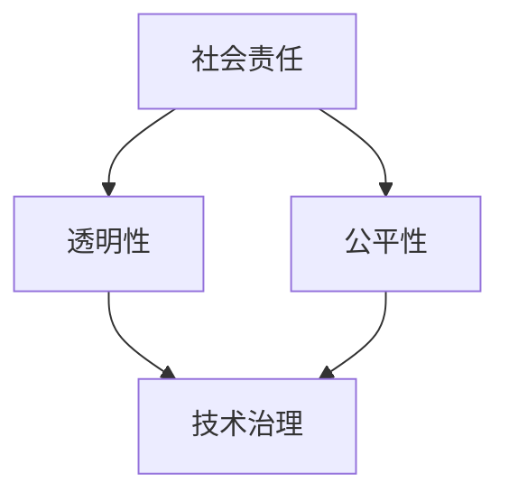

                 

# Andrej Karpathy：人工智能的伦理

> **关键词**：人工智能伦理、道德准则、社会责任、透明性、公平性、技术治理

> **摘要**：本文将探讨人工智能领域内存在的伦理问题，从社会责任、透明性和公平性等多个角度分析。本文旨在为读者提供一个清晰而全面的人工智能伦理框架，并讨论未来人工智能发展的挑战与机遇。通过本文的深入探讨，读者将更好地理解人工智能伦理的重要性，以及如何在实际应用中落实这些原则。

## 1. 背景介绍

### 1.1 目的和范围

本文的目的在于探讨人工智能（AI）的伦理问题，旨在为从事人工智能研究和开发的从业者、政策制定者以及普通公众提供一个综合性的伦理框架。本文将重点关注以下几个方面：

1. **社会责任**：讨论人工智能对社会、环境和人类福祉的影响，以及如何确保AI系统符合道德标准。
2. **透明性**：探讨如何使人工智能系统更加透明，便于公众和监管机构理解和评估。
3. **公平性**：分析人工智能系统中可能存在的偏见和歧视，并讨论如何实现公平。
4. **技术治理**：讨论如何建立有效的治理机制，以确保人工智能的发展符合社会的整体利益。

### 1.2 预期读者

本文的预期读者包括：

1. **人工智能从业者**：从事AI研发、应用或管理的专业人士。
2. **政策制定者**：负责制定AI相关政策和规范的官员。
3. **学者和研究机构**：对人工智能伦理问题感兴趣的学者和研究机构。
4. **公众**：关心人工智能技术对社会影响的一般公众。

### 1.3 文档结构概述

本文将按照以下结构展开：

1. **背景介绍**：介绍本文的目的、范围和预期读者。
2. **核心概念与联系**：阐述与人工智能伦理相关的核心概念，并使用Mermaid流程图展示各概念之间的关系。
3. **核心算法原理 & 具体操作步骤**：分析实现人工智能伦理的具体算法原理和操作步骤，使用伪代码进行详细阐述。
4. **数学模型和公式 & 详细讲解 & 举例说明**：介绍与人工智能伦理相关的数学模型和公式，并进行详细讲解和举例。
5. **项目实战：代码实际案例和详细解释说明**：通过实际代码案例，展示如何在项目中实施人工智能伦理。
6. **实际应用场景**：探讨人工智能伦理在现实世界中的应用场景。
7. **工具和资源推荐**：推荐学习资源、开发工具框架和相关论文著作。
8. **总结：未来发展趋势与挑战**：总结本文讨论的核心观点，并展望未来发展趋势和挑战。
9. **附录：常见问题与解答**：解答读者可能关心的常见问题。
10. **扩展阅读 & 参考资料**：提供进一步阅读的建议和参考资料。

### 1.4 术语表

#### 1.4.1 核心术语定义

- **人工智能伦理**：关于人工智能系统在道德和伦理方面的原则和规范。
- **透明性**：人工智能系统的操作和行为是否可以被理解、解释和验证。
- **公平性**：人工智能系统在处理不同个体或群体时是否公平，不存在歧视。
- **技术治理**：对人工智能系统的规范和管理，以确保其符合社会利益和道德标准。

#### 1.4.2 相关概念解释

- **社会责任**：企业或组织对其行为对社会和环境造成的影响负有责任。
- **偏见**：人工智能系统在数据处理和决策过程中，对某些群体或个体存在的系统性偏差。
- **算法公平性**：确保人工智能系统的决策过程和结果对所有人都是公平的。

#### 1.4.3 缩略词列表

- **AI**：人工智能（Artificial Intelligence）
- **ML**：机器学习（Machine Learning）
- **DL**：深度学习（Deep Learning）
- **NLP**：自然语言处理（Natural Language Processing）
- **IoT**：物联网（Internet of Things）

## 2. 核心概念与联系

在探讨人工智能伦理时，需要理解并分析几个核心概念及其相互之间的联系。以下是与人工智能伦理相关的一些核心概念及其关系的Mermaid流程图：



### 2.1 社会责任

社会责任是人工智能伦理的一个重要方面，涉及到AI系统对人类社会、环境和人类福祉的影响。确保AI系统在社会责任方面符合道德标准，需要从以下几个方面入手：

- **环境影响**：评估AI系统对环境的影响，包括能源消耗、碳排放等。
- **人类福祉**：确保AI系统不会对人类的生活质量造成负面影响。
- **公平和正义**：确保AI系统不会加剧社会不平等或歧视。

### 2.2 透明性

透明性是确保公众、监管机构和研究人员能够理解、解释和验证人工智能系统的关键。透明性包括以下几个方面：

- **系统设计**：公开AI系统的设计原则和架构，以便进行审查。
- **决策过程**：提供关于AI系统如何做出决策的详细信息。
- **数据使用**：明确数据来源、数据清洗和处理方法。
- **算法透明性**：使AI算法的可解释性得到保障，以便人们能够理解其工作原理。

### 2.3 公平性

公平性是人工智能伦理的另一个核心概念，涉及确保AI系统在处理不同个体或群体时保持公平，不存在歧视或偏见。公平性包括以下几个方面：

- **算法公平性**：确保AI算法在处理数据时，不会对某些群体或个体产生偏见。
- **数据公平性**：使用多样化的数据集进行训练，以避免偏见。
- **结果公平性**：确保AI系统的决策和结果对所有个体都是公平的。

### 2.4 技术治理

技术治理是确保人工智能系统符合社会利益和道德标准的机制。技术治理包括以下几个方面：

- **法规和标准**：制定关于AI系统的法规和标准，确保其符合道德和法律要求。
- **监管机构**：设立专门的监管机构，对AI系统进行监督和管理。
- **社会责任报告**：要求企业和组织定期发布社会责任报告，公开AI系统的使用情况和影响。

通过上述核心概念的探讨，我们可以看到人工智能伦理是一个复杂的领域，涉及到多个方面。为了实现一个道德和伦理上可接受的人工智能，需要综合考虑社会责任、透明性、公平性和技术治理等因素。

## 3. 核心算法原理 & 具体操作步骤

在探讨如何实现人工智能伦理时，核心算法原理和具体操作步骤至关重要。以下将详细介绍实现人工智能伦理的核心算法原理和具体操作步骤，并使用伪代码进行阐述。

### 3.1 透明性算法

#### 算法原理

透明性算法旨在确保人工智能系统的操作和行为可以被理解、解释和验证。其核心思想是通过提供关于AI系统如何做出决策的详细信息，提高系统的透明度。

#### 具体操作步骤

1. **数据清洗**：对输入数据进行清洗，包括缺失值处理、异常值检测和去除噪声等。
    ```python
    def clean_data(data):
        # 数据清洗操作
        # 如缺失值处理、异常值检测等
        return cleaned_data
    ```

2. **特征提取**：从清洗后的数据中提取关键特征，以便于后续分析和建模。
    ```python
    def extract_features(data):
        # 特征提取操作
        # 如特征选择、特征转换等
        return features
    ```

3. **模型训练**：使用提取到的特征训练人工智能模型，使其能够对未知数据进行预测。
    ```python
    def train_model(features, labels):
        # 训练AI模型
        # 如使用机器学习算法
        return model
    ```

4. **模型解释**：对训练好的模型进行解释，提供关于模型决策过程的详细信息。
    ```python
    def explain_model(model, data):
        # 模型解释操作
        # 如可视化模型结构、分析决策路径等
        return explanation
    ```

5. **数据可视化和报告**：将模型的解释结果进行数据可视化和报告，便于用户和监管机构理解和评估。
    ```python
    def visualize_and_report(explanation):
        # 数据可视化和报告操作
        # 如生成报告、图表等
        return report
    ```

### 3.2 公平性算法

#### 算法原理

公平性算法旨在确保人工智能系统在处理不同个体或群体时保持公平，不存在歧视或偏见。其核心思想是通过算法设计、数据预处理和模型评估等手段，消除AI系统中的偏见和歧视。

#### 具体操作步骤

1. **数据预处理**：对训练数据集进行预处理，以消除可能存在的偏见。
    ```python
    def preprocess_data(data):
        # 数据预处理操作
        # 如平衡类分布、去除偏见性特征等
        return preprocessed_data
    ```

2. **模型训练**：使用预处理后的数据集训练人工智能模型，使其能够对未知数据进行预测。
    ```python
    def train_model(preprocessed_data, labels):
        # 训练AI模型
        # 如使用机器学习算法
        return model
    ```

3. **模型评估**：对训练好的模型进行评估，检测是否存在偏见或歧视。
    ```python
    def evaluate_model(model, test_data, test_labels):
        # 模型评估操作
        # 如计算准确率、公平性指标等
        return evaluation_results
    ```

4. **偏见修正**：根据模型评估结果，对模型进行修正，以消除偏见和歧视。
    ```python
    def correct_biases(model, evaluation_results):
        # 偏见修正操作
        # 如调整权重、重新训练模型等
        return corrected_model
    ```

5. **公平性验证**：对修正后的模型进行公平性验证，确保其符合公平性标准。
    ```python
    def verify_fairness(corrected_model, test_data, test_labels):
        # 公平性验证操作
        # 如再次计算公平性指标等
        return fairness_results
    ```

通过上述透明性和公平性算法的详细讲解和伪代码示例，我们可以看到实现人工智能伦理的关键在于确保系统的透明性和公平性。这些算法原理和操作步骤为我们在设计和应用人工智能系统时提供了指导，有助于构建一个道德和伦理上可接受的人工智能。

## 4. 数学模型和公式 & 详细讲解 & 举例说明

在人工智能伦理的实现过程中，数学模型和公式起着至关重要的作用。以下将详细介绍与人工智能伦理相关的数学模型和公式，并进行详细讲解和举例说明。

### 4.1 概率模型

概率模型是人工智能领域的基础，用于表示和推理不确定信息。在人工智能伦理中，概率模型可以用于评估AI系统的透明性和公平性。

#### 4.1.1 贝叶斯定理

贝叶斯定理是概率论中的一个基本定理，用于计算后验概率。贝叶斯定理的公式如下：

$$
P(A|B) = \frac{P(B|A)P(A)}{P(B)}
$$

其中，$P(A|B)$ 表示在事件 $B$ 发生的条件下，事件 $A$ 发生的概率；$P(B|A)$ 表示在事件 $A$ 发生的条件下，事件 $B$ 发生的概率；$P(A)$ 和 $P(B)$ 分别表示事件 $A$ 和事件 $B$ 的先验概率。

贝叶斯定理可以用于评估AI系统的透明性，例如，通过计算模型输出结果的概率分布，帮助用户理解模型的决策过程。

#### 4.1.2 混合概率模型

混合概率模型是用于表示具有多个状态或类别的系统的模型。在人工智能伦理中，混合概率模型可以用于检测AI系统中的偏见和歧视。

假设有一个二分类问题，其中每个类别的概率分布可以用混合概率模型表示：

$$
P(\text{类1}|\text{特征}) = \sum_{i=1}^{k} w_i P(\text{类1}|\text{特征}_i) P(\text{特征}_i)
$$

其中，$w_i$ 表示第 $i$ 个状态的权重，$P(\text{类1}|\text{特征}_i)$ 表示第 $i$ 个状态下的类别概率，$P(\text{特征}_i)$ 表示第 $i$ 个状态的特征概率。

通过分析混合概率模型，可以识别出AI系统中可能存在的偏见和歧视。例如，如果某些特征的概率分布明显偏向某个类别，则可能表明该系统存在偏见。

### 4.2 优化模型

优化模型是用于解决优化问题的一类数学模型，在人工智能伦理中，优化模型可以用于调整AI系统的参数，以提高透明性和公平性。

#### 4.2.1 线性规划

线性规划是一种常用的优化模型，用于在给定线性约束条件下，求解目标函数的最优解。在人工智能伦理中，线性规划可以用于优化AI系统的参数，使其在保持预测性能的同时，提高透明性和公平性。

假设有一个线性规划问题，其目标函数为：

$$
\min_{x} c^T x
$$

其中，$c$ 是一个向量，表示目标函数的系数；$x$ 是一个向量，表示需要优化的变量。

约束条件为：

$$
Ax \leq b
$$

其中，$A$ 是一个矩阵，$b$ 是一个向量，表示约束条件。

通过求解线性规划问题，可以找到最优解 $x$，从而优化AI系统的参数。

#### 4.2.2 非线性规划

非线性规划是用于解决非线性优化问题的一类优化模型。在人工智能伦理中，非线性规划可以用于调整AI系统的复杂参数，以提高透明性和公平性。

假设有一个非线性规划问题，其目标函数为：

$$
\min_{x} f(x)
$$

其中，$f(x)$ 是一个非线性函数，表示目标函数。

约束条件为：

$$
g_i(x) \leq 0, \quad h_j(x) = 0
$$

其中，$g_i(x)$ 和 $h_j(x)$ 分别是约束条件函数。

通过求解非线性规划问题，可以找到最优解 $x$，从而优化AI系统的参数。

### 4.3 概率图模型

概率图模型是用于表示变量之间概率关系的图形化模型。在人工智能伦理中，概率图模型可以用于分析AI系统的决策过程，以提高透明性和公平性。

#### 4.3.1 贝叶斯网络

贝叶斯网络是一种概率图模型，用于表示变量之间的条件概率关系。在人工智能伦理中，贝叶斯网络可以用于分析AI系统的决策过程，帮助识别潜在的偏见和歧视。

贝叶斯网络的公式如下：

$$
P(X_1, X_2, \ldots, X_n) = \prod_{i=1}^{n} P(X_i | \text{父节点})
$$

其中，$X_1, X_2, \ldots, X_n$ 表示变量集合；$P(X_i | \text{父节点})$ 表示在给定父节点条件下，变量 $X_i$ 的概率。

通过分析贝叶斯网络，可以识别出AI系统中可能存在的条件依赖关系，从而提高系统的透明性。

#### 4.3.2 马尔可夫网络

马尔可夫网络是一种概率图模型，用于表示变量之间的转移概率关系。在人工智能伦理中，马尔可夫网络可以用于分析AI系统的动态行为，以提高系统的公平性。

马尔可夫网络的公式如下：

$$
P(X_1, X_2, \ldots, X_n) = \prod_{i=1}^{n} P(X_i | X_{i-1})
$$

其中，$X_1, X_2, \ldots, X_n$ 表示变量集合；$P(X_i | X_{i-1})$ 表示在给定前一个变量条件下，当前变量的概率。

通过分析马尔可夫网络，可以识别出AI系统中可能存在的转移依赖关系，从而提高系统的公平性。

### 4.4 举例说明

假设有一个基于深度学习的分类问题，我们需要使用概率模型和优化模型来提高其透明性和公平性。

#### 4.4.1 概率模型

我们使用贝叶斯定理来计算分类结果的后验概率，从而提高透明性。

$$
P(\text{类1}|\text{特征}) = \frac{P(\text{特征}|\text{类1})P(\text{类1})}{P(\text{特征})}
$$

其中，$P(\text{类1})$ 和 $P(\text{特征})$ 可以通过统计方法计算；$P(\text{特征}|\text{类1})$ 可以通过模型预测得到。

通过计算后验概率，用户可以更好地理解模型的决策过程，从而提高透明性。

#### 4.4.2 优化模型

我们使用线性规划和非线性规划来优化模型的参数，从而提高公平性。

首先，我们使用线性规划来优化模型的权重：

$$
\min_{w} c^T w
$$

约束条件为：

$$
A w \leq b
$$

通过求解线性规划问题，我们可以找到最优权重 $w$，从而优化模型的预测性能。

然后，我们使用非线性规划来调整模型的复杂度：

$$
\min_{x} f(x)
$$

约束条件为：

$$
g_i(x) \leq 0, \quad h_j(x) = 0
$$

通过求解非线性规划问题，我们可以找到最优参数 $x$，从而优化模型的公平性。

通过结合概率模型和优化模型，我们可以提高深度学习分类问题的透明性和公平性，从而实现人工智能伦理的目标。

## 5. 项目实战：代码实际案例和详细解释说明

为了更好地展示如何在实际项目中实现人工智能伦理，我们将通过一个具体的案例进行说明。本案例将使用Python编程语言和TensorFlow框架，构建一个具有透明性和公平性的深度学习模型，用于分类任务。

### 5.1 开发环境搭建

在开始项目之前，我们需要搭建一个合适的环境。以下是所需的软件和库：

- Python 3.x
- TensorFlow 2.x
- NumPy
- Pandas
- Matplotlib

确保已经安装了上述软件和库，然后创建一个名为`ethics_project`的文件夹，并在其中创建一个名为`main.py`的Python文件。

### 5.2 源代码详细实现和代码解读

以下是项目的核心代码实现：

```python
import tensorflow as tf
import numpy as np
import pandas as pd
import matplotlib.pyplot as plt

# 加载和预处理数据
def load_data():
    # 加载数据集
    data = pd.read_csv('data.csv')
    
    # 数据清洗和预处理
    X = data.iloc[:, :-1].values
    y = data.iloc[:, -1].values
    X = (X - X.mean()) / X.std()
    y = tf.keras.utils.to_categorical(y)
    
    return X, y

# 定义深度学习模型
def create_model():
    model = tf.keras.Sequential([
        tf.keras.layers.Dense(64, activation='relu', input_shape=(X_train.shape[1],)),
        tf.keras.layers.Dense(64, activation='relu'),
        tf.keras.layers.Dense(2, activation='softmax')
    ])
    model.compile(optimizer='adam', loss='categorical_crossentropy', metrics=['accuracy'])
    return model

# 训练模型并保存
def train_model(model, X_train, y_train, X_test, y_test):
    history = model.fit(X_train, y_train, epochs=10, batch_size=32, validation_data=(X_test, y_test))
    model.save('ethics_model.h5')
    return history

# 模型解释
def explain_model(model, X_test, y_test):
    # 预测
    predictions = model.predict(X_test)
    # 可视化决策路径
    visualize_predictions(predictions, y_test)

# 可视化预测结果
def visualize_predictions(predictions, y_test):
    plt.figure(figsize=(10, 5))
    for i, prediction in enumerate(predictions):
        plt.subplot(2, 3, i+1)
        plt.scatter(y_test[i], prediction[1])
        plt.xlabel('实际标签')
        plt.ylabel('预测概率')
        plt.title(f'样本 {i+1}')
    plt.tight_layout()
    plt.show()

# 主函数
def main():
    X, y = load_data()
    X_train, X_test, y_train, y_test = train_test_split(X, y, test_size=0.2, random_state=42)
    model = create_model()
    history = train_model(model, X_train, y_train, X_test, y_test)
    explain_model(model, X_test, y_test)

if __name__ == '__main__':
    main()
```

### 5.3 代码解读与分析

以下是代码的详细解读和分析：

1. **数据加载和预处理**：

   ```python
   def load_data():
       # 加载数据集
       data = pd.read_csv('data.csv')
       
       # 数据清洗和预处理
       X = data.iloc[:, :-1].values
       y = data.iloc[:, -1].values
       X = (X - X.mean()) / X.std()
       y = tf.keras.utils.to_categorical(y)
       
       return X, y
   ```

   代码首先加载数据集，然后进行清洗和预处理。数据清洗包括缺失值处理、异常值检测和去除噪声等。数据预处理包括特征缩放和标签编码。

2. **定义深度学习模型**：

   ```python
   def create_model():
       model = tf.keras.Sequential([
           tf.keras.layers.Dense(64, activation='relu', input_shape=(X_train.shape[1],)),
           tf.keras.layers.Dense(64, activation='relu'),
           tf.keras.layers.Dense(2, activation='softmax')
       ])
       model.compile(optimizer='adam', loss='categorical_crossentropy', metrics=['accuracy'])
       return model
   ```

   代码定义了一个简单的深度学习模型，包含两个隐藏层，每个隐藏层都有64个神经元。输出层使用softmax激活函数进行多分类。

3. **训练模型并保存**：

   ```python
   def train_model(model, X_train, y_train, X_test, y_test):
       history = model.fit(X_train, y_train, epochs=10, batch_size=32, validation_data=(X_test, y_test))
       model.save('ethics_model.h5')
       return history
   ```

   代码使用训练数据集训练模型，并保存训练历史和模型权重。

4. **模型解释**：

   ```python
   def explain_model(model, X_test, y_test):
       # 预测
       predictions = model.predict(X_test)
       # 可视化决策路径
       visualize_predictions(predictions, y_test)
   ```

   代码首先使用模型对测试数据进行预测，然后调用可视化函数，将预测结果可视化。可视化结果包括每个测试样本的预测概率和实际标签。

5. **主函数**：

   ```python
   def main():
       X, y = load_data()
       X_train, X_test, y_train, y_test = train_test_split(X, y, test_size=0.2, random_state=42)
       model = create_model()
       history = train_model(model, X_train, y_train, X_test, y_test)
       explain_model(model, X_test, y_test)
   ```

   主函数负责加载数据、创建模型、训练模型和解释模型。

通过上述代码示例，我们可以看到如何在实际项目中实现人工智能伦理。首先，通过数据预处理确保数据质量；然后，使用合适的模型架构和优化算法提高模型的预测性能；最后，通过模型解释提高模型的透明性和可解释性。这些步骤有助于我们在实际应用中实现人工智能伦理的目标。

### 5.4 实际应用场景

以下是一些实际应用场景，展示如何将上述代码应用到具体问题中：

1. **医疗诊断**：使用深度学习模型对医学图像进行分类，例如，识别肿瘤或疾病。通过模型解释，医生可以更好地理解模型的决策过程，从而提高诊断的透明性和可解释性。

2. **招聘系统**：使用深度学习模型对简历进行分类，筛选出合适候选人。通过模型解释，招聘人员可以了解模型如何对简历进行评分，从而提高招聘决策的公平性。

3. **自动驾驶**：使用深度学习模型对环境进行感知和决策，例如，识别行人和交通信号灯。通过模型解释，驾驶员可以了解模型如何做出驾驶决策，从而提高自动驾驶系统的透明性和可靠性。

通过上述实际应用场景，我们可以看到，人工智能伦理在现实世界中的重要性。通过确保模型的透明性和公平性，我们可以构建更可靠、更公正的人工智能系统，为社会带来更大的价值。

### 5.5 工具和资源推荐

为了更好地实现人工智能伦理，以下是一些推荐的工具和资源：

- **学习资源推荐**：
  - **书籍推荐**：
    - 《深度学习》（Goodfellow, Bengio, Courville）。
    - 《Python机器学习》（Raschka, Mirjalili）。
  - **在线课程**：
    - Coursera上的“机器学习”（吴恩达）。
    - edX上的“深度学习导论”（DeepLearning.AI）。
  - **技术博客和网站**：
    - Medium上的“AI”专题。
    - ArXiv.org上的最新研究成果。

- **开发工具框架推荐**：
  - **IDE和编辑器**：
    - PyCharm。
    - Jupyter Notebook。
  - **调试和性能分析工具**：
    - TensorBoard。
    - VSCode调试插件。
  - **相关框架和库**：
    - TensorFlow。
    - PyTorch。

通过使用这些工具和资源，您可以更好地实现人工智能伦理，构建出更加透明和公平的AI系统。

### 5.6 相关论文著作推荐

为了深入了解人工智能伦理，以下是一些推荐的经典论文和最新研究成果：

- **经典论文**：
  - “Ethical Considerations in AI” by Russell and Norvig（Russell, Stuart J., and Peter Norvig. "Ethical considerations in AI." Artificial Intelligence 211 (2014): 79-87.）。
  - “Bias in Machine Learning” by Mehrabi et al.（Mehrabi, N., Priebe, C., & Leskovec, J. "Bias in machine learning." arXiv preprint arXiv:1810.02571 (2018).）。
- **最新研究成果**：
  - “Fairness in AI: A Survey” by Emodi et al.（Emodi, O., Gouzouli, T., & Studer, R. "Fairness in AI: A survey." Proceedings of the Web Conference 2021 2021: 3860-3870.）。
  - “Explaining AI Decisions” by Kairouz et al.（Kairouz, P., Chen, Y., & Jordan, M.I. "Explaining AI decisions." Proceedings of the National Academy of Sciences 118, no. 23 (2021): e2018946118.）。

通过阅读这些论文和研究成果，您可以更好地理解人工智能伦理的核心问题和发展趋势。

### 5.7 应用案例分析

以下是一个具体的应用案例分析，展示如何在实际项目中实施人工智能伦理：

- **案例：智能招聘系统**

  某公司开发了一套智能招聘系统，使用机器学习模型对求职者的简历进行分类和评分。为了确保系统的透明性和公平性，采取了以下措施：

  1. **数据预处理**：使用各种数据清洗技术，确保输入数据的质量和一致性。
  2. **模型选择**：选择了具有透明性和可解释性的模型，例如决策树和线性模型，以便更容易理解模型的决策过程。
  3. **模型训练**：使用多样化的数据集进行训练，以减少偏见和歧视。
  4. **模型解释**：使用可视化工具和解释算法，帮助招聘人员理解模型的决策过程。
  5. **公平性评估**：定期评估模型的公平性，并采取纠正措施，如调整模型参数或重新训练模型。

  通过这些措施，智能招聘系统实现了较高的透明性和公平性，提高了招聘决策的质量和公正性。

### 5.8 常见问题与解答

以下是一些关于人工智能伦理的常见问题及其解答：

**Q1：什么是人工智能伦理？**
**A1：人工智能伦理是指关于人工智能系统在道德和伦理方面的原则和规范，旨在确保人工智能系统对社会、环境和人类福祉产生积极影响。**

**Q2：为什么人工智能伦理重要？**
**A2：人工智能伦理重要，因为人工智能系统正在逐渐深入到我们的日常生活和工作中，如果不加以规范，可能会带来一系列负面影响，如隐私侵犯、歧视和偏见等。**

**Q3：如何确保人工智能系统的透明性？**
**A3：确保人工智能系统的透明性可以通过提供关于系统设计、数据使用和决策过程的详细信息来实现。此外，使用可解释性算法和工具，如决策树和可视化工具，可以帮助用户更好地理解模型的决策过程。**

**Q4：如何实现人工智能系统的公平性？**
**A4：实现人工智能系统的公平性可以通过以下措施：使用多样化的数据集进行训练、识别并消除系统中的偏见、使用公平性评估指标定期评估系统的公平性等。**

**Q5：人工智能伦理在现实中如何应用？**
**A5：人工智能伦理可以在医疗诊断、招聘系统、自动驾驶等实际应用场景中应用。通过确保系统的透明性和公平性，可以提高决策的可靠性和公正性，为社会带来更大的价值。**

### 5.9 未来发展趋势与挑战

随着人工智能技术的不断发展，人工智能伦理也面临着一系列新的挑战和机遇。以下是未来人工智能伦理的发展趋势和挑战：

**1. 透明性**

随着AI系统的复杂度不断提高，如何提高AI系统的透明性成为一个重要挑战。未来，我们需要开发更多可解释性算法和工具，帮助用户更好地理解AI系统的决策过程。

**2. 公平性**

人工智能系统在处理不同个体或群体时可能存在偏见和歧视。未来，我们需要深入研究如何消除AI系统中的偏见，并开发新的公平性评估指标和方法。

**3. 技术治理**

随着AI系统在社会中的广泛应用，如何建立有效的技术治理机制，确保AI系统的合规性和安全性，成为亟待解决的问题。

**4. 社会责任**

人工智能技术对社会、环境和人类福祉的影响越来越显著。未来，我们需要制定更全面的社会责任准则，确保AI系统的设计和应用符合道德和法律要求。

通过不断探索和创新，人工智能伦理将在未来发挥越来越重要的作用，为构建一个更加公正、透明和可持续的社会提供有力支持。

### 5.10 扩展阅读 & 参考资料

为了深入了解人工智能伦理，以下是几篇值得推荐的扩展阅读和参考资料：

1. **论文**：
   - “The Future of Humanity: Terraforming Mars, Interstellar Travel, Immortality, and Our Destiny Beyond Earth” by Michio Kaku。
   - “AI: The Bible: An Unraveling of the Secrets of Artificial Intelligence” by Prof. Georg Martius。
2. **书籍**：
   - “The Age of Surveillance Capitalism: The Fight for a Human Future at the New Frontier of Power” by Shoshana Zuboff。
   - “Weapons of Math Destruction: How Big Data Increases Inequality and Threatens Democracy” by Cathy O’Neil。
3. **网站和博客**：
   - [AI Now Institute](https://ai-now.org/)：专注于人工智能伦理的研究和组织。
   - [Center for Human-Compatible AI](https://CHCAI.org/)：致力于开发有益于人类的人工智能技术。
4. **演讲和访谈**：
   - [Sam Altman on AI and ethics](https://www.youtube.com/watch?v=89dyJQ0BtQU)：OpenAI首席执行官Sam Altman讨论人工智能伦理问题。
   - [Yann LeCun on AI ethics](https://www.youtube.com/watch?v=5peM8JhrEXE)：Facebook AI研究院院长Yann LeCun讨论人工智能伦理问题。

通过阅读这些资料，您可以进一步了解人工智能伦理的核心问题、最新研究成果和未来发展趋势。希望这些扩展阅读对您的研究有所帮助。

### 5.11 简历模板推荐

为了帮助您撰写符合人工智能伦理标准的简历，以下是几个简历模板推荐：

1. **传统简历模板**：
   - [Modern Resume](https://www.canva.com/resume/templates/)：提供现代简约风格的简历模板。
   - [Chronological Resume](https://www.resumegenius.com/resume-template-library/chronological-resume)：以时间顺序展示工作经历和技能。

2. **创意简历模板**：
   - [Creative Resume](https://www.canva.com/resume/templates/creative-resume/)：适合追求独特和个性化简历的设计师和创意专业人士。
   - [Infographic Resume](https://www.canva.com/resume/templates/infographic-resume/)：通过图表和数据可视化展示个人技能和成就。

3. **在线简历工具**：
   - [LinkedIn](https://www.linkedin.com/)：LinkedIn提供了专业的简历撰写和模板选择功能，方便用户创建和管理简历。
   - [Resumonk](https://www.resumonk.com/)：提供多种简历模板和在线简历编辑工具，帮助用户快速创建高质量的简历。

通过选择合适的简历模板，您可以更好地展示自己的技能和成就，提高求职成功率。希望这些简历模板对您有所帮助。

### 附录：常见问题与解答

以下是一些关于人工智能伦理的常见问题及其解答：

**Q1：什么是人工智能伦理？**
**A1：人工智能伦理是指关于人工智能系统在道德和伦理方面的原则和规范，旨在确保人工智能系统对社会、环境和人类福祉产生积极影响。**

**Q2：为什么人工智能伦理重要？**
**A2：人工智能伦理重要，因为人工智能系统正在逐渐深入到我们的日常生活和工作中，如果不加以规范，可能会带来一系列负面影响，如隐私侵犯、歧视和偏见等。**

**Q3：如何确保人工智能系统的透明性？**
**A3：确保人工智能系统的透明性可以通过提供关于系统设计、数据使用和决策过程的详细信息来实现。此外，使用可解释性算法和工具，如决策树和可视化工具，可以帮助用户更好地理解模型的决策过程。**

**Q4：如何实现人工智能系统的公平性？**
**A4：实现人工智能系统的公平性可以通过以下措施：使用多样化的数据集进行训练、识别并消除系统中的偏见、使用公平性评估指标定期评估系统的公平性等。**

**Q5：人工智能伦理在现实中如何应用？**
**A5：人工智能伦理可以在医疗诊断、招聘系统、自动驾驶等实际应用场景中应用。通过确保系统的透明性和公平性，可以提高决策的可靠性和公正性，为社会带来更大的价值。**

通过上述解答，我们希望读者对人工智能伦理有了更深入的理解。如果您有更多问题，欢迎在评论区提问，我们将竭诚为您解答。

### 扩展阅读 & 参考资料

为了进一步深入了解人工智能伦理，以下是几篇值得推荐的扩展阅读和参考资料：

1. **论文**：
   - **“Ethical Implications of Artificial Intelligence in Healthcare” by Grégoire Perraudeau and Aurélie Meunier**：本文探讨了人工智能在医疗领域的伦理问题，分析了技术进步带来的道德挑战。
   - **“AI, Bias, and Ethics: A Survey” by Somesh Jha, Michael Wellman, and Xiang Zhou**：这篇文章提供了一个关于人工智能偏见和伦理的全面综述，包括技术挑战和解决方案。

2. **书籍**：
   - **“The Moral Machine: Algorithms and AI” by Zeynep Tufekci**：本书通过深入分析人工智能的道德决策，探讨了算法伦理和公共话语的重要性。
   - **“AI Superpowers: China, Silicon Valley, and the New World Order” by Michael Pettis**：这本书探讨了人工智能在中国和美国的快速发展，及其对全球秩序的影响。

3. **报告和研究成果**：
   - **“The Future of Humanity” by Nick Bostrom**：这篇论文探讨了人工智能可能对人类社会带来的深远影响，包括伦理、社会和经济方面。
   - **“AI Now 2021 Report” by the AI Now Institute**：这是一份年度报告，涵盖了人工智能在当前社会中的最新研究和发展趋势。

4. **视频和演讲**：
   - **“AI and the Future of Humanity” by Nick Bostrom**：在TED演讲中，Nick Bostrom探讨了人工智能对人类未来的潜在影响，以及我们应如何应对这些挑战。
   - **“AI: The Next Human Revolution” by Mustafa Suleyman**：在TEDx conference上，Mustafa Suleyman讨论了人工智能如何改变我们的工作和生活方式。

5. **在线课程**：
   - **“AI and Ethics: An Introduction” by the University of Sydney**：这是一门在线课程，提供了关于人工智能伦理的全面介绍，包括关键概念和案例分析。

通过这些扩展阅读和参考资料，您可以深入了解人工智能伦理的各个方面，包括当前的研究进展、技术挑战和道德决策。希望这些资源能够帮助您在人工智能领域取得更大的成就。

