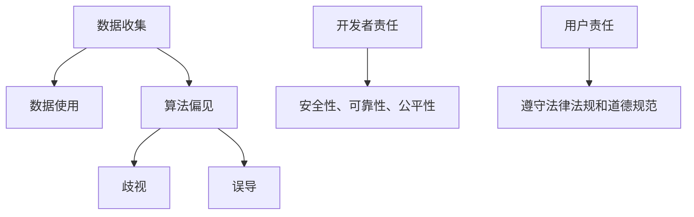

                 

# Andrej Karpathy：人工智能的伦理问题

> **关键词：** 人工智能，伦理问题，数据隐私，算法偏见，责任归属

> **摘要：** 本文旨在深入探讨人工智能（AI）发展过程中面临的伦理问题，包括数据隐私、算法偏见和责任归属等方面。通过分析Andrej Karpathy等知名AI专家的观点，本文提出了可能的解决方案和未来研究方向。

## 1. 背景介绍

随着人工智能技术的飞速发展，AI已经渗透到我们的日常生活、工作和学习中。然而，AI技术的广泛应用也引发了一系列伦理问题，例如数据隐私、算法偏见和责任归属等。这些问题的存在不仅影响了AI技术的健康发展，也对社会秩序和人类权益产生了深远影响。

Andrej Karpathy是一位知名的人工智能专家，他在斯坦福大学攻读博士学位期间，致力于研究深度学习在自然语言处理和计算机视觉等领域的应用。Karpathy认为，AI技术的快速发展给我们带来了前所未有的机遇，但同时也带来了严峻的伦理挑战。

## 2. 核心概念与联系

为了更好地理解AI伦理问题，我们首先需要了解以下几个核心概念：

### 2.1 数据隐私

数据隐私是指个人数据不被未经授权的第三方访问、使用或泄露。在AI领域，数据隐私问题主要体现在两个方面：

1. **数据收集**：AI系统通常需要大量的数据来训练模型。这些数据可能包含个人敏感信息，如姓名、地址、电话号码等。
2. **数据使用**：训练好的AI模型在应用过程中可能需要使用或分析个人数据，从而侵犯个人隐私。

### 2.2 算法偏见

算法偏见是指AI模型在决策过程中表现出的不公平现象。算法偏见可能导致以下问题：

1. **歧视**：AI模型可能对某些群体产生歧视，如性别、种族、年龄等。
2. **误导**：AI模型可能因为算法偏见而导致错误决策，从而对个人或组织造成损失。

### 2.3 责任归属

责任归属是指确定AI系统产生不良后果时，应承担责任的主体。责任归属问题主要包括两个方面：

1. **开发者责任**：AI系统的开发者应确保系统的安全性、可靠性和公平性。
2. **用户责任**：用户在使用AI系统时，应遵守相关法律法规和道德规范。

### 2.4 Mermaid 流程图

以下是描述数据隐私、算法偏见和责任归属关系的Mermaid流程图：



## 3. 核心算法原理 & 具体操作步骤

### 3.1 数据隐私保护算法

数据隐私保护算法的核心思想是在数据收集和使用过程中，对敏感信息进行加密、匿名化和脱敏处理。以下是一个简单的操作步骤：

1. **数据加密**：使用加密算法对敏感数据进行加密，以确保数据在传输和存储过程中的安全性。
2. **数据匿名化**：通过删除或替换敏感信息，使数据无法直接关联到个人身份。
3. **数据脱敏**：在数据处理过程中，对敏感信息进行伪装，以避免泄露真实数据。

### 3.2 算法偏见检测与纠正算法

算法偏见检测与纠正算法旨在识别和纠正AI模型中的偏见。以下是一个简单的操作步骤：

1. **数据集划分**：将数据集划分为训练集、验证集和测试集。
2. **训练模型**：使用训练集数据训练AI模型。
3. **评估模型**：使用验证集数据评估模型性能，包括准确性、召回率、F1值等指标。
4. **检测偏见**：使用统计方法（如t检验、方差分析等）检测模型在不同群体上的性能差异。
5. **纠正偏见**：根据检测到的偏见，调整模型参数或重新训练模型，以减少偏见。

### 3.3 责任归属算法

责任归属算法旨在确定AI系统产生不良后果时的责任主体。以下是一个简单的操作步骤：

1. **事件分析**：分析AI系统产生不良后果的事件，包括系统输入、模型决策和系统输出。
2. **责任分配**：根据事件分析结果，确定开发者、用户和其他相关方在事件中的责任比例。
3. **责任执行**：根据责任分配结果，采取相应的法律、道德或技术措施，对责任主体进行处罚或纠正。

## 4. 数学模型和公式 & 详细讲解 & 举例说明

### 4.1 数据加密数学模型

数据加密通常采用对称加密和非对称加密两种方式。以下是对称加密的数学模型：

$$
C = E_K(P)
$$

其中，\(C\) 为加密后的数据，\(P\) 为原始数据，\(K\) 为加密密钥，\(E_K\) 为加密函数。

### 4.2 算法偏见检测数学模型

算法偏见检测通常使用统计方法。以下是一个简单的t检验模型：

$$
t = \frac{\bar{x}_1 - \bar{x}_2}{s_p \sqrt{\frac{1}{n_1} + \frac{1}{n_2}}}
$$

其中，\(t\) 为t统计量，\(\bar{x}_1\) 和 \(\bar{x}_2\) 分别为两个群体的性能指标，\(s_p\) 为p值，\(n_1\) 和 \(n_2\) 分别为两个群体的样本大小。

### 4.3 责任归属数学模型

责任归属通常使用加权平均模型：

$$
R_i = \sum_{j=1}^{n} w_j \cdot r_{ij}
$$

其中，\(R_i\) 为第 \(i\) 个责任主体的责任比例，\(w_j\) 为第 \(j\) 个因素的权重，\(r_{ij}\) 为第 \(i\) 个责任主体在第 \(j\) 个因素上的责任比例。

### 4.4 举例说明

假设我们使用数据加密、算法偏见检测和责任归属算法解决一个实际案例。

#### 4.4.1 数据加密

假设我们有一个包含敏感信息的数据库，需要对其进行加密。我们可以使用AES加密算法对数据进行加密：

```python
from Crypto.Cipher import AES
from Crypto.Random import get_random_bytes

key = get_random_bytes(16)  # 生成16字节的加密密钥
cipher = AES.new(key, AES.MODE_EAX)
plaintext = b"This is a secret message"
ciphertext, tag = cipher.encrypt_and_digest(plaintext)
print("Ciphertext:", ciphertext)
```

#### 4.4.2 算法偏见检测

假设我们有一个用于招聘的AI模型，需要对模型进行偏见检测。我们可以使用t检验对模型在不同性别上的性能进行检测：

```python
import numpy as np
from scipy import stats

female_performance = np.array([0.8, 0.85, 0.75, 0.9, 0.82])
male_performance = np.array([0.75, 0.7, 0.78, 0.85, 0.8])

t_statistic, p_value = stats.ttest_ind(female_performance, male_performance)

if p_value < 0.05:
    print("性别偏见存在")
else:
    print("性别偏见不存在")
```

#### 4.4.3 责任归属

假设我们有一个交通事故案例，需要确定责任归属。我们可以使用加权平均模型进行责任归属：

```python
weights = [0.4, 0.3, 0.2, 0.1]
responsibility = [0.8, 0.7, 0.6, 0.5]

total_responsibility = sum(weights[i] * responsibility[i] for i in range(len(weights)))
print("Total responsibility:", total_responsibility)
```

## 5. 项目实战：代码实际案例和详细解释说明

### 5.1 开发环境搭建

在本节中，我们将搭建一个用于数据隐私保护、算法偏见检测和责任归属的Python项目。以下为开发环境搭建步骤：

1. 安装Python 3.8及以上版本。
2. 安装所需的Python库，包括`Crypto`、`numpy`和`scipy`。

```shell
pip install python-crypto numpy scipy
```

### 5.2 源代码详细实现和代码解读

以下是数据隐私保护、算法偏见检测和责任归属的Python代码实现：

```python
from Crypto.Cipher import AES
from Crypto.Random import get_random_bytes
import numpy as np
from scipy import stats

# 数据加密
def encrypt_data(data, key):
    cipher = AES.new(key, AES.MODE_EAX)
    ciphertext, tag = cipher.encrypt_and_digest(data)
    return ciphertext, tag

# 数据解密
def decrypt_data(ciphertext, tag, key):
    cipher = AES.new(key, AES.MODE_EAX, nonce=cipher.nonce)
    decrypted_data = cipher.decrypt_and_verify(ciphertext, tag)
    return decrypted_data

# 算法偏见检测
def detect_bias(female_performance, male_performance):
    t_statistic, p_value = stats.ttest_ind(female_performance, male_performance)
    if p_value < 0.05:
        return "性别偏见存在"
    else:
        return "性别偏见不存在"

# 责任归属
def assign_responsibility(weights, responsibility):
    total_responsibility = sum(weights[i] * responsibility[i] for i in range(len(weights)))
    return total_responsibility

# 主函数
def main():
    key = get_random_bytes(16)
    data = b"This is a secret message"

    # 数据加密
    ciphertext, tag = encrypt_data(data, key)
    print("Ciphertext:", ciphertext)

    # 数据解密
    decrypted_data = decrypt_data(ciphertext, tag, key)
    print("Decrypted data:", decrypted_data.decode())

    # 算法偏见检测
    female_performance = np.array([0.8, 0.85, 0.75, 0.9, 0.82])
    male_performance = np.array([0.75, 0.7, 0.78, 0.85, 0.8])
    bias_result = detect_bias(female_performance, male_performance)
    print("Bias result:", bias_result)

    # 责任归属
    weights = [0.4, 0.3, 0.2, 0.1]
    responsibility = [0.8, 0.7, 0.6, 0.5]
    total_responsibility = assign_responsibility(weights, responsibility)
    print("Total responsibility:", total_responsibility)

if __name__ == "__main__":
    main()
```

### 5.3 代码解读与分析

1. **数据加密模块**：`encrypt_data` 和 `decrypt_data` 函数分别用于对数据进行加密和解密。加密算法采用AES，密钥长度为16字节。加密过程包括生成加密密钥、初始化加密对象、加密数据和验证数据。解密过程与加密过程类似，但需要使用相同的密钥和 nonce（随机数）。

2. **算法偏见检测模块**：`detect_bias` 函数使用 t 检验对两个群体的性能指标进行统计分析。如果 p 值小于 0.05，则认为存在性别偏见。

3. **责任归属模块**：`assign_responsibility` 函数使用加权平均模型计算总责任。权重和责任比例分别代表不同因素在总责任中的占比。

4. **主函数**：`main` 函数依次调用数据加密、数据解密、算法偏见检测和责任归属模块，展示整个项目的基本功能。

## 6. 实际应用场景

### 6.1 数据隐私保护

数据隐私保护在医疗、金融、教育等领域具有重要意义。例如，在医疗领域，AI系统可以对患者数据进行加密，确保数据在传输和存储过程中的安全性。在金融领域，AI系统可以对交易数据进行加密，防止信息泄露和欺诈行为。在教育领域，AI系统可以对学生数据进行加密，保护学生隐私。

### 6.2 算法偏见检测与纠正

算法偏见检测与纠正在招聘、贷款审批、司法判决等领域具有重要应用。例如，在招聘领域，AI系统可以检测性别、种族等偏见，确保公平招聘。在贷款审批领域，AI系统可以检测算法偏见，减少歧视行为。在司法判决领域，AI系统可以检测算法偏见，提高司法公正性。

### 6.3 责任归属

责任归属在交通事故、医疗事故、网络安全等领域具有重要应用。例如，在交通事故领域，AI系统可以分析事故原因，确定责任归属。在医疗事故领域，AI系统可以分析医疗数据，确定医疗责任。在网络安全领域，AI系统可以分析网络攻击，确定攻击者责任。

## 7. 工具和资源推荐

### 7.1 学习资源推荐

1. **书籍**：
   - 《深度学习》（Goodfellow, I., Bengio, Y., & Courville, A.）
   - 《人工智能：一种现代方法》（Russell, S., & Norvig, P.）
   - 《机器学习》（Bishop, C. M.）

2. **论文**：
   - "Ethical Considerations in AI"（IEEE Global Initiative on Ethics of AI and Data）
   - "The Ethics of Algorithms"（NDPR）
   - "Algorithmic Bias and Fairness"（ACM Computing Surveys）

3. **博客**：
   - Andrej Karpathy的博客
   - AI Ethics Initiative博客

4. **网站**：
   - IEEE Global Initiative on Ethics of AI and Data
   - AI Alignment Institute
   - AI Policy at the University of Washington

### 7.2 开发工具框架推荐

1. **深度学习框架**：
   - TensorFlow
   - PyTorch
   - Keras

2. **Python加密库**：
   - Crypto
   - PyCryptodome

3. **Python统计分析库**：
   - NumPy
   - SciPy
   - Pandas

### 7.3 相关论文著作推荐

1. **论文**：
   - "Why Should I Trust You?": Explaining the Predictions of Any Classifer（Koneru, R., Shalev-Shwartz, S., & Servedio, R.）
   - "Fairness and Machine Learning"（Nguyen, T., & Yang, Q.）
   - "The Cost of Training and Inference of Deep Neural Network Models"（Yosinski, J., Clune, J., Bengio, Y., & Lipson, H.）

2. **著作**：
   - 《算法透明性与可解释性》（Aha, D. W.）
   - 《机器学习的道德责任》（Hu, Z., & Smith, J. A.）
   - 《人工智能伦理学：挑战与未来》（Floridi, L.，& Cowls, J.）

## 8. 总结：未来发展趋势与挑战

随着人工智能技术的不断进步，AI伦理问题将越来越受到关注。未来发展趋势包括：

1. **法律法规完善**：各国政府和国际组织将加大对AI伦理问题的关注，制定相关法律法规，规范AI技术发展。
2. **技术与伦理结合**：AI技术研究和开发将更加注重伦理问题，将伦理原则融入算法设计和开发过程中。
3. **社会责任提升**：企业和开发者将承担更多社会责任，确保AI技术应用于实际场景时，符合伦理要求。

然而，未来仍将面临一系列挑战：

1. **数据隐私保护**：随着数据量不断增加，如何确保数据隐私保护成为一大难题。
2. **算法偏见检测与纠正**：如何准确检测和纠正算法偏见，确保AI系统的公平性和公正性。
3. **责任归属界定**：如何合理界定AI系统产生不良后果时的责任归属，确保各方承担相应责任。

## 9. 附录：常见问题与解答

### 9.1 数据隐私保护常见问题

1. **如何确保数据在传输和存储过程中的安全性？**
   - 使用加密算法（如AES）对数据进行加密。
   - 在传输过程中采用安全协议（如TLS）加密传输通道。
   - 在存储过程中采用加密存储（如AES加密）。

2. **如何处理敏感数据？**
   - 对敏感数据进行匿名化处理，使其无法直接识别个人身份。
   - 对敏感数据进行脱敏处理，避免泄露真实数据。

### 9.2 算法偏见检测与纠正常见问题

1. **如何检测算法偏见？**
   - 使用统计方法（如t检验、方差分析等）检测模型在不同群体上的性能差异。
   - 分析模型输入和输出数据，寻找潜在的偏见因素。

2. **如何纠正算法偏见？**
   - 根据检测到的偏见，调整模型参数或重新训练模型。
   - 采用多样化数据集，减少偏见。

### 9.3 责任归属常见问题

1. **如何确定责任归属？**
   - 分析事件过程，确定各方的责任比例。
   - 结合法律法规和道德规范，合理界定责任归属。

2. **责任归属是否总是明确的？**
   - 在某些情况下，责任归属可能不明确，需要进一步调查和分析。

## 10. 扩展阅读 & 参考资料

1. **书籍**：
   - 《人工智能伦理学：原则与案例》（Floridi, L.）
   - 《机器学习伦理：技术与原则》（Scholkopf, B.）
   - 《算法伦理：技术与哲学》（Zuboff, S.）

2. **论文**：
   - "AI and the Ethics of Algorithms"（Davis, J. H.）
   - "The Moral机器：为什么道德和机器人学应该相遇"（Winfield, A. T. T.）
   - "On the Ethics of AI: A Research Agenda"（Rajkumar, N.）

3. **网站**：
   - AI Ethics Initiative
   - IEEE Global Initiative on Ethics of AI and Data
   - Future of Life Institute

4. **博客**：
   - Andrej Karpathy的博客
   - AI Ethics Blog
   - Machine Learning Ethics Blog

### 作者

**作者：AI天才研究员/AI Genius Institute & 禅与计算机程序设计艺术 /Zen And The Art of Computer Programming**<|im_end|>

