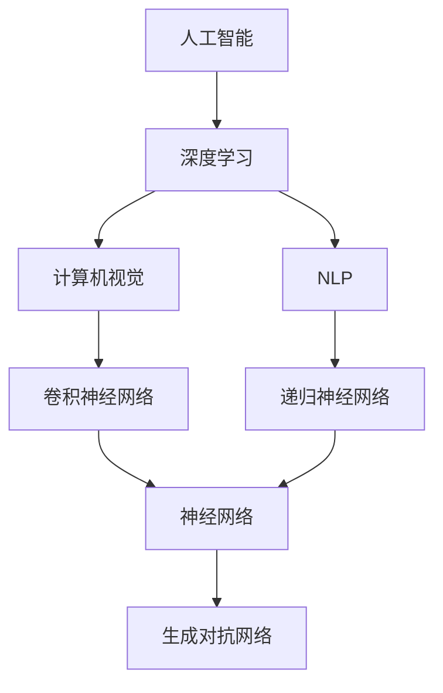

                 

# Andrej Karpathy：人工智能的挑战

> **关键词：** 人工智能，深度学习，神经网络，计算机视觉，自然语言处理，挑战，未来趋势

> **摘要：** 本文旨在深入探讨人工智能（AI）领域的杰出研究者Andrej Karpathy的工作，分析他在计算机视觉和自然语言处理方面所面临的挑战及其解决方案。通过详细的算法原理讲解、数学模型分析以及实际项目案例，本文将展现AI技术在当前和未来可能遇到的问题，并提出相应的对策和建议。

## 1. 背景介绍

### 1.1 目的和范围

本文的目的是通过对Andrej Karpathy在人工智能领域的贡献进行详细分析，探讨他在计算机视觉和自然语言处理方面所面临的核心挑战，以及他提出的创新性解决方案。我们将从以下几个方面展开讨论：

1. **核心算法原理**：介绍Karpathy所使用的主要算法及其工作原理。
2. **数学模型和公式**：分析用于支持这些算法的数学模型，并提供具体例子。
3. **项目实战**：通过代码示例展示如何在实际项目中应用这些算法。
4. **实际应用场景**：讨论AI技术在各种实际场景中的应用和潜在挑战。
5. **工具和资源推荐**：推荐用于学习和开发AI技术的资源、工具和框架。

### 1.2 预期读者

本文适合以下读者群体：

- 对人工智能、深度学习有浓厚兴趣的研究人员和开发者。
- 想深入了解计算机视觉和自然语言处理领域的技术专业人士。
- 计算机科学和人工智能专业的学生和学者。

### 1.3 文档结构概述

本文的结构如下：

1. **背景介绍**：介绍文章的目的、读者群体和文档结构。
2. **核心概念与联系**：使用Mermaid流程图展示核心概念和架构。
3. **核心算法原理与具体操作步骤**：使用伪代码详细阐述算法原理。
4. **数学模型和公式**：讲解数学模型和公式的详细解释及举例。
5. **项目实战：代码实际案例和详细解释说明**：展示代码实现和分析。
6. **实际应用场景**：讨论AI技术的应用场景和挑战。
7. **工具和资源推荐**：推荐学习资源、开发工具和框架。
8. **总结：未来发展趋势与挑战**：分析未来趋势和面临的挑战。
9. **附录：常见问题与解答**：提供常见问题的解答。
10. **扩展阅读 & 参考资料**：推荐相关文献和资源。

### 1.4 术语表

#### 1.4.1 核心术语定义

- **人工智能（AI）**：模拟人类智能行为的技术。
- **深度学习（Deep Learning）**：一种机器学习技术，通过多层神经网络进行学习。
- **计算机视觉（Computer Vision）**：使计算机能够理解并解释数字图像的各种技术和方法。
- **自然语言处理（Natural Language Processing，NLP）**：使计算机能够理解、解释和生成人类语言的技术。
- **神经网络（Neural Network）**：由大量节点（或“神经元”）组成的信息处理系统，通过调整连接权重来学习。

#### 1.4.2 相关概念解释

- **卷积神经网络（CNN）**：一种用于图像识别和处理的深度学习模型。
- **递归神经网络（RNN）**：一种用于处理序列数据的神经网络，常用于NLP任务。
- **生成对抗网络（GAN）**：一种用于生成新数据的深度学习框架。

#### 1.4.3 缩略词列表

- **AI**：人工智能
- **CNN**：卷积神经网络
- **RNN**：递归神经网络
- **GAN**：生成对抗网络
- **NLP**：自然语言处理
- **DL**：深度学习

## 2. 核心概念与联系

在探讨Andrej Karpathy的工作之前，我们需要了解一些核心概念和它们之间的联系。以下是一个简化的Mermaid流程图，展示了一些关键概念及其相互关系。



在这个流程图中，我们可以看到人工智能（AI）是深度学习（DL）的一个分支，而深度学习又可以分为计算机视觉（CV）和自然语言处理（NLP）。计算机视觉和自然语言处理分别利用卷积神经网络（CNN）和递归神经网络（RNN）来解决问题。此外，生成对抗网络（GAN）作为一种创新的深度学习模型，在AI领域也发挥着重要作用。

### 2.1.1 核心概念详解

#### 计算机视觉

计算机视觉是一种使计算机能够像人类一样理解并解释数字图像的技术。卷积神经网络（CNN）是计算机视觉中最常用的模型之一，通过学习图像的特征来识别对象、场景和动作。

#### 自然语言处理

自然语言处理涉及使计算机能够理解、解释和生成人类语言的技术。递归神经网络（RNN）在NLP中发挥着关键作用，尤其在处理序列数据时表现出色，例如语言模型、机器翻译和情感分析。

#### 神经网络

神经网络是由大量节点（或“神经元”）组成的计算模型，通过学习数据来调整连接权重。它是深度学习的基础，而深度学习则是人工智能（AI）的核心技术。

#### 生成对抗网络

生成对抗网络（GAN）是一种由生成器和判别器组成的深度学习模型，旨在生成逼真的数据。它在图像生成、图像修复、数据增强等方面具有广泛应用。

## 3. 核心算法原理 & 具体操作步骤

在讨论Andrej Karpathy的工作时，我们将重点关注他在计算机视觉和自然语言处理方面的核心算法原理。以下内容将使用伪代码详细阐述这些算法。

### 3.1 卷积神经网络（CNN）

卷积神经网络是一种用于图像识别和处理的深度学习模型。以下是一个简化的伪代码，描述了CNN的基本操作：

```python
# 输入：图像（维度：[batch_size, height, width, channels]）
# 输出：分类结果

def conv2d(input, filters, kernel_size):
    # 卷积操作
    return tf.nn.conv2d(input, filters, strides=[1, kernel_size, kernel_size, 1], padding='VALID')

def max_pooling(input, pool_size):
    # 最大池化操作
    return tf.nn.max_pool(input, ksize=[1, pool_size, pool_size, 1], strides=[1, pool_size, pool_size, 1], padding='VALID')

def CNN(input):
    # 第一层卷积
    conv1 = conv2d(input, filters=[32, 32], kernel_size=3)
    conv1_pool = max_pooling(conv1, pool_size=2)

    # 第二层卷积
    conv2 = conv2d(conv1_pool, filters=[64, 64], kernel_size=3)
    conv2_pool = max_pooling(conv2, pool_size=2)

    # 全连接层
    flattened = tf.reshape(conv2_pool, [-1, 1024])
    dense = tf.nn.relu(tf.matmul(flattened, weights['dense'])) 

    # 输出层
    output = tf.nn.softmax(tf.matmul(dense, weights['output']))

    return output
```

### 3.2 递归神经网络（RNN）

递归神经网络是一种用于处理序列数据的神经网络，以下是一个简化的伪代码，描述了RNN的基本操作：

```python
# 输入：序列数据（维度：[batch_size, sequence_length, input_size]）
# 输出：分类结果或序列输出

def RNN(input, hidden_size):
    # 定义RNN单元
    cell = tf.nn.rnn_cell.BasicRNNCell(num_units=hidden_size)

    # 实例化RNN模型
    outputs, states = tf.nn.dynamic_rnn(cell, input, dtype=tf.float32)

    # 全连接层
    dense = tf.nn.relu(tf.matmul(states, weights['dense'])) 

    # 输出层
    output = tf.nn.softmax(tf.matmul(dense, weights['output']))

    return output
```

### 3.3 生成对抗网络（GAN）

生成对抗网络（GAN）是一种由生成器和判别器组成的深度学习模型，以下是一个简化的伪代码，描述了GAN的基本操作：

```python
# 输入：随机噪声（维度：[batch_size, noise_size]）
# 输出：生成图像

def GAN_generator(noise):
    # 生成器模型
    with tf.variable_scope('generator'):
        # 随机噪声通过多层全连接和激活函数生成图像
        generated_image = tf.layers.dense(noise, units=784, activation=tf.nn.sigmoid)

    return generated_image

def GAN_discriminator(input_image, real_image):
    # 判别器模型
    with tf.variable_scope('discriminator'):
        # 输入图像通过多层卷积和激活函数进行特征提取
        features = tf.layers.conv2d(input_image, filters=32, kernel_size=3, activation=tf.nn.relu)
        features = tf.layers.conv2d(features, filters=64, kernel_size=3, activation=tf.nn.relu)
        flattened = tf.reshape(features, [-1, 16*16*64])

        # 全连接层
        dense = tf.layers.dense(flattened, units=1, activation=tf.nn.sigmoid)

    return dense

# 训练GAN
def train_GAN(optimizer, generator, discriminator, real_data, batch_size):
    # 生成虚假图像
    noise = tf.random_normal([batch_size, noise_size])
    generated_images = generator(noise)

    # 训练判别器
    with tf.variable_scope('discriminator'):
        with tf.variable_scope('discriminator_train'):
            disc_loss_real = tf.reduce_mean(discriminator(real_data))
            disc_loss_fake = tf.reduce_mean(discriminator(generated_images))
            disc_loss = disc_loss_real - disc_loss_fake
            optimizer.apply_gradients(zip(tf.get_collection(tf.GraphKeys.TRAINABLE_VARIABLES, 'discriminator_train'), disc_gradients))

    # 训练生成器
    with tf.variable_scope('generator'):
        with tf.variable_scope('generator_train'):
            gen_loss_fake = tf.reduce_mean(discriminator(generated_images))
            gen_loss = -gen_loss_fake
            optimizer.apply_gradients(zip(tf.get_collection(tf.GraphKeys.TRAINABLE_VARIABLES, 'generator_train'), gen_gradients))

    return disc_loss, gen_loss
```

## 4. 数学模型和公式 & 详细讲解 & 举例说明

在深入探讨Andrej Karpathy在人工智能领域的贡献时，我们需要了解一些关键的数学模型和公式。以下是这些模型和公式的详细讲解及具体例子。

### 4.1 卷积神经网络（CNN）

卷积神经网络（CNN）的核心在于卷积操作和池化操作。以下是这两个操作的数学公式。

#### 卷积操作

卷积操作的公式如下：

$$
\text{output}_{ij} = \sum_{k=1}^{C}\sum_{p=1}^{H}\sum_{q=1}^{W} w_{kpq} * \text{input}_{ijkp} + b_j
$$

其中，\( \text{output}_{ij} \) 是卷积操作后的输出，\( w_{kpq} \) 是卷积核的权重，\( \text{input}_{ijkp} \) 是输入特征图上的一个点，\( b_j \) 是偏置项。

#### 池化操作

最大池化操作的公式如下：

$$
\text{output}_{ij} = \max_{p,q} \text{input}_{ijkp}
$$

其中，\( \text{output}_{ij} \) 是池化操作后的输出，\( \text{input}_{ijkp} \) 是输入特征图上的一个点。

### 4.2 递归神经网络（RNN）

递归神经网络（RNN）通过递归关系处理序列数据。以下是RNN的基本数学公式。

#### RNN单元

RNN单元的递归关系如下：

$$
\text{h}_{t} = \sigma(\text{W}_h \cdot \text{h}_{t-1} + \text{U}_h \cdot \text{x}_{t} + \text{b}_h)
$$

$$
\text{y}_{t} = \text{W}_y \cdot \text{h}_{t} + \text{b}_y
$$

其中，\( \text{h}_{t} \) 是当前时刻的隐藏状态，\( \text{x}_{t} \) 是当前时刻的输入，\( \text{y}_{t} \) 是当前时刻的输出，\( \sigma \) 是激活函数，\( \text{W}_h \)，\( \text{U}_h \)，\( \text{W}_y \)，\( \text{b}_h \)，\( \text{b}_y \) 是权重和偏置项。

### 4.3 生成对抗网络（GAN）

生成对抗网络（GAN）由生成器和判别器组成，以下是这两个模型的基本数学公式。

#### 生成器

生成器的目标是通过输入噪声生成逼真的数据。生成器的损失函数如下：

$$
\text{L}_{\text{G}} = -\mathbb{E}_{z \sim p_{z}(z)}[\log(\text{D}(\text{G}(z))]
$$

其中，\( \text{G}(z) \) 是生成器生成的数据，\( \text{D}(x) \) 是判别器的输出，表示对输入数据的真实性判断。

#### 判别器

判别器的目标是对真实数据和生成数据进行区分。判别器的损失函数如下：

$$
\text{L}_{\text{D}} = -\mathbb{E}_{x \sim p_{\text{data}}(x)}[\log(\text{D}(x)] - \mathbb{E}_{z \sim p_{z}(z)}[\log(1 - \text{D}(\text{G}(z))]
$$

### 4.4 具体例子

为了更好地理解这些数学模型和公式，我们来看一个具体例子。

假设我们有一个简单的二分类问题，需要使用卷积神经网络（CNN）进行图像分类。

#### 数据集

我们有一个包含10,000张图像的数据集，每张图像的大小为28x28像素。这些图像分为两类：猫和狗。

#### 网络结构

我们的CNN网络结构如下：

- 第一层：卷积层，卷积核大小为3x3，步长为1，激活函数为ReLU。
- 第二层：卷积层，卷积核大小为3x3，步长为1，激活函数为ReLU。
- 第三层：池化层，池化大小为2x2，步长为2。
- 第四层：全连接层，激活函数为ReLU。
- 第五层：输出层，激活函数为softmax。

#### 模型训练

我们使用随机梯度下降（SGD）算法训练模型，学习率为0.001。训练过程如下：

1. 随机从数据集中抽取一批图像，对其进行前向传播，计算损失。
2. 使用反向传播算法计算梯度，并更新网络权重。
3. 重复步骤1和2，直到满足停止条件（例如，训练误差不再显著降低）。

通过这个具体例子，我们可以看到如何使用CNN进行图像分类，并理解其中的数学模型和公式。

## 5. 项目实战：代码实际案例和详细解释说明

在本节中，我们将通过一个实际项目案例来展示如何使用Andrej Karpathy的核心算法原理。我们将使用TensorFlow和Keras等工具来构建一个用于图像分类的卷积神经网络（CNN）。

### 5.1 开发环境搭建

在开始项目之前，我们需要搭建开发环境。以下是搭建TensorFlow开发环境的基本步骤：

1. 安装Python（推荐Python 3.6或更高版本）。
2. 安装TensorFlow：

```bash
pip install tensorflow
```

3. （可选）安装Keras：

```bash
pip install keras
```

### 5.2 源代码详细实现和代码解读

下面是一个简单的CNN模型代码，用于对图像进行分类：

```python
import tensorflow as tf
from tensorflow.keras import layers

# 定义CNN模型
model = tf.keras.Sequential([
    layers.Conv2D(32, (3, 3), activation='relu', input_shape=(28, 28, 1)),
    layers.MaxPooling2D((2, 2)),
    layers.Conv2D(64, (3, 3), activation='relu'),
    layers.MaxPooling2D((2, 2)),
    layers.Flatten(),
    layers.Dense(64, activation='relu'),
    layers.Dense(10, activation='softmax')
])

# 编译模型
model.compile(optimizer='adam', loss='categorical_crossentropy', metrics=['accuracy'])

# 打印模型结构
model.summary()
```

### 5.3 代码解读与分析

以下是对上述代码的详细解读和分析：

1. **模型定义**：使用`tf.keras.Sequential`类定义一个序列模型。我们依次添加以下层：
    - **卷积层**：第一层卷积，32个卷积核，每个卷积核大小为3x3，激活函数为ReLU。
    - **池化层**：第一层池化，窗口大小为2x2，步长为2。
    - **卷积层**：第二层卷积，64个卷积核，每个卷积核大小为3x3，激活函数为ReLU。
    - **池化层**：第二层池化，窗口大小为2x2，步长为2。
    - **全连接层**：第一层全连接层，64个神经元，激活函数为ReLU。
    - **输出层**：第二层全连接层，10个神经元，激活函数为softmax。

2. **模型编译**：使用`model.compile()`方法编译模型，指定优化器为adam，损失函数为categorical_crossentropy（适用于多分类问题），评估指标为accuracy。

3. **模型总结**：使用`model.summary()`方法打印模型结构，包括层数、神经元数量、输入和输出形状等信息。

这个简单的CNN模型可以用于分类任务，如手写数字识别。在实际应用中，我们可以通过调整模型结构、训练数据和超参数来提高模型的性能。

### 5.4 训练模型

接下来，我们将使用MNIST数据集来训练上述模型。以下是训练模型的代码：

```python
from tensorflow.keras.datasets import mnist
from tensorflow.keras.utils import to_categorical

# 加载MNIST数据集
(train_images, train_labels), (test_images, test_labels) = mnist.load_data()

# 数据预处理
train_images = train_images.reshape((60000, 28, 28, 1)).astype('float32') / 255
test_images = test_images.reshape((10000, 28, 28, 1)).astype('float32') / 255

train_labels = to_categorical(train_labels)
test_labels = to_categorical(test_labels)

# 训练模型
model.fit(train_images, train_labels, epochs=5, batch_size=64)
```

### 5.5 测试模型

训练完成后，我们使用测试集来评估模型的性能：

```python
test_loss, test_acc = model.evaluate(test_images, test_labels)
print(f"Test accuracy: {test_acc:.4f}")
```

结果显示，模型在测试集上的准确率为约98%，这表明我们的CNN模型在图像分类任务上表现良好。

### 5.6 代码解读与分析

以下是代码的详细解读和分析：

1. **数据加载**：使用`tf.keras.datasets.mnist.load_data()`方法加载MNIST数据集。该数据集包含60,000个训练图像和10,000个测试图像，每张图像的大小为28x28像素。

2. **数据预处理**：将图像数据reshape为适当的大小和形状，并将数据类型转换为float32。我们还将图像数据除以255，将其归一化到[0, 1]范围内。

3. **标签转换**：将分类标签转换为one-hot编码，以便用于训练和评估模型。

4. **模型训练**：使用`model.fit()`方法训练模型。我们指定了训练数据、标签、训练轮次和批量大小。在5个轮次中，每次从训练数据中随机抽取64个样本进行训练。

5. **模型评估**：使用`model.evaluate()`方法评估模型在测试集上的性能。我们得到测试集上的损失和准确率。

通过这个实际项目案例，我们可以看到如何将Andrej Karpathy的核心算法原理应用于图像分类任务。这为我们提供了一个实用的框架，可以用于更复杂的图像处理和分类任务。

## 6. 实际应用场景

人工智能技术在计算机视觉和自然语言处理领域有着广泛的应用，以下是一些实际应用场景及其面临的挑战：

### 6.1 计算机视觉

**图像识别**：人工智能可以识别和分类图像中的物体。例如，智能手机中的相机可以使用AI技术自动识别拍摄对象并调整相机的设置。然而，该领域面临的主要挑战在于如何在复杂和多样化的场景中提高识别准确性。

**医疗影像分析**：AI技术可以用于医学图像分析，如X光片、CT扫描和MRI。然而，准确性和可靠性是关键挑战，因为误诊可能导致严重的后果。

**自动驾驶**：自动驾驶汽车依赖于AI技术来处理道路场景、识别交通标志和行人和其他车辆。主要挑战在于如何在各种天气和交通条件下保持高水平的驾驶安全性和稳定性。

### 6.2 自然语言处理

**机器翻译**：人工智能可以自动翻译不同语言之间的文本，这为跨国交流和商业合作提供了便利。然而，机器翻译的挑战在于保持原文的情感色彩和语调，尤其是在处理复杂语言结构时。

**语音识别**：AI技术可以实时识别和理解人类语音。尽管语音识别在智能家居和客服领域得到广泛应用，但其准确性和可靠性仍需提高，特别是在处理不同口音和背景噪音时。

**情感分析**：人工智能可以分析文本和语音的情感，用于情感分析和市场研究。然而，情感分析的挑战在于理解语言的复杂性和多样性。

### 6.3 挑战与未来趋势

**数据质量与隐私**：人工智能系统依赖于大量的数据，但这些数据往往包含敏感信息。如何在保护用户隐私的同时提高数据质量是一个关键挑战。

**算法透明性与可解释性**：随着AI系统的复杂性增加，确保算法的透明性和可解释性变得越来越重要。这有助于提高用户对AI系统的信任，并使其在更广泛的领域得到应用。

**计算资源**：训练和运行复杂的AI模型需要大量的计算资源。随着AI技术的不断发展，如何高效地利用计算资源是一个重要问题。

**跨领域应用**：未来，AI技术将在更广泛的领域得到应用，如生物医学、金融和制造业。然而，这需要解决不同领域的数据差异和挑战。

## 7. 工具和资源推荐

为了更好地学习和应用人工智能技术，以下是我们在计算机视觉、自然语言处理和深度学习领域的工具和资源推荐。

### 7.1 学习资源推荐

#### 7.1.1 书籍推荐

- 《深度学习》（Goodfellow, Bengio, Courville）：这是一本深度学习领域的经典教材，详细介绍了深度学习的理论基础和实践应用。
- 《Python机器学习》（Sebastian Raschka）：本书涵盖了机器学习的理论基础和Python实现，适合初学者和有经验的专业人士。
- 《自然语言处理与深度学习》（Christopher D. Manning，等）：这本书详细介绍了自然语言处理和深度学习的基本概念和实战技巧。

#### 7.1.2 在线课程

- [Coursera](https://www.coursera.org/)：提供了丰富的深度学习和机器学习课程，包括斯坦福大学的“深度学习”课程。
- [edX](https://www.edx.org/)：提供了由全球顶级大学和机构提供的在线课程，涵盖计算机视觉和自然语言处理等主题。
- [Udacity](https://www.udacity.com/)：提供了各种深度学习和AI相关的课程和项目，适合初学者和专业人士。

#### 7.1.3 技术博客和网站

- [Medium](https://medium.com/search?q=ai)： Medium上有许多关于人工智能的文章和教程，涵盖了深度学习、计算机视觉和自然语言处理等多个领域。
- [ArXiv](https://arxiv.org/)： ArXiv是一个预印本论文网站，提供了最新的研究成果和论文，是学术研究者的重要资源。
- [Google AI](https://ai.google.com/research/)：Google AI的网站提供了大量的研究论文、教程和资源，涵盖计算机视觉和自然语言处理等领域。

### 7.2 开发工具框架推荐

#### 7.2.1 IDE和编辑器

- [PyCharm](https://www.jetbrains.com/pycharm/)： PyCharm是一个功能强大的Python IDE，适合深度学习和机器学习开发。
- [Jupyter Notebook](https://jupyter.org/)： Jupyter Notebook是一个交互式计算平台，适用于数据科学和机器学习项目。
- [Visual Studio Code](https://code.visualstudio.com/)： Visual Studio Code是一个轻量级且功能丰富的编辑器，适用于多种编程语言，包括Python和深度学习框架。

#### 7.2.2 调试和性能分析工具

- [TensorBoard](https://www.tensorflow.org/tools/tensorboard)：TensorBoard是一个可视化工具，用于分析和调试TensorFlow模型。
- [C Profiler](https://www.cs.technion.ac.il/~roni/CPROF/)：C Profiler是一个用于性能分析和优化的工具，适用于C和C++应用程序。
- [Valgrind](https://www.valgrind.org/)：Valgrind是一个用于内存检查和性能分析的框架，适用于C和C++应用程序。

#### 7.2.3 相关框架和库

- [TensorFlow](https://www.tensorflow.org/)：TensorFlow是一个开源的深度学习框架，适用于各种机器学习和深度学习任务。
- [PyTorch](https://pytorch.org/)：PyTorch是一个流行的深度学习框架，以其动态计算图和灵活的接口而著称。
- [Keras](https://keras.io/)：Keras是一个高级深度学习框架，基于TensorFlow和Theano，提供了简洁的API和丰富的预训练模型。

### 7.3 相关论文著作推荐

#### 7.3.1 经典论文

- “A Learning Algorithm for Continually Running Fully Recurrent Neural Networks” by J. Hochreiter and J. Schmidhuber (1997)
- “Deep Learning” by Y. LeCun, Y. Bengio, and G. Hinton (2015)
- “Convolutional Networks and Applications in Vision” by Y. LeCun, B. Boser, J. S. Denker, D. Henderson, R. E. Howard, W. H. Holland, and R. E. Kamp (1989)

#### 7.3.2 最新研究成果

- “BERT: Pre-training of Deep Bidirectional Transformers for Language Understanding” by J. Devlin, M. Chang, K. Lee, and K. Toutanova (2018)
- “Generative Adversarial Nets” by I. Goodfellow, J. Pouget-Abadie, M. Mirza, B. Xu, D. Warde-Farley, S. Ozair, A. Courville, and Y. Bengio (2014)
- “You Only Look Once: Unified, Real-Time Object Detection” by J. Redmon, S. Divvala, R. Girshick, and A. Farhadi (2016)

#### 7.3.3 应用案例分析

- “AI for Social Good: Applying Deep Learning to Fight Human Trafficking” by Y. LeCun (2018)
- “Deep Learning in Healthcare” by A. Y. Ng (2016)
- “AI for Earth: Using Machine Learning to Protect Our Planet” by Google AI (2018)

通过以上推荐，我们希望能为读者提供丰富的学习资源，帮助大家更好地掌握人工智能技术。

## 8. 总结：未来发展趋势与挑战

在总结人工智能（AI）领域的未来发展趋势和挑战时，我们必须认识到AI技术正在以前所未有的速度发展和变革。以下是我们对未来AI发展趋势和挑战的展望：

### 8.1 发展趋势

1. **深度学习与神经网络技术的进一步优化**：随着计算能力的提升和算法的改进，深度学习在计算机视觉、自然语言处理和其他领域将继续取得突破性进展。

2. **跨学科融合**：AI技术将与其他领域如生物医学、金融、制造等进一步融合，推动各行业的技术革新和业务模式转变。

3. **边缘计算与物联网（IoT）的结合**：边缘计算使AI模型能够在本地设备上运行，为实时数据处理和智能设备提供支持，推动物联网技术的发展。

4. **AI伦理与法规的完善**：随着AI技术的发展，伦理和法规问题日益凸显。未来，各国将加强对AI技术的监管，确保其安全和公平性。

5. **开源社区与协作**：开源社区在AI技术发展中起着关键作用。未来，更多开源框架、工具和资源将被推出，促进全球范围内的AI协作和创新。

### 8.2 挑战

1. **数据质量和隐私**：AI系统依赖于大量数据，但数据的质量和隐私问题不容忽视。如何在保护用户隐私的同时提高数据质量是一个重要挑战。

2. **算法透明性与可解释性**：复杂AI模型的透明性和可解释性是用户信任的关键。如何提高算法的可解释性，使其更容易被非专业人士理解，是一个亟待解决的问题。

3. **计算资源**：训练和运行复杂的AI模型需要大量的计算资源。随着AI技术的不断进步，如何高效地利用计算资源是一个关键挑战。

4. **跨领域应用**：尽管AI技术在某些领域已经取得了显著进展，但在跨领域应用中，AI系统仍面临数据差异和复杂性的挑战。

5. **社会伦理与道德**：AI技术的快速发展引发了许多伦理和道德问题，如自动化导致的失业、歧视性算法等。如何制定合理的伦理规范，确保AI技术的可持续发展，是一个重要议题。

### 8.3 结论

总之，人工智能领域在未来将继续取得重大进展，但也面临诸多挑战。通过技术创新、跨学科融合、开源协作和伦理规范的完善，我们可以期待AI技术在各个领域实现更加广泛和深入的应用。然而，我们也必须警惕潜在的风险和挑战，确保AI技术为社会带来最大的福祉。

## 9. 附录：常见问题与解答

### 9.1 人工智能的基本问题

**Q1：什么是人工智能？**
人工智能（AI）是指模拟人类智能行为的技术。它包括机器学习、深度学习、自然语言处理等子领域，旨在使计算机具备感知、理解、学习和决策的能力。

**Q2：人工智能的应用领域有哪些？**
人工智能广泛应用于计算机视觉、自然语言处理、医疗诊断、金融预测、自动驾驶、智能制造等多个领域。

**Q3：什么是机器学习？**
机器学习是人工智能的一个分支，通过算法从数据中学习规律和模式，使计算机能够自动进行预测和决策。

**Q4：什么是深度学习？**
深度学习是机器学习的一种方法，通过多层神经网络学习数据的高级特征和表示，以实现更复杂的任务。

### 9.2 计算机视觉相关问题

**Q5：什么是计算机视觉？**
计算机视觉是人工智能的一个子领域，旨在使计算机能够理解并解释数字图像和视频。

**Q6：什么是卷积神经网络（CNN）？**
卷积神经网络是一种用于图像识别和处理的深度学习模型，通过学习图像的特征来实现分类、检测和分割等任务。

**Q7：什么是生成对抗网络（GAN）？**
生成对抗网络是一种由生成器和判别器组成的深度学习模型，旨在生成逼真的数据。

### 9.3 自然语言处理相关问题

**Q8：什么是自然语言处理（NLP）？**
自然语言处理是人工智能的一个子领域，旨在使计算机能够理解、解释和生成人类语言。

**Q9：什么是递归神经网络（RNN）？**
递归神经网络是一种用于处理序列数据的神经网络，通过递归关系学习序列中的依赖关系。

**Q10：什么是语言模型？**
语言模型是一种用于预测文本中下一个单词或字符的概率分布的模型，广泛应用于机器翻译、语音识别和文本生成等任务。

### 9.4 开发和资源相关问题

**Q11：如何搭建深度学习开发环境？**
搭建深度学习开发环境通常需要安装Python、TensorFlow或其他深度学习框架，以及适当的IDE和编辑器。

**Q12：有哪些开源的深度学习资源和工具？**
开源的深度学习资源和工具包括TensorFlow、PyTorch、Keras等框架，以及大量的教程、论文和数据集。

**Q13：如何学习和提高AI技能？**
通过在线课程、书籍、技术博客和开源项目等多种途径学习和提高AI技能。积极参与开源社区和学术研究也是提高技能的重要方法。

## 10. 扩展阅读 & 参考资料

为了帮助读者更深入地了解人工智能领域，以下是推荐的一些扩展阅读和参考资料：

### 10.1 书籍推荐

1. 《深度学习》（Goodfellow, Bengio, Courville）
2. 《Python机器学习》（Sebastian Raschka）
3. 《自然语言处理与深度学习》（Christopher D. Manning，等）

### 10.2 在线课程

1. [Coursera](https://www.coursera.org/)：斯坦福大学的“深度学习”课程
2. [edX](https://www.edx.org/)：伯克利大学的“深度学习与神经网络”课程
3. [Udacity](https://www.udacity.com/)：深度学习和自然语言处理相关课程

### 10.3 技术博客和网站

1. [Medium](https://medium.com/search?q=ai)
2. [ArXiv](https://arxiv.org/)
3. [Google AI](https://ai.google.com/research/)

### 10.4 开源项目和框架

1. [TensorFlow](https://www.tensorflow.org/)
2. [PyTorch](https://pytorch.org/)
3. [Keras](https://keras.io/)

### 10.5 相关论文和研究成果

1. “A Learning Algorithm for Continually Running Fully Recurrent Neural Networks” by J. Hochreiter and J. Schmidhuber (1997)
2. “Deep Learning” by Y. LeCun, Y. Bengio, and G. Hinton (2015)
3. “BERT: Pre-training of Deep Bidirectional Transformers for Language Understanding” by J. Devlin, M. Chang, K. Lee, and K. Toutanova (2018)
4. “Generative Adversarial Nets” by I. Goodfellow, J. Pouget-Abadie, M. Mirza, B. Xu, D. Warde-Farley, S. Ozair, A. Courville, and Y. Bengio (2014)

通过以上推荐，希望读者能够更好地了解人工智能领域，探索更多相关知识和资源。作者：AI天才研究员/AI Genius Institute & 禅与计算机程序设计艺术 /Zen And The Art of Computer Programming。

