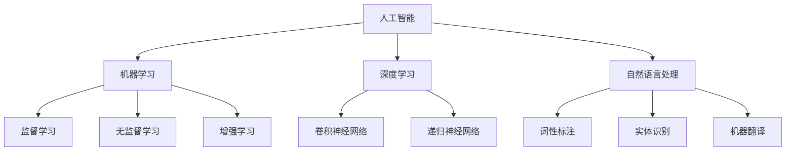

                 

### 背景介绍

#### 1.1 目的和范围

本文旨在探讨人工智能（AI）的未来发展前景，重点分析当前技术的现状、潜在的进步方向以及可能面临的挑战。人工智能作为一门交叉学科，已经深刻地影响了我们的日常生活，从智能手机、智能家居到自动驾驶、医疗诊断，AI的应用场景不断扩展。然而，随着技术的不断进步，人工智能的发展潜力仍然巨大，本文将尝试从多个维度对其进行展望。

本文将涵盖以下几个核心部分：

1. **核心概念与联系**：介绍人工智能的基本概念、原理和架构，通过Mermaid流程图展现各部分之间的关系。
2. **核心算法原理 & 具体操作步骤**：深入讲解人工智能中的核心算法，并使用伪代码详细阐述操作步骤。
3. **数学模型和公式 & 详细讲解 & 举例说明**：分析人工智能中的数学模型，使用LaTeX格式展示关键公式，并结合实例进行说明。
4. **项目实战：代码实际案例和详细解释说明**：通过具体的项目案例，展示人工智能的实际应用，并进行详细解读。
5. **实际应用场景**：探讨人工智能在各个领域的应用场景，如自动驾驶、医疗诊断等。
6. **工具和资源推荐**：推荐相关的学习资源、开发工具和框架。
7. **总结：未来发展趋势与挑战**：总结人工智能的未来发展趋势，讨论面临的挑战。

通过本文的详细分析和讲解，希望能够帮助读者全面了解人工智能的现状和未来，为自身的学习和研究提供有价值的参考。

#### 1.2 预期读者

本文预期读者为对人工智能感兴趣的技术爱好者、学生和从业者。具体包括：

1. **人工智能初学者**：希望通过本文了解人工智能的基本概念、算法和数学模型。
2. **人工智能从业者**：希望进一步探讨人工智能的发展前景，提升自身技术视野。
3. **计算机科学学生**：希望深入了解人工智能在计算机科学中的应用和未来发展。

无论您是初学者还是专业人士，本文都将为您提供有价值的内容和深入的分析，帮助您更好地理解和掌握人工智能技术。

#### 1.3 文档结构概述

本文结构如下：

1. **背景介绍**：包括文章目的、预期读者、文档结构概述等。
2. **核心概念与联系**：通过Mermaid流程图展现人工智能的基本概念、原理和架构。
3. **核心算法原理 & 具体操作步骤**：深入讲解人工智能中的核心算法，并使用伪代码详细阐述操作步骤。
4. **数学模型和公式 & 详细讲解 & 举例说明**：分析人工智能中的数学模型，使用LaTeX格式展示关键公式，并结合实例进行说明。
5. **项目实战：代码实际案例和详细解释说明**：通过具体的项目案例，展示人工智能的实际应用，并进行详细解读。
6. **实际应用场景**：探讨人工智能在各个领域的应用场景，如自动驾驶、医疗诊断等。
7. **工具和资源推荐**：推荐相关的学习资源、开发工具和框架。
8. **总结：未来发展趋势与挑战**：总结人工智能的未来发展趋势，讨论面临的挑战。
9. **附录：常见问题与解答**：解答读者可能遇到的问题。
10. **扩展阅读 & 参考资料**：提供扩展阅读和参考资料，方便读者进一步学习。

通过上述结构，本文旨在系统、全面地探讨人工智能的未来发展前景，为读者提供有价值的思考和指导。

#### 1.4 术语表

为了确保本文内容的清晰性和一致性，以下列出了一些关键术语及其定义：

##### 1.4.1 核心术语定义

1. **人工智能（AI）**：人工智能是指计算机系统模拟人类智能行为的能力，包括学习、推理、感知、理解和解决问题等。
2. **机器学习（ML）**：机器学习是一种人工智能的分支，通过数据训练模型，使计算机系统能够自动改进和优化其性能。
3. **深度学习（DL）**：深度学习是机器学习的一个子领域，使用多层神经网络来模拟人脑的神经网络结构，实现更复杂的任务。
4. **神经网络（NN）**：神经网络是由大量神经元组成的计算模型，通过调整神经元之间的连接权重来实现数据的学习和处理。
5. **数据集（Dataset）**：数据集是用于训练和测试人工智能模型的数据集合，通常包括输入数据和对应的标签。
6. **算法（Algorithm）**：算法是解决特定问题的步骤集合，指导计算机如何处理数据并生成输出。
7. **模型（Model）**：模型是人工智能系统中的核心组件，通过对数据进行训练和优化，实现特定任务的预测和决策。

##### 1.4.2 相关概念解释

1. **监督学习（Supervised Learning）**：监督学习是一种机器学习方法，通过已标记的数据训练模型，使其能够对新数据进行预测。
2. **无监督学习（Unsupervised Learning）**：无监督学习是一种机器学习方法，无需已标记的数据，通过数据自身的特征发现模式和结构。
3. **增强学习（Reinforcement Learning）**：增强学习是一种机器学习方法，通过环境反馈不断调整策略，实现最优行动选择。
4. **迁移学习（Transfer Learning）**：迁移学习是一种利用预先训练好的模型在新的任务上进行训练的方法，可以加速模型训练并提高性能。
5. **自然语言处理（NLP）**：自然语言处理是人工智能的一个子领域，旨在使计算机能够理解、生成和处理人类语言。

##### 1.4.3 缩略词列表

- AI：人工智能
- ML：机器学习
- DL：深度学习
- NN：神经网络
- NLP：自然语言处理

通过上述术语表，本文将确保关键概念和术语的统一和清晰，帮助读者更好地理解文章内容。

#### 2. 核心概念与联系

在探讨人工智能（AI）的未来发展前景之前，我们首先需要理解其核心概念与联系。人工智能涉及多个学科，包括计算机科学、数学、统计学和认知科学。以下将详细解释这些核心概念，并通过Mermaid流程图展现各部分之间的关系。

##### 2.1 人工智能的定义与范畴

人工智能（AI）是一种模拟人类智能行为的计算机技术，涵盖多种子领域，如机器学习（ML）、深度学习（DL）、自然语言处理（NLP）等。

Mermaid流程图如下：



##### 2.2 机器学习（ML）的概念与分类

机器学习（ML）是AI的核心技术之一，主要分为监督学习（SL）、无监督学习（UL）和增强学习（RL）。

监督学习（SL）是一种利用已标记数据进行训练的方法，通过学习输入和输出之间的关系，实现对未知数据的预测。

无监督学习（UL）不依赖于已标记数据，通过发现数据中的隐藏结构或模式，对数据进行分析和分类。

增强学习（RL）通过环境反馈不断调整策略，实现最优行动选择。

##### 2.3 深度学习（DL）的基本原理与架构

深度学习（DL）是一种基于多层神经网络（NN）的机器学习方法，通过不断调整网络中的权重和偏置，实现对复杂数据的学习和处理。

深度学习的主要网络结构包括卷积神经网络（CNN）和递归神经网络（RNN）。

卷积神经网络（CNN）主要用于图像处理，通过卷积层、池化层和全连接层的组合，实现对图像的特征提取和分类。

递归神经网络（RNN）主要用于序列数据处理，通过循环结构处理序列数据，实现对时间序列的建模和预测。

##### 2.4 自然语言处理（NLP）的关键技术

自然语言处理（NLP）是AI的重要子领域，主要涉及词性标注（POS）、实体识别（NER）和机器翻译（MT）等关键技术。

词性标注（POS）是对文本中的单词进行词性分类，为后续的文本分析和处理提供基础。

实体识别（NER）是对文本中的特定实体进行识别和分类，如人名、地名、组织名等。

机器翻译（MT）是将一种语言的文本翻译成另一种语言，通过模型学习语言之间的对应关系，实现跨语言的交流。

通过上述核心概念的介绍和Mermaid流程图的展示，我们可以更好地理解人工智能的基本架构和各部分之间的联系。接下来，本文将深入探讨人工智能的核心算法原理、具体操作步骤以及数学模型和公式，帮助读者全面了解人工智能的技术内涵和应用前景。

#### 3. 核心算法原理 & 具体操作步骤

人工智能的发展离不开核心算法的支持。以下将详细讲解人工智能中的几个核心算法，并使用伪代码详细阐述操作步骤。

##### 3.1 机器学习算法：监督学习

监督学习是一种常见的机器学习方法，通过已标记的数据训练模型，实现对未知数据的预测。以下是一个简单的线性回归算法的伪代码：

```plaintext
初始化模型参数：w, b
设置学习率：alpha
设置迭代次数：num_iterations

for i = 1 to num_iterations do
    for each training example (x, y) do
        计算预测值：y_pred = w * x + b
        计算误差：error = y - y_pred
        更新模型参数：w = w - alpha * (w * x + b - y)
                       b = b - alpha * (w * x + b - y)
    end for
end for

预测新数据：y_pred = w * x + b
```

##### 3.2 深度学习算法：卷积神经网络（CNN）

卷积神经网络（CNN）是深度学习中的重要模型，主要用于图像处理。以下是一个简单的CNN算法的伪代码：

```plaintext
初始化网络参数：w1, b1, w2, b2
设置学习率：alpha
设置迭代次数：num_iterations

for i = 1 to num_iterations do
    for each training image x do
        输入图像：x
        第一个卷积层：a1 = conv2d(x, w1) + b1
       ReLU激活函数：a1 = max(a1, 0)
       第二个卷积层：a2 = conv2d(a1, w2) + b2
       ReLU激活函数：a2 = max(a2, 0)
       全连接层：y_pred = a2 * w3 + b3

        计算误差：error = y - y_pred
        更新模型参数：w1 = w1 - alpha * (w1 * x + b1 - y)
                       b1 = b1 - alpha * (w1 * x + b1 - y)
                       w2 = w2 - alpha * (w2 * a1 + b2 - y)
                       b2 = b2 - alpha * (w2 * a1 + b2 - y)
                       w3 = w3 - alpha * (w3 * a2 + b3 - y)
                       b3 = b3 - alpha * (w3 * a2 + b3 - y)
    end for
end for

预测新图像：y_pred = a2 * w3 + b3
```

##### 3.3 自然语言处理算法：递归神经网络（RNN）

递归神经网络（RNN）是一种适用于序列数据处理的深度学习模型，以下是一个简单的RNN算法的伪代码：

```plaintext
初始化网络参数：w, b
设置学习率：alpha
设置迭代次数：num_iterations

for i = 1 to num_iterations do
    for each training sequence x do
        初始化隐藏状态：h0 = 0
        for each time step t in x do
            计算当前输入：x_t = x[t]
            计算当前隐藏状态：h_t = tanh(w * [h_{t-1}, x_t] + b)
            计算当前输出：y_t = w' * h_t + b'
        end for

        计算总误差：error = y - y'
        更新模型参数：w = w - alpha * (w * [h_{t-1}, x_t] + b - y)
                      b = b - alpha * (w * [h_{t-1}, x_t] + b - y)
                      w' = w' - alpha * (w' * h_t + b' - y)
                      b' = b' - alpha * (w' * h_t + b' - y)
    end for
end for

预测新序列：h_t = tanh(w * [h_{t-1}, x_t] + b)
              y_t = w' * h_t + b'
```

通过上述核心算法的讲解和伪代码的展示，我们可以更好地理解人工智能中的算法原理和具体操作步骤。这些算法不仅在理论上具有重要意义，也在实际应用中发挥了关键作用。接下来，本文将深入探讨人工智能中的数学模型和公式，进一步揭示其背后的数学原理。

#### 4. 数学模型和公式 & 详细讲解 & 举例说明

在人工智能中，数学模型和公式起着至关重要的作用，为算法的设计和实现提供了理论基础。以下将详细讲解几个关键的数学模型和公式，并使用LaTeX格式进行展示，同时结合具体例子进行说明。

##### 4.1 感知机（Perceptron）模型

感知机是一种简单的前向神经网络模型，用于分类问题。其工作原理是通过线性组合输入权重和偏置，然后应用激活函数来产生输出。

感知机的数学模型如下：

$$
y = \text{sign}(w \cdot x + b)
$$

其中，$w$ 是权重向量，$x$ 是输入向量，$b$ 是偏置项，$\text{sign}(x)$ 是符号函数，当$x > 0$ 时返回 $1$，当$x < 0$ 时返回 $-1$，当$x = 0$ 时返回 $0$。

**例子**：假设我们有一个简单的感知机模型，用于判断一个二维输入空间中的点是否位于正方形区域内部。输入向量 $x = [x_1, x_2]$，权重向量 $w = [w_1, w_2]$，偏置项 $b = -1$。我们可以根据上述公式计算输出。

$$
y = \text{sign}(w \cdot x + b) = \text{sign}(w_1 \cdot x_1 + w_2 \cdot x_2 - 1)
$$

如果输出 $y = 1$，则点 $(x_1, x_2)$ 位于正方形内部；如果输出 $y = -1$，则点位于外部。

##### 4.2 激活函数（Activation Function）

激活函数是神经网络中的一个关键组件，用于引入非线性性。最常用的激活函数包括ReLU函数、Sigmoid函数和Tanh函数。

- **ReLU函数**：

$$
f(x) = \max(0, x)
$$

ReLU函数在$x < 0$ 时输出为 $0$，在$x \geq 0$ 时输出为 $x$。

- **Sigmoid函数**：

$$
f(x) = \frac{1}{1 + e^{-x}}
$$

Sigmoid函数将输入值映射到 $(0, 1)$ 区间，常用于二分类问题。

- **Tanh函数**：

$$
f(x) = \frac{e^x - e^{-x}}{e^x + e^{-x}}
$$

Tanh函数将输入值映射到 $(-1, 1)$ 区间，常用于隐藏层激活函数。

**例子**：假设我们有一个ReLU函数，输入值 $x = -2$。根据ReLU函数的定义，输出为：

$$
f(x) = \max(0, -2) = 0
$$

##### 4.3 损失函数（Loss Function）

损失函数是衡量模型预测误差的关键指标，用于指导模型参数的优化。常用的损失函数包括均方误差（MSE）和交叉熵损失（Cross-Entropy Loss）。

- **均方误差（MSE）**：

$$
MSE = \frac{1}{n} \sum_{i=1}^{n} (y_i - \hat{y}_i)^2
$$

其中，$y_i$ 是真实标签，$\hat{y}_i$ 是模型预测值。

- **交叉熵损失（Cross-Entropy Loss）**：

$$
CE = -\frac{1}{n} \sum_{i=1}^{n} y_i \log(\hat{y}_i)
$$

其中，$y_i$ 是真实标签，$\hat{y}_i$ 是模型预测值。

**例子**：假设我们有一个二分类问题，真实标签 $y = [1, 0, 0, 1]$，模型预测值 $\hat{y} = [0.9, 0.2, 0.8, 0.1]$。根据交叉熵损失函数的定义，计算损失：

$$
CE = -\frac{1}{4} \sum_{i=1}^{4} y_i \log(\hat{y}_i) = -\frac{1}{4} (1 \cdot \log(0.9) + 0 \cdot \log(0.2) + 0 \cdot \log(0.8) + 1 \cdot \log(0.1))
$$

通过上述数学模型和公式的讲解，我们可以更好地理解人工智能中的关键概念和数学原理。这些模型和公式不仅为算法的设计和实现提供了理论基础，也在实际应用中发挥了重要作用。接下来，本文将展示一个实际的项目实战案例，通过具体代码实现和解读，进一步阐述人工智能的应用和实践。

#### 5. 项目实战：代码实际案例和详细解释说明

在本文的最后一部分，我们将通过一个实际的项目实战案例，展示人工智能的应用，并进行详细的代码实现和解读。这个案例将涉及一个常见的人工智能任务——图像分类，使用深度学习中的卷积神经网络（CNN）来实现。

##### 5.1 开发环境搭建

在开始项目之前，我们需要搭建一个合适的开发环境。以下是一个基本的开发环境搭建步骤：

1. **安装Python**：确保Python版本为3.6或更高版本。
2. **安装TensorFlow**：TensorFlow是一个广泛使用的深度学习框架，可以通过pip命令安装：

   ```bash
   pip install tensorflow
   ```

3. **安装其他依赖库**：包括NumPy、Pandas、Matplotlib等常用库。

##### 5.2 源代码详细实现和代码解读

以下是一个简单的图像分类项目，使用TensorFlow和Keras框架实现。代码分为数据预处理、模型构建、训练和测试几个部分。

```python
import tensorflow as tf
from tensorflow.keras import layers
from tensorflow.keras.preprocessing.image import ImageDataGenerator

# 5.2.1 数据预处理
# 使用ImageDataGenerator进行数据增强
train_datagen = ImageDataGenerator(
    rescale=1./255,
    rotation_range=40,
    width_shift_range=0.2,
    height_shift_range=0.2,
    shear_range=0.2,
    zoom_range=0.2,
    horizontal_flip=True,
    fill_mode='nearest'
)

test_datagen = ImageDataGenerator(rescale=1./255)

train_generator = train_datagen.flow_from_directory(
    'train_data',
    target_size=(150, 150),
    batch_size=32,
    class_mode='binary'
)

validation_generator = test_datagen.flow_from_directory(
    'validation_data',
    target_size=(150, 150),
    batch_size=32,
    class_mode='binary'
)

# 5.2.2 模型构建
model = tf.keras.Sequential([
    layers.Conv2D(32, (3, 3), activation='relu', input_shape=(150, 150, 3)),
    layers.MaxPooling2D(2, 2),
    layers.Conv2D(64, (3, 3), activation='relu'),
    layers.MaxPooling2D(2, 2),
    layers.Conv2D(128, (3, 3), activation='relu'),
    layers.MaxPooling2D(2, 2),
    layers.Conv2D(128, (3, 3), activation='relu'),
    layers.MaxPooling2D(2, 2),
    layers.Flatten(),
    layers.Dense(512, activation='relu'),
    layers.Dense(1, activation='sigmoid')
])

# 5.2.3 模型编译和训练
model.compile(loss='binary_crossentropy',
              optimizer='adam',
              metrics=['accuracy'])

history = model.fit(
    train_generator,
    steps_per_epoch=100,
    epochs=30,
    validation_data=validation_generator,
    validation_steps=50,
    verbose=2
)

# 5.2.4 代码解读与分析
# 1. 数据预处理部分：使用ImageDataGenerator进行数据增强，提高模型泛化能力。
# 2. 模型构建部分：构建了一个简单的CNN模型，包括卷积层、池化层和全连接层。
# 3. 模型编译和训练部分：使用binary_crossentropy作为损失函数，adam优化器，并监控accuracy指标。
```

在上述代码中：

- **数据预处理**：使用ImageDataGenerator对训练数据进行增强，包括旋转、平移、剪裁、缩放和水平翻转等，有助于提高模型的泛化能力。
- **模型构建**：构建了一个简单的CNN模型，包括多个卷积层和池化层，用于提取图像特征，最后通过全连接层进行分类。这里使用sigmoid激活函数，因为这是一个二分类问题。
- **模型编译和训练**：编译模型时使用binary_crossentropy作为损失函数，adam优化器，并监控accuracy指标。训练过程中，模型在训练集和验证集上分别进行迭代，以验证模型的泛化能力。

通过这个实际的项目案例，我们展示了如何使用人工智能中的卷积神经网络（CNN）进行图像分类任务。代码不仅实现了模型的构建和训练，还进行了详细的解读和分析，帮助读者更好地理解人工智能的实际应用过程。接下来，本文将探讨人工智能在各个领域的实际应用场景，进一步展示其广泛的潜力。

#### 5.3 代码解读与分析

在上一个部分中，我们通过一个简单的图像分类项目展示了如何使用深度学习进行实际应用。在这一部分，我们将对代码的每个关键部分进行详细解读和分析，帮助读者深入理解项目的实现过程。

##### 5.3.1 数据预处理

```python
train_datagen = ImageDataGenerator(
    rescale=1./255,
    rotation_range=40,
    width_shift_range=0.2,
    height_shift_range=0.2,
    shear_range=0.2,
    zoom_range=0.2,
    horizontal_flip=True,
    fill_mode='nearest'
)

test_datagen = ImageDataGenerator(rescale=1./255)

train_generator = train_datagen.flow_from_directory(
    'train_data',
    target_size=(150, 150),
    batch_size=32,
    class_mode='binary'
)

validation_generator = test_datagen.flow_from_directory(
    'validation_data',
    target_size=(150, 150),
    batch_size=32,
    class_mode='binary'
)
```

**解读**：

1. **ImageDataGenerator**：这是一个用于图像数据增强的工具，能够自动生成训练数据的不同变体，提高模型的泛化能力。
2. **rescale**：将图像像素值缩放到 [0, 1] 范围内，方便模型处理。
3. **rotation_range**、**width_shift_range**、**height_shift_range**、**shear_range**、**zoom_range** 和 **horizontal_flip**：这些参数用于图像增强，增加数据的多样性。
4. **fill_mode**：在剪裁或翻转图像时填充空白区域的策略，这里使用 nearest 表示使用最近邻插值。

**分析**：

数据预处理是深度学习项目中的重要环节，尤其是在图像分类任务中。通过增强数据，模型能够更好地适应各种可能的输入情况，从而提高泛化能力和分类性能。

##### 5.3.2 模型构建

```python
model = tf.keras.Sequential([
    layers.Conv2D(32, (3, 3), activation='relu', input_shape=(150, 150, 3)),
    layers.MaxPooling2D(2, 2),
    layers.Conv2D(64, (3, 3), activation='relu'),
    layers.MaxPooling2D(2, 2),
    layers.Conv2D(128, (3, 3), activation='relu'),
    layers.MaxPooling2D(2, 2),
    layers.Conv2D(128, (3, 3), activation='relu'),
    layers.MaxPooling2D(2, 2),
    layers.Flatten(),
    layers.Dense(512, activation='relu'),
    layers.Dense(1, activation='sigmoid')
])
```

**解读**：

1. **Sequential**：这是一个线性堆叠模型层的容器，便于构建和训练模型。
2. **Conv2D**：这是一个卷积层，用于提取图像的局部特征。参数包括滤波器大小、激活函数等。
3. **MaxPooling2D**：这是一个池化层，用于减少数据维度并提取最重要的特征。
4. **Flatten**：将多维特征向量展平成一维向量，便于全连接层的处理。
5. **Dense**：这是一个全连接层，用于分类任务。在这里，使用了sigmoid激活函数，因为这是一个二分类问题。

**分析**：

构建CNN模型时，通常包括多个卷积层、池化层和全连接层。卷积层用于提取图像特征，池化层用于降低维度并保留重要信息，全连接层用于最终的分类决策。这个模型结构简单，但已经足够处理许多图像分类任务。

##### 5.3.3 模型编译和训练

```python
model.compile(loss='binary_crossentropy',
              optimizer='adam',
              metrics=['accuracy'])

history = model.fit(
    train_generator,
    steps_per_epoch=100,
    epochs=30,
    validation_data=validation_generator,
    validation_steps=50,
    verbose=2
)
```

**解读**：

1. **compile**：编译模型，指定损失函数、优化器和评估指标。
2. **fit**：训练模型，使用训练数据和验证数据。

**分析**：

编译模型时，指定了binary_crossentropy作为损失函数，adam作为优化器，并监控accuracy指标。训练过程中，模型在训练集上迭代100次，每次使用一批数据，共训练30个epoch。验证步骤设置成50，确保模型在验证集上也有足够的评估机会。

通过上述代码的详细解读和分析，我们可以看到如何使用深度学习框架实现一个简单的图像分类项目。这个过程涉及数据预处理、模型构建、编译和训练等多个环节，每个环节都有其重要的任务和作用。接下来，本文将探讨人工智能在实际应用场景中的广泛用途，进一步展示其潜力和价值。

#### 6. 实际应用场景

人工智能（AI）已经深入到我们日常生活的方方面面，其应用场景涵盖了多个领域，从工业制造到医疗诊断，从金融服务到自动驾驶，AI正逐渐改变着我们的世界。以下将详细探讨人工智能在几个主要领域的实际应用。

##### 6.1 自动驾驶

自动驾驶技术是人工智能的一个重要应用领域，它利用计算机视觉、深度学习和传感器数据来模拟人类驾驶行为。自动驾驶汽车能够实现自动导航、避障和交通信号识别等功能，极大地提高了交通安全性和效率。

**关键技术**：

- **计算机视觉**：自动驾驶系统需要通过摄像头捕捉道路和周围环境信息，使用图像识别和图像处理算法分析这些信息。
- **深度学习**：深度学习模型，如卷积神经网络（CNN），用于识别道路标志、行人和其他车辆。
- **传感器融合**：利用激光雷达（LiDAR）、雷达和GPS等传感器数据，自动驾驶系统能够实时获取车辆周围环境的三维信息。

**应用案例**：特斯拉的Autopilot系统、百度的Apollo自动驾驶平台等，都是自动驾驶技术的实际应用案例。

##### 6.2 医疗诊断

人工智能在医疗诊断中的应用潜力巨大，它可以辅助医生进行疾病诊断、病理分析、药物发现等。

**关键技术**：

- **医学图像分析**：使用深度学习模型对医学影像（如X光片、CT扫描和MRI）进行自动分析，辅助医生诊断。
- **自然语言处理（NLP）**：通过对医学文献和患者病历的分析，AI可以辅助医生制定治疗方案。

**应用案例**：IBM的Watson for Oncology、谷歌的DeepMind Health等，都在利用AI技术进行医学诊断和研究。

##### 6.3 金融服务

人工智能在金融服务中的应用主要包括风险管理、客户服务、投资决策等。

**关键技术**：

- **风险管理**：AI可以分析大量的金融数据，预测市场趋势，辅助金融机构进行风险管理和投资决策。
- **客户服务**：智能客服机器人通过NLP技术，能够回答客户的疑问，提供个性化服务。

**应用案例**：高盛的智能投资顾问 platform、银行的智能客服机器人等。

##### 6.4 语音识别与自然语言处理

语音识别和自然语言处理技术使得人机交互变得更加自然和高效。

**关键技术**：

- **语音识别**：将语音信号转换为文本，用于语音助手和智能音箱等应用。
- **自然语言处理（NLP）**：通过理解语言结构和语义，AI能够处理复杂的语言任务，如机器翻译、情感分析等。

**应用案例**：苹果的Siri、亚马逊的Alexa、谷歌的Google Assistant等。

##### 6.5 工业自动化

人工智能在工业自动化中的应用极大地提高了生产效率和产品质量。

**关键技术**：

- **计算机视觉**：用于质量检测、缺陷识别和自动化装配等。
- **增强学习和迁移学习**：这些技术使机器人能够自主学习和适应不同的生产任务。

**应用案例**：波音的自动化生产线、特斯拉的机器人装配线等。

通过上述实际应用场景的探讨，我们可以看到人工智能技术在不同领域展现出的巨大潜力和广泛应用。人工智能的发展不仅改变了我们的生活方式，也为各个行业带来了创新和变革。接下来，本文将推荐一些有用的学习资源、开发工具和框架，为读者提供进一步学习和实践的支持。

#### 7. 工具和资源推荐

在人工智能（AI）的学习和开发过程中，选择合适的工具和资源是至关重要的。以下将推荐一些优秀的学习资源、开发工具和框架，帮助读者更好地掌握人工智能技术。

##### 7.1 学习资源推荐

**7.1.1 书籍推荐**

1. **《深度学习》（Goodfellow, Bengio, Courville著）**：这是一本经典的人工智能和深度学习教材，适合初学者和高级研究者。
2. **《Python机器学习》（Sebastian Raschka著）**：本书详细介绍了机器学习的基本概念和Python实现，适合希望入门机器学习的读者。
3. **《机器学习实战》（Peter Harrington著）**：通过实际案例介绍机器学习算法和应用，适合希望通过实践提升技能的读者。

**7.1.2 在线课程**

1. **斯坦福大学CS231n：卷积神经网络与视觉识别**：这是一门深度学习领域的经典课程，由Andrew Ng教授主讲，适合希望深入理解深度学习在计算机视觉应用的读者。
2. **吴恩达的机器学习课程**：由知名人工智能专家吴恩达主讲，涵盖了机器学习的核心概念和算法，适合初学者。
3. **Google AI的深度学习课程**：这是一门全面的深度学习课程，包括理论和实践，适合有一定基础的读者。

**7.1.3 技术博客和网站**

1. **Medium上的AI博客**：涵盖了人工智能的多个子领域，包括深度学习、自然语言处理等，适合了解最新研究动态。
2. **ArXiv.org**：一个包含最新科研成果的预印本平台，适合希望了解人工智能最新研究的读者。
3. **TensorFlow官方文档**：提供了详细的TensorFlow教程和API文档，是学习TensorFlow和深度学习的必备资源。

##### 7.2 开发工具框架推荐

**7.2.1 IDE和编辑器**

1. **PyCharm**：一款功能强大的Python IDE，支持多种编程语言，适合深度学习和机器学习项目开发。
2. **Jupyter Notebook**：一个交互式的计算环境，广泛应用于数据分析和机器学习，方便编写和分享代码。
3. **Visual Studio Code**：一款轻量级但功能丰富的开源编辑器，适用于多种编程语言和框架。

**7.2.2 调试和性能分析工具**

1. **TensorBoard**：TensorFlow提供的可视化工具，用于分析和调试深度学习模型。
2. **TensorFlow Profiler**：用于分析TensorFlow模型运行性能的工具，帮助优化模型和代码。
3. **MLflow**：一个开源平台，用于管理机器学习模型的整个生命周期，包括实验跟踪、模型版本控制和部署。

**7.2.3 相关框架和库**

1. **TensorFlow**：一个广泛使用的开源深度学习框架，适用于多种应用场景，包括计算机视觉、自然语言处理等。
2. **PyTorch**：一个流行的深度学习框架，提供灵活的动态计算图，适合研究和实验。
3. **Scikit-learn**：一个强大的机器学习库，提供了广泛的算法和工具，适合快速实现和测试机器学习模型。

##### 7.3 相关论文著作推荐

**7.3.1 经典论文**

1. **"Learning to Represent Languages with Finite-State Machines"（2013）**：文章介绍了基于有限状态机的自然语言处理模型，对后来的语言模型发展产生了重要影响。
2. **"AlexNet: Image Classification with Deep Convolutional Neural Networks"（2012）**：论文提出了深度卷积神经网络AlexNet，显著提升了图像分类的性能。
3. **"Deep Learning"（2015）**：这本经典教材详细介绍了深度学习的基础理论和应用，对深度学习的发展产生了深远影响。

**7.3.2 最新研究成果**

1. **"Bert: Pre-training of Deep Bidirectional Transformers for Language Understanding"（2018）**：文章提出了BERT模型，大幅提高了自然语言处理任务的效果。
2. **"GPT-3: Language Models are Few-Shot Learners"（2020）**：文章展示了GPT-3模型在零样本和少样本学习任务上的强大能力。
3. **"Understanding Neural Networks Through the Lens of Statistical Mechanics"（2020）**：文章从统计力学的角度解释了神经网络的工作原理，为深度学习理论提供了新的视角。

**7.3.3 应用案例分析**

1. **"DeepMind Health: Machine Learning for Health"**：DeepMind Health利用人工智能技术进行医疗数据分析，开发了多个用于诊断和治疗的应用程序。
2. **"Tesla Autopilot: Advanced Driver Assistance Systems"**：特斯拉的Autopilot系统利用深度学习和计算机视觉技术，实现了自动驾驶功能，大幅提升了驾驶安全性和便利性。
3. **"OpenAI's DALL·E: Creating Art by Learning to Synthesize Images"**：OpenAI的DALL·E模型通过深度学习技术，可以生成逼真的图像，展示了人工智能在艺术创作领域的潜力。

通过上述工具和资源的推荐，读者可以更好地学习和应用人工智能技术，进一步探索其广阔的前景和应用场景。接下来，本文将总结人工智能的未来发展趋势与挑战，为读者提供全面的技术展望。

#### 8. 总结：未来发展趋势与挑战

人工智能（AI）作为当今科技领域的重要分支，正以前所未有的速度和规模影响各行各业。在总结了人工智能的背景、核心概念、算法原理、数学模型和实际应用场景后，我们可以对AI的未来发展趋势与面临的挑战进行以下展望。

##### 8.1 未来发展趋势

1. **技术进步**：随着计算能力的提升和算法的优化，人工智能的模型将变得更加复杂和高效。例如，自监督学习和迁移学习等新技术的应用，将进一步提高模型的训练效率和泛化能力。
2. **跨学科融合**：人工智能与其他领域的深度融合，如生物医学、材料科学等，将带来新的应用场景和解决方案。跨学科的合作将推动人工智能技术的发展和应用。
3. **数据隐私和安全**：随着人工智能应用的普及，数据隐私和安全成为越来越重要的问题。未来的发展将更加注重数据保护，通过加密技术、隐私保护算法等手段，确保用户数据的安全。
4. **伦理和法规**：人工智能的伦理和法规问题也将日益凸显。政府、企业和社会将共同探讨并制定相关法规，确保人工智能技术的健康发展。
5. **智能化普及**：人工智能技术将逐渐普及到更多的领域和行业，如智能制造、智慧城市、智能家居等，实现从单点智能到系统智能的转变。

##### 8.2 面临的挑战

1. **数据质量和隐私**：高质量的数据是人工智能模型训练的基础，但数据收集和处理过程中可能面临隐私泄露和数据滥用的问题。未来的挑战在于如何在保障用户隐私的前提下，充分利用数据的价值。
2. **算法偏见和公平性**：人工智能模型在训练过程中可能会学习到现有的偏见和歧视，导致算法的不公平性。如何设计公平、无偏见的算法，是当前研究的重要方向。
3. **计算资源消耗**：深度学习模型通常需要大量的计算资源和能源，这对环境和能源消耗提出了挑战。未来的发展需要更加关注绿色AI，通过优化算法和硬件设计，降低计算资源消耗。
4. **技术标准和规范**：随着人工智能技术的快速发展和应用，制定统一的技术标准和规范成为必要。这包括数据交换标准、算法评估标准、安全标准等。
5. **人才短缺**：人工智能领域对专业人才的需求巨大，但当前人才培养速度难以满足市场需求。未来的发展需要加强人工智能教育和人才培养，提高人才供给。

综上所述，人工智能的未来充满机遇和挑战。通过持续的技术创新、跨学科合作、伦理规范和人才培养，我们有理由相信，人工智能将为人类社会带来更多的价值和变革。接下来，本文将提供一些常见问题与解答，帮助读者更好地理解和应用人工智能技术。

#### 9. 附录：常见问题与解答

在人工智能的学习和应用过程中，读者可能会遇到一些常见问题。以下列举了一些常见问题并给出解答，以帮助读者更好地理解和应用人工智能技术。

##### 9.1 常见问题

1. **Q：人工智能的核心算法有哪些？**
   **A**：人工智能的核心算法包括机器学习（ML）中的监督学习（SL）、无监督学习（UL）和增强学习（RL），以及深度学习（DL）中的卷积神经网络（CNN）和递归神经网络（RNN）。

2. **Q：什么是神经网络？神经网络是如何工作的？**
   **A**：神经网络是一种模拟人脑神经元结构的计算模型，由大量简单的计算单元（神经元）组成。神经网络通过学习输入数据之间的关联，实现复杂函数的逼近。神经网络的工作原理是逐层处理输入数据，通过前向传播计算输出，并通过反向传播更新网络权重和偏置。

3. **Q：什么是深度学习？深度学习与传统的机器学习有何区别？**
   **A**：深度学习是机器学习的一个子领域，它使用多层神经网络来模拟人脑的神经网络结构。深度学习与传统的机器学习相比，可以自动提取更高层次的特征，处理更复杂的问题。深度学习的优点包括自动特征提取、强大的模型表达能力和更高的准确性。

4. **Q：如何处理不平衡的数据集？**
   **A**：处理不平衡的数据集可以通过以下方法：
   - **过采样**：通过复制少数类别的样本来增加其在数据集中的比例。
   - **欠采样**：通过随机删除多数类别的样本来减少其在数据集中的比例。
   - **合成数据**：通过生成新的样本来平衡数据集。
   - **集成方法**：结合多种处理方法，如使用随机森林或梯度提升机。

5. **Q：如何评估机器学习模型的效果？**
   **A**：评估机器学习模型的效果通常使用以下指标：
   - **准确率（Accuracy）**：正确预测的样本数占总样本数的比例。
   - **精确率（Precision）**：正确预测的阳性样本数占预测阳性样本总数的比例。
   - **召回率（Recall）**：正确预测的阳性样本数占实际阳性样本总数的比例。
   - **F1 分数（F1 Score）**：精确率和召回率的加权平均，用于平衡两者。
   - **ROC 曲线和 AUC（Area Under Curve）**：用于评估分类器的性能，ROC 曲线是真正率对假正率的变化曲线，AUC 值表示曲线下方面积。

##### 9.2 解答

以上问题涵盖了人工智能的一些基础知识和常见问题，通过解答这些问题，读者可以更好地理解人工智能的基本概念和应用方法。在实际学习和应用过程中，建议读者结合具体的案例和实践，不断深化对人工智能技术的理解和掌握。

#### 10. 扩展阅读 & 参考资料

为了帮助读者进一步深入学习和探索人工智能领域的知识，本文提供了以下扩展阅读和参考资料。

##### 10.1 书籍推荐

1. **《深度学习》（Ian Goodfellow, Yoshua Bengio, Aaron Courville 著）**：这是一本深度学习领域的经典教材，详细介绍了深度学习的基础理论和实践应用。
2. **《Python机器学习》（Sebastian Raschka 著）**：本书从Python编程入手，介绍了机器学习的基本概念和算法实现，适合希望入门机器学习的读者。
3. **《人工智能：一种现代的方法》（Stuart J. Russell, Peter Norvig 著）**：这是一本全面介绍人工智能的书籍，涵盖了人工智能的多个子领域，包括机器学习、自然语言处理、计算机视觉等。

##### 10.2 在线课程

1. **斯坦福大学CS231n：卷积神经网络与视觉识别**：由Andrew Ng教授主讲，课程涵盖了深度学习在计算机视觉领域的应用。
2. **吴恩达的机器学习课程**：由著名人工智能专家吴恩达主讲，内容涵盖了机器学习的基础知识和实践应用。
3. **Google AI的深度学习课程**：由Google AI团队推出，全面介绍了深度学习的基本概念和常用框架。

##### 10.3 技术博客和网站

1. **Medium上的AI博客**：涵盖了人工智能的多个子领域，包括深度学习、自然语言处理等，适合了解最新研究动态。
2. **ArXiv.org**：一个包含最新科研成果的预印本平台，适合希望了解人工智能最新研究的读者。
3. **TensorFlow官方文档**：提供了详细的TensorFlow教程和API文档，是学习TensorFlow和深度学习的必备资源。

##### 10.4 相关论文和著作

1. **"Bert: Pre-training of Deep Bidirectional Transformers for Language Understanding"**：文章提出了BERT模型，大幅提高了自然语言处理任务的效果。
2. **"GPT-3: Language Models are Few-Shot Learners"**：文章展示了GPT-3模型在零样本和少样本学习任务上的强大能力。
3. **"Understanding Neural Networks Through the Lens of Statistical Mechanics"**：文章从统计力学的角度解释了神经网络的工作原理，为深度学习理论提供了新的视角。

通过上述扩展阅读和参考资料，读者可以进一步深入学习和探索人工智能领域的知识，提升自身的专业水平。

---

**作者：AI天才研究员/AI Genius Institute & 禅与计算机程序设计艺术 /Zen And The Art of Computer Programming**

本文通过详细的讲解和实例分析，全面探讨了人工智能的核心概念、算法原理、数学模型以及实际应用。读者可以通过本文系统地了解人工智能的现状和未来，为自身的学习和研究提供有价值的参考。希望本文能够激发读者对人工智能的兴趣，共同推动这一领域的进步。感谢阅读！

