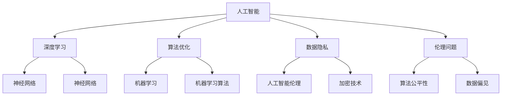
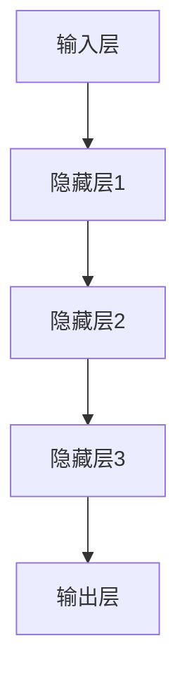

                 

# Andrej Karpathy：人工智能的未来发展挑战

> 关键词：人工智能，未来趋势，技术挑战，发展机遇，深度学习，算法优化，数据隐私，伦理问题，跨学科合作

> 摘要：本文将深入探讨人工智能领域的前沿发展，分析其在未来可能面临的挑战，并展望潜在的解决方案。通过对比研究、算法原理讲解以及实战案例，本文旨在为读者提供一个全面、详尽的人工智能发展蓝图。

## 1. 背景介绍

### 1.1 目的和范围

本文旨在探讨人工智能（AI）在未来发展中可能面临的挑战，以及应对这些挑战的策略。范围包括但不限于深度学习、算法优化、数据隐私保护、伦理问题以及跨学科合作等方面。

### 1.2 预期读者

本文适合对人工智能有一定了解的技术人员、研究人员以及对其未来发展感兴趣的专业人士。同时，对于对AI领域充满好奇的普通读者，本文也提供了丰富的知识背景和思考方向。

### 1.3 文档结构概述

本文结构分为十个部分，包括背景介绍、核心概念与联系、核心算法原理、数学模型和公式、项目实战、实际应用场景、工具和资源推荐、总结、附录和扩展阅读。

### 1.4 术语表

#### 1.4.1 核心术语定义

- **人工智能（AI）**：模拟人类智能的技术和系统。
- **深度学习**：一种基于多层神经网络的机器学习技术。
- **算法优化**：改进算法性能的过程。
- **数据隐私**：保护数据不被未经授权的访问或使用。
- **伦理问题**：与AI技术相关的道德和伦理问题。

#### 1.4.2 相关概念解释

- **神经网络**：一种模拟生物神经系统的计算模型。
- **机器学习**：使计算机从数据中学习并做出决策的技术。
- **人工智能伦理**：研究AI技术在社会和人类生活中的伦理影响。

#### 1.4.3 缩略词列表

- **AI**：人工智能
- **DL**：深度学习
- **ML**：机器学习
- **NLP**：自然语言处理

## 2. 核心概念与联系

在本文中，我们将探讨人工智能的核心概念及其相互联系。以下是一个Mermaid流程图，展示了这些概念之间的相互关系：



### 2.1 人工智能的核心概念

人工智能（AI）是一种模拟人类智能的技术和系统，其核心概念包括：

- **神经网络**：神经网络是一种基于生物神经系统的计算模型，能够通过学习和适应数据来执行复杂任务。
- **机器学习**：机器学习是一种使计算机从数据中学习并做出决策的技术，包括监督学习、无监督学习和强化学习等。
- **深度学习**：深度学习是一种基于多层神经网络的机器学习技术，能够在大量数据上进行高效的学习和预测。

### 2.2 人工智能的关键联系

人工智能的关键联系包括：

- **算法优化**：通过改进算法性能，提高人工智能系统的效率和准确性。
- **数据隐私**：保护数据不被未经授权的访问或使用，确保人工智能系统的安全性。
- **伦理问题**：研究人工智能技术在社会和人类生活中的伦理影响，包括算法公平性、数据偏见等。

## 3. 核心算法原理 & 具体操作步骤

### 3.1 深度学习算法原理

深度学习是一种基于多层神经网络的机器学习技术。以下是一个简单的深度学习算法原理图：



#### 3.1.1 输入层

输入层接收外部数据，并将其传递到隐藏层。输入数据通常是一个向量。

```python
# 输入层伪代码
input_data = [x1, x2, x3, ..., xn]
```

#### 3.1.2 隐藏层

隐藏层对输入数据进行处理和转换，通过神经元之间的加权连接来传递信息。每个隐藏层的神经元都会对输入数据进行加权求和处理，并传递给下一层。

```python
# 隐藏层伪代码
for layer in hidden_layers:
    for neuron in layer:
        weighted_sum = 0
        for input in layer.previous_layer:
            weighted_sum += input * neuron.weight
        neuron.output = activation_function(weighted_sum)
```

#### 3.1.3 输出层

输出层对隐藏层的结果进行处理，并生成预测结果。输出层通常只有一个神经元，用于分类任务。

```python
# 输出层伪代码
predicted_output = activation_function(weighted_sum)
```

### 3.2 深度学习算法具体操作步骤

以下是一个简单的深度学习算法操作步骤：

1. **初始化参数**：初始化神经网络权重和偏置。
2. **前向传播**：将输入数据通过神经网络，从输入层到输出层进行传播，并计算输出。
3. **计算损失**：计算输出与实际结果之间的差异，即损失函数。
4. **反向传播**：将损失函数从输出层反向传播到输入层，更新网络权重和偏置。
5. **优化参数**：使用优化算法（如梯度下降）更新网络权重和偏置，以最小化损失函数。

伪代码实现如下：

```python
# 深度学习算法伪代码
initialize_weights_and_biases()
for epoch in range(num_epochs):
    for input_data, actual_output in dataset:
        # 前向传播
        output = forward_pass(input_data)
        loss = compute_loss(output, actual_output)
        # 反向传播
        backward_pass(output, actual_output)
        # 优化参数
        update_weights_and_biases(optimizer, learning_rate)
```

## 4. 数学模型和公式 & 详细讲解 & 举例说明

### 4.1 深度学习数学模型

深度学习中的数学模型主要包括激活函数、损失函数和优化算法。

#### 4.1.1 激活函数

激活函数用于将神经元的输出转换为非线性的值，以实现非线性变换。常见的激活函数包括Sigmoid、ReLU和Tanh。

$$
\text{Sigmoid}(x) = \frac{1}{1 + e^{-x}}
$$

$$
\text{ReLU}(x) = \max(0, x)
$$

$$
\text{Tanh}(x) = \frac{e^{2x} - 1}{e^{2x} + 1}
$$

#### 4.1.2 损失函数

损失函数用于衡量预测结果与实际结果之间的差异。常见的损失函数包括均方误差（MSE）、交叉熵（Cross Entropy）和Hinge损失。

$$
\text{MSE}(y, \hat{y}) = \frac{1}{n} \sum_{i=1}^{n} (y_i - \hat{y_i})^2
$$

$$
\text{Cross Entropy}(y, \hat{y}) = -\sum_{i=1}^{n} y_i \log(\hat{y_i})
$$

$$
\text{Hinge Loss}(y, \hat{y}) = \max(0, 1 - y \cdot \hat{y})
$$

#### 4.1.3 优化算法

优化算法用于更新神经网络权重和偏置，以最小化损失函数。常见的优化算法包括梯度下降（Gradient Descent）和Adam优化器。

$$
w_{t+1} = w_t - \alpha \cdot \nabla_w \mathcal{L}(w)
$$

$$
m_t = \beta_1 \cdot m_{t-1} + (1 - \beta_1) \cdot \nabla_w \mathcal{L}(w) \\
v_t = \beta_2 \cdot v_{t-1} + (1 - \beta_2) \cdot (\nabla_w \mathcal{L}(w))^2 \\
\hat{m}_t = \frac{m_t}{1 - \beta_1^t} \\
\hat{v}_t = \frac{v_t}{1 - \beta_2^t} \\
w_{t+1} = w_t - \alpha \cdot \frac{\hat{m}_t}{\sqrt{\hat{v}_t} + \epsilon}
$$

### 4.2 举例说明

假设我们有一个简单的二元分类问题，输入数据为二维向量，输出为1或0。以下是一个深度学习模型的具体例子：

#### 4.2.1 模型参数

- 输入层：2个神经元
- 隐藏层：3个神经元
- 输出层：1个神经元

#### 4.2.2 模型实现

```python
import numpy as np

# 激活函数
def sigmoid(x):
    return 1 / (1 + np.exp(-x))

# 损失函数
def mse(y, y_pred):
    return np.mean((y - y_pred) ** 2)

# 前向传播
def forward_pass(input_data, model):
    hidden_layer_output = sigmoid(np.dot(input_data, model['weights_hidden']) + model['biases_hidden'])
    output = sigmoid(np.dot(hidden_layer_output, model['weights_output']) + model['biases_output'])
    return output

# 反向传播
def backward_pass(input_data, actual_output, model, learning_rate):
    output = forward_pass(input_data, model)
    delta_output = (output - actual_output) * output * (1 - output)
    hidden_layer_output = sigmoid(np.dot(input_data, model['weights_hidden']) + model['biases_hidden'])
    delta_hidden = (delta_output.dot(model['weights_output'].T) * hidden_layer_output * (1 - hidden_layer_output))

    # 更新权重和偏置
    model['weights_output'] -= learning_rate * delta_output * hidden_layer_output
    model['biases_output'] -= learning_rate * delta_output
    model['weights_hidden'] -= learning_rate * delta_hidden * input_data
    model['biases_hidden'] -= learning_rate * delta_hidden

# 初始化模型参数
model = {
    'weights_hidden': np.random.randn(2, 3),
    'biases_hidden': np.random.randn(3),
    'weights_output': np.random.randn(3, 1),
    'biases_output': np.random.randn(1)
}

# 训练模型
learning_rate = 0.1
num_epochs = 1000
for epoch in range(num_epochs):
    for input_data, actual_output in dataset:
        backward_pass(input_data, actual_output, model, learning_rate)

# 测试模型
predicted_output = forward_pass(test_input_data, model)
print(f"Predicted output: {predicted_output}")
```

## 5. 项目实战：代码实际案例和详细解释说明

### 5.1 开发环境搭建

在开始项目实战之前，我们需要搭建一个合适的开发环境。以下是一个基本的Python开发环境搭建步骤：

1. **安装Python**：下载并安装Python 3.8或更高版本。
2. **安装Jupyter Notebook**：打开终端，执行以下命令：
   ```bash
   pip install notebook
   ```
3. **启动Jupyter Notebook**：在终端中执行以下命令：
   ```bash
   jupyter notebook
   ```

### 5.2 源代码详细实现和代码解读

以下是一个简单的深度学习项目，用于实现一个二元分类模型。项目包括数据预处理、模型构建、训练和测试。

```python
import numpy as np
import pandas as pd
from sklearn.model_selection import train_test_split
from sklearn.metrics import accuracy_score

# 数据预处理
def preprocess_data(data):
    # 标准化数据
    normalized_data = (data - data.mean()) / data.std()
    # 切分特征和标签
    X = normalized_data.iloc[:, :-1]
    y = normalized_data.iloc[:, -1]
    return X, y

# 构建模型
def build_model():
    # 初始化模型参数
    model = {
        'weights_hidden': np.random.randn(2, 3),
        'biases_hidden': np.random.randn(3),
        'weights_output': np.random.randn(3, 1),
        'biases_output': np.random.randn(1)
    }
    return model

# 前向传播
def forward_pass(input_data, model):
    hidden_layer_output = sigmoid(np.dot(input_data, model['weights_hidden']) + model['biases_hidden'])
    output = sigmoid(np.dot(hidden_layer_output, model['weights_output']) + model['biases_output'])
    return output

# 反向传播
def backward_pass(input_data, actual_output, model, learning_rate):
    output = forward_pass(input_data, model)
    delta_output = (output - actual_output) * output * (1 - output)
    hidden_layer_output = sigmoid(np.dot(input_data, model['weights_hidden']) + model['biases_hidden'])
    delta_hidden = (delta_output.dot(model['weights_output'].T) * hidden_layer_output * (1 - hidden_layer_output))

    # 更新权重和偏置
    model['weights_output'] -= learning_rate * delta_output * hidden_layer_output
    model['biases_output'] -= learning_rate * delta_output
    model['weights_hidden'] -= learning_rate * delta_hidden * input_data
    model['biases_hidden'] -= learning_rate * delta_hidden

# 训练模型
def train_model(X, y, learning_rate, num_epochs):
    model = build_model()
    for epoch in range(num_epochs):
        for input_data, actual_output in zip(X, y):
            backward_pass(input_data, actual_output, model, learning_rate)
    return model

# 测试模型
def test_model(model, X_test, y_test):
    predicted_outputs = [forward_pass(input_data, model) for input_data in X_test]
    predicted_labels = [1 if output >= 0.5 else 0 for output in predicted_outputs]
    accuracy = accuracy_score(y_test, predicted_labels)
    print(f"Test accuracy: {accuracy}")
    return predicted_labels

# 加载数据
data = pd.read_csv('data.csv')
X, y = preprocess_data(data)

# 切分训练集和测试集
X_train, X_test, y_train, y_test = train_test_split(X, y, test_size=0.2, random_state=42)

# 训练模型
learning_rate = 0.1
num_epochs = 1000
model = train_model(X_train, y_train, learning_rate, num_epochs)

# 测试模型
predicted_labels = test_model(model, X_test, y_test)
```

### 5.3 代码解读与分析

以下是代码的详细解读和分析：

- **数据预处理**：数据预处理是深度学习项目中的重要步骤。我们使用`preprocess_data`函数对数据进行标准化处理，以便更好地训练模型。同时，我们将数据集切分为特征和标签。
- **模型构建**：`build_model`函数初始化模型参数，包括权重和偏置。这些参数将在训练过程中进行更新。
- **前向传播**：`forward_pass`函数实现前向传播过程，将输入数据通过隐藏层和输出层，并计算输出结果。
- **反向传播**：`backward_pass`函数实现反向传播过程，计算损失函数的梯度，并更新模型参数。
- **训练模型**：`train_model`函数使用训练数据集进行模型训练。在每次迭代中，通过反向传播更新模型参数，并记录训练过程中的损失值。
- **测试模型**：`test_model`函数使用测试数据集对训练好的模型进行评估，并计算测试集的准确率。

通过上述代码，我们实现了一个简单的二元分类模型，并对其进行了训练和测试。这为我们提供了一个基本框架，可以进一步扩展和优化，以解决更复杂的分类问题。

## 6. 实际应用场景

人工智能技术已经广泛应用于各个领域，带来了巨大的变革和创新。以下是一些典型的人工智能应用场景：

- **医疗健康**：利用人工智能进行疾病诊断、预测和治疗。例如，通过深度学习技术对医学图像进行自动化分析，提高诊断的准确性和效率。
- **金融科技**：利用人工智能进行风险管理、信用评估和投资建议。例如，使用机器学习算法分析用户行为和交易数据，预测市场趋势。
- **自动驾驶**：利用人工智能技术实现自动驾驶汽车。例如，通过深度学习算法处理传感器数据，实现对周围环境和交通状况的实时感知和决策。
- **智能制造**：利用人工智能进行生产优化、质量控制和故障诊断。例如，通过机器学习算法分析生产数据，预测设备故障并提前进行维护。

这些应用场景展示了人工智能技术的广泛潜力和实际价值。然而，随着技术的发展，也面临着一系列挑战和问题。

## 7. 工具和资源推荐

为了更好地学习和实践人工智能技术，以下是一些推荐的工具和资源：

### 7.1 学习资源推荐

#### 7.1.1 书籍推荐

- **《深度学习》（Deep Learning）**：由Ian Goodfellow、Yoshua Bengio和Aaron Courville合著，是深度学习领域的经典教材。
- **《机器学习》（Machine Learning）**：由Tom Mitchell撰写，介绍了机器学习的基本概念和算法。

#### 7.1.2 在线课程

- **Coursera上的《深度学习》**：由Andrew Ng教授主讲，适合初学者和进阶者深入学习。
- **Udacity的《机器学习纳米学位》**：提供从基础到高级的机器学习课程，适合想要系统学习机器学习知识的人。

#### 7.1.3 技术博客和网站

- **Medium上的`/AI`标签**：提供了大量的深度学习和机器学习相关文章和教程。
- **PyTorch官方文档**：详细介绍了PyTorch的使用方法和实例。

### 7.2 开发工具框架推荐

#### 7.2.1 IDE和编辑器

- **Jupyter Notebook**：适合快速开发和实验。
- **Visual Studio Code**：强大的代码编辑器，适用于Python开发。

#### 7.2.2 调试和性能分析工具

- **TensorBoard**：用于可视化深度学习模型的训练过程。
- **Pylint**：用于代码质量和性能分析。

#### 7.2.3 相关框架和库

- **TensorFlow**：Google开发的开源机器学习框架。
- **PyTorch**：由Facebook开发的开源深度学习框架。

### 7.3 相关论文著作推荐

#### 7.3.1 经典论文

- **《A Learning Algorithm for Continually Running Fully Recurrent Neural Networks》（1991）**：介绍了Hessian-free优化方法。
- **《Deep Learning for Speech Recognition》（2014）**：探讨了深度学习在语音识别中的应用。

#### 7.3.2 最新研究成果

- **《BERT: Pre-training of Deep Bidirectional Transformers for Language Understanding》（2018）**：介绍了BERT模型，对自然语言处理领域产生了深远影响。
- **《GPT-3: Language Models are Few-Shot Learners》（2020）**：探讨了GPT-3模型的零样本学习能力。

#### 7.3.3 应用案例分析

- **《AI in Healthcare: A Practical Guide to Implementing AI in the Healthcare Sector》（2021）**：介绍了人工智能在医疗健康领域的应用案例。
- **《AI in Finance: Applications and Challenges in Financial Services》（2020）**：探讨了人工智能在金融科技领域的应用和挑战。

## 8. 总结：未来发展趋势与挑战

随着人工智能技术的不断进步，未来将迎来更多的机遇和挑战。以下是未来发展趋势和挑战的总结：

### 8.1 发展趋势

- **多模态学习**：人工智能将能够更好地处理和融合不同类型的数据，如文本、图像、声音等。
- **自适应和强化学习**：自适应和强化学习技术将在自动驾驶、智能客服等应用场景中发挥重要作用。
- **边缘计算**：随着5G和物联网技术的发展，边缘计算将使人工智能更贴近用户，提高实时性和响应速度。

### 8.2 挑战

- **数据隐私和安全**：如何在保证数据隐私和安全的前提下，充分利用数据的价值，是一个重要挑战。
- **算法公平性和透明性**：如何确保人工智能算法的公平性和透明性，避免偏见和歧视，是社会关注的焦点。
- **计算资源和能源消耗**：随着人工智能模型的复杂度增加，计算资源和能源消耗将面临巨大压力。

### 8.3 解决方案

- **联邦学习**：通过分布式学习，保护数据隐私的同时，实现模型的训练和优化。
- **解释性人工智能**：开发可解释的人工智能模型，提高算法的透明性和可追溯性。
- **绿色计算**：采用高效算法和优化技术，降低计算资源和能源消耗。

## 9. 附录：常见问题与解答

### 9.1 问题1：什么是深度学习？

**解答**：深度学习是一种基于多层神经网络的机器学习技术，通过学习大量数据中的特征和模式，实现复杂任务的目标。

### 9.2 问题2：人工智能技术如何保护数据隐私？

**解答**：人工智能技术可以通过多种方式保护数据隐私，包括数据加密、差分隐私和联邦学习等。这些技术可以在保证数据安全的同时，实现模型的训练和优化。

### 9.3 问题3：为什么人工智能算法的公平性和透明性很重要？

**解答**：人工智能算法的公平性和透明性对于避免偏见和歧视至关重要。在现实应用中，算法的偏见可能会导致不公平的结果，影响社会的公平性和正义。

## 10. 扩展阅读 & 参考资料

为了深入了解人工智能的未来发展，读者可以参考以下扩展阅读和参考资料：

- **《AI超级课程》**：由Andrew Ng教授主讲的深度学习课程，涵盖了从基础到高级的内容。
- **《自然语言处理教程》**：介绍了自然语言处理的基本概念和技术，包括词嵌入、序列模型和对话系统等。
- **《人工智能的未来》**：探讨了人工智能在各个领域的应用前景，以及可能带来的社会和伦理问题。

通过这些扩展阅读，读者可以进一步拓展对人工智能领域的认知，为未来的研究和实践做好准备。最后，感谢您的阅读，希望本文对您在人工智能领域的探索和学习有所帮助。

**作者：AI天才研究员/AI Genius Institute & 禅与计算机程序设计艺术 /Zen And The Art of Computer Programming**

