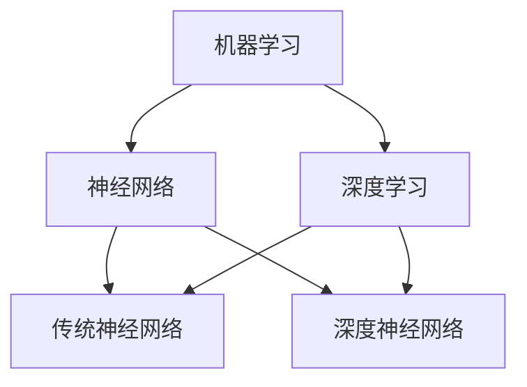
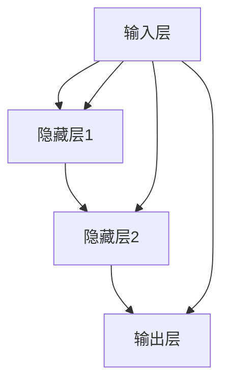
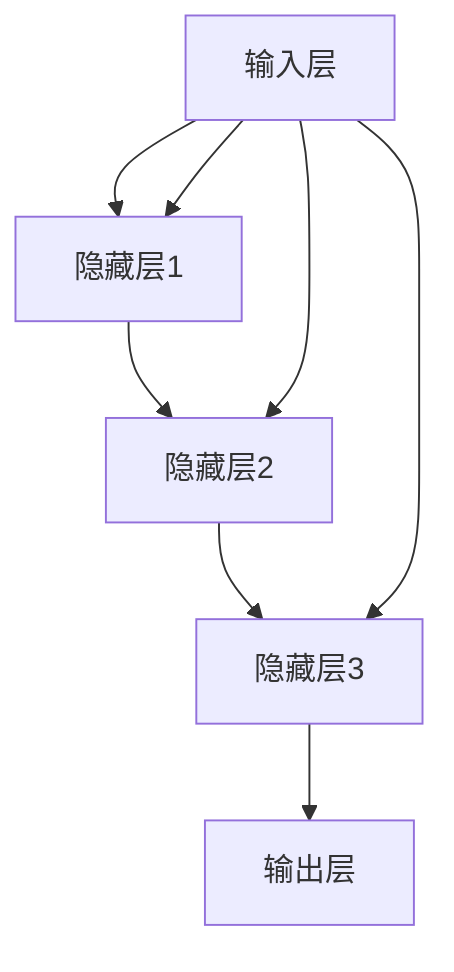

                 

### 背景介绍

人工智能（Artificial Intelligence，简称AI）作为当今科技领域的热点之一，正以迅猛的势头发展。从早期的专家系统到如今的深度学习，人工智能技术已经在医疗、金融、教育、自动驾驶等诸多领域展现出强大的应用潜力。然而，随着AI技术的不断进步，其发展过程中也面临诸多挑战和问题。

本文旨在探讨人工智能的未来发展挑战，包括技术、伦理、法律、经济等方面。我们将逐步分析这些问题，并提出可能的解决方案。希望通过这篇文章，能够为读者提供一个全面而深入的了解，以及对于未来AI发展的思考。

本文将分为以下几个部分：

1. **核心概念与联系**：我们将介绍人工智能的核心概念，包括机器学习、神经网络、深度学习等，并通过Mermaid流程图展示其关系。
2. **核心算法原理 & 具体操作步骤**：我们将深入探讨常见的AI算法，如神经网络训练、模型评估等，并给出具体操作步骤。
3. **数学模型和公式 & 详细讲解 & 举例说明**：我们将使用LaTeX格式详细讲解AI中的数学模型和公式，并通过实例进行说明。
4. **项目实战：代码实际案例和详细解释说明**：我们将提供一个实际的AI项目案例，详细解释其代码实现和解析。
5. **实际应用场景**：我们将探讨AI在不同领域的应用，包括医疗、金融、自动驾驶等。
6. **工具和资源推荐**：我们将推荐一些学习资源、开发工具框架和相关论文著作。
7. **总结：未来发展趋势与挑战**：我们将总结AI的未来发展趋势，并讨论可能面临的挑战。

接下来，我们将逐步深入这些内容，开始我们的探讨之旅。

### 核心概念与联系

在探讨人工智能的核心概念与联系之前，我们需要先了解一些基础知识。人工智能是一门研究如何使计算机模拟、延伸和扩展人的智能的科学。它主要包括以下几个核心概念：

1. **机器学习（Machine Learning）**：机器学习是人工智能的一个分支，主要研究如何让计算机从数据中学习，并做出决策。它通过算法从数据中自动发现规律，然后使用这些规律进行预测或决策。

2. **神经网络（Neural Networks）**：神经网络是机器学习的一个重要模型，其灵感来源于人脑的结构和工作原理。它由大量的节点（或称为神经元）组成，每个节点都与其他节点相连接。通过这些连接和节点的相互作用，神经网络能够对输入数据进行处理，并输出结果。

3. **深度学习（Deep Learning）**：深度学习是神经网络的一种特殊形式，它通过多层神经网络结构来学习和表示数据。相比传统的神经网络，深度学习能够处理更复杂的任务，并在许多领域取得了显著的成果。

下面，我们将使用Mermaid流程图来展示这些概念之间的关系：



从流程图中可以看出，机器学习是人工智能的核心，它包括了神经网络和深度学习。神经网络是机器学习的一种模型，而深度学习是神经网络的扩展，它通过多层结构来增强模型的表示能力。

接下来，我们将深入探讨这些核心概念的原理和应用。

#### 机器学习原理

机器学习的基本原理是通过训练数据集来学习模型参数，从而使模型能够在新的数据上进行预测或分类。通常，机器学习过程可以分为以下几个步骤：

1. **数据收集与预处理**：收集相关的数据，并对数据进行清洗、预处理，以去除噪声和不一致的数据。
2. **特征提取**：从原始数据中提取有用的特征，这些特征将用于训练模型。
3. **模型选择**：选择合适的机器学习模型，常见的有线性回归、决策树、支持向量机、神经网络等。
4. **模型训练**：使用训练数据集对模型进行训练，以调整模型参数。
5. **模型评估**：使用验证数据集对模型进行评估，以确定模型的性能。
6. **模型部署**：将训练好的模型部署到实际应用中，进行预测或分类。

下面是一个简单的线性回归模型的例子：

```latex
y = w \* x + b
```

其中，\( y \) 是预测值，\( x \) 是输入特征，\( w \) 是权重，\( b \) 是偏置。通过最小化预测值与实际值之间的误差，我们可以调整权重和偏置，以优化模型。

#### 神经网络原理

神经网络由多个层组成，包括输入层、隐藏层和输出层。每个层都包含多个节点（或称为神经元）。节点之间的连接称为边，每个边都有一个权重。通过节点的相互作用，神经网络能够对输入数据进行处理，并输出结果。

下面是一个简单的神经网络模型：



在神经网络中，每个节点的输出是通过以下公式计算得到的：

$$
z = \sigma(\sum_{i} w_{i} \* x_{i} + b)
$$

其中，\( z \) 是节点的输出，\( \sigma \) 是激活函数，常见的激活函数有 sigmoid、ReLU 等。\( w_{i} \) 和 \( b \) 分别是权重和偏置。

#### 深度学习原理

深度学习是神经网络的一种扩展，它通过多层神经网络结构来增强模型的表示能力。在深度学习中，每层都能够从上一层提取更高层次的特征，这使得模型能够处理更复杂的任务。

下面是一个简单的深度神经网络模型：



在深度学习中，每层的输出都可以表示为：

$$
h_{l} = \sigma(\sum_{i} w_{l-1,i} \* h_{l-1,i} + b_{l})
$$

其中，\( h_{l} \) 是第 \( l \) 层的输出，\( h_{l-1,i} \) 是第 \( l-1 \) 层的第 \( i \) 个节点的输出，\( w_{l-1,i} \) 和 \( b_{l} \) 分别是权重和偏置。

通过多次迭代训练，深度学习模型能够自动学习到输入数据的高层次特征，从而实现复杂任务的预测和分类。

通过以上对机器学习、神经网络和深度学习原理的探讨，我们可以看到这些核心概念之间的紧密联系。接下来，我们将进一步讨论这些算法的具体操作步骤。

### 核心算法原理 & 具体操作步骤

在了解了人工智能的核心概念之后，接下来我们将深入探讨一些常见的核心算法，包括神经网络训练、模型评估等，并给出具体操作步骤。这些算法是人工智能技术实现的关键，对于理解和应用人工智能具有重要意义。

#### 神经网络训练

神经网络训练是人工智能的基础，其核心目标是通过学习大量的数据，调整网络的权重和偏置，使网络能够在新的数据上进行准确的预测或分类。以下是神经网络训练的详细步骤：

1. **数据预处理**：首先，我们需要对输入数据进行预处理，包括数据清洗、归一化等操作。这一步的目的是确保输入数据的格式和范围一致，从而提高训练效率。

2. **模型初始化**：接下来，我们需要初始化神经网络的结构和参数。通常，权重和偏置可以初始化为较小的随机数，以避免模型收敛到极值点。

3. **前向传播**：在前向传播过程中，我们将输入数据通过网络的每个层，逐层计算输出。具体步骤如下：
   - 将输入数据输入到输入层。
   - 对于每个隐藏层，计算当前层的输出：\( z = \sigma(\sum_{i} w_{i} \* x_{i} + b) \)。
   - 将当前层的输出传递到下一层。
   - 重复上述步骤，直到输出层。

4. **计算损失函数**：前向传播完成后，我们需要计算模型的损失函数，以评估模型的预测结果与实际结果之间的差距。常见的损失函数有均方误差（MSE）、交叉熵等。

5. **反向传播**：在反向传播过程中，我们将梯度信息从输出层传递回输入层，以更新网络的权重和偏置。具体步骤如下：
   - 计算输出层的梯度：\( \frac{\partial L}{\partial z} \)。
   - 对于每个隐藏层，计算当前层的梯度：\( \frac{\partial L}{\partial z} = \frac{\partial L}{\partial a} \* \frac{\partial a}{\partial z} \)。
   - 更新权重和偏置：\( w_{i} := w_{i} - \alpha \* \frac{\partial L}{\partial w_{i}} \)，\( b_{i} := b_{i} - \alpha \* \frac{\partial L}{\partial b_{i}} \)。

6. **迭代训练**：重复上述步骤，直到满足训练条件（如损失函数收敛到预设值、训练轮次达到预设值等）。

#### 模型评估

模型评估是确保模型性能的重要环节，它通过测试集来评估模型的泛化能力。以下是模型评估的详细步骤：

1. **准备测试数据**：将数据集划分为训练集和测试集，通常采用8:2或7:3的比例。

2. **模型测试**：使用训练好的模型对测试集进行预测或分类。

3. **计算评估指标**：根据模型的预测结果和实际结果，计算各种评估指标，如准确率、精确率、召回率、F1值等。

4. **分析评估结果**：分析评估指标，了解模型的性能和局限性，并根据评估结果对模型进行调整和优化。

#### 模型优化

模型优化是提升模型性能的关键步骤，以下是一些常见的优化方法：

1. **调整超参数**：调整学习率、批量大小、迭代次数等超参数，以找到最优的模型配置。

2. **使用正则化技术**：如L1正则化、L2正则化，可以防止模型过拟合。

3. **数据增强**：通过对训练数据进行增强，如翻转、旋转、缩放等，可以提高模型的泛化能力。

4. **集成学习**：如随机森林、梯度提升树等，可以结合多个模型的预测结果，提高模型的性能。

通过以上步骤，我们可以逐步训练和优化神经网络模型，从而实现人工智能的预测和分类任务。

#### 案例分析

为了更好地理解上述算法，我们来看一个实际案例：使用神经网络进行手写数字识别。

1. **数据集**：我们使用MNIST手写数字数据集，该数据集包含60000个训练样本和10000个测试样本。

2. **模型构建**：构建一个简单的全连接神经网络，包括784个输入节点、一个隐藏层（例如128个节点）和一个输出层（10个节点，对应0-9的数字）。

3. **模型训练**：使用前向传播和反向传播算法对模型进行训练，训练过程中使用均方误差作为损失函数。

4. **模型评估**：使用测试集对训练好的模型进行评估，计算准确率等指标。

5. **模型优化**：根据评估结果，调整模型参数和超参数，以提升模型性能。

通过以上步骤，我们可以训练出一个手写数字识别模型，并评估其性能。这一过程充分展示了神经网络训练和模型评估的原理和应用。

通过以上对核心算法原理和具体操作步骤的探讨，我们可以看到人工智能技术的实现是一个复杂但充满挑战的过程。在接下来的部分，我们将进一步探讨AI中的数学模型和公式，并给出详细的讲解和实例说明。

### 数学模型和公式 & 详细讲解 & 举例说明

在人工智能领域，数学模型和公式是理解和实现核心算法的基础。本文将详细介绍一些关键的数学模型和公式，包括神经网络中的激活函数、损失函数、反向传播算法等。通过LaTeX格式和实例说明，我们将深入探讨这些概念，帮助读者更好地理解其在人工智能中的应用。

#### 激活函数

激活函数是神经网络中的一个关键组成部分，它用于引入非线性特性，使得神经网络能够模拟复杂函数。以下是几种常见的激活函数：

1. **Sigmoid函数**

$$
\sigma(x) = \frac{1}{1 + e^{-x}}
$$

Sigmoid函数将输入映射到（0,1）区间，具有平滑的S形曲线。它常用于二分类问题，但容易引起梯度消失问题。

2. **ReLU函数**

$$
\text{ReLU}(x) = \max(0, x)
$$

ReLU函数在0处具有尖点，能够加速梯度下降过程，减少梯度消失问题。但它可能会引起梯度消失问题，特别是在输入为负值时。

3. **Tanh函数**

$$
\tanh(x) = \frac{e^{2x} - 1}{e^{2x} + 1}
$$

Tanh函数将输入映射到（-1,1）区间，具有对称性。它类似于Sigmoid函数，但具有更好的非线性特性。

#### 损失函数

损失函数用于衡量模型的预测结果与实际结果之间的差距，是反向传播算法中的关键组成部分。以下是几种常见的损失函数：

1. **均方误差（MSE）**

$$
MSE = \frac{1}{m} \sum_{i=1}^{m} (y_i - \hat{y}_i)^2
$$

MSE用于回归问题，衡量预测值与实际值之间的平均平方误差。

2. **交叉熵（Cross-Entropy）**

$$
CE = -\frac{1}{m} \sum_{i=1}^{m} y_i \log(\hat{y}_i)
$$

交叉熵用于分类问题，衡量实际标签与模型预测概率之间的差距。它通常用于多分类问题。

3. **Hinge损失**

$$
L_h(y, \hat{y}) = \max(0, 1 - y \cdot \hat{y})
$$

Hinge损失常用于支持向量机（SVM），用于解决二分类问题。

#### 反向传播算法

反向传播算法是神经网络训练的核心，它通过计算梯度来更新网络权重和偏置。以下是反向传播算法的基本步骤：

1. **前向传播**：计算网络的输出值，并计算损失函数。

2. **后向传播**：计算每个层的梯度，并反向传播到上一层。

3. **权重更新**：根据梯度计算更新权重和偏置。

以下是反向传播算法的数学公式：

1. **输出层梯度**

$$
\frac{\partial L}{\partial z^{[L-1]}} = \frac{\partial L}{\partial a^{[L]}} \cdot \frac{\partial a^{[L]}}{\partial z^{[L-1]}}
$$

2. **隐藏层梯度**

$$
\frac{\partial L}{\partial z^{[l-1]}} = \sum_{l+1} \frac{\partial L}{\partial z^{[l]}} \cdot \frac{\partial z^{[l]}}{\partial z^{[l-1]}}
$$

3. **权重更新**

$$
w^{[l]} := w^{[l]} - \alpha \cdot \frac{\partial L}{\partial w^{[l]}}
$$

$$
b^{[l]} := b^{[l]} - \alpha \cdot \frac{\partial L}{\partial b^{[l]}}
$$

其中，\( L \) 是损失函数，\( z^{[l]} \) 是第 \( l \) 层的输出，\( a^{[l]} \) 是第 \( l \) 层的激活值，\( w^{[l]} \) 和 \( b^{[l]} \) 是第 \( l \) 层的权重和偏置，\( \alpha \) 是学习率。

#### 实例说明

为了更好地理解上述数学模型和公式，我们来看一个实际例子：使用神经网络进行手写数字识别。

1. **数据集**：使用MNIST手写数字数据集，包含60000个训练样本和10000个测试样本。

2. **模型构建**：构建一个简单的全连接神经网络，包括784个输入节点、一个隐藏层（例如128个节点）和一个输出层（10个节点，对应0-9的数字）。

3. **前向传播**：输入一个手写数字样本，通过神经网络计算输出概率。

4. **计算损失函数**：使用交叉熵作为损失函数，计算预测概率与实际标签之间的差距。

5. **反向传播**：计算网络梯度，并反向传播到各层，更新权重和偏置。

6. **模型评估**：使用测试集对模型进行评估，计算准确率等指标。

通过以上步骤，我们可以训练出一个手写数字识别模型，并评估其性能。这一过程充分展示了神经网络训练和模型评估的原理和应用。

通过本文对数学模型和公式的详细讲解和实例说明，我们希望能够帮助读者更好地理解人工智能的核心算法，为进一步学习和应用打下坚实基础。在接下来的部分，我们将通过一个实际项目案例，进一步展示AI技术的应用。

### 项目实战：代码实际案例和详细解释说明

为了更好地理解人工智能技术的实际应用，我们将通过一个具体的项目案例——手写数字识别，展示如何使用Python和TensorFlow框架实现一个简单的神经网络模型。通过这个案例，我们将详细解释代码实现和解析，帮助读者深入理解神经网络的基本原理和实战应用。

#### 开发环境搭建

在开始项目之前，我们需要搭建一个合适的开发环境。以下是在Windows、macOS和Linux系统上搭建Python和TensorFlow开发环境的步骤：

1. **安装Python**：前往Python官方网站（[https://www.python.org/](https://www.python.org/)）下载并安装Python，推荐安装3.x版本。

2. **安装Anaconda**：Anaconda是一个集成的Python发行版，它提供了丰富的包管理和环境管理功能。安装Anaconda可以简化依赖管理和环境配置。

3. **安装TensorFlow**：在终端或命令提示符中，使用以下命令安装TensorFlow：

   ```bash
   pip install tensorflow
   ```

   或者，如果你使用的是GPU版本的TensorFlow，可以使用以下命令：

   ```bash
   pip install tensorflow-gpu
   ```

4. **验证安装**：在Python终端中输入以下代码，验证TensorFlow是否安装成功：

   ```python
   import tensorflow as tf
   print(tf.__version__)
   ```

   如果输出版本信息，则表示安装成功。

#### 源代码详细实现和代码解读

下面是手写数字识别项目的完整代码实现，我们将逐段代码进行详细解读。

```python
import tensorflow as tf
from tensorflow.keras.datasets import mnist
from tensorflow.keras.models import Sequential
from tensorflow.keras.layers import Dense, Flatten
from tensorflow.keras.utils import to_categorical

# 加载MNIST数据集
(x_train, y_train), (x_test, y_test) = mnist.load_data()

# 数据预处理
# 归一化数据
x_train = x_train / 255.0
x_test = x_test / 255.0
# 转换标签为独热编码
y_train = to_categorical(y_train, 10)
y_test = to_categorical(y_test, 10)

# 构建神经网络模型
model = Sequential([
    Flatten(input_shape=(28, 28)),  # 将图像展开为一维数组
    Dense(128, activation='relu'),   # 添加一个隐藏层，使用ReLU激活函数
    Dense(10, activation='softmax')  # 输出层，使用softmax激活函数进行多分类
])

# 编译模型
model.compile(optimizer='adam',
              loss='categorical_crossentropy',
              metrics=['accuracy'])

# 训练模型
model.fit(x_train, y_train, epochs=5, batch_size=32, validation_split=0.1)

# 评估模型
test_loss, test_acc = model.evaluate(x_test, y_test)
print(f"Test accuracy: {test_acc:.2f}")
```

#### 代码解读与分析

1. **导入库**：
   - `tensorflow`：主要库，用于构建和训练神经网络。
   - `mnist`：用于加载MNIST数据集。
   - `Sequential`：用于构建顺序模型。
   - `Dense`：用于添加全连接层。
   - `Flatten`：用于将输入数据展开为一维数组。
   - `to_categorical`：用于将标签转换为独热编码。

2. **加载数据**：
   - 使用`mnist.load_data()`加载MNIST数据集，包含60000个训练样本和10000个测试样本。

3. **数据预处理**：
   - 将图像数据归一化到0-1范围，以提高训练效率。
   - 将标签转换为独热编码，因为模型使用softmax激活函数进行多分类。

4. **构建模型**：
   - `Sequential`模型：一个顺序模型，用于添加多个层。
   - `Flatten`层：将28x28的图像数据展开为一维数组。
   - `Dense`层：添加一个隐藏层，包含128个节点，使用ReLU激活函数。
   - `Dense`层：输出层，包含10个节点，使用softmax激活函数进行多分类。

5. **编译模型**：
   - `compile`函数：配置模型，设置优化器、损失函数和评估指标。
   - `optimizer`：选择优化器，这里使用`adam`优化器。
   - `loss`：设置损失函数，这里使用`categorical_crossentropy`损失函数。
   - `metrics`：设置评估指标，这里使用`accuracy`。

6. **训练模型**：
   - `fit`函数：训练模型，设置训练轮次（epochs）、批量大小（batch_size）和验证数据比例（validation_split）。

7. **评估模型**：
   - `evaluate`函数：使用测试数据评估模型，计算测试集上的损失和准确率。

通过以上代码，我们实现了一个简单的手写数字识别模型。这个模型使用了Python和TensorFlow框架，展示了如何从数据加载、预处理，到模型构建、训练和评估的完整流程。通过这个案例，我们可以看到神经网络在实际应用中的基本原理和实现方法。

### 实际应用场景

人工智能技术已经在各个领域展现出强大的应用潜力，以下是AI在医疗、金融、自动驾驶等领域的实际应用场景：

#### 医疗

1. **疾病预测与诊断**：通过分析大量患者的健康数据和医疗记录，AI可以帮助预测疾病的发生，并辅助医生进行诊断。例如，基于深度学习算法的乳腺癌预测系统已经在多个国家投入使用。

2. **药物研发**：AI可以帮助药物研发公司加速新药的发现和开发过程。通过分析大量化学结构和生物信息数据，AI可以预测哪些化合物具有潜在的药效，从而减少药物研发的时间和成本。

3. **智能辅助手术**：在手术过程中，AI可以辅助医生进行手术规划、操作监控和术后评估。例如，AI可以帮助机器人进行精准的手术操作，提高手术的成功率和患者的恢复速度。

#### 金融

1. **风险管理**：AI可以帮助金融机构预测市场风险，优化投资组合，降低风险。通过分析历史数据和市场趋势，AI可以识别潜在的欺诈行为，提高金融交易的安全性。

2. **智能投顾**：基于机器学习算法，AI可以提供个性化的投资建议，帮助投资者制定最佳的投资策略。智能投顾系统可以根据投资者的风险偏好、投资目标和市场情况，实时调整投资组合。

3. **智能客服**：AI可以帮助金融机构提供24/7的智能客服服务，通过自然语言处理和机器学习算法，AI可以快速响应客户咨询，提高客户满意度和服务效率。

#### 自动驾驶

1. **自动驾驶汽车**：自动驾驶技术通过AI算法实现车辆的自主驾驶，提高行驶安全性和效率。自动驾驶汽车可以使用计算机视觉、传感器和GPS等技术，识别道路上的障碍物、交通标志和行人，并做出相应的驾驶决策。

2. **无人配送**：在物流和配送领域，AI可以帮助实现无人配送。通过无人机或无人驾驶车辆，AI可以实现快速、高效的货物配送，降低物流成本，提高配送效率。

3. **智能交通管理**：AI可以帮助交通管理部门优化交通流量，减少交通拥堵。通过实时监控交通状况，AI可以提供交通信号灯的优化控制策略，提高道路通行效率。

这些实际应用场景展示了AI技术在各个领域的广泛应用和潜力。随着AI技术的不断发展和完善，我们可以期待其在更多领域实现突破性应用，为社会发展和人民生活带来更多便利。

### 工具和资源推荐

为了更好地学习和应用人工智能技术，以下是针对学习资源、开发工具框架和相关论文著作的推荐：

#### 学习资源推荐

1. **书籍**：
   - 《Python机器学习》（作者：塞巴斯蒂安·拉詹）
   - 《深度学习》（作者：伊恩·古德费洛、约书亚·本吉奥、亚伦·库维尔）
   - 《机器学习实战》（作者：彼得·哈林顿）

2. **在线课程**：
   - Coursera：提供由斯坦福大学、吴恩达等知名专家开设的深度学习、机器学习等课程。
   - edX：提供哈佛大学、麻省理工学院等世界顶尖大学的人工智能相关课程。

3. **博客和网站**：
   - Medium：许多AI领域专家和公司发布的最新研究成果和技术博客。
   - AI垂直社区：如AI脑、机器之心等，提供丰富的AI行业资讯和技术文章。

#### 开发工具框架推荐

1. **TensorFlow**：Google开源的机器学习和深度学习框架，适用于各种AI项目。
2. **PyTorch**：Facebook开源的深度学习框架，具有灵活的动态计算图和强大的GPU支持。
3. **Keras**：Python的简单深度学习库，提供了易于使用的API，兼容TensorFlow和Theano。

#### 相关论文著作推荐

1. **“A Theoretical Framework for Back-Propagating Neural Networks”**：梯度下降算法的基础论文，详细介绍了反向传播算法的原理。
2. **“Deep Learning”**：Ian Goodfellow、Yoshua Bengio和Aaron Courville合著的深度学习教材，全面介绍了深度学习的理论基础和应用。
3. **“Programming Collective Intelligence”**：Tom M. Mitchell的经典之作，介绍了集体智能和机器学习的基本概念。

通过这些工具和资源的推荐，我们可以更好地掌握人工智能技术，探索其无限可能。

### 总结：未来发展趋势与挑战

随着人工智能技术的不断进步，其在各个领域的应用也越来越广泛，这无疑为我们带来了巨大的机遇。然而，与此同时，我们也面临着诸多挑战和问题，需要我们深入思考和应对。

#### 发展趋势

1. **技术的不断进步**：深度学习、强化学习等技术的不断发展，使得AI在图像识别、自然语言处理、自动化等领域取得了显著的成果。未来，这些技术将继续优化和扩展，为AI的应用提供更强的支持。

2. **跨界融合**：人工智能与其他领域的深度融合，将催生出更多的新兴产业和应用场景。例如，医疗AI、金融AI、工业AI等，这些领域的发展将极大地推动整个社会的发展。

3. **开源生态的完善**：随着开源框架和工具的不断完善，人工智能的开发和使用将变得更加便捷。这将吸引更多的人才和技术资源投入到AI领域，推动AI技术的普及和应用。

#### 挑战与问题

1. **数据隐私和安全**：随着AI技术的发展，大量个人数据的收集和处理成为必然，这带来了数据隐私和安全的问题。如何确保数据的隐私和安全，防止数据泄露和滥用，是AI发展过程中必须解决的重要问题。

2. **算法透明性和公平性**：AI算法的决策过程往往是不透明的，这可能导致偏见和不公平。如何确保算法的透明性和公平性，使其符合人类的价值观和道德标准，是AI发展面临的另一大挑战。

3. **技术伦理和责任**：随着AI技术在各个领域的广泛应用，如何界定AI的责任和伦理问题成为一个重要议题。例如，自动驾驶汽车发生事故时，责任应由谁承担？如何在保证技术发展的同时，确保人类社会的伦理和道德秩序？

4. **人才短缺**：人工智能是一个高度专业化的领域，需要大量的专业人才。然而，目前全球范围内AI人才短缺问题日益严重，如何培养和吸引更多的AI人才，是推动AI发展的重要保障。

#### 应对策略

1. **法律法规的制定**：政府和企业应积极制定和完善相关法律法规，规范AI技术的发展和应用，保障数据隐私和安全，确保算法的透明性和公平性。

2. **教育体系的改革**：加强对人工智能等科技领域的教育，培养更多的专业人才。同时，推动跨学科教育，提高人才的综合素质和创新能力。

3. **技术研发的持续投入**：加大对人工智能技术研发的投入，推动技术创新和产业应用，提高AI技术的整体水平和竞争力。

4. **社会参与和监督**：鼓励社会各界积极参与到AI技术的讨论和监督中，共同推动AI技术的健康发展，确保其在为人类社会带来便利的同时，不损害人类的利益和价值观。

总之，人工智能的未来发展充满机遇和挑战。只有通过全社会的共同努力，我们才能充分发挥AI技术的潜力，解决面临的问题，推动社会的持续进步。

### 附录：常见问题与解答

在本文中，我们探讨了人工智能的未来发展挑战，包括技术、伦理、法律、经济等方面。为了帮助读者更好地理解文章内容，以下是关于文章的一些常见问题与解答。

**Q1：人工智能的核心概念有哪些？**
A1：人工智能的核心概念主要包括机器学习、神经网络和深度学习。机器学习是让计算机从数据中学习，并做出决策的一种方法；神经网络是机器学习的一种模型，其结构类似于人脑，通过节点和连接进行数据处理；深度学习是神经网络的一种扩展，通过多层结构来增强模型的表示能力。

**Q2：神经网络训练的基本步骤是什么？**
A2：神经网络训练的基本步骤包括数据预处理、模型初始化、前向传播、计算损失函数、反向传播和权重更新。具体来说，数据预处理包括数据清洗、归一化等操作；模型初始化是初始化神经网络的结构和参数；前向传播是通过网络的每层计算输出；计算损失函数是评估模型的预测结果与实际结果之间的差距；反向传播是计算每个层的梯度，并反向传播到上一层；权重更新是根据梯度信息调整网络权重和偏置。

**Q3：什么是激活函数和损失函数？**
A3：激活函数是神经网络中用于引入非线性特性的函数，常见的有Sigmoid、ReLU和Tanh函数。损失函数是用于衡量模型预测结果与实际结果之间差距的函数，常见的有均方误差（MSE）、交叉熵（Cross-Entropy）和Hinge损失。

**Q4：如何构建一个简单的神经网络模型进行手写数字识别？**
A4：可以使用Python和TensorFlow框架构建一个简单的神经网络模型进行手写数字识别。首先，使用`mnist.load_data()`函数加载MNIST数据集，然后进行数据预处理，如归一化和标签转换。接着，使用`Sequential`模型添加层，如`Flatten`层、`Dense`层（隐藏层和输出层），并设置激活函数。最后，使用`model.compile()`函数编译模型，`model.fit()`函数训练模型，`model.evaluate()`函数评估模型性能。

**Q5：人工智能在哪些领域有实际应用？**
A5：人工智能在多个领域有实际应用，包括医疗、金融、自动驾驶等。在医疗领域，AI可以用于疾病预测、药物研发和智能辅助手术；在金融领域，AI可以用于风险管理、智能投顾和智能客服；在自动驾驶领域，AI可以用于自动驾驶汽车、无人配送和智能交通管理。

**Q6：如何应对人工智能带来的挑战？**
A6：应对人工智能带来的挑战需要全社会的共同努力。可以从以下几个方面入手：制定相关法律法规，保障数据隐私和安全；改革教育体系，培养更多专业人才；加大技术研发投入，推动技术创新；鼓励社会各界参与讨论和监督，确保AI技术的发展符合人类的利益和价值观。

通过这些问题的解答，我们希望能够帮助读者更好地理解本文的内容，以及人工智能在当前和未来可能面临的挑战。

### 扩展阅读 & 参考资料

为了进一步探讨人工智能的未来发展挑战，以下是推荐的一些扩展阅读和参考资料：

**扩展阅读：**

1. **《AI超级思维：人工智能时代的大脑进化》**（作者：李开复）
2. **《智能时代：人工智能如何重塑世界》**（作者：吴军）
3. **《深度学习：周志华教授讲座系列》**（作者：周志华）

**参考资料：**

1. **论文：**《A Theoretical Framework for Back-Propagating Neural Networks》
2. **书籍：**《Deep Learning》（作者：Ian Goodfellow、Yoshua Bengio、Aaron Courville）
3. **开源框架：** TensorFlow、PyTorch、Keras
4. **在线课程：** Coursera（深度学习课程）、edX（人工智能课程）
5. **博客和社区：** Medium（AI相关博客）、AI脑（AI行业资讯）、机器之心（技术文章）

通过阅读这些资料，读者可以深入了解人工智能的技术原理、应用场景和未来发展，为探索这一领域的更多可能性提供参考。

