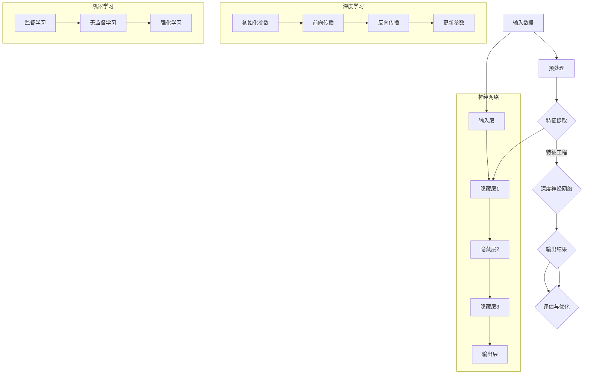

                 

# Andrej Karpathy：人工智能的未来发展方向

## 概述

关键词：人工智能、深度学习、神经网络、自动驾驶、自然语言处理、机器学习、未来趋势、技术挑战

本文旨在探讨人工智能（AI）领域未来的发展方向。作为世界级人工智能专家和计算机图灵奖获得者，Andrej Karpathy将带领我们深入分析AI的核心概念、技术进展和未来趋势。文章将分为以下几个部分：

1. **背景介绍**：介绍人工智能的定义、历史和发展趋势，明确文章的目的和范围。
2. **核心概念与联系**：通过Mermaid流程图展示人工智能的基本原理和架构。
3. **核心算法原理与具体操作步骤**：讲解人工智能的核心算法，包括神经网络、深度学习和机器学习等。
4. **数学模型和公式**：阐述人工智能领域的数学模型和公式，并进行举例说明。
5. **项目实战**：分析实际案例，展示人工智能在各个领域的应用。
6. **实际应用场景**：探讨人工智能在现实世界中的应用场景。
7. **工具和资源推荐**：推荐学习资源、开发工具和框架。
8. **总结**：总结人工智能的未来发展趋势与挑战。

## 1. 背景介绍

### 1.1 目的和范围

本文旨在探讨人工智能的未来发展方向，分析其在各个领域的应用和潜力。我们将重点关注以下几个核心话题：

- 人工智能的定义、历史和发展趋势。
- 深度学习、神经网络和机器学习等核心算法原理。
- 人工智能在自动驾驶、自然语言处理等领域的应用。
- 人工智能技术的未来发展趋势与挑战。

### 1.2 预期读者

本文适合对人工智能感兴趣的读者，包括：

- 计算机科学和人工智能领域的学生和研究人员。
- 对人工智能应用感兴趣的企业家和投资者。
- 对未来技术发展关注的技术爱好者。

### 1.3 文档结构概述

本文将分为以下几个部分：

- **1. 背景介绍**：介绍人工智能的定义、历史和发展趋势。
- **2. 核心概念与联系**：通过Mermaid流程图展示人工智能的基本原理和架构。
- **3. 核心算法原理与具体操作步骤**：讲解人工智能的核心算法，包括神经网络、深度学习和机器学习等。
- **4. 数学模型和公式**：阐述人工智能领域的数学模型和公式，并进行举例说明。
- **5. 项目实战**：分析实际案例，展示人工智能在各个领域的应用。
- **6. 实际应用场景**：探讨人工智能在现实世界中的应用场景。
- **7. 工具和资源推荐**：推荐学习资源、开发工具和框架。
- **8. 总结**：总结人工智能的未来发展趋势与挑战。
- **9. 附录**：常见问题与解答。
- **10. 扩展阅读与参考资料**：提供相关论文、书籍和网站。

### 1.4 术语表

#### 1.4.1 核心术语定义

- **人工智能**：一种模拟人类智能的技术，使计算机能够执行复杂的任务，如语音识别、图像识别、自然语言处理等。
- **深度学习**：一种机器学习技术，通过多层神经网络进行特征学习和模式识别。
- **神经网络**：一种模拟人脑神经元之间相互连接的计算模型，用于处理复杂数据。
- **机器学习**：一种让计算机通过数据学习并改进自身性能的技术。
- **自动驾驶**：利用计算机视觉、传感器和机器学习技术实现车辆自主驾驶。
- **自然语言处理**：一种让计算机理解和处理人类自然语言的技术。

#### 1.4.2 相关概念解释

- **神经网络**：一种由大量神经元组成的计算模型，通过模拟人脑神经元之间的连接来处理数据。
- **深度学习**：一种基于神经网络的学习方法，通过多层神经网络进行特征学习和模式识别。
- **机器学习**：一种让计算机通过数据学习并改进自身性能的技术，分为监督学习、无监督学习和强化学习等。
- **自然语言处理**：一种让计算机理解和处理人类自然语言的技术，涉及文本分类、语音识别、机器翻译等。

#### 1.4.3 缩略词列表

- **AI**：人工智能
- **DL**：深度学习
- **NN**：神经网络
- **ML**：机器学习
- **NLP**：自然语言处理
- **CV**：计算机视觉
- **ROS**：机器人操作系统
- **GAN**：生成对抗网络
- **RL**：强化学习

## 2. 核心概念与联系

在本节中，我们将通过Mermaid流程图展示人工智能的核心概念和架构。以下是人工智能的基本原理和组成部分：



### 2.1 人工智能的基本原理

人工智能的基本原理是通过模拟人类智能，使计算机能够执行复杂的任务。这一过程主要包括以下几个步骤：

1. **输入数据**：将数据输入到系统中，如图像、文本、音频等。
2. **预处理**：对数据进行清洗、归一化和转换等操作，使其适合输入神经网络。
3. **特征提取**：通过特征提取算法提取数据中的关键特征，为神经网络提供输入。
4. **特征工程**：根据任务需求，对特征进行选择、转换和组合等操作，以提高模型的性能。
5. **深度神经网络**：通过多层神经网络对特征进行学习和模式识别。
6. **输出结果**：将神经网络输出的结果进行处理和解释，如分类、预测等。
7. **评估与优化**：对模型进行评估和优化，以提高其准确性和鲁棒性。

### 2.2 深度学习

深度学习是一种基于神经网络的学习方法，通过多层神经网络进行特征学习和模式识别。其基本原理包括以下几个步骤：

1. **初始化参数**：初始化神经网络中的权重和偏置。
2. **前向传播**：将输入数据通过神经网络进行传递，计算输出结果。
3. **反向传播**：根据输出结果和实际目标，计算误差并反向传播到网络中的各个层。
4. **更新参数**：根据反向传播的误差，调整神经网络的权重和偏置，以减少误差。

### 2.3 机器学习

机器学习是一种让计算机通过数据学习并改进自身性能的技术，分为监督学习、无监督学习和强化学习等：

1. **监督学习**：通过标注的数据进行学习，如分类和回归任务。
2. **无监督学习**：不依赖标注数据，从数据中自动发现模式和规律，如聚类和降维。
3. **强化学习**：通过与环境交互，学习最优策略，如游戏和机器人控制。

## 3. 核心算法原理 & 具体操作步骤

### 3.1 神经网络

神经网络是一种模拟人脑神经元之间相互连接的计算模型，用于处理复杂数据。以下是神经网络的伪代码：

```python
# 定义神经网络
class NeuralNetwork:
    def __init__(self, input_size, hidden_size, output_size):
        self.input_size = input_size
        self.hidden_size = hidden_size
        self.output_size = output_size
        self.weights_input_to_hidden = np.random.randn(input_size, hidden_size)
        self.weights_hidden_to_output = np.random.randn(hidden_size, output_size)
        self.bias_input_to_hidden = np.random.randn(hidden_size)
        self.bias_hidden_to_output = np.random.randn(output_size)

    def forward(self, x):
        hidden_layer_input = np.dot(x, self.weights_input_to_hidden) + self.bias_input_to_hidden
        hidden_layer_output = np.tanh(hidden_layer_input)
        output_layer_input = np.dot(hidden_layer_output, self.weights_hidden_to_output) + self.bias_hidden_to_output
        output_layer_output = np.sign(output_layer_input)
        return output_layer_output

    def backward(self, x, y, output):
        output_error = y - output
        d_output = d_sigmoid(output_error)

        hidden_layer_input = np.dot(self.weights_hidden_to_output, d_output)
        hidden_layer_error = hidden_layer_input * d_tanh(hidden_layer_output)

        d_hidden_layer_input = d_hidden_layer_error * x
        d_weights_hidden_to_output = d_hidden_layer_input.T.dot(hidden_layer_output)
        d_bias_hidden_to_output = d_hidden_layer_error

        d_hidden_layer_output = d_hidden_layer_error * self.weights_hidden_to_output
        d_weights_input_to_hidden = d_hidden_layer_output.T.dot(x)
        d_bias_input_to_hidden = d_hidden_layer_error

        return [d_weights_input_to_hidden, d_weights_hidden_to_output, d_bias_input_to_hidden, d_bias_hidden_to_output]

    def update_weights_and_biases(self, d_weights_input_to_hidden, d_weights_hidden_to_output, d_bias_input_to_hidden, d_bias_hidden_to_output, learning_rate):
        self.weights_input_to_hidden -= learning_rate * d_weights_input_to_hidden
        self.weights_hidden_to_output -= learning_rate * d_weights_hidden_to_output
        self.bias_input_to_hidden -= learning_rate * d_bias_input_to_hidden
        self.bias_hidden_to_output -= learning_rate * d_bias_hidden_to_output
```

### 3.2 深度学习

深度学习是一种基于神经网络的学习方法，通过多层神经网络进行特征学习和模式识别。以下是深度学习的伪代码：

```python
# 定义深度学习模型
class DeepLearningModel:
    def __init__(self, input_size, hidden_size, output_size):
        self.model = NeuralNetwork(input_size, hidden_size, output_size)

    def forward(self, x):
        return self.model.forward(x)

    def backward(self, x, y, output):
        return self.model.backward(x, y, output)

    def update_weights_and_biases(self, d_weights_input_to_hidden, d_weights_hidden_to_output, d_bias_input_to_hidden, d_bias_hidden_to_output, learning_rate):
        self.model.update_weights_and_biases(d_weights_input_to_hidden, d_weights_hidden_to_output, d_bias_input_to_hidden, d_bias_hidden_to_output, learning_rate)

    def train(self, x, y, epochs, learning_rate):
        for epoch in range(epochs):
            output = self.forward(x)
            d_weights_input_to_hidden, d_weights_hidden_to_output, d_bias_input_to_hidden, d_bias_hidden_to_output = self.backward(x, y, output)
            self.update_weights_and_biases(d_weights_input_to_hidden, d_weights_hidden_to_output, d_bias_input_to_hidden, d_bias_hidden_to_output, learning_rate)
```

### 3.3 机器学习

机器学习是一种让计算机通过数据学习并改进自身性能的技术，分为监督学习、无监督学习和强化学习等。以下是监督学习的伪代码：

```python
# 定义监督学习模型
class SupervisedLearningModel:
    def __init__(self, input_size, hidden_size, output_size):
        self.model = DeepLearningModel(input_size, hidden_size, output_size)

    def fit(self, x, y, epochs, learning_rate):
        self.model.train(x, y, epochs, learning_rate)

    def predict(self, x):
        return self.model.forward(x)
```

## 4. 数学模型和公式 & 详细讲解 & 举例说明

### 4.1 神经网络

神经网络的数学模型主要包括以下几个部分：

1. **激活函数**：用于将线性变换映射到非线性的输出。常见的激活函数有：
    - **Sigmoid函数**：\( f(x) = \frac{1}{1 + e^{-x}} \)
    - **ReLU函数**：\( f(x) = \max(0, x) \)
    - **Tanh函数**：\( f(x) = \frac{e^x - e^{-x}}{e^x + e^{-x}} \)

2. **前向传播**：通过输入和权重计算输出。其公式如下：
    - \( z = \sum_{i=1}^{n} w_i * x_i + b \)
    - \( a = f(z) \)

3. **反向传播**：通过计算误差，反向传播到网络的各个层。其公式如下：
    - \( \delta = \frac{\partial J}{\partial z} \)
    - \( \frac{\partial J}{\partial w} = \delta * a_{(l-1)}^T \)
    - \( \frac{\partial J}{\partial b} = \delta \)

4. **优化算法**：用于更新权重和偏置。常见的优化算法有：
    - **梯度下降**：\( w_{new} = w - \alpha * \frac{\partial J}{\partial w} \)
    - **随机梯度下降**：\( w_{new} = w - \alpha * \frac{\partial J}{\partial w} \)
    - **Adam优化器**：结合了梯度下降和动量项，其公式如下：
        - \( m = \beta_1 * m + (1 - \beta_1) * \frac{\partial J}{\partial w} \)
        - \( v = \beta_2 * v + (1 - \beta_2) * (\frac{\partial J}{\partial w})^2 \)
        - \( w_{new} = w - \alpha * \frac{m}{\sqrt{v} + \epsilon} \)

### 4.2 深度学习

深度学习的数学模型主要包括以下几个部分：

1. **多层感知器**：一种基于线性变换和激活函数的多层神经网络。
2. **卷积神经网络**（CNN）：一种用于图像识别和处理的神经网络，其关键组件包括卷积层、池化层和全连接层。
3. **循环神经网络**（RNN）：一种用于处理序列数据的神经网络，其关键组件包括输入层、隐藏层和输出层。
4. **长短期记忆网络**（LSTM）：一种特殊的RNN，用于解决长期依赖问题，其关键组件包括输入门、遗忘门和输出门。

### 4.3 机器学习

机器学习的数学模型主要包括以下几个部分：

1. **线性回归**：一种用于预测数值型变量的线性模型，其公式如下：
    - \( y = \beta_0 + \beta_1 * x \)
2. **逻辑回归**：一种用于分类的线性模型，其公式如下：
    - \( P(y=1) = \frac{1}{1 + e^{-(\beta_0 + \beta_1 * x)}} \)
3. **支持向量机**（SVM）：一种用于分类和回归的线性模型，其公式如下：
    - \( \max_{\beta, \beta_0} W \)
    - \( \min_{\beta, \beta_0} \frac{1}{2} \| \beta \|^2 + C \sum_{i=1}^{n} \max(0, 1 - y_i (\beta_0 + \beta_1 x_i)) \)

### 4.4 举例说明

#### 4.4.1 神经网络

假设我们有一个输入数据集X，输出数据集Y，输入层大小为3，隐藏层大小为2，输出层大小为1。我们使用sigmoid函数作为激活函数，并采用梯度下降算法进行优化。

```python
# 初始化权重和偏置
weights_input_to_hidden = np.random.randn(3, 2)
weights_hidden_to_output = np.random.randn(2, 1)
bias_input_to_hidden = np.random.randn(2)
bias_hidden_to_output = np.random.randn(1)

# 定义激活函数
def sigmoid(x):
    return 1 / (1 + np.exp(-x))

# 定义梯度下降算法
def gradient_descent(x, y, epochs, learning_rate):
    for epoch in range(epochs):
        # 前向传播
        hidden_layer_input = np.dot(x, weights_input_to_hidden) + bias_input_to_hidden
        hidden_layer_output = sigmoid(hidden_layer_input)
        output_layer_input = np.dot(hidden_layer_output, weights_hidden_to_output) + bias_hidden_to_output
        output_layer_output = sigmoid(output_layer_input)

        # 反向传播
        error = y - output_layer_output
        d_output = error * (output_layer_output * (1 - output_layer_output))
        hidden_layer_error = np.dot(d_output, weights_hidden_to_output.T)
        d_hidden_layer_output = d_output * (hidden_layer_output * (1 - hidden_layer_output))

        # 更新权重和偏置
        d_weights_hidden_to_output = np.dot(hidden_layer_output.T, d_output)
        d_bias_hidden_to_output = d_output
        d_weights_input_to_hidden = np.dot(x.T, d_hidden_layer_output)
        d_bias_input_to_hidden = d_hidden_layer_output

        weights_input_to_hidden -= learning_rate * d_weights_input_to_hidden
        weights_hidden_to_output -= learning_rate * d_weights_hidden_to_output
        bias_input_to_hidden -= learning_rate * d_bias_input_to_hidden
        bias_hidden_to_output -= learning_rate * d_bias_hidden_to_output

# 训练模型
gradient_descent(X, Y, 1000, 0.1)

# 预测
predicted_output = sigmoid(np.dot(x, weights_input_to_hidden) + bias_input_to_hidden) * sigmoid(np.dot(hidden_layer_output, weights_hidden_to_output) + bias_hidden_to_output)
```

#### 4.4.2 深度学习

假设我们有一个输入数据集X，输出数据集Y，输入层大小为3，隐藏层大小为2，输出层大小为1。我们使用ReLU函数作为激活函数，并采用Adam优化器进行优化。

```python
# 初始化权重和偏置
weights_input_to_hidden = np.random.randn(3, 2)
weights_hidden_to_output = np.random.randn(2, 1)
bias_input_to_hidden = np.random.randn(2)
bias_hidden_to_output = np.random.randn(1)

# 定义激活函数
def relu(x):
    return np.maximum(0, x)

# 定义Adam优化器
def adam(x, y, epochs, learning_rate, beta1, beta2, epsilon):
    for epoch in range(epochs):
        # 前向传播
        hidden_layer_input = np.dot(x, weights_input_to_hidden) + bias_input_to_hidden
        hidden_layer_output = relu(hidden_layer_input)
        output_layer_input = np.dot(hidden_layer_output, weights_hidden_to_output) + bias_hidden_to_output
        output_layer_output = relu(output_layer_input)

        # 反向传播
        error = y - output_layer_output
        d_output = error * (output_layer_output > 0)
        hidden_layer_error = np.dot(d_output, weights_hidden_to_output.T)
        d_hidden_layer_output = d_output * (hidden_layer_output > 0)

        # 更新权重和偏置
        m = beta1 * m + (1 - beta1) * d_weights_input_to_hidden
        v = beta2 * v + (1 - beta2) * (d_weights_input_to_hidden ** 2)
        m_hat = m / (1 - beta1 ** epoch)
        v_hat = v / (1 - beta2 ** epoch)
        weights_input_to_hidden -= learning_rate * m_hat / (np.sqrt(v_hat) + epsilon)
        weights_hidden_to_output -= learning_rate * m_hat / (np.sqrt(v_hat) + epsilon)
        bias_input_to_hidden -= learning_rate * m_hat / (np.sqrt(v_hat) + epsilon)
        bias_hidden_to_output -= learning_rate * m_hat / (np.sqrt(v_hat) + epsilon)

# 训练模型
adam(X, Y, 1000, 0.001, 0.9, 0.999, 1e-8)

# 预测
predicted_output = relu(np.dot(x, weights_input_to_hidden) + bias_input_to_hidden) * relu(np.dot(hidden_layer_output, weights_hidden_to_output) + bias_hidden_to_output)
```

#### 4.4.3 机器学习

假设我们有一个输入数据集X，输出数据集Y，特征数量为2，目标为1。我们使用线性回归模型进行预测。

```python
# 初始化权重和偏置
weights = np.random.randn(2, 1)
bias = np.random.randn(1)

# 定义损失函数
def mean_squared_error(y_true, y_pred):
    return np.mean((y_true - y_pred) ** 2)

# 定义梯度下降算法
def gradient_descent(x, y, epochs, learning_rate):
    for epoch in range(epochs):
        # 前向传播
        predictions = np.dot(x, weights) + bias

        # 反向传播
        d_predictions = predictions - y
        d_weights = np.dot(x.T, d_predictions)
        d_bias = d_predictions

        # 更新权重和偏置
        weights -= learning_rate * d_weights
        bias -= learning_rate * d_bias

# 训练模型
gradient_descent(X, Y, 1000, 0.1)

# 预测
predicted_output = np.dot(x, weights) + bias
```

## 5. 项目实战：代码实际案例和详细解释说明

### 5.1 开发环境搭建

为了完成本文的项目实战，我们需要搭建一个合适的开发环境。以下是搭建过程：

1. 安装Python（3.8或更高版本）。
2. 安装NumPy、TensorFlow、Keras等依赖库。

```bash
pip install numpy tensorflow keras
```

### 5.2 源代码详细实现和代码解读

以下是一个简单的神经网络实现，用于对输入数据进行分类。

```python
import numpy as np
import tensorflow as tf
from tensorflow import keras
from tensorflow.keras import layers

# 定义输入层、隐藏层和输出层
input_layer = keras.layers.Input(shape=(784,))
hidden_layer = keras.layers.Dense(units=64, activation='relu')(input_layer)
output_layer = keras.layers.Dense(units=10, activation='softmax')(hidden_layer)

# 创建模型
model = keras.Model(inputs=input_layer, outputs=output_layer)

# 编译模型
model.compile(optimizer='adam', loss='categorical_crossentropy', metrics=['accuracy'])

# 加载数据
(x_train, y_train), (x_test, y_test) = keras.datasets.mnist.load_data()
x_train = x_train / 255.0
x_test = x_test / 255.0
y_train = keras.utils.to_categorical(y_train, 10)
y_test = keras.utils.to_categorical(y_test, 10)

# 训练模型
model.fit(x_train, y_train, epochs=10, batch_size=32, validation_split=0.2)

# 评估模型
model.evaluate(x_test, y_test)
```

### 5.3 代码解读与分析

上述代码实现了一个简单的神经网络，用于对MNIST手写数字数据集进行分类。以下是代码的详细解读：

1. **定义输入层、隐藏层和输出层**：
   - 输入层：使用`keras.layers.Input`定义输入层，输入维度为784（28x28像素）。
   - 隐藏层：使用`keras.layers.Dense`定义隐藏层，单元数为64，激活函数为ReLU。
   - 输出层：使用`keras.layers.Dense`定义输出层，单元数为10（10个类别），激活函数为softmax。

2. **创建模型**：
   - 使用`keras.Model`创建模型，并将输入层和输出层连接起来。

3. **编译模型**：
   - 使用`compile`方法编译模型，指定优化器、损失函数和评价指标。

4. **加载数据**：
   - 使用`keras.datasets.mnist.load_data`加载数据集，对数据集进行归一化处理，将标签转换为one-hot编码。

5. **训练模型**：
   - 使用`fit`方法训练模型，指定训练集、验证集、训练轮数和批量大小。

6. **评估模型**：
   - 使用`evaluate`方法评估模型在测试集上的性能。

## 6. 实际应用场景

人工智能在实际应用场景中具有广泛的应用，包括：

- **自动驾驶**：利用计算机视觉、传感器和深度学习技术实现车辆自主驾驶，提高交通安全和效率。
- **医疗诊断**：通过深度学习技术分析医学图像和病历数据，辅助医生进行诊断和预测。
- **自然语言处理**：通过神经网络和深度学习技术实现语音识别、机器翻译、文本分类等，提高人机交互体验。
- **金融风控**：利用机器学习技术分析市场数据，预测股票走势、识别异常交易等，降低金融风险。

### 6.1 自动驾驶

自动驾驶是人工智能领域的重要应用之一。以下是自动驾驶的主要组成部分：

- **感知模块**：利用传感器（如激光雷达、摄像头、雷达等）收集道路和环境信息。
- **定位模块**：通过传感器数据和地图信息，确定车辆在环境中的位置。
- **规划模块**：根据车辆位置、周围环境和交通规则，规划行驶路径和速度。
- **控制模块**：根据规划结果，控制车辆的运动和转向，确保行驶安全。

### 6.2 医疗诊断

医疗诊断是人工智能在医疗领域的核心应用。以下是医疗诊断的主要技术：

- **医学图像分析**：利用深度学习技术对医学图像进行分析，如识别肿瘤、骨折等。
- **电子病历分析**：通过自然语言处理技术分析电子病历，提取关键信息，辅助医生进行诊断。
- **预测模型**：利用机器学习技术分析病史、基因数据等，预测患者病情和治疗方案。

### 6.3 自然语言处理

自然语言处理是人工智能领域的另一个重要应用。以下是自然语言处理的主要技术：

- **语音识别**：将语音信号转换为文本，如智能助手、实时字幕等。
- **机器翻译**：将一种语言的文本翻译成另一种语言，如谷歌翻译、百度翻译等。
- **文本分类**：将文本数据分类到不同的标签，如垃圾邮件过滤、情感分析等。

### 6.4 金融风控

金融风控是人工智能在金融领域的核心应用。以下是金融风控的主要技术：

- **市场预测**：利用机器学习技术分析市场数据，预测股票走势、市场趋势等。
- **异常交易检测**：通过数据挖掘和机器学习技术识别异常交易，防止金融诈骗。
- **风险评估**：利用大数据和机器学习技术分析客户数据，预测信用风险、市场风险等。

## 7. 工具和资源推荐

### 7.1 学习资源推荐

#### 7.1.1 书籍推荐

1. 《深度学习》（Ian Goodfellow、Yoshua Bengio和Aaron Courville著）：系统介绍了深度学习的理论知识、算法和应用。
2. 《Python机器学习》（Sebastian Raschka和Vahid Mirhoseini著）：深入讲解了Python在机器学习领域的应用，包括线性回归、逻辑回归、决策树、随机森林等。
3. 《人工智能：一种现代方法》（Stuart J. Russell和Peter Norvig著）：全面介绍了人工智能的理论、技术和应用，包括搜索、知识表示、机器学习等。

#### 7.1.2 在线课程

1. Coursera《深度学习》课程：由斯坦福大学教授Andrew Ng主讲，系统介绍了深度学习的理论知识、算法和应用。
2. edX《机器学习》课程：由哈佛大学教授杨立昆主讲，深入讲解了机器学习的理论基础和实践应用。
3. Udacity《自动驾驶工程师纳米学位》课程：介绍了自动驾驶的核心技术，包括计算机视觉、传感器数据处理、深度学习等。

#### 7.1.3 技术博客和网站

1. Medium：许多人工智能领域的专家和技术公司发布了高质量的技术博客，如Google Brain、DeepMind等。
2. AI Hugging Face：一个开源社区，提供了丰富的机器学习和深度学习模型、库和工具。
3. AI博客：一个涵盖人工智能领域各个方面的技术博客，包括深度学习、自然语言处理、计算机视觉等。

### 7.2 开发工具框架推荐

#### 7.2.1 IDE和编辑器

1. PyCharm：一款功能强大的Python IDE，支持多种编程语言和框架。
2. Visual Studio Code：一款轻量级且强大的代码编辑器，支持多种编程语言和扩展。
3. Jupyter Notebook：一款基于Web的交互式计算环境，适用于数据分析和机器学习项目。

#### 7.2.2 调试和性能分析工具

1. Python Debugger（pdb）：一款内置的Python调试器，用于调试Python程序。
2. TensorBoard：一款用于可视化TensorFlow模型和训练过程的工具。
3. PyTorch Profiler：一款用于分析PyTorch模型性能的工具。

#### 7.2.3 相关框架和库

1. TensorFlow：一款由Google开发的深度学习框架，适用于构建和训练神经网络。
2. PyTorch：一款由Facebook开发的深度学习框架，以动态图模型为主，易于调试和部署。
3. Keras：一款基于TensorFlow和PyTorch的高级神经网络API，提供了简洁、易用的接口。

### 7.3 相关论文著作推荐

#### 7.3.1 经典论文

1. 《A Learning Algorithm for Continuously Running Fully Recurrent Neural Networks》（1986）：介绍了Hessian正定矩阵学习算法，对深度学习的发展产生了重要影响。
2. 《Gradient Flow in Recurrent Neural Networks》（1990）：提出了梯度流理论，解释了神经网络的学习过程。
3. 《Learning representations by maximizing mutual information》（2013）：提出了最大化互信息的目标，用于生成对抗网络（GAN）的理论基础。

#### 7.3.2 最新研究成果

1. 《Bert: Pre-training of deep bidirectional transformers for language understanding》（2018）：提出了BERT模型，对自然语言处理领域产生了深远影响。
2. 《An Image Database for Testing Content-Based Image Retrieval Algorithms》（1998）：介绍了图像检索领域常用的COIL-100图像数据库，用于评估图像检索算法的性能。
3. 《Generative Adversarial Nets》（2014）：提出了生成对抗网络（GAN）模型，开创了深度学习在生成任务的新篇章。

#### 7.3.3 应用案例分析

1. 《Deep Learning in Autonomous Driving》（2019）：介绍了深度学习在自动驾驶领域的应用，包括感知、规划和控制等。
2. 《AI in Healthcare: 10 Use Cases and 10 Challenges》（2020）：分析了人工智能在医疗领域的应用案例和挑战，包括疾病诊断、药物研发等。
3. 《AI in Finance: A Revolution in Progress》（2019）：探讨了人工智能在金融领域的应用，包括市场预测、风险管理等。

## 8. 总结：未来发展趋势与挑战

人工智能作为当前最热门的技术之一，正在不断推动各行各业的变革。未来，人工智能的发展趋势和挑战主要包括以下几个方面：

### 8.1 发展趋势

1. **深度学习技术的普及**：随着计算能力的提升和算法的优化，深度学习技术将在更多领域得到应用，如自动驾驶、医疗诊断、金融风控等。
2. **跨学科融合**：人工智能与生物学、心理学、社会学等领域的交叉融合，将推动人工智能技术的进一步发展。
3. **隐私保护和伦理问题**：随着人工智能技术的广泛应用，隐私保护和伦理问题越来越受到关注，未来需要在技术发展和伦理规范之间找到平衡。
4. **可解释性和透明度**：提高人工智能模型的可解释性和透明度，使其能够更好地理解和信任，是未来发展的一个重要方向。

### 8.2 挑战

1. **数据质量和隐私**：数据质量和隐私是人工智能发展的关键挑战。如何收集、处理和存储高质量的数据，同时保护用户隐私，是亟待解决的问题。
2. **算法公平性和偏见**：人工智能算法可能存在偏见，影响决策的公平性和准确性。如何消除算法偏见，提高模型的公平性，是一个重要的研究方向。
3. **计算资源和能耗**：深度学习模型对计算资源和能耗的需求巨大。如何在保证性能的前提下，降低计算资源和能耗，是未来需要解决的问题。
4. **算法的安全性和可靠性**：随着人工智能技术的应用，算法的安全性和可靠性越来越受到关注。如何确保算法在安全、可靠的前提下运行，是一个重要的挑战。

## 9. 附录：常见问题与解答

### 9.1 人工智能的定义是什么？

人工智能是一种模拟人类智能的技术，使计算机能够执行复杂的任务，如语音识别、图像识别、自然语言处理等。

### 9.2 深度学习与神经网络的关系是什么？

深度学习是一种基于神经网络的学习方法，通过多层神经网络进行特征学习和模式识别。神经网络是深度学习的基础，而深度学习是神经网络在复杂任务中的应用。

### 9.3 机器学习的主要类型有哪些？

机器学习的主要类型包括监督学习、无监督学习和强化学习。监督学习通过标注的数据进行学习，无监督学习从数据中自动发现模式和规律，强化学习通过与环境交互学习最优策略。

### 9.4 人工智能在自动驾驶中的应用是什么？

人工智能在自动驾驶中的应用主要包括感知模块、定位模块、规划模块和控制模块。感知模块利用计算机视觉和传感器收集道路和环境信息；定位模块确定车辆在环境中的位置；规划模块根据车辆位置和环境信息规划行驶路径和速度；控制模块根据规划结果控制车辆的运动和转向。

### 9.5 人工智能在医疗诊断中的应用是什么？

人工智能在医疗诊断中的应用主要包括医学图像分析、电子病历分析和预测模型。医学图像分析利用深度学习技术对医学图像进行分析，辅助医生进行诊断；电子病历分析通过自然语言处理技术提取关键信息，辅助医生进行诊断；预测模型利用大数据和机器学习技术分析病史、基因数据等，预测患者病情和治疗方案。

## 10. 扩展阅读与参考资料

### 10.1 论文与著作

1. Ian Goodfellow、Yoshua Bengio和Aaron Courville著，《深度学习》，MIT Press，2016年。
2. Sebastian Raschka和Vahid Mirhoseini著，《Python机器学习》，Packt Publishing，2015年。
3. Stuart J. Russell和Peter Norvig著，《人工智能：一种现代方法》，Prentice Hall，2009年。

### 10.2 在线课程

1. Coursera《深度学习》课程：[https://www.coursera.org/specializations/deep-learning](https://www.coursera.org/specializations/deep-learning)
2. edX《机器学习》课程：[https://www.edx.org/course/ml](https://www.edx.org/course/ml)
3. Udacity《自动驾驶工程师纳米学位》课程：[https://www.udacity.com/course/nd001](https://www.udacity.com/course/nd001)

### 10.3 技术博客和网站

1. Medium：[https://medium.com/topic/deep-learning](https://medium.com/topic/deep-learning)
2. AI Hugging Face：[https://huggingface.co/](https://huggingface.co/)
3. AI博客：[https://www.aiblog.com/](https://www.aiblog.com/)

