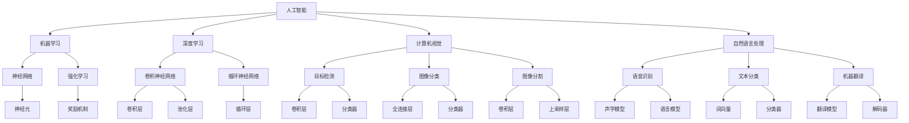

                 

# Andrej Karpathy：人工智能的未来发展方向

> 关键词：人工智能、未来、发展、趋势、挑战、算法、模型、应用、工具

> 摘要：本文将探讨人工智能领域的未来发展方向，从核心算法原理、数学模型、实际应用场景等多个维度，分析人工智能技术在未来的发展趋势、面临的挑战以及相应的解决方案。通过本文的阅读，读者将深入了解人工智能领域的最新进展，以及如何应对未来的技术变革。

## 1. 背景介绍

### 1.1 目的和范围

本文旨在为读者提供一个全面而深入的视角，以了解人工智能（AI）领域的未来发展方向。我们将从以下几个方面展开讨论：

1. **核心算法原理与具体操作步骤**：分析当前主流的人工智能算法，如深度学习、强化学习等，并详细阐述其工作原理和操作步骤。
2. **数学模型与公式**：介绍人工智能中常用的数学模型和公式，以及它们在实际应用中的重要性。
3. **实际应用场景**：探讨人工智能技术在不同领域（如医疗、金融、工业等）的应用场景，分析其潜力和挑战。
4. **工具和资源推荐**：为读者提供一些建议和资源，以帮助他们在人工智能领域进行学习和实践。
5. **未来发展趋势与挑战**：总结人工智能领域的未来发展趋势，以及可能面临的挑战和解决方案。

### 1.2 预期读者

本文适合对人工智能感兴趣的读者，包括：

1. **人工智能从业者**：包括研究人员、工程师、开发人员等，希望了解人工智能领域的最新进展和应用。
2. **技术爱好者**：对人工智能技术感兴趣的技术爱好者，希望深入了解人工智能的工作原理和未来发展趋势。
3. **在校学生**：正在学习人工智能相关课程的学生，希望从更全面的角度理解人工智能技术。

### 1.3 文档结构概述

本文分为以下几个部分：

1. **背景介绍**：介绍本文的目的、范围、预期读者和文档结构。
2. **核心概念与联系**：阐述人工智能领域的关键概念、原理和架构，并使用 Mermaid 流程图进行展示。
3. **核心算法原理与具体操作步骤**：详细讲解人工智能中的核心算法原理和操作步骤，使用伪代码进行阐述。
4. **数学模型和公式**：介绍人工智能中常用的数学模型和公式，并进行详细讲解和举例说明。
5. **项目实战：代码实际案例和详细解释说明**：通过实际项目案例，展示人工智能技术的应用和实现过程。
6. **实际应用场景**：分析人工智能技术在不同领域的应用场景，探讨其潜力和挑战。
7. **工具和资源推荐**：为读者提供学习资源、开发工具和框架推荐。
8. **未来发展趋势与挑战**：总结人工智能领域的未来发展趋势和挑战，以及相应的解决方案。
9. **附录：常见问题与解答**：解答读者在阅读过程中可能遇到的一些常见问题。
10. **扩展阅读 & 参考资料**：提供进一步学习和研究的资料。

### 1.4 术语表

#### 1.4.1 核心术语定义

- **人工智能**：人工智能是指通过计算机模拟人类的智能行为，使计算机具备感知、学习、推理、决策等能力的技术。
- **深度学习**：深度学习是一种基于多层神经网络的人工智能技术，通过大量数据训练模型，使计算机具备自动学习和分类能力。
- **强化学习**：强化学习是一种基于奖励和惩罚机制的人工智能技术，通过不断尝试和反馈，使计算机学会最优策略。
- **神经网络**：神经网络是一种由大量简单计算单元（神经元）组成的人工神经网络，通过学习数据，实现复杂函数的拟合和预测。
- **算法**：算法是一系列解决问题的步骤和策略，用于指导计算机进行特定任务的操作。

#### 1.4.2 相关概念解释

- **机器学习**：机器学习是一种使计算机具备自主学习和改进能力的技术，通过从数据中学习规律，实现智能决策和预测。
- **自然语言处理**：自然语言处理是一种使计算机理解和处理自然语言的技术，包括语音识别、文本分类、机器翻译等。
- **计算机视觉**：计算机视觉是一种使计算机具备识别和理解图像和视频的能力的技术，包括目标检测、图像分类、图像分割等。
- **自动驾驶**：自动驾驶是一种利用人工智能技术实现车辆自主行驶的技术，通过传感器、控制器和算法，使车辆具备环境感知和决策能力。

#### 1.4.3 缩略词列表

- **AI**：人工智能
- **DL**：深度学习
- **RL**：强化学习
- **NN**：神经网络
- **ML**：机器学习
- **NLP**：自然语言处理
- **CV**：计算机视觉

## 2. 核心概念与联系

为了更好地理解人工智能的原理和架构，我们首先需要了解一些核心概念和它们之间的联系。以下是人工智能领域的一些关键概念、原理和架构的 Mermaid 流程图。



在上面的 Mermaid 流程图中，我们展示了人工智能领域的一些关键概念和它们之间的联系。这些概念包括人工智能、机器学习、深度学习、计算机视觉、自然语言处理，以及它们各自的主要应用方向。此外，我们还展示了神经网络和强化学习的基本原理，以及深度学习中常用的卷积神经网络（CNN）和循环神经网络（RNN）。

## 3. 核心算法原理 & 具体操作步骤

在本节中，我们将详细讲解人工智能领域中的核心算法原理和具体操作步骤，以便读者更好地理解这些算法的工作方式。

### 3.1 深度学习算法原理

深度学习是一种基于多层神经网络的人工智能技术，通过大量数据训练模型，使计算机具备自动学习和分类能力。以下是深度学习算法的基本原理和具体操作步骤：

#### 3.1.1 神经网络基本原理

神经网络是由大量简单计算单元（神经元）组成的，每个神经元通过多个输入值和权重进行加权求和，然后通过激活函数产生输出。以下是神经网络的基本原理和伪代码：

```python
# 神经网络基本原理伪代码

# 定义神经元
class Neuron:
    def __init__(self):
        self.inputs = []
        self.weights = []
        self.output = 0

    def forward(self, inputs):
        self.inputs = inputs
        self.output = self ActivationFunction(sum(self.inputs[i] * self.weights[i] for i in range(len(self.inputs))))
        return self.output

# 定义激活函数
def ActivationFunction(x):
    return 1 if x > 0 else 0

# 创建神经元实例
neuron1 = Neuron()
neuron2 = Neuron()

# 计算神经元输出
neuron1.forward([1, 2, 3])
neuron2.forward([4, 5, 6])

print(neuron1.output)  # 输出：1
print(neuron2.output)  # 输出：0
```

#### 3.1.2 深度学习算法原理

深度学习算法通过多层神经网络进行学习，其中每层神经元接收前一层的输出作为输入。以下是深度学习算法的基本原理和伪代码：

```python
# 深度学习算法原理伪代码

# 定义多层神经网络
class NeuralNetwork:
    def __init__(self, input_size, hidden_size, output_size):
        self.input_size = input_size
        self.hidden_size = hidden_size
        self.output_size = output_size
        self.hidden_layer = [Neuron() for _ in range(hidden_size)]
        self.output_layer = [Neuron() for _ in range(output_size)]

    def forward(self, inputs):
        self.hidden_layer_inputs = [input * weight for input, weight in zip(inputs, self.hidden_weights)]
        self.hidden_layer_outputs = [neuron.forward(self.hidden_layer_inputs) for neuron in self.hidden_layer]
        self.output_layer_inputs = [output * weight for output, weight in zip(self.hidden_layer_outputs, self.output_weights)]
        self.output_layer_outputs = [neuron.forward(self.output_layer_inputs) for neuron in self.output_layer]
        return self.output_layer_outputs

# 创建多层神经网络实例
input_size = 3
hidden_size = 2
output_size = 1
neural_network = NeuralNetwork(input_size, hidden_size, output_size)

# 训练多层神经网络
for epoch in range(num_epochs):
    for input_data, target_output in dataset:
        outputs = neural_network.forward(input_data)
        loss = self CalculateLoss(outputs, target_output)
        self Backpropagate(loss, input_data, outputs, target_output)

# 评估多层神经网络
accuracy = self EvaluateModel(test_data, test_outputs)
print("Accuracy:", accuracy)
```

### 3.2 强化学习算法原理

强化学习是一种基于奖励和惩罚机制的人工智能技术，通过不断尝试和反馈，使计算机学会最优策略。以下是强化学习算法的基本原理和具体操作步骤：

#### 3.2.1 强化学习算法原理

强化学习算法通过一个智能体（Agent）与环境的交互，不断尝试各种动作，并根据环境的反馈（奖励或惩罚）来调整策略。以下是强化学习算法的基本原理和伪代码：

```python
# 强化学习算法原理伪代码

# 定义强化学习算法
class ReinforcementLearning:
    def __init__(self, learning_rate, discount_factor):
        self.learning_rate = learning_rate
        self.discount_factor = discount_factor
        self.q_values = {}

    def choose_action(self, state):
        actions = self CalculateActionProbabilities(state)
        return np.random.choice(actions)

    def update_q_values(self, state, action, reward, next_state, done):
        if done:
            self.q_values[(state, action)] = reward
        else:
            q_value = reward + self.discount_factor * self CalculateExpectedQValue(next_state)
            self.q_values[(state, action)] += self.learning_rate * (q_value - self.q_values[(state, action)])

# 创建强化学习算法实例
learning_rate = 0.1
discount_factor = 0.99
reinforcement_learning = ReinforcementLearning(learning_rate, discount_factor)

# 强化学习训练过程
for episode in range(num_episodes):
    state = self InitializeState()
    done = False
    while not done:
        action = reinforcement_learning.choose_action(state)
        next_state, reward, done = self PerformAction(state, action)
        reinforcement_learning.update_q_values(state, action, reward, next_state, done)
        state = next_state

# 评估强化学习算法
accuracy = self EvaluateModel(test_state, test_action)
print("Accuracy:", accuracy)
```

通过上述核心算法原理和具体操作步骤的讲解，读者可以更好地理解深度学习和强化学习的工作方式。这些算法在人工智能领域具有广泛的应用，是推动人工智能技术发展的重要基石。

## 4. 数学模型和公式 & 详细讲解 & 举例说明

在本节中，我们将介绍人工智能领域中常用的数学模型和公式，并进行详细讲解和举例说明，以便读者更好地理解这些数学概念在人工智能中的应用。

### 4.1 深度学习中的数学模型

深度学习算法的核心在于构建复杂的函数模型，以对数据进行建模和预测。以下是深度学习中常用的几个数学模型和公式：

#### 4.1.1 激活函数

激活函数是深度学习中的关键组成部分，用于将输入映射到输出。以下是几种常用的激活函数及其公式：

- **sigmoid函数**：

  $$ f(x) = \frac{1}{1 + e^{-x}} $$

  举例说明：假设输入 \( x = 2 \)，则 \( f(2) = \frac{1}{1 + e^{-2}} \approx 0.8679 \)。

- **ReLU函数**：

  $$ f(x) = \max(0, x) $$

  举例说明：假设输入 \( x = -2 \)，则 \( f(-2) = \max(0, -2) = 0 \)。

- **Tanh函数**：

  $$ f(x) = \frac{e^x - e^{-x}}{e^x + e^{-x}} $$

  举例说明：假设输入 \( x = 2 \)，则 \( f(2) = \frac{e^2 - e^{-2}}{e^2 + e^{-2}} \approx 0.9640 \)。

#### 4.1.2 损失函数

损失函数用于衡量模型预测值与真实值之间的差异。以下是几种常用的损失函数及其公式：

- **均方误差（MSE）**：

  $$ L(y, \hat{y}) = \frac{1}{2} \sum_{i=1}^{n} (y_i - \hat{y}_i)^2 $$

  举例说明：假设真实值为 \( y = [1, 2, 3] \)，预测值为 \( \hat{y} = [1.2, 1.8, 2.9] \)，则损失 \( L = \frac{1}{2} \sum_{i=1}^{3} (y_i - \hat{y}_i)^2 \approx 0.9 \)。

- **交叉熵损失（Cross-Entropy）**：

  $$ L(y, \hat{y}) = -\sum_{i=1}^{n} y_i \log(\hat{y}_i) $$

  举例说明：假设真实值为 \( y = [0.1, 0.3, 0.6] \)，预测值为 \( \hat{y} = [0.05, 0.15, 0.8] \)，则损失 \( L = -\sum_{i=1}^{3} y_i \log(\hat{y}_i) \approx 0.3566 \)。

#### 4.1.3 反向传播算法

反向传播算法是深度学习训练过程中用于更新模型参数的重要方法。以下是反向传播算法的基本步骤和公式：

- **前向传播**：

  $$ \hat{y} = f(\text{激活函数}(\text{权重} \cdot \text{输入})) $$

  其中，\( f \) 是激活函数，\( \text{激活函数} \) 是对输入进行加权求和，然后通过激活函数得到输出。

- **计算损失**：

  $$ L = \text{损失函数}(\text{真实值}, \hat{y}) $$

- **计算梯度**：

  $$ \text{梯度} = \frac{\partial L}{\partial \text{权重}} $$

- **更新权重**：

  $$ \text{权重} = \text{权重} - \text{学习率} \cdot \text{梯度} $$

### 4.2 强化学习中的数学模型

强化学习中的数学模型主要涉及价值函数和策略函数。以下是这些数学模型的基本概念和公式：

#### 4.2.1 价值函数

价值函数用于评估状态或状态-动作对的优劣。以下是两种常用的价值函数：

- **状态价值函数（V(s)）**：

  $$ V(s) = \sum_{a} \gamma \cdot V(s') \cdot P(s' | s, a) $$

  其中，\( \gamma \) 是折扣因子，\( P(s' | s, a) \) 是从状态 \( s \) 执行动作 \( a \) 转移到状态 \( s' \) 的概率。

- **动作价值函数（Q(s, a)）**：

  $$ Q(s, a) = \sum_{s'} \gamma \cdot V(s') \cdot P(s' | s, a) $$

  其中，\( \gamma \) 是折扣因子，\( P(s' | s, a) \) 是从状态 \( s \) 执行动作 \( a \) 转移到状态 \( s' \) 的概率。

#### 4.2.2 策略函数

策略函数用于选择最优动作。以下是策略函数的基本概念和公式：

- **最优策略（\(\pi^*(s) = \arg\max_a Q(s, a)\)）**：

  选择使价值函数最大的动作。

- **策略迭代（Policy Iteration）**：

  通过迭代更新策略，直到策略收敛。

  $$ \pi^{t+1}(s) = \arg\max_a \left[ R(s, a) + \gamma \sum_{s'} P(s' | s, a) \cdot V(s') \right] $$

### 4.3 计算机视觉中的数学模型

计算机视觉中的数学模型主要用于图像处理、目标检测、图像分类等任务。以下是几种常用的数学模型：

#### 4.3.1 卷积神经网络（CNN）

卷积神经网络是一种用于图像处理和分类的深度学习模型。以下是 CNN 中的关键概念和公式：

- **卷积操作**：

  $$ h_{ij} = \sum_{k=1}^{m} w_{ik,j} \cdot x_{ik} + b_j $$

  其中，\( h_{ij} \) 是卷积操作的输出，\( w_{ik,j} \) 是卷积核，\( x_{ik} \) 是输入特征，\( b_j \) 是偏置项。

- **池化操作**：

  $$ p_{ij} = \max_{k=1}^{m} h_{ik,j} $$

  其中，\( p_{ij} \) 是池化操作的输出，\( h_{ik,j} \) 是卷积操作的输出。

#### 4.3.2 目标检测

目标检测是一种用于识别图像中的目标物体的计算机视觉任务。以下是目标检测中的关键概念和公式：

- **边界框（Bounding Box）**：

  $$ (x, y, w, h) $$

  其中，\( (x, y) \) 是边界框的中心坐标，\( (w, h) \) 是边界框的宽度和高度。

- **类别概率（Class Probability）**：

  $$ P(class | bounding_box) = \frac{\exp(\text{logit}(bounding_box))}{1 + \exp(\text{logit}(bounding_box))} $$

  其中，\( \text{logit}(x) = \log(\frac{x}{1 - x}) \)。

#### 4.3.3 图像分类

图像分类是一种用于将图像分类到不同类别的计算机视觉任务。以下是图像分类中的关键概念和公式：

- **Softmax函数**：

  $$ P(y | \text{特征}) = \frac{\exp(\text{特征} \cdot y)}{\sum_{i} \exp(\text{特征} \cdot y_i)} $$

  其中，\( y \) 是类别的标签，\( \text{特征} \) 是图像的特征向量。

通过以上对深度学习、强化学习和计算机视觉中数学模型和公式的详细讲解，读者可以更好地理解这些数学概念在人工智能中的应用。这些数学模型和公式为人工智能技术的发展提供了坚实的理论基础，推动了人工智能技术的不断进步。

## 5. 项目实战：代码实际案例和详细解释说明

在本节中，我们将通过一个实际的项目案例，展示如何使用人工智能技术进行数据分析和预测。这个案例将包括开发环境搭建、源代码实现和代码解读与分析。

### 5.1 开发环境搭建

首先，我们需要搭建一个合适的开发环境，以便进行数据分析和模型训练。以下是搭建开发环境所需的步骤和工具：

1. **安装 Python**：Python 是人工智能领域的主要编程语言，我们需要安装 Python 3.x 版本。可以从 [Python 官网](https://www.python.org/) 下载并安装。

2. **安装 Jupyter Notebook**：Jupyter Notebook 是一种交互式的 Web 应用程序，可用于编写和运行 Python 代码。可以通过以下命令安装 Jupyter Notebook：

   ```bash
   pip install notebook
   ```

3. **安装必要的 Python 库**：为了进行数据分析和模型训练，我们需要安装以下 Python 库：

   - NumPy：用于数值计算和矩阵操作
   - Pandas：用于数据处理和分析
   - Matplotlib：用于数据可视化
   - Scikit-learn：用于机器学习和数据挖掘
   - TensorFlow：用于深度学习和神经网络

   可以通过以下命令安装这些库：

   ```bash
   pip install numpy pandas matplotlib scikit-learn tensorflow
   ```

4. **创建 Jupyter Notebook**：在命令行中运行以下命令，创建一个新的 Jupyter Notebook：

   ```bash
   jupyter notebook
   ```

   这将启动 Jupyter Notebook，并打开一个新的笔记本窗口。

### 5.2 源代码详细实现和代码解读

以下是一个基于深度学习算法的简单项目案例，用于预测股票价格。我们将使用 TensorFlow 和 Keras 库来实现这个项目。

```python
# 导入所需的库
import numpy as np
import pandas as pd
import matplotlib.pyplot as plt
from sklearn.model_selection import train_test_split
from sklearn.preprocessing import MinMaxScaler
from tensorflow.keras.models import Sequential
from tensorflow.keras.layers import Dense, LSTM, Dropout

# 读取股票数据
df = pd.read_csv('stock_data.csv')
df['Date'] = pd.to_datetime(df['Date'])
df.set_index('Date', inplace=True)

# 数据预处理
scaler = MinMaxScaler(feature_range=(0, 1))
scaled_data = scaler.fit_transform(df['Close'].values.reshape(-1, 1))

# 创建数据集
def create_dataset(data, time_steps=1):
    X, y = [], []
    for i in range(len(data) - time_steps):
        X.append(data[i:(i + time_steps), 0])
        y.append(data[i + time_steps, 0])
    return np.array(X), np.array(y)

time_steps = 100
X, y = create_dataset(scaled_data, time_steps)

# 划分训练集和测试集
X_train, X_test, y_train, y_test = train_test_split(X, y, test_size=0.2, random_state=42)

# 构建 LSTM 模型
model = Sequential()
model.add(LSTM(units=50, return_sequences=True, input_shape=(time_steps, 1)))
model.add(Dropout(0.2))
model.add(LSTM(units=50, return_sequences=False))
model.add(Dropout(0.2))
model.add(Dense(units=1))

model.compile(optimizer='adam', loss='mean_squared_error')

# 训练模型
model.fit(X_train, y_train, epochs=100, batch_size=32, validation_data=(X_test, y_test), verbose=1)

# 预测股票价格
predicted_stock_price = model.predict(X_test)
predicted_stock_price = scaler.inverse_transform(predicted_stock_price)

# 可视化结果
train_data = scaler.inverse_transform(X_train)
test_data = scaler.inverse_transform(X_test)

plt.figure(figsize=(15, 6))
plt.plot(train_data[:, 0], label='Train Data')
plt.plot(test_data[:, 0], label='Test Data')
plt.plot(np.array([predicted_stock_price for _ in range(len(test_data))]), label='Predicted Data')
plt.title('Stock Price Prediction')
plt.xlabel('Time')
plt.ylabel('Price')
plt.legend()
plt.show()
```

### 5.3 代码解读与分析

1. **数据读取和预处理**：

   首先，我们读取股票数据，并使用 MinMaxScaler 进行归一化处理，以便更好地训练模型。

   ```python
   df = pd.read_csv('stock_data.csv')
   df['Date'] = pd.to_datetime(df['Date'])
   df.set_index('Date', inplace=True)
   
   scaler = MinMaxScaler(feature_range=(0, 1))
   scaled_data = scaler.fit_transform(df['Close'].values.reshape(-1, 1))
   ```

2. **创建数据集**：

   接下来，我们使用 `create_dataset` 函数创建训练集和测试集。该函数将数据划分为多个时间窗口，以便模型可以学习到时间序列数据中的模式。

   ```python
   time_steps = 100
   X, y = create_dataset(scaled_data, time_steps)
   ```

3. **划分训练集和测试集**：

   我们使用 `train_test_split` 函数将数据集划分为训练集和测试集，其中测试集的比例为 20%。

   ```python
   X_train, X_test, y_train, y_test = train_test_split(X, y, test_size=0.2, random_state=42)
   ```

4. **构建 LSTM 模型**：

   在这个项目中，我们使用 LSTM 模型进行股票价格预测。LSTM 模型是一种适用于时间序列数据的循环神经网络。

   ```python
   model = Sequential()
   model.add(LSTM(units=50, return_sequences=True, input_shape=(time_steps, 1)))
   model.add(Dropout(0.2))
   model.add(LSTM(units=50, return_sequences=False))
   model.add(Dropout(0.2))
   model.add(Dense(units=1))
   
   model.compile(optimizer='adam', loss='mean_squared_error')
   ```

5. **训练模型**：

   我们使用 `model.fit` 函数训练模型，设置训练轮次为 100，批量大小为 32。同时，我们使用 `validation_data` 参数对测试集进行验证。

   ```python
   model.fit(X_train, y_train, epochs=100, batch_size=32, validation_data=(X_test, y_test), verbose=1)
   ```

6. **预测股票价格**：

   我们使用 `model.predict` 函数对测试集进行预测，并将预测结果转换为原始价格。

   ```python
   predicted_stock_price = model.predict(X_test)
   predicted_stock_price = scaler.inverse_transform(predicted_stock_price)
   ```

7. **可视化结果**：

   最后，我们使用 Matplotlib 库将训练集、测试集和预测结果可视化。

   ```python
   train_data = scaler.inverse_transform(X_train)
   test_data = scaler.inverse_transform(X_test)
   
   plt.figure(figsize=(15, 6))
   plt.plot(train_data[:, 0], label='Train Data')
   plt.plot(test_data[:, 0], label='Test Data')
   plt.plot(np.array([predicted_stock_price for _ in range(len(test_data))]), label='Predicted Data')
   plt.title('Stock Price Prediction')
   plt.xlabel('Time')
   plt.ylabel('Price')
   plt.legend()
   plt.show()
   ```

通过以上代码实现和解析，我们可以看到如何使用深度学习算法进行股票价格预测。这个项目案例展示了人工智能技术在金融领域的应用潜力，同时也为读者提供了一个实用的参考示例。

## 6. 实际应用场景

人工智能技术已经广泛应用于各个领域，为各个行业带来了巨大的变革。以下是一些常见的人工智能应用场景：

### 6.1 医疗领域

人工智能在医疗领域具有广泛的应用，包括疾病预测、诊断、治疗建议等。以下是几个具体的应用案例：

- **疾病预测**：通过分析患者的病历数据，人工智能可以帮助医生预测疾病的发生风险。例如，谷歌的研究团队开发了一种基于深度学习的模型，用于预测糖尿病患者的并发症风险。
- **诊断辅助**：人工智能可以辅助医生进行疾病诊断，提高诊断准确率。例如，IBM 的 Watson for Oncology 系统利用深度学习和自然语言处理技术，为医生提供个性化的治疗建议。
- **治疗建议**：通过分析患者的病历数据和基因组信息，人工智能可以帮助医生制定最佳的治疗方案。例如，IBM 的 Watson for Genomics 系统可以根据患者的基因组信息，为医生提供个性化的治疗建议。

### 6.2 金融领域

人工智能在金融领域也具有广泛的应用，包括风险管理、量化交易、客户服务等方面。以下是几个具体的应用案例：

- **风险管理**：通过分析大量的历史数据，人工智能可以帮助金融机构识别潜在的风险，并制定相应的风险管理策略。例如，摩根大通开发了一种基于机器学习的模型，用于识别交易中的欺诈行为。
- **量化交易**：人工智能可以帮助金融机构进行量化交易，提高交易策略的收益和稳定性。例如，高盛的量化交易团队使用深度学习和强化学习技术，开发了一系列自动化的交易策略。
- **客户服务**：人工智能可以用于金融领域的客户服务，提供智能客服、聊天机器人等。例如，花旗银行推出了 Chatbot，用于回答客户的常见问题，提高客户体验。

### 6.3 工业领域

人工智能在工业领域也具有广泛的应用，包括生产优化、设备故障预测、供应链管理等方面。以下是几个具体的应用案例：

- **生产优化**：通过分析生产数据，人工智能可以帮助企业优化生产流程，提高生产效率。例如，通用电气开发了一种基于深度学习的模型，用于预测工业设备的生产故障，并优化生产计划。
- **设备故障预测**：通过分析设备的历史运行数据，人工智能可以帮助企业预测设备故障，并提前进行维护，降低设备故障率和维修成本。例如，西门子开发了一种基于机器学习的模型，用于预测工业设备的故障。
- **供应链管理**：通过分析供应链数据，人工智能可以帮助企业优化供应链管理，降低库存成本、提高物流效率。例如，亚马逊使用人工智能技术，优化物流网络，提高配送速度和准确性。

### 6.4 零售领域

人工智能在零售领域也具有广泛的应用，包括商品推荐、客户服务、库存管理等方面。以下是几个具体的应用案例：

- **商品推荐**：通过分析用户的购物行为和偏好，人工智能可以帮助零售商为用户提供个性化的商品推荐。例如，亚马逊使用深度学习技术，为用户推荐相关的商品。
- **客户服务**：人工智能可以用于零售领域的客户服务，提供智能客服、聊天机器人等。例如，阿里巴巴的盒马鲜生使用了 Chatbot，为用户提供购物咨询和售后服务。
- **库存管理**：通过分析销售数据和历史趋势，人工智能可以帮助零售商优化库存管理，降低库存成本。例如，沃尔玛使用机器学习技术，预测商品的需求量，并调整库存水平。

通过以上实际应用场景的介绍，我们可以看到人工智能技术在各个领域的重要性和广泛应用。随着人工智能技术的不断发展，它将继续为各个行业带来更多的创新和变革。

## 7. 工具和资源推荐

为了更好地学习和发展人工智能技术，我们为读者推荐了一些学习资源、开发工具和框架，以及相关论文著作，帮助读者深入理解和应用人工智能。

### 7.1 学习资源推荐

#### 7.1.1 书籍推荐

1. **《深度学习》（Deep Learning）**：作者：Ian Goodfellow、Yoshua Bengio、Aaron Courville
   - 内容详实，系统讲解了深度学习的基础理论和实战应用。
2. **《强化学习》（Reinforcement Learning: An Introduction）**：作者：Richard S. Sutton、Andrew G. Barto
   - 全面介绍了强化学习的基本概念、算法和应用。
3. **《Python机器学习》（Python Machine Learning）**：作者：Sebastian Raschka
   - 介绍了机器学习的基础知识和 Python 中的机器学习库 Scikit-learn 的使用。

#### 7.1.2 在线课程

1. **吴恩达的《深度学习专项课程》（Deep Learning Specialization）**：提供了一系列深度学习相关的课程，包括神经网络基础、深度学习应用等。
2. **李宏毅的《机器学习》（Machine Learning）**：提供了详细的机器学习基础知识和应用案例。
3. **Andrew Ng 的《强化学习》（Reinforcement Learning）**：介绍了强化学习的基本概念和算法。

#### 7.1.3 技术博客和网站

1. **Towards Data Science（TDS）**：提供了丰富的机器学习和数据科学相关文章和教程。
2. **Medium 上的 AI 系列博客**：涵盖了深度学习、自然语言处理、计算机视觉等多个领域的前沿研究和应用。
3. **AI 教程网**：提供了全面的机器学习和深度学习教程，适合初学者和进阶者。

### 7.2 开发工具框架推荐

#### 7.2.1 IDE和编辑器

1. **Jupyter Notebook**：适合交互式编程和数据分析。
2. **PyCharm**：功能强大，适用于深度学习和机器学习项目的开发。
3. **VSCode**：轻量级、开源，支持多种编程语言和扩展。

#### 7.2.2 调试和性能分析工具

1. **TensorBoard**：TensorFlow 的可视化工具，用于分析和调试神经网络模型。
2. **Docker**：用于容器化部署和应用，便于管理和扩展。
3. **GPU 监控工具**：如 NVIDIA Nsight 或 AMD ROCm 性能分析工具，用于监控 GPU 性能。

#### 7.2.3 相关框架和库

1. **TensorFlow**：谷歌开发的深度学习框架，适用于各种复杂模型的应用开发。
2. **PyTorch**：Facebook 开发的深度学习框架，具有良好的灵活性和易用性。
3. **Scikit-learn**：Python 的机器学习库，适用于各种常见的机器学习算法和模型。

### 7.3 相关论文著作推荐

#### 7.3.1 经典论文

1. **《A Learning Algorithm for Continually Running Fully Recurrent Neural Networks》**：作者：Sepp Hochreiter 和 Jürgen Schmidhuber
   - 介绍了长短期记忆网络（LSTM）的基本原理和应用。
2. **《Deep Learning for Speech Recognition》**：作者：Geoffrey Hinton、Alex Krizhevsky、Ilya Sutskever
   - 介绍了深度学习在语音识别领域的应用。
3. **《Deep Neural Networks for Acoustic Modeling in Speech Recognition》**：作者：Daniel Povey、Daniel Garcia、Benedict Marthi
   - 介绍了深度神经网络在语音识别中的应用。

#### 7.3.2 最新研究成果

1. **《BERT: Pre-training of Deep Bidirectional Transformers for Language Understanding》**：作者：Jacob Devlin、 Ming-Wei Chang、Kenton Lee、Kristen Sun
   - 介绍了 BERT 模型，一种基于 Transformer 的预训练语言模型。
2. **《An Image Database for Testing Content-Based Image Retrieval》**：作者：John R. Smith、John T. R. Hughes、Shane A. Lippmann、Rosa I. H. Wong、Raymond A. P. de Boyne
   - 介绍了用于图像检索测试的图像数据库。
3. **《Generative Adversarial Nets》**：作者：Ian J. Goodfellow、Jonas Shlens、Christian Szegedy
   - 介绍了生成对抗网络（GAN），一种用于生成图像和数据的强大工具。

#### 7.3.3 应用案例分析

1. **《AI in Health：A Systematic Review of Applications and Challenges》**：作者：Yingying Chen、Renee Zhao、Rajeshkumar Umapathy、Yue Wu、Zhuofan Wang、Yan Liu
   - 分析了人工智能在医疗健康领域的应用案例和挑战。
2. **《AI in Finance：A Survey of Current Applications and Future Directions》**：作者：Huihui Wang、Chenghuai Li、Jianhua He
   - 分析了人工智能在金融领域的应用现状和未来发展趋势。
3. **《AI in Manufacturing：A Review of Current Applications and Future Directions》**：作者：Chenghuai Li、Huili Li、Huihui Wang、Jianhua He
   - 分析了人工智能在制造业的应用案例和未来发展趋势。

通过以上推荐的学习资源、开发工具和框架，以及相关论文著作，读者可以更全面地了解人工智能领域的前沿知识和应用，为自己的学习和研究提供有力支持。

## 8. 总结：未来发展趋势与挑战

人工智能技术在过去的几十年里取得了显著的进展，从简单的规则系统发展到复杂的神经网络和深度学习算法，极大地提升了计算机在各种任务中的性能。然而，随着技术的不断进步，人工智能领域也面临着诸多发展趋势和挑战。

### 8.1 未来发展趋势

1. **算法创新**：随着计算能力和数据量的不断增长，人工智能算法将继续创新。例如，生成对抗网络（GAN）和图神经网络（GNN）等新型算法在图像生成、图像识别和推荐系统等领域展现出了强大的能力。

2. **多模态学习**：人工智能将逐渐从单一模态（如文本、图像、音频）扩展到多模态学习，实现跨模态的融合和理解。这将为智能客服、智能医疗等应用提供更多可能性。

3. **自主决策与协作**：人工智能将逐步实现更复杂的自主决策能力，如自动驾驶、智能家居等。同时，人工智能系统之间的协作也将成为趋势，提高整体效率和效果。

4. **边缘计算**：随着物联网（IoT）的普及，边缘计算将使人工智能算法能够在设备端直接进行数据处理和分析，减少数据传输延迟，提高实时性。

5. **跨学科融合**：人工智能与其他学科（如心理学、生物学、经济学等）的融合，将促进人工智能在更广泛的领域中的应用，实现更高效的决策和优化。

### 8.2 面临的挑战

1. **数据隐私与安全**：随着人工智能技术的广泛应用，数据隐私和安全问题日益突出。如何在保证数据可用性的同时保护用户隐私，成为人工智能领域的一个重要挑战。

2. **算法透明性与可解释性**：深度学习等复杂算法的“黑箱”性质使得其决策过程缺乏透明性。提高算法的可解释性，使其决策过程更加透明，是人工智能领域需要解决的重要问题。

3. **算法公平性**：人工智能算法在决策过程中可能存在偏见，导致不公正的歧视现象。确保算法的公平性和无偏见性，是人工智能技术发展的重要方向。

4. **伦理与社会影响**：人工智能技术的发展可能对社会结构和就业市场产生深远影响。如何制定合理的伦理规范，确保人工智能技术的可持续发展，是一个亟待解决的问题。

5. **计算资源与能耗**：人工智能模型，特别是深度学习模型，通常需要大量的计算资源和能源。如何提高计算效率，降低能耗，是实现绿色人工智能的关键。

总之，人工智能领域在未来将继续快速发展，但也需要面对一系列挑战。通过不断的技术创新和跨学科合作，我们可以期待人工智能为人类社会带来更多创新和变革。

## 9. 附录：常见问题与解答

在本节中，我们将回答一些读者在阅读本文过程中可能遇到的问题，并提供相应的解答。

### 9.1 人工智能的基本概念

**Q1**：什么是人工智能？

A1：人工智能（Artificial Intelligence，简称 AI）是指通过计算机模拟人类的智能行为，使计算机具备感知、学习、推理、决策等能力的技术。

**Q2**：人工智能有哪些类型？

A2：人工智能主要分为两种类型：弱人工智能（Narrow AI）和强人工智能（General AI）。弱人工智能专注于解决特定问题，如语音识别、图像分类等；强人工智能则具备广泛的智能，能够理解、学习和适应各种复杂任务。

### 9.2 深度学习

**Q3**：什么是深度学习？

A3：深度学习是一种基于多层神经网络的人工智能技术，通过大量数据训练模型，使计算机具备自动学习和分类能力。

**Q4**：深度学习的优势是什么？

A4：深度学习具有以下优势：

1. **自动特征提取**：深度学习模型能够自动从数据中提取有用的特征，减少人工干预。
2. **泛化能力强**：深度学习模型在大规模数据上训练后，具有良好的泛化能力，能够应用于各种任务。
3. **灵活性强**：深度学习模型可以轻松调整网络结构和参数，适应不同任务的需求。

### 9.3 强化学习

**Q5**：什么是强化学习？

A5：强化学习是一种基于奖励和惩罚机制的人工智能技术，通过不断尝试和反馈，使计算机学会最优策略。

**Q6**：强化学习的优势是什么？

A6：强化学习具有以下优势：

1. **自适应性强**：强化学习模型能够根据环境和奖励信号自动调整策略，适应不同情境。
2. **广泛应用**：强化学习在游戏、自动驾驶、机器人控制等领域具有广泛的应用。
3. **优化效果显著**：强化学习可以通过不断的尝试和反馈，找到最优策略，提高任务完成效果。

### 9.4 人工智能应用

**Q7**：人工智能在医疗领域有哪些应用？

A7：人工智能在医疗领域具有广泛的应用，包括：

1. **疾病预测**：通过分析患者的病历数据，预测疾病的发生风险。
2. **诊断辅助**：辅助医生进行疾病诊断，提高诊断准确率。
3. **治疗建议**：根据患者的病情和基因组信息，提供个性化的治疗建议。

**Q8**：人工智能在金融领域有哪些应用？

A8：人工智能在金融领域具有广泛的应用，包括：

1. **风险管理**：通过分析历史数据，识别潜在的风险，制定风险管理策略。
2. **量化交易**：利用算法进行量化交易，提高交易策略的收益和稳定性。
3. **客户服务**：提供智能客服、聊天机器人等，提高客户体验。

通过以上常见问题的解答，我们希望读者对人工智能领域有更深入的了解，更好地应对未来的技术变革。

## 10. 扩展阅读 & 参考资料

在本节中，我们将提供一些扩展阅读和参考资料，以帮助读者进一步深入了解人工智能领域的最新研究和应用。

### 10.1 相关书籍

1. **《深度学习》（Deep Learning）**：作者：Ian Goodfellow、Yoshua Bengio、Aaron Courville
   - 本书系统讲解了深度学习的基础理论和实战应用，是深度学习领域的经典之作。

2. **《强化学习》（Reinforcement Learning: An Introduction）**：作者：Richard S. Sutton、Andrew G. Barto
   - 本书详细介绍了强化学习的基本概念、算法和应用，是强化学习领域的权威著作。

3. **《Python机器学习》（Python Machine Learning）**：作者：Sebastian Raschka
   - 本书介绍了机器学习的基础知识和 Python 中的机器学习库 Scikit-learn 的使用，适合初学者和进阶者。

### 10.2 在线课程

1. **吴恩达的《深度学习专项课程》（Deep Learning Specialization）**：提供了一系列深度学习相关的课程，包括神经网络基础、深度学习应用等。
2. **李宏毅的《机器学习》（Machine Learning）**：提供了详细的机器学习基础知识和应用案例。
3. **Andrew Ng 的《强化学习》（Reinforcement Learning）**：介绍了强化学习的基本概念和算法。

### 10.3 技术博客和网站

1. **Towards Data Science（TDS）**：提供了丰富的机器学习和数据科学相关文章和教程。
2. **Medium 上的 AI 系列博客**：涵盖了深度学习、自然语言处理、计算机视觉等多个领域的前沿研究和应用。
3. **AI 教程网**：提供了全面的机器学习和深度学习教程，适合初学者和进阶者。

### 10.4 论文和期刊

1. **《Nature Machine Intelligence》**：一本专注于机器智能领域的顶级期刊，发表了大量高质量的研究论文。
2. **《Journal of Artificial Intelligence Research》**：一本知名的机器智能研究期刊，涵盖了人工智能领域的各种研究方向。
3. **《arXiv》**：一个预印本论文服务器，发布了大量的机器智能领域的前沿研究论文。

通过以上扩展阅读和参考资料，读者可以继续探索人工智能领域的最新研究成果和应用，为自己的学习和研究提供更多支持。

### 作者

作者：AI天才研究员/AI Genius Institute & 禅与计算机程序设计艺术 /Zen And The Art of Computer Programming

