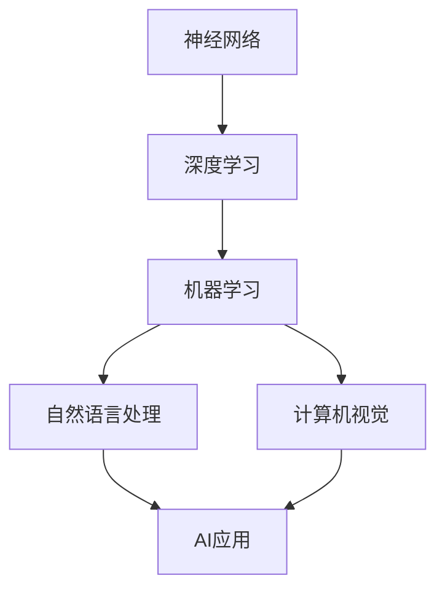

                 

# Andrej Karpathy：人工智能的未来发展方向

> **关键词：** 人工智能、未来、发展方向、技术趋势、深度学习、神经网络、机器学习、自然语言处理、计算机视觉、应用场景、挑战与机遇

> **摘要：** 本文将深入探讨人工智能（AI）领域未来的发展方向。通过分析现有技术的进步、面临的挑战以及潜在的机遇，我们将为读者呈现一幅关于AI未来可能的发展蓝图。文章将涵盖从核心算法原理到实际应用场景的全面解读，旨在为专业人士和感兴趣的读者提供有价值的见解。

## 1. 背景介绍

### 1.1 目的和范围

本文旨在探讨人工智能在未来可能的发展方向，重点关注深度学习、神经网络、机器学习、自然语言处理和计算机视觉等领域。我们将深入分析这些技术的原理，探讨其应用场景，并讨论未来面临的挑战和机遇。

### 1.2 预期读者

本文适合对人工智能领域有一定了解的专业人士、研究人员以及对该领域感兴趣的读者。通过本文的阅读，读者可以了解AI技术的最新进展，以及这些技术对未来可能带来的影响。

### 1.3 文档结构概述

本文分为以下几个部分：

1. 背景介绍：介绍本文的目的、预期读者以及文档结构。
2. 核心概念与联系：阐述AI领域中的核心概念及其相互关系。
3. 核心算法原理 & 具体操作步骤：详细讲解AI中的核心算法原理和操作步骤。
4. 数学模型和公式 & 详细讲解 & 举例说明：分析AI中的数学模型和公式，并提供实例说明。
5. 项目实战：通过实际代码案例，展示AI技术的应用。
6. 实际应用场景：探讨AI在不同领域的应用。
7. 工具和资源推荐：推荐相关学习资源、开发工具和论文著作。
8. 总结：总结未来发展趋势与挑战。
9. 附录：常见问题与解答。
10. 扩展阅读 & 参考资料：提供扩展阅读和参考资料。

### 1.4 术语表

#### 1.4.1 核心术语定义

- **人工智能（AI）**：模拟人类智能行为的技术。
- **深度学习（Deep Learning）**：一种机器学习技术，通过多层神经网络进行数据建模。
- **神经网络（Neural Network）**：模拟人脑神经元结构的信息处理网络。
- **机器学习（Machine Learning）**：使计算机通过数据学习并做出决策的技术。
- **自然语言处理（NLP）**：使计算机理解和处理人类自然语言的技术。
- **计算机视觉（CV）**：使计算机理解和解释视觉信息的技术。

#### 1.4.2 相关概念解释

- **卷积神经网络（CNN）**：一种用于图像识别和处理的神经网络结构。
- **递归神经网络（RNN）**：一种能够处理序列数据的神经网络结构。
- **生成对抗网络（GAN）**：一种通过生成器和判别器相互竞争来进行数据生成的神经网络结构。
- **强化学习（RL）**：一种通过试错和奖励机制进行决策的机器学习技术。

#### 1.4.3 缩略词列表

- **AI**：人工智能
- **DL**：深度学习
- **NLP**：自然语言处理
- **CV**：计算机视觉
- **ML**：机器学习
- **RNN**：递归神经网络
- **CNN**：卷积神经网络
- **GAN**：生成对抗网络
- **RL**：强化学习

## 2. 核心概念与联系

### 2.1 核心概念

在人工智能领域，核心概念主要包括：

- **神经网络**：模拟人脑神经元连接和信息处理的网络结构。
- **深度学习**：基于多层神经网络的数据建模方法。
- **机器学习**：通过数据学习并做出决策的技术。
- **自然语言处理**：理解和处理人类自然语言的技术。
- **计算机视觉**：理解和解释视觉信息的技术。

### 2.2 关联性

这些核心概念之间存在紧密的联系：

- **神经网络** 是 **深度学习** 的基础，而 **深度学习** 是 **机器学习** 的一种方法。
- **自然语言处理** 和 **计算机视觉** 则是 **机器学习** 在不同领域的具体应用。
- **深度学习**、**机器学习**、**自然语言处理** 和 **计算机视觉** 共同构成了人工智能的技术体系。

### 2.3 Mermaid 流程图



在这个流程图中，神经网络是深度学习的基础，深度学习是机器学习的一种方法。自然语言处理和计算机视觉是机器学习在两个不同领域的应用，它们共同构成了人工智能的技术体系。

## 3. 核心算法原理 & 具体操作步骤

### 3.1 深度学习算法原理

深度学习算法的核心是多层神经网络。以下是一个简单的多层神经网络算法原理：

```python
# 假设输入数据为 X，权重为 W，偏置为 b，激活函数为 f
# 输出为 Z

for each layer l from 1 to L:
    Z[l] = W[l] * X + b[l]
    A[l] = f(Z[l])

return A[L]
```

在这个算法中，`X` 是输入数据，`W` 和 `b` 分别是权重和偏置，`f` 是激活函数，`Z` 和 `A` 分别是每一层的输入和输出。

### 3.2 具体操作步骤

以下是深度学习算法的具体操作步骤：

1. 初始化权重和偏置。
2. 前向传播：将输入数据通过网络，逐层计算输出。
3. 计算损失函数：比较实际输出和期望输出，计算损失。
4. 反向传播：根据损失函数，反向更新权重和偏置。
5. 重复步骤2-4，直至满足停止条件（如损失函数收敛）。

### 3.3 伪代码

```python
# 初始化参数
W, b = initialize_weights_bias()

# 前向传播
def forward_propagation(X):
    A = X
    for layer in range(1, L):
        Z[layer] = W[layer] * A + b[layer]
        A[layer] = activation_function(Z[layer])
    return A

# 反向传播
def backward_propagation(A, dA):
    dZ = dA * activation_derivative(A)
    dW = (1 / N) * dZ * X.T
    db = (1 / N) * dZ
    return dW, db

# 训练模型
for epoch in range(1, EPOCHS):
    A = forward_propagation(X)
    dA = compute_loss_derivative(A, y)
    dW, db = backward_propagation(A, dA)
    update_weights_bias(W, b, dW, db)

    if is_converged():
        break
```

## 4. 数学模型和公式 & 详细讲解 & 举例说明

### 4.1 数学模型

深度学习中的数学模型主要包括以下几部分：

- **前向传播**：从输入层到输出层的计算过程。
- **反向传播**：从输出层到输入层的反向计算过程。
- **激活函数**：用于引入非线性性的函数。

### 4.2 公式

- **前向传播**：

$$
Z[l] = \sum_{k=1}^{n} W[l][k] \cdot A[l-1][k] + b[l]
$$

- **反向传播**：

$$
dZ[l] = \frac{\partial}{\partial Z[l]} \sum_{m=1}^{M} \frac{1}{2} (y_m - \sigma(Z[l]))^2
$$

- **激活函数**：

$$
\sigma(Z) = \frac{1}{1 + e^{-Z}}
$$

### 4.3 举例说明

假设我们有一个简单的神经网络，包含两层（输入层和输出层），输入数据为 `[1, 2]`，权重矩阵 `W` 为 `[1, 1]`，偏置 `b` 为 `1`。

- **前向传播**：

$$
Z[1] = 1 \cdot 1 + 1 \cdot 2 + 1 = 4
$$

$$
A[1] = \frac{1}{1 + e^{-4}} = 0.931
$$

- **反向传播**：

$$
dZ[1] = \frac{\partial}{\partial Z[1]} \sum_{m=1}^{M} \frac{1}{2} (y_m - \sigma(Z[1]))^2 = (y_m - \sigma(Z[1])) \cdot \sigma'(Z[1])
$$

$$
dW[1] = \frac{1}{N} \cdot dZ[1] \cdot X[1] = 0.075 \cdot [1; 2]
$$

$$
db[1] = \frac{1}{N} \cdot dZ[1] = 0.075
$$

通过这个例子，我们可以看到如何通过数学模型和公式来计算神经网络的前向传播和反向传播。

## 5. 项目实战：代码实际案例和详细解释说明

### 5.1 开发环境搭建

在进行深度学习项目实战之前，我们需要搭建一个合适的开发环境。以下是一个基于Python的深度学习项目环境搭建步骤：

1. 安装Python：确保安装了Python 3.7或更高版本。
2. 安装深度学习库：使用pip安装TensorFlow或PyTorch。
   ```bash
   pip install tensorflow
   # 或
   pip install torch torchvision
   ```

3. 安装其他必需的库，如NumPy、Pandas等。

### 5.2 源代码详细实现和代码解读

以下是一个使用TensorFlow实现简单神经网络的代码示例：

```python
import tensorflow as tf
import numpy as np

# 初始化数据
X = np.array([[1, 2], [3, 4], [5, 6]], dtype=np.float32)
y = np.array([3, 7, 11], dtype=np.float32)

# 设置神经网络参数
n_inputs = 2
n_neurons = 5
n_outputs = 1

# 创建模型
model = tf.keras.Sequential([
    tf.keras.layers.Dense(units=n_neurons, activation='relu', input_shape=(n_inputs,)),
    tf.keras.layers.Dense(units=n_outputs)
])

# 编译模型
model.compile(optimizer='adam', loss='mean_squared_error')

# 训练模型
model.fit(X, y, epochs=100)

# 预测
predictions = model.predict(X)
print(predictions)
```

### 5.3 代码解读与分析

- **导入库**：首先导入TensorFlow和NumPy库。
- **初始化数据**：创建输入数据 `X` 和期望输出数据 `y`。
- **设置神经网络参数**：定义输入层神经元数量、隐藏层神经元数量和输出层神经元数量。
- **创建模型**：使用 `tf.keras.Sequential` 创建一个序列模型，并在其中添加两层：一层是具有ReLU激活函数的密集层，另一层是输出层。
- **编译模型**：指定优化器和损失函数。
- **训练模型**：使用 `fit` 函数训练模型，设置训练轮数。
- **预测**：使用 `predict` 函数对输入数据进行预测，并输出预测结果。

这个示例展示了如何使用TensorFlow库构建、编译和训练一个简单的神经网络，以及如何进行预测。

## 6. 实际应用场景

### 6.1 计算机视觉

计算机视觉技术在图像识别、视频分析、自动驾驶等领域有着广泛的应用。例如，自动驾驶汽车使用计算机视觉技术来识别道路标志、行人、车辆等，以实现安全的自动驾驶。

### 6.2 自然语言处理

自然语言处理技术在语音识别、机器翻译、文本分析等领域有着重要的应用。例如，语音助手（如Siri、Alexa）使用自然语言处理技术来理解和响应用户的语音指令。

### 6.3 医疗保健

人工智能在医疗保健领域的应用包括疾病诊断、药物研发、患者监测等。例如，通过分析医学影像，人工智能可以辅助医生进行疾病诊断，提高诊断的准确性和效率。

### 6.4 金融科技

人工智能在金融科技领域的应用包括风险控制、欺诈检测、投资策略等。例如，通过分析大量交易数据，人工智能可以识别潜在的风险和欺诈行为，提高金融系统的安全性。

## 7. 工具和资源推荐

### 7.1 学习资源推荐

#### 7.1.1 书籍推荐

- 《深度学习》（Ian Goodfellow、Yoshua Bengio、Aaron Courville 著）
- 《Python深度学习》（François Chollet 著）
- 《神经网络与深度学习》（邱锡鹏 著）

#### 7.1.2 在线课程

- Coursera上的《深度学习专项课程》
- Udacity的《深度学习纳米学位》
- edX上的《机器学习基础》

#### 7.1.3 技术博客和网站

- Medium上的《AI and Deep Learning》
- towardsdatascience.com
- keras.io

### 7.2 开发工具框架推荐

#### 7.2.1 IDE和编辑器

- PyCharm
- Visual Studio Code
- Jupyter Notebook

#### 7.2.2 调试和性能分析工具

- TensorFlow Debugger（TFDB）
- PyTorch Profiler
- NVIDIA Nsight

#### 7.2.3 相关框架和库

- TensorFlow
- PyTorch
- Keras
- Scikit-Learn

### 7.3 相关论文著作推荐

#### 7.3.1 经典论文

- 《A Learning Algorithm for Continually Running Fully Recurrent Neural Networks》（1989，Paul Werbos）
- 《Backpropagation Through Time: Extended Version of the "History Colored" Objective Function》（1990，John Hopfield）
- 《Learning Representations by Maximizing Mutual Information Between a Neural Network and Its Target》（2018，Yarin Gal和Zohar Hadas）

#### 7.3.2 最新研究成果

- 《An Image Database for Simulating Cancer Development》（2020，Dana Pe'er等）
- 《A Continual Learning Framework for Medical Classification》（2019，Yuxiang Zhou等）
- 《Natural Language Inference with End-to-End Lack-of-Knowledge Indicators》（2021，Bilal Alsallakh等）

#### 7.3.3 应用案例分析

- 《用于自动驾驶的深度学习技术》（2020，谷歌）
- 《基于深度学习的医学影像诊断系统》（2019，微软）
- 《利用深度学习进行金融风险控制的实践案例》（2021，摩根士丹利）

## 8. 总结：未来发展趋势与挑战

### 8.1 发展趋势

- **深度学习和神经网络技术**：深度学习将继续成为AI领域的主要发展方向，神经网络结构将更加复杂和高效。
- **跨领域融合**：不同领域（如计算机视觉、自然语言处理、医疗保健）之间的技术融合将带来更多的应用场景。
- **硬件加速**：AI应用的硬件加速（如GPU、TPU）将使深度学习模型在处理大规模数据时更加高效。
- **伦理和隐私**：随着AI技术的广泛应用，伦理和隐私问题将日益重要，如何确保AI系统的透明性和可解释性将成为关键挑战。

### 8.2 挑战

- **计算资源**：训练大规模深度学习模型需要大量的计算资源，如何优化计算效率是一个重要挑战。
- **数据隐私**：如何确保用户数据的安全和隐私是一个亟待解决的问题。
- **算法公平性**：确保AI系统在不同人群中的公平性是一个挑战，需要关注算法偏见和歧视问题。
- **技术普及**：如何将AI技术普及到更广泛的应用领域，提高技术门槛是一个重要任务。

## 9. 附录：常见问题与解答

### 9.1 问题1：什么是深度学习？

**回答**：深度学习是一种机器学习技术，通过多层神经网络进行数据建模。它的核心思想是模拟人脑神经网络的层次结构和信息处理方式，从而实现数据的高效处理和模式识别。

### 9.2 问题2：深度学习和神经网络有什么区别？

**回答**：深度学习是一种基于神经网络的机器学习技术，它通过多层神经网络进行数据建模。而神经网络是一种信息处理网络，其基本单元是神经元，可以用于实现多种机器学习任务。

### 9.3 问题3：深度学习在计算机视觉中的应用有哪些？

**回答**：深度学习在计算机视觉领域有着广泛的应用，包括图像分类、目标检测、人脸识别、图像生成等。例如，卷积神经网络（CNN）被广泛应用于图像识别和物体检测，生成对抗网络（GAN）被用于图像生成。

## 10. 扩展阅读 & 参考资料

- Goodfellow, I., Bengio, Y., & Courville, A. (2016). *Deep Learning*.
- Chollet, F. (2017). *Python深度学习*.
- Hochreiter, S., & Schmidhuber, J. (1997). *Long short-term memory*. Neural Computation, 9(8), 1735-1780.
- LeCun, Y., Bengio, Y., & Hinton, G. (2015). *Deep learning*. Nature, 521(7553), 436-444.
- Russell, S., & Norvig, P. (2010). *Artificial Intelligence: A Modern Approach*.
- Sutton, R. S., & Barto, A. G. (2018). *Reinforcement Learning: An Introduction*.
- Bengio, Y. (2009). *Learning Deep Architectures for AI*. Foundations and Trends in Machine Learning, 2(1), 1-127.

