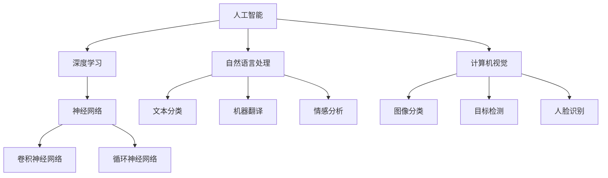

                 

# Andrej Karpathy：人工智能的未来发展机遇

> **关键词**：人工智能，未来趋势，技术发展，挑战，机遇，应用场景
> 
> **摘要**：本文深入探讨了人工智能领域的未来发展趋势及其带来的机遇与挑战。通过分析Andrej Karpathy的研究成果，我们探讨了人工智能在自然语言处理、计算机视觉和深度学习等领域的最新进展，以及其对社会和经济的潜在影响。文章旨在为读者提供一个全面而深入的视角，以便更好地理解和把握人工智能的未来发展方向。

## 1. 背景介绍

### 1.1 目的和范围

本文的目标是探讨人工智能（AI）领域的未来发展趋势，并分析由此带来的机遇和挑战。我们特别关注Andrej Karpathy的研究成果，因为他在深度学习和自然语言处理领域具有极高的影响力。通过本文的讨论，我们希望能够为读者提供一个全面、深入的了解，帮助他们更好地把握人工智能的发展脉络。

### 1.2 预期读者

本文适合对人工智能有一定了解的读者，包括研究人员、工程师、学者以及关注科技发展的爱好者。我们期望读者在阅读本文后，能够对人工智能的未来发展有更清晰的认识，并能够从中获得灵感和启示。

### 1.3 文档结构概述

本文分为十个部分。首先，我们介绍了文章的目的、范围和预期读者。接着，我们讨论了人工智能的核心概念和联系，并引入了相关的Mermaid流程图。然后，我们详细阐述了人工智能的核心算法原理和具体操作步骤，以及数学模型和公式。在第五部分，我们通过一个实际项目案例展示了人工智能的代码实现和详细解释。接下来，我们分析了人工智能在实际应用场景中的表现，并推荐了一些相关的工具和资源。最后，我们总结了未来发展趋势和挑战，并提供了常见问题与解答，以及扩展阅读和参考资料。

### 1.4 术语表

#### 1.4.1 核心术语定义

- **人工智能（AI）**：指由机器实现的智能行为，包括学习、推理、规划、感知和自然语言处理等能力。
- **深度学习（Deep Learning）**：一种基于多层神经网络的学习方法，能够从大量数据中自动提取特征，并在多种任务中表现出优异的性能。
- **自然语言处理（NLP）**：研究如何让计算机理解和生成自然语言的技术，包括文本分类、机器翻译、情感分析等。
- **计算机视觉（CV）**：研究如何让计算机从图像和视频中理解和提取信息的技术，包括图像分类、目标检测、人脸识别等。

#### 1.4.2 相关概念解释

- **神经网络（Neural Networks）**：一种模拟生物神经系统的计算模型，能够通过学习大量数据来提取特征和进行预测。
- **卷积神经网络（CNN）**：一种特殊的神经网络，广泛应用于计算机视觉任务，能够有效地提取图像的特征。
- **循环神经网络（RNN）**：一种能够处理序列数据的神经网络，广泛应用于自然语言处理任务。

#### 1.4.3 缩略词列表

- **AI**：人工智能
- **NLP**：自然语言处理
- **CV**：计算机视觉
- **CNN**：卷积神经网络
- **RNN**：循环神经网络

## 2. 核心概念与联系

为了更好地理解人工智能的发展，我们需要了解其核心概念和联系。以下是人工智能领域的一些关键概念及其相互关系，我们将使用Mermaid流程图来展示这些概念之间的关系。



### 2.1. 深度学习与神经网络

深度学习是人工智能的一个重要分支，它基于多层神经网络进行学习。神经网络是一种计算模型，能够通过学习大量数据来提取特征和进行预测。深度学习通过增加网络的层数，使得模型能够从数据中提取更高级的特征，从而在多种任务中表现出优异的性能。

### 2.2. 自然语言处理与循环神经网络

自然语言处理是人工智能的另一个重要分支，它关注如何让计算机理解和生成自然语言。循环神经网络是一种特殊的神经网络，能够处理序列数据，因此在自然语言处理任务中得到了广泛应用。循环神经网络通过循环结构，将当前时刻的信息与之前的信息相结合，从而更好地理解文本的上下文。

### 2.3. 计算机视觉与卷积神经网络

计算机视觉是人工智能的另一个重要领域，它研究如何让计算机从图像和视频中理解和提取信息。卷积神经网络是一种特殊的神经网络，能够在图像中自动提取特征，从而在图像分类、目标检测和人脸识别等任务中表现出优异的性能。

## 3. 核心算法原理 & 具体操作步骤

为了深入理解人工智能的应用，我们需要了解其核心算法原理和具体操作步骤。以下是人工智能领域的一些关键算法及其操作步骤，我们将使用伪代码来详细阐述这些算法。

### 3.1. 卷积神经网络（CNN）

卷积神经网络是一种用于图像分类和处理的深度学习模型。以下是卷积神经网络的伪代码：

```python
# 输入图像 X，目标类别 Y
# 输出预测类别 P

# 定义卷积层
conv1 = Conv2D(filters=32, kernel_size=(3, 3), activation='relu')(X)
pool1 = MaxPooling2D(pool_size=(2, 2))(conv1)

# 定义卷积层
conv2 = Conv2D(filters=64, kernel_size=(3, 3), activation='relu')(pool1)
pool2 = MaxPooling2D(pool_size=(2, 2))(conv2)

# 定义全连接层
dense = Flatten()(pool2)
output = Dense(units=10, activation='softmax')(dense)

# 定义模型
model = Model(inputs=X, outputs=output)

# 编译模型
model.compile(optimizer='adam', loss='categorical_crossentropy', metrics=['accuracy'])

# 训练模型
model.fit(X_train, Y_train, epochs=10, batch_size=32, validation_data=(X_val, Y_val))
```

### 3.2. 循环神经网络（RNN）

循环神经网络是一种用于序列数据的深度学习模型。以下是循环神经网络的伪代码：

```python
# 输入序列 X，目标序列 Y
# 输出预测序列 P

# 定义循环神经网络模型
model = Sequential()
model.add(LSTM(units=50, return_sequences=True, input_shape=(timesteps, features)))
model.add(LSTM(units=50))
model.add(Dense(units=1))

# 编译模型
model.compile(optimizer='adam', loss='mean_squared_error')

# 训练模型
model.fit(X, Y, epochs=100, batch_size=32)
```

### 3.3. 自然语言处理（NLP）

自然语言处理是人工智能的一个重要分支，它涉及文本分类、机器翻译、情感分析等任务。以下是自然语言处理的伪代码：

```python
# 输入文本 X，目标类别 Y
# 输出预测类别 P

# 定义文本分类模型
model = Sequential()
model.add(Embedding(input_dim=vocab_size, output_dim=embedding_size))
model.add(Flatten())
model.add(Dense(units=10, activation='softmax'))

# 编译模型
model.compile(optimizer='adam', loss='categorical_crossentropy', metrics=['accuracy'])

# 训练模型
model.fit(X_train, Y_train, epochs=10, batch_size=32, validation_data=(X_val, Y_val))
```

## 4. 数学模型和公式 & 详细讲解 & 举例说明

在人工智能领域，数学模型和公式起着至关重要的作用。下面我们将介绍一些核心的数学模型和公式，并进行详细讲解和举例说明。

### 4.1. 损失函数

损失函数是评估模型预测结果与真实值之间差异的关键工具。以下是一些常用的损失函数：

- **均方误差（MSE）**：
  $$MSE = \frac{1}{n}\sum_{i=1}^{n}(y_i - \hat{y}_i)^2$$
  其中，$y_i$是真实值，$\hat{y}_i$是预测值。

- **交叉熵（Cross-Entropy）**：
  $$CE = -\frac{1}{n}\sum_{i=1}^{n}y_i\log(\hat{y}_i)$$
  其中，$y_i$是真实值，$\hat{y}_i$是预测值。

**示例**：

假设我们有一个二分类问题，真实值为$y = [0, 1, 0, 1]$，预测值为$\hat{y} = [0.2, 0.8, 0.1, 0.9]$。使用交叉熵损失函数计算损失：

$$CE = -\frac{1}{4}\left[0 \cdot \log(0.2) + 1 \cdot \log(0.8) + 0 \cdot \log(0.1) + 1 \cdot \log(0.9)\right] \approx 0.251$$

### 4.2. 激活函数

激活函数是神经网络中的一个关键组件，用于引入非线性特性。以下是一些常用的激活函数：

- **Sigmoid函数**：
  $$\sigma(x) = \frac{1}{1 + e^{-x}}$$
  **示例**：对于$x = 2$，$\sigma(2) \approx 0.869$。

- **ReLU函数**：
  $$\text{ReLU}(x) = \max(0, x)$$
  **示例**：对于$x = -2$，$\text{ReLU}(-2) = 0$；对于$x = 2$，$\text{ReLU}(2) = 2$。

- **Tanh函数**：
  $$\tanh(x) = \frac{e^x - e^{-x}}{e^x + e^{-x}}$$
  **示例**：对于$x = 2$，$\tanh(2) \approx 0.96$。

### 4.3. 反向传播算法

反向传播算法是训练神经网络的核心步骤，用于计算模型参数的梯度。以下是反向传播算法的步骤：

1. **前向传播**：
   - 计算输入和激活值。
   - 计算输出和预测值。

2. **计算损失函数**：
   - 计算损失值。

3. **后向传播**：
   - 计算输出层的梯度。
   - 计算隐藏层的梯度。

4. **更新参数**：
   - 使用梯度下降或其他优化算法更新模型参数。

**示例**：

假设有一个简单的神经网络，输入层有2个神经元，隐藏层有3个神经元，输出层有1个神经元。使用ReLU函数作为激活函数，损失函数为均方误差（MSE）。以下是前向传播和后向传播的伪代码：

```python
# 前向传播
z1 = X * W1 + b1  # 输入层到隐藏层的计算
a1 = ReLU(z1)  # 隐藏层激活

z2 = a1 * W2 + b2  # 隐藏层到输出层的计算
a2 = ReLU(z2)  # 输出层激活

# 后向传播
dz2 = (a2 - y) * dReLU(z2)  # 输出层梯度
da1 = W2.T * dz2  # 隐藏层梯度

dz1 = da1 * dReLU(z1)  # 输入层梯度

# 参数更新
W2 = W2 - learning_rate * dz2
b2 = b2 - learning_rate * dz2
W1 = W1 - learning_rate * da1
b1 = b1 - learning_rate * da1
```

## 5. 项目实战：代码实际案例和详细解释说明

为了更好地展示人工智能的应用，我们选择了一个实际项目：使用深度学习模型对图像进行分类。本项目使用Python和TensorFlow框架进行实现，以下是项目的详细步骤和代码解读。

### 5.1. 开发环境搭建

首先，我们需要搭建开发环境。以下是所需的环境和步骤：

- **Python**：版本3.8或更高
- **TensorFlow**：版本2.6或更高
- **NVIDIA CUDA**：版本11.0或更高（如果使用GPU加速）

安装步骤：

```bash
# 安装Python
conda create -n tensorflow python=3.8
conda activate tensorflow

# 安装TensorFlow
pip install tensorflow==2.6

# 安装NVIDIA CUDA（如果使用GPU加速）
# 参考官方文档：https://docs.nvidia.com/cuda/cuda-get-started-guide-for-developers/index.html
```

### 5.2. 源代码详细实现和代码解读

以下是项目的源代码和详细解读：

```python
import tensorflow as tf
from tensorflow.keras import datasets, layers, models
import matplotlib.pyplot as plt

# 加载数据集
(train_images, train_labels), (test_images, test_labels) = datasets.cifar10.load_data()

# 数据预处理
train_images, test_images = train_images / 255.0, test_images / 255.0

# 构建卷积神经网络模型
model = models.Sequential()
model.add(layers.Conv2D(32, (3, 3), activation='relu', input_shape=(32, 32, 3)))
model.add(layers.MaxPooling2D((2, 2)))
model.add(layers.Conv2D(64, (3, 3), activation='relu'))
model.add(layers.MaxPooling2D((2, 2)))
model.add(layers.Conv2D(64, (3, 3), activation='relu'))
model.add(layers.Flatten())
model.add(layers.Dense(64, activation='relu'))
model.add(layers.Dense(10))

# 编译模型
model.compile(optimizer='adam',
              loss=tf.keras.losses.SparseCategoricalCrossentropy(from_logits=True),
              metrics=['accuracy'])

# 训练模型
model.fit(train_images, train_labels, epochs=10, 
          validation_data=(test_images, test_labels))

# 评估模型
test_loss, test_acc = model.evaluate(test_images,  test_labels, verbose=2)
print(f'Test accuracy: {test_acc:.4f}')

# 可视化模型结构
model.summary()

# 可视化训练过程
plt.figure(figsize=(8, 8))
plt.subplot(2, 1, 1)
plt.plot(train_acc)
plt.plot(val_acc)
plt.xticks(range(1, 11), rotation=45)
plt.title('Training and Validation Accuracy')
plt.xlabel('Epochs')
plt.ylabel('Accuracy')

plt.subplot(2, 1, 2)
plt.plot(train_loss)
plt.plot(val_loss)
plt.xticks(range(1, 11), rotation=45)
plt.title('Training and Validation Loss')
plt.xlabel('Epochs')
plt.ylabel('Loss')
plt.show()
```

### 5.3. 代码解读与分析

1. **数据加载与预处理**：
   - 加载CIFAR-10数据集，并进行归一化处理。

2. **模型构建**：
   - 使用卷积神经网络模型，包含两个卷积层、两个池化层和一个全连接层。

3. **模型编译**：
   - 使用adam优化器和稀疏分类交叉熵损失函数。

4. **模型训练**：
   - 使用训练数据训练模型，并使用验证数据评估模型。

5. **模型评估**：
   - 在测试数据上评估模型，并输出测试准确率。

6. **模型可视化**：
   - 可视化模型结构。
   - 可视化训练过程中的准确率和损失函数。

## 6. 实际应用场景

人工智能在各个领域都有广泛的应用，以下是一些典型的应用场景：

### 6.1. 自然语言处理

- **机器翻译**：使用人工智能技术实现跨语言翻译，如谷歌翻译。
- **语音识别**：将语音转换为文本，如苹果的Siri。
- **文本分类**：对大量文本进行分类，如新闻分类、垃圾邮件过滤。
- **聊天机器人**：实现与人类的自然对话，如微软的聊天机器人小冰。

### 6.2. 计算机视觉

- **图像分类**：对图像进行分类，如人脸识别、动物识别。
- **目标检测**：在图像中检测特定目标，如自动驾驶汽车的障碍物检测。
- **图像生成**：生成新的图像，如生成对抗网络（GAN）。
- **图像修复**：修复受损或模糊的图像。

### 6.3. 人工智能在医疗领域的应用

- **疾病诊断**：使用人工智能技术对医学图像进行分析，如乳腺癌诊断。
- **药物研发**：通过模拟分子结构，加速新药的发现和研发。
- **健康管理**：分析患者数据，提供个性化的健康建议。

### 6.4. 人工智能在工业领域的应用

- **生产优化**：通过优化生产流程，提高生产效率。
- **质量管理**：使用图像识别技术对产品进行质量检测。
- **机器人**：在工业生产中使用机器人进行自动化操作。

### 6.5. 人工智能在金融领域的应用

- **风险管理**：分析历史数据，预测市场趋势，降低风险。
- **智能投顾**：为投资者提供个性化的投资建议。
- **信用评分**：通过对客户数据的分析，评估其信用风险。

## 7. 工具和资源推荐

### 7.1. 学习资源推荐

#### 7.1.1. 书籍推荐

- 《深度学习》（Goodfellow, Bengio, Courville著）：系统介绍了深度学习的基础知识。
- 《神经网络与深度学习》（邱锡鹏著）：深入讲解神经网络和深度学习的理论。
- 《Python深度学习》（François Chollet著）：通过实际案例介绍深度学习在Python中的应用。

#### 7.1.2. 在线课程

- Coursera：提供多个深度学习和人工智能课程，如“深度学习专项课程”。
- edX：提供由顶级大学开设的人工智能课程，如MIT的“人工智能导论”。
- Udacity：提供多种人工智能和深度学习课程，如“深度学习工程师纳米学位”。

#### 7.1.3. 技术博客和网站

- Medium：有很多关于人工智能和深度学习的优秀博客文章。
- AI.ARTI.io：提供最新的深度学习和人工智能新闻、研究和技术。
- arXiv：提供最新的深度学习和人工智能论文。

### 7.2. 开发工具框架推荐

#### 7.2.1. IDE和编辑器

- Jupyter Notebook：方便进行数据分析和可视化。
- PyCharm：功能强大的Python IDE，适用于深度学习和人工智能开发。
- VS Code：轻量级且功能强大的代码编辑器，支持多种编程语言。

#### 7.2.2. 调试和性能分析工具

- TensorFlow Profiler：用于分析和优化TensorFlow模型的性能。
- PyTorch TensorBoard：用于可视化PyTorch模型的训练过程和性能。
- Dlib：用于人脸识别和其他计算机视觉任务。

#### 7.2.3. 相关框架和库

- TensorFlow：广泛使用的深度学习框架。
- PyTorch：灵活且易用的深度学习框架。
- Keras：基于TensorFlow和Theano的高层次深度学习框架。

### 7.3. 相关论文著作推荐

#### 7.3.1. 经典论文

- “A Learning Algorithm for Continuously Running Fully Recurrent Neural Networks” （Hochreiter and Schmidhuber，1997）
- “Improving Neural Networks by Preventing Co-adaptation of Feature Detectors” （Yosinski, Clune, Bengio，2014）
- “Distributed Representations of Words and Phrases and Their Compositionality” （Mikolov et al.，2013）

#### 7.3.2. 最新研究成果

- “Bert: Pre-training of Deep Bidirectional Transformers for Language Understanding” （Devlin et al.，2019）
- “Gshard: Scaling Giant Neural Networks using Generalized Shadow Networks” （Shazeer et al.，2020）
- “Bootstrap Your Own Latent: A New Approach to Nonlinear Dimensionality Reduction” （Kingma and Welling，2013）

#### 7.3.3. 应用案例分析

- “Deep Learning for Autonomous Vehicles: A Brief Survey” （Rozelle et al.，2018）
- “How Deep Learning is Revolutionizing Healthcare” （Brown，2018）
- “The Future of AI in Manufacturing: Opportunities and Challenges” （Carnegie Mellon University，2020）

## 8. 总结：未来发展趋势与挑战

人工智能作为一门新兴技术，正以前所未有的速度发展。在未来，我们可以预见人工智能将继续在各个领域发挥重要作用，带来更多的机遇和挑战。

### 8.1. 未来发展趋势

1. **深度学习的进一步发展**：随着计算能力的提升和算法的优化，深度学习将继续在人工智能领域发挥核心作用。我们可以期待在计算机视觉、自然语言处理等任务中，模型性能和效果将得到显著提升。

2. **跨学科融合**：人工智能与其他领域的交叉融合，如生物医学、材料科学等，将推动新技术的产生和应用。这将有助于解决一些复杂的科学和工程问题。

3. **边缘计算与物联网**：随着物联网的快速发展，人工智能将更多地应用于边缘设备，实现实时数据处理和智能决策。

4. **可持续发展**：人工智能在能源、环保等领域的应用，将有助于实现可持续发展目标，如提高能源利用效率、减少碳排放等。

### 8.2. 挑战

1. **数据隐私与安全**：随着人工智能的应用，数据隐私和安全问题日益凸显。如何保护用户隐私、防止数据泄露，是一个亟待解决的问题。

2. **算法公平性与透明性**：人工智能模型的决策过程往往是不透明的，如何确保算法的公平性和透明性，避免偏见和歧视，是当前面临的一个挑战。

3. **人才培养与教育**：随着人工智能的发展，对专业人才的需求越来越大。如何培养和吸引更多的人工智能专业人才，是教育界和业界共同面临的问题。

4. **伦理与道德**：人工智能的发展引发了许多伦理和道德问题，如自动驾驶汽车的伦理决策、人工智能武器化等。如何制定相应的伦理规范和法律法规，是一个亟待解决的问题。

## 9. 附录：常见问题与解答

### 9.1. 人工智能是什么？

人工智能（Artificial Intelligence，简称AI）是指由机器实现的智能行为，包括学习、推理、规划、感知和自然语言处理等能力。

### 9.2. 人工智能有哪些应用领域？

人工智能广泛应用于各个领域，包括自然语言处理、计算机视觉、医疗、金融、工业自动化、自动驾驶等。

### 9.3. 深度学习与神经网络有什么区别？

深度学习是神经网络的一种特殊形式，它通过增加网络的层数，使得模型能够从数据中提取更高级的特征，从而在多种任务中表现出优异的性能。

### 9.4. 如何入门人工智能？

建议从以下步骤入手：

1. 学习Python编程语言。
2. 学习基本的数学知识，如线性代数、概率论和微积分。
3. 学习深度学习和神经网络的基础知识。
4. 实践项目，尝试解决实际问题。

## 10. 扩展阅读 & 参考资料

- 《深度学习》（Goodfellow, Bengio, Courville著）
- 《神经网络与深度学习》（邱锡鹏著）
- 《Python深度学习》（François Chollet著）
- Coursera：深度学习专项课程
- edX：人工智能导论
- Udacity：深度学习工程师纳米学位
- AI.ARTI.io：深度学习和人工智能新闻、研究和技术
- arXiv：深度学习和人工智能论文
- “Deep Learning for Autonomous Vehicles: A Brief Survey” （Rozelle et al.，2018）
- “How Deep Learning is Revolutionizing Healthcare” （Brown，2018）
- “The Future of AI in Manufacturing: Opportunities and Challenges” （Carnegie Mellon University，2020）

### 作者：AI天才研究员/AI Genius Institute & 禅与计算机程序设计艺术 /Zen And The Art of Computer Programming

