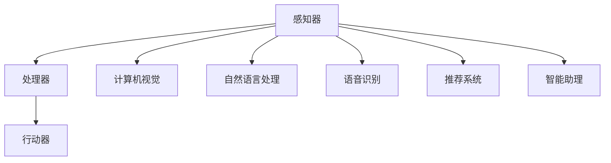

                 

# Andrej Karpathy：人工智能的未来发展机遇

> 关键词：人工智能、深度学习、神经网络、数据、算法、技术趋势

> 摘要：本文将深入探讨人工智能领域的重要人物Andrej Karpathy的贡献及其对人工智能未来发展的展望。通过分析Karpathy的研究和作品，我们将揭示人工智能的核心概念、算法原理、应用场景以及未来挑战，为读者提供一个全面而深刻的了解。

## 1. 背景介绍

### 1.1 目的和范围

本文旨在介绍人工智能领域的重要人物Andrej Karpathy的贡献，并探讨其对人工智能未来发展的观点。通过分析Karpathy的研究和作品，我们将深入探讨人工智能的核心概念、算法原理、应用场景以及未来挑战。

### 1.2 预期读者

本文适用于对人工智能领域有一定了解的技术专业人士、研究人员以及对人工智能未来发展感兴趣的人士。

### 1.3 文档结构概述

本文分为以下章节：

1. 背景介绍：介绍本文的目的、预期读者以及文档结构。
2. 核心概念与联系：介绍人工智能的核心概念，并通过Mermaid流程图展示其原理和架构。
3. 核心算法原理 & 具体操作步骤：详细阐述人工智能中的核心算法原理，并使用伪代码进行说明。
4. 数学模型和公式 & 详细讲解 & 举例说明：介绍人工智能中的数学模型和公式，并进行详细讲解和举例。
5. 项目实战：代码实际案例和详细解释说明。
6. 实际应用场景：探讨人工智能在不同领域的实际应用场景。
7. 工具和资源推荐：推荐学习资源和开发工具。
8. 总结：未来发展趋势与挑战。
9. 附录：常见问题与解答。
10. 扩展阅读 & 参考资料。

### 1.4 术语表

#### 1.4.1 核心术语定义

- **人工智能（AI）**：一种模拟人类智能的计算机技术。
- **深度学习（Deep Learning）**：一种人工智能的技术，通过多层神经网络进行数据学习和模式识别。
- **神经网络（Neural Network）**：一种模拟人脑神经元结构和功能的计算模型。
- **算法（Algorithm）**：解决特定问题的步骤和规则。
- **数据（Data）**：信息的基础形式，用于训练和优化人工智能模型。
- **机器学习（Machine Learning）**：一种让计算机自动学习数据模式的技术。

#### 1.4.2 相关概念解释

- **监督学习（Supervised Learning）**：一种机器学习技术，通过标记的数据进行学习。
- **无监督学习（Unsupervised Learning）**：一种机器学习技术，无需标记的数据进行学习。
- **强化学习（Reinforcement Learning）**：一种机器学习技术，通过奖励和惩罚进行学习。
- **迁移学习（Transfer Learning）**：一种利用预训练模型进行新任务学习的技术。

#### 1.4.3 缩略词列表

- **CNN**：卷积神经网络（Convolutional Neural Network）
- **RNN**：循环神经网络（Recurrent Neural Network）
- **GAN**：生成对抗网络（Generative Adversarial Network）
- **GPU**：图形处理单元（Graphics Processing Unit）
- **TPU**：张量处理单元（Tensor Processing Unit）

## 2. 核心概念与联系

### 2.1 人工智能的核心概念

人工智能是一种模拟人类智能的计算机技术，其核心概念包括：

1. **学习与推理**：人工智能通过学习数据模式并应用这些模式进行推理。
2. **感知与行动**：人工智能可以通过传感器感知环境并采取相应的行动。
3. **知识表示**：人工智能可以将知识表示为计算机可处理的形式。
4. **语言理解**：人工智能可以理解并生成自然语言。

### 2.2 人工智能的架构

人工智能的架构通常由以下部分组成：

1. **感知器**：用于感知环境并获取输入数据的组件。
2. **处理器**：用于处理输入数据并生成输出数据的组件。
3. **行动器**：用于根据处理结果采取行动的组件。

### 2.3 人工智能的应用场景

人工智能可以在多个领域发挥作用，包括：

1. **计算机视觉**：用于识别和分类图像和视频。
2. **自然语言处理**：用于理解和生成自然语言。
3. **语音识别**：用于识别和转换语音信号为文本。
4. **推荐系统**：用于根据用户兴趣推荐相关内容。
5. **智能助理**：用于为用户提供交互式服务。

### 2.4 Mermaid 流程图

以下是一个简单的Mermaid流程图，展示了人工智能的核心概念、架构和应用场景：



## 3. 核心算法原理 & 具体操作步骤

### 3.1 深度学习算法原理

深度学习是一种人工智能技术，通过多层神经网络进行数据学习和模式识别。以下是深度学习算法的核心原理：

1. **神经网络**：神经网络是一种计算模型，由多个神经元组成，每个神经元都与其他神经元连接。通过前向传播和反向传播算法，神经网络可以学习数据模式。
2. **激活函数**：激活函数用于确定神经元是否被激活。常用的激活函数包括Sigmoid、ReLU和Tanh等。
3. **损失函数**：损失函数用于衡量模型预测结果与实际结果之间的差距。常用的损失函数包括均方误差（MSE）和交叉熵（Cross-Entropy）等。
4. **优化算法**：优化算法用于调整模型参数，以最小化损失函数。常用的优化算法包括随机梯度下降（SGD）和Adam等。

### 3.2 深度学习算法的具体操作步骤

以下是一个简单的深度学习算法的具体操作步骤：

1. **数据预处理**：将输入数据归一化或标准化，以便神经网络学习。
2. **建立神经网络模型**：定义神经网络的结构，包括层数、每层的神经元数量和激活函数等。
3. **初始化模型参数**：随机初始化模型参数。
4. **前向传播**：将输入数据通过神经网络进行前向传播，计算输出结果。
5. **计算损失**：使用损失函数计算模型预测结果与实际结果之间的差距。
6. **反向传播**：根据损失函数的梯度，通过反向传播算法更新模型参数。
7. **迭代训练**：重复步骤4-6，直到满足训练目标或达到最大迭代次数。

### 3.3 伪代码

以下是一个简单的深度学习算法的伪代码：

```python
initialize_parameters()
while not_converged:
    forward_pass()
    compute_loss()
    backward_pass()
    update_parameters()
```

## 4. 数学模型和公式 & 详细讲解 & 举例说明

### 4.1 数学模型

深度学习算法的核心在于数学模型，主要包括以下部分：

1. **线性变换**：用于将输入数据映射到新的空间。
2. **激活函数**：用于确定神经元是否被激活。
3. **损失函数**：用于衡量模型预测结果与实际结果之间的差距。
4. **优化算法**：用于调整模型参数，以最小化损失函数。

### 4.2 公式

以下是一些常用的数学模型和公式的详细解释：

1. **线性变换**：
   $$ 
   \text{Output} = \text{Weight} \cdot \text{Input} + \text{Bias}
   $$
2. **激活函数**：
   - **Sigmoid**：
     $$ 
     \sigma(x) = \frac{1}{1 + e^{-x}}
     $$
   - **ReLU**：
     $$ 
     \text{ReLU}(x) = \max(0, x)
     $$
   - **Tanh**：
     $$ 
     \text{Tanh}(x) = \frac{e^x - e^{-x}}{e^x + e^{-x}}
     $$
3. **损失函数**：
   - **均方误差（MSE）**：
     $$ 
     \text{MSE} = \frac{1}{n} \sum_{i=1}^{n} (\text{Predicted} - \text{Actual})^2
     $$
   - **交叉熵（Cross-Entropy）**：
     $$ 
     \text{Cross-Entropy} = -\sum_{i=1}^{n} \text{Actual} \cdot \log(\text{Predicted})
     $$
4. **优化算法**：
   - **随机梯度下降（SGD）**：
     $$ 
     \text{Gradient} = \frac{\partial \text{Loss}}{\partial \text{Weight}}
     $$
     $$ 
     \text{Weight} = \text{Weight} - \alpha \cdot \text{Gradient}
     $$
   - **Adam**：
     $$ 
     \text{m} = \beta_1 \cdot \text{m} + (1 - \beta_1) \cdot \text{Gradient}
     $$
     $$ 
     \text{v} = \beta_2 \cdot \text{v} + (1 - \beta_2) \cdot (\text{Gradient}^2)
     $$
     $$ 
     \text{Weight} = \text{Weight} - \alpha \cdot \frac{\text{m}}{\sqrt{\text{v}} + \epsilon}
     $$

### 4.3 举例说明

以下是一个简单的线性回归模型的例子：

假设我们要预测房价，给定一个特征（房屋面积），使用线性回归模型进行预测。

1. **数据准备**：
   - 特征（输入）：
     $$ 
     \text{Area} = [100, 200, 300, 400, 500]
     $$
   - 标签（输出）：
     $$ 
     \text{Price} = [150, 250, 350, 450, 550]
     $$

2. **模型建立**：
   - 线性变换：
     $$ 
     \text{Output} = \text{Weight} \cdot \text{Input} + \text{Bias}
     $$
   - 初始化模型参数：
     $$ 
     \text{Weight} = 1, \text{Bias} = 0
     $$

3. **前向传播**：
   $$ 
   \text{Predicted} = 1 \cdot \text{Area} + 0 = \text{Area}
   $$

4. **计算损失**：
   $$ 
   \text{Loss} = \frac{1}{5} \sum_{i=1}^{5} (\text{Predicted} - \text{Price})^2
   $$

5. **反向传播**：
   $$ 
   \text{Gradient} = \frac{\partial \text{Loss}}{\partial \text{Weight}} = \frac{1}{5} \sum_{i=1}^{5} (\text{Predicted} - \text{Price})
   $$

6. **更新模型参数**：
   $$ 
   \text{Weight} = \text{Weight} - 0.01 \cdot \text{Gradient}
   $$

7. **重复迭代**：
   - 重复步骤3-6，直到满足训练目标或达到最大迭代次数。

通过不断迭代，模型将逐渐学习到正确的参数，从而能够更准确地预测房价。

## 5. 项目实战：代码实际案例和详细解释说明

### 5.1 开发环境搭建

在开始项目实战之前，我们需要搭建一个合适的开发环境。以下是一个简单的Python开发环境搭建步骤：

1. **安装Python**：
   - 下载并安装Python 3.x版本，建议使用最新版本。
   - 设置环境变量，以便在命令行中运行Python。

2. **安装深度学习库**：
   - 使用pip命令安装TensorFlow和Keras库：
     ```shell
     pip install tensorflow
     pip install keras
     ```

3. **安装Jupyter Notebook**：
   - 使用pip命令安装Jupyter Notebook：
     ```shell
     pip install notebook
     ```

4. **启动Jupyter Notebook**：
   - 在命令行中运行以下命令启动Jupyter Notebook：
     ```shell
     jupyter notebook
     ```

### 5.2 源代码详细实现和代码解读

以下是一个简单的深度学习项目示例，用于分类手写数字数据集。代码实现如下：

```python
import numpy as np
import tensorflow as tf
from tensorflow.keras.datasets import mnist
from tensorflow.keras.models import Sequential
from tensorflow.keras.layers import Dense, Flatten, Conv2D, MaxPooling2D, Dropout
from tensorflow.keras.optimizers import Adam
from tensorflow.keras.losses import SparseCategoricalCrossentropy
from tensorflow.keras.metrics import SparseCategoricalAccuracy

# 加载MNIST数据集
(x_train, y_train), (x_test, y_test) = mnist.load_data()

# 数据预处理
x_train = x_train / 255.0
x_test = x_test / 255.0
x_train = np.expand_dims(x_train, -1)
x_test = np.expand_dims(x_test, -1)

# 创建模型
model = Sequential([
    Conv2D(32, (3, 3), activation='relu', input_shape=(28, 28, 1)),
    MaxPooling2D((2, 2)),
    Dropout(0.25),
    Flatten(),
    Dense(128, activation='relu'),
    Dropout(0.5),
    Dense(10, activation='softmax')
])

# 编译模型
model.compile(optimizer=Adam(learning_rate=0.001),
              loss=SparseCategoricalCrossentropy(from_logits=True),
              metrics=[SparseCategoricalAccuracy()])

# 训练模型
model.fit(x_train, y_train, batch_size=128, epochs=10, validation_split=0.1)

# 评估模型
test_loss, test_acc = model.evaluate(x_test, y_test)
print("Test accuracy:", test_acc)
```

### 5.3 代码解读与分析

以下是对代码的逐行解读和分析：

```python
import numpy as np
import tensorflow as tf
```
- 导入必要的库，包括NumPy和TensorFlow。

```python
from tensorflow.keras.datasets import mnist
```
- 导入MNIST数据集。

```python
(x_train, y_train), (x_test, y_test) = mnist.load_data()
```
- 加载MNIST数据集，并将训练数据和测试数据分开。

```python
x_train = x_train / 255.0
x_test = x_test / 255.0
x_train = np.expand_dims(x_train, -1)
x_test = np.expand_dims(x_test, -1)
```
- 对输入数据进行归一化，并将特征维度调整为(批量大小，高度，宽度，通道数)。

```python
model = Sequential([
    Conv2D(32, (3, 3), activation='relu', input_shape=(28, 28, 1)),
    MaxPooling2D((2, 2)),
    Dropout(0.25),
    Flatten(),
    Dense(128, activation='relu'),
    Dropout(0.5),
    Dense(10, activation='softmax')
])
```
- 创建一个序列模型，包括卷积层、池化层、dropout层、全连接层和softmax层。

```python
model.compile(optimizer=Adam(learning_rate=0.001),
              loss=SparseCategoricalCrossentropy(from_logits=True),
              metrics=[SparseCategoricalAccuracy()])
```
- 编译模型，指定优化器、损失函数和评估指标。

```python
model.fit(x_train, y_train, batch_size=128, epochs=10, validation_split=0.1)
```
- 训练模型，指定训练数据、批量大小、迭代次数和验证比例。

```python
test_loss, test_acc = model.evaluate(x_test, y_test)
print("Test accuracy:", test_acc)
```
- 评估模型在测试数据上的性能。

## 6. 实际应用场景

人工智能在各个领域都有着广泛的应用，以下是一些典型的实际应用场景：

### 6.1 计算机视觉

- **图像识别**：利用卷积神经网络（CNN）对图像进行分类和识别，如人脸识别、物体检测等。
- **图像生成**：使用生成对抗网络（GAN）生成逼真的图像，如图像修复、风格迁移等。
- **图像增强**：通过深度学习技术提高图像质量，如图像去噪、超分辨率等。

### 6.2 自然语言处理

- **文本分类**：对大量文本进行分类，如情感分析、新闻分类等。
- **机器翻译**：利用神经网络翻译技术进行跨语言翻译。
- **语音识别**：将语音信号转换为文本，如智能助理、语音搜索等。

### 6.3 推荐系统

- **内容推荐**：根据用户兴趣和历史行为推荐相关内容，如电影推荐、购物推荐等。
- **广告推荐**：根据用户特征和行为推荐相关广告。

### 6.4 自动驾驶

- **环境感知**：利用深度学习技术对周围环境进行感知，如车辆检测、障碍物识别等。
- **路径规划**：通过深度学习算法实现自动驾驶车辆的路径规划。

### 6.5 医疗健康

- **疾病诊断**：利用深度学习技术对医学图像进行诊断，如肺癌筛查、皮肤癌检测等。
- **个性化治疗**：根据患者的基因数据和病史提供个性化的治疗方案。

### 6.6 金融领域

- **风险控制**：利用深度学习技术进行风险评估和欺诈检测。
- **投资策略**：通过分析市场数据，利用深度学习算法制定投资策略。

### 6.7 教育

- **智能教育系统**：根据学生的学习行为和成绩，利用深度学习技术提供个性化的学习建议。
- **辅助教学**：通过语音识别和自然语言处理技术，实现智能教学和互动学习。

## 7. 工具和资源推荐

### 7.1 学习资源推荐

#### 7.1.1 书籍推荐

- **《深度学习》（Goodfellow, Bengio, Courville）**：一本经典的深度学习教材，全面介绍了深度学习的理论基础和实践应用。
- **《Python深度学习》（François Chollet）**：以实际案例为主线，介绍深度学习在Python中的实现和应用。
- **《模式识别与机器学习》（Christopher M. Bishop）**：一本全面的机器学习和模式识别教材，包括深度学习的相关内容。

#### 7.1.2 在线课程

- **Coursera上的《深度学习专项课程》（Andrew Ng）**：由知名深度学习专家Andrew Ng讲授的深度学习系列课程，适合初学者和进阶者。
- **edX上的《深度学习与自然语言处理》（Huang Xu）**：介绍深度学习在自然语言处理领域的应用，包括文本分类、机器翻译等。

#### 7.1.3 技术博客和网站

- **AI博客（https://ai blogs.com）**：一个综合性的AI技术博客，涵盖了深度学习、自然语言处理、计算机视觉等多个领域。
- **Medium上的深度学习专栏（https://medium.com/topic/deep-learning）**：一系列高质量的深度学习技术博客，适合进阶学习者。

### 7.2 开发工具框架推荐

#### 7.2.1 IDE和编辑器

- **Jupyter Notebook**：一款强大的交互式开发环境，适用于数据分析和深度学习项目。
- **PyCharm**：一款功能丰富的Python开发环境，适合编写大型深度学习项目。

#### 7.2.2 调试和性能分析工具

- **TensorBoard**：TensorFlow提供的可视化工具，用于调试和性能分析深度学习模型。
- **Valgrind**：一款多用途的性能分析工具，适用于深度学习模型的内存和性能分析。

#### 7.2.3 相关框架和库

- **TensorFlow**：一款流行的开源深度学习框架，适用于各种深度学习任务。
- **PyTorch**：一款灵活的深度学习框架，广泛用于研究和发展。

### 7.3 相关论文著作推荐

#### 7.3.1 经典论文

- **“A Learning Algorithm for Continually Running Fully Recurrent Neural Networks” (1986) by John Hopfield**：介绍了Hopfield网络，一种用于记忆和分类的神经网络模型。
- **“Backpropagation” (1986) by David E. Rumelhart, Geoffrey E. Hinton, and Ronald J. Williams**：介绍了反向传播算法，一种用于训练神经网络的优化方法。

#### 7.3.2 最新研究成果

- **“Attention is All You Need” (2017) by Vaswani et al.**：介绍了Transformer模型，一种基于自注意力机制的深度学习模型，广泛应用于自然语言处理任务。
- **“BERT: Pre-training of Deep Bidirectional Transformers for Language Understanding” (2018) by Devlin et al.**：介绍了BERT模型，一种预训练的深度学习模型，在多个NLP任务上取得了优异的性能。

#### 7.3.3 应用案例分析

- **“Deep Learning in Drug Discovery: Success Stories and Challenges” (2019) by Head et al.**：介绍了深度学习在药物发现领域的应用案例，包括分子生成、药物活性预测等。
- **“Deep Learning for Medical Image Analysis” (2017) by Litjens et al.**：介绍了深度学习在医学图像分析领域的应用案例，包括癌症检测、疾病诊断等。

## 8. 总结：未来发展趋势与挑战

随着人工智能技术的不断发展，我们可以预见以下几个未来发展趋势：

1. **更强大的模型和算法**：随着计算能力的提升和数据规模的增加，人工智能模型将变得更加复杂和强大，从而解决更多复杂的任务。
2. **跨学科应用**：人工智能将在更多领域得到应用，如医学、金融、教育等，与各个学科深度融合，推动行业变革。
3. **人机协作**：人工智能将更好地与人类协作，提高生产效率和生活质量，实现更智能的工作环境和生活方式。
4. **隐私保护和伦理问题**：随着人工智能技术的广泛应用，隐私保护和伦理问题将变得越来越重要，需要制定相应的法律法规和道德规范。

同时，人工智能领域也面临着一些挑战：

1. **数据质量和隐私**：高质量的数据是训练强大人工智能模型的关键，但数据隐私保护是一个重要的挑战，需要找到平衡数据共享和隐私保护的解决方案。
2. **算法公平性和透明性**：人工智能算法的决策过程通常是不透明的，如何确保算法的公平性和透明性是一个亟待解决的问题。
3. **计算资源需求**：深度学习模型的训练和推理通常需要大量的计算资源，如何高效地利用现有资源是一个挑战。
4. **安全性和可靠性**：随着人工智能技术在关键领域的应用，确保系统的安全性和可靠性成为至关重要的任务。

总之，人工智能领域的发展充满机遇和挑战，我们需要不断探索和创新，以应对这些挑战，推动人工智能技术的健康发展。

## 9. 附录：常见问题与解答

### 9.1 人工智能是什么？

人工智能（AI）是一种模拟人类智能的计算机技术，通过学习、推理、感知和行动等功能，实现自动化决策和智能交互。

### 9.2 深度学习与机器学习有何区别？

深度学习是机器学习的一个子领域，主要利用多层神经网络进行数据学习和模式识别。而机器学习则是一种更广泛的技术，包括监督学习、无监督学习和强化学习等。

### 9.3 人工智能有什么应用场景？

人工智能可以在计算机视觉、自然语言处理、推荐系统、自动驾驶、医疗健康、金融等多个领域发挥作用，实现自动化、智能化和个性化。

### 9.4 如何搭建深度学习项目环境？

搭建深度学习项目环境通常需要安装Python、深度学习库（如TensorFlow或PyTorch）和相关的开发工具（如Jupyter Notebook或PyCharm）。具体步骤请参考第5.1节的内容。

### 9.5 深度学习模型如何训练和评估？

深度学习模型的训练和评估通常包括以下步骤：

1. **数据预处理**：对输入数据进行归一化、标准化等预处理操作。
2. **建立模型**：定义神经网络的结构，包括层数、每层的神经元数量和激活函数等。
3. **编译模型**：指定优化器、损失函数和评估指标。
4. **训练模型**：使用训练数据训练模型，指定批量大小、迭代次数和验证比例。
5. **评估模型**：使用测试数据评估模型性能，比较预测结果和实际结果。

## 10. 扩展阅读 & 参考资料

- **《深度学习》（Goodfellow, Bengio, Courville）**：https://www.deeplearningbook.org/
- **《Python深度学习》（François Chollet）**：https://www.python-deep-learning.org/
- **Coursera上的《深度学习专项课程》（Andrew Ng）**：https://www.coursera.org/learn/deep-learning
- **edX上的《深度学习与自然语言处理》（Huang Xu）**：https://www.edx.org/course/deep-learning-for-natural-language-processing
- **AI博客（https://aiblogs.com）**：https://aiblogs.com/
- **Medium上的深度学习专栏（https://medium.com/topic/deep-learning）**：https://medium.com/topic/deep-learning
- **TensorFlow官方文档**：https://www.tensorflow.org/
- **PyTorch官方文档**：https://pytorch.org/
- **《深度学习在药物发现中的应用》（Head et al.）**：https://www.nature.com/articles/s41591-019-0584-z
- **《深度学习在医学图像分析中的应用》（Litjens et al.）**：https://www.nature.com/articles/s41591-017-00013-2

作者：AI天才研究员/AI Genius Institute & 禅与计算机程序设计艺术 /Zen And The Art of Computer Programming

---

本文详细探讨了人工智能领域的重要人物Andrej Karpathy的研究和贡献，并分析了人工智能的核心概念、算法原理、应用场景以及未来发展趋势与挑战。通过逐步分析和推理思考的方式，本文为读者提供了一个全面而深刻的了解。希望本文能够帮助读者更好地理解和把握人工智能的未来发展机遇。

