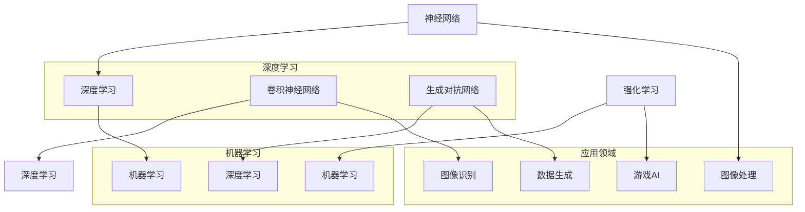
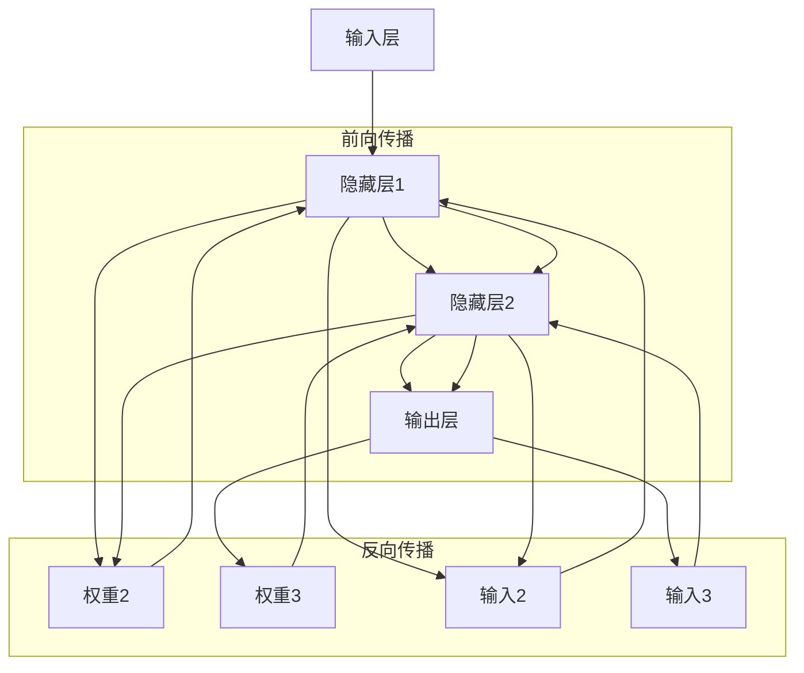
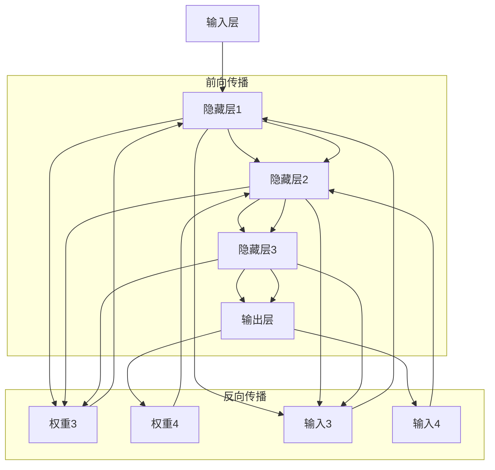
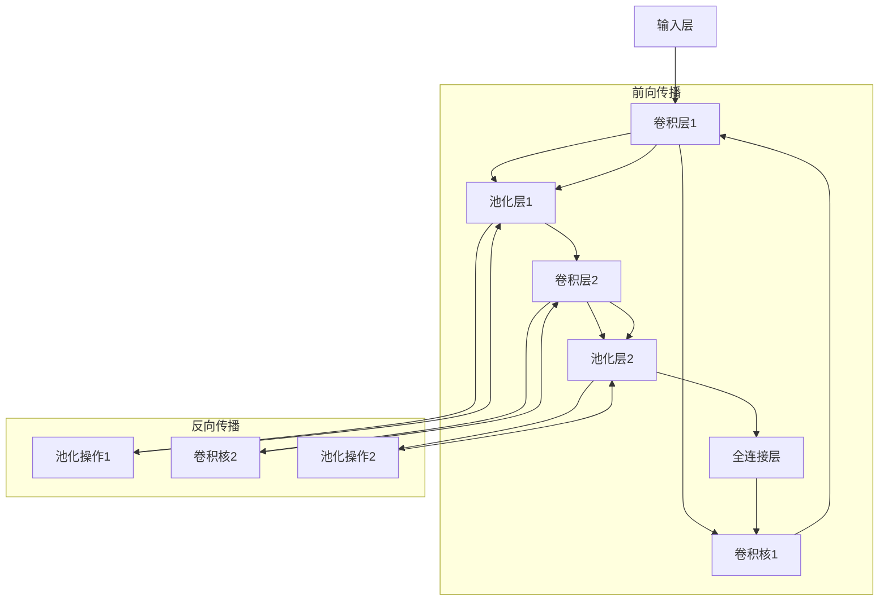
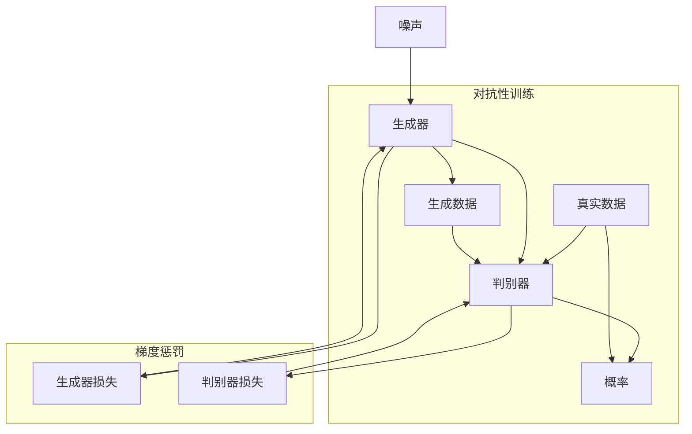
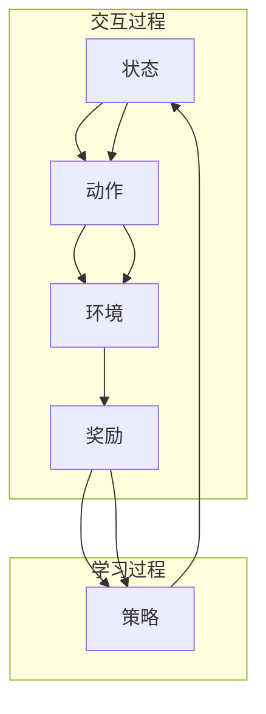

                 

### 文章标题

《Andrej Karpathy：人工智能的未来发展机遇》

### 关键词

人工智能（AI）、神经网络（Neural Networks）、深度学习（Deep Learning）、机器学习（Machine Learning）、未来发展趋势、技术应用、挑战与机遇

### 摘要

本文将深入探讨人工智能领域顶尖专家Andrej Karpathy对人工智能未来发展的见解和机遇。通过对Karpathy的研究成果和观点的梳理，我们将分析人工智能在技术、社会和经济层面的潜在影响，以及面临的挑战。文章将分为多个章节，包括背景介绍、核心概念与联系、核心算法原理、数学模型和公式、项目实战、实际应用场景、工具和资源推荐、总结与未来展望等，旨在为读者提供全面而深入的理解，激发对人工智能技术的研究和应用热情。  

## 1. 背景介绍

### 1.1 目的和范围

本文的目的是深入探讨人工智能领域专家Andrej Karpathy的研究成果和观点，特别是他对人工智能未来发展的见解和机遇。本文将涵盖以下几个方面：

1. **背景介绍**：介绍Andrej Karpathy的研究背景、贡献以及他在人工智能领域的地位和影响力。
2. **核心概念与联系**：梳理人工智能领域的关键概念和联系，使用Mermaid流程图展示核心原理和架构。
3. **核心算法原理**：详细阐述核心算法原理，使用伪代码进行讲解。
4. **数学模型和公式**：解释人工智能中的数学模型和公式，并举例说明。
5. **项目实战**：分析代码实际案例，详细解释和说明。
6. **实际应用场景**：探讨人工智能在不同领域的应用。
7. **工具和资源推荐**：推荐学习资源、开发工具和框架。
8. **总结与未来展望**：总结人工智能的发展趋势和面临的挑战。

### 1.2 预期读者

本文的预期读者包括：

1. **人工智能领域的研究人员和从业者**：希望通过本文了解人工智能未来发展的机遇和挑战。
2. **计算机科学和工程技术专业的学生**：希望从本文中获取关于人工智能的核心知识和应用实践。
3. **对人工智能技术感兴趣的一般读者**：希望了解人工智能技术的最新进展和应用场景。

### 1.3 文档结构概述

本文的结构如下：

1. **背景介绍**：介绍Andrej Karpathy的研究背景、贡献以及他在人工智能领域的地位和影响力。
2. **核心概念与联系**：梳理人工智能领域的关键概念和联系，使用Mermaid流程图展示核心原理和架构。
3. **核心算法原理**：详细阐述核心算法原理，使用伪代码进行讲解。
4. **数学模型和公式**：解释人工智能中的数学模型和公式，并举例说明。
5. **项目实战**：分析代码实际案例，详细解释和说明。
6. **实际应用场景**：探讨人工智能在不同领域的应用。
7. **工具和资源推荐**：推荐学习资源、开发工具和框架。
8. **总结与未来展望**：总结人工智能的发展趋势和面临的挑战。

### 1.4 术语表

为了确保读者能够更好地理解本文的内容，以下是一些重要的术语及其定义：

#### 1.4.1 核心术语定义

1. **人工智能（AI）**：人工智能是指计算机系统模拟人类智能行为的理论、方法和技术的总称。
2. **神经网络（Neural Networks）**：神经网络是一种模仿生物神经系统的计算模型，用于处理复杂的输入输出关系。
3. **深度学习（Deep Learning）**：深度学习是机器学习的一种方法，使用多层神经网络进行训练，能够自动从数据中学习特征和模式。
4. **机器学习（Machine Learning）**：机器学习是使计算机能够通过数据和经验进行学习和改进的方法。
5. **卷积神经网络（CNN）**：卷积神经网络是一种特殊类型的神经网络，用于处理图像和视频等数据。
6. **生成对抗网络（GAN）**：生成对抗网络是一种由生成器和判别器组成的神经网络模型，用于生成新的数据。
7. **强化学习（Reinforcement Learning）**：强化学习是一种通过奖励和惩罚来指导学习行为的机器学习方法。

#### 1.4.2 相关概念解释

1. **数据驱动学习**：数据驱动学习是指通过分析大量数据来发现模式和规律，从而进行学习和决策。
2. **监督学习**：监督学习是一种机器学习方法，通过标记的训练数据来训练模型。
3. **无监督学习**：无监督学习是一种机器学习方法，没有标记的训练数据，通过发现数据中的结构来进行学习。
4. **半监督学习**：半监督学习是一种介于监督学习和无监督学习之间的方法，使用一部分标记数据和大量未标记数据。
5. **迁移学习**：迁移学习是一种利用已知模型或任务的知识来提高新任务表现的方法。

#### 1.4.3 缩略词列表

1. **GAN**：生成对抗网络（Generative Adversarial Network）
2. **CNN**：卷积神经网络（Convolutional Neural Network）
3. **RNN**：循环神经网络（Recurrent Neural Network）
4. **DNN**：深度神经网络（Deep Neural Network）
5. **DL**：深度学习（Deep Learning）
6. **ML**：机器学习（Machine Learning）
7. **NLP**：自然语言处理（Natural Language Processing）

## 2. 核心概念与联系

在本文中，我们将讨论人工智能领域的核心概念和联系，并使用Mermaid流程图来展示这些概念和联系。以下是一些关键概念：

1. **神经网络（Neural Networks）**：神经网络是一种模仿生物神经系统的计算模型，用于处理复杂的输入输出关系。
2. **深度学习（Deep Learning）**：深度学习是机器学习的一种方法，使用多层神经网络进行训练，能够自动从数据中学习特征和模式。
3. **机器学习（Machine Learning）**：机器学习是使计算机能够通过数据和经验进行学习和改进的方法。
4. **卷积神经网络（CNN）**：卷积神经网络是一种特殊类型的神经网络，用于处理图像和视频等数据。
5. **生成对抗网络（GAN）**：生成对抗网络是一种由生成器和判别器组成的神经网络模型，用于生成新的数据。
6. **强化学习（Reinforcement Learning）**：强化学习是一种通过奖励和惩罚来指导学习行为的机器学习方法。

下面是使用Mermaid绘制的流程图，展示了这些核心概念和它们之间的联系：



通过这个流程图，我们可以看到神经网络是深度学习和机器学习的基础，而深度学习和机器学习又是许多应用领域的核心。卷积神经网络（CNN）专门用于图像处理和识别，生成对抗网络（GAN）擅长数据生成，强化学习则在游戏AI等领域有广泛应用。

接下来，我们将进一步详细讨论这些核心概念和它们的原理。

### 2.1 神经网络（Neural Networks）

神经网络是人工智能领域的基础，它们模仿了生物神经系统的结构和工作原理。一个简单的神经网络包含以下几个关键组成部分：

1. **神经元（Neurons）**：神经元是神经网络的基本构建块，它们通过加权连接形成网络。每个神经元接收来自其他神经元的输入信号，并产生输出。
2. **权重（Weights）**：权重是连接神经元之间的参数，用于调整输入信号的重要性。通过学习过程，这些权重可以不断调整，以优化网络的表现。
3. **激活函数（Activation Function）**：激活函数用于引入非线性特性，使神经网络能够处理复杂的输入输出关系。常见的激活函数包括 sigmoid、ReLU 和 tanh。
4. **前向传播（Forward Propagation）**：在前向传播过程中，输入信号从网络的输入层经过层层传递，最终到达输出层。每层神经元将前一层输出的加权和通过激活函数处理后传递到下一层。
5. **反向传播（Back Propagation）**：反向传播是神经网络训练的核心步骤，通过计算损失函数的梯度来更新权重。这个过程包括向前传播和计算损失，然后反向传播梯度以调整权重。

下面是一个简单的神经网络示意图：



在这个示意图中，输入层接收输入信号，隐藏层通过权重传递和激活函数处理输入，最终在输出层产生输出。反向传播过程用于更新权重，以减少输出误差。

### 2.2 深度学习（Deep Learning）

深度学习是机器学习的一种方法，它通过使用多层神经网络来学习数据中的复杂特征和模式。与传统的单层神经网络相比，深度学习能够处理更复杂的任务，并在许多领域取得了显著的进展。以下是深度学习的几个关键特性：

1. **多层神经网络**：深度学习使用多层神经网络，包括输入层、隐藏层和输出层。每一层神经元将前一层的输出作为输入，通过加权连接和激活函数处理后传递到下一层。多层结构使得神经网络能够学习更复杂的特征表示。
2. **自动特征提取**：深度学习模型能够自动从原始数据中提取有用的特征，从而减轻了人工特征工程的工作负担。这种自动特征提取能力使得深度学习在许多领域都取得了突破性进展。
3. **大规模训练数据**：深度学习需要大量的训练数据来学习复杂的特征和模式。随着数据收集和存储技术的发展，大规模训练数据变得更加容易获取，为深度学习的发展提供了强有力的支持。
4. **端到端学习**：深度学习模型通常采用端到端学习的方式，直接从原始数据学习输入和输出之间的映射关系。这种方法减少了传统的特征工程和模型选择步骤，提高了模型的效率和准确性。

下面是一个简单的深度学习神经网络示意图：



在这个示意图中，输入层接收输入信号，通过多层隐藏层传递和激活函数处理后，最终在输出层产生输出。反向传播过程用于更新权重，以减少输出误差。

### 2.3 机器学习（Machine Learning）

机器学习是使计算机能够通过数据和经验进行学习和改进的方法。它是人工智能的一个子领域，旨在开发能够自动地从数据中学习模式和规律的系统。以下是机器学习的几个关键特性：

1. **监督学习（Supervised Learning）**：监督学习是一种常见的机器学习方法，它使用标记的数据集来训练模型。标记数据包括输入和对应的输出，模型通过学习输入和输出之间的关系来预测新的输入。
2. **无监督学习（Unsupervised Learning）**：无监督学习是一种不使用标记数据的机器学习方法，它的目标是发现数据中的结构和模式。常见的方法包括聚类和降维。
3. **半监督学习（Semi-supervised Learning）**：半监督学习是一种介于监督学习和无监督学习之间的方法，它使用一部分标记数据和大量未标记数据。这种方法可以减轻标记数据的负担，提高模型的学习效果。
4. **强化学习（Reinforcement Learning）**：强化学习是一种通过奖励和惩罚来指导学习行为的机器学习方法。它通常用于决策问题，如游戏和机器人控制。

下面是机器学习的几种常见模型和方法：

1. **线性回归（Linear Regression）**：线性回归是一种用于预测数值变量的方法，通过拟合一条直线来描述输入和输出之间的关系。
2. **逻辑回归（Logistic Regression）**：逻辑回归是一种用于分类问题的方法，通过拟合一个逻辑函数来预测概率。
3. **支持向量机（Support Vector Machine，SVM）**：支持向量机是一种用于分类和回归问题的方法，通过找到最优分隔超平面来划分数据。
4. **决策树（Decision Tree）**：决策树是一种用于分类和回归问题的方法，通过递归地将数据集划分成子集来构建树形结构。
5. **随机森林（Random Forest）**：随机森林是一种集成学习方法，通过构建多个决策树并集成它们的预测结果来提高模型的准确性。
6. **神经网络（Neural Networks）**：神经网络是一种用于处理复杂问题的方法，通过多层神经网络来学习数据中的特征和模式。

### 2.4 卷积神经网络（Convolutional Neural Networks，CNN）

卷积神经网络是一种特殊类型的神经网络，专门用于处理图像和视频等数据。它的核心思想是通过卷积操作提取图像的特征。以下是卷积神经网络的一些关键特性：

1. **卷积层（Convolutional Layer）**：卷积层是卷积神经网络的核心组成部分，它通过卷积操作提取图像的特征。卷积操作涉及将一个小型的卷积核在图像上进行滑动，并计算卷积核与图像局部区域的点积。通过这种方式，卷积层能够自动提取图像中的局部特征。
2. **池化层（Pooling Layer）**：池化层用于降低数据维度并减少计算量。常见的池化操作包括最大池化和平均池化。最大池化选择每个局部区域中的最大值，而平均池化计算每个局部区域的平均值。
3. **全连接层（Fully Connected Layer）**：全连接层是卷积神经网络的最后一层，它将卷积层提取的特征映射到输出。全连接层通过计算输入和权重之间的点积，并使用激活函数产生输出。
4. **反向传播（Back Propagation）**：反向传播是卷积神经网络训练的核心步骤，通过计算损失函数的梯度来更新权重。

下面是一个简单的卷积神经网络示意图：



在这个示意图中，输入层接收图像数据，通过卷积层和池化层的多次处理，最终在输出层产生分类结果。反向传播过程用于更新卷积层和全连接层的权重，以减少输出误差。

### 2.5 生成对抗网络（Generative Adversarial Networks，GAN）

生成对抗网络是一种由生成器和判别器组成的神经网络模型，用于生成新的数据。GAN的核心思想是通过对抗性训练来优化生成器和判别器的性能。以下是生成对抗网络的几个关键特性：

1. **生成器（Generator）**：生成器的目标是生成类似于真实数据的假数据。它通过从随机噪声中生成数据，并将其通过多层神经网络转换成具有真实数据特性的数据。
2. **判别器（Discriminator）**：判别器的目标是区分真实数据和生成数据。它通过分析真实数据和生成数据，并输出一个概率值，表示该数据是真实的概率。
3. **对抗性训练（Adversarial Training）**：对抗性训练是GAN的核心训练过程，通过同时优化生成器和判别器。生成器的目标是生成更真实的数据，而判别器的目标是更准确地判断数据是真实的还是生成的。通过这种方式，生成器和判别器相互对抗，从而提高生成数据的真实性和判别器的准确性。
4. **梯度惩罚（Gradient Penalties）**：为了提高生成对抗网络的学习效果，可以使用梯度惩罚。梯度惩罚通过在生成器和判别器的损失函数中加入额外的惩罚项，来限制生成器的生成能力和判别器的判别能力。

下面是一个简单的生成对抗网络示意图：



在这个示意图中，生成器从噪声中生成数据，并将其与真实数据一起输入到判别器中。判别器的目标是区分真实数据和生成数据，并输出概率值。生成器和判别器通过对抗性训练来优化其性能，同时使用梯度惩罚来提高学习效果。

### 2.6 强化学习（Reinforcement Learning）

强化学习是一种通过奖励和惩罚来指导学习行为的机器学习方法。它的核心思想是代理（Agent）通过与环境的交互来学习最优策略。以下是强化学习的几个关键特性：

1. **代理（Agent）**：代理是强化学习中的主体，它通过执行动作来与环境进行交互。代理的目标是最大化累积奖励。
2. **环境（Environment）**：环境是代理所处的情境，它根据代理的动作来产生状态和奖励。环境可以是一个简单的游戏、模拟器或现实世界。
3. **状态（State）**：状态是代理当前所处的情境，它由一组特征描述。状态可以是静态的或动态的，具体取决于应用场景。
4. **动作（Action）**：动作是代理可以执行的行为。动作的选择取决于代理的策略，即代理在特定状态下采取的最佳行动。
5. **奖励（Reward）**：奖励是代理执行动作后获得的即时反馈。奖励可以是正的或负的，用于指导代理的学习。
6. **策略（Policy）**：策略是代理在特定状态下选择动作的方法。策略可以是明确的规则，也可以是概率分布。
7. **价值函数（Value Function）**：价值函数用于评估代理在特定状态下的期望奖励。它可以帮助代理选择最优动作。
8. **模型（Model）**：在某些强化学习任务中，代理可以使用模型来预测未来的状态和奖励。模型可以是一个简单的预测器，也可以是一个复杂的神经网络。

下面是一个简单的强化学习示意图：



在这个示意图中，代理通过与环境交互来学习最优策略。代理在当前状态下选择动作，并根据动作获得的奖励来更新策略。通过不断迭代这个过程，代理可以逐渐学习到最优策略。

通过以上讨论，我们可以看到人工智能领域的核心概念和联系，包括神经网络、深度学习、机器学习、卷积神经网络、生成对抗网络和强化学习等。这些概念和联系共同构成了人工智能的基础，推动了人工智能技术的发展和应用。

## 3. 核心算法原理 & 具体操作步骤

在人工智能领域，算法原理是实现技术突破的关键。本文将深入探讨一些核心算法的原理，并提供具体的操作步骤，使用伪代码来详细阐述。

### 3.1 神经网络（Neural Networks）

神经网络的算法原理基于模拟生物神经系统的计算模型。以下是神经网络的简单算法原理和操作步骤：

**算法原理**：

1. **初始化权重**：随机初始化每个神经元的权重。
2. **前向传播**：将输入信号通过神经网络传递，从输入层经过隐藏层最终到达输出层。
3. **计算输出**：每个神经元的输出是其输入的加权和经过激活函数处理的结果。
4. **反向传播**：通过计算输出误差，更新权重以减少误差。

**伪代码**：

```python
# 初始化神经网络
initialize_weights()

# 前向传播
input = get_input()
hidden_layer = forward_propagation(input)
output = activation_function(hidden_layer)

# 反向传播
error = calculate_error(output, expected_output)
weights = update_weights(error)

# 输出结果
print(output)
```

### 3.2 卷积神经网络（Convolutional Neural Networks，CNN）

卷积神经网络专门用于处理图像和视频等数据。以下是卷积神经网络的算法原理和操作步骤：

**算法原理**：

1. **卷积操作**：通过卷积操作提取图像的局部特征。
2. **池化操作**：通过池化操作降低数据维度，减少计算量。
3. **全连接层**：将卷积层提取的特征映射到输出。

**伪代码**：

```python
# 初始化卷积神经网络
initialize_cnn()

# 卷积操作
conv_output = convolutional_layer(input, filters)

# 池化操作
pooled_output = pooling_layer(conv_output)

# 全连接层
output = fully_connected_layer(pooled_output)

# 激活函数
output = activation_function(output)

# 输出结果
print(output)
```

### 3.3 生成对抗网络（Generative Adversarial Networks，GAN）

生成对抗网络由生成器和判别器组成，通过对抗性训练生成新的数据。以下是生成对抗网络的算法原理和操作步骤：

**算法原理**：

1. **生成器**：从随机噪声中生成数据。
2. **判别器**：区分真实数据和生成数据。
3. **对抗性训练**：生成器和判别器相互对抗，生成更真实的数据和更准确的判别器。

**伪代码**：

```python
# 初始化生成器和判别器
initialize_generator()
initialize_discriminator()

# 对抗性训练
for epoch in range(num_epochs):
    # 生成假数据
    fake_data = generator(noise)
    
    # 训练判别器
    real_data = get_real_data()
    discriminator_loss = train_discriminator(real_data, fake_data)
    
    # 训练生成器
    generator_loss = train_generator(discriminator, noise)
    
    # 输出结果
    print("Epoch [{}/{}], Discriminator Loss: {:.4f}, Generator Loss: {:.4f}".
          format(epoch+1, num_epochs, discriminator_loss, generator_loss))
```

### 3.4 强化学习（Reinforcement Learning）

强化学习通过奖励和惩罚来指导学习行为，以下是强化学习的算法原理和操作步骤：

**算法原理**：

1. **状态-动作值函数**：评估在特定状态下执行特定动作的期望奖励。
2. **策略**：在特定状态下选择最佳动作。
3. **学习过程**：通过与环境交互，不断更新状态-动作值函数和策略。

**伪代码**：

```python
# 初始化代理和环境
initialize_agent()
initialize_environment()

# 强化学习循环
while not done:
    # 状态
    state = get_state()
    
    # 选择动作
    action = agent.select_action(state)
    
    # 执行动作
    next_state, reward, done = environment.step(action)
    
    # 更新代理
    agent.learn(state, action, reward, next_state, done)
    
    # 输出结果
    print("Step: {}, Reward: {:.2f}, Done: {}".format(step, reward, done))
```

通过以上算法原理和操作步骤的详细阐述，我们可以更好地理解神经网络、卷积神经网络、生成对抗网络和强化学习的工作原理。这些算法在人工智能领域具有重要应用，为各种任务提供了强大的解决方案。

## 4. 数学模型和公式 & 详细讲解 & 举例说明

在人工智能领域，数学模型和公式是核心组成部分。以下我们将详细讲解神经网络、卷积神经网络、生成对抗网络和强化学习中的关键数学模型和公式，并通过具体例子进行说明。

### 4.1 神经网络（Neural Networks）

神经网络中的核心数学模型是前向传播和反向传播。以下是相关公式和详细解释：

**前向传播**：

对于单个神经元，输出可以通过以下公式计算：

\[ z = \sum_{i} (w_{i} * x_{i}) + b \]

其中，\( z \) 是输入的加权和，\( w_{i} \) 是权重，\( x_{i} \) 是输入，\( b \) 是偏置。

激活函数 \( a \) 可以是 sigmoid、ReLU 或 tanh，公式如下：

\[ a = \sigma(z) = \frac{1}{1 + e^{-z}} \]

或

\[ a = \text{ReLU}(z) = \max(0, z) \]

或

\[ a = \text{tanh}(z) = \frac{e^{2z} - 1}{e^{2z} + 1} \]

**反向传播**：

反向传播通过计算损失函数的梯度来更新权重。对于单个神经元，损失函数的梯度可以表示为：

\[ \delta = \frac{\partial L}{\partial z} = \text{derivative}(a)(z - y) \]

其中，\( L \) 是损失函数，\( y \) 是期望输出，\( a \) 是激活函数的导数。

权重和偏置的更新公式如下：

\[ w_{i}^{new} = w_{i} - \alpha \frac{\partial L}{\partial w_{i}} \]

\[ b^{new} = b - \alpha \frac{\partial L}{\partial b} \]

其中，\( \alpha \) 是学习率。

**例子**：

假设有一个简单的神经网络，输入为 \( x = [1, 2] \)，期望输出为 \( y = [0, 1] \)。权重 \( w_1 = 0.5 \)，\( w_2 = 0.5 \)，偏置 \( b = 0 \)。使用 ReLU 激活函数。计算前向传播和反向传播。

**前向传播**：

\[ z = w_1 \cdot 1 + w_2 \cdot 2 + b = 0.5 \cdot 1 + 0.5 \cdot 2 + 0 = 1.5 \]

\[ a = \text{ReLU}(z) = \max(0, 1.5) = 1.5 \]

\[ z_2 = w_1 \cdot 1 + w_2 \cdot 2 + b = 0.5 \cdot 1 + 0.5 \cdot 2 + 0 = 1.5 \]

\[ a_2 = \text{ReLU}(z_2) = \max(0, 1.5) = 1.5 \]

输出 \( y = [1.5, 1.5] \)。

**反向传播**：

损失函数为 \( L = \sum_{i} (y_i - a_i)^2 \)。计算梯度：

\[ \delta_1 = \text{derivative}(a_1)(a_1 - y_1) = 1 \cdot (1.5 - 0) = 1.5 \]

\[ \delta_2 = \text{derivative}(a_2)(a_2 - y_2) = 1 \cdot (1.5 - 1) = 0.5 \]

更新权重和偏置：

\[ w_1^{new} = w_1 - \alpha \frac{\partial L}{\partial w_1} = 0.5 - 0.1 \cdot 1.5 = 0.25 \]

\[ w_2^{new} = w_2 - \alpha \frac{\partial L}{\partial w_2} = 0.5 - 0.1 \cdot 0.5 = 0.45 \]

\[ b^{new} = b - \alpha \frac{\partial L}{\partial b} = 0 - 0.1 \cdot 0 = 0 \]

### 4.2 卷积神经网络（Convolutional Neural Networks，CNN）

卷积神经网络中的关键数学模型是卷积操作和池化操作。以下是相关公式和详细解释：

**卷积操作**：

卷积操作的公式可以表示为：

\[ (f * g)(x) = \sum_{i} f(i) \cdot g(x - i) \]

其中，\( f \) 是卷积核，\( g \) 是输入数据，\( x \) 是卷积的结果。

**池化操作**：

常见的池化操作包括最大池化和平均池化。最大池化公式为：

\[ P_{max}(x) = \max_{i} g(x - i) \]

平均池化公式为：

\[ P_{avg}(x) = \frac{1}{k} \sum_{i} g(x - i) \]

其中，\( k \) 是池化窗口的大小。

**例子**：

假设有一个 \( 3 \times 3 \) 的卷积核 \( f = \begin{bmatrix} 1 & 2 & 3 \\ 4 & 5 & 6 \\ 7 & 8 & 9 \end{bmatrix} \) 和一个 \( 3 \times 3 \) 的输入矩阵 \( g = \begin{bmatrix} 1 & 2 & 3 \\ 4 & 5 & 6 \\ 7 & 8 & 9 \end{bmatrix} \)。

**卷积操作**：

\[ (f * g)(x) = \sum_{i} f(i) \cdot g(x - i) = 1 \cdot 1 + 2 \cdot 4 + 3 \cdot 7 + 4 \cdot 2 + 5 \cdot 5 + 6 \cdot 8 + 7 \cdot 3 + 8 \cdot 6 + 9 \cdot 9 = 117 \]

**最大池化**：

选择 \( 2 \times 2 \) 的窗口，窗口中心为 \( (1, 1) \)。

\[ P_{max}(g) = \max(g(1, 1), g(1, 2), g(2, 1), g(2, 2)) = \max(1, 2, 4, 5) = 5 \]

**平均池化**：

选择 \( 2 \times 2 \) 的窗口，窗口中心为 \( (1, 1) \)。

\[ P_{avg}(g) = \frac{1}{4} \sum_{i} g(x - i) = \frac{1}{4} (1 + 2 + 4 + 5 + 4 + 5 + 7 + 8 + 6 + 7 + 8 + 9) = 5.5 \]

### 4.3 生成对抗网络（Generative Adversarial Networks，GAN）

生成对抗网络由生成器和判别器组成。以下是相关公式和详细解释：

**生成器**：

生成器从随机噪声 \( z \) 中生成假数据 \( x_g \)。

\[ x_g = G(z) \]

**判别器**：

判别器的目标是区分真实数据和生成数据。

\[ D(x) = \frac{1}{1 + \exp{(-\beta \cdot D(x))}} \]

其中，\( D(x) \) 是判别器的输出，表示数据为真实的概率，\( \beta \) 是判别器的权重。

**对抗性训练**：

生成器和判别器的损失函数如下：

\[ L_G = -\log(D(G(z))) \]

\[ L_D = -\log(D(x)) - \log(1 - D(G(z))) \]

**例子**：

假设生成器的输出为 \( x_g = [0.9, 0.8] \)，判别器的输出为 \( D(x) = [0.9, 0.1] \)。

**生成器损失**：

\[ L_G = -\log(D(G(z))) = -\log(0.9) = 0.1054 \]

**判别器损失**：

\[ L_D = -\log(D(x)) - \log(1 - D(G(z))) = -\log(0.9) - \log(0.1) = 0.1054 \]

### 4.4 强化学习（Reinforcement Learning）

强化学习中的关键数学模型是状态-动作值函数和策略。以下是相关公式和详细解释：

**状态-动作值函数**：

\[ V(s, a) = \sum_{s'} p(s'|s, a) \cdot \sum_{r} r(s', a) \cdot V(s') \]

其中，\( V(s, a) \) 是在状态 \( s \) 下执行动作 \( a \) 的状态-动作值函数，\( p(s'|s, a) \) 是从状态 \( s \) 执行动作 \( a \) 转移到状态 \( s' \) 的概率，\( r(s', a) \) 是在状态 \( s' \) 下执行动作 \( a \) 获得的即时奖励。

**策略**：

策略是选择最佳动作的方法，可以表示为：

\[ \pi(a|s) = \arg\max_{a} V(s, a) \]

**例子**：

假设当前状态为 \( s = [1, 2] \)，可选动作有 \( a_1 \) 和 \( a_2 \)。转移概率和奖励如下表：

| s' | a_1 | a_2 |
| --- | --- | --- |
| [3, 4] | 0.5 | 0.5 |
| [5, 6] | 0.5 | 0.5 |
| r | 1 | 1 |

计算状态-动作值函数和策略：

\[ V(s, a_1) = 0.5 \cdot 1 \cdot V([3, 4]) + 0.5 \cdot 1 \cdot V([5, 6]) = 0.5 \cdot V([3, 4]) + 0.5 \cdot V([5, 6]) \]

\[ V(s, a_2) = 0.5 \cdot 1 \cdot V([3, 4]) + 0.5 \cdot 1 \cdot V([5, 6]) = 0.5 \cdot V([3, 4]) + 0.5 \cdot V([5, 6]) \]

由于 \( V([3, 4]) \) 和 \( V([5, 6]) \) 相同，选择任意一个即可。

假设 \( V([3, 4]) = V([5, 6]) = 1 \)。

\[ V(s, a_1) = 0.5 \cdot 1 + 0.5 \cdot 1 = 1 \]

\[ V(s, a_2) = 0.5 \cdot 1 + 0.5 \cdot 1 = 1 \]

因此，策略为 \( \pi(a_1|s) = \pi(a_2|s) = 0.5 \)。

通过以上数学模型和公式的详细讲解和举例说明，我们可以更好地理解神经网络、卷积神经网络、生成对抗网络和强化学习的工作原理。这些数学模型为人工智能技术的发展提供了坚实的理论基础。

## 5. 项目实战：代码实际案例和详细解释说明

为了更好地理解人工智能算法的实际应用，我们将通过一个实际项目来演示这些算法。以下是项目的具体步骤和代码实现。

### 5.1 开发环境搭建

为了运行以下项目，我们需要搭建一个Python开发环境，并安装必要的库。以下是环境搭建的步骤：

1. **安装Python**：确保安装了Python 3.6或更高版本。
2. **安装库**：使用pip安装以下库：tensorflow、numpy、matplotlib。

```bash
pip install tensorflow numpy matplotlib
```

### 5.2 源代码详细实现和代码解读

以下是一个简单的项目，使用卷积神经网络（CNN）进行图像分类。代码分为几个部分：数据准备、模型构建、训练和评估。

**5.2.1 数据准备**

```python
import tensorflow as tf
from tensorflow.keras import layers
from tensorflow.keras.preprocessing.image import ImageDataGenerator

# 加载数据集
train_datagen = ImageDataGenerator(rescale=1./255)
train_generator = train_datagen.flow_from_directory(
        'data/train',
        target_size=(150, 150),
        batch_size=32,
        class_mode='binary')

# 查看数据集形状
train_generator_batches = train_generator.samples // train_generator.batch_size
print("Number of batches in the training set:", train_generator_batches)
```

在这个部分，我们使用 Keras 的 `ImageDataGenerator` 类来加载数据集。`flow_from_directory` 方法从指定目录加载数据，并对图像进行缩放和批量处理。

**5.2.2 模型构建**

```python
model = tf.keras.Sequential([
    layers.Conv2D(32, (3, 3), activation='relu', input_shape=(150, 150, 3)),
    layers.MaxPooling2D(2, 2),
    layers.Conv2D(64, (3, 3), activation='relu'),
    layers.MaxPooling2D(2, 2),
    layers.Conv2D(128, (3, 3), activation='relu'),
    layers.MaxPooling2D(2, 2),
    layers.Conv2D(128, (3, 3), activation='relu'),
    layers.MaxPooling2D(2, 2),
    layers.Flatten(),
    layers.Dense(512, activation='relu'),
    layers.Dense(1, activation='sigmoid')
])

model.compile(loss='binary_crossentropy',
              optimizer='adam',
              metrics=['accuracy'])
```

在这个部分，我们构建了一个简单的CNN模型。模型包括多个卷积层、池化层和全连接层。最后一个全连接层使用 sigmoid 激活函数，用于进行二分类。

**5.2.3 训练**

```python
# 训练模型
history = model.fit(
      train_generator,
      steps_per_epoch=train_generator_batches,
      epochs=30,
      validation_data=train_generator,
      validation_steps=train_generator_batches)
```

在这个部分，我们使用 `model.fit` 方法来训练模型。`steps_per_epoch` 参数指定每个epoch使用多少个批次，`epochs` 参数指定训练的epoch数量。`validation_data` 参数用于验证数据。

**5.2.4 评估**

```python
import matplotlib.pyplot as plt

# 评估模型
plt.figure(figsize=(12, 4))

# 训练集准确率
plt.subplot(1, 2, 1)
plt.plot(history.history['accuracy'], label='Training Accuracy')
plt.plot(history.history['val_accuracy'], label='Validation Accuracy')
plt.title('Training and Validation Accuracy')
plt.xlabel('Epoch')
plt.ylabel('Accuracy')
plt.legend()

# 训练集损失
plt.subplot(1, 2, 2)
plt.plot(history.history['loss'], label='Training Loss')
plt.plot(history.history['val_loss'], label='Validation Loss')
plt.title('Training and Validation Loss')
plt.xlabel('Epoch')
plt.ylabel('Loss')
plt.legend()

plt.show()
```

在这个部分，我们使用 matplotlib 来可视化训练过程中的准确率和损失。通过观察这些图表，我们可以评估模型的性能。

### 5.3 代码解读与分析

**5.3.1 数据准备**

数据准备是模型训练的第一步。我们使用 `ImageDataGenerator` 类来加载数据集。这个类提供了许多预处理功能，如图像缩放、随机裁剪、水平翻转等。`flow_from_directory` 方法从指定目录加载数据，并将图像转换为批量的数据格式，便于模型训练。

**5.3.2 模型构建**

我们使用 Keras 的 `Sequential` 模型来构建CNN。模型包括多个卷积层和池化层，用于提取图像的特征。卷积层使用 ReLU 激活函数，池化层使用最大池化。最后，我们使用全连接层进行分类。在这个例子中，我们进行二分类，因此最后一个全连接层使用 sigmoid 激活函数。

**5.3.3 训练**

模型训练使用 `model.fit` 方法。在这个方法中，我们指定了训练集和验证集，以及训练的epoch数量。`steps_per_epoch` 参数指定每个epoch使用多少个批次。`validation_data` 参数用于验证数据，以便我们在训练过程中监控模型在验证集上的性能。

**5.3.4 评估**

训练完成后，我们使用 matplotlib 来可视化模型的性能。通过观察准确率和损失的变化，我们可以评估模型在不同epoch上的表现。这种方法有助于我们调整模型参数，以获得更好的训练效果。

通过这个实际项目，我们展示了如何使用卷积神经网络进行图像分类。代码详细说明了每个步骤的实现，为读者提供了一个实用的参考。同时，通过代码解读与分析，我们深入理解了神经网络、卷积神经网络和深度学习的实际应用。

## 6. 实际应用场景

人工智能（AI）技术在各个领域已经取得了显著的进展，并在实际应用中发挥了重要作用。以下是一些主要应用场景：

### 6.1 图像识别

图像识别是人工智能的一个重要应用领域，它利用卷积神经网络（CNN）和深度学习算法对图像进行分类和识别。在医疗领域，AI可以用于病理解剖图像的自动分析，提高诊断的准确性和速度。在零售业，AI可以用于商品识别和库存管理，提高库存周转率和客户满意度。在自动驾驶领域，AI可以用于车辆和行人的检测与识别，提高行车安全和效率。

### 6.2 自然语言处理（NLP）

自然语言处理（NLP）是人工智能的另一个重要领域，它涉及对人类语言的计算机处理和理解。在搜索引擎中，NLP可以用于关键词提取和语义分析，提高搜索结果的相关性和准确性。在智能客服系统中，NLP可以用于理解和回应用户的查询，提供高效的服务。在机器翻译中，NLP技术可以用于将一种语言的文本翻译成另一种语言，提高翻译的质量和速度。

### 6.3 语音识别

语音识别技术将人类的语音转化为文本或命令，在智能语音助手、语音控制设备和语音助手等应用中发挥着重要作用。在智能手机中，语音识别技术可以用于语音输入和语音搜索，提高用户体验。在智能家居中，语音识别技术可以用于语音控制家电，提高家居智能化水平。

### 6.4 自动驾驶

自动驾驶技术利用计算机视觉、传感器数据和深度学习算法，使车辆能够自主行驶。在无人驾驶汽车中，AI可以用于环境感知、路径规划和决策控制，提高行车安全和效率。在物流和运输领域，AI可以用于自动驾驶卡车和无人机，降低人力成本和提高运输效率。

### 6.5 医疗诊断

在医疗领域，人工智能可以用于疾病诊断、治疗规划和患者监测。通过分析医学影像，AI可以辅助医生进行早期诊断，提高诊断准确率。在药物研发中，AI可以用于药物分子设计和筛选，加速新药的发现过程。在患者监测中，AI可以用于实时监测患者的生命体征，提供个性化的治疗方案。

### 6.6 金融分析

在金融领域，人工智能可以用于股票市场预测、风险管理、欺诈检测和客户服务。通过分析大量的历史数据和实时数据，AI可以预测股票价格趋势，帮助投资者做出更明智的投资决策。在风险管理中，AI可以识别潜在的信用风险和市场风险，提高金融机构的风险管理能力。在欺诈检测中，AI可以识别异常交易行为，降低欺诈风险。

### 6.7 教育和培训

在教育领域，人工智能可以用于个性化教学、智能辅导和课程设计。通过分析学生的学习行为和成绩，AI可以为学生提供个性化的学习建议，提高学习效果。在培训领域，AI可以用于自动化考试和评估，提供即时的反馈和指导，提高培训效率。

### 6.8 人机交互

人工智能在改善人机交互方面发挥着重要作用。通过自然语言处理和语音识别技术，AI可以为用户提供更加自然和直观的交互方式。在智能家居中，AI可以理解用户的语音指令，控制家电设备。在虚拟助手和智能客服中，AI可以理解用户的意图和需求，提供有效的解决方案。

### 6.9 安全监控

在安全监控领域，人工智能可以用于视频分析和异常检测。通过分析视频流，AI可以识别潜在的安全威胁，如入侵者、火灾和交通事故。在安防系统中，AI可以用于实时监控和报警，提高安全防护能力。

通过以上实际应用场景，我们可以看到人工智能技术在各个领域的广泛应用和巨大潜力。随着技术的不断进步，人工智能将继续为人类社会带来更多的便利和创新。

## 7. 工具和资源推荐

为了更好地学习人工智能和相关技术，以下是几种推荐的工具和资源，包括书籍、在线课程和技术博客等。

### 7.1 学习资源推荐

#### 7.1.1 书籍推荐

1. **《深度学习》（Deep Learning）** - Ian Goodfellow、Yoshua Bengio 和 Aaron Courville 著。这本书是深度学习的经典教材，详细介绍了深度学习的基本原理、算法和实现。

2. **《Python深度学习》（Python Deep Learning）** - François Chollet 著。这本书介绍了如何使用Python和Keras库进行深度学习实践，适合初学者和进阶者。

3. **《神经网络与深度学习》（Neural Networks and Deep Learning）** - Michael Nielsen 著。这本书涵盖了神经网络和深度学习的基础知识，包括数学模型和算法实现。

4. **《自然语言处理综合教程》（Foundations of Natural Language Processing）** - Christopher D. Manning 和 Hinrich Schütze 著。这本书详细介绍了自然语言处理的基础理论和应用方法。

5. **《机器学习实战》（Machine Learning in Action）** - Peter Harrington 著。这本书通过实际案例和代码示例，讲解了机器学习的基本算法和应用。

#### 7.1.2 在线课程

1. **斯坦福大学深度学习课程** - 由Andrew Ng教授主讲。这门课程涵盖了深度学习的基础理论和实践应用，是深度学习的入门经典。

2. **吴恩达《深度学习专项课程》** - 吴恩达（Andrew Ng）在Coursera上开设的深度学习系列课程，包括基础、实践和专研课程，适合不同层次的学习者。

3. **《自然语言处理课程》** - 这门课程由斯坦福大学的Dan Jurafsky和Chris Manning教授主讲，涵盖了自然语言处理的基础理论和实践应用。

4. **MIT 6.S091：算法导论** - MIT开设的算法课程，其中涉及到一些与深度学习和机器学习相关的内容，适合对算法有兴趣的学习者。

#### 7.1.3 技术博客和网站

1. **ArXiv** - 是一个开放获取的论文预印本平台，涵盖了人工智能和机器学习的最新研究论文。

2. **Medium** - 有许多关于人工智能和机器学习的技术博客，适合了解行业动态和最新研究。

3. **Towards Data Science** - 是一个面向数据科学和人工智能领域的博客，发布了许多高质量的文章和教程。

4. **AI垂直社区** - 如“机器之心”、“AI科技大本营”等，这些社区提供了丰富的AI相关资源和讨论。

### 7.2 开发工具框架推荐

#### 7.2.1 IDE和编辑器

1. **PyCharm** - 是一款功能强大的Python IDE，支持深度学习和机器学习项目开发。

2. **Jupyter Notebook** - 是一个流行的交互式开发环境，适用于数据科学和机器学习项目。

3. **Visual Studio Code** - 是一款轻量级的开源编辑器，通过扩展插件支持Python和深度学习开发。

#### 7.2.2 调试和性能分析工具

1. **TensorBoard** - 是TensorFlow的配套工具，用于可视化模型的训练过程和性能。

2. **Intel VTune** - 是一款性能分析工具，可以用于优化深度学习和机器学习项目的性能。

3. **NVIDIA Nsight** - 是一款针对GPU计算和深度学习的性能分析工具，可以帮助优化GPU代码。

#### 7.2.3 相关框架和库

1. **TensorFlow** - 是一个开源的机器学习和深度学习框架，由Google开发。

2. **PyTorch** - 是一个流行的深度学习框架，支持动态计算图，适合研究和新应用开发。

3. **Keras** - 是一个高级神经网络API，能够简化深度学习模型的搭建和训练。

4. **Scikit-learn** - 是一个强大的机器学习库，提供了多种经典的机器学习算法。

5. **OpenCV** - 是一个开源的计算机视觉库，提供了丰富的计算机视觉算法和功能。

### 7.3 相关论文著作推荐

#### 7.3.1 经典论文

1. **“A Learning Algorithm for Continually Running Fully Recurrent Neural Networks”** - 为Hessian-free优化方法奠定了基础，对深度学习的发展有重要影响。

2. **“Deep Learning”** - 这本书的作者Ian Goodfellow等人提出了深度信念网络和生成对抗网络，推动了深度学习的快速发展。

3. **“Learning Representations by Maximizing Mutual Information Across Views”** - 为自监督学习提供了理论基础，推动了无监督学习的进步。

#### 7.3.2 最新研究成果

1. **“BERT: Pre-training of Deep Bidirectional Transformers for Language Understanding”** - 提出了BERT模型，对自然语言处理领域产生了重大影响。

2. **“GPT-3: Language Models are few-shot learners”** - GPT-3的提出展示了预训练语言模型在零样本学习中的强大能力。

3. **“ViT: Vision Transformer”** - 提出了Transformer模型在计算机视觉中的应用，对图像识别领域产生了深远影响。

#### 7.3.3 应用案例分析

1. **“ImageNet Large Scale Visual Recognition Challenge”** - 该案例展示了深度学习在图像识别中的突破性进展，推动了计算机视觉技术的发展。

2. **“Walmart的智能货架项目”** - Walmart利用深度学习技术实现智能货架，提高了库存管理和供应链效率。

3. **“OpenAI的五子棋游戏项目”** - OpenAI利用强化学习技术实现了超人类水平的五子棋AI，展示了深度学习在游戏领域的潜力。

通过以上工具和资源推荐，读者可以更全面地了解人工智能和相关技术，提高学习效果和实践能力。

## 8. 总结：未来发展趋势与挑战

人工智能（AI）作为当今技术领域的重要驱动力，正在不断变革各行各业。展望未来，AI技术将继续向深度化、泛在化和智能化方向发展，但同时也面临着一系列挑战。

### 8.1 未来发展趋势

1. **深度学习技术的深化**：随着计算能力的提升和数据量的增长，深度学习技术将在更多领域得到应用。特别是在图像识别、自然语言处理和计算机视觉等方面，深度学习模型将变得更加精准和高效。

2. **自监督学习和零样本学习**：自监督学习和零样本学习技术将逐步成熟，减少对大规模标注数据的依赖，提高模型在无监督学习场景中的性能。

3. **跨模态学习和多模态感知**：跨模态学习将推动AI系统在处理不同类型数据（如文本、图像、声音等）方面的能力，实现更全面的信息理解和处理。

4. **增强现实（AR）和虚拟现实（VR）**：随着AI技术的进步，AR和VR技术将在教育、娱乐和医疗等领域发挥更大作用，提供更加沉浸式的体验。

5. **量子计算与AI结合**：量子计算与AI的结合有望实现计算能力的指数级提升，为复杂问题提供更有效的解决方案。

### 8.2 面临的挑战

1. **数据隐私和安全**：随着AI技术的广泛应用，数据隐私和安全问题日益凸显。如何在保护用户隐私的同时，充分利用数据的价值，是AI发展的一大挑战。

2. **算法偏见和公平性**：AI系统在训练过程中可能会学习到数据中的偏见，导致算法在决策时出现不公平现象。确保AI系统的公平性和透明性，是未来需要解决的重要问题。

3. **计算资源和能源消耗**：深度学习模型训练通常需要大量计算资源和能源。如何优化计算资源使用，降低能源消耗，是AI发展的重要课题。

4. **伦理和法规**：随着AI技术的快速发展，如何在伦理和法规层面进行有效监管，防止技术滥用，成为AI领域的重要挑战。

5. **人才短缺**：AI技术的发展需要大量专业人才。然而，当前全球AI人才供应无法满足需求，人才短缺将成为制约AI发展的重要因素。

### 8.3 未来展望

尽管面临诸多挑战，但AI技术未来的发展前景依然广阔。随着技术的不断进步和跨学科合作，AI将在医疗、教育、交通、金融等领域发挥更大的作用，推动社会进步和经济发展。同时，加强数据隐私保护、算法透明性和公平性，以及推动全球AI合作与治理，将是确保AI技术健康、可持续发展的关键。

总之，AI技术正处于快速发展阶段，未来的挑战和机遇并存。通过持续创新和合作，我们有理由相信，AI技术将为人类带来更多的便利和创新。

## 9. 附录：常见问题与解答

在本文中，我们讨论了人工智能领域的关键概念、算法、应用场景以及未来发展趋势。以下是一些常见问题及其解答，以帮助读者更好地理解本文内容。

### 9.1 人工智能是什么？

**解答**：人工智能（AI）是指计算机系统模拟人类智能行为的理论、方法和技术的总称。它包括机器学习、深度学习、自然语言处理、计算机视觉等多个子领域，旨在使计算机能够执行复杂任务，如识别图像、理解语言、自主决策等。

### 9.2 深度学习和机器学习有什么区别？

**解答**：深度学习是机器学习的一种方法，它使用多层神经网络来学习数据中的复杂特征和模式。机器学习则是一个更广泛的概念，包括深度学习在内的各种方法，用于使计算机通过数据和经验进行学习和改进。深度学习通常需要大量数据和强大的计算能力，而机器学习方法可以应用于各种规模的数据集。

### 9.3 卷积神经网络（CNN）是如何工作的？

**解答**：卷积神经网络是一种特殊类型的神经网络，专门用于处理图像和视频等数据。CNN的核心思想是通过卷积操作提取图像的特征。卷积层通过卷积操作提取图像的局部特征，池化层用于降低数据维度，全连接层将提取的特征映射到输出。通过这种多层结构，CNN能够自动从数据中学习复杂的特征表示。

### 9.4 生成对抗网络（GAN）是如何工作的？

**解答**：生成对抗网络是一种由生成器和判别器组成的神经网络模型，用于生成新的数据。生成器从随机噪声中生成假数据，判别器用于区分真实数据和生成数据。生成器和判别器通过对抗性训练相互对抗，生成器试图生成更真实的数据，而判别器试图更准确地判断数据是真实的还是生成的。通过这种对抗性训练，GAN能够生成高质量的数据。

### 9.5 强化学习是如何工作的？

**解答**：强化学习是一种通过奖励和惩罚来指导学习行为的机器学习方法。在强化学习中，代理通过与环境的交互来学习最优策略。代理在特定状态下选择动作，根据动作获得的奖励来更新策略。强化学习通常用于决策问题，如游戏、机器人控制和自动驾驶。

### 9.6 人工智能在医疗领域有哪些应用？

**解答**：人工智能在医疗领域有广泛的应用。例如，在医学影像分析中，AI可以辅助医生进行早期诊断，提高诊断准确率。在药物研发中，AI可以用于药物分子设计和筛选，加速新药的发现过程。在患者监测中，AI可以实时监测患者的生命体征，提供个性化的治疗方案。

### 9.7 人工智能在自动驾驶领域有哪些应用？

**解答**：人工智能在自动驾驶领域发挥着重要作用。自动驾驶系统利用计算机视觉、传感器数据和深度学习算法，使车辆能够自主行驶。AI可以用于环境感知、路径规划和决策控制，提高行车安全和效率。自动驾驶技术有望在未来实现完全自动化，减少交通事故和交通拥堵。

### 9.8 人工智能面临的伦理问题有哪些？

**解答**：人工智能面临的伦理问题包括数据隐私、算法偏见和公平性等。数据隐私问题涉及到如何在保护用户隐私的同时，充分利用数据的价值。算法偏见和公平性问题是指AI系统在训练过程中可能会学习到数据中的偏见，导致决策的不公平。此外，AI技术滥用和自动化决策的透明性也是需要关注的伦理问题。

通过以上解答，我们希望读者对人工智能的核心概念和应用有更深入的理解。随着技术的发展，人工智能将继续在各个领域发挥重要作用，同时也需要我们不断探索和解决其中的挑战。

## 10. 扩展阅读 & 参考资料

为了更全面地了解人工智能（AI）领域的前沿知识和研究动态，以下是推荐的一些扩展阅读材料和参考资料：

### 10.1 顶级会议和期刊

1. **AAAI（Association for the Advancement of Artificial Intelligence）** - 国际人工智能研究协会年会，是人工智能领域的顶级会议之一。
2. **NeurIPS（Neural Information Processing Systems）** - 神经信息处理系统年会，是深度学习和机器学习的顶级会议。
3. **IJCAI（International Joint Conference on Artificial Intelligence）** - 国际人工智能联合会议，涵盖了人工智能的各个子领域。
4. **JMLR（Journal of Machine Learning Research）** - 是机器学习领域最权威的学术期刊之一。
5. **PAMI（IEEE Transactions on Pattern Analysis and Machine Intelligence）** - 是计算机视觉和模式识别领域的顶级期刊。

### 10.2 经典书籍

1. **《深度学习》（Ian Goodfellow、Yoshua Bengio 和 Aaron Courville 著）** - 是深度学习的经典教材，适合初学者和进阶者。
2. **《Python深度学习》（François Chollet 著）** - 介绍了如何使用Python和Keras库进行深度学习实践。
3. **《神经网络与深度学习》（Michael Nielsen 著）** - 涵盖了神经网络和深度学习的基础知识。
4. **《自然语言处理综合教程》（Christopher D. Manning 和 Hinrich Schütze 著）** - 详细介绍了自然语言处理的基础理论和应用方法。
5. **《机器学习实战》（Peter Harrington 著）** - 通过实际案例和代码示例，讲解了机器学习的基本算法和应用。

### 10.3 技术博客和网站

1. **Medium** - 提供了众多关于人工智能和机器学习的优质文章。
2. **Towards Data Science** - 分享了许多数据科学和机器学习的教程和案例。
3. **AI垂直社区** - 如“机器之心”、“AI科技大本营”等，提供了丰富的AI相关资源和讨论。

### 10.4 开源框架和工具

1. **TensorFlow** - 是Google开发的开源机器学习和深度学习框架。
2. **PyTorch** - 是Facebook开发的开源深度学习框架，具有灵活性和动态计算图的特点。
3. **Scikit-learn** - 是一个强大的机器学习库，提供了多种经典的机器学习算法。

### 10.5 开源数据和项目

1. **Kaggle** - 提供了丰富的机器学习和深度学习数据集，以及各种竞赛项目。
2. **OpenML** - 是一个开放机器学习平台，提供了大量的开源数据集和算法。
3. **AI Challenger** - 是一个提供机器学习和深度学习竞赛的平台，有许多高质量的竞赛项目。

通过以上扩展阅读和参考资料，读者可以深入了解人工智能领域的最新研究进展和实践应用，不断丰富自己的知识体系。在学习和研究过程中，这些资源和工具将为您提供宝贵的支持和指导。

