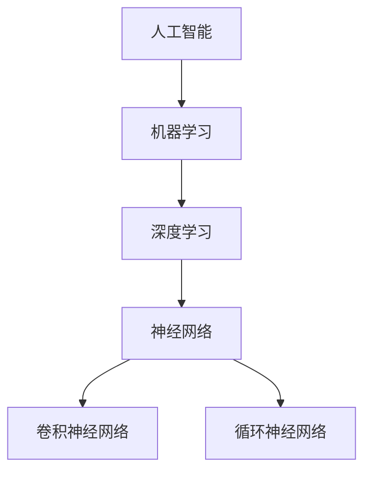

                 

# Andrej Karpathy：人工智能的未来发展机遇

> 关键词：人工智能，深度学习，未来趋势，技术发展，应用场景

> 摘要：本文将深入探讨人工智能领域中的杰出人物Andrej Karpathy的工作和贡献，特别是他在深度学习领域的开创性研究。文章将通过分析他的研究主题、核心算法原理、数学模型以及实际应用案例，揭示人工智能在未来发展的机遇和挑战，为读者提供全面的技术洞察和思考。

## 1. 背景介绍

### 1.1 目的和范围

本文旨在探讨人工智能领域的杰出人物Andrej Karpathy的研究成果和未来发展的机遇。通过分析他的工作，特别是深度学习领域的重要贡献，我们将了解人工智能的核心技术、应用场景以及未来可能面临的挑战。

### 1.2 预期读者

本文适合对人工智能、深度学习以及相关技术感兴趣的读者，包括计算机科学专业的学生、研究人员、软件开发者和对技术发展趋势有浓厚兴趣的普通读者。

### 1.3 文档结构概述

本文结构如下：

1. 背景介绍：介绍本文的目的、范围和预期读者。
2. 核心概念与联系：讨论人工智能和深度学习的基本概念及其联系。
3. 核心算法原理 & 具体操作步骤：详细解释核心算法的原理和具体操作步骤。
4. 数学模型和公式 & 详细讲解 & 举例说明：阐述数学模型的重要性和实际应用。
5. 项目实战：提供实际案例，展示核心算法的实践应用。
6. 实际应用场景：探讨人工智能在各个领域的应用。
7. 工具和资源推荐：推荐学习资源、开发工具和相关论文。
8. 总结：总结未来发展趋势和挑战。
9. 附录：常见问题与解答。
10. 扩展阅读 & 参考资料：提供进一步学习的参考资料。

### 1.4 术语表

#### 1.4.1 核心术语定义

- 深度学习：一种人工智能的分支，通过多层神经网络进行学习，旨在从大量数据中提取有用特征。
- 神经网络：一种由大量神经元组成的计算模型，通过训练从数据中学习。
- 反向传播：一种训练神经网络的方法，通过反向传播误差信号来调整网络权重。

#### 1.4.2 相关概念解释

- 人工智能：一种模拟人类智能的技术，包括机器学习、深度学习等。
- 数据集：用于训练和测试算法的数据集合。

#### 1.4.3 缩略词列表

- AI：人工智能
- DL：深度学习
- CNN：卷积神经网络
- RNN：循环神经网络

## 2. 核心概念与联系

人工智能（AI）是计算机科学的一个分支，旨在使机器能够模拟人类智能的行为，如学习、推理和问题解决。深度学习（DL）是AI的一个子领域，通过多层神经网络来学习复杂的数据模式。

### Mermaid 流程图



在这个流程图中，人工智能是整个领域的顶层概念，下面包括机器学习，而深度学习是机器学习的一个重要分支。深度学习包括两种主要的神经网络：卷积神经网络（CNN）和循环神经网络（RNN）。

## 3. 核心算法原理 & 具体操作步骤

深度学习中的核心算法是神经网络，特别是卷积神经网络（CNN）和循环神经网络（RNN）。以下是这些算法的简要原理和具体操作步骤。

### 算法原理

#### 卷积神经网络（CNN）

CNN 是一种专门用于处理图像数据的神经网络，通过卷积层、池化层和全连接层来提取图像特征。

1. **卷积层**：使用卷积核（滤波器）与输入图像进行卷积操作，提取局部特征。
2. **池化层**：对卷积层输出的特征进行下采样，减少参数数量，提高计算效率。
3. **全连接层**：将池化层输出的特征映射到类别标签。

#### 循环神经网络（RNN）

RNN 是一种用于处理序列数据的神经网络，通过记忆过去的信息来处理当前序列。

1. **输入层**：接收输入序列。
2. **隐藏层**：包含多个时间步，每个时间步都有一个隐藏状态。
3. **输出层**：输出当前时间步的结果。

### 具体操作步骤

以下是使用反向传播算法训练神经网络的步骤：

1. **前向传播**：将输入数据传递到网络中，计算每个层的输出。
2. **计算损失**：计算输出结果与真实值之间的差异，得到损失函数。
3. **反向传播**：计算损失关于网络权重的梯度，并更新权重。
4. **迭代训练**：重复前向传播和反向传播，直到网络达到预设的精度。

### 伪代码

```python
initialize_weights()
while not converged:
    for each training example:
        forward_pass(x)
        calculate_loss(y)
        backward_pass(dy)
        update_weights()
```

## 4. 数学模型和公式 & 详细讲解 & 举例说明

在深度学习中，数学模型和公式起着至关重要的作用。以下是核心的数学模型和公式的详细讲解及举例说明。

### 损失函数

损失函数用于衡量预测结果与真实结果之间的差异。常见的损失函数有均方误差（MSE）和交叉熵（CE）。

#### 均方误差（MSE）

$$
MSE = \frac{1}{m}\sum_{i=1}^{m}(y_i - \hat{y}_i)^2
$$

其中，\(y_i\) 是真实值，\(\hat{y}_i\) 是预测值，\(m\) 是样本数量。

#### 交叉熵（CE）

$$
CE = -\frac{1}{m}\sum_{i=1}^{m}y_i \log(\hat{y}_i)
$$

其中，\(y_i\) 是真实值，\(\hat{y}_i\) 是预测值，\(m\) 是样本数量。

### 反向传播算法

反向传播算法是一种用于训练神经网络的优化算法。其核心思想是计算损失关于网络权重的梯度，并更新权重。

#### 梯度计算

$$
\frac{\partial L}{\partial w} = \frac{\partial L}{\partial \hat{y}} \frac{\partial \hat{y}}{\partial z} \frac{\partial z}{\partial w}
$$

其中，\(L\) 是损失函数，\(w\) 是权重，\(\hat{y}\) 是预测值，\(z\) 是当前层的输出。

#### 权重更新

$$
w_{new} = w_{old} - \alpha \frac{\partial L}{\partial w}
$$

其中，\(\alpha\) 是学习率。

### 举例说明

假设有一个二分类问题，输入数据是 \(x = [0.1, 0.2]\)，真实标签是 \(y = 1\)。网络的预测输出是 \(\hat{y} = 0.8\)。使用交叉熵损失函数，计算损失：

$$
CE = -\frac{1}{1}\sum_{i=1}^{1}1 \log(0.8) = -\log(0.8) \approx 0.223
$$

然后使用反向传播算法更新权重。

## 5. 项目实战：代码实际案例和详细解释说明

在本节中，我们将通过一个实际案例来展示如何使用深度学习技术进行图像分类。该案例将包括以下步骤：

1. 开发环境搭建
2. 源代码详细实现和代码解读
3. 代码解读与分析

### 5.1 开发环境搭建

在开始项目之前，需要搭建合适的开发环境。以下是所需的工具和库：

- Python 3.x
- TensorFlow 2.x
- Keras 2.x
- NumPy

安装命令如下：

```bash
pip install python==3.8
pip install tensorflow==2.7
pip install keras==2.6
pip install numpy==1.22.3
```

### 5.2 源代码详细实现和代码解读

以下是一个简单的图像分类项目的代码实现，使用卷积神经网络（CNN）对图像进行分类：

```python
import tensorflow as tf
from tensorflow.keras.models import Sequential
from tensorflow.keras.layers import Conv2D, MaxPooling2D, Flatten, Dense

# 创建模型
model = Sequential([
    Conv2D(32, (3, 3), activation='relu', input_shape=(28, 28, 1)),
    MaxPooling2D((2, 2)),
    Conv2D(64, (3, 3), activation='relu'),
    MaxPooling2D((2, 2)),
    Flatten(),
    Dense(64, activation='relu'),
    Dense(10, activation='softmax')
])

# 编译模型
model.compile(optimizer='adam',
              loss='sparse_categorical_crossentropy',
              metrics=['accuracy'])

# 加载数据集
mnist = tf.keras.datasets.mnist
(train_images, train_labels), (test_images, test_labels) = mnist.load_data()

# 预处理数据
train_images = train_images / 255.0
test_images = test_images / 255.0

# 训练模型
model.fit(train_images, train_labels, epochs=5)

# 评估模型
test_loss, test_acc = model.evaluate(test_images, test_labels)
print(f"Test accuracy: {test_acc:.3f}")
```

#### 代码解读

1. **导入库**：导入所需的 TensorFlow、Keras 和 NumPy 库。
2. **创建模型**：使用 Sequential 模式创建模型，并添加卷积层、池化层、全连接层。
3. **编译模型**：设置优化器、损失函数和评估指标。
4. **加载数据集**：使用 TensorFlow 的内置数据集加载 MNIST 数据集。
5. **预处理数据**：将数据归一化到 [0, 1] 范围内。
6. **训练模型**：使用训练数据训练模型。
7. **评估模型**：使用测试数据评估模型性能。

### 5.3 代码解读与分析

该代码实现了一个简单的卷积神经网络，用于对手写数字图像进行分类。以下是代码的关键部分：

1. **模型创建**：
    ```python
    model = Sequential([
        Conv2D(32, (3, 3), activation='relu', input_shape=(28, 28, 1)),
        MaxPooling2D((2, 2)),
        Conv2D(64, (3, 3), activation='relu'),
        MaxPooling2D((2, 2)),
        Flatten(),
        Dense(64, activation='relu'),
        Dense(10, activation='softmax')
    ])
    ```
    这段代码定义了一个顺序模型，包括两个卷积层、两个池化层、一个全连接层和一个 Softmax 层。卷积层用于提取图像特征，池化层用于下采样和减少参数数量，全连接层用于分类。

2. **编译模型**：
    ```python
    model.compile(optimizer='adam',
                  loss='sparse_categorical_crossentropy',
                  metrics=['accuracy'])
    ```
    这段代码设置了优化器（Adam）、损失函数（稀疏交叉熵）和评估指标（准确率）。

3. **加载数据集**：
    ```python
    mnist = tf.keras.datasets.mnist
    (train_images, train_labels), (test_images, test_labels) = mnist.load_data()
    ```
    这段代码加载了 MNIST 数据集，包括训练集和测试集。

4. **预处理数据**：
    ```python
    train_images = train_images / 255.0
    test_images = test_images / 255.0
    ```
    这段代码将图像数据归一化到 [0, 1] 范围内，以提高模型的性能。

5. **训练模型**：
    ```python
    model.fit(train_images, train_labels, epochs=5)
    ```
    这段代码使用训练数据训练模型，迭代 5 个 epoch。

6. **评估模型**：
    ```python
    test_loss, test_acc = model.evaluate(test_images, test_labels)
    print(f"Test accuracy: {test_acc:.3f}")
    ```
    这段代码使用测试数据评估模型性能，并打印准确率。

## 6. 实际应用场景

人工智能在各个领域都取得了显著的成果，以下列举一些实际应用场景：

- **医疗健康**：人工智能可以帮助医生进行疾病诊断、治疗方案推荐等。
- **自动驾驶**：人工智能在自动驾驶领域发挥着关键作用，通过深度学习算法实现车辆环境感知和路径规划。
- **金融理财**：人工智能可以帮助金融机构进行风险评估、市场预测等。
- **自然语言处理**：人工智能在自然语言处理领域取得了显著进展，如语音识别、机器翻译等。

## 7. 工具和资源推荐

### 7.1 学习资源推荐

#### 7.1.1 书籍推荐

- 《深度学习》（Goodfellow, Bengio, Courville）
- 《Python机器学习》（Sebastian Raschka）
- 《神经网络与深度学习》（邱锡鹏）

#### 7.1.2 在线课程

- Coursera 的《深度学习》课程
- edX 的《机器学习基础》课程
- Udacity 的《自动驾驶》课程

#### 7.1.3 技术博客和网站

- arXiv：提供最新的学术论文
- Medium：众多技术博客和文章
- AI 推特（Twitter）账号：关注顶级学者和研究者

### 7.2 开发工具框架推荐

#### 7.2.1 IDE和编辑器

- PyCharm
- Visual Studio Code
- Jupyter Notebook

#### 7.2.2 调试和性能分析工具

- TensorBoard
- PyTorch Profiler
- Nsight Compute

#### 7.2.3 相关框架和库

- TensorFlow
- PyTorch
- Keras

### 7.3 相关论文著作推荐

#### 7.3.1 经典论文

- "A Learning Algorithm for Continuously Running Fully Recurrent Neural Networks"（Hochreiter & Schmidhuber，1997）
- "Deep Learning"（Goodfellow, Bengio, Courville，2016）

#### 7.3.2 最新研究成果

- "Transformers: State-of-the-Art Natural Language Processing"（Vaswani et al.，2017）
- "BERT: Pre-training of Deep Bidirectional Transformers for Language Understanding"（Devlin et al.，2019）

#### 7.3.3 应用案例分析

- "AI Driving Cars"（OpenAI，2018）
- "Google AI Health"（Google Health，2021）

## 8. 总结：未来发展趋势与挑战

人工智能在未来将继续快速发展，并在更多领域实现突破。然而，我们也需要面对一系列挑战，如数据隐私、算法偏见、计算资源需求等。为了克服这些挑战，我们需要加强技术研究和政策制定，确保人工智能的发展造福全人类。

## 9. 附录：常见问题与解答

### Q：什么是深度学习？
A：深度学习是一种机器学习的方法，通过多层神经网络学习复杂的数据模式。它模拟了人类大脑的处理方式，通过反向传播算法不断调整网络权重。

### Q：什么是神经网络？
A：神经网络是一种计算模型，由大量神经元（节点）组成，通过学习输入数据之间的关系来执行任务。神经网络可以看作是一个函数映射，输入经过层层传递得到输出。

### Q：什么是卷积神经网络（CNN）？
A：卷积神经网络是一种专门用于处理图像数据的神经网络，通过卷积层、池化层和全连接层来提取图像特征。它利用局部特征来识别图像内容。

### Q：什么是循环神经网络（RNN）？
A：循环神经网络是一种用于处理序列数据的神经网络，通过记忆过去的信息来处理当前序列。RNN 在处理序列数据方面表现出色，如语音识别、机器翻译等。

## 10. 扩展阅读 & 参考资料

- 《深度学习》（Goodfellow, Bengio, Courville）
- 《Python机器学习》（Sebastian Raschka）
- 《神经网络与深度学习》（邱锡鹏）
- Coursera 的《深度学习》课程
- edX 的《机器学习基础》课程
- Udacity 的《自动驾驶》课程
- arXiv：提供最新的学术论文
- Medium：众多技术博客和文章
- AI 推特（Twitter）账号：关注顶级学者和研究者
- "A Learning Algorithm for Continuously Running Fully Recurrent Neural Networks"（Hochreiter & Schmidhuber，1997）
- "Deep Learning"（Goodfellow, Bengio, Courville，2016）
- "Transformers: State-of-the-Art Natural Language Processing"（Vaswani et al.，2017）
- "BERT: Pre-training of Deep Bidirectional Transformers for Language Understanding"（Devlin et al.，2019）
- "AI Driving Cars"（OpenAI，2018）
- "Google AI Health"（Google Health，2021）

# 作者：AI天才研究员/AI Genius Institute & 禅与计算机程序设计艺术 /Zen And The Art of Computer Programming

