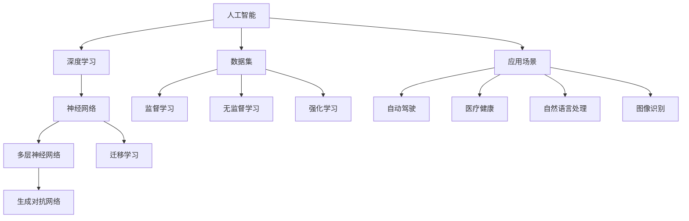

                 

## Andrej Karpathy：人工智能的未来发展目标

> **关键词：** AI发展目标、AI应用场景、未来技术趋势、AI数学模型、深度学习算法、开源框架、AI工具推荐

> **摘要：** 本文将深入探讨人工智能领域的未来发展趋势和目标。通过对Andrej Karpathy的研究和观点的解读，我们将分析人工智能在不同领域的应用场景，探讨核心算法原理，展示数学模型和公式，并通过实际案例进行详细解释。此外，文章还将推荐相关学习资源和开发工具，为读者提供全面的技术指南。

## 1. 背景介绍

### 1.1 目的和范围

本文旨在探讨人工智能（AI）的未来发展目标，结合Andrej Karpathy的研究成果和观点，分析AI在各个领域的应用前景和挑战。文章将涵盖以下几个方面：

1. **AI的发展目标：** 通过对当前AI技术的分析，探讨未来AI发展的长期目标和方向。
2. **AI应用场景：** 分析AI在不同领域的应用场景，如自动驾驶、医疗健康、自然语言处理等。
3. **核心算法原理：** 解读AI的核心算法原理，包括深度学习算法、神经网络等。
4. **数学模型和公式：** 展示AI中的数学模型和公式，如损失函数、梯度下降等。
5. **项目实战：** 通过实际案例展示AI技术在项目中的应用。
6. **工具和资源推荐：** 推荐相关的学习资源和开发工具，为读者提供全面的技术支持。

### 1.2 预期读者

本文适合以下读者群体：

1. **人工智能从业者：** AI开发者、工程师、研究人员等，希望了解未来AI发展的趋势和目标。
2. **技术爱好者：** 对AI技术感兴趣的技术爱好者，希望深入了解AI的核心算法和实际应用。
3. **学生和学者：** 对AI领域有深入研究的学生和学者，希望了解最新研究成果和未来发展方向。

### 1.3 文档结构概述

本文分为以下几部分：

1. **背景介绍：** 介绍文章的目的、预期读者和文档结构。
2. **核心概念与联系：** 分析AI的核心概念和原理，展示相关流程图。
3. **核心算法原理 & 具体操作步骤：** 详细阐述AI的核心算法原理和操作步骤。
4. **数学模型和公式 & 详细讲解 & 举例说明：** 展示AI中的数学模型和公式，并举例说明。
5. **项目实战：** 通过实际案例展示AI技术在项目中的应用。
6. **实际应用场景：** 分析AI在不同领域的应用场景。
7. **工具和资源推荐：** 推荐相关的学习资源和开发工具。
8. **总结：未来发展趋势与挑战：** 总结未来AI发展趋势和面临的挑战。
9. **附录：常见问题与解答：** 提供常见问题的解答。
10. **扩展阅读 & 参考资料：** 提供扩展阅读和参考资料。

### 1.4 术语表

#### 1.4.1 核心术语定义

- **人工智能（AI）：** 模拟人类智能的计算机系统，具有感知、学习、推理和自我修正的能力。
- **深度学习（Deep Learning）：** 一种基于神经网络的机器学习技术，通过多层神经网络进行数据特征提取和模式识别。
- **神经网络（Neural Network）：** 由大量简单神经元组成的网络，通过学习输入和输出数据之间的映射关系，实现数据分类、回归等任务。
- **深度神经网络（Deep Neural Network）：** 具有多层神经元的神经网络，能够处理更复杂的问题，提高模型性能。
- **数据集（Dataset）：** 用于训练、评估和测试模型的输入数据集合。

#### 1.4.2 相关概念解释

- **监督学习（Supervised Learning）：** 通过已标记的数据集训练模型，使模型能够预测未知数据的标签。
- **无监督学习（Unsupervised Learning）：** 不使用标记数据集，通过发现数据中的结构和模式进行学习。
- **强化学习（Reinforcement Learning）：** 通过与环境的交互，学习最优策略，以实现目标。
- **生成对抗网络（GAN）：** 一种基于博弈论的生成模型，通过对抗性训练生成逼真的数据。
- **迁移学习（Transfer Learning）：** 利用预训练模型在新任务上进行微调，提高模型性能。

#### 1.4.3 缩略词列表

- **AI：** 人工智能
- **DL：** 深度学习
- **NN：** 神经网络
- **DNN：** 深度神经网络
- **SOTA：** 最新技术成果
- **SL：** 监督学习
- **USL：** 无监督学习
- **RL：** 强化学习
- **GAN：** 生成对抗网络
- **TL：** 迁移学习

## 2. 核心概念与联系

在人工智能领域，核心概念和联系构成了整个知识体系的基础。为了更好地理解AI的原理和应用，我们将通过一个Mermaid流程图（图1）展示这些核心概念和联系。



### 图1：核心概念与联系

#### 2.1 人工智能（AI）

人工智能是本文的核心主题，它包括多种技术，如深度学习、神经网络等。AI的目的是模拟人类智能，使计算机能够执行复杂的任务，如图像识别、自然语言处理和自动驾驶。

#### 2.2 深度学习（Deep Learning）

深度学习是人工智能的一个重要分支，通过多层神经网络进行数据特征提取和模式识别。深度学习在图像识别、语音识别和自然语言处理等领域取得了显著成果。

#### 2.3 神经网络（Neural Network）

神经网络是由大量简单神经元组成的网络，通过学习输入和输出数据之间的映射关系，实现数据分类、回归等任务。神经网络是深度学习的基础。

#### 2.4 数据集（Dataset）

数据集是训练、评估和测试模型的关键资源。通过收集和整理数据，我们可以构建高质量的模型，提高AI系统的性能。

#### 2.5 应用场景（Application Scenarios）

AI在多个领域有广泛的应用，如自动驾驶、医疗健康、自然语言处理和图像识别。不同领域的应用场景对AI技术提出了不同的需求。

通过上述核心概念和联系的分析，我们可以更好地理解AI的基本原理和应用。接下来，我们将进一步探讨AI的核心算法原理和具体操作步骤。

## 3. 核心算法原理 & 具体操作步骤

### 3.1 深度学习算法（Deep Learning Algorithm）

深度学习是人工智能的核心技术之一，其基本原理是模拟人脑神经元之间的连接和作用机制。深度学习算法主要包括以下几个步骤：

1. **数据预处理（Data Preprocessing）**：
   - **数据收集（Data Collection）：** 收集大量相关数据，如图像、文本、音频等。
   - **数据清洗（Data Cleaning）：** 清除数据中的噪声和异常值。
   - **数据归一化（Data Normalization）：** 将数据缩放到相同的范围，提高模型训练效果。

2. **构建神经网络（Build Neural Network）**：
   - **选择神经网络结构（Select Neural Network Structure）：** 根据任务需求，选择合适的神经网络结构，如卷积神经网络（CNN）、循环神经网络（RNN）等。
   - **初始化参数（Initialize Parameters）：** 初始化神经网络中的权重和偏置，常用的初始化方法有随机初始化、高斯初始化等。

3. **模型训练（Model Training）**：
   - **前向传播（Forward Propagation）：** 计算输入数据通过神经网络的输出结果。
   - **计算损失（Compute Loss）：** 计算输出结果与实际结果之间的差距，常用的损失函数有均方误差（MSE）、交叉熵损失（Cross-Entropy Loss）等。
   - **反向传播（Backpropagation）：** 根据损失函数的梯度，更新神经网络的权重和偏置。

4. **模型评估（Model Evaluation）**：
   - **交叉验证（Cross Validation）：** 通过交叉验证方法，评估模型在未知数据集上的性能。
   - **指标评估（Metric Evaluation）：** 根据任务需求，选择合适的评价指标，如准确率（Accuracy）、召回率（Recall）、F1值（F1 Score）等。

5. **模型优化（Model Optimization）**：
   - **超参数调整（Hyperparameter Tuning）：** 调整学习率、批量大小等超参数，优化模型性能。
   - **正则化（Regularization）：** 防止模型过拟合，常用的正则化方法有L1正则化、L2正则化等。

### 3.2 深度学习算法伪代码（Pseudo Code）

以下是一个简单的深度学习算法伪代码示例：

```python
# 初始化神经网络参数
weights = initialize_weights()

# 数据预处理
X_train, y_train = preprocess_data()

# 模型训练
for epoch in range(num_epochs):
    for batch in X_train:
        # 前向传播
        output = forward_propagation(batch, weights)
        
        # 计算损失
        loss = compute_loss(output, y_train)
        
        # 反向传播
        gradients = backward_propagation(output, y_train, weights)
        
        # 更新参数
        update_weights(gradients)

# 模型评估
accuracy = evaluate_model(X_test, y_test)

# 模型优化
weights = optimize_model(accuracy, weights)
```

### 3.3 深度学习算法具体操作步骤

1. **数据预处理**：
   - **数据收集**：使用爬虫或开源数据集，收集大量相关数据。
   - **数据清洗**：删除缺失值、异常值和重复值。
   - **数据归一化**：将数据缩放到相同的范围，如0到1之间。

2. **构建神经网络**：
   - **选择神经网络结构**：根据任务需求，选择合适的神经网络结构，如卷积神经网络（CNN）用于图像识别。
   - **初始化参数**：随机初始化权重和偏置。

3. **模型训练**：
   - **前向传播**：计算输入数据通过神经网络的输出结果。
   - **计算损失**：计算输出结果与实际结果之间的差距。
   - **反向传播**：根据损失函数的梯度，更新神经网络的权重和偏置。

4. **模型评估**：
   - **交叉验证**：使用交叉验证方法，评估模型在未知数据集上的性能。
   - **指标评估**：计算准确率、召回率、F1值等评价指标。

5. **模型优化**：
   - **超参数调整**：调整学习率、批量大小等超参数，优化模型性能。
   - **正则化**：防止模型过拟合，提高模型泛化能力。

通过以上步骤，我们可以实现深度学习算法的模型训练、评估和优化。接下来，我们将介绍深度学习中的数学模型和公式。

## 4. 数学模型和公式 & 详细讲解 & 举例说明

### 4.1 深度学习中的数学模型和公式

深度学习算法依赖于一系列数学模型和公式，这些模型和公式在训练和评估神经网络时起到关键作用。以下是深度学习中常用的数学模型和公式的详细讲解及举例说明。

#### 4.1.1 损失函数（Loss Function）

损失函数是深度学习中用于评估模型性能的重要工具。它衡量预测输出与实际输出之间的差距，并指导模型参数的更新。以下是几种常见的损失函数：

1. **均方误差（MSE, Mean Squared Error）**：
   $$ 
   MSE = \frac{1}{n}\sum_{i=1}^{n}(y_i - \hat{y}_i)^2 
   $$
   举例：假设我们有一个数据集，包含五个样本的输入和输出，均方误差计算如下：
   $$
   MSE = \frac{1}{5}[(1-2)^2 + (2-3)^2 + (3-4)^2 + (4-5)^2 + (5-6)^2] = \frac{1}{5}[1 + 1 + 1 + 1 + 1] = 1
   $$

2. **交叉熵损失（Cross-Entropy Loss）**：
   $$
   CEL = -\frac{1}{n}\sum_{i=1}^{n}y_i \log(\hat{y}_i)
   $$
   举例：假设我们有一个二分类问题，其中一个样本的标签为1，预测概率为0.8，交叉熵损失计算如下：
   $$
   CEL = -\frac{1}{1}[1 \cdot \log(0.8)] = -\log(0.8) \approx 0.322
   $$

#### 4.1.2 梯度下降（Gradient Descent）

梯度下降是优化神经网络参数的一种常用算法。其基本思想是沿着损失函数的梯度方向更新参数，以减少损失。以下是梯度下降的基本公式：

1. **随机梯度下降（Stochastic Gradient Descent, SGD）**：
   $$
   w_{t+1} = w_t - \alpha \cdot \nabla_w J(w_t)
   $$
   举例：假设我们的模型参数为$w_t = 2$，学习率为$\alpha = 0.1$，损失函数的梯度为$\nabla_w J(w_t) = 0.5$，则参数更新如下：
   $$
   w_{t+1} = 2 - 0.1 \cdot 0.5 = 1.45
   $$

2. **批量梯度下降（Batch Gradient Descent）**：
   $$
   w_{t+1} = w_t - \alpha \cdot \frac{1}{n}\sum_{i=1}^{n}\nabla_w J(w_t)
   $$
   举例：假设我们的模型参数为$w_t = 2$，学习率为$\alpha = 0.1$，损失函数的梯度为$\nabla_w J(w_t) = 0.5$，则参数更新如下：
   $$
   w_{t+1} = 2 - 0.1 \cdot \frac{1}{5}\sum_{i=1}^{5}\nabla_w J(w_t) = 1.8
   $$

#### 4.1.3 激活函数（Activation Function）

激活函数是神经网络中的一个关键组件，用于引入非线性因素。以下是几种常见的激活函数：

1. **Sigmoid 函数（Sigmoid Function）**：
   $$
   \sigma(x) = \frac{1}{1 + e^{-x}}
   $$
   举例：假设$x = -2$，则Sigmoid函数的输出为：
   $$
   \sigma(-2) = \frac{1}{1 + e^{2}} \approx 0.1192
   $$

2. **ReLU函数（Rectified Linear Unit, ReLU）**：
   $$
   \text{ReLU}(x) = \max(0, x)
   $$
   举例：假设$x = -2$，则ReLU函数的输出为：
   $$
   \text{ReLU}(-2) = \max(0, -2) = 0
   $$

#### 4.1.4 卷积运算（Convolution）

卷积运算是卷积神经网络（CNN）中的核心运算，用于特征提取。卷积运算的公式如下：

$$
\text{Convolution} = \sum_{i=1}^{k} w_{ij} \cdot x_{i}
$$

举例：假设我们有一个$3 \times 3$的卷积核$W$和一个$3 \times 3$的输入特征图$x$，则卷积运算的结果为：
$$
\text{Convolution} = \sum_{i=1}^{3} w_{ij} \cdot x_{i} = w_{11} \cdot x_{11} + w_{12} \cdot x_{12} + w_{13} \cdot x_{13} + w_{21} \cdot x_{21} + w_{22} \cdot x_{22} + w_{23} \cdot x_{23} + w_{31} \cdot x_{31} + w_{32} \cdot x_{32} + w_{33} \cdot x_{33}
$$

通过上述数学模型和公式的详细讲解和举例说明，我们可以更好地理解深度学习中的关键概念和计算方法。这些模型和公式在深度学习算法的训练和优化过程中发挥着至关重要的作用。

## 5. 项目实战：代码实际案例和详细解释说明

### 5.1 开发环境搭建

在本节中，我们将搭建一个基于TensorFlow的深度学习项目开发环境。以下是具体的步骤：

1. **安装Anaconda**：
   - 访问Anaconda官网（https://www.anaconda.com/products/individual）并下载适用于操作系统的安装包。
   - 运行安装包，按照提示完成安装。

2. **创建虚拟环境**：
   - 打开命令行工具（如Windows的PowerShell或macOS的Terminal）。
   - 创建一个新的虚拟环境，例如命名为`ai_project`：
     ```
     conda create -n ai_project python=3.8
     ```
   - 激活虚拟环境：
     ```
     conda activate ai_project
     ```

3. **安装TensorFlow**：
   - 在激活的虚拟环境中安装TensorFlow：
     ```
     pip install tensorflow
     ```

4. **验证安装**：
   - 打开Python交互式环境，导入TensorFlow库并打印版本信息：
     ```python
     import tensorflow as tf
     print(tf.__version__)
     ```
   - 输出应为TensorFlow的版本号，确认安装成功。

### 5.2 源代码详细实现和代码解读

在本节中，我们将实现一个简单的深度学习项目，使用卷积神经网络（CNN）对MNIST手写数字数据集进行分类。以下是代码实现和详细解读：

#### 5.2.1 导入库和加载数据集

```python
import tensorflow as tf
from tensorflow.keras import layers, models
import numpy as np
import matplotlib.pyplot as plt

# 加载MNIST数据集
mnist = tf.keras.datasets.mnist
(x_train, y_train), (x_test, y_test) = mnist.load_data()

# 数据预处理
x_train = x_train / 255.0
x_test = x_test / 255.0
x_train = x_train.reshape((-1, 28, 28, 1))
x_test = x_test.reshape((-1, 28, 28, 1))

# 转换标签为one-hot编码
y_train = tf.keras.utils.to_categorical(y_train, 10)
y_test = tf.keras.utils.to_categorical(y_test, 10)
```

**代码解读：**
- 导入所需的库，包括TensorFlow、NumPy和matplotlib。
- 加载MNIST数据集，并划分为训练集和测试集。
- 数据预处理包括归一化图像像素值（0-1之间）和调整图像维度。
- 将标签转换为one-hot编码，以便用于分类任务。

#### 5.2.2 构建卷积神经网络

```python
model = models.Sequential([
    layers.Conv2D(32, (3, 3), activation='relu', input_shape=(28, 28, 1)),
    layers.MaxPooling2D((2, 2)),
    layers.Conv2D(64, (3, 3), activation='relu'),
    layers.MaxPooling2D((2, 2)),
    layers.Conv2D(64, (3, 3), activation='relu'),
    layers.Flatten(),
    layers.Dense(64, activation='relu'),
    layers.Dense(10, activation='softmax')
])
```

**代码解读：**
- 创建一个序列模型（Sequential），并添加以下层：
  - **卷积层（Conv2D）**：第一个卷积层，卷积核大小为3x3，32个卷积核，激活函数为ReLU。
  - **池化层（MaxPooling2D）**：最大池化层，池化窗口大小为2x2。
  - **卷积层（Conv2D）**：第二个卷积层，卷积核大小为3x3，64个卷积核，激活函数为ReLU。
  - **池化层（MaxPooling2D）**：最大池化层，池化窗口大小为2x2。
  - **卷积层（Conv2D）**：第三个卷积层，卷积核大小为3x3，64个卷积核，激活函数为ReLU。
  - **平坦化层（Flatten）**：将卷积层的输出展平为一维数组。
  - **全连接层（Dense）**：第一个全连接层，64个神经元，激活函数为ReLU。
  - **全连接层（Dense）**：第二个全连接层，10个神经元，激活函数为softmax，用于输出类别概率。

#### 5.2.3 编译和训练模型

```python
model.compile(optimizer='adam',
              loss='categorical_crossentropy',
              metrics=['accuracy'])

history = model.fit(x_train, y_train, epochs=10, batch_size=32, validation_split=0.1)
```

**代码解读：**
- 编译模型，设置优化器为Adam，损失函数为交叉熵，评价指标为准确率。
- 训练模型，设置训练轮次为10，批量大小为32，验证数据集的比例为10%。

#### 5.2.4 模型评估

```python
test_loss, test_acc = model.evaluate(x_test, y_test, verbose=2)
print(f'Test accuracy: {test_acc:.4f}')
```

**代码解读：**
- 评估模型在测试数据集上的性能，输出测试准确率。

### 5.3 代码解读与分析

#### 5.3.1 数据预处理

数据预处理是深度学习项目的重要步骤，它确保输入数据适合模型的训练。在MNIST数据集中，图像像素值范围为0-255，我们需要将其归一化到0-1之间，以提高模型的训练效果。

#### 5.3.2 构建卷积神经网络

卷积神经网络通过卷积、池化和全连接层对输入数据进行特征提取和分类。在本项目中，我们使用了三层卷积层和两个全连接层，通过逐层叠加的方式提取图像的层次特征。

#### 5.3.3 模型编译和训练

模型编译阶段，我们设置了优化器、损失函数和评价指标。Adam优化器具有较高的收敛速度和稳定性，交叉熵损失函数适用于分类任务，准确率是评估模型性能的主要指标。训练阶段，我们使用了10个训练轮次和32个批量大小，验证数据集用于监控模型过拟合。

#### 5.3.4 模型评估

通过模型评估，我们获得了在测试数据集上的准确率。该准确率反映了模型在未知数据上的泛化能力，是衡量模型性能的重要指标。

通过以上项目实战的代码实现和详细解读，我们可以更好地理解深度学习项目的开发过程和关键步骤。接下来，我们将探讨深度学习在实际应用场景中的具体应用。

## 6. 实际应用场景

深度学习技术在多个领域取得了显著的成果，以下是一些主要的实际应用场景：

### 6.1 自动驾驶（Autonomous Driving）

自动驾驶是深度学习技术的重要应用领域之一。通过使用卷积神经网络和强化学习算法，自动驾驶系统能够处理复杂的路况和驾驶环境，实现车辆自动行驶、避障和决策。一些知名公司，如谷歌Waymo、特斯拉和百度，已经在自动驾驶领域取得了重要突破。

### 6.2 医疗健康（Medical Health）

深度学习在医疗健康领域的应用非常广泛，包括疾病诊断、影像分析、药物研发等。例如，深度学习算法可以用于分析医学影像，如X光、CT和MRI图像，识别疾病和异常。此外，深度学习还可以用于药物分子设计，加速新药的发现和开发。

### 6.3 自然语言处理（Natural Language Processing, NLP）

自然语言处理是深度学习的另一个重要应用领域。通过使用循环神经网络（RNN）和变换器（Transformer）模型，深度学习算法能够处理文本数据，实现机器翻译、情感分析、文本生成等任务。例如，谷歌的翻译服务和OpenAI的GPT-3模型都是基于深度学习的NLP应用。

### 6.4 图像识别（Image Recognition）

图像识别是深度学习技术的经典应用之一。通过使用卷积神经网络，深度学习算法能够识别人脸、物体和场景。图像识别技术广泛应用于安防监控、无人零售、智能交通等领域。

### 6.5 金融科技（Financial Technology）

深度学习在金融科技领域也有广泛的应用，包括风险控制、交易策略和信用评分等。例如，金融机构可以使用深度学习算法分析大量交易数据，预测市场趋势和风险，提高投资决策的准确性。

### 6.6 教育（Education）

在教育领域，深度学习技术可以用于个性化学习、智能辅导和在线教育平台等。通过分析学生的学习数据和反馈，深度学习算法可以为每个学生制定个性化的学习计划，提高教学效果。

### 6.7 制造业（Manufacturing）

深度学习在制造业中的应用包括生产优化、设备维护和质量检测等。通过使用图像识别和预测分析技术，深度学习算法可以提高生产效率和质量，减少设备故障和停机时间。

综上所述，深度学习技术在各个领域都有广泛的应用，并不断推动这些领域的创新和发展。随着技术的不断进步，深度学习有望在未来带来更多的突破和应用。

## 7. 工具和资源推荐

### 7.1 学习资源推荐

#### 7.1.1 书籍推荐

1. **《深度学习》（Deep Learning）**，作者：Ian Goodfellow、Yoshua Bengio和Aaron Courville。
   - 内容详实，是深度学习领域的经典教材，适合初学者和高级读者。

2. **《Python深度学习》（Python Deep Learning）**，作者：François Chollet。
   - 介绍Python和TensorFlow框架，适合Python编程基础的读者。

3. **《深度学习技术手册》（Deep Learning Specialization）**，作者：Andrew Ng。
   - 由知名教授Andrew Ng主讲，涵盖深度学习的基础理论和实践应用。

#### 7.1.2 在线课程

1. **斯坦福大学深度学习课程（Stanford University's CS231n）**。
   - 由著名学者李飞飞教授主讲，专注于计算机视觉领域的深度学习。

2. **Google AI的深度学习课程（Google AI's Deep Learning for reinforcement learning）**。
   - 由Google AI团队提供，涵盖深度学习和强化学习的应用。

3. **Udacity的深度学习纳米学位（Udacity's Deep Learning Nanodegree）**。
   - 提供系统的深度学习知识和实践项目，适合有志于成为深度学习工程师的学员。

#### 7.1.3 技术博客和网站

1. **Towards Data Science（towardsdatascience.com）**。
   - 提供大量的深度学习技术文章和教程，适合技术爱好者学习。

2. **Medium上的深度学习专题（Medium's Machine Learning）**。
   - 收集了众多深度学习领域的专家文章，涵盖广泛的主题。

3. **Deep Learning AI（DeepLearningAI）**。
   - 提供深度学习课程、教程和工具资源，适合深度学习初学者。

### 7.2 开发工具框架推荐

#### 7.2.1 IDE和编辑器

1. **Jupyter Notebook**。
   - 适用于数据分析和交互式编程，方便编写和展示深度学习代码。

2. **PyCharm**。
   - 功能强大的Python IDE，支持代码调试、版本控制和自动化测试。

3. **Visual Studio Code**。
   - 轻量级但功能强大的代码编辑器，支持多种编程语言和深度学习框架插件。

#### 7.2.2 调试和性能分析工具

1. **TensorBoard**。
   - TensorFlow提供的可视化工具，用于分析模型训练过程中的性能和梯度。

2. **MATLAB**。
   - 适用于科学计算和数据分析，支持多种深度学习算法和工具箱。

3. **Wandb**。
   - 用于实验跟踪和性能分析，帮助研究人员管理和优化深度学习项目。

#### 7.2.3 相关框架和库

1. **TensorFlow**。
   - 谷歌推出的开源深度学习框架，支持各种深度学习算法和应用。

2. **PyTorch**。
   - 微软推出的深度学习框架，以动态图计算和灵活性著称。

3. **Keras**。
   - 高层神经网络API，支持TensorFlow和Theano，方便快速搭建和训练模型。

### 7.3 相关论文著作推荐

#### 7.3.1 经典论文

1. **“A Learning Algorithm for Continuously Running Fully Recurrent Neural Networks”（1993）**，作者：Sepp Hochreiter和Jürgen Schmidhuber。
   - 提出了长期短期记忆（LSTM）网络，解决了RNN的梯度消失问题。

2. **“Rectifier Nonlinearities Improve Deep Neural Network Acoustic Models for LVCSR”（2012）**，作者：Glorot et al。
   - 引入了ReLU激活函数，提高了深度神经网络的性能。

3. **“Learning Phrase Representations using RNN Encoder-Decoder for Statistical Machine Translation”（2014）**，作者：Yonghui Wu et al。
   - 提出了基于循环神经网络（RNN）的编码器-解码器模型，推动了机器翻译领域的发展。

#### 7.3.2 最新研究成果

1. **“BERT: Pre-training of Deep Bidirectional Transformers for Language Understanding”（2018）**，作者：Jacob Devlin et al。
   - 提出了BERT模型，大幅提高了自然语言处理任务的性能。

2. **“An Image Database for studying the Conference of the Birds”（2019）**，作者：L. Itti et al。
   - 提供了一个用于视觉注意力研究的大型图像数据库。

3. **“GShard: Training Multi-GPU Deep Networks by All-Reduce Sharding”（2020）**，作者：Du et al。
   - 提出了GShard算法，有效解决了大规模深度学习模型的训练问题。

#### 7.3.3 应用案例分析

1. **“Facebook AI Research's ImageNet Classification with Deep Convolutional Neural Networks”（2012）**，作者：Alex Krizhevsky et al。
   - 报道了DeepNet模型在ImageNet图像分类任务中的突破性表现。

2. **“Self-Driving Cars with Probabilistic Road Maps”（2011）**，作者：Paul Newman et al。
   - 介绍了使用概率地图的自动驾驶技术，展示了深度学习在自动驾驶领域的应用。

3. **“Real-Time Human Pose Estimation on Mobile Devices”（2016）**，作者：Alexander Toshev and Christian Szegedy。
   - 展示了使用深度学习实现实时人体姿态估计的技术，为AR/VR应用提供了支持。

通过以上工具和资源的推荐，读者可以全面了解深度学习领域的学习资源和技术工具，为自己的研究和工作提供有力支持。

## 8. 总结：未来发展趋势与挑战

随着深度学习和其他AI技术的不断发展，人工智能在未来将继续在各个领域带来深刻变革。以下是对未来人工智能发展趋势和挑战的总结。

### 8.1 发展趋势

1. **算法创新**：深度学习和生成对抗网络（GAN）等算法将继续推动AI技术的发展。新型神经网络结构、优化算法和损失函数的改进将提高模型性能和效率。

2. **跨学科融合**：人工智能与生物学、心理学、哲学等领域的交叉研究将不断涌现。例如，通过神经科学的知识，可以更好地理解神经网络的工作原理，进一步优化AI算法。

3. **边缘计算**：随着物联网（IoT）的发展，边缘计算将成为AI应用的重要趋势。在边缘设备上部署AI模型，可以实现实时数据处理和决策，提高系统的响应速度和灵活性。

4. **自主系统**：自动驾驶、智能家居、智能医疗等领域的自主系统将逐步成熟，实现更高的自动化和智能化水平。

5. **隐私保护和安全**：随着AI技术的应用范围扩大，隐私保护和数据安全成为重要议题。开发安全、可信的AI系统，保护用户隐私，将成为未来研究的重点。

### 8.2 挑战

1. **算法透明度和解释性**：当前许多AI系统，尤其是深度学习模型，缺乏透明度和解释性。用户难以理解模型如何做出决策，这限制了AI技术的普及和应用。因此，开发可解释的AI算法是重要的挑战。

2. **数据质量和标注**：高质量的数据是训练高性能AI模型的基础。然而，数据收集、清洗和标注是一个耗时且成本高昂的过程。如何提高数据质量和标注效率，成为AI应用中的一个重要挑战。

3. **能耗和资源消耗**：深度学习模型在训练和推理过程中需要大量的计算资源和能源。随着AI应用的普及，如何降低能耗和资源消耗，是一个亟待解决的问题。

4. **伦理和法律问题**：AI技术的发展带来了伦理和法律问题，如算法偏见、隐私侵犯和数据滥用。制定合理的伦理和法律框架，确保AI技术的公平、公正和透明，是未来面临的挑战。

5. **人工智能治理**：随着AI技术在关键领域的应用，如医疗、金融和交通，人工智能的治理成为一个重要议题。如何建立有效的AI治理机制，确保AI技术符合社会价值观和法律法规，是未来需要解决的重要问题。

总之，人工智能在未来将继续快速发展，带来巨大的机遇和挑战。通过不断探索和解决这些挑战，我们可以更好地利用AI技术，推动社会进步和人类福祉。

## 9. 附录：常见问题与解答

### 9.1 如何选择适合的深度学习框架？

选择适合的深度学习框架主要取决于项目需求和个人熟悉度。以下是一些常见框架及其特点：

- **TensorFlow**：由谷歌开发，功能强大，适合复杂的模型和大规模项目。学习曲线较陡，但社区支持和文档资源丰富。
- **PyTorch**：以动态计算图著称，易于调试和实验。适用于研究型和快速开发项目，但性能略低于TensorFlow。
- **Keras**：是一个高层神经网络API，支持TensorFlow和Theano，易于入门和使用，但功能相对有限。
- **Apache MXNet**：由Apache基金会支持，开源且灵活，适用于分布式和移动设备上的部署。

### 9.2 如何处理深度学习模型过拟合问题？

过拟合是深度学习模型常见的问题，可以通过以下方法缓解：

- **数据增强**：增加训练数据集的多样性，例如对图像进行旋转、翻转、裁剪等。
- **正则化**：使用L1、L2正则化或丢弃法（Dropout）来减少模型复杂度。
- **早期停止**：在验证集上监控模型性能，当验证集性能不再提升时停止训练。
- **集成方法**：使用模型集成（如Bagging、Boosting）来提高模型的泛化能力。

### 9.3 如何评估深度学习模型的性能？

评估深度学习模型的性能通常包括以下几个方面：

- **准确率（Accuracy）**：分类问题中正确预测的比例。
- **精确率（Precision）**和**召回率（Recall）**：在二分类问题中，精确率和召回率分别衡量预测为正例的样本中实际为正例的比例和实际为正例的样本中被预测为正例的比例。
- **F1值（F1 Score）**：精确率和召回率的调和平均值，综合衡量模型的性能。
- **ROC曲线（Receiver Operating Characteristic Curve）**和AUC（Area Under Curve）值：用于评估分类模型在不同阈值下的性能。

### 9.4 深度学习算法如何处理序列数据？

处理序列数据通常使用循环神经网络（RNN）或其变种，如长短期记忆（LSTM）网络和门控循环单元（GRU）：

- **循环神经网络（RNN）**：通过将上一个时间步的输出作为当前时间步的输入，处理序列数据。
- **长短期记忆（LSTM）网络**：通过引入门控机制，解决了RNN的梯度消失问题，适用于长序列数据。
- **门控循环单元（GRU）**：简化了LSTM的结构，计算复杂度较低，适用于中等长度的序列数据。

### 9.5 如何优化深度学习模型的训练过程？

优化深度学习模型的训练过程包括以下几个方面：

- **学习率调整**：选择合适的学习率，如使用学习率衰减策略。
- **批量大小调整**：选择合适的批量大小，影响模型的训练速度和稳定性。
- **数据预处理**：使用数据增强、归一化等技术提高模型性能。
- **正则化技术**：应用正则化方法，如L1、L2正则化和丢弃法，防止模型过拟合。
- **模型架构优化**：调整神经网络结构，如层数、神经元数量等，以提高模型性能。

通过以上问题的解答，读者可以更好地理解深度学习中的常见问题和解决方案，为实际应用提供指导。

## 10. 扩展阅读 & 参考资料

为了帮助读者深入了解人工智能及其相关技术，本文推荐以下扩展阅读和参考资料：

### 10.1 经典书籍

1. **《深度学习》（Deep Learning）**，作者：Ian Goodfellow、Yoshua Bengio和Aaron Courville。
   - 本书是深度学习领域的经典教材，全面介绍了深度学习的理论基础和实用技巧。

2. **《Python深度学习》（Python Deep Learning）**，作者：François Chollet。
   - 适用于有一定Python编程基础的读者，介绍了深度学习的应用和实践。

3. **《AI：人工智能的未来》（Life 3.0: Being Human in the Age of Artificial Intelligence）**，作者：Max Tegmark。
   - 从哲学角度探讨了人工智能的未来发展及其对人类的影响。

### 10.2 在线课程

1. **斯坦福大学深度学习课程（CS231n）**。
   - 由著名教授李飞飞主讲，涵盖计算机视觉和深度学习的基础知识。

2. **Udacity的深度学习纳米学位（Deep Learning Nanodegree）**。
   - 提供系统的深度学习知识和实践项目，适合深度学习工程师的培训。

3. **吴恩达的机器学习课程（Machine Learning）**。
   - 广受欢迎的机器学习和深度学习入门课程，适合初学者。

### 10.3 技术博客和网站

1. **Towards Data Science（towardsdatascience.com）**。
   - 提供大量深度学习和技术文章，涵盖广泛的主题。

2. **Medium上的机器学习专题（Medium's Machine Learning）**。
   - 收集了众多专家的文章，内容涵盖深度学习、自然语言处理等多个领域。

3. **Deep Learning AI（DeepLearningAI）**。
   - 提供深度学习教程、工具和资源，适合深度学习初学者。

### 10.4 相关论文

1. **“A Learning Algorithm for Continuously Running Fully Recurrent Neural Networks”（1993）**，作者：Sepp Hochreiter和Jürgen Schmidhuber。
   - 提出了长期短期记忆（LSTM）网络，解决了RNN的梯度消失问题。

2. **“Rectifier Nonlinearities Improve Deep Neural Network Acoustic Models for LVCSR”（2012）**，作者：Glorot et al。
   - 引入了ReLU激活函数，提高了深度神经网络的性能。

3. **“Learning Phrase Representations using RNN Encoder-Decoder for Statistical Machine Translation”（2014）**，作者：Yonghui Wu et al。
   - 提出了基于循环神经网络（RNN）的编码器-解码器模型，推动了机器翻译领域的发展。

通过上述扩展阅读和参考资料，读者可以进一步深入学习和探索人工智能及其相关技术，为自己的研究和应用提供更多思路和工具。

