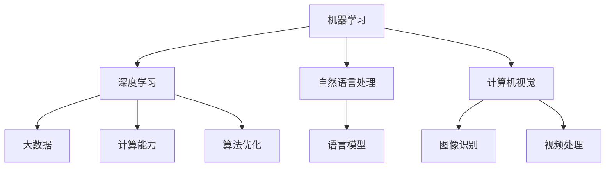
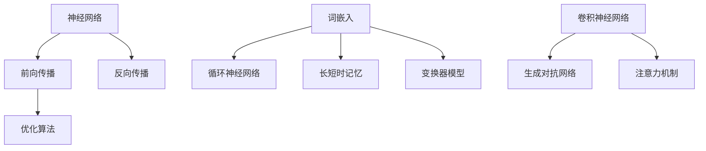

                 

# Andrej Karpathy：人工智能的未来发展策略

## 摘要

本文将深入探讨人工智能领域杰出人物安德烈·卡帕提（Andrej Karpathy）对未来人工智能发展策略的思考。卡帕提是一位享有盛誉的人工智能研究员、程序员和作家，他在深度学习领域有着深远的影响。本文将围绕他的核心观点，分析人工智能的技术趋势、挑战及其潜在解决方案。通过梳理卡帕提的研究成果和观点，我们希望为读者提供一幅关于人工智能未来发展的全景图。

## 1. 背景介绍

安德烈·卡帕提（Andrej Karpathy）是一位在人工智能（AI）和深度学习领域备受尊敬的研究员和作家。他曾在斯坦福大学攻读计算机科学博士学位，并在谷歌和OpenAI等顶级科技公司担任过要职。卡帕提的研究工作涵盖了计算机视觉、自然语言处理和机器学习等多个领域。他的研究成果不仅在学术界引起了广泛关注，也在工业界得到了实际应用。

卡帕提以其在自然语言处理（NLP）和深度学习方面的贡献而闻名。他参与了OpenAI的GPT模型开发，该模型在语言理解和生成任务上取得了前所未有的成绩。此外，他还发布了多个开源项目，如Deep Learning for Natural Language Processing（《深度学习与自然语言处理》），为全球研究者提供了宝贵的学习资源。

卡帕提的研究工作不仅推动了学术进步，也对社会产生了深远影响。他的观点和研究成果为人工智能技术的发展方向提供了重要参考，对行业从业者和技术爱好者都具有极高的价值。

## 2. 核心概念与联系

### 2.1 人工智能的构成

人工智能（AI）是一个多维度的领域，其核心包括以下几个方面：

- **机器学习（ML）**：通过数据训练模型，使其能够从数据中学习并做出预测或决策。
- **深度学习（DL）**：一种特殊的机器学习方法，通过多层神经网络模型进行学习。
- **自然语言处理（NLP）**：使计算机能够理解和生成人类语言的技术。
- **计算机视觉（CV）**：使计算机能够理解和处理图像和视频的技术。

### 2.2 关键技术进展

卡帕提认为，人工智能的发展得益于以下关键技术的进步：

- **大数据**：提供了足够的训练数据，使机器学习模型能够从大量数据中学习。
- **计算能力**：随着硬件性能的提升，深度学习模型能够处理更大规模的数据，训练更复杂的模型。
- **算法优化**：新的算法和优化方法，如Adam优化器和ResNet结构，显著提高了模型的性能。

### 2.3 Mermaid 流程图

为了更好地理解人工智能的构成和关键技术进展，我们可以使用Mermaid流程图来展示其核心节点和关系：



## 3. 核心算法原理 & 具体操作步骤

### 3.1 深度学习算法原理

深度学习是人工智能的核心组成部分，其基本原理如下：

- **神经网络**：模仿人脑的神经元连接结构，通过多层神经元进行信息处理。
- **前向传播**：将输入数据通过网络传递，经过每一层神经元的加权求和处理。
- **反向传播**：通过计算输出误差，更新每层神经元的权重，以减小误差。
- **优化算法**：如SGD、Adam等，用于调整网络权重，以实现模型的优化。

### 3.2 自然语言处理算法原理

自然语言处理是深度学习在语言领域的应用，其核心算法包括：

- **词嵌入（Word Embedding）**：将词语转换为向量表示，用于神经网络处理。
- **循环神经网络（RNN）**：用于处理序列数据，如文本和语音。
- **长短时记忆（LSTM）**：RNN的改进，能够更好地处理长序列数据。
- **变换器模型（Transformer）**：一种基于自注意力机制的深度学习模型，广泛应用于NLP任务。

### 3.3 计算机视觉算法原理

计算机视觉是深度学习在图像和视频处理领域的应用，其核心算法包括：

- **卷积神经网络（CNN）**：用于提取图像特征，广泛应用于图像分类、目标检测等任务。
- **生成对抗网络（GAN）**：通过生成器和判别器的对抗训练，生成逼真的图像和视频。
- **注意力机制（Attention）**：使模型能够关注到图像中的关键信息，提高处理效果。

### 3.4 Mermaid 流程图

为了更好地理解深度学习、自然语言处理和计算机视觉的核心算法原理，我们可以使用Mermaid流程图来展示：



## 4. 数学模型和公式 & 详细讲解 & 举例说明

### 4.1 数学模型

在深度学习中，常用的数学模型包括：

- **神经网络**：由多个神经元组成的网络，通过前向传播和反向传播进行训练。
- **损失函数**：用于评估模型预测结果与真实结果之间的误差，如均方误差（MSE）。
- **优化算法**：用于调整模型参数，以最小化损失函数，如梯度下降（GD）和Adam优化器。

### 4.2 公式

以下是深度学习中常用的数学公式：

- **神经网络前向传播**：
  $$ z^{[l]} = \sigma(W^{[l]} \cdot a^{[l-1]} + b^{[l]}) $$
  其中，$z^{[l]}$ 表示第$l$层的输出，$\sigma$ 表示激活函数，$W^{[l]}$ 和 $b^{[l]}$ 分别表示第$l$层的权重和偏置。

- **神经网络反向传播**：
  $$ \delta^{[l]} = \frac{\partial J}{\partial z^{[l]}} \cdot \frac{\partial z^{[l]}}{\partial a^{[l-1]}} $$
  其中，$\delta^{[l]}$ 表示第$l$层的误差，$J$ 表示损失函数。

- **Adam优化器**：
  $$ m_t = \beta_1 m_{t-1} + (1 - \beta_1) \cdot \frac{\partial J}{\partial W^{[l]}} $$
  $$ v_t = \beta_2 v_{t-1} + (1 - \beta_2) \cdot (\frac{\partial J}{\partial W^{[l]}})^2 $$
  $$ W^{[l]}_{new} = W^{[l]} - \frac{\alpha}{\sqrt{1 - \beta_2^t}(1 - \beta_1^t)} \cdot \frac{m_t}{\sqrt{v_t} + \epsilon} $$
  其中，$m_t$ 和 $v_t$ 分别表示一阶矩估计和二阶矩估计，$\beta_1$ 和 $\beta_2$ 分别为指数加权系数，$\alpha$ 为学习率。

### 4.3 举例说明

假设我们有一个简单的神经网络，其包含一个输入层、一个隐藏层和一个输出层。输入层有3个神经元，隐藏层有2个神经元，输出层有1个神经元。激活函数为ReLU函数，损失函数为均方误差（MSE）。

- **输入**：$a^{[0]} = [1, 2, 3]$
- **权重**：$W^{[1]} = \begin{bmatrix} 0.1 & 0.2 \\ 0.3 & 0.4 \end{bmatrix}$，$b^{[1]} = [0.1, 0.2]$
- **隐藏层前向传播**：
  $$ z^{[1]} = \sigma(W^{[1]} \cdot a^{[0]} + b^{[1]}) = \begin{bmatrix} 0.1 & 0.2 \\ 0.3 & 0.4 \end{bmatrix} \cdot \begin{bmatrix} 1 \\ 2 \\ 3 \end{bmatrix} + [0.1, 0.2] = \begin{bmatrix} 1.6 \\ 2.7 \end{bmatrix} $$
  $$ a^{[1]} = \sigma(z^{[1]}) = \begin{bmatrix} 1.6 \\ 2.7 \end{bmatrix} $$
- **输出层前向传播**：
  $$ z^{[2]} = \sigma(W^{[2]} \cdot a^{[1]} + b^{[2]}) = \begin{bmatrix} 0.5 & 0.6 \\ 0.7 & 0.8 \end{bmatrix} \cdot \begin{bmatrix} 1.6 \\ 2.7 \end{bmatrix} + [0.1, 0.2] = \begin{bmatrix} 2.76 \\ 4.32 \end{bmatrix} $$
  $$ a^{[2]} = \sigma(z^{[2]}) = 2.76 + 4.32 = 7.08 $$
- **损失函数**：$J = (7.08 - y)^2$，其中$y$为真实输出。
- **反向传播**：
  $$ \delta^{[2]} = \frac{\partial J}{\partial z^{[2]}} \cdot \frac{\partial z^{[2]}}{\partial a^{[1]}} = 2(7.08 - y) \cdot 0.1 $$
  $$ \delta^{[1]} = \frac{\partial J}{\partial z^{[1]}} \cdot \frac{\partial z^{[1]}}{\partial a^{[0]}} = 2(7.08 - y) \cdot 0.1 \cdot \begin{bmatrix} 1.6 \\ 2.7 \end{bmatrix} $$
- **权重更新**：
  $$ W^{[2]}_{new} = W^{[2]} - \alpha \cdot \delta^{[2]} \cdot a^{[1].T $$
  $$ W^{[1]}_{new} = W^{[1]} - \alpha \cdot \delta^{[1]} \cdot a^{[0].T $$

## 5. 项目实战：代码实际案例和详细解释说明

### 5.1 开发环境搭建

为了进行深度学习项目实战，我们需要搭建一个适合的开发环境。以下是搭建Python深度学习开发环境的步骤：

1. **安装Python**：下载并安装Python 3.8及以上版本。
2. **安装Anaconda**：下载并安装Anaconda，以便管理Python环境和包。
3. **创建虚拟环境**：在Anaconda命令行中创建一个名为`project`的虚拟环境。
   ```bash
   conda create -n project python=3.8
   conda activate project
   ```
4. **安装深度学习库**：在虚拟环境中安装TensorFlow、Keras和NumPy等深度学习库。
   ```bash
   conda install tensorflow keras numpy
   ```

### 5.2 源代码详细实现和代码解读

下面是一个简单的深度学习项目，用于实现一个线性回归模型，并使用TensorFlow和Keras进行训练。

```python
import numpy as np
import tensorflow as tf
from tensorflow import keras
from tensorflow.keras import layers

# 数据生成
x = np.random.random((100, 1))
y = 2 * x + 1 + np.random.random((100, 1))

# 构建模型
model = keras.Sequential([
    layers.Dense(units=1, input_shape=(1,))
])

# 编译模型
model.compile(optimizer='sgd', loss='mean_squared_error')

# 训练模型
model.fit(x, y, epochs=100)

# 预测
print(model.predict([3.0]))
```

#### 5.2.1 代码解读

1. **数据生成**：使用numpy生成100个随机数作为训练数据。
2. **构建模型**：使用Keras构建一个简单的线性回归模型，包含一个全连接层，输出层有1个神经元。
3. **编译模型**：设置优化器和损失函数，准备训练模型。
4. **训练模型**：使用fit方法训练模型，指定训练数据和迭代次数。
5. **预测**：使用predict方法进行预测，输入一个数据样本。

### 5.3 代码解读与分析

#### 5.3.1 数据生成

```python
x = np.random.random((100, 1))
y = 2 * x + 1 + np.random.random((100, 1))
```

这一部分代码生成100个随机数作为训练数据。`x`表示自变量，`y`表示因变量。这里使用了`np.random.random`函数生成随机数，并使用线性关系$y = 2x + 1$生成对应的因变量。

#### 5.3.2 构建模型

```python
model = keras.Sequential([
    layers.Dense(units=1, input_shape=(1,))
])
```

这一部分代码使用Keras构建了一个简单的线性回归模型。`Sequential`模型是一个线性堆叠模型，可以依次添加多个层。这里只添加了一个全连接层（`Dense`），输入形状为$(1,)$，表示输入数据的维度。输出层有1个神经元，用于预测因变量。

#### 5.3.3 编译模型

```python
model.compile(optimizer='sgd', loss='mean_squared_error')
```

这一部分代码编译了模型，设置了优化器和损失函数。这里使用`sgd`（随机梯度下降）作为优化器，使用`mean_squared_error`（均方误差）作为损失函数。

#### 5.3.4 训练模型

```python
model.fit(x, y, epochs=100)
```

这一部分代码使用`fit`方法训练模型。`fit`方法接受训练数据和迭代次数（`epochs`）作为参数，模型将使用训练数据迭代训练100次。

#### 5.3.5 预测

```python
print(model.predict([3.0]))
```

这一部分代码使用`predict`方法进行预测。输入一个数据样本[3.0]，模型将返回预测结果。这里返回的结果是一个数组，包含一个预测值。

## 6. 实际应用场景

### 6.1 自然语言处理

自然语言处理是人工智能领域的重要应用之一，广泛应用于聊天机器人、搜索引擎、机器翻译和文本分类等任务。卡帕提的研究成果在自然语言处理领域有着广泛的应用。

- **聊天机器人**：基于深度学习模型，如GPT和BERT，构建智能聊天机器人，实现与用户的自然对话。
- **搜索引擎**：利用自然语言处理技术，提高搜索引擎的搜索质量和用户体验。
- **机器翻译**：基于深度学习模型，实现高质量、低误差的机器翻译。
- **文本分类**：将文本数据分类到不同的类别，如新闻分类、情感分析等。

### 6.2 计算机视觉

计算机视觉技术在自动驾驶、图像识别、视频处理等领域具有重要应用。

- **自动驾驶**：基于深度学习模型，如CNN和GAN，实现车辆的感知、路径规划和控制。
- **图像识别**：通过卷积神经网络，实现对图像中物体的检测和分类。
- **视频处理**：利用循环神经网络和注意力机制，实现对视频数据的有效分析和处理。

### 6.3 医疗领域

人工智能在医疗领域的应用前景广阔，包括疾病预测、诊断辅助和药物研发等。

- **疾病预测**：通过分析患者的病历和基因数据，预测疾病的发生风险。
- **诊断辅助**：利用深度学习模型，辅助医生进行疾病诊断，提高诊断准确率。
- **药物研发**：基于深度学习模型，加速药物研发过程，降低研发成本。

## 7. 工具和资源推荐

### 7.1 学习资源推荐

- **书籍**：
  - 《深度学习》（Goodfellow, Bengio, Courville）
  - 《Python深度学习》（François Chollet）
  - 《自然语言处理与深度学习》（Daniel Jurafsky, James H. Martin）
- **论文**：
  - “A Theoretical Analysis of the Cramer-Rao Lower Bound for Estimation of Neural Network Parameters”
  - “Attention Is All You Need”
  - “Generative Adversarial Networks”
- **博客**：
  - Andrej Karpathy的博客
  - TensorFlow官方博客
  - Keras官方文档
- **网站**：
  - arXiv（学术论文数据库）
  - PyTorch官方文档
  - JAX官方文档

### 7.2 开发工具框架推荐

- **深度学习框架**：
  - TensorFlow
  - PyTorch
  - JAX
- **代码库**：
  - Keras
  - Hugging Face Transformers
  - Fast.ai
- **云计算平台**：
  - AWS AI服务
  - Google Cloud AI服务
  - Azure AI服务

### 7.3 相关论文著作推荐

- **论文**：
  - “A Theoretical Analysis of the Cramer-Rao Lower Bound for Estimation of Neural Network Parameters”
  - “Attention Is All You Need”
  - “Generative Adversarial Networks”
  - “ResNet: Training Deep Neural Networks with Very Deep Structures at Scale”
  - “Bert: Pre-training of Deep Bidirectional Transformers for Language Understanding”
- **著作**：
  - 《深度学习》（Goodfellow, Bengio, Courville）
  - 《Python深度学习》（François Chollet）
  - 《自然语言处理与深度学习》（Daniel Jurafsky, James H. Martin）

## 8. 总结：未来发展趋势与挑战

### 8.1 未来发展趋势

- **模型规模与效率**：随着计算能力的提升，深度学习模型将变得更加复杂和庞大，同时提高模型的训练和推理效率成为关键挑战。
- **多模态学习**：跨模态学习（如文本、图像、音频等）将得到广泛关注，实现不同模态数据的有效融合和协同学习。
- **自主学习和强化学习**：自主学习（如无监督学习和自监督学习）和强化学习将在人工智能应用中发挥更大作用，实现更智能的决策和优化。
- **泛化能力**：提升模型在未知数据上的泛化能力，减少过拟合现象，成为深度学习研究的重要方向。

### 8.2 未来挑战

- **数据隐私与安全**：随着人工智能应用的普及，数据隐私和安全问题日益凸显，保护用户隐私和防止数据泄露成为重要挑战。
- **算法透明性与可解释性**：提高深度学习算法的透明性和可解释性，使其更容易被用户理解、信任和监管。
- **伦理与法律**：人工智能技术的发展引发了伦理和法律问题，如算法歧视、隐私侵犯等，需要制定相应的伦理和法律规范。
- **计算资源与能耗**：大规模深度学习模型的训练和推理需要大量计算资源和能源，如何降低能耗成为关键问题。

## 9. 附录：常见问题与解答

### 9.1 深度学习的基本原理是什么？

深度学习是一种通过多层神经网络进行训练和预测的机器学习方法。其基本原理包括：

- **神经网络**：由多个神经元组成的网络，通过前向传播和反向传播进行训练。
- **激活函数**：用于引入非线性变换，提高模型的表达能力。
- **损失函数**：用于评估模型预测结果与真实结果之间的误差。
- **优化算法**：用于调整模型参数，以最小化损失函数。

### 9.2 自然语言处理的关键技术有哪些？

自然语言处理的关键技术包括：

- **词嵌入**：将词语转换为向量表示，用于神经网络处理。
- **循环神经网络（RNN）**：用于处理序列数据，如文本和语音。
- **长短时记忆（LSTM）**：RNN的改进，能够更好地处理长序列数据。
- **变换器模型（Transformer）**：一种基于自注意力机制的深度学习模型，广泛应用于NLP任务。

### 9.3 计算机视觉的核心算法是什么？

计算机视觉的核心算法包括：

- **卷积神经网络（CNN）**：用于提取图像特征，广泛应用于图像分类、目标检测等任务。
- **生成对抗网络（GAN）**：通过生成器和判别器的对抗训练，生成逼真的图像和视频。
- **注意力机制**：使模型能够关注到图像中的关键信息，提高处理效果。

## 10. 扩展阅读 & 参考资料

- [Andrej Karpathy的博客](https://karpathy.github.io/)
- [《深度学习与自然语言处理》](https://www.deeplearningbook.org/chapter_nlp/)
- [TensorFlow官方文档](https://www.tensorflow.org/)
- [PyTorch官方文档](https://pytorch.org/)
- [《自然语言处理与深度学习》](https://www.amazon.com/Natural-Language-Processing-Deep-Learning/dp/149204958X)

