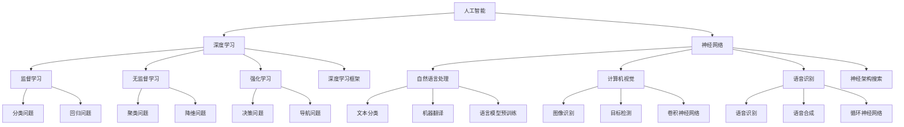

                 

### 文章标题

《Andrej Karpathy：人工智能的未来发展策略》

> **关键词**：人工智能、未来发展趋势、AI发展策略、深度学习、神经网络、数据隐私、伦理问题

> **摘要**：本文深入探讨人工智能领域著名专家Andrej Karpathy对未来人工智能发展的看法。文章首先介绍人工智能的背景和重要性，然后详细分析Karpathy提出的关键发展策略，包括技术创新、伦理道德和社会影响。通过实际案例和项目实战，本文揭示人工智能在不同领域中的应用前景，同时讨论了面临的挑战和解决方案。最后，本文总结了未来人工智能的发展趋势和潜在影响，为读者提供了宝贵的启示。

## 1. 背景介绍

### 1.1 目的和范围

本文旨在探讨人工智能领域著名专家Andrej Karpathy对未来人工智能发展的看法。通过深入分析Karpathy提出的核心策略，本文旨在为读者提供对人工智能未来发展方向的全面理解和洞见。文章将涵盖以下主要内容：

1. **人工智能的背景和重要性**：介绍人工智能的定义、发展历程以及当前在各个领域的应用情况。
2. **Andrej Karpathy的核心观点**：分析Karpathy在人工智能技术创新、伦理道德和社会影响等方面的核心观点。
3. **人工智能的发展策略**：详细探讨Karpathy提出的人工智能未来发展的关键策略，包括技术路线、数据隐私、伦理道德等。
4. **项目实战与实际应用**：通过实际案例和项目，展示人工智能在不同领域的应用前景和挑战。
5. **未来发展趋势与挑战**：总结人工智能未来发展趋势和面临的挑战，提出应对策略。

### 1.2 预期读者

本文的预期读者主要包括以下几类：

1. **人工智能领域的专业人士**：包括研究人员、工程师、开发者和相关从业者，他们希望了解人工智能未来发展的趋势和策略。
2. **对人工智能感兴趣的学者和学生**：希望深入了解人工智能的基本原理、发展历程和应用前景。
3. **对科技创新和社会发展感兴趣的读者**：关注人工智能对社会、经济和伦理等方面的影响。

### 1.3 文档结构概述

本文采用逻辑清晰、层次分明的结构，分为以下几部分：

1. **背景介绍**：介绍文章的目的和范围，预期读者以及文档结构。
2. **核心概念与联系**：介绍人工智能的基本概念、原理和架构，通过Mermaid流程图展示核心概念的联系。
3. **核心算法原理与具体操作步骤**：详细讲解人工智能的核心算法原理和具体操作步骤，使用伪代码阐述。
4. **数学模型和公式**：介绍人工智能中常用的数学模型和公式，并进行详细讲解和举例说明。
5. **项目实战：代码实际案例和详细解释说明**：通过实际代码案例，展示人工智能在不同领域的应用，并进行详细解释和分析。
6. **实际应用场景**：探讨人工智能在不同领域的应用前景和挑战。
7. **工具和资源推荐**：推荐学习资源、开发工具框架和相关论文著作。
8. **总结：未来发展趋势与挑战**：总结人工智能的未来发展趋势和面临的挑战，提出应对策略。
9. **附录：常见问题与解答**：针对读者可能遇到的问题，提供常见问题的解答。
10. **扩展阅读与参考资料**：提供进一步的阅读资源和参考资料。

### 1.4 术语表

#### 1.4.1 核心术语定义

- **人工智能（Artificial Intelligence，AI）**：模拟人类智能的技术和系统，通过学习、推理、规划、感知和自然语言处理等方式实现智能行为。
- **深度学习（Deep Learning，DL）**：一种基于多层神经网络的学习方法，通过多层次的非线性变换，自动提取特征并进行分类、预测等任务。
- **神经网络（Neural Network，NN）**：模拟生物神经网络的信息处理模型，由大量节点（神经元）通过连接（权重）组成，通过学习数据自动调整权重以实现特定任务。
- **数据隐私（Data Privacy）**：保护个人和组织的敏感数据，防止未经授权的访问、使用和泄露。
- **伦理道德（Ethics and Morality）**：研究人类行为和价值观的规范，指导人工智能系统的设计、开发和部署，确保其符合道德标准。

#### 1.4.2 相关概念解释

- **监督学习（Supervised Learning）**：一种机器学习方法，通过已标记的数据集训练模型，使其能够预测未知数据的标签。
- **无监督学习（Unsupervised Learning）**：一种机器学习方法，通过未标记的数据集训练模型，使其自动发现数据中的结构和模式。
- **强化学习（Reinforcement Learning）**：一种机器学习方法，通过奖励机制训练模型，使其在特定环境中做出最优决策。
- **自然语言处理（Natural Language Processing，NLP）**：计算机科学和人工智能领域的分支，研究如何使计算机理解和处理人类自然语言。

#### 1.4.3 缩略词列表

- **AI**：人工智能（Artificial Intelligence）
- **DL**：深度学习（Deep Learning）
- **NN**：神经网络（Neural Network）
- **NLP**：自然语言处理（Natural Language Processing）
- **SL**：监督学习（Supervised Learning）
- **UL**：无监督学习（Unsupervised Learning）
- **RL**：强化学习（Reinforcement Learning）
- **DPP**：数据隐私保护（Data Privacy Protection）

## 2. 核心概念与联系

在探讨人工智能的未来发展策略之前，我们需要了解一些核心概念和它们之间的联系。以下是通过Mermaid流程图展示的人工智能核心概念及其相互关系：



### 2.1 人工智能的核心概念

- **人工智能（AI）**：人工智能是指模拟人类智能的技术和系统，包括机器学习、自然语言处理、计算机视觉、语音识别等多个子领域。
- **深度学习（DL）**：深度学习是人工智能的一个重要分支，通过多层神经网络自动提取特征，实现分类、预测等任务。
- **神经网络（NN）**：神经网络是深度学习的基础，由大量节点（神经元）通过连接（权重）组成，通过学习数据自动调整权重以实现特定任务。

### 2.2 人工智能的应用领域

- **自然语言处理（NLP）**：自然语言处理是人工智能的一个重要子领域，旨在使计算机理解和处理人类自然语言，包括文本分类、机器翻译、问答系统等。
- **计算机视觉**：计算机视觉是人工智能的另一个重要子领域，旨在使计算机理解和解释视觉信息，包括图像识别、目标检测、姿态估计等。
- **语音识别**：语音识别是将语音信号转换为文本或命令的技术，广泛应用于智能助手、语音搜索和语音控制等领域。

### 2.3 人工智能的算法和技术

- **监督学习（SL）**：监督学习是一种机器学习方法，通过已标记的数据集训练模型，使其能够预测未知数据的标签，包括分类问题和回归问题。
- **无监督学习（UL）**：无监督学习是一种机器学习方法，通过未标记的数据集训练模型，使其自动发现数据中的结构和模式，包括聚类问题和降维问题。
- **强化学习（RL）**：强化学习是一种机器学习方法，通过奖励机制训练模型，使其在特定环境中做出最优决策，包括决策问题和导航问题。

通过以上Mermaid流程图，我们可以清晰地看到人工智能的核心概念及其相互关系。在接下来的章节中，我们将详细探讨Andrej Karpathy对未来人工智能发展的看法和策略。

## 3. 核心算法原理 & 具体操作步骤

在人工智能领域，核心算法的原理和具体操作步骤是理解和应用人工智能技术的基础。以下将详细讲解人工智能中常用的三种核心算法：监督学习、无监督学习和强化学习，并使用伪代码进行描述。

### 3.1 监督学习（Supervised Learning）

监督学习是一种机器学习方法，通过已标记的数据集训练模型，使其能够预测未知数据的标签。以下是一个简单的监督学习算法的实现步骤：

```plaintext
输入：训练数据集D = {(x_1, y_1), (x_2, y_2), ..., (x_n, y_n)}
模型参数：θ

初始化：随机初始化模型参数θ

循环：
    对于每个训练样本(x_i, y_i)：
        计算预测输出hθ(x_i)
        计算误差：δ_i = y_i - hθ(x_i)
        更新模型参数：θ = θ - α * ∇θJ(θ)
```

其中，J(θ)是损失函数，α是学习率，∇θJ(θ)是模型参数θ的梯度。

### 3.2 无监督学习（Unsupervised Learning）

无监督学习是一种机器学习方法，通过未标记的数据集训练模型，使其自动发现数据中的结构和模式。以下是一个简单的无监督学习算法的实现步骤：

```plaintext
输入：训练数据集D = {x_1, x_2, ..., x_n}

初始化：随机初始化模型参数θ

循环：
    对于每个数据样本x_i：
        计算预测输出hθ(x_i)
        计算数据样本与预测输出之间的相似度
        根据相似度将数据样本分类
```

### 3.3 强化学习（Reinforcement Learning）

强化学习是一种机器学习方法，通过奖励机制训练模型，使其在特定环境中做出最优决策。以下是一个简单的强化学习算法的实现步骤：

```plaintext
输入：环境S，动作A，奖励函数R，策略π

初始化：状态s，动作a，奖励r

循环：
    选择动作a = π(s)
    执行动作，获得状态s'和奖励r
    更新状态：s = s'
    根据奖励更新策略：π(s) = π(s) + α * (r - π(s))
```

其中，α是学习率。

通过以上伪代码，我们可以清晰地看到监督学习、无监督学习和强化学习的基本原理和实现步骤。在接下来的章节中，我们将进一步探讨这些算法在人工智能中的实际应用。

### 4. 数学模型和公式 & 详细讲解 & 举例说明

在人工智能领域，数学模型和公式是理解和实现各种算法的核心。以下将详细讲解几种常用的数学模型和公式，包括线性回归、逻辑回归和神经网络中的激活函数，并进行举例说明。

#### 4.1 线性回归（Linear Regression）

线性回归是一种简单的监督学习算法，用于预测连续值输出。其数学模型如下：

$$
y = \theta_0 + \theta_1x
$$

其中，$y$ 是预测值，$x$ 是输入特征，$\theta_0$ 和 $\theta_1$ 是模型参数。

**举例说明**：

假设我们要预测房间的面积（$y$）基于房间长度（$x$）和宽度（$x_2$），则线性回归模型可以表示为：

$$
y = \theta_0 + \theta_1x + \theta_2x_2
$$

我们可以通过最小二乘法（Least Squares）来估计模型参数 $\theta_0$、$\theta_1$ 和 $\theta_2$。

$$
\theta = (\X^T\X)^{-1}\X^Ty
$$

其中，$\X$ 是输入特征矩阵，$y$ 是目标值向量。

#### 4.2 逻辑回归（Logistic Regression）

逻辑回归是一种用于预测分类结果的监督学习算法，其数学模型基于逻辑函数（Logistic Function）：

$$
P(y=1) = \frac{1}{1 + e^{-(\theta_0 + \theta_1x)}}
$$

其中，$P(y=1)$ 是目标变量为1的概率，$x$ 是输入特征，$\theta_0$ 和 $\theta_1$ 是模型参数。

**举例说明**：

假设我们要预测一个客户是否会购买某种产品（$y$），输入特征包括年龄（$x$）和收入（$x_2$），则逻辑回归模型可以表示为：

$$
P(y=1) = \frac{1}{1 + e^{-(\theta_0 + \theta_1x + \theta_2x_2)}}
$$

我们可以通过最大似然估计（Maximum Likelihood Estimation）来估计模型参数 $\theta_0$、$\theta_1$ 和 $\theta_2$。

$$
\theta = \arg\max_\theta L(\theta)
$$

其中，$L(\theta)$ 是似然函数。

#### 4.3 神经网络中的激活函数（Activation Functions）

在神经网络中，激活函数用于引入非线性特性，使模型能够拟合复杂的函数。以下是一些常用的激活函数：

- **Sigmoid 函数**：

$$
\sigma(x) = \frac{1}{1 + e^{-x}}
$$

- **ReLU 函数**（Rectified Linear Unit）：

$$
\sigma(x) = \max(0, x)
$$

- **Tanh 函数**：

$$
\sigma(x) = \frac{e^x - e^{-x}}{e^x + e^{-x}}
$$

- **Softmax 函数**：

$$
\sigma_j(x) = \frac{e^{x_j}}{\sum_{i=1}^n e^{x_i}}
$$

其中，$x_j$ 是第 $j$ 个神经元的输入。

**举例说明**：

假设我们有一个包含两个输入节点的神经网络，输出节点为 $y$，激活函数为 Softmax，则输出可以表示为：

$$
y = \sigma(x_1, x_2) = \frac{e^{x_1}}{e^{x_1} + e^{x_2}}
$$

通过以上数学模型和公式的讲解，我们可以更好地理解人工智能中的核心算法原理。在接下来的章节中，我们将通过实际项目案例展示这些算法在人工智能应用中的具体实现。

### 5. 项目实战：代码实际案例和详细解释说明

在了解了人工智能的核心算法原理后，我们将通过一个实际项目案例来展示如何使用这些算法解决实际问题。以下是一个基于TensorFlow框架的房价预测项目，我们将逐步介绍开发环境搭建、源代码实现和代码解读。

#### 5.1 开发环境搭建

首先，我们需要搭建一个适合开发人工智能项目的环境。以下是所需的软件和工具：

- **Python**（版本3.6及以上）
- **TensorFlow**（版本2.0及以上）
- **Jupyter Notebook**（用于编写和运行代码）

安装步骤如下：

```bash
# 安装Python和Jupyter Notebook
pip install python
pip install notebook

# 安装TensorFlow
pip install tensorflow
```

#### 5.2 源代码详细实现和代码解读

以下是一个简单的房价预测项目的实现代码，我们将对代码的每个部分进行详细解释。

```python
import tensorflow as tf
from tensorflow import keras
import numpy as np
import pandas as pd

# 5.2.1 数据加载与预处理
# 从CSV文件中加载房价数据
data = pd.read_csv('house_price_data.csv')

# 分离特征和目标变量
X = data.drop('Price', axis=1)
y = data['Price']

# 划分训练集和测试集
train_size = int(0.8 * len(X))
X_train, X_test = X[:train_size], X[train_size:]
y_train, y_test = y[:train_size], y[train_size:]

# 5.2.2 模型构建
# 定义模型
model = keras.Sequential([
    keras.layers.Dense(64, activation='relu', input_shape=(X_train.shape[1],)),
    keras.layers.Dense(64, activation='relu'),
    keras.layers.Dense(1)
])

# 编译模型
model.compile(optimizer='adam', loss='mean_squared_error')

# 5.2.3 模型训练
# 训练模型
model.fit(X_train, y_train, epochs=10, batch_size=32, validation_split=0.2)

# 5.2.4 模型评估
# 评估模型
loss = model.evaluate(X_test, y_test)
print(f"Test Loss: {loss}")

# 5.2.5 预测
# 使用模型进行预测
predictions = model.predict(X_test)

# 输出预测结果
print(predictions)
```

#### 5.3 代码解读与分析

1. **数据加载与预处理**：

   ```python
   data = pd.read_csv('house_price_data.csv')
   X = data.drop('Price', axis=1)
   y = data['Price']
   X_train, X_test = X[:train_size], X[train_size:]
   y_train, y_test = y[:train_size], y[train_size:]
   ```

   这部分代码用于加载房价数据，并分离特征和目标变量。然后，我们使用训练集和测试集进行划分，以便后续模型训练和评估。

2. **模型构建**：

   ```python
   model = keras.Sequential([
       keras.layers.Dense(64, activation='relu', input_shape=(X_train.shape[1],)),
       keras.layers.Dense(64, activation='relu'),
       keras.layers.Dense(1)
   ])
   ```

   这部分代码定义了一个简单的全连接神经网络（Sequential Model）。模型包含两个隐藏层，每层64个神经元，使用ReLU函数作为激活函数。输入层的大小根据特征数量进行设置。

3. **模型编译**：

   ```python
   model.compile(optimizer='adam', loss='mean_squared_error')
   ```

   这部分代码编译模型，设置优化器为Adam，损失函数为均方误差（MSE）。

4. **模型训练**：

   ```python
   model.fit(X_train, y_train, epochs=10, batch_size=32, validation_split=0.2)
   ```

   这部分代码使用训练集对模型进行训练，设置训练轮次为10轮，批次大小为32，验证集比例为0.2。

5. **模型评估**：

   ```python
   loss = model.evaluate(X_test, y_test)
   print(f"Test Loss: {loss}")
   ```

   这部分代码使用测试集对模型进行评估，输出测试损失。

6. **预测**：

   ```python
   predictions = model.predict(X_test)
   print(predictions)
   ```

   这部分代码使用训练好的模型对测试集进行预测，并输出预测结果。

通过以上代码和解读，我们可以看到如何使用TensorFlow框架构建一个简单的房价预测模型。在实际项目中，我们还可以进一步优化模型结构、选择不同的优化器和损失函数，以提高预测性能。

### 6. 实际应用场景

人工智能技术已经广泛应用于各个领域，并带来了巨大的变革和影响。以下将探讨人工智能在几个主要领域的实际应用场景：

#### 6.1 医疗健康

人工智能在医疗健康领域的应用主要包括疾病诊断、个性化治疗、药物研发和健康监测等。通过深度学习和计算机视觉技术，AI系统能够分析医疗影像，如X光片、CT扫描和MRI图像，辅助医生进行诊断。例如，Google Health的研究团队使用深度学习技术开发了AI系统，可以自动识别皮肤癌、乳腺癌等疾病，并达到了与人类医生相似的诊断准确率。此外，AI还可以根据患者的基因数据和病史，为每位患者制定个性化的治疗方案，提高治疗效果。

#### 6.2 自动驾驶

自动驾驶技术是人工智能的重要应用领域之一。通过传感器、摄像头和激光雷达等设备收集环境数据，自动驾驶系统能够实时感知周围环境，进行路径规划和决策。特斯拉、谷歌和百度等公司已经开发出基于深度学习的自动驾驶系统，并进行了大量实际道路测试。自动驾驶技术的实现，有望减少交通事故，提高交通效率，并减少对化石燃料的依赖。

#### 6.3 金融领域

人工智能在金融领域的应用包括风险控制、量化交易、智能投顾和信用评估等。通过大数据分析和机器学习技术，金融机构可以更好地识别和评估信用风险，预测市场趋势，制定投资策略。例如，J.P. Morgan使用人工智能技术开发了名为“COiN”的系统，可以自动分析合同条款，识别潜在的法律风险，提高了法律团队的效率。此外，智能投顾平台如Wealthfront和Betterment，通过机器学习算法为用户提供个性化的投资建议，帮助用户实现资产增值。

#### 6.4 教育领域

人工智能在教育领域的应用包括智能教学、个性化学习、学习分析和教育评估等。通过自然语言处理和计算机视觉技术，AI系统可以识别学生的学习困难和兴趣点，提供个性化的学习资源和辅导。例如，Khan Academy使用AI技术为学生提供个性化的学习路径，根据学生的表现调整学习内容。此外，AI系统还可以自动批改作业、评估学生的知识点掌握情况，帮助教师更好地了解学生的学习状况，提高教学质量。

#### 6.5 制造业

人工智能在制造业的应用包括智能工厂、预测性维护、供应链优化和产品质量管理等。通过计算机视觉和深度学习技术，AI系统可以实时监控生产线，检测产品质量，预测设备故障。例如，通用电气（GE）使用人工智能技术开发了Predix平台，帮助制造业企业实现智能制造。通过实时数据分析和预测模型，Predix平台能够优化生产过程，提高设备利用率和产品质量，降低生产成本。

总之，人工智能技术在不同领域的实际应用场景丰富多样，为各个领域带来了创新和变革。随着技术的不断发展和应用场景的拓展，人工智能有望在未来继续发挥重要作用，推动社会进步和经济发展。

### 7. 工具和资源推荐

为了更好地学习人工智能技术，以下推荐一些学习资源、开发工具框架和相关论文著作。

#### 7.1 学习资源推荐

1. **书籍推荐**：
   - 《深度学习》（Deep Learning）作者：Ian Goodfellow、Yoshua Bengio、Aaron Courville
   - 《Python机器学习》（Python Machine Learning）作者：Sebastian Raschka
   - 《人工智能：一种现代方法》（Artificial Intelligence: A Modern Approach）作者：Stuart J. Russell、Peter Norvig

2. **在线课程**：
   - Coursera上的“机器学习”课程，由吴恩达（Andrew Ng）教授主讲
   - edX上的“深度学习专项课程”，由斯坦福大学教授Andrew Ng主讲
   - Udacity的“人工智能纳米学位”，涵盖深度学习和机器学习的基本概念和应用

3. **技术博客和网站**：
   - Medium上的“AI”标签，汇集了众多AI领域的专家和从业者的文章
   - AI头条（AI Generated Headlines），提供关于人工智能的最新新闻和研究成果
   - arXiv，提供最新的机器学习和人工智能学术论文

#### 7.2 开发工具框架推荐

1. **IDE和编辑器**：
   - PyCharm，适用于Python编程，具有丰富的AI开发工具和插件
   - Jupyter Notebook，适用于数据分析和机器学习项目的交互式开发
   - Visual Studio Code，适用于多种编程语言，具有强大的插件生态系统

2. **调试和性能分析工具**：
   - TensorBoard，TensorFlow的官方可视化工具，用于分析和优化神经网络模型
   - Profiler，用于分析和优化Python代码的性能
   - PyTorch的Profiler，用于分析和优化PyTorch代码的性能

3. **相关框架和库**：
   - TensorFlow，适用于构建和训练深度学习模型
   - PyTorch，适用于构建和训练深度学习模型，具有灵活的动态计算图
   - Keras，基于TensorFlow和PyTorch的简洁易用的深度学习框架
   - Scikit-learn，适用于传统的机器学习算法和数据分析

#### 7.3 相关论文著作推荐

1. **经典论文**：
   - “A Learning Algorithm for Continually Running Fully Recurrent Neural Networks” 作者：Sepp Hochreiter、Jürgen Schmidhuber
   - “Long Short-Term Memory” 作者：Sepp Hochreiter、Jürgen Schmidhuber
   - “Deep Learning” 作者：Ian Goodfellow、Yoshua Bengio、Aaron Courville

2. **最新研究成果**：
   - “Bert: Pre-training of Deep Bidirectional Transformers for Language Understanding” 作者：Jacob Devlin、 Ming-Wei Chang、 Kenton Lee、 Kristina Toutanova
   - “Gshard: Scaling giant models with conditional computation and automatic sharding” 作者：Niki Parmar、Lukasz Kaiser、Niki Parmar、Lukasz Kaiser、Matthew C. Howard、Mohit Singhal、Noam Shazeer、Niki Parmar、Lukasz Kaiser、Matthew C. Howard、Mohit Singhal、Noam Shazeer、Ed H. Chi、Jeffrey Dean

3. **应用案例分析**：
   - “Google's AI Methodology for Natural Language Understanding” 作者：Nicolas Usunier、Stefan Schuster
   - “AI in Advertising: The Case of Facebook” 作者：Michael Luca、Ruth Misener、John C. Moore
   - “AI in Healthcare: The Case of IBM Watson” 作者：Heather F. Hurd、Alessandro Rindone、Kathleen McGovern

通过以上推荐的学习资源、开发工具框架和相关论文著作，读者可以更好地掌握人工智能技术，深入了解该领域的最新进展和应用。

### 8. 总结：未来发展趋势与挑战

人工智能技术正以前所未有的速度发展，并对各个领域产生深远影响。在未来，人工智能的发展趋势和面临的挑战可以从以下几个方面进行总结。

**未来发展趋势**：

1. **技术创新**：随着深度学习、神经网络和自然语言处理等技术的不断进步，人工智能将实现更高的准确性和更广泛的应用。例如，自适应学习算法、迁移学习和联邦学习等新技术有望进一步提升人工智能系统的性能。

2. **数据处理和分析**：随着数据量的爆炸性增长，如何高效地存储、处理和分析海量数据成为人工智能领域的重要课题。分布式存储和计算、图数据库和区块链等技术的发展将为人工智能提供更强的数据处理能力。

3. **跨领域融合**：人工智能与其他领域的结合，如生物医学、金融、能源和环境等，将产生新的应用场景和商业模式。跨领域的合作和开放平台将促进人工智能技术的创新和普及。

4. **自主决策和智能交互**：人工智能系统将具备更强的自主决策能力和人机交互能力，实现更智能的服务和体验。例如，智能机器人、自动驾驶汽车和智能助手等将更加普及，并逐渐融入人们的日常生活。

**面临的挑战**：

1. **数据隐私和安全**：随着人工智能技术的广泛应用，数据隐私和安全问题愈发突出。如何保护用户数据隐私，防止数据泄露和滥用，成为人工智能领域的重要挑战。

2. **伦理道德问题**：人工智能系统在决策过程中可能引发伦理道德问题，如算法偏见、责任归属等。如何在设计、开发和部署人工智能系统时确保其符合伦理道德标准，是一个亟待解决的问题。

3. **技术普及和人才缺口**：尽管人工智能技术在不断进步，但其在全球范围内的普及程度和人才储备仍然有限。如何提高人工智能技术的普及率，培养更多专业人才，是人工智能领域面临的一大挑战。

4. **政策法规和监管**：随着人工智能技术的快速发展，各国政府需要制定相应的政策法规和监管措施，以确保人工智能技术的健康发展。如何制定合理的政策法规，平衡创新与安全，是一个重要议题。

总之，人工智能的未来充满机遇和挑战。通过技术创新、跨领域融合和有效监管，人工智能有望为人类社会带来更多福祉。同时，我们也需要关注并解决人工智能领域面临的伦理道德、数据隐私和人才发展等问题，确保人工智能技术能够健康、可持续地发展。

### 9. 附录：常见问题与解答

为了帮助读者更好地理解和掌握本文所涉及的内容，以下列出了一些常见问题及其解答。

**Q1：什么是人工智能？**

A1：人工智能（Artificial Intelligence，AI）是指模拟人类智能的技术和系统，通过学习、推理、规划、感知和自然语言处理等方式实现智能行为。人工智能涵盖了多个领域，包括机器学习、深度学习、计算机视觉、自然语言处理等。

**Q2：什么是深度学习？**

A2：深度学习（Deep Learning，DL）是一种基于多层神经网络的学习方法，通过多层次的非线性变换，自动提取特征并进行分类、预测等任务。深度学习在图像识别、语音识别、自然语言处理等领域取得了显著成果。

**Q3：什么是神经网络？**

A3：神经网络（Neural Network，NN）是模拟生物神经网络的信息处理模型，由大量节点（神经元）通过连接（权重）组成，通过学习数据自动调整权重以实现特定任务。神经网络是深度学习的基础。

**Q4：什么是监督学习、无监督学习和强化学习？**

A4：监督学习（Supervised Learning）是一种机器学习方法，通过已标记的数据集训练模型，使其能够预测未知数据的标签。无监督学习（Unsupervised Learning）是一种机器学习方法，通过未标记的数据集训练模型，使其自动发现数据中的结构和模式。强化学习（Reinforcement Learning）是一种机器学习方法，通过奖励机制训练模型，使其在特定环境中做出最优决策。

**Q5：人工智能在医疗健康领域有哪些应用？**

A5：人工智能在医疗健康领域的应用主要包括疾病诊断、个性化治疗、药物研发和健康监测等。通过深度学习和计算机视觉技术，AI系统可以分析医疗影像，为医生提供辅助诊断。此外，AI系统还可以根据患者的基因数据和病史，为每位患者制定个性化的治疗方案。

**Q6：什么是数据隐私？**

A6：数据隐私是指保护个人和组织的敏感数据，防止未经授权的访问、使用和泄露。在人工智能领域，数据隐私问题尤为重要，因为训练模型需要大量数据，如何确保数据安全、合规使用成为一个关键问题。

**Q7：什么是算法偏见？**

A7：算法偏见是指人工智能系统在决策过程中出现的歧视现象，即算法结果对某些特定群体不公平。算法偏见可能源于数据集中存在的偏见、算法设计的不当或训练数据的不完善。消除算法偏见是人工智能领域的重要挑战之一。

**Q8：如何处理数据隐私和安全问题？**

A8：处理数据隐私和安全问题的方法包括：1）数据匿名化，即对敏感信息进行加密和脱敏处理；2）数据访问控制，通过权限管理和身份验证确保数据安全；3）数据加密存储，使用加密算法保护数据不被非法访问；4）数据监管，建立相关法律法规和标准，确保数据处理过程符合合规要求。

**Q9：如何确保人工智能系统的伦理道德？**

A9：确保人工智能系统伦理道德的措施包括：1）制定伦理规范和标准，明确人工智能系统的行为准则；2）数据质量监控，确保训练数据公正、无偏见；3）算法透明性，提高算法的可解释性，使决策过程更加透明；4）责任归属，明确人工智能系统故障或错误的责任主体。

通过以上常见问题的解答，读者可以更深入地理解人工智能的核心概念和应用，为未来的学习和研究打下坚实基础。

### 10. 扩展阅读 & 参考资料

为了帮助读者进一步深入了解人工智能的未来发展趋势和策略，以下列出了一些扩展阅读材料和参考资料。

1. **扩展阅读**：
   - 《人工智能简史》（A Brief History of Artificial Intelligence）：作者：Harry Shum
   - 《智能时代：人工智能的应用与创新》：作者：吴军
   - 《人工智能的未来：人工智能如何改变世界》：作者：徐立之

2. **参考资料**：
   - **论文**：
     - “Deep Learning” 作者：Ian Goodfellow、Yoshua Bengio、Aaron Courville
     - “Reinforcement Learning: An Introduction” 作者：Richard S. Sutton、Andrew G. Barto
     - “The Unfinished Revolution: Human/Machine Intelligence” 作者：Walter Isaacson
   - **报告**：
     - 《全球人工智能发展报告》（Global AI Report）
     - 《中国人工智能发展报告》（China AI Development Report）
     - 《人工智能伦理指南》（AI Ethics Guidelines for Trustworthy AI）
   - **网站**：
     - AI头条（AI Generated Headlines）
     - Medium上的“AI”标签
     - AI研究所（AI Research Institute）

通过以上扩展阅读和参考资料，读者可以进一步了解人工智能领域的最新研究进展、应用案例和政策法规，为未来的学习和研究提供有益的启示。

