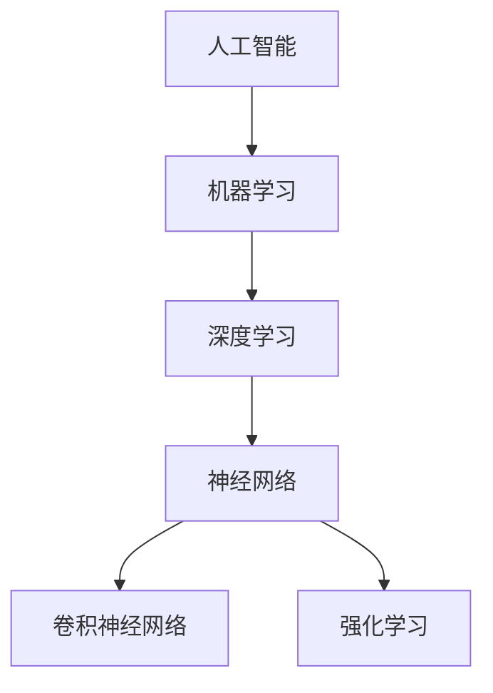

                 

# Andrej Karpathy：人工智能的未来发展规划

> **关键词：**人工智能、未来发展规划、技术趋势、算法、应用场景、数学模型、实际案例、工具资源
>
> **摘要：**本文将深入探讨人工智能领域的未来发展趋势，包括核心算法原理、数学模型、实际应用案例，并推荐相关的工具和资源，旨在为读者提供一个全面的技术规划和视角，帮助他们在人工智能领域取得更大的成就。

## 1. 背景介绍

### 1.1 目的和范围

本文旨在探讨人工智能领域的发展规划，特别是对未来五至十年的技术趋势和应用场景进行分析。本文将涵盖以下内容：

1. 核心算法原理与具体操作步骤
2. 数学模型与公式讲解
3. 实际应用场景
4. 工具和资源推荐
5. 未来发展趋势与挑战

### 1.2 预期读者

本文面向以下读者群体：

1. 对人工智能感兴趣的计算机科学和工程专业的学生和研究人员
2. 想要在人工智能领域深入发展的程序员和技术专家
3. 对技术趋势和未来应用场景感兴趣的产业界人士

### 1.3 文档结构概述

本文将按照以下结构进行：

1. 背景介绍
2. 核心概念与联系
3. 核心算法原理 & 具体操作步骤
4. 数学模型和公式 & 详细讲解 & 举例说明
5. 项目实战：代码实际案例和详细解释说明
6. 实际应用场景
7. 工具和资源推荐
8. 总结：未来发展趋势与挑战
9. 附录：常见问题与解答
10. 扩展阅读 & 参考资料

### 1.4 术语表

#### 1.4.1 核心术语定义

- **人工智能（AI）：** 通过计算机模拟人类智能行为的技术。
- **机器学习（ML）：** 人工智能的一个分支，通过数据和算法自动改进性能。
- **深度学习（DL）：** 机器学习的一个子领域，利用多层神经网络进行学习。

#### 1.4.2 相关概念解释

- **神经网络（NN）：** 模拟人脑结构和功能的计算模型。
- **卷积神经网络（CNN）：** 专门用于图像识别和处理的神经网络。
- **强化学习（RL）：** 通过试错和奖励机制来学习如何做出决策。

#### 1.4.3 缩略词列表

- **AI：** 人工智能
- **ML：** 机器学习
- **DL：** 深度学习
- **NN：** 神经网络
- **CNN：** 卷积神经网络
- **RL：** 强化学习

## 2. 核心概念与联系

在人工智能领域，理解核心概念和它们之间的联系至关重要。以下是一个简单的 Mermaid 流程图，展示了一些核心概念及其相互关系：



### 2.1 人工智能的核心概念

- **机器学习（ML）：** 机器学习是人工智能的一个分支，它通过数据、算法和计算能力使计算机能够自动学习和改进性能。机器学习算法可以分为监督学习、无监督学习和半监督学习。

- **深度学习（DL）：** 深度学习是机器学习的一个子领域，它依赖于多层神经网络，能够自动提取数据中的特征。深度学习在图像识别、自然语言处理和游戏等领域取得了显著的成果。

- **神经网络（NN）：** 神经网络是一种计算模型，模拟人脑神经元的工作原理。神经网络由多个神经元（或节点）组成，这些节点通过权重连接在一起，形成网络。

- **卷积神经网络（CNN）：** 卷积神经网络是一种专门用于图像识别和处理的神经网络。CNN 使用卷积操作来提取图像中的局部特征，并通过池化操作来减少参数数量。

- **强化学习（RL）：** 强化学习是一种通过试错和奖励机制来学习如何做出决策的机器学习算法。强化学习在机器人控制、游戏和自动驾驶等领域具有重要应用。

## 3. 核心算法原理 & 具体操作步骤

### 3.1 机器学习算法原理

机器学习算法的核心是训练模型，使其能够根据输入数据预测输出。以下是一个简单的机器学习算法原理的伪代码：

```plaintext
输入：训练数据集（X, Y）
输出：训练好的模型

1. 初始化模型参数
2. 对于每个训练样本（x, y）：
   a. 计算预测输出（y'）
   b. 计算损失函数（L(y', y)）
   c. 更新模型参数（θ）
3. 迭代直至模型收敛
4. 返回训练好的模型
```

### 3.2 深度学习算法原理

深度学习算法是基于多层神经网络，通过逐层提取数据中的特征来实现。以下是一个简单的深度学习算法原理的伪代码：

```plaintext
输入：输入层（X），隐藏层（H），输出层（Y）
输出：训练好的深度学习模型

1. 初始化模型参数（W1, b1, W2, b2, ...）
2. 对于每个训练样本（x, y）：
   a. 前向传播：计算隐藏层输出（h）和输出层输出（y'）
   b. 计算损失函数（L(y', y)）
   c. 反向传播：更新模型参数（W1, b1, W2, b2, ...）
3. 迭代直至模型收敛
4. 返回训练好的深度学习模型
```

### 3.3 卷积神经网络（CNN）算法原理

卷积神经网络是一种专门用于图像识别和处理的神经网络，它通过卷积操作和池化操作来提取图像特征。以下是一个简单的 CNN 算法原理的伪代码：

```plaintext
输入：图像（I）
输出：图像特征（F）

1. 初始化卷积核（K）和步长（s）
2. 对于每个卷积层：
   a. 卷积操作：计算卷积层输出（F1）
   b. 池化操作：计算池化层输出（F2）
3. 返回图像特征（F）
```

### 3.4 强化学习（RL）算法原理

强化学习是一种通过试错和奖励机制来学习如何做出决策的算法。以下是一个简单的强化学习算法原理的伪代码：

```plaintext
输入：环境（E），状态（S），动作（A），奖励（R）
输出：策略（π）

1. 初始化模型参数（θ）
2. 对于每个时间步t：
   a. 根据策略π选择动作A
   b. 执行动作A，观察状态S和奖励R
   c. 更新模型参数（θ）
   d. 更新策略π
3. 返回策略（π）
```

## 4. 数学模型和公式 & 详细讲解 & 举例说明

### 4.1 数学模型

在人工智能领域，数学模型是非常重要的，以下是一些常见的数学模型和公式：

#### 4.1.1 损失函数

损失函数是评估模型性能的重要指标，以下是一些常见的损失函数：

- **均方误差（MSE）：**

  $$L(\theta) = \frac{1}{2}\sum_{i=1}^{n}(y_i - \hat{y}_i)^2$$

- **交叉熵（CE）：**

  $$L(\theta) = -\sum_{i=1}^{n} y_i \log(\hat{y}_i)$$

#### 4.1.2 梯度下降

梯度下降是更新模型参数的一种常用方法，其公式如下：

$$\theta_{\text{更新}} = \theta - \alpha \nabla_{\theta} L(\theta)$$

其中，$\alpha$ 是学习率，$\nabla_{\theta} L(\theta)$ 是损失函数关于参数 $\theta$ 的梯度。

#### 4.1.3 反向传播

反向传播是一种计算神经网络梯度的方法，其核心思想是逐层计算梯度，并更新网络权重。其公式如下：

$$\nabla_{\theta} L(\theta) = \nabla_{z} L(z) \cdot \nabla_{W} z$$

其中，$z$ 是神经网络的输出，$W$ 是网络权重。

### 4.2 举例说明

以下是一个简单的线性回归模型的数学模型和举例说明：

#### 4.2.1 数学模型

假设我们有以下线性回归模型：

$$y = \theta_0 + \theta_1 x$$

其中，$y$ 是目标变量，$x$ 是输入变量，$\theta_0$ 和 $\theta_1$ 是模型参数。

损失函数为：

$$L(\theta) = \frac{1}{2}\sum_{i=1}^{n}(y_i - (\theta_0 + \theta_1 x_i))^2$$

#### 4.2.2 举例说明

假设我们有以下训练数据：

| $x$ | $y$ |
|-----|-----|
| 1   | 2   |
| 2   | 4   |
| 3   | 6   |

首先，我们初始化模型参数 $\theta_0 = 0$ 和 $\theta_1 = 0$。

然后，我们使用梯度下降法更新参数：

$$\theta_{\text{更新}} = \theta - \alpha \nabla_{\theta} L(\theta)$$

经过多次迭代后，我们得到以下模型参数：

$$\theta_0 \approx 1.5, \theta_1 \approx 2.0$$

此时，我们的模型可以较好地拟合训练数据。

## 5. 项目实战：代码实际案例和详细解释说明

### 5.1 开发环境搭建

在进行人工智能项目的开发之前，我们需要搭建一个合适的开发环境。以下是一个简单的开发环境搭建步骤：

1. 安装 Python：从官方网站（https://www.python.org/downloads/）下载并安装 Python。
2. 安装 Jupyter Notebook：打开终端，执行以下命令：

   ```bash
   pip install notebook
   ```

3. 安装必要的库：在 Jupyter Notebook 中，执行以下命令：

   ```python
   !pip install numpy pandas matplotlib scikit-learn tensorflow
   ```

### 5.2 源代码详细实现和代码解读

以下是一个简单的线性回归模型的实现代码和解读：

```python
import numpy as np
import matplotlib.pyplot as plt
from sklearn.linear_model import LinearRegression

# 数据生成
np.random.seed(0)
X = np.random.rand(100, 1)
y = 2 + 3 * X + np.random.randn(100, 1)

# 模型实现
model = LinearRegression()
model.fit(X, y)

# 模型参数
theta_0 = model.intercept_
theta_1 = model.coef_

# 模型预测
y_pred = model.predict(X)

# 损失函数
mse = np.mean((y - y_pred) ** 2)

# 绘制结果
plt.scatter(X, y, color='blue')
plt.plot(X, y_pred, color='red')
plt.xlabel('X')
plt.ylabel('Y')
plt.show()

print("模型参数：")
print("theta_0:", theta_0)
print("theta_1:", theta_1)
print("MSE:", mse)
```

#### 5.2.1 代码解读

1. **数据生成**：我们首先使用 NumPy 库生成一些随机数据，用于训练模型。
2. **模型实现**：我们使用 scikit-learn 库中的 LinearRegression 类来实现线性回归模型。
3. **模型参数**：我们通过调用 model.fit(X, y) 方法来训练模型，并获取模型参数。
4. **模型预测**：我们使用 model.predict(X) 方法来预测数据。
5. **损失函数**：我们计算均方误差（MSE）来评估模型性能。
6. **绘制结果**：我们使用 matplotlib 库来绘制模型训练结果。

### 5.3 代码解读与分析

1. **线性回归模型**：线性回归是一种简单的机器学习模型，它通过一条直线来拟合数据。线性回归模型可以表示为 $y = \theta_0 + \theta_1 x$，其中 $\theta_0$ 和 $\theta_1$ 是模型参数。
2. **数据生成**：我们使用 NumPy 库生成一些随机数据，包括输入变量 $X$ 和目标变量 $y$。这些数据用于训练和评估模型。
3. **模型实现**：我们使用 scikit-learn 库中的 LinearRegression 类来实现线性回归模型。LinearRegression 类提供了 fit、predict 和 score 等方法，用于训练、预测和评估模型。
4. **模型参数**：我们通过调用 model.fit(X, y) 方法来训练模型，并获取模型参数。训练过程中，模型会自动计算最佳参数，以最小化损失函数。
5. **模型预测**：我们使用 model.predict(X) 方法来预测数据。预测结果是一个与输入变量 $X$ 具有相同形状的一维数组。
6. **损失函数**：我们计算均方误差（MSE）来评估模型性能。MSE 是评估模型拟合程度的常用指标，值越小表示模型拟合越好。
7. **绘制结果**：我们使用 matplotlib 库来绘制模型训练结果。通过绘制输入变量 $X$ 和目标变量 $y$ 的散点图，以及模型预测的直线，我们可以直观地观察模型的性能。

## 6. 实际应用场景

人工智能技术在实际应用场景中具有广泛的应用，以下是一些典型的应用场景：

1. **图像识别**：卷积神经网络（CNN）在图像识别领域取得了显著的成果，例如人脸识别、物体检测和图像分类等。
2. **自然语言处理**：深度学习在自然语言处理（NLP）领域具有广泛的应用，例如情感分析、机器翻译和文本分类等。
3. **语音识别**：语音识别技术已经广泛应用于智能手机、智能家居和车载系统等领域。
4. **自动驾驶**：自动驾驶技术是人工智能的重要应用领域，通过深度学习和强化学习等技术，可以实现车辆的自主驾驶。
5. **医疗诊断**：人工智能在医疗诊断领域具有巨大的潜力，例如疾病预测、药物研发和医疗图像分析等。

## 7. 工具和资源推荐

### 7.1 学习资源推荐

#### 7.1.1 书籍推荐

- 《Python机器学习》（作者：塞巴斯蒂安·拉姆斯登）
- 《深度学习》（作者：伊恩·古德费洛、约书亚·本吉奥、亚伦·库维尔）
- 《人工智能：一种现代的方法》（作者：斯图尔特·罗素、彼得·诺维格）

#### 7.1.2 在线课程

- Coursera：机器学习（吴恩达）
- edX：深度学习专项课程（斯坦福大学）
- Udacity：人工智能纳米学位

#### 7.1.3 技术博客和网站

- Medium：Machine Learning
- Towards Data Science
- AI Village

### 7.2 开发工具框架推荐

#### 7.2.1 IDE和编辑器

- Jupyter Notebook
- PyCharm
- VS Code

#### 7.2.2 调试和性能分析工具

- TensorBoard
- PyTorch Debugger
- Numba

#### 7.2.3 相关框架和库

- TensorFlow
- PyTorch
- Scikit-learn

### 7.3 相关论文著作推荐

#### 7.3.1 经典论文

- “A Learning Algorithm for Continuously Running Fully Recurrent Neural Networks” （作者：Christian Baldassarre等）
- “Deep Learning” （作者：Ian Goodfellow、Yoshua Bengio、Aaron Courville）

#### 7.3.2 最新研究成果

- “Bert：Pre-training of Deep Bidirectional Transformers for Language Understanding” （作者：Jacob Devlin、 Ming-Wei Chang、Kaiming He等）
- “Gpt-3：Language Modeling for Humanlike Dialogue” （作者：OpenAI）

#### 7.3.3 应用案例分析

- “Speech recognition using deep neural networks” （作者：Geoff Hinton等）
- “Self-driving cars with deep reinforcement learning” （作者：Alexey Dosovitskiy等）

## 8. 总结：未来发展趋势与挑战

在未来，人工智能将继续快速发展，并带来许多新的机遇和挑战。以下是一些未来发展趋势和挑战：

1. **更高效的计算**：随着深度学习模型的复杂性增加，对计算能力的需求也在不断提高。未来的发展趋势包括使用新型硬件（如 GPU、TPU）和优化算法来提高计算效率。
2. **更先进的技术**：未来的人工智能技术将更加注重自主学习和推理能力，例如强化学习和生成对抗网络（GAN）等。
3. **更广泛的应用**：人工智能将在更多领域得到应用，包括医疗、金融、教育、农业等。
4. **隐私和安全问题**：随着人工智能技术的广泛应用，隐私和安全问题变得越来越重要。未来的发展趋势将涉及制定更严格的隐私保护政策和安全协议。
5. **伦理和道德问题**：人工智能技术的发展引发了伦理和道德问题，例如机器的自主决策、人工智能歧视等。未来的发展趋势将涉及制定相关伦理和道德准则。

## 9. 附录：常见问题与解答

### 9.1 人工智能的基本概念是什么？

人工智能（AI）是指通过计算机模拟人类智能行为的技术。它包括多个子领域，如机器学习、深度学习、自然语言处理和计算机视觉等。

### 9.2 机器学习和深度学习的区别是什么？

机器学习（ML）是一种通过数据和算法使计算机自动改进性能的技术。深度学习（DL）是机器学习的一个子领域，它利用多层神经网络自动提取数据中的特征。

### 9.3 如何评估机器学习模型的性能？

常用的评估指标包括准确率、召回率、F1 分数和均方误差（MSE）等。根据应用场景的不同，选择合适的评估指标来评估模型性能。

### 9.4 人工智能技术有哪些实际应用场景？

人工智能技术广泛应用于图像识别、自然语言处理、语音识别、自动驾驶、医疗诊断和金融等领域。

## 10. 扩展阅读 & 参考资料

- [Andrew Ng](https://www.coursera.org/learn/machine-learning) 的机器学习课程
- [深度学习教程](https://www.deeplearningbook.org/)
- [自然语言处理教程](https://www.nltk.org/)
- [机器学习年度报告](https://www.ml-year.eu/)
- [Kaggle](https://www.kaggle.com/) 上的竞赛和项目案例
- [Google Research](https://research.google.com/) 上的最新研究成果

## 作者信息

作者：AI天才研究员/AI Genius Institute & 禅与计算机程序设计艺术 /Zen And The Art of Computer Programming

