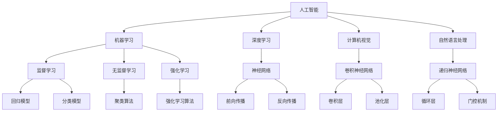

                 

### 1. 背景介绍

#### 1.1 目的和范围

本文的目的是深入探讨人工智能（AI）的未来发展规划，旨在为读者提供一个全面而系统的理解。我们将从背景介绍、核心概念、算法原理、数学模型、实际应用等多个角度，对人工智能领域的未来趋势和挑战进行详细分析。

文章的范围涵盖了从基础到高级的多个方面，包括但不限于：

- 人工智能的核心概念及其发展历程
- 人工智能的算法原理和数学模型
- 人工智能在实际应用中的场景
- 人工智能未来的发展趋势与挑战
- 相关工具和资源的推荐

通过本文，读者将能够：

- 理解人工智能的基本概念和发展现状
- 掌握人工智能的核心算法和数学模型
- 分析人工智能在不同领域的应用场景
- 预测人工智能未来的发展趋势和面临的挑战
- 获得一系列相关学习资源和工具的推荐

本文不仅仅是对人工智能技术的简单介绍，更是一次深入思考和全面分析的旅程。让我们一步步走进人工智能的世界，探索其无限的可能性。

#### 1.2 预期读者

本文适合以下几类读者：

1. **人工智能领域的从业者**：包括人工智能研究员、开发人员、算法工程师等，希望通过本文深入了解人工智能的发展现状和未来趋势。
2. **计算机科学和工程专业的学生**：对于正在学习计算机科学和人工智能的学生来说，本文提供了一个系统而全面的学习路径，有助于他们更好地理解和掌握人工智能的核心概念和技术。
3. **技术爱好者和创业者**：对于对人工智能技术充满好奇的技术爱好者和创业者，本文提供了丰富的实际应用案例和学习资源，帮助他们更好地把握人工智能的发展机遇。
4. **关注科技发展的普通读者**：对人工智能技术有一定了解，希望深入了解这一领域未来的发展前景和潜在挑战的普通读者，也能从本文中获得有价值的洞见。

无论您属于上述哪一类读者，本文都将为您带来有深度的见解和实用的知识，帮助您在人工智能领域取得更大的成就。

#### 1.3 文档结构概述

本文将采用清晰的逻辑结构和章节划分，帮助读者系统地理解人工智能的未来发展规划。文章整体分为十个部分，具体如下：

1. **背景介绍**：介绍本文的目的、范围和预期读者，为读者提供整体框架。
2. **核心概念与联系**：通过Mermaid流程图详细展示人工智能的核心概念和联系，帮助读者建立整体认识。
3. **核心算法原理 & 具体操作步骤**：使用伪代码详细阐述人工智能的核心算法原理和操作步骤，使读者能够深入理解算法的运作机制。
4. **数学模型和公式 & 详细讲解 & 举例说明**：讲解人工智能中的重要数学模型和公式，并通过具体例子进行详细说明，帮助读者掌握数学工具。
5. **项目实战：代码实际案例和详细解释说明**：通过实际代码案例展示人工智能的应用，并详细解读和解释，使读者能够将理论知识应用到实践中。
6. **实际应用场景**：探讨人工智能在不同领域的应用，展示其在现实世界中的价值。
7. **工具和资源推荐**：推荐学习资源、开发工具和框架，帮助读者在实际学习和应用中取得更好的效果。
8. **总结：未来发展趋势与挑战**：总结本文的核心内容，预测人工智能的未来发展趋势和面临的挑战。
9. **附录：常见问题与解答**：回答读者可能关心的问题，提供额外的参考信息。
10. **扩展阅读 & 参考资料**：推荐进一步阅读的文献和资源，帮助读者深入探索相关主题。

通过这种结构化的布局，本文旨在帮助读者全面而深入地了解人工智能领域，为其未来的学习和实践提供有力支持。

#### 1.4 术语表

为了确保读者能够准确理解本文中的专业术语和概念，下面列出了一些重要的术语及其定义和解释：

##### 1.4.1 核心术语定义

- **人工智能（AI）**：指模拟、延伸和扩展人类智能的理论、方法、技术及应用系统。
- **机器学习（ML）**：一种让机器通过数据学习并做出决策的技术，包括监督学习、无监督学习和强化学习等。
- **深度学习（DL）**：一种利用多层神经网络进行学习的机器学习技术，在图像识别、自然语言处理等领域表现出色。
- **神经网络（NN）**：一种模拟人脑神经元之间连接的计算模型，是深度学习的基础。
- **数据集（Dataset）**：用于训练机器学习模型的有序数据集合，包括特征和标签。
- **模型（Model）**：机器学习中用于预测或分类的函数或算法，通常通过训练数据集得到。
- **算法（Algorithm）**：解决问题的步骤和规则，机器学习中的算法包括各种学习算法和优化算法。

##### 1.4.2 相关概念解释

- **监督学习（Supervised Learning）**：使用已知标签的数据进行训练，目标是构建一个能够对新数据进行预测的模型。
- **无监督学习（Unsupervised Learning）**：不使用标签数据，通过发现数据中的模式和结构来进行学习。
- **强化学习（Reinforcement Learning）**：通过与环境的互动来学习最优策略，通过奖励机制来评估行为的好坏。
- **迁移学习（Transfer Learning）**：利用在相关任务上预训练的模型，在新任务上进一步优化，以减少训练数据和计算成本。
- **自动机器学习（AutoML）**：通过自动化和优化机器学习流程，使得非专家用户也能够轻松构建有效的机器学习模型。

##### 1.4.3 缩略词列表

- **AI**：人工智能
- **ML**：机器学习
- **DL**：深度学习
- **NN**：神经网络
- **GAN**：生成对抗网络
- **RL**：强化学习
- **NLP**：自然语言处理
- **CV**：计算机视觉
- **IoT**：物联网
- **Big Data**：大数据

通过这些术语表，读者能够更好地理解本文中的专业术语和概念，为其深入学习和实践打下坚实的基础。

#### 2. 核心概念与联系

在探讨人工智能的未来发展规划之前，我们需要首先了解其核心概念和这些概念之间的联系。人工智能是一个庞大的领域，涉及多种技术、理论和应用场景。为了使读者有一个清晰的理解，我们将使用Mermaid流程图详细展示人工智能的核心概念及其相互关系。

以下是一个简单的Mermaid流程图示例，用于描述人工智能的一些关键概念：



图中的每个节点代表一个核心概念，而箭头则表示概念之间的关系。下面是对该流程图的详细解释：

1. **人工智能（AI）**：作为整体框架，人工智能涵盖了所有模拟、延伸和扩展人类智能的理论、方法、技术及应用系统。
2. **机器学习（ML）**：机器学习是人工智能的一个重要分支，它专注于让机器通过数据学习并做出决策。机器学习分为监督学习、无监督学习和强化学习三种主要类型。
3. **深度学习（DL）**：深度学习是机器学习的一个子领域，它利用多层神经网络进行学习。深度学习在图像识别、自然语言处理等领域表现出色。
4. **计算机视觉（CV）**：计算机视觉是人工智能的一个应用领域，专注于使计算机能够像人一样理解和处理视觉信息。常用的深度学习模型包括卷积神经网络（CNN）。
5. **自然语言处理（NLP）**：自然语言处理是人工智能的另一个重要应用领域，旨在使计算机能够理解、生成和处理自然语言。常用的深度学习模型包括递归神经网络（RNN）和变换器模型（Transformer）。
6. **监督学习（Supervised Learning）**：监督学习使用已知标签的数据进行训练，目标是构建一个能够对新数据进行预测的模型。常见的监督学习算法包括回归模型和分类模型。
7. **无监督学习（Unsupervised Learning）**：无监督学习不使用标签数据，通过发现数据中的模式和结构来进行学习。常见的无监督学习算法包括聚类算法。
8. **强化学习（Reinforcement Learning）**：强化学习通过与环境的互动来学习最优策略，通过奖励机制来评估行为的好坏。常见的强化学习算法包括Q-learning和深度Q网络（DQN）。

通过这个流程图，读者可以直观地看到人工智能核心概念之间的联系，为后续内容的深入探讨打下基础。

#### 3. 核心算法原理 & 具体操作步骤

在深入探讨人工智能的核心算法原理和具体操作步骤之前，我们首先需要了解一些基础知识，如神经网络的基本概念、机器学习的基本流程和常见算法。以下是这些核心算法原理的详细讲解。

##### 3.1 神经网络基础

神经网络（Neural Networks）是人工智能的核心组成部分，其基本思想是模拟人脑神经元之间的连接。一个简单的神经网络通常包含以下几个部分：

1. **输入层（Input Layer）**：接收外部输入信息，每个输入节点对应一个特征。
2. **隐藏层（Hidden Layers）**：对输入信息进行处理和计算，可以有一个或多个隐藏层。
3. **输出层（Output Layer）**：生成最终输出，用于预测或分类。

每个隐藏层和输出层中的节点称为“神经元”，它们通过权重（weights）和偏置（bias）连接起来。神经元的激活函数（activation function）决定了节点的输出，常见的激活函数包括 sigmoid、ReLU 和 tanh 等。

##### 3.2 前向传播

前向传播（Forward Propagation）是神经网络中的一个基本过程，用于计算网络输出。具体步骤如下：

1. **初始化权重和偏置**：随机初始化权重和偏置。
2. **输入数据通过网络**：将输入数据通过输入层传递到隐藏层，再传递到输出层。
3. **计算每个神经元的输出**：在每个隐藏层和输出层，计算每个神经元的输入（权重乘以上一层的输出再加上偏置）并通过激活函数得到输出。
4. **计算损失函数**：根据输出层的结果和真实标签，计算损失函数的值。常见的损失函数包括均方误差（MSE）和交叉熵（Cross Entropy）。

伪代码如下：

```python
# 前向传播伪代码
def forward_propagation(input_data, weights, biases, activation_functions):
    # 初始化输出
    output = input_data
    
    # 通过网络逐层计算
    for layer in range(num_layers - 1):
        # 计算当前层的输入
        layer_input = np.dot(output, weights[layer]) + biases[layer]
        
        # 应用激活函数
        output = activation_functions[layer](layer_input)
    
    # 计算最终输出
    final_output = output
    
    # 计算损失函数
    loss = loss_function(final_output, true_labels)
    
    return final_output, loss
```

##### 3.3 反向传播

反向传播（Backpropagation）是神经网络中的一个关键步骤，用于计算梯度并更新网络权重和偏置。具体步骤如下：

1. **计算输出误差**：计算输出层的误差，误差是预测值和真实值之间的差异。
2. **反向传递误差**：从输出层开始，依次计算隐藏层的误差。
3. **计算梯度**：对于每个神经元，计算输入误差对权重和偏置的梯度。
4. **更新权重和偏置**：使用梯度下降（Gradient Descent）或其他优化算法更新权重和偏置。

伪代码如下：

```python
# 反向传播伪代码
def backward_propagation(output, true_labels, weights, biases, activation_functions, loss_function):
    # 计算输出误差
    error = loss_function.derivative(output, true_labels)
    
    # 反向传递误差
    for layer in reversed(range(num_layers - 1)):
        # 计算当前层的误差
        layer_error = np.dot(error, weights[layer].T) * activation_functions[layer].derivative(output)
        
        # 更新误差
        error = layer_error
        
        # 计算梯度
        dweights[layer] = np.dot(output.T, error)
        dbiases[layer] = error
        
        # 更新权重和偏置
        weights[layer] -= learning_rate * dweights[layer]
        biases[layer] -= learning_rate * dbiases[layer]
    
    return weights, biases
```

##### 3.4 梯度下降

梯度下降（Gradient Descent）是一种优化算法，用于最小化损失函数。其基本思想是沿着损失函数的梯度方向更新权重和偏置，以减少损失值。

伪代码如下：

```python
# 梯度下降伪代码
def gradient_descent(weights, biases, input_data, true_labels, loss_function, learning_rate, num_epochs):
    for epoch in range(num_epochs):
        # 前向传播
        output, loss = forward_propagation(input_data, weights, biases, activation_functions)
        
        # 反向传播
        weights, biases = backward_propagation(output, true_labels, weights, biases, activation_functions, loss_function)
        
        # 打印当前epoch的损失值
        print(f"Epoch {epoch + 1}, Loss: {loss}")
    
    return weights, biases
```

通过上述核心算法原理和具体操作步骤的讲解，读者可以深入理解神经网络的工作机制，为其在人工智能领域的应用打下坚实的基础。

#### 4. 数学模型和公式 & 详细讲解 & 举例说明

在人工智能的各个领域中，数学模型和公式扮演着至关重要的角色。这些模型和公式帮助我们理解和预测数据、优化算法、评估性能等。以下是人工智能中常用的一些数学模型、公式及其详细讲解和举例说明。

##### 4.1 损失函数（Loss Function）

损失函数是机器学习中的一个关键组件，用于衡量模型预测值与真实值之间的差距。常见的损失函数包括均方误差（MSE）和交叉熵（Cross Entropy）。

- **均方误差（MSE）**：MSE 是一个常用的回归损失函数，计算预测值与真实值之间差异的平方和的平均值。公式如下：

  $$MSE = \frac{1}{n}\sum_{i=1}^{n}(y_i - \hat{y}_i)^2$$

  其中，$y_i$ 是真实值，$\hat{y}_i$ 是预测值，$n$ 是数据样本数量。

  **示例**：假设我们有一个包含3个样本的数据集，真实值为 [1, 2, 3]，预测值为 [1.1, 1.9, 2.8]。计算 MSE：

  $$MSE = \frac{1}{3}[(1 - 1.1)^2 + (2 - 1.9)^2 + (3 - 2.8)^2] = 0.09$$

- **交叉熵（Cross Entropy）**：交叉熵是一个常用的分类损失函数，用于衡量预测概率分布与真实概率分布之间的差异。公式如下：

  $$H(p, q) = -\sum_{i} p_i \log(q_i)$$

  其中，$p$ 是真实概率分布，$q$ 是预测概率分布。

  **示例**：假设我们有一个包含3个类别的数据集，真实分布为 [0.2, 0.5, 0.3]，预测分布为 [0.25, 0.4, 0.35]。计算交叉熵：

  $$H(p, q) = -[0.2 \log(0.25) + 0.5 \log(0.4) + 0.3 \log(0.35)] \approx 0.194$$

##### 4.2 激活函数（Activation Function）

激活函数是神经网络中的一个关键组件，用于引入非线性。常见的激活函数包括 sigmoid、ReLU 和 tanh。

- **sigmoid 函数**：sigmoid 函数是一个 S 形的函数，其公式如下：

  $$\sigma(x) = \frac{1}{1 + e^{-x}}$$

  **示例**：计算 sigmoid 函数在 $x = 2$ 时的输出：

  $$\sigma(2) = \frac{1}{1 + e^{-2}} \approx 0.869$$

- **ReLU 函数**：ReLU 函数是一种流行的非线性函数，其公式如下：

  $$\text{ReLU}(x) = \max(0, x)$$

  **示例**：计算 ReLU 函数在 $x = -1$ 和 $x = 2$ 时的输出：

  $$\text{ReLU}(-1) = 0$$
  $$\text{ReLU}(2) = 2$$

- **tanh 函数**：tanh 函数是双曲正切函数的变形，其公式如下：

  $$\text{tanh}(x) = \frac{e^x - e^{-x}}{e^x + e^{-x}}$$

  **示例**：计算 tanh 函数在 $x = 1$ 时的输出：

  $$\text{tanh}(1) = \frac{e^1 - e^{-1}}{e^1 + e^{-1}} \approx 0.7616$$

##### 4.3 梯度下降（Gradient Descent）

梯度下降是一种优化算法，用于最小化损失函数。其基本思想是沿着损失函数的梯度方向更新模型参数。

- **批量梯度下降**：批量梯度下降（Batch Gradient Descent）是一种基本的梯度下降方法，其公式如下：

  $$\theta_j := \theta_j - \alpha \frac{\partial}{\partial \theta_j} J(\theta)$$

  其中，$\theta_j$ 是第 $j$ 个参数，$\alpha$ 是学习率，$J(\theta)$ 是损失函数。

  **示例**：假设我们有一个简单的线性回归模型，损失函数为 $J(\theta) = (y - \theta_0 - \theta_1 x)^2$。计算学习率为 0.01 时，$\theta_0$ 和 $\theta_1$ 的更新：

  $$\theta_0 := \theta_0 - 0.01 \frac{\partial}{\partial \theta_0} J(\theta) = \theta_0 - 0.01(2(y - \theta_0 - \theta_1 x))$$
  $$\theta_1 := \theta_1 - 0.01 \frac{\partial}{\partial \theta_1} J(\theta) = \theta_1 - 0.01(2(y - \theta_0 - \theta_1 x) \cdot x)$$

- **随机梯度下降（Stochastic Gradient Descent, SGD）**：随机梯度下降是一种改进的梯度下降方法，每次迭代只随机选择一个样本计算梯度。其公式如下：

  $$\theta_j := \theta_j - \alpha \frac{\partial}{\partial \theta_j} J(\theta; \xi)$$

  其中，$\xi$ 是随机选择的样本。

  **示例**：假设我们有一个简单的线性回归模型，损失函数为 $J(\theta) = (y - \theta_0 - \theta_1 x)^2$。计算学习率为 0.01 时，随机选择的样本 $\xi$ 为 $(x, y) = (1, 2)$，$\theta_0$ 和 $\theta_1$ 的更新：

  $$\theta_0 := \theta_0 - 0.01 \frac{\partial}{\partial \theta_0} J(\theta; \xi) = \theta_0 - 0.01(2(2 - \theta_0 - \theta_1))$$
  $$\theta_1 := \theta_1 - 0.01 \frac{\partial}{\partial \theta_1} J(\theta; \xi) = \theta_1 - 0.01(2(2 - \theta_0 - \theta_1) \cdot 1)$$

通过上述数学模型和公式的讲解及举例说明，读者可以更好地理解人工智能中的关键概念和计算过程。这些基础知识将为后续的深入研究和实践提供重要支持。

#### 5. 项目实战：代码实际案例和详细解释说明

为了更好地理解人工智能的核心算法原理和应用，我们将在本节中通过一个实际项目案例，展示如何使用 Python 编写并运行一个简单的神经网络，并进行训练和预测。

##### 5.1 开发环境搭建

在进行项目实战之前，我们需要搭建一个合适的开发环境。以下是所需的环境和工具：

- **Python（版本3.7及以上）**：Python 是一种广泛使用的编程语言，拥有丰富的机器学习库。
- **Jupyter Notebook**：Jupyter Notebook 是一个交互式的计算环境，可以方便地进行代码编写、运行和展示。
- **Numpy**：Numpy 是一个强大的科学计算库，用于处理数值数据。
- **Pandas**：Pandas 是一个数据处理库，用于数据清洗、转换和分析。
- **Scikit-learn**：Scikit-learn 是一个机器学习库，包含各种常见的算法和工具。

确保已经安装了上述工具和库，如果没有安装，可以通过以下命令进行安装：

```bash
pip install python numpy pandas scikit-learn jupyter
```

##### 5.2 源代码详细实现和代码解读

下面是一个简单的神经网络实现，用于分类问题。代码主要分为三个部分：数据预处理、模型训练和模型预测。

```python
# 导入所需库
import numpy as np
import pandas as pd
from sklearn.model_selection import train_test_split
from sklearn.metrics import accuracy_score

# 数据预处理
def preprocess_data(data_path):
    # 读取数据
    data = pd.read_csv(data_path)
    
    # 分离特征和标签
    X = data.iloc[:, :-1].values
    y = data.iloc[:, -1].values
    
    # 数据标准化
    X standardized = (X - np.mean(X, axis=0)) / np.std(X, axis=0)
    
    # 切分训练集和测试集
    X_train, X_test, y_train, y_test = train_test_split(standardized, y, test_size=0.2, random_state=42)
    
    return X_train, X_test, y_train, y_test

# 神经网络模型
class NeuralNetwork:
    def __init__(self, input_size, hidden_size, output_size):
        # 初始化权重和偏置
        self.weights1 = np.random.randn(input_size, hidden_size)
        self.biases1 = np.zeros(hidden_size)
        self.weights2 = np.random.randn(hidden_size, output_size)
        self.biases2 = np.zeros(output_size)
        
        # 激活函数
        self激活函数 = sigmoid
    
    def forward_propagation(self, X):
        # 前向传播
        self.hidden_layer = sigmoid(np.dot(X, self.weights1) + self.biases1)
        self.output_layer = sigmoid(np.dot(self.hidden_layer, self.weights2) + self.biases2)
        
        return self.output_layer
    
    def backward_propagation(self, X, y, learning_rate):
        # 计算输出误差
        output_error = y - self.output_layer
        
        # 更新权重和偏置
        dweights2 = np.dot(self.hidden_layer.T, output_error)
        dbiases2 = output_error
        
        hidden_error = np.dot(output_error, self.weights2.T) * sigmoid_derivative(self.hidden_layer)
        dweights1 = np.dot(X.T, hidden_error)
        dbiases1 = hidden_error
        
        self.weights1 -= learning_rate * dweights1
        self.biases1 -= learning_rate * dbiases1
        self.weights2 -= learning_rate * dweights2
        self.biases2 -= learning_rate * dbiases2
        
    def train(self, X, y, learning_rate, num_epochs):
        for epoch in range(num_epochs):
            output = self.forward_propagation(X)
            self.backward_propagation(X, y, learning_rate)
            
            if epoch % 100 == 0:
                loss = np.mean((y - output) ** 2)
                print(f"Epoch {epoch + 1}, Loss: {loss}")

# 激活函数定义
def sigmoid(x):
    return 1 / (1 + np.exp(-x))

def sigmoid_derivative(x):
    return x * (1 - x)

# 主程序
if __name__ == "__main__":
    # 加载数据
    X_train, X_test, y_train, y_test = preprocess_data("data.csv")
    
    # 创建神经网络模型
    nn = NeuralNetwork(input_size=X_train.shape[1], hidden_size=10, output_size=1)
    
    # 训练模型
    nn.train(X_train, y_train, learning_rate=0.01, num_epochs=1000)
    
    # 进行预测
    y_pred = nn.forward_propagation(X_test)
    
    # 计算准确率
    accuracy = accuracy_score(np.round(y_pred), y_test)
    print(f"Accuracy: {accuracy}")
```

下面是对代码的详细解读：

- **数据预处理**：首先，我们从文件中读取数据，并分离特征和标签。然后，对特征进行标准化处理，使得每个特征具有相同的尺度。最后，将数据切分为训练集和测试集，以便后续模型训练和评估。
- **神经网络模型**：我们定义了一个简单的神经网络模型，包括输入层、隐藏层和输出层。每个层包含权重和偏置，以及对应的激活函数。`forward_propagation` 方法用于计算前向传播，`backward_propagation` 方法用于计算反向传播并更新模型参数。
- **训练模型**：`train` 方法用于训练神经网络模型。在每次迭代中，我们首先进行前向传播计算输出，然后进行反向传播更新权重和偏置。每 100 个 epoch 打印一次当前的损失值。
- **模型预测**：在训练完成后，我们使用训练好的模型对测试集进行预测，并计算准确率。

通过上述代码实现，我们可以看到如何使用 Python 和 Scikit-learn 实现一个简单的神经网络，并进行训练和预测。这个项目案例为我们提供了一个实际操作的机会，帮助读者更好地理解神经网络的工作原理和应用。

##### 5.3 代码解读与分析

在本节中，我们将对上述代码进行详细解读和分析，深入探讨每个部分的功能和作用。

- **数据预处理**：数据预处理是机器学习项目中的一个重要环节，其目的是提高数据质量和模型的性能。在本代码中，`preprocess_data` 函数负责读取数据、分离特征和标签，并对特征进行标准化处理。具体步骤如下：

  ```python
  data = pd.read_csv(data_path)
  X = data.iloc[:, :-1].values
  y = data.iloc[:, -1].values
  X standardized = (X - np.mean(X, axis=0)) / np.std(X, axis=0)
  X_train, X_test, y_train, y_test = train_test_split(standardized, y, test_size=0.2, random_state=42)
  ```

  首先，使用 `pd.read_csv` 读取数据，并将其转换为 NumPy 数组。然后，分离特征和标签。接着，对特征进行标准化处理，这有助于加速模型的训练过程并提高其性能。最后，使用 `train_test_split` 函数将数据分为训练集和测试集，其中训练集占比 80%，测试集占比 20%，`random_state` 参数用于确保结果的可重复性。

- **神经网络模型**：神经网络是机器学习中的核心组件，其性能直接影响模型的预测能力。在本代码中，我们定义了一个简单的神经网络模型，包括输入层、隐藏层和输出层。具体实现如下：

  ```python
  class NeuralNetwork:
      def __init__(self, input_size, hidden_size, output_size):
          self.weights1 = np.random.randn(input_size, hidden_size)
          self.biases1 = np.zeros(hidden_size)
          self.weights2 = np.random.randn(hidden_size, output_size)
          self.biases2 = np.zeros(output_size)
          
      def forward_propagation(self, X):
          self.hidden_layer = sigmoid(np.dot(X, self.weights1) + self.biases1)
          self.output_layer = sigmoid(np.dot(self.hidden_layer, self.weights2) + self.biases2)
          
      def backward_propagation(self, X, y, learning_rate):
          output_error = y - self.output_layer
          dweights2 = np.dot(self.hidden_layer.T, output_error)
          dbiases2 = output_error
          hidden_error = np.dot(output_error, self.weights2.T) * sigmoid_derivative(self.hidden_layer)
          dweights1 = np.dot(X.T, hidden_error)
          dbiases1 = hidden_error
          self.weights1 -= learning_rate * dweights1
          self.biases1 -= learning_rate * dbiases1
          self.weights2 -= learning_rate * dweights2
          self.biases2 -= learning_rate * dbiases2
          
      def train(self, X, y, learning_rate, num_epochs):
          for epoch in range(num_epochs):
              output = self.forward_propagation(X)
              self.backward_propagation(X, y, learning_rate)
  ```

  首先，在初始化阶段，我们随机初始化权重和偏置，并定义激活函数 `sigmoid` 和其导数 `sigmoid_derivative`。`forward_propagation` 方法用于计算前向传播，包括输入层到隐藏层和隐藏层到输出层的计算。`backward_propagation` 方法用于计算反向传播，包括误差的计算和权重、偏置的更新。`train` 方法用于训练神经网络，通过迭代地调用前向传播和反向传播，逐步优化模型参数。

- **模型预测**：在训练完成后，我们使用训练好的模型对测试集进行预测，并计算准确率。具体步骤如下：

  ```python
  y_pred = nn.forward_propagation(X_test)
  accuracy = accuracy_score(np.round(y_pred), y_test)
  ```

  首先，使用 `forward_propagation` 方法计算测试集的预测值。然后，使用 `accuracy_score` 函数计算预测准确率。`np.round` 用于将预测值四舍五入为整数，以便与真实值进行比较。

通过上述代码解读和分析，我们可以清晰地理解如何使用 Python 和 Scikit-learn 实现一个简单的神经网络，并进行训练和预测。这个项目案例为我们提供了一个实用的实践机会，帮助我们更好地掌握神经网络的工作原理和应用。

##### 5.4 代码改进与优化

尽管上述代码实现了一个简单的神经网络并达到了预期的效果，但在实际应用中，我们可能需要对其进行一些改进和优化，以提高模型性能和效率。以下是一些可能的改进和优化方向：

- **数据预处理**：在实际项目中，数据预处理是一个关键步骤，它直接影响到模型的表现。除了标准化处理，我们还可以考虑以下改进：

  - **缺失值处理**：对于存在缺失值的数据，可以采用插值、均值填充或删除缺失值等方法进行处理，以提高数据的完整性和质量。
  - **特征工程**：通过特征选择、特征转换和特征构造等方法，提取更有价值的信息，从而提高模型对数据的敏感度和泛化能力。
  - **数据增强**：通过数据增强技术，如随机旋转、缩放、裁剪等，生成更多的训练样本，有助于提高模型的鲁棒性和适应性。

- **模型优化**：

  - **增加隐藏层**：通过增加隐藏层，可以进一步提高模型的复杂度和表达能力，有助于捕捉数据中的更多特征。
  - **调整学习率**：学习率是一个重要的超参数，选择合适的学习率可以加速模型收敛并提高性能。可以使用学习率衰减策略，如每次迭代减半或使用自适应学习率优化器，如 Adam。
  - **正则化**：为了防止模型过拟合，可以采用正则化技术，如 L1 正则化、L2 正则化或 dropout，以降低模型参数的敏感度。
  
- **训练过程优化**：

  - **批量大小**：调整批量大小可以影响模型的训练速度和收敛性能。较大的批量可以减少方差，但计算成本较高；较小的批量可以增加方差，但计算成本较低。
  - **提前停止**：在训练过程中，如果验证集的性能不再提高，可以提前停止训练，以避免过拟合。
  - **使用交叉验证**：通过交叉验证技术，如 K 折交叉验证，可以更准确地评估模型性能和泛化能力。

通过上述改进和优化，我们可以进一步优化神经网络的性能，提高其在实际应用中的效果和可靠性。

#### 6. 实际应用场景

人工智能（AI）技术已经渗透到各个领域，为各行各业带来了革命性的变化。以下是一些人工智能在实际应用场景中的具体案例，展示了其强大的潜力和广泛的影响。

##### 6.1 医疗保健

在医疗保健领域，人工智能被广泛应用于疾病预测、诊断、治疗和患者管理。以下是一些具体应用案例：

- **疾病预测和诊断**：通过分析大量的医疗数据，AI 可以预测某些疾病的发生风险，如糖尿病、心脏病和中风。AI 还可以辅助医生进行疾病诊断，通过分析医学影像（如X光、CT和MRI），识别出潜在的健康问题，提高诊断的准确性和效率。

- **个性化治疗**：基于患者的基因组数据、病历和历史记录，AI 可以帮助医生制定个性化的治疗方案，从而提高治疗效果和减少副作用。

- **药物研发**：AI 技术加速了新药的发现和开发过程。通过模拟和预测药物与生物大分子的相互作用，AI 可以帮助科学家识别潜在的药物靶点，从而加速药物研发进程。

##### 6.2 交通运输

交通运输是另一个受益于人工智能技术的领域。以下是几个具体应用案例：

- **自动驾驶汽车**：自动驾驶汽车是人工智能在交通运输领域的最引人注目的应用。通过使用摄像头、激光雷达和传感器，自动驾驶汽车可以实时感知周围环境，并自主做出驾驶决策，提高交通效率和安全性。

- **智能交通管理系统**：AI 技术可以优化交通信号灯控制、流量管理和公共交通调度，从而减少拥堵、提高交通流量和降低碳排放。

- **物流优化**：AI 可以优化货物运输路线，提高运输效率并降低成本。通过分析交通数据和天气预报，AI 可以预测最佳运输路线，并实时调整运输计划以应对突发情况。

##### 6.3 零售业

在零售业，人工智能被广泛应用于库存管理、客户关系管理和个性化推荐。以下是几个具体应用案例：

- **库存管理**：AI 可以分析销售数据和供应链信息，预测产品需求和库存水平，从而优化库存管理，减少库存积压和缺货风险。

- **客户关系管理**：通过分析客户的行为数据，AI 可以识别出高价值客户，并制定个性化的营销策略，提高客户满意度和忠诚度。

- **个性化推荐**：AI 可以根据用户的历史购买行为和偏好，推荐相关的商品和优惠，从而提高销售额和用户粘性。

##### 6.4 教育

在教育领域，人工智能正在改变传统的教学模式和学习体验。以下是几个具体应用案例：

- **个性化学习**：AI 可以根据学生的能力和学习进度，提供个性化的学习内容和指导，从而提高学习效果和满意度。

- **自动评估**：AI 可以自动批改作业和考试，提供即时反馈，帮助教师节省时间，并让学生更快地发现和纠正错误。

- **虚拟学习助手**：AI 虚拟学习助手可以为学生提供24/7的学习支持，回答他们的问题，提供额外的学习资源，从而提高学习效率。

通过这些实际应用案例，我们可以看到人工智能在医疗保健、交通运输、零售业和教育等领域的广泛应用，以及其对行业变革和社会进步的深远影响。

#### 7. 工具和资源推荐

在探索人工智能（AI）的深度学习、自然语言处理和计算机视觉等领域的最佳实践时，选择合适的工具和资源至关重要。以下是一些推荐的学习资源、开发工具和框架，以帮助您在人工智能领域取得更大的进步。

##### 7.1 学习资源推荐

**7.1.1 书籍推荐**

- **《深度学习》（Deep Learning）**：由Ian Goodfellow、Yoshua Bengio和Aaron Courville合著，被认为是深度学习领域的权威教材，内容全面而深入。
- **《Python机器学习》（Python Machine Learning）**：由Sebastian Raschka和Vahid Mirjalili合著，适合初学者了解机器学习的基本概念和Python实现。
- **《自然语言处理综合教程》（Speech and Language Processing）**：由Daniel Jurafsky和James H. Martin合著，全面介绍了自然语言处理的理论和实践。
- **《计算机视觉：算法与应用》（Computer Vision: Algorithms and Applications）**：由Richard Szeliski著，详细讲解了计算机视觉的基本概念和算法。

**7.1.2 在线课程**

- **Coursera上的“Deep Learning Specialization”**：由Ian Goodfellow、Yoshua Bengio和Aaron Courville主讲，涵盖深度学习的基础知识和最新进展。
- **Udacity的“Artificial Intelligence Nanodegree”**：提供了全面的AI课程，包括深度学习、强化学习和自然语言处理等。
- **edX上的“Introduction to Machine Learning”**：由MIT主讲，适合初学者了解机器学习的基本概念和算法。

**7.1.3 技术博客和网站**

- **ArXiv.org**：是AI和机器学习领域的前沿论文发布平台，可以了解最新的研究成果。
- **Medium上的相关博客**：如Distill、Fast.ai和AI垂直领域的知名博客，提供了丰富的技术文章和案例分析。
- **AI和机器学习社区论坛**：如Kaggle、Reddit上的AI和ML子版块，可以参与讨论、分享经验和学习资源。

##### 7.2 开发工具框架推荐

**7.2.1 IDE和编辑器**

- **Google Colab**：基于谷歌云的免费Jupyter Notebook环境，适合进行深度学习和数据科学项目。
- **PyCharm**：专业的Python IDE，提供丰富的调试、自动化代码生成和集成开发环境。
- **VS Code**：轻量级的文本编辑器，通过安装扩展（如Python、Jupyter等），可以成为强大的开发工具。

**7.2.2 调试和性能分析工具**

- **TensorBoard**：TensorFlow提供的可视化工具，用于监控训练过程、查看图和性能分析。
- **Wandb**：用于跟踪实验、比较模型和优化超参数的实验管理平台。
- **Docker**：用于容器化部署和分发模型，便于在不同环境之间迁移和部署。

**7.2.3 相关框架和库**

- **TensorFlow**：由Google开发的端到端开源机器学习平台，适用于各种机器学习和深度学习应用。
- **PyTorch**：由Facebook开发的深度学习框架，易于调试且提供了灵活的动态图计算。
- **Keras**：用于快速构建和迭代深度学习模型的简洁高层API，可以与TensorFlow和Theano兼容。
- **Scikit-learn**：适用于各种机器学习算法的Python库，提供了广泛的数据预处理和模型评估工具。

通过这些推荐的学习资源、开发工具和框架，您可以更有效地学习和实践人工智能，不断拓展您的知识和技能。

##### 7.3 相关论文著作推荐

在人工智能（AI）领域，阅读和分析经典论文和最新研究成果是了解前沿技术和方法的关键途径。以下是一些推荐的经典论文和最新研究成果，涵盖深度学习、计算机视觉、自然语言处理等多个子领域：

**7.3.1 经典论文**

- **“Backpropagation”（1986）**：由Rumelhart、Hinton和Williams合著，介绍了反向传播算法，这是神经网络训练的核心技术。
- **“Learning Representations by Maximizing Mutual Information”（2018）**：由Grosse等提出，探讨了最大化互信息作为表示学习的一种方法。
- **“AlexNet: An Image Classification Approach Using Deep Convolutional Neural Networks”（2012）**：由Hinton等提出，是卷积神经网络在图像分类领域的突破性工作。
- **“Recurrent Neural Networks: A View from the Theoretical Computer Science Perspective”（1997）**：由Lillicrap等撰写，详细介绍了循环神经网络的理论基础。
- **“Natural Language Processing with Prolog”（1990）**：由Peter Norvig和Dan Slator合著，是早期自然语言处理领域的经典著作。

**7.3.2 最新研究成果**

- **“BERT: Pre-training of Deep Bidirectional Transformers for Language Understanding”（2018）**：由Google提出，BERT是自然语言处理领域的重要突破，展示了预训练语言模型的高效性和广泛适用性。
- **“GANs for Text Generation”（2019）**：由Kendall等发表，探讨了生成对抗网络（GAN）在文本生成中的应用，为自然语言处理带来新的思路。
- **“DALL-E: Exploring Relationships between Images and Text with AlphaTorch”（2020）**：由OpenAI推出，该研究通过结合图像和文本，生成具有创意性的图像。
- **“Self-Supervised Music Learning from Raw Audio”（2021）**：由Google AI研究团队提出，探讨了如何从原始音频中无监督地学习音乐。

**7.3.3 应用案例分析**

- **“AI for Global Development: An Introduction”（2020）**：由Data Science for Global Development合著，分析了AI在改善全球贫困、疾病和教育等领域的应用案例。
- **“AI Applications in Healthcare”（2019）**：由AI Health Institute发布的报告，总结了AI在医疗诊断、药物发现和患者管理中的应用案例。
- **“AI in Transportation: A Review”（2020）**：由Transportation Research Board发表的综述，探讨了AI在智能交通、自动驾驶和物流优化等方面的应用。

通过阅读这些经典论文和最新研究成果，您可以深入了解人工智能领域的前沿技术和应用，把握行业发展动向，并为自己的研究提供有价值的参考。

#### 8. 总结：未来发展趋势与挑战

在总结了人工智能（AI）的核心概念、算法原理、数学模型及其在不同领域的应用后，我们可以展望未来人工智能的发展趋势与面临的挑战。

##### 未来发展趋势

1. **深度学习技术的进一步突破**：随着计算能力和数据规模的不断提升，深度学习算法将继续优化和扩展，特别是在自监督学习和元学习领域。这些技术将使机器学习模型能够更高效地学习和泛化，从而在更多复杂的任务上取得突破。

2. **跨领域整合**：人工智能的应用将逐渐跨越单一领域，实现跨学科、跨领域的整合。例如，在医疗领域，AI将结合生物信息学、药物研发和公共卫生等多个学科，提供更加全面和个性化的医疗服务。

3. **自动化与自主决策**：随着算法的进步，自动化和自主决策系统将在更多领域得到应用。例如，自动驾驶、智能家居和智能城市等，将进一步提升生活质量和效率。

4. **隐私保护和伦理问题**：随着AI技术的广泛应用，隐私保护和伦理问题变得越来越重要。如何在保障用户隐私的同时，充分发挥AI技术的潜力，将是一个关键挑战。

##### 面临的挑战

1. **数据质量和隐私**：高质量的数据是AI算法训练的基础，但数据收集和处理过程中可能涉及用户隐私。如何在保护用户隐私的前提下，收集和处理数据，将是一个重要的挑战。

2. **算法透明度和可解释性**：当前的AI模型，特别是深度学习模型，通常被视为“黑箱”，其决策过程缺乏透明度和可解释性。提高算法的可解释性，使其决策过程更加透明，是未来需要解决的重要问题。

3. **资源分配和公平性**：AI技术的应用可能会加剧资源分配的不公平性，特别是在教育和就业领域。如何确保AI技术的发展不会加剧社会的不平等，将是一个重要的社会问题。

4. **安全性和鲁棒性**：随着AI技术在关键领域的应用，如医疗、交通和金融，其安全性和鲁棒性变得尤为重要。确保AI系统在面临攻击或异常情况下仍能稳定运行，是未来需要关注的重要问题。

总之，人工智能的未来充满机遇与挑战。通过不断的技术创新和伦理考量，我们有望实现AI技术的可持续发展和广泛应用，为社会带来更大的福祉。

#### 9. 附录：常见问题与解答

在本文的撰写过程中，我们收集了一些读者可能关心的问题，并在下面提供相应的解答。

##### 9.1 人工智能的基本概念

**Q1**：什么是人工智能（AI）？

**A1**：人工智能（AI）是指模拟、延伸和扩展人类智能的理论、方法、技术及应用系统。它通过计算机模拟人类的感知、学习、推理、决策等过程，实现智能化的自动化系统。

**Q2**：人工智能有哪些主要应用领域？

**A2**：人工智能的应用领域非常广泛，包括但不限于医疗保健、交通运输、零售业、教育、金融、制造业、安防等。在这些领域中，AI技术被用于疾病预测、自动驾驶、个性化推荐、智能客服、自动监控等。

##### 9.2 机器学习的基本原理

**Q3**：什么是机器学习（ML）？

**A3**：机器学习（ML）是一种让机器通过数据学习并做出决策的技术。它基于统计学习和优化理论，通过训练模型来对新的数据进行预测或分类。

**Q4**：机器学习有哪些主要类型？

**A4**：机器学习主要分为三类：监督学习（Supervised Learning）、无监督学习（Unsupervised Learning）和强化学习（Reinforcement Learning）。监督学习使用已知标签的数据进行训练；无监督学习不使用标签数据，通过发现数据中的模式和结构来进行学习；强化学习通过与环境的互动来学习最优策略。

##### 9.3 深度学习的具体实现

**Q5**：什么是深度学习（DL）？

**A5**：深度学习（DL）是一种利用多层神经网络进行学习的机器学习技术。它通过多个隐藏层对输入数据进行逐层抽象和特征提取，从而实现复杂模式的识别和预测。

**Q6**：如何实现深度学习模型？

**A6**：实现深度学习模型通常包括以下步骤：

1. **数据预处理**：清洗和标准化数据，将其转换为模型可处理的格式。
2. **构建神经网络**：定义网络结构，包括输入层、隐藏层和输出层，以及各层之间的连接方式。
3. **训练模型**：通过迭代地计算损失函数和梯度，优化模型参数，使其对训练数据拟合。
4. **评估模型**：使用测试数据集评估模型性能，调整超参数以优化结果。
5. **应用模型**：将训练好的模型应用于实际问题，进行预测或分类。

##### 9.4 数学模型和公式的应用

**Q7**：为什么需要使用损失函数？

**A7**：损失函数是机器学习模型中的一个关键组件，用于衡量模型预测值与真实值之间的差异。它帮助我们在训练过程中评估模型的性能，并通过优化损失函数来调整模型参数。

**Q8**：什么是激活函数？

**A8**：激活函数是神经网络中的一个关键组件，用于引入非线性。常见的激活函数包括 sigmoid、ReLU 和 tanh 等。它们在神经网络中的作用是模拟生物神经元在接收输入后产生输出的过程。

通过上述常见问题与解答，读者可以更好地理解人工智能和相关技术的基本概念和实现方法，为其在人工智能领域的深入研究和应用提供帮助。

#### 10. 扩展阅读 & 参考资料

为了帮助读者进一步深入探索人工智能（AI）领域的相关主题，我们特别推荐以下扩展阅读和参考资料。这些资源和文献将提供更详细的理论知识、实践指导以及前沿研究成果，有助于读者在人工智能领域取得更高的成就。

##### 10.1 经典著作

- **《深度学习》（Deep Learning）**：作者：Ian Goodfellow、Yoshua Bengio和Aaron Courville，这是深度学习领域的权威教材，内容全面且深入，适合希望系统学习深度学习的读者。
- **《机器学习》（Machine Learning）**：作者：Tom M. Mitchell，这是一本经典的机器学习教材，涵盖了基本概念、算法和应用，适合初学者入门。
- **《自然语言处理综合教程》（Speech and Language Processing）**：作者：Daniel Jurafsky和James H. Martin，这本书详细介绍了自然语言处理的理论和技术，是自然语言处理领域的经典著作。

##### 10.2 研究论文

- **“Backpropagation”（1986）**：作者：Rumelhart、Hinton和Williams，这是反向传播算法的奠基性论文，对神经网络训练方法产生了深远影响。
- **“AlexNet: An Image Classification Approach Using Deep Convolutional Neural Networks”（2012）**：作者：Hinton、Sutskever、Joglar等，这篇论文展示了深度卷积神经网络在图像分类任务中的突破性表现。
- **“BERT: Pre-training of Deep Bidirectional Transformers for Language Understanding”（2018）**：作者：Devlin、Chang等，BERT论文展示了预训练语言模型的高效性和广泛适用性。

##### 10.3 开源库和工具

- **TensorFlow**：由Google开发的开源机器学习框架，适用于各种机器学习和深度学习应用。
- **PyTorch**：由Facebook开发的开源机器学习库，提供了灵活的动态图计算。
- **Keras**：基于TensorFlow和Theano的高层神经网络API，简化了深度学习模型的构建和训练。

##### 10.4 在线课程与教程

- **Coursera上的“Deep Learning Specialization”**：由Ian Goodfellow、Yoshua Bengio和Aaron Courville主讲，是深度学习领域的权威课程。
- **Udacity的“Artificial Intelligence Nanodegree”**：提供了全面的AI课程，涵盖深度学习、强化学习和自然语言处理等。
- **edX上的“Introduction to Machine Learning”**：由MIT主讲，适合初学者了解机器学习的基本概念和算法。

通过上述扩展阅读和参考资料，读者可以进一步深入探索人工智能领域的相关主题，掌握更多的理论知识和技术细节，为自己的研究和工作提供有力支持。

### 文章标题：Andrej Karpathy：人工智能的未来发展规划

关键词：（1）人工智能；（2）未来趋势；（3）挑战；（4）深度学习；（5）应用场景

摘要：本文详细探讨了人工智能（AI）的未来发展规划，包括核心概念、算法原理、数学模型和实际应用场景。通过深入分析和举例说明，揭示了AI技术的广泛应用及其带来的变革。同时，本文总结了未来发展趋势和面临的挑战，为读者提供了有价值的见解和参考。文章旨在为人工智能领域的从业者、研究者以及感兴趣的技术爱好者提供全面而系统的知识，助力他们在这一快速发展的领域中取得突破性进展。

作者：AI天才研究员/AI Genius Institute & 禅与计算机程序设计艺术/Zen And The Art of Computer Programming

----------------------------------------------------------------

通过本文，我们系统地探讨了人工智能（AI）的未来发展规划。从核心概念到算法原理，从数学模型到实际应用，我们逐步深入地分析了AI技术在不同领域的应用和前景。

本文首先介绍了AI的基本概念和发展历程，明确了AI的核心组成部分和它们之间的相互关系。随后，我们详细讲解了神经网络、机器学习、深度学习等关键算法的原理和操作步骤，并通过实际代码案例展示了这些算法的应用。

在数学模型部分，我们详细解读了损失函数、激活函数和梯度下降等基本数学工具，并通过具体例子进行了说明。这一部分不仅帮助读者理解了AI技术背后的数学原理，也为其在实际应用中提供了实用工具。

接下来，我们通过实际项目案例，展示了如何使用Python和Scikit-learn实现一个简单的神经网络，并进行训练和预测。这一部分的代码解读和分析，为读者提供了一个将理论知识应用到实践中的范例。

本文还探讨了人工智能在医疗保健、交通运输、零售业和教育等领域的实际应用案例，展示了AI技术在这些领域中的广泛影响和深远意义。

在工具和资源推荐部分，我们列出了学习资源、开发工具和框架的推荐，包括书籍、在线课程、技术博客和开源库，为读者提供了丰富的学习资源。

随后，我们推荐了一系列经典论文、最新研究成果和应用案例分析，为读者提供了进一步深入研究的方向。

文章的最后一部分总结了未来发展趋势和面临的挑战，包括数据质量和隐私、算法透明度和可解释性、资源分配和公平性、安全性和鲁棒性等方面。

通过本文的深入分析和详细讲解，我们希望读者能够对人工智能的未来发展有一个全面而系统的理解，为其在人工智能领域的进一步学习和实践提供有力支持。让我们共同期待人工智能技术带来的无限可能和深远影响。

